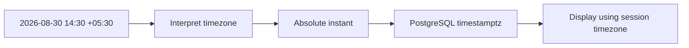
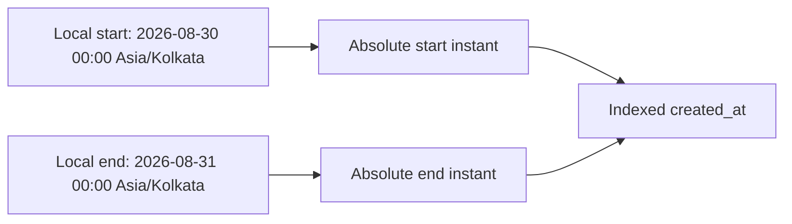
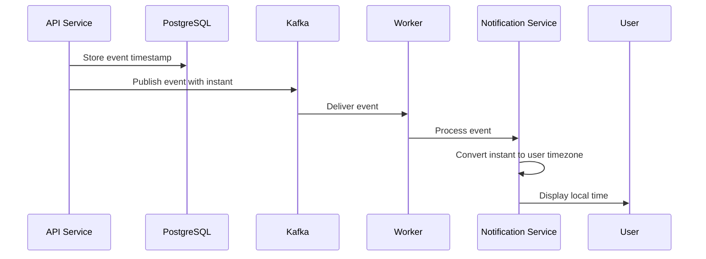

# 03- Time Zones

## Overview

Time zones are a data-modeling concern, not merely a formatting concern. Backend systems frequently operate across regions, while databases, application servers, workers, queues, and clients may all use different timezone settings.

The core distinction is between:

- **An instant** — a unique point on the global timeline.
- **A local date/time** — a wall-clock value meaningful within a particular timezone.
- **A timezone** — rules that map local time to UTC and can change historically or through daylight-saving rules.
- **An offset** — a numeric displacement from UTC at a particular instant.

PostgreSQL's `timestamptz` is designed for absolute instants. PostgreSQL's `timestamp` does not carry timezone semantics. Correct production design requires deciding which of these concepts a field represents before choosing the SQL type.

A useful rule is:

> Store absolute events as instants; preserve timezone information separately when the business meaning depends on a user's or organization's local timezone.

## Why Time Zones Matter

Consider a payment recorded at:

```text
2026-08-30 14:30:00 +05:30
```

The same instant can be displayed as:

```text
2026-08-30 09:00:00 UTC
```

or:

```text
2026-08-30 05:00:00 -04:00
```

These are different representations of the **same instant**.

Problems arise when a system treats these representations as unrelated values.

Typical production failures include:

- Incorrect report boundaries.
- Expired sessions at the wrong time.
- Duplicate or missing scheduled jobs.
- Incorrect billing dates.
- Wrong notification times.
- Inconsistent timestamps across microservices.
- Logs that cannot be correlated.
- Daylight-saving-time bugs.
- Incorrect date conversion at API boundaries.

## Time Zone vs UTC Offset

A timezone and an offset are related but not equivalent.

### UTC Offset

An offset is a numeric displacement from UTC:

```text
UTC
UTC+05:30
UTC-04:00
```

For example:

```text
2026-08-30 14:30:00 +05:30
```

The `+05:30` portion is an offset.

### Named Time Zone

A named timezone identifies a set of timezone rules:

```text
Asia/Kolkata
America/New_York
Europe/London
```

Those rules can account for:

- Historical changes.
- Daylight-saving transitions.
- Political changes to timezone rules.

Therefore:

```text
America/New_York
```

is more informative than:

```text
UTC-05:00
```

for a recurring local schedule.

## Absolute Instants

An instant identifies one position on the global timeline.

For example:

```text
2026-08-30 09:00:00 UTC
```

and:

```text
2026-08-30 14:30:00 Asia/Kolkata
```

refer to the same instant.

Absolute instants are appropriate for:

- `created_at`
- `updated_at`
- payment events
- API requests
- login events
- audit records
- Kafka events
- database changes
- job execution timestamps

PostgreSQL should generally represent these values using:

```sql
timestamptz
```

## Local Wall-Clock Time

A local wall-clock value is meaningful according to a particular location's clock.

For example:

```text
09:00
```

could mean:

```text
09:00 Asia/Kolkata
```

or:

```text
09:00 America/New_York
```

Those do not identify the same instant.

A local appointment or recurring schedule may therefore need both:

```text
local date/time
timezone
```

For example:

```text
2026-08-30 09:00
Asia/Kolkata
```

## PostgreSQL Time Zone Semantics

PostgreSQL provides:

```sql
timestamp
```

and:

```sql
timestamp with time zone
```

commonly abbreviated as:

```sql
timestamptz
```

The important distinction is semantic:

| Type | Meaning |
|---|---|
| `timestamp` | Date/time without timezone semantics |
| `timestamptz` | Absolute instant |

### `timestamp`

```sql
SELECT TIMESTAMP '2026-08-30 14:30:00';
```

This represents a timezone-less wall-clock value.

PostgreSQL does not know whether it means:

```text
Asia/Kolkata
```

or:

```text
America/New_York
```

### `timestamptz`

```sql
SELECT TIMESTAMPTZ '2026-08-30 14:30:00+05:30';
```

This identifies an instant.

PostgreSQL can display that instant according to the current session timezone.

## What `timestamptz` Actually Stores

A common misconception is that PostgreSQL stores the original timezone or offset alongside every `timestamptz`.

It does not.

Conceptually:



The timezone/offset is used to determine the instant.

The original timezone label is not retained as part of the `timestamptz` value.

If the business requires:

```text
instant + original timezone
```

store both.

```sql
CREATE TABLE appointments (
    id bigint PRIMARY KEY,
    starts_at timestamptz NOT NULL,
    time_zone text NOT NULL
);
```

## Session Time Zone

PostgreSQL sessions have a timezone setting.

Inspect it with:

```sql
SHOW TIME ZONE;
```

Set it explicitly:

```sql
SET TIME ZONE 'UTC';
```

Suppose the database contains an instant equivalent to:

```text
2026-08-30 09:00:00 UTC
```

With UTC:

```sql
SET TIME ZONE 'UTC';

SELECT TIMESTAMPTZ '2026-08-30 09:00:00+00';
```

The displayed value is:

```text
2026-08-30 09:00:00+00
```

With another timezone:

```sql
SET TIME ZONE 'Asia/Kolkata';

SELECT TIMESTAMPTZ '2026-08-30 09:00:00+00';
```

The same instant is displayed as:

```text
2026-08-30 14:30:00+05:30
```

The instant did not change. Only its representation changed.

## `AT TIME ZONE`

PostgreSQL provides `AT TIME ZONE` for converting between timezone-aware and timezone-less values.

### Convert an Instant to Local Time

```sql
SELECT
    TIMESTAMPTZ '2026-08-30 09:00:00+00'
    AT TIME ZONE 'Asia/Kolkata';
```

This produces a timezone-less local timestamp:

```text
2026-08-30 14:30:00
```

The output is a `timestamp without time zone`.

### Interpret Local Time in a Time Zone

The reverse operation is also possible:

```sql
SELECT
    TIMESTAMP '2026-08-30 14:30:00'
    AT TIME ZONE 'Asia/Kolkata';
```

This produces a `timestamptz` representing the corresponding instant.

The distinction is important:

```text
timestamptz
    ↓ AT TIME ZONE
local timestamp
```

versus:

```text
local timestamp
    ↓ AT TIME ZONE
timestamptz
```

The operation has different semantics depending on the input type.

## Time Zone Conversion in Queries

Suppose orders are stored as:

```sql
CREATE TABLE orders (
    id bigint PRIMARY KEY,
    created_at timestamptz NOT NULL DEFAULT now()
);
```

Display an order timestamp in a user's timezone:

```sql
SELECT
    id,
    created_at AT TIME ZONE 'Asia/Kolkata' AS local_created_at
FROM orders;
```

This is useful for presentation and reporting.

For API responses, the application can also perform timezone conversion after retrieving the absolute instant.

## UTC as a Backend Convention

A common architecture is:

```text
Client
  ↓
API
  ↓
Application
  ↓
UTC instant
  ↓
PostgreSQL
```

For operational timestamps, use a consistent representation throughout the backend.

For example:

```sql
created_at timestamptz NOT NULL DEFAULT now()
```

and:

```text
logs → UTC
metrics → UTC
database event timestamps → absolute instants
Kafka event timestamps → absolute instants
```

This makes events from multiple machines and regions easier to correlate.

UTC is a strong operational convention, but it does **not** eliminate the need to model user timezones for local business behavior.

## User Time Zones

Suppose a user chooses:

```text
09:00 every day
Asia/Kolkata
```

Do not reduce this permanently to:

```text
03:30 UTC
```

as the only stored information.

The local schedule is the business rule:

```text
09:00
Asia/Kolkata
```

The scheduler can resolve each occurrence to an instant when needed.

A robust model might look like:

```sql
CREATE TABLE notification_schedules (
    id bigint PRIMARY KEY,
    user_id bigint NOT NULL,
    local_time time NOT NULL,
    time_zone text NOT NULL,
    enabled boolean NOT NULL DEFAULT true
);
```

For recurring schedules, storing the timezone is often as important as storing the local time.

## Daylight Saving Time

Daylight-saving transitions create two important classes of problems.

### Nonexistent Local Time

When clocks move forward, some local times may never occur.

For example, a timezone might transition from:

```text
01:59:59
```

directly to:

```text
03:00:00
```

A scheduled local time of:

```text
02:30
```

would not exist on that date.

### Ambiguous Local Time

When clocks move backward, an hour may occur twice.

For example:

```text
01:30
```

could occur once before the transition and again after it.

Therefore, a local timestamp alone may be insufficient to uniquely identify an instant around timezone transitions.

Production schedulers must use timezone-aware date/time libraries and define how nonexistent or ambiguous times are handled.

## Recurring Schedules vs Fixed Intervals

These requirements are different:

```text
Run at 09:00 every day in the user's timezone.
```

and:

```text
Run every 24 hours.
```

The first is calendar-based.

The second is duration-based.

Around daylight-saving transitions, the elapsed duration between local occurrences may not always be exactly 24 hours.

This distinction matters for:

- Celery periodic tasks.
- Notification systems.
- Billing schedules.
- Cron-like systems.
- Appointment systems.
- Subscription renewals.

## Date Boundaries and Time Zones

A particularly common production bug is filtering an instant by the wrong timezone.

Suppose a user asks:

> Show all orders created on August 30 in Asia/Kolkata.

The correct range is based on the user's local midnight:

```text
2026-08-30 00:00 Asia/Kolkata
```

through:

```text
2026-08-31 00:00 Asia/Kolkata
```

Convert those boundaries to instants, then query the indexed timestamp column.

Conceptually:



The query should use a half-open range:

```sql
SELECT id, created_at
FROM orders
WHERE created_at >= $1
  AND created_at < $2
ORDER BY created_at;
```

Do not simply compare:

```sql
created_at::date
```

unless the query and indexing strategy explicitly support that transformation.

## Indexing and Time Zone Conversion

Suppose:

```sql
CREATE INDEX idx_orders_created_at
ON orders (created_at);
```

Prefer:

```sql
WHERE created_at >= $1
  AND created_at < $2
```

where `$1` and `$2` are already correctly calculated absolute boundaries.

This preserves a simple range predicate over the indexed column.

Avoid unnecessarily transforming the indexed column:

```sql
WHERE (created_at AT TIME ZONE 'Asia/Kolkata')::date = $1;
```

This can make efficient use of a normal timestamp index more difficult.

For large production datasets, timezone-aware reporting should generally convert the boundaries rather than transform every stored row.

## API Design

An API should make temporal semantics explicit.

Avoid ambiguous values such as:

```json
{
  "created_at": "2026-08-30 09:00:00"
}
```

The timezone is unspecified.

For an absolute instant:

```json
{
  "created_at": "2026-08-30T09:00:00Z"
}
```

or:

```json
{
  "created_at": "2026-08-30T14:30:00+05:30"
}
```

For a local recurring schedule:

```json
{
  "local_time": "09:00:00",
  "time_zone": "Asia/Kolkata"
}
```

For an appointment where both the instant and original timezone have business meaning:

```json
{
  "starts_at": "2026-08-30T09:00:00+05:30",
  "time_zone": "Asia/Kolkata"
}
```

The API contract should state whether timestamps represent instants or local values.

## Python Time Zones

Python applications should distinguish between naive and timezone-aware `datetime` values.

A naive datetime:

```python
from datetime import datetime

value = datetime(2026, 8, 30, 14, 30)
```

contains no timezone information.

An aware datetime contains timezone information:

```python
from datetime import datetime, timezone

value = datetime(2026, 8, 30, 14, 30, tzinfo=timezone.utc)
```

For modern Python applications, use the standard `zoneinfo` module for IANA timezone data:

```python
from datetime import datetime
from zoneinfo import ZoneInfo

local_time = datetime(
    2026,
    8,
    30,
    14,
    30,
    tzinfo=ZoneInfo("Asia/Kolkata"),
)
```

Convert an aware datetime:

```python
from datetime import timezone

utc_time = local_time.astimezone(timezone.utc)
```

The instant remains the same; only the representation changes.

## Django

Django applications should use timezone-aware datetimes consistently.

For the current time:

```python
from django.utils import timezone

now = timezone.now()
```

For a model:

```python
from django.db import models


class Payment(models.Model):
    created_at = models.DateTimeField(auto_now_add=True)
    completed_at = models.DateTimeField(null=True, blank=True)
```

The important production concern is consistency across:

```text
Django
Celery
PostgreSQL
Kafka
Redis
external APIs
```

A service that interprets naive timestamps using local server time can introduce subtle inconsistencies into an otherwise UTC-based architecture.

## FastAPI and API Validation

FastAPI commonly uses Pydantic models for datetime parsing and validation.

An API model can explicitly require a datetime:

```python
from datetime import datetime

from pydantic import BaseModel


class EventRequest(BaseModel):
    occurred_at: datetime
```

The API contract should still define whether the datetime must contain an offset or timezone information.

For absolute event timestamps, reject ambiguous timezone-less input at the boundary when the application requires an instant.

For example, a contract may require:

```text
2026-08-30T09:00:00Z
```

instead of:

```text
2026-08-30T09:00:00
```

## Microservices and Event-Driven Systems

Timezones become especially important when events cross service boundaries.

Consider:



The event should generally carry an unambiguous instant.

For example:

```json
{
  "event_type": "payment.completed",
  "occurred_at": "2026-08-30T09:00:00Z"
}
```

The consumer should not reinterpret that value using its machine's local timezone.

If the business event also has a meaningful timezone, include it explicitly.

## Logging and Observability

Distributed systems benefit from consistent timestamps.

Prefer logs containing unambiguous timestamps:

```text
2026-08-30T09:00:15.123Z
```

rather than:

```text
09:00:15
```

A production investigation may involve:

```text
Nginx
  ↓
API
  ↓
Kafka
  ↓
Celery
  ↓
PostgreSQL
```

If each component uses a different timezone or ambiguous local timestamps, reconstructing the request lifecycle becomes unnecessarily difficult.

Use consistent timestamp semantics across:

- Application logs.
- Access logs.
- Metrics.
- Distributed traces.
- Database records.
- Event payloads.

## Security and Expiration

Timezone mistakes can affect security-sensitive operations.

Examples include:

- Password reset expiration.
- Session expiration.
- Signed URL expiration.
- Temporary authorization.
- Token validity.
- Account lockout windows.

Prefer comparing absolute instants:

```sql
SELECT id
FROM password_reset_tokens
WHERE token_hash = $1
  AND expires_at > CURRENT_TIMESTAMP;
```

Do not base security decisions on a client-provided local clock.

The server and database should establish the authoritative current time.

## Common Mistakes

### Treating UTC as a Time Zone Database

UTC is a fixed reference system. It does not encode a user's local scheduling rules.

Store:

```text
Asia/Kolkata
```

when the application needs the user's timezone.

### Storing Local Time as UTC

Suppose a user enters:

```text
09:00 Asia/Kolkata
```

and the application stores:

```text
09:00 UTC
```

without conversion.

The application has changed the meaning of the event.

Correctly convert the local time into its corresponding instant.

### Assuming `timestamptz` Stores the Original Time Zone

It does not.

If you need:

```text
instant + timezone
```

store both.

### Using Fixed Offsets for Recurring Schedules

Avoid storing:

```text
UTC-05:00
```

as the only timezone information for a recurring schedule when the business means:

```text
America/New_York
```

Timezone rules can change the effective offset.

### Using Server Local Time

Do not assume:

```python
datetime.now()
```

represents a globally meaningful instant in a distributed application.

Use timezone-aware datetimes and establish a consistent service convention.

### Filtering by UTC Date When the Business Means Local Date

The date:

```text
2026-08-30
```

has different UTC boundaries depending on the timezone.

Convert the business timezone's local boundaries into absolute instants before querying.

### Formatting in the Database Unnecessarily

Avoid turning timestamps into strings simply for display:

```sql
to_char(created_at, 'YYYY-MM-DD HH24:MI:SS')
```

when the application or client can format the structured timestamp.

Formatting too early loses temporal type information.

### Confusing Local Time With an Instant

This:

```text
2026-08-30 09:00
```

is not enough to identify a global event unless its timezone context is known.

## Production Best Practices

| Concern | Recommended approach |
|---|---|
| Event timestamps | Store as `timestamptz` |
| Operational logs | Use UTC/unambiguous timestamps |
| User timezone | Store an IANA timezone identifier when needed |
| Recurring schedule | Store local schedule + timezone |
| API instants | Require ISO 8601/RFC 3339 offset or `Z` |
| Date-only business values | Use `DATE` |
| Timestamp filtering | Use half-open ranges |
| Indexed timestamp queries | Compare the column directly to calculated boundaries |
| Python | Prefer timezone-aware `datetime` |
| Django | Use Django timezone utilities |
| Distributed events | Carry unambiguous instants |
| Security expiration | Compare server/database-side instants |
| Display conversion | Convert to user timezone at the presentation boundary |

## Design Checklist

Before introducing a timezone-sensitive field, ask:

1. Does the value represent an absolute instant?
2. Does it represent a local calendar date?
3. Does it represent a local wall-clock time?
4. Does the original timezone have business meaning?
5. Is the value recurring?
6. Can daylight-saving transitions affect it?
7. Does the API contract explicitly identify the timezone?
8. Will multiple microservices consume the value?
9. Will the value be used in indexed queries?
10. Are date boundaries calculated in the correct business timezone?
11. Are logs and metrics using consistent timestamp semantics?
12. Could timezone ambiguity affect security or billing?

## Interview Traps

| Question | Strong answer |
|---|---|
| Is `UTC+05:30` a timezone? | It is an offset; a named timezone such as `Asia/Kolkata` carries timezone-rule semantics |
| Does PostgreSQL `timestamptz` store the original timezone? | No; it represents an instant and displays it according to the session timezone |
| Should all timestamps be converted to UTC? | Absolute instants should have a consistent representation, but local schedules still require timezone information |
| Why store `Asia/Kolkata` instead of `+05:30`? | Named timezones capture timezone rules and are appropriate for recurring local schedules |
| What is an ambiguous local time? | A local clock value that occurs more than once during a timezone transition |
| What is a nonexistent local time? | A local clock value skipped during a forward timezone transition |
| Why use half-open ranges? | They prevent overlapping adjacent intervals and simplify temporal querying |
| Why can timezone conversion in a `WHERE` clause hurt performance? | Transforming the indexed column can prevent efficient use of a normal index |
| How should an event timestamp be represented across Kafka consumers? | As an unambiguous instant, typically with an explicit UTC representation |
| Should a birthday be stored as `timestamptz`? | No; it is generally a calendar date and should use `DATE` |
| Is `09:00 tomorrow` equivalent to `24 hours later`? | Not necessarily, especially across timezone transitions |

## Key Takeaways

- **Separate absolute instants, local wall-clock values, calendar dates, timezone identifiers, and UTC offsets; they represent different concepts.**
- **Use PostgreSQL `timestamptz` for globally meaningful events and store a named IANA timezone separately when local timezone semantics must be preserved.**
- **Use local time plus timezone for recurring schedules; do not reduce timezone-aware business rules to a fixed UTC offset.**
- **Calculate timezone-aware query boundaries first, then use direct half-open ranges against indexed timestamp columns.**
- **Keep timezone semantics explicit across Python, Django, FastAPI, Kafka, Celery, PostgreSQL, APIs, logs, and security-sensitive expiration logic.**