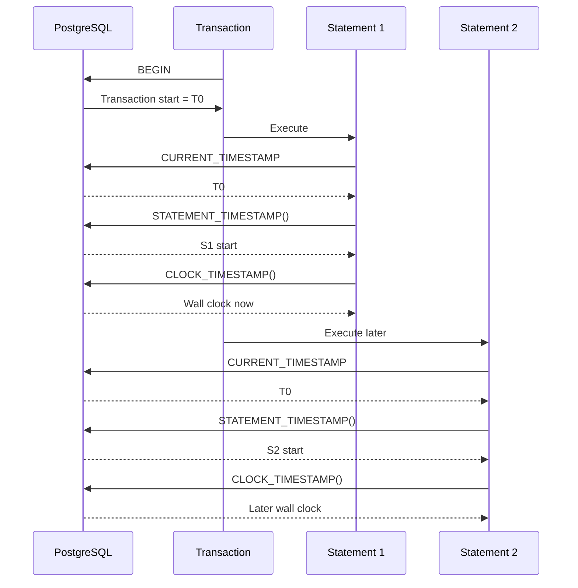
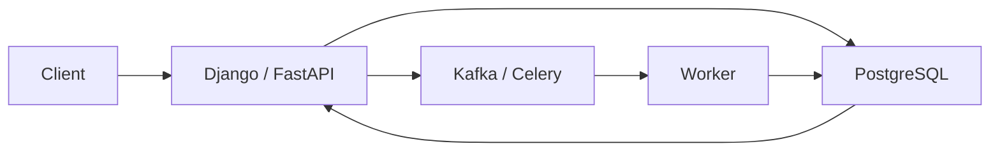

# 04- Current Date and Time

## Overview

Current date and time functions provide the database's view of the current point in time. They are used for timestamps, expiration checks, auditing, scheduling, reporting, retention policies, and other time-sensitive backend operations.

The most important production distinction is between:

- **Current instant** — the exact point in time when the database evaluates the expression.
- **Current date** — the calendar date in the database session's timezone.
- **Current time** — the current clock time, with or without timezone semantics.
- **Statement time** — when the current SQL statement began.
- **Transaction time** — when the current transaction began.
- **Wall-clock time** — the physical clock time observed by the database process.

PostgreSQL is particularly important for backend systems because functions such as `CURRENT_TIMESTAMP`, `CURRENT_DATE`, `NOW()`, and `CLOCK_TIMESTAMP()` have different semantics. Choosing the correct function matters for consistency, auditing, expiration logic, and distributed systems.

## PostgreSQL Current Date and Time Functions

Common PostgreSQL expressions include:

| Expression | Return type | Important behavior |
|---|---|---|
| `CURRENT_DATE` | `date` | Current date in the session timezone |
| `CURRENT_TIME` | `time with time zone` | Current time in the session timezone |
| `CURRENT_TIMESTAMP` | `timestamp with time zone` | Transaction start timestamp |
| `LOCALTIME` | `time without time zone` | Transaction start local time |
| `LOCALTIMESTAMP` | `timestamp without time zone` | Transaction start local timestamp |
| `NOW()` | `timestamptz` | Equivalent to transaction-start current timestamp |
| `STATEMENT_TIMESTAMP()` | `timestamptz` | Start time of the current statement |
| `CLOCK_TIMESTAMP()` | `timestamptz` | Actual current wall-clock time when evaluated |

The distinction between `CURRENT_TIMESTAMP` and `CLOCK_TIMESTAMP()` is particularly important.

## `CURRENT_DATE`

`CURRENT_DATE` returns the current calendar date according to the database session's timezone.

```sql
SELECT CURRENT_DATE;
```

Example result:

```text
2026-08-30
```

The result has type:

```text
date
```

It contains no time-of-day information.

### When to Use It

Use `CURRENT_DATE` when the business concept is a calendar date:

- Business day.
- Invoice date.
- Birthday.
- Subscription date.
- Report date.
- Date-based retention policy.
- Date-only partitioning logic.

For example:

```sql
SELECT *
FROM invoices
WHERE invoice_date = CURRENT_DATE;
```

If `invoice_date` is a `DATE`, this is semantically clear.

### Timezone Consideration

`CURRENT_DATE` depends on the PostgreSQL session timezone.

```sql
SHOW TIME ZONE;
```

For example:

```sql
SET TIME ZONE 'UTC';

SELECT CURRENT_DATE;
```

Changing the session timezone can change the result around midnight.

This matters when the business definition of "today" belongs to a specific user, organization, or region.

## `CURRENT_TIMESTAMP`

`CURRENT_TIMESTAMP` returns the current timestamp with timezone semantics.

```sql
SELECT CURRENT_TIMESTAMP;
```

It is commonly used for:

```sql
created_at
updated_at
expires_at
processed_at
```

For example:

```sql
CREATE TABLE payments (
    id bigint GENERATED ALWAYS AS IDENTITY PRIMARY KEY,
    amount numeric(12, 2) NOT NULL,
    created_at timestamptz NOT NULL DEFAULT CURRENT_TIMESTAMP
);
```

### Transaction-Level Stability

A critical PostgreSQL behavior is that `CURRENT_TIMESTAMP` represents the **start of the current transaction**, not the exact wall-clock time at every invocation.

For example:

```sql
BEGIN;

SELECT CURRENT_TIMESTAMP;
SELECT pg_sleep(2);
SELECT CURRENT_TIMESTAMP;

COMMIT;
```

Both timestamp results represent the same transaction-start time.

This behavior is intentional.

It gives all statements in a transaction a consistent notion of "now."

## `NOW()`

PostgreSQL's:

```sql
NOW()
```

is effectively an alias for the current transaction timestamp.

```sql
SELECT NOW();
```

Therefore:

```sql
SELECT NOW();
```

and:

```sql
SELECT CURRENT_TIMESTAMP;
```

have the same transaction-time semantics.

For production SQL, either is valid. `CURRENT_TIMESTAMP` can be more explicit about SQL semantics, while `NOW()` is extremely common in PostgreSQL codebases.

## Statement Timestamp

`STATEMENT_TIMESTAMP()` returns the time at which the current SQL statement began.

```sql
SELECT STATEMENT_TIMESTAMP();
```

Within a long-running transaction, separate statements can therefore observe different statement timestamps.

```sql
BEGIN;

SELECT STATEMENT_TIMESTAMP();

SELECT pg_sleep(2);

SELECT STATEMENT_TIMESTAMP();

COMMIT;
```

The second statement's timestamp reflects the later statement start.

This differs from:

```sql
CURRENT_TIMESTAMP
```

which remains tied to the transaction start.

## Clock Timestamp

`CLOCK_TIMESTAMP()` returns the actual current wall-clock time when the function is evaluated.

```sql
SELECT CLOCK_TIMESTAMP();
```

Unlike `CURRENT_TIMESTAMP`, its value can change during a transaction.

```sql
BEGIN;

SELECT CLOCK_TIMESTAMP();

SELECT pg_sleep(2);

SELECT CLOCK_TIMESTAMP();

COMMIT;
```

The second value will normally be approximately two seconds later.

### When to Use It

Use `CLOCK_TIMESTAMP()` when the application genuinely needs the current wall-clock reading rather than a transaction-consistent timestamp.

Examples include:

- Measuring elapsed database-side time.
- Diagnostics.
- Operational instrumentation.
- Investigating long-running statements.
- Database-level timing experiments.

It is generally **not** the default choice for business event timestamps.

## Transaction Time vs Statement Time vs Wall-Clock Time

The distinction can be visualized as:



The practical rule is:

```text
CURRENT_TIMESTAMP → consistent transaction time
STATEMENT_TIMESTAMP() → current statement start
CLOCK_TIMESTAMP() → current wall clock
```

## `CURRENT_TIME`

`CURRENT_TIME` returns the current time with timezone semantics.

```sql
SELECT CURRENT_TIME;
```

Example:

```text
14:30:15.123456+05:30
```

The exact displayed offset depends on the session timezone.

Use this when the business concept is a current clock time rather than an instant or date.

In application schemas, however, a `time` field is usually better when the business concept is a recurring local time such as:

```text
09:00 every day
```

## `LOCALTIME`

`LOCALTIME` returns a time without timezone information.

```sql
SELECT LOCALTIME;
```

It represents the local clock value according to the session timezone but does not itself represent a global instant.

This makes it appropriate only when timezone information is intentionally irrelevant or handled separately.

## `LOCALTIMESTAMP`

`LOCALTIMESTAMP` returns a timestamp without timezone information.

```sql
SELECT LOCALTIMESTAMP;
```

It is transaction-start based, similar to `CURRENT_TIMESTAMP`, but returns:

```text
timestamp without time zone
```

This distinction matters when designing schemas.

Do not use `LOCALTIMESTAMP` simply because the application does not want to display timezone information. If the value represents an absolute event, `timestamptz` is normally the more appropriate storage type.

## Function Behavior Comparison

| Function | Time basis | Timezone semantics | Stable during transaction? |
|---|---|---|---|
| `CURRENT_DATE` | Transaction current date | Session timezone | Yes |
| `CURRENT_TIMESTAMP` | Transaction start | `timestamptz` | Yes |
| `NOW()` | Transaction start | `timestamptz` | Yes |
| `STATEMENT_TIMESTAMP()` | Statement start | `timestamptz` | No across statements |
| `CLOCK_TIMESTAMP()` | Wall clock | `timestamptz` | No |
| `CURRENT_TIME` | Transaction start | Time with timezone | Yes |
| `LOCALTIME` | Transaction start | No timezone | Yes |
| `LOCALTIMESTAMP` | Transaction start | No timezone | Yes |

## Using Current Time for Default Values

Database defaults are useful when the database should establish the authoritative timestamp.

```sql
CREATE TABLE users (
    id bigint GENERATED ALWAYS AS IDENTITY PRIMARY KEY,
    email text NOT NULL UNIQUE,
    created_at timestamptz NOT NULL DEFAULT CURRENT_TIMESTAMP
);
```

Insert without specifying the timestamp:

```sql
INSERT INTO users (email)
VALUES ('user@example.com');
```

PostgreSQL assigns the current transaction timestamp.

This has an important architectural advantage:

```text
Application
    ↓
INSERT
    ↓
PostgreSQL
    ↓
created_at = database current timestamp
```

The application does not need to calculate the timestamp itself.

## Database Time vs Application Time

A backend system can obtain the current time either from the application or database.

### Application-Generated Time

```python
from datetime import datetime, timezone

created_at = datetime.now(timezone.utc)
```

Then:

```sql
INSERT INTO users (email, created_at)
VALUES ($1, $2);
```

### Database-Generated Time

```sql
INSERT INTO users (email)
VALUES ($1);
```

with:

```sql
created_at timestamptz NOT NULL DEFAULT CURRENT_TIMESTAMP
```

Both approaches can be valid, but the system should establish a clear source of truth.

For auditing and database-owned timestamps, database-generated values are often useful because all writes through that database share the same database clock and transaction semantics.

## `created_at` and `updated_at`

A typical schema is:

```sql
CREATE TABLE orders (
    id bigint GENERATED ALWAYS AS IDENTITY PRIMARY KEY,
    status text NOT NULL,
    created_at timestamptz NOT NULL DEFAULT CURRENT_TIMESTAMP,
    updated_at timestamptz NOT NULL DEFAULT CURRENT_TIMESTAMP
);
```

However, this default does **not** automatically update `updated_at` whenever the row changes.

This:

```sql
updated_at timestamptz NOT NULL DEFAULT CURRENT_TIMESTAMP
```

only defines the value used when a row is inserted without an explicit value.

It does not mean:

```text
UPDATE row → automatically refresh updated_at
```

If the database should own that behavior, use a trigger or explicitly update the column from the application.

For example:

```sql
UPDATE orders
SET
    status = $2,
    updated_at = CURRENT_TIMESTAMP
WHERE id = $1;
```

## Expiration Queries

Current timestamps are frequently used for TTL and expiration logic.

For example:

```sql
SELECT id
FROM password_reset_tokens
WHERE token_hash = $1
  AND expires_at > CURRENT_TIMESTAMP;
```

For an index:

```sql
CREATE INDEX idx_password_reset_tokens_expires_at
ON password_reset_tokens (expires_at);
```

The timestamp comparison remains a normal range predicate.

### Prefer Database-Side Expiration

For security-sensitive expiration, avoid trusting the client's current time.

Bad:

```text
Client says: "It is 15:00."
```

Better:

```text
Database evaluates CURRENT_TIMESTAMP.
```

The authoritative system clock should determine whether a token has expired.

## Date Arithmetic with Current Time

PostgreSQL supports interval arithmetic.

For example:

```sql
SELECT CURRENT_TIMESTAMP + INTERVAL '15 minutes';
```

Expiration:

```sql
UPDATE sessions
SET expires_at = CURRENT_TIMESTAMP + INTERVAL '30 minutes'
WHERE id = $1;
```

Retention:

```sql
DELETE FROM audit_events
WHERE created_at < CURRENT_TIMESTAMP - INTERVAL '90 days';
```

These expressions are useful for operational and security policies.

## Current Date in Reporting

Suppose an application stores:

```sql
orders.created_at timestamptz
```

A report may need today's orders.

Do not assume that:

```sql
created_at::date = CURRENT_DATE
```

always represents the business's desired day.

It uses the database session timezone when converting the timestamp to a date.

For a fixed business timezone, calculate the correct boundaries and use a range:

```sql
SELECT id, created_at
FROM orders
WHERE created_at >= $1
  AND created_at < $2
ORDER BY created_at;
```

where `$1` and `$2` represent the start and end instants for the desired local date.

This approach is generally better for large indexed tables.

## Query Planning and Indexes

Consider:

```sql
CREATE INDEX idx_orders_created_at
ON orders (created_at);
```

Prefer:

```sql
WHERE created_at >= $1
  AND created_at < $2
```

over:

```sql
WHERE created_at::date = CURRENT_DATE
```

The second expression applies a transformation to the indexed column.

For high-volume tables, direct range predicates are usually easier for the optimizer to use with a normal B-tree index.

This is especially important for:

- Audit tables.
- Event tables.
- Payment records.
- Application logs.
- Large time-series datasets.

## Current Time in Transactions

Transaction-stable timestamps are particularly useful when several records must share the same logical creation time.

For example:

```sql
BEGIN;

INSERT INTO orders (status)
VALUES ('pending');

INSERT INTO order_events (order_id, event_type, created_at)
VALUES ($1, 'created', CURRENT_TIMESTAMP);

COMMIT;
```

Both timestamps are based on the same transaction start.

This provides a coherent temporal view of work performed within the transaction.

## Long-Running Transactions

A long-running transaction can expose an important distinction.

Suppose:

```sql
BEGIN;

-- long-running work

SELECT CURRENT_TIMESTAMP;
SELECT CLOCK_TIMESTAMP();

COMMIT;
```

`CURRENT_TIMESTAMP` can be significantly older than the wall-clock time.

Therefore, do not use transaction timestamp semantics when the requirement is:

> What time is it right now?

Use:

```sql
CLOCK_TIMESTAMP()
```

when a genuine wall-clock reading is required.

For normal business timestamps, however, transaction-stable semantics are usually preferable.

## Backend Architecture

In a production backend:



A robust timestamp strategy might be:

```text
PostgreSQL:
    created_at → timestamptz

API:
    return ISO 8601 timestamp

Kafka:
    carry unambiguous event timestamp

Worker:
    use timezone-aware datetime

Logs:
    use UTC/unambiguous timestamps
```

The goal is not to make every layer call the same function. The goal is to preserve clear temporal semantics across boundaries.

## Application-Level Current Time

Python applications should use timezone-aware timestamps.

```python
from datetime import datetime, timezone

now = datetime.now(timezone.utc)
```

In Django:

```python
from django.utils import timezone

now = timezone.now()
```

Avoid mixing:

```python
datetime.now()
```

with timezone-aware values.

A naive application timestamp can introduce subtle bugs when it is compared with database timestamps or passed between services.

## Current Time and Distributed Systems

Multiple machines do not necessarily have perfectly synchronized clocks.

For example:

```text
API Server      10:00:00.100
Worker          09:59:59.950
Database        10:00:00.020
```

Therefore, timestamps from different systems should not automatically be interpreted as a perfect total ordering of events.

For distributed event ordering, use appropriate mechanisms such as:

- Database sequence/order.
- Kafka partition ordering.
- Event IDs.
- Logical timestamps.
- Transaction IDs.
- Trace/span information.

A timestamp is evidence of when a system observed an event; it is not always sufficient to establish causal ordering.

## Security Considerations

Current-time expressions commonly participate in security decisions.

Examples:

```sql
WHERE expires_at > CURRENT_TIMESTAMP
```

```sql
WHERE locked_until <= CURRENT_TIMESTAMP
```

```sql
WHERE revoked_at IS NULL
```

For these cases:

- Do not trust client clocks.
- Use server/database-controlled time.
- Store absolute instants for expiration timestamps.
- Keep timezone conversion out of authorization logic.
- Test boundary conditions precisely.

For example, token validity should normally be expressed as:

```sql
expires_at > CURRENT_TIMESTAMP
```

rather than comparing formatted strings or client-generated local timestamps.

## Common Mistakes

### Assuming `NOW()` Changes Every Time It Is Called

In PostgreSQL:

```sql
NOW()
```

is transaction-start based.

It does not continuously track the wall clock throughout a transaction.

Use:

```sql
CLOCK_TIMESTAMP()
```

when actual wall-clock time is required.

### Using `CLOCK_TIMESTAMP()` Everywhere

`CLOCK_TIMESTAMP()` is not inherently "better" because it is more current.

For business operations, transaction-consistent timestamps are often desirable.

Use the function that matches the semantic requirement.

### Assuming `DEFAULT CURRENT_TIMESTAMP` Updates Automatically

This:

```sql
updated_at timestamptz DEFAULT CURRENT_TIMESTAMP
```

does not update `updated_at` during future `UPDATE` statements.

The update must be explicit or implemented through database automation.

### Comparing Dates Instead of Instants

This:

```sql
WHERE created_at::date = CURRENT_DATE
```

can produce incorrect business results when the required timezone differs from the session timezone.

It can also complicate index usage.

### Relying on Application Clocks for Security

A client or untrusted application timestamp should never determine whether:

```text
token expired
session expired
authorization expired
```

Use server/database time.

### Mixing Naive and Aware Datetimes

A Python naive datetime and a PostgreSQL `timestamptz` represent different temporal semantics.

Keep application and database timestamp handling explicit.

### Assuming Timestamps Establish Event Ordering

Clock skew means:

```text
event A timestamp < event B timestamp
```

does not always prove:

```text
A happened before B
```

in a distributed system.

### Using `CURRENT_DATE` for User-Specific "Today"

`CURRENT_DATE` uses the database session timezone.

A global application may need:

```text
user's timezone → local midnight → UTC boundaries
```

instead.

## Production Best Practices

| Requirement | Recommended approach |
|---|---|
| Row creation timestamp | `timestamptz DEFAULT CURRENT_TIMESTAMP` |
| Absolute event time | `timestamptz` |
| Current transaction time | `CURRENT_TIMESTAMP` / `NOW()` |
| Current statement start | `STATEMENT_TIMESTAMP()` |
| Actual wall-clock reading | `CLOCK_TIMESTAMP()` |
| Calendar date | `DATE` / `CURRENT_DATE` |
| Token expiration | Compare against database current timestamp |
| Large time-range query | Direct indexed range predicate |
| User-specific "today" | Calculate boundaries in user's timezone |
| API timestamp | ISO 8601/RFC 3339 with explicit offset or `Z` |
| Python current time | Timezone-aware `datetime` |
| Django current time | `timezone.now()` |
| Recurring local schedule | Local time + IANA timezone |
| Distributed ordering | Do not rely solely on timestamps |

## Testing Current-Time Logic

Time-dependent code should be tested around boundaries.

Important cases include:

- Exactly at expiration.
- Just before expiration.
- Just after expiration.
- Midnight.
- Month boundaries.
- Year boundaries.
- Daylight-saving transitions.
- Long-running transactions.
- Different database session timezones.

For example, if a token expires at:

```text
2026-08-30T10:00:00Z
```

define whether this is valid at exactly:

```text
10:00:00Z
```

The difference between:

```sql
expires_at > CURRENT_TIMESTAMP
```

and:

```sql
expires_at >= CURRENT_TIMESTAMP
```

can be a real business rule.

## Interview Traps

| Question | Strong answer |
|---|---|
| Is `NOW()` the exact current wall-clock time? | No. In PostgreSQL it represents the transaction start timestamp |
| What does `CURRENT_TIMESTAMP` return? | A `timestamptz` representing the transaction's start time |
| How do you get statement-start time? | `STATEMENT_TIMESTAMP()` |
| How do you get actual wall-clock time? | `CLOCK_TIMESTAMP()` |
| Does `CURRENT_DATE` include timezone information? | No; it returns a `date`, but its value depends on the session timezone |
| Does `DEFAULT CURRENT_TIMESTAMP` update on `UPDATE`? | No; it only supplies a default when a row is inserted |
| Why prefer database time for token expiration? | It prevents untrusted client clocks from influencing security decisions |
| Why can `created_at::date = CURRENT_DATE` be problematic? | It can use the wrong business timezone and may prevent efficient use of a normal timestamp index |
| Why is transaction-stable time useful? | It gives related operations in one transaction a consistent temporal reference |
| Does a timestamp establish ordering in distributed systems? | Not reliably; clock skew means timestamps alone do not prove causal ordering |

## Key Takeaways

- **PostgreSQL `CURRENT_TIMESTAMP` and `NOW()` represent transaction-start time; they are not continuously changing wall-clock readings.**
- **Use `STATEMENT_TIMESTAMP()` for statement-start semantics and `CLOCK_TIMESTAMP()` only when actual wall-clock time is required.**
- **Use database-generated `timestamptz` values for authoritative event and expiration timestamps, especially for security-sensitive logic.**
- **For date-based reporting, calculate timezone-correct boundaries and query indexed timestamps with half-open ranges instead of blindly casting timestamps to dates.**
- **Choose current-time functions based on temporal semantics—transaction consistency, statement timing, calendar date, or wall-clock time—not simply on which function appears most current.**