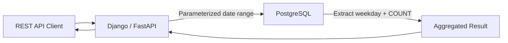

# 05- Date Extraction

## Overview

Date extraction means deriving a specific calendar or clock component from a `DATE`, `TIMESTAMP`, or `TIMESTAMPTZ` value, such as the year, month, day, hour, week, or day of week.

Extraction is useful for:

- Reporting and analytics.
- Grouping events by calendar periods.
- Filtering records by business dates.
- Building operational dashboards.
- Deriving dimensions such as year, month, and weekday.
- Inspecting timestamps during debugging.

PostgreSQL provides two primary approaches:

- `EXTRACT()` — SQL-standard and explicit.
- `DATE_PART()` — PostgreSQL-compatible alternative with similar behavior.

For production queries, extraction should be distinguished from **date truncation** and **range filtering**. Extracting a component is often useful for presentation or grouping, but applying functions directly to indexed timestamp columns can make filtering less efficient.

## `EXTRACT()`

`EXTRACT()` retrieves a specific field from a date/time value.

Syntax:

```sql
EXTRACT(field FROM source)
```

Example:

```sql
SELECT EXTRACT(YEAR FROM TIMESTAMP '2026-08-30 14:25:10');
```

Result:

```text
2026
```

The returned value is numeric.

### Common Fields

| Field | Meaning | Example |
|---|---|---:|
| `YEAR` | Calendar year | `2026` |
| `MONTH` | Month number | `8` |
| `DAY` | Day of month | `30` |
| `HOUR` | Hour | `14` |
| `MINUTE` | Minute | `25` |
| `SECOND` | Seconds, potentially fractional | `10.0` |
| `DOW` | Sunday = `0` through Saturday = `6` | `0` |
| `ISODOW` | Monday = `1` through Sunday = `7` | `7` |
| `DOY` | Day of year | `242` |
| `WEEK` | ISO week number | `35` |
| `QUARTER` | Quarter | `3` |
| `ISOYEAR` | ISO week-numbering year | `2026` |
| `EPOCH` | Seconds since Unix epoch | varies |

## Extracting Year, Month, and Day

These are the most common extraction operations.

```sql
SELECT
    EXTRACT(YEAR FROM created_at) AS year,
    EXTRACT(MONTH FROM created_at) AS month,
    EXTRACT(DAY FROM created_at) AS day
FROM orders;
```

For:

```text
2026-08-30 14:25:10+00
```

the result is approximately:

```text
year | month | day
-----+-------+----
2026 |     8 |  30
```

### When to Use It

Use these fields when the application needs the individual calendar components rather than the original timestamp.

Typical examples:

```text
year/month dashboard
monthly reporting
quarterly reporting
weekday analysis
business-period grouping
```

## Extracting Time Components

`EXTRACT()` can also retrieve clock components.

```sql
SELECT
    EXTRACT(HOUR FROM created_at) AS hour,
    EXTRACT(MINUTE FROM created_at) AS minute,
    EXTRACT(SECOND FROM created_at) AS second
FROM orders;
```

This is useful for operational analysis such as:

```text
orders by hour
requests by hour
payments by weekday
traffic patterns
```

However, time-of-day analytics should account for the timezone in which the business wants to interpret the timestamp.

## Extracting Day of Week

PostgreSQL provides both `DOW` and `ISODOW`.

```sql
SELECT
    EXTRACT(DOW FROM DATE '2026-08-30') AS dow,
    EXTRACT(ISODOW FROM DATE '2026-08-30') AS isodow;
```

The conventions differ:

| Field | Monday | Tuesday | Saturday | Sunday |
|---|---:|---:|---:|---:|
| `DOW` | `1` | `2` | `6` | `0` |
| `ISODOW` | `1` | `2` | `6` | `7` |

For business applications, `ISODOW` is often less surprising because Monday is `1` and Sunday is `7`.

## Extracting Week and ISO Year

PostgreSQL's `WEEK` follows ISO week-numbering rules.

```sql
SELECT
    EXTRACT(WEEK FROM created_at) AS week,
    EXTRACT(ISOYEAR FROM created_at) AS isoyear
FROM orders;
```

This distinction matters around New Year's Day.

A calendar year and ISO week-numbering year are not always identical.

For example, dates near January 1 can belong to the final ISO week of the previous ISO year.

Therefore, avoid grouping solely by:

```sql
EXTRACT(WEEK FROM created_at)
```

when reporting across multiple years.

Prefer:

```sql
SELECT
    EXTRACT(ISOYEAR FROM created_at) AS isoyear,
    EXTRACT(WEEK FROM created_at) AS week,
    COUNT(*) AS order_count
FROM orders
GROUP BY
    EXTRACT(ISOYEAR FROM created_at),
    EXTRACT(WEEK FROM created_at);
```

## Extracting Quarter

A quarter can be extracted directly:

```sql
SELECT EXTRACT(QUARTER FROM created_at)
FROM orders;
```

Results range from:

```text
1 → January–March
2 → April–June
3 → July–September
4 → October–December
```

For reporting:

```sql
SELECT
    EXTRACT(YEAR FROM created_at) AS year,
    EXTRACT(QUARTER FROM created_at) AS quarter,
    COUNT(*) AS order_count
FROM orders
GROUP BY
    EXTRACT(YEAR FROM created_at),
    EXTRACT(QUARTER FROM created_at)
ORDER BY year, quarter;
```

## `DATE_PART()`

PostgreSQL also supports:

```sql
DATE_PART(field, source)
```

For example:

```sql
SELECT DATE_PART('year', created_at)
FROM orders;
```

This is conceptually equivalent to:

```sql
SELECT EXTRACT(YEAR FROM created_at)
FROM orders;
```

A useful comparison:

| Approach | Example | Recommendation |
|---|---|---|
| `EXTRACT()` | `EXTRACT(YEAR FROM created_at)` | Preferred for clarity and SQL-standard syntax |
| `DATE_PART()` | `DATE_PART('year', created_at)` | Valid PostgreSQL alternative |

For new PostgreSQL SQL, `EXTRACT()` is generally easier to read because the field is visually associated with the source expression.

## Extraction from `DATE`

Extraction works with `DATE` values as well.

```sql
SELECT
    EXTRACT(YEAR FROM DATE '2026-08-30') AS year,
    EXTRACT(MONTH FROM DATE '2026-08-30') AS month,
    EXTRACT(DAY FROM DATE '2026-08-30') AS day;
```

A `DATE` has no time-of-day component, so fields such as `HOUR` are not meaningful in the same way they are for timestamps.

## Extraction from `TIMESTAMPTZ`

Timezone semantics become important when extracting calendar fields from `TIMESTAMPTZ`.

Consider:

```sql
SELECT EXTRACT(DAY FROM TIMESTAMPTZ '2026-08-30 23:30:00+00');
```

The extracted calendar components depend on the session timezone.

Check the current timezone:

```sql
SHOW TIME ZONE;
```

Changing it:

```sql
SET TIME ZONE 'Asia/Kolkata';

SELECT
    EXTRACT(DAY FROM TIMESTAMPTZ '2026-08-30 23:30:00+00') AS day,
    EXTRACT(HOUR FROM TIMESTAMPTZ '2026-08-30 23:30:00+00') AS hour;
```

The same absolute instant can therefore produce different local calendar components.

This is one of the most important production considerations when using `EXTRACT()` with `TIMESTAMPTZ`.

## Explicit Timezone Conversion Before Extraction

If the business requirement is based on a particular timezone, make that timezone explicit.

For example:

```sql
SELECT
    EXTRACT(YEAR FROM created_at AT TIME ZONE 'Asia/Kolkata') AS year,
    EXTRACT(MONTH FROM created_at AT TIME ZONE 'Asia/Kolkata') AS month,
    EXTRACT(DAY FROM created_at AT TIME ZONE 'Asia/Kolkata') AS day
FROM orders;
```

This makes the business timezone explicit rather than relying on the database session configuration.

For multi-tenant applications, the timezone may come from organization configuration rather than being globally fixed.

## Extraction vs Date Truncation

Extraction and truncation solve different problems.

### Extraction

Returns a component:

```sql
EXTRACT(YEAR FROM created_at)
```

Result:

```text
2026
```

### Truncation

Returns a timestamp representing the beginning of a period:

```sql
DATE_TRUNC('month', created_at)
```

Result conceptually:

```text
2026-08-01 00:00:00
```

| Requirement | Preferred operation |
|---|---|
| Get the year number | `EXTRACT(YEAR ...)` |
| Get the month number | `EXTRACT(MONTH ...)` |
| Group by month boundary | `DATE_TRUNC('month', ...)` |
| Get weekday number | `EXTRACT(ISODOW ...)` |
| Filter a timestamp range | Timestamp range predicate |
| Build a calendar period key | `DATE_TRUNC()` or explicit period dimension |

Do not treat these operations as interchangeable.

## Extraction for Aggregation

Extraction is commonly used in analytical queries.

For example, order volume by month:

```sql
SELECT
    EXTRACT(YEAR FROM created_at) AS year,
    EXTRACT(MONTH FROM created_at) AS month,
    COUNT(*) AS order_count
FROM orders
GROUP BY
    EXTRACT(YEAR FROM created_at),
    EXTRACT(MONTH FROM created_at)
ORDER BY
    year,
    month;
```

This works, but `DATE_TRUNC()` can provide a more natural period representation:

```sql
SELECT
    DATE_TRUNC('month', created_at) AS month,
    COUNT(*) AS order_count
FROM orders
GROUP BY DATE_TRUNC('month', created_at)
ORDER BY month;
```

The second approach is often easier to extend into date-range calculations.

## Extraction for Filtering

A common query is:

```sql
SELECT *
FROM orders
WHERE EXTRACT(YEAR FROM created_at) = 2026;
```

This expresses the business condition clearly, but it applies a function to the timestamp column.

For a large indexed table, prefer a range:

```sql
SELECT *
FROM orders
WHERE created_at >= TIMESTAMPTZ '2026-01-01 00:00:00+00'
  AND created_at <  TIMESTAMPTZ '2027-01-01 00:00:00+00';
```

With:

```sql
CREATE INDEX idx_orders_created_at
ON orders (created_at);
```

the range predicate provides a straightforward indexable condition.

### General Rule

Use extraction primarily for:

- Projection.
- Grouping.
- Derived dimensions.
- Analytics.

Use timestamp ranges primarily for:

- High-volume filtering.
- Index-backed queries.
- Retention jobs.
- Operational workloads.

## Monthly Filtering

Avoid:

```sql
WHERE EXTRACT(MONTH FROM created_at) = 8
```

This means August across **all years**.

If the requirement is August 2026:

```sql
WHERE created_at >= TIMESTAMPTZ '2026-08-01 00:00:00+00'
  AND created_at <  TIMESTAMPTZ '2026-09-01 00:00:00+00'
```

The half-open interval:

```text
[start, end)
```

is preferable because it avoids ambiguity around fractional seconds.

## `EPOCH`

`EXTRACT(EPOCH FROM ...)` returns a value representing seconds relative to the Unix epoch for supported date/time types.

For a timestamp:

```sql
SELECT EXTRACT(EPOCH FROM TIMESTAMPTZ '2026-08-30 00:00:00+00');
```

This is useful when integrating with systems that use Unix timestamps.

However, do not convert timestamps to epoch values merely for convenience if the database can perform native timestamp comparisons.

Prefer:

```sql
WHERE created_at >= $1
```

over unnecessary transformations such as:

```sql
WHERE EXTRACT(EPOCH FROM created_at) >= $1
```

when `created_at` is indexed.

## Backend Reporting Example

Consider an API endpoint that returns order volume by weekday.

```sql
SELECT
    EXTRACT(ISODOW FROM created_at)::int AS weekday,
    COUNT(*) AS order_count
FROM orders
WHERE created_at >= $1
  AND created_at < $2
GROUP BY EXTRACT(ISODOW FROM created_at)
ORDER BY weekday;
```

The architecture can remain simple:



The important separation is:

```text
Filter using timestamp range
        ↓
Extract calendar component
        ↓
Aggregate
        ↓
Return API result
```

This allows the filtering operation to remain index-friendly while extraction happens on the rows that satisfy the time range.

## Generated Period Labels

Sometimes an API needs a human-readable month label.

You can extract numeric components:

```sql
SELECT
    EXTRACT(YEAR FROM created_at)::int AS year,
    EXTRACT(MONTH FROM created_at)::int AS month
FROM orders;
```

It is generally better to return structured values such as:

```json
{
  "year": 2026,
  "month": 8
}
```

and let the presentation layer format them.

Avoid using SQL string formatting as the primary representation of a business date dimension.

## NULL Behavior

`EXTRACT()` returns `NULL` when its source is `NULL`.

```sql
SELECT EXTRACT(YEAR FROM NULL::timestamp);
```

Result:

```text
NULL
```

This follows SQL's null propagation rules.

Therefore:

```sql
SELECT EXTRACT(YEAR FROM shipped_at)
FROM orders;
```

will produce `NULL` for orders where `shipped_at` is `NULL`.

If the business requirement needs a fallback, use `COALESCE()` deliberately:

```sql
SELECT COALESCE(
    EXTRACT(YEAR FROM shipped_at)::int,
    0
) AS shipping_year
FROM orders;
```

However, replacing missing dates with artificial values such as `0` can make analytics misleading. Prefer preserving `NULL` unless a real default exists.

## Performance Considerations

Date extraction itself is inexpensive compared with many database operations, but the surrounding query determines whether it is production-safe.

### Good Pattern

```sql
SELECT EXTRACT(MONTH FROM created_at)
FROM orders
WHERE created_at >= $1
  AND created_at < $2;
```

The database can use the timestamp range to reduce the candidate rows before calculating the extracted month.

### Risky Pattern

```sql
SELECT *
FROM orders
WHERE EXTRACT(MONTH FROM created_at) = 8;
```

On a large table, this may require evaluating the expression across many rows.

If the query is a critical workload, inspect the execution plan:

```sql
EXPLAIN (ANALYZE, BUFFERS)
SELECT *
FROM orders
WHERE EXTRACT(YEAR FROM created_at) = 2026;
```

Do not assume an index will be used simply because an index exists on `created_at`.

## Functional Indexes

There are cases where filtering by an extracted component is genuinely required.

PostgreSQL supports expression indexes.

For example:

```sql
CREATE INDEX idx_users_birth_month
ON users ((EXTRACT(MONTH FROM birth_date)));
```

Then:

```sql
SELECT *
FROM users
WHERE EXTRACT(MONTH FROM birth_date) = 8;
```

can potentially benefit from that expression index.

Use this only when the access pattern is stable and justified by workload data.

For a timestamp-based event table, a normal timestamp index plus range filtering is usually more flexible.

## Production Considerations

### Timezone

Always establish what timezone defines the business calendar.

For example:

```text
UTC storage
+
Asia/Kolkata reporting
```

means that "day", "month", and "weekday" should be derived using the intended reporting timezone.

### Indexing

If a query filters millions of timestamped rows, prefer:

```sql
WHERE timestamp_column >= $1
  AND timestamp_column < $2
```

over applying `EXTRACT()` to the indexed column.

### Partitioning

Large event tables may be partitioned by time.

For example:

```text
orders
├── 2026-07
├── 2026-08
└── 2026-09
```

Queries with explicit timestamp ranges can allow PostgreSQL to perform partition pruning.

An extraction predicate may provide less effective pruning depending on the partitioning strategy and expression.

### Reporting Timezone

A global system should not silently depend on a developer's database session timezone.

Make timezone assumptions explicit at the application or query boundary.

### Materialized Aggregations

If dashboards repeatedly calculate:

```text
year
month
weekday
hour
```

over billions of events, repeatedly extracting values at query time may become expensive.

Consider:

- Summary tables.
- Materialized views.
- Pre-aggregated reporting tables.
- Dedicated analytics systems.
- Batch aggregation with Celery or Kafka-based pipelines.

Do not optimize prematurely, but do not expect OLTP queries to remain efficient indefinitely under heavy analytical workloads.

## Common Mistakes

### Using `MONTH` Without the Year

This:

```sql
WHERE EXTRACT(MONTH FROM created_at) = 8
```

means every August.

If the requirement is August 2026, constrain the year or, preferably, use a timestamp range.

### Ignoring ISO Week-Year Boundaries

Do not group only by:

```sql
EXTRACT(WEEK FROM created_at)
```

Combine it with:

```sql
EXTRACT(ISOYEAR FROM created_at)
```

when reporting across year boundaries.

### Ignoring Timezones

Extracting:

```sql
EXTRACT(DAY FROM created_at)
```

from a `TIMESTAMPTZ` can produce different results depending on the session timezone.

Make the intended business timezone explicit.

### Applying Extraction to Indexed Columns for Filtering

Avoid:

```sql
WHERE EXTRACT(YEAR FROM created_at) = 2026
```

for high-volume operational queries when an equivalent range can be used.

Prefer:

```sql
WHERE created_at >= $1
  AND created_at < $2
```

### Confusing Extraction with Truncation

These are different:

```sql
EXTRACT(MONTH FROM created_at)
```

returns a number.

```sql
DATE_TRUNC('month', created_at)
```

returns a timestamp representing the start of the month.

Choose based on what the application actually needs.

### Treating `DOW = 0` as Monday

PostgreSQL's:

```sql
EXTRACT(DOW FROM ...)
```

uses:

```text
Sunday = 0
```

If Monday-based numbering is required, use:

```sql
EXTRACT(ISODOW FROM ...)
```

### Replacing NULL with Arbitrary Dates

Avoid silently converting missing dates into:

```text
1970-01-01
0001-01-01
```

or similar placeholders.

Missing and real dates have different business meanings.

## Interview Traps

| Question | Strong answer |
|---|---|
| How do you extract the year? | `EXTRACT(YEAR FROM timestamp_column)` |
| What is the PostgreSQL alternative to `EXTRACT()`? | `DATE_PART()` |
| What does `EXTRACT(DOW ...)` return for Sunday? | `0` |
| What does `EXTRACT(ISODOW ...)` return for Sunday? | `7` |
| Should you filter a large indexed timestamp column with `EXTRACT()`? | Usually no; prefer an index-friendly timestamp range |
| What is the difference between `EXTRACT()` and `DATE_TRUNC()`? | Extraction returns a component; truncation returns the start of a time period |
| Why can extracting a day from `TIMESTAMPTZ` produce different results? | Calendar components depend on timezone interpretation |
| Is `WEEK` sufficient for grouping data across years? | No; pair it with `ISOYEAR` for ISO week-based reporting |
| What happens when the source value is `NULL`? | `EXTRACT()` returns `NULL` |
| When might an expression index be appropriate? | When a frequently used access pattern genuinely filters on the extracted expression |

## Key Takeaways

- **Use `EXTRACT()` to derive calendar or clock components such as year, month, weekday, hour, quarter, and ISO week.**
- **For high-volume filtering, prefer indexed timestamp ranges over applying `EXTRACT()` directly to the timestamp column.**
- **Timezone semantics matter: extracting calendar components from `TIMESTAMPTZ` depends on the timezone in which the instant is interpreted.**
- **Use `ISOYEAR` with `WEEK` for reliable ISO week-based reporting, and use `ISODOW` when Monday-based weekday numbering is required.**
- **Distinguish extraction from truncation: `EXTRACT()` returns a component, while `DATE_TRUNC()` produces a period boundary.**