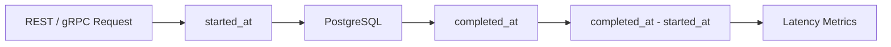

# 07- Date Difference

## Overview

Date difference calculations answer questions such as:

- How long did an API request take?
- How many days has an order been pending?
- How old is a record?
- How much time remains before an SLA expires?
- How many calendar months exist between two dates?

In PostgreSQL, the correct technique depends on whether the requirement is **elapsed duration**, **calendar-day difference**, or a **human/calendar-oriented difference**.

The primary approaches are:

| Technique | Result | Best use |
|---|---|---|
| `date - date` | Integer days | Calendar-day difference |
| `timestamp - timestamp` | `INTERVAL` | Exact elapsed duration |
| `AGE()` | Years/months/days interval | Calendar-oriented difference |
| `EXTRACT(EPOCH FROM ...)` | Numeric seconds | Duration calculations and metrics |
| `DATE_PART()` | Numeric component | Extracting duration components |

The most important production rule is to define what "difference" means before choosing the SQL expression.

## Date Difference with `DATE`

Subtracting two `DATE` values returns an integer representing the number of days between them.

```sql
SELECT DATE '2026-08-30' - DATE '2026-08-25' AS days_elapsed;
```

Result:

```text
5
```

This is appropriate when the application cares about calendar dates rather than time-of-day.

For example:

```sql
SELECT
    order_id,
    delivered_on - shipped_on AS delivery_days
FROM orders
WHERE delivered_on IS NOT NULL;
```

If:

```text
shipped_on   = 2026-08-25
delivered_on = 2026-08-30
```

then:

```text
delivery_days = 5
```

### Why `DATE` subtraction is useful

It provides a simple integer result without requiring interval parsing.

Use it for:

- Number of calendar days between two dates.
- Aging reports.
- Daily operational metrics.
- Business processes based strictly on dates.

It should not be used when the time of day is significant.

## Timestamp Difference

Subtracting two timestamps produces an `INTERVAL`.

```sql
SELECT
    TIMESTAMP '2026-08-30 15:00:00'
    - TIMESTAMP '2026-08-30 12:30:00' AS duration;
```

Result:

```text
02:30:00
```

This is appropriate for measuring elapsed time.

A backend example:

```sql
SELECT
    request_id,
    completed_at - started_at AS processing_duration
FROM requests
WHERE completed_at IS NOT NULL;
```

This can be used for:

- API processing time.
- Job execution duration.
- Queue processing time.
- Database operation duration.
- Workflow latency.

## `TIMESTAMPTZ` Differences

For production systems, timestamps representing real-world events are commonly stored as `TIMESTAMPTZ` in PostgreSQL.

```sql
SELECT
    completed_at - started_at AS duration
FROM jobs
WHERE completed_at IS NOT NULL;
```

If both columns are `TIMESTAMPTZ`, the subtraction measures the elapsed difference between the represented instants.

This is usually preferable for backend event data because the database retains an unambiguous point in time.

A common architecture is:



## `AGE()`

`AGE()` is useful when the difference should be expressed using calendar-oriented components such as years, months, and days.

```sql
SELECT AGE(
    TIMESTAMP '2026-08-30',
    TIMESTAMP '2025-06-15'
);
```

The result is an interval representing the calendar difference.

A common example is calculating an account's age:

```sql
SELECT
    user_id,
    AGE(CURRENT_DATE, date_of_birth) AS account_holder_age
FROM users;
```

`AGE()` is useful when the result is intended for human interpretation.

### `AGE()` vs Timestamp Subtraction

Consider:

```sql
SELECT
    TIMESTAMP '2026-08-30'
    - TIMESTAMP '2025-08-30';
```

versus:

```sql
SELECT AGE(
    TIMESTAMP '2026-08-30',
    TIMESTAMP '2025-08-30'
);
```

The first represents an elapsed interval.

The second represents a calendar-oriented difference.

The distinction becomes important when months and years are involved.

## Negative Differences

Date differences can be negative.

```sql
SELECT DATE '2026-08-25' - DATE '2026-08-30';
```

Result:

```text
-5
```

Similarly:

```sql
SELECT
    TIMESTAMP '2026-08-25 10:00:00'
    - TIMESTAMP '2026-08-30 10:00:00';
```

produces a negative interval.

Negative values can be useful for detecting:

- Future-dated records.
- Scheduling errors.
- Clock inconsistencies.
- Invalid workflow states.

Do not automatically apply `ABS()` unless the direction of the difference is irrelevant.

For example:

```sql
ABS(delivered_on - shipped_on)
```

would hide the fact that `delivered_on` occurred before `shipped_on`.

## Extracting Seconds with `EXTRACT(EPOCH)`

For duration calculations, PostgreSQL can convert an interval into seconds.

```sql
SELECT EXTRACT(
    EPOCH FROM (
        TIMESTAMP '2026-08-30 15:00:00'
        - TIMESTAMP '2026-08-30 12:30:00'
    )
) AS seconds_elapsed;
```

Result:

```text
9000
```

This is useful for:

- Metrics.
- SLA calculations.
- Duration thresholds.
- Percentile calculations.
- Numeric comparisons.

For example:

```sql
SELECT
    request_id,
    EXTRACT(EPOCH FROM (completed_at - started_at)) AS duration_seconds
FROM requests
WHERE completed_at IS NOT NULL;
```

The result is numeric rather than an interval, which is often easier to consume in monitoring or analytics pipelines.

## Comparing Durations

Intervals can be compared directly.

```sql
SELECT id
FROM jobs
WHERE completed_at - started_at > INTERVAL '5 minutes';
```

This is often clearer than converting everything into seconds:

```sql
SELECT id
FROM jobs
WHERE EXTRACT(EPOCH FROM (completed_at - started_at)) > 300;
```

Prefer interval comparison when the threshold itself is naturally expressed as a duration.

Use `EXTRACT(EPOCH)` when the result must be numeric.

## `DATE_PART()`

`DATE_PART()` extracts a component from a date, timestamp, or interval.

```sql
SELECT DATE_PART(
    'day',
    TIMESTAMP '2026-08-30'
    - TIMESTAMP '2026-08-25'
);
```

For timestamp differences:

```sql
SELECT DATE_PART(
    'hour',
    completed_at - started_at
) AS hours
FROM jobs;
```

`EXTRACT` and `DATE_PART` are closely related in PostgreSQL.

Modern SQL often favors:

```sql
EXTRACT(HOUR FROM duration)
```

because it reads naturally.

## Interval Components vs Total Duration

A critical distinction is between an interval's components and its total elapsed duration.

For example:

```sql
SELECT EXTRACT(
    DAY FROM INTERVAL '2 days 5 hours'
);
```

returns:

```text
2
```

That does **not** mean the total duration is two days.

Likewise:

```sql
SELECT EXTRACT(
    HOUR FROM INTERVAL '2 days 5 hours'
);
```

returns:

```text
5
```

The hour component is not the total number of hours.

If the requirement is total elapsed seconds, use:

```sql
SELECT EXTRACT(
    EPOCH FROM INTERVAL '2 days 5 hours'
);
```

This distinction is a common source of production bugs.

## Calendar Days vs Elapsed Hours

Consider:

```text
start = 2026-08-30 23:00
end   = 2026-08-31 01:00
```

The elapsed duration is:

```text
2 hours
```

while the dates differ by:

```text
1 calendar day
```

Therefore:

```sql
DATE '2026-08-31' - DATE '2026-08-30'
```

and:

```sql
TIMESTAMP '2026-08-31 01:00'
- TIMESTAMP '2026-08-30 23:00'
```

answer different business questions.

Before implementing date difference logic, determine whether the requirement is:

```text
calendar days
```

or:

```text
elapsed time
```

## Time Zone and Daylight-Saving Considerations

Timezone-aware timestamps introduce another important distinction.

A calendar day in a user's local timezone is not always equivalent to exactly 24 elapsed hours because daylight-saving transitions can change the length of a local day.

For systems operating across time zones, distinguish:

- **Instant difference** — how much real elapsed time passed.
- **Local calendar difference** — how many calendar boundaries the user experienced.

For example, a monitoring system should usually measure elapsed duration using timezone-aware timestamps.

A recurring business schedule may instead need local calendar semantics.

Do not convert every timestamp to a local timezone simply to calculate elapsed duration.

## `CURRENT_DATE` and Date Difference

`CURRENT_DATE` can be used to calculate how many calendar days have passed.

```sql
SELECT
    id,
    CURRENT_DATE - created_on AS age_days
FROM orders;
```

For example, this can support operational reporting.

For timestamp columns:

```sql
SELECT
    id,
    CURRENT_TIMESTAMP - created_at AS age
FROM orders;
```

The first operates at date precision.

The second retains time-of-day information.

## NULL Behavior

Date difference propagates `NULL`.

```sql
SELECT
    NULL::date - DATE '2026-08-30';
```

Result:

```text
NULL
```

Likewise:

```sql
SELECT
    completed_at - started_at
FROM jobs;
```

returns `NULL` if either value is `NULL`.

This is usually correct because the duration is unknown.

Avoid blindly converting missing durations to zero:

```sql
COALESCE(completed_at - started_at, INTERVAL '0 seconds')
```

A missing `completed_at` usually means "not completed," not "completed instantly."

Instead, model workflow state explicitly when possible.

## Date Difference for SLA Monitoring

Suppose an order should be processed within four hours.

A query can find overdue orders:

```sql
SELECT
    id,
    created_at,
    CURRENT_TIMESTAMP - created_at AS age
FROM orders
WHERE completed_at IS NULL
  AND created_at < CURRENT_TIMESTAMP - INTERVAL '4 hours';
```

This is generally preferable to calculating an interval for every row and then filtering on the calculated value.

The query expresses the indexed timestamp as a direct range predicate:

```sql
created_at < deadline
```

rather than:

```sql
CURRENT_TIMESTAMP - created_at > threshold
```

This can improve index usage and makes the intent clearer.

## Date Difference for Event Processing

For asynchronous systems using Celery, Kafka, or other workers, elapsed processing time is often important.

```sql
SELECT
    event_id,
    processed_at - received_at AS processing_duration
FROM events
WHERE processed_at IS NOT NULL;
```

To find events taking longer than ten seconds:

```sql
SELECT event_id
FROM events
WHERE processed_at - received_at > INTERVAL '10 seconds';
```

For metrics:

```sql
SELECT
    EXTRACT(
        EPOCH FROM (processed_at - received_at)
    ) AS processing_seconds
FROM events
WHERE processed_at IS NOT NULL;
```

At scale, avoid repeatedly scanning historical event data for operational metrics. Persist or export suitable metrics to an observability system when appropriate.

## Date Difference in Aggregations

Date differences can be aggregated.

For example, average job duration:

```sql
SELECT
    AVG(completed_at - started_at) AS average_duration
FROM jobs
WHERE completed_at IS NOT NULL;
```

For numeric duration metrics:

```sql
SELECT
    AVG(
        EXTRACT(EPOCH FROM (completed_at - started_at))
    ) AS average_duration_seconds
FROM jobs
WHERE completed_at IS NOT NULL;
```

This is useful for operational analysis.

For production monitoring, consider whether the database should perform this calculation repeatedly or whether application metrics should be emitted at event time.

## Finding the Oldest and Newest Records

Date differences are often unnecessary when the actual requirement is simply identifying old records.

For example:

```sql
SELECT id, created_at
FROM orders
ORDER BY created_at ASC
LIMIT 1;
```

If the requirement is "orders older than 30 days," prefer:

```sql
SELECT id
FROM orders
WHERE created_at < CURRENT_TIMESTAMP - INTERVAL '30 days';
```

rather than calculating an age for every row.

This is both clearer and generally more index-friendly.

## Inclusive vs Exclusive Date Ranges

Date-difference logic often appears alongside reporting windows.

Prefer half-open ranges:

```sql
WHERE created_at >= TIMESTAMPTZ '2026-08-01 00:00:00+00'
  AND created_at <  TIMESTAMPTZ '2026-09-01 00:00:00+00'
```

rather than attempting to construct an inclusive end-of-day timestamp such as:

```text
2026-08-31 23:59:59.999999
```

Half-open ranges avoid precision-related edge cases and compose cleanly for adjacent time windows.

## Performance Considerations

Date difference calculations themselves are usually inexpensive. The larger concern is how they are used in predicates.

Prefer:

```sql
WHERE created_at < CURRENT_TIMESTAMP - INTERVAL '30 days'
```

over:

```sql
WHERE CURRENT_TIMESTAMP - created_at > INTERVAL '30 days'
```

The first directly compares the indexed column against a boundary.

For a large table:

```sql
CREATE INDEX idx_orders_created_at
ON orders (created_at);
```

Then validate the actual execution plan:

```sql
EXPLAIN (ANALYZE, BUFFERS)
SELECT id
FROM orders
WHERE created_at < CURRENT_TIMESTAMP - INTERVAL '30 days';
```

Do not assume an index is being used simply because one exists.

## Partitioned Tables

For large time-series or event tables, date-range predicates can also enable partition pruning.

Example:

```sql
SELECT COUNT(*)
FROM events
WHERE created_at >= TIMESTAMPTZ '2026-08-01 00:00:00+00'
  AND created_at <  TIMESTAMPTZ '2026-09-01 00:00:00+00';
```

This is especially valuable for:

- Audit logs.
- Kafka-ingested events.
- Application telemetry.
- Financial events.
- Large append-only datasets.

Partitioning should complement, not replace, appropriate indexing and retention design.

## Common Production Patterns

| Requirement | Recommended approach |
|---|---|
| Number of calendar days | `date1 - date2` |
| Exact elapsed duration | `timestamp1 - timestamp2` |
| Duration threshold | Compare an `INTERVAL` |
| Numeric duration | `EXTRACT(EPOCH FROM interval)` |
| Human-readable age | `AGE()` |
| Records older than a duration | Compare timestamp to a calculated boundary |
| Time-window reporting | Half-open `[start, end)` ranges |
| Large event retention | Timestamp indexes and/or time partitioning |
| User-local calendar calculations | Explicit timezone-aware calendar logic |

## Common Mistakes and Pitfalls

### Using `AGE()` for Latency

Avoid:

```sql
AGE(completed_at, started_at)
```

for API latency or job-duration metrics.

Latency is an elapsed-duration concept, so prefer:

```sql
completed_at - started_at
```

or:

```sql
EXTRACT(EPOCH FROM (completed_at - started_at))
```

### Extracting Only One Interval Component

This can be misleading:

```sql
EXTRACT(HOUR FROM duration)
```

For a duration of:

```text
2 days 5 hours
```

the result is:

```text
5
```

not:

```text
53
```

Use `EXTRACT(EPOCH ...)` when the requirement is total elapsed duration.

### Converting Missing Durations to Zero

Avoid:

```sql
COALESCE(completed_at - started_at, INTERVAL '0 seconds')
```

unless zero is genuinely the correct business meaning.

A missing completion timestamp normally means that the process has not completed.

### Using `ABS()` Automatically

Avoid:

```sql
ABS(delivered_on - shipped_on)
```

unless direction is irrelevant.

Negative differences can expose data-quality or workflow-ordering problems.

### Ignoring Time Zones

Do not assume that a difference in local wall-clock timestamps always represents the same elapsed duration.

Store real-world event timestamps consistently, typically using `TIMESTAMPTZ` in PostgreSQL, and define the business timezone explicitly where local-calendar behavior matters.

### Calculating Age in Application Code

Avoid pulling thousands of timestamps into Python merely to calculate differences:

```python
# Avoid for large result sets.
for order in orders:
    age = now - order.created_at
```

When the database already has the required data and the result is part of query filtering or aggregation, SQL can often perform the operation more efficiently.

Application-side calculation is still appropriate when the calculation depends on complex domain logic that is not naturally represented in SQL.

## Interview Traps

| Question | Strong answer |
|---|---|
| What does `DATE - DATE` return in PostgreSQL? | An integer number of days |
| What does `TIMESTAMP - TIMESTAMP` return? | An `INTERVAL` |
| What is `AGE()` intended for? | Calendar-oriented differences such as years, months, and days |
| How do you get total seconds from an interval? | `EXTRACT(EPOCH FROM interval)` |
| Why not use `EXTRACT(HOUR FROM interval)` for total hours? | It returns the hour component, not necessarily total elapsed hours |
| How do you find records older than 30 days efficiently? | Compare the timestamp column against `CURRENT_TIMESTAMP - INTERVAL '30 days'` |
| What happens if either timestamp is `NULL`? | The resulting difference is `NULL` |
| Why use half-open time ranges? | They avoid precision and end-of-day boundary problems |
| Is calendar-day difference the same as elapsed-time difference? | No; they answer different business questions |
| Why can timezone handling affect date differences? | Local calendar days and elapsed durations can diverge around timezone and DST transitions |

## Key Takeaways

- **Choose date-difference semantics deliberately: `DATE - DATE` for calendar days, timestamp subtraction for elapsed duration, and `AGE()` for calendar-oriented differences.**
- **Use `EXTRACT(EPOCH FROM interval)` when a duration must be represented as total numeric seconds rather than interval components.**
- **For large tables, prefer direct timestamp boundary predicates that preserve index and partition-pruning opportunities.**
- **Treat `NULL`, negative durations, time zones, and calendar boundaries as explicit production concerns rather than edge cases.**
- **Always distinguish elapsed time from calendar time before implementing billing, SLA, scheduling, retention, or reporting logic.**