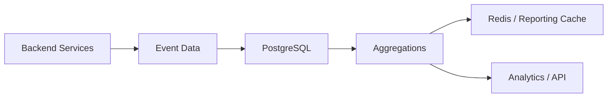

# 08- Date Truncation

## Overview

Date truncation reduces a date or timestamp to a specified calendar boundary such as a year, month, day, hour, or minute. In PostgreSQL, `DATE_TRUNC()` is the primary function for timestamp truncation.

It is especially useful for:

- Time-based aggregation.
- Reporting by month, day, or hour.
- Building dashboards and analytics queries.
- Grouping events into time buckets.
- Normalizing timestamps to a consistent precision.
- Generating calendar-aligned boundaries.

The key distinction is between **truncating a timestamp** and **extracting a component**. `DATE_TRUNC()` returns a timestamp representing the beginning of a time period, while `EXTRACT()` returns a numeric component.

```sql
SELECT DATE_TRUNC('month', TIMESTAMPTZ '2026-08-30 14:37:22+00');
```

Result:

```text
2026-08-01 00:00:00+00
```

## Why Date Truncation Matters

Backend systems frequently store events at timestamp precision but need to analyze them at a coarser granularity.

For example, an application may store:

```text
2026-08-30 14:37:22
2026-08-30 15:12:09
2026-08-31 09:05:41
```

A reporting query may need:

```text
2026-08-30
2026-08-30
2026-08-31
```

Instead of manually calculating boundaries in application code, the database can normalize timestamps directly.

This is particularly useful for event-driven systems where PostgreSQL stores data produced by REST APIs, gRPC services, Celery workers, Kafka consumers, or scheduled jobs.

## `DATE_TRUNC()` Syntax

The PostgreSQL syntax is:

```sql
DATE_TRUNC(field, source)
```

For timezone-aware timestamps, an optional timezone argument can also be supplied in supported PostgreSQL versions:

```sql
DATE_TRUNC(field, source, time_zone)
```

Common fields include:

| Field | Truncates to |
|---|---|
| `microseconds` | Microsecond precision |
| `milliseconds` | Millisecond boundary |
| `second` | Start of second |
| `minute` | Start of minute |
| `hour` | Start of hour |
| `day` | Start of day |
| `week` | Start of ISO week |
| `month` | Start of month |
| `quarter` | Start of quarter |
| `year` | Start of year |
| `decade` | Start of decade |
| `century` | Start of century |
| `millennium` | Start of millennium |

Example:

```sql
SELECT DATE_TRUNC(
    'hour',
    TIMESTAMP '2026-08-30 14:37:22'
);
```

Result:

```text
2026-08-30 14:00:00
```

The lower-order components are reset to their period boundary.

## Truncation by Common Granularities

### Year

```sql
SELECT DATE_TRUNC(
    'year',
    TIMESTAMP '2026-08-30 14:37:22'
);
```

Result:

```text
2026-01-01 00:00:00
```

### Quarter

```sql
SELECT DATE_TRUNC(
    'quarter',
    TIMESTAMP '2026-08-30 14:37:22'
);
```

Result:

```text
2026-07-01 00:00:00
```

August belongs to the third quarter.

### Month

```sql
SELECT DATE_TRUNC(
    'month',
    TIMESTAMP '2026-08-30 14:37:22'
);
```

Result:

```text
2026-08-01 00:00:00
```

### Week

```sql
SELECT DATE_TRUNC(
    'week',
    TIMESTAMP '2026-08-30 14:37:22'
);
```

PostgreSQL truncates to the beginning of the ISO week, which starts on Monday.

This matters for weekly reports because "week" is not universally defined as Sunday through Saturday.

### Day

```sql
SELECT DATE_TRUNC(
    'day',
    TIMESTAMP '2026-08-30 14:37:22'
);
```

Result:

```text
2026-08-30 00:00:00
```

### Hour

```sql
SELECT DATE_TRUNC(
    'hour',
    TIMESTAMP '2026-08-30 14:37:22'
);
```

Result:

```text
2026-08-30 14:00:00
```

### Minute

```sql
SELECT DATE_TRUNC(
    'minute',
    TIMESTAMP '2026-08-30 14:37:22'
);
```

Result:

```text
2026-08-30 14:37:00
```

## Truncation vs Extraction

`DATE_TRUNC()` and `EXTRACT()` solve different problems.

```sql
SELECT DATE_TRUNC(
    'month',
    created_at
)
FROM orders;
```

returns a timestamp such as:

```text
2026-08-01 00:00:00
```

Whereas:

```sql
SELECT EXTRACT(
    MONTH FROM created_at
)
FROM orders;
```

returns:

```text
8
```

| Requirement | Use |
|---|---|
| Get the beginning of a period | `DATE_TRUNC()` |
| Get a numeric component | `EXTRACT()` |
| Group timestamps into periods | Usually `DATE_TRUNC()` |
| Get month number | `EXTRACT(MONTH ...)` |
| Get year number | `EXTRACT(YEAR ...)` |
| Build time buckets | `DATE_TRUNC()` |

A senior-level rule is to choose based on the **shape of the value required by the next operation**, not simply on which function appears familiar.

## Grouping Data by Time Period

One of the most common uses of `DATE_TRUNC()` is time-based aggregation.

Suppose an `orders` table contains:

```text
id
created_at
total_amount
```

Monthly revenue can be calculated with:

```sql
SELECT
    DATE_TRUNC('month', created_at) AS month,
    SUM(total_amount) AS revenue
FROM orders
GROUP BY DATE_TRUNC('month', created_at)
ORDER BY month;
```

This converts every timestamp in the same month into the same grouping key.

A typical result:

| month | revenue |
|---|---:|
| 2026-06-01 00:00:00 | 125000 |
| 2026-07-01 00:00:00 | 138500 |
| 2026-08-01 00:00:00 | 147200 |

The timestamp returned by `DATE_TRUNC()` is effectively acting as the **bucket identifier**.

## Daily Aggregation

For API or application events:

```sql
SELECT
    DATE_TRUNC('day', created_at) AS day,
    COUNT(*) AS request_count
FROM api_requests
GROUP BY DATE_TRUNC('day', created_at)
ORDER BY day;
```

This is useful for:

- Daily request volume.
- Daily signups.
- Daily orders.
- Daily errors.
- Daily job execution counts.

## Hourly Aggregation

For operational dashboards:

```sql
SELECT
    DATE_TRUNC('hour', created_at) AS hour,
    COUNT(*) AS error_count
FROM application_errors
WHERE created_at >= CURRENT_TIMESTAMP - INTERVAL '24 hours'
GROUP BY DATE_TRUNC('hour', created_at)
ORDER BY hour;
```

This produces fixed hourly buckets that can be consumed by a monitoring or reporting layer.

For very large datasets, repeatedly computing aggregates over raw historical events can become expensive. Production systems often combine appropriate indexes, partitioning, pre-aggregated tables, materialized views, or dedicated analytics systems.

## Time-Series Bucketing

Date truncation can be viewed as a bucketing operation:


For example:

```text
2026-08-30 10:12:11 ─┐
2026-08-30 10:27:43 ─┼──> 2026-08-30 10:00:00
2026-08-30 10:51:02 ─┘

2026-08-30 11:02:15 ─┐
2026-08-30 11:48:29 ─┴──> 2026-08-30 11:00:00
```

This makes aggregation deterministic and easy to reason about.

## Date Truncation and Time Zones

Time zones are one of the most important production concerns with timestamp truncation.

Consider a `TIMESTAMPTZ` value:

```sql
SELECT DATE_TRUNC(
    'day',
    TIMESTAMPTZ '2026-08-30 23:30:00+00'
);
```

The resulting day boundary depends on the timezone used for the operation.

By default, PostgreSQL's session timezone influences how `TIMESTAMPTZ` values are represented and truncated.

You can inspect the current session timezone:

```sql
SHOW TIME ZONE;
```

You can set it for a session:

```sql
SET TIME ZONE 'Asia/Kolkata';
```

Then:

```sql
SELECT DATE_TRUNC(
    'day',
    TIMESTAMPTZ '2026-08-30 23:30:00+00'
);
```

The local calendar day can differ from the UTC calendar day.

### Explicit Timezone Truncation

For reporting based on a specific business timezone, make the timezone explicit where appropriate.

```sql
SELECT DATE_TRUNC(
    'day',
    created_at,
    'Asia/Kolkata'
)
FROM orders;
```

This is particularly useful when the reporting requirement is:

> Group orders by the calendar day experienced by customers in a particular timezone.

The exact timezone semantics should be verified against the PostgreSQL version used by the production system.

## UTC Storage vs Local Reporting

A common backend architecture is:


A robust strategy is generally:

- Store event timestamps as unambiguous instants.
- Use `TIMESTAMPTZ` for real-world event timestamps in PostgreSQL.
- Perform reporting in the timezone relevant to the business requirement.
- Avoid depending on each application server's local timezone.

The important distinction is that **storage semantics and presentation semantics are different concerns**.

## Date Truncation vs Casting to `DATE`

For day-level values, these expressions may appear similar:

```sql
DATE_TRUNC('day', created_at)
```

and:

```sql
created_at::date
```

They are not identical in type or semantics.

`DATE_TRUNC()` returns a timestamp:

```text
2026-08-30 00:00:00
```

Casting to `DATE` returns:

```text
2026-08-30
```

Use:

```sql
created_at::date
```

when you genuinely need a `DATE`.

Use:

```sql
DATE_TRUNC('day', created_at)
```

when you need a timestamp representing the beginning of the day.

For simple daily grouping, both can be useful, but timezone behavior should be considered explicitly when `created_at` is `TIMESTAMPTZ`.

## Building Period Boundaries

Truncation is useful for constructing a reporting window.

For the current month:

```sql
SELECT
    DATE_TRUNC('month', CURRENT_TIMESTAMP) AS month_start,
    DATE_TRUNC('month', CURRENT_TIMESTAMP) + INTERVAL '1 month' AS next_month_start;
```

The resulting range can be used as:

```sql
WHERE created_at >= DATE_TRUNC('month', CURRENT_TIMESTAMP)
  AND created_at < DATE_TRUNC('month', CURRENT_TIMESTAMP) + INTERVAL '1 month'
```

This follows the preferred half-open interval:

```text
[start, end)
```

rather than trying to calculate the final representable instant of the month.

## Index-Friendly Date Filtering

A common mistake is applying `DATE_TRUNC()` directly to an indexed column in a filtering predicate:

```sql
WHERE DATE_TRUNC('day', created_at) = DATE '2026-08-30'
```

Although logically correct, this transforms the column before comparison and can prevent a normal index on `created_at` from being used efficiently.

Prefer a range:

```sql
WHERE created_at >= TIMESTAMPTZ '2026-08-30 00:00:00+00'
  AND created_at <  TIMESTAMPTZ '2026-08-31 00:00:00+00'
```

This keeps the indexed column on the left side of the comparison.

For a large table:

```sql
CREATE INDEX idx_api_requests_created_at
ON api_requests (created_at);
```

Then inspect the actual plan:

```sql
EXPLAIN (ANALYZE, BUFFERS)
SELECT COUNT(*)
FROM api_requests
WHERE created_at >= TIMESTAMPTZ '2026-08-30 00:00:00+00'
  AND created_at <  TIMESTAMPTZ '2026-08-31 00:00:00+00';
```

Do not optimize based only on intuition. Validate with `EXPLAIN (ANALYZE, BUFFERS)` against representative production-sized data.

## Expression Indexes

Sometimes the business query genuinely requires grouping or filtering by a truncated expression.

PostgreSQL supports expression indexes.

For example:

```sql
CREATE INDEX idx_orders_created_day
ON orders ((DATE_TRUNC('day', created_at)));
```

This can make expression-based predicates more efficient.

However, expression indexes introduce:

- Additional storage.
- Additional write overhead.
- Index maintenance cost.
- Another structure that must be considered during schema changes.

Do not create one simply because `DATE_TRUNC()` appears in a query. First determine whether a timestamp range predicate solves the problem.

## Generated Columns and Reporting Models

If an application repeatedly needs a derived calendar attribute, it may be better to model that requirement explicitly.

For example, a reporting system might maintain:

```text
event_timestamp
event_date
event_month
```

The decision depends on workload characteristics.

Prefer deriving the value dynamically when:

- The table is moderate in size.
- Queries are infrequent.
- The expression is cheap.
- The derived value is not part of a critical access path.

Consider a persisted or indexed representation when:

- The expression is used heavily.
- The dataset is large.
- Query latency requirements are strict.
- The same grouping key is repeatedly accessed.

Avoid premature denormalization.

## Week Truncation and ISO Weeks

`DATE_TRUNC('week', ...)` follows PostgreSQL's ISO-style week behavior.

For example:

```sql
SELECT DATE_TRUNC(
    'week',
    TIMESTAMP '2026-01-01 12:00:00'
);
```

The resulting timestamp represents the Monday beginning of that week.

This can produce surprising results around year boundaries because an ISO week can span two calendar years.

Do not assume:

```text
week number + calendar year
```

always uniquely identifies the same business reporting week.

For reporting systems, explicitly define whether the organization uses:

- ISO weeks.
- Sunday-start weeks.
- Fiscal weeks.
- Retail calendars.
- Custom business weeks.

## Fiscal Periods

`DATE_TRUNC()` provides calendar-oriented periods such as:

```text
year
quarter
month
week
day
```

It does not automatically implement an organization's fiscal calendar.

If the business year starts in April, for example, blindly grouping by:

```sql
DATE_TRUNC('year', created_at)
```

does not produce fiscal years.

Fiscal reporting may require:

- Explicit date dimensions.
- Fiscal-year mapping tables.
- Custom expressions.
- A dedicated analytics model.

This is an important boundary between SQL date functions and domain-specific calendar logic.

## Common Backend Example

Suppose a Django application stores customer orders in PostgreSQL:

```text
orders
├── id
├── customer_id
├── created_at
└── total_amount
```

A monthly revenue API could execute:

```sql
SELECT
    DATE_TRUNC('month', created_at) AS month,
    SUM(total_amount) AS revenue
FROM orders
WHERE created_at >= TIMESTAMPTZ '2026-01-01 00:00:00+00'
  AND created_at <  TIMESTAMPTZ '2027-01-01 00:00:00+00'
GROUP BY DATE_TRUNC('month', created_at)
ORDER BY month;
```

The application receives already-aggregated data instead of transferring every order to Python.

This is generally preferable when the aggregation is naturally relational and the database can perform it efficiently.

## Django and ORM Considerations

Django exposes PostgreSQL date truncation through database functions such as `TruncMonth`, `TruncDay`, and `TruncHour`.

For example:

```python
from django.db.models import Sum
from django.db.models.functions import TruncMonth

monthly_revenue = (
    Order.objects
    .filter(
        created_at__gte=start,
        created_at__lt=end,
    )
    .annotate(month=TruncMonth("created_at"))
    .values("month")
    .annotate(revenue=Sum("total_amount"))
    .order_by("month")
)
```

The ORM does not remove the underlying SQL performance considerations.

You still need to consider:

- Generated SQL.
- Index usage.
- Timezone configuration.
- Query cardinality.
- Table size.
- Aggregation cost.

For performance-sensitive queries, inspect the generated SQL and execution plan rather than assuming the ORM abstraction is optimal.

## Common Mistakes

### Applying `DATE_TRUNC()` to an Indexed Column for Filtering

Avoid:

```sql
WHERE DATE_TRUNC('month', created_at) = DATE '2026-08-01'
```

Prefer:

```sql
WHERE created_at >= TIMESTAMPTZ '2026-08-01 00:00:00+00'
  AND created_at <  TIMESTAMPTZ '2026-09-01 00:00:00+00'
```

The range predicate is typically more index-friendly.

### Confusing Truncation with Extraction

Do not use:

```sql
EXTRACT(MONTH FROM created_at)
```

when the query requires a complete month bucket.

`EXTRACT()` returns:

```text
8
```

while `DATE_TRUNC()` returns:

```text
2026-08-01 00:00:00
```

### Ignoring Time Zones

A UTC day and a user's local day are not necessarily the same calendar day.

Define the reporting timezone explicitly when local calendar semantics matter.

### Assuming `week` Means Sunday to Saturday

PostgreSQL's `DATE_TRUNC('week', ...)` follows ISO week behavior.

Verify the business definition before building weekly reports.

### Using Calendar Truncation for Fixed Durations

`DATE_TRUNC()` is not a replacement for fixed-duration bucketing.

For example, "every 15 minutes starting from midnight" is a different requirement from truncating to an hour.

For fixed-size buckets, consider appropriate arithmetic or a time-series-specific approach.

### Using Truncation to Hide Data-Quality Problems

Truncating timestamps can hide precision differences, but it should not be used to conceal inconsistent timestamp data.

Investigate:

- Unexpected future timestamps.
- Missing timezone information.
- Incorrect application-server clocks.
- Incorrect database timezone configuration.
- Events recorded with inconsistent semantics.

## Production Considerations

### Performance

For large datasets:

- Prefer timestamp range predicates for filtering.
- Index frequently queried timestamp columns.
- Use partitioning where workload and retention justify it.
- Validate queries with `EXPLAIN (ANALYZE, BUFFERS)`.
- Consider pre-aggregation for expensive recurring reports.
- Avoid repeatedly scanning large historical datasets for dashboards.

### Scalability

Time-based workloads often grow continuously.

A common architecture is:



For high-volume analytics, PostgreSQL may eventually be supplemented by specialized analytical storage rather than forcing transactional tables to serve every reporting workload.

### Reliability

Use deterministic period boundaries.

Prefer:

```sql
created_at >= start_time
AND created_at < end_time
```

over inclusive end timestamps.

This prevents gaps and overlaps when adjacent reporting periods are processed.

### Monitoring

Monitor:

- Query execution time.
- Rows scanned versus rows returned.
- Sequential scans on large tables.
- Aggregation memory usage.
- Temporary file creation.
- Database CPU and I/O.
- Dashboard query frequency.

If a dashboard repeatedly executes expensive historical aggregations, move the workload toward pre-aggregation or an appropriate analytics architecture.

### Security

Date truncation itself presents little security risk, but reporting queries can expose sensitive information if aggregation boundaries are poorly designed.

For multi-tenant systems:

```sql
WHERE tenant_id = $1
  AND created_at >= $2
  AND created_at < $3
```

Tenant isolation should remain part of the query's access-control design.

Never rely on a truncated timestamp as a substitute for authorization filtering.

## Interview Traps

| Question | Strong answer |
|---|---|
| What does `DATE_TRUNC()` do? | Reduces a timestamp to the beginning of a specified calendar period |
| What does `DATE_TRUNC('month', ts)` return? | A timestamp at the beginning of that month |
| What is the difference between `DATE_TRUNC()` and `EXTRACT()`? | Truncation returns a period boundary; extraction returns a component |
| What day does PostgreSQL use for `DATE_TRUNC('week', ...)`? | Monday, following ISO week conventions |
| Does `DATE_TRUNC()` always preserve the original timestamp's exact value? | No; lower-order components are reset to the period boundary |
| Why can `DATE_TRUNC()` hurt index usage in a `WHERE` clause? | Applying a function to the indexed column can prevent a normal index range scan |
| What is usually better for filtering one day? | A half-open timestamp range |
| How should timezone-aware reporting be handled? | Define the reporting timezone explicitly rather than relying on server-local time |
| Is a fiscal year the same as `DATE_TRUNC('year', ...)`? | Not necessarily; fiscal calendars require domain-specific handling |
| Why use `[start, end)` ranges? | They avoid precision problems and compose cleanly across adjacent periods |

## Key Takeaways

- **`DATE_TRUNC()` converts timestamps into deterministic calendar-period boundaries and is especially useful for time-based aggregation.**
- **Use `DATE_TRUNC()` for period buckets, `EXTRACT()` for numeric components, and timestamp ranges for efficient filtering.**
- **Treat timezone semantics explicitly when truncating `TIMESTAMPTZ` values for user-facing or business-local reports.**
- **Avoid wrapping indexed timestamp columns in functions for simple filtering; prefer half-open `[start, end)` range predicates.**
- **For large-scale reporting, combine correct truncation semantics with indexing, partitioning, pre-aggregation, and execution-plan analysis.**