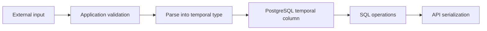

# 09- Date Formatting

## Overview

Date formatting converts `DATE`, `TIMESTAMP`, or `TIMESTAMPTZ` values into a human-readable string representation.

In PostgreSQL, the primary function for custom date and timestamp formatting is `TO_CHAR()`:

```sql
TO_CHAR(value, format)
```

For example:

```sql
SELECT TO_CHAR(
    TIMESTAMP '2026-08-30 14:37:22',
    'YYYY-MM-DD HH24:MI:SS'
);
```

Result:

```text
2026-08-30 14:37:22
```

Date formatting is primarily a **presentation concern**. In production systems, timestamps should generally remain native temporal types inside the database and be formatted only when a string representation is explicitly required.

## Why Date Formatting Matters

A database stores temporal values as structured data, not presentation strings.

For example:

```text
2026-08-30 14:37:22+00
```

may need to appear as:

```text
30 Aug 2026, 08:07 PM
```

or:

```text
2026-08-30T14:37:22Z
```

The underlying instant should remain a temporal value while the representation can change depending on the consumer.

A typical backend flow is:


Formatting becomes particularly important for:

- Reports.
- CSV exports.
- Administrative dashboards.
- SQL-generated text output.
- Legacy integrations.
- Human-readable database reports.

For REST and gRPC APIs, however, it is usually preferable to preserve machine-readable temporal semantics and let the API serialization layer control the external representation.

## `TO_CHAR()` for Date and Timestamp Formatting

The basic syntax is:

```sql
SELECT TO_CHAR(
    created_at,
    'YYYY-MM-DD'
)
FROM orders;
```

Example:

```sql
SELECT TO_CHAR(
    TIMESTAMP '2026-08-30 14:37:22',
    'YYYY-MM-DD'
);
```

Result:

```text
2026-08-30
```

A timestamp can include time components:

```sql
SELECT TO_CHAR(
    TIMESTAMP '2026-08-30 14:37:22',
    'YYYY-MM-DD HH24:MI:SS'
);
```

Result:

```text
2026-08-30 14:37:22
```

## Common Date Format Patterns

PostgreSQL uses format patterns rather than the formatting syntax used by Python, Java, or JavaScript.

| Pattern | Meaning | Example |
|---|---|---|
| `YYYY` | Four-digit year | `2026` |
| `YY` | Two-digit year | `26` |
| `MM` | Month number | `08` |
| `DD` | Day of month | `30` |
| `DDD` | Day of year | `242` |
| `HH24` | Hour, 00–23 | `14` |
| `HH12` | Hour, 01–12 | `02` |
| `MI` | Minute | `37` |
| `SS` | Second | `22` |
| `MS` | Milliseconds | `123` |
| `US` | Microseconds | `123456` |
| `AM` / `PM` | Meridian indicator | `PM` |
| `Month` | Full month name | `August` |
| `Mon` | Abbreviated month | `Aug` |
| `Day` | Full day name | `Sunday` |
| `Dy` | Abbreviated day | `Sun` |

Example:

```sql
SELECT TO_CHAR(
    TIMESTAMP '2026-08-30 14:37:22',
    'DD Mon YYYY'
);
```

Result:

```text
30 Aug 2026
```

## Common Production Formats

### ISO-Like Date

```sql
SELECT TO_CHAR(
    created_at,
    'YYYY-MM-DD'
)
FROM orders;
```

Output:

```text
2026-08-30
```

### Date and 24-Hour Time

```sql
SELECT TO_CHAR(
    created_at,
    'YYYY-MM-DD HH24:MI:SS'
)
FROM orders;
```

Output:

```text
2026-08-30 14:37:22
```

### Human-Readable Format

```sql
SELECT TO_CHAR(
    created_at,
    'DD Mon YYYY, HH24:MI'
)
FROM orders;
```

Output:

```text
30 Aug 2026, 14:37
```

### 12-Hour Clock

```sql
SELECT TO_CHAR(
    created_at,
    'DD Mon YYYY, HH12:MI PM'
)
FROM orders;
```

Output:

```text
30 Aug 2026, 02:37 PM
```

`HH12` should normally be paired with `AM` or `PM` when the distinction between morning and afternoon matters.

## Formatting Date Values

Formatting a `DATE` is straightforward:

```sql
SELECT TO_CHAR(
    DATE '2026-08-30',
    'DD/MM/YYYY'
);
```

Result:

```text
30/08/2026
```

The output type is `text`.

This distinction matters:

```sql
SELECT pg_typeof(
    TO_CHAR(DATE '2026-08-30', 'YYYY-MM-DD')
);
```

The result is:

```text
text
```

Formatting therefore changes the data from a native temporal value into a string.

## Formatting `TIMESTAMP`

For a timestamp without timezone:

```sql
SELECT TO_CHAR(
    TIMESTAMP '2026-08-30 14:37:22.123456',
    'YYYY-MM-DD HH24:MI:SS.US'
);
```

Result:

```text
2026-08-30 14:37:22.123456
```

The format can include fractional seconds when required.

## Formatting `TIMESTAMPTZ`

`TIMESTAMPTZ` represents an absolute instant, while PostgreSQL uses a timezone when displaying or formatting that value.

For example:

```sql
SELECT TO_CHAR(
    TIMESTAMPTZ '2026-08-30 14:37:22+00',
    'YYYY-MM-DD HH24:MI:SS TZ'
);
```

The displayed result depends on the session timezone.

Inspect the current timezone with:

```sql
SHOW TIME ZONE;
```

You can explicitly set it for a session:

```sql
SET TIME ZONE 'Asia/Kolkata';
```

Then:

```sql
SELECT TO_CHAR(
    TIMESTAMPTZ '2026-08-30 14:37:22+00',
    'YYYY-MM-DD HH24:MI:SS TZ'
);
```

The same instant may therefore produce different local clock representations under different timezones.

## Explicit Timezone Conversion Before Formatting

When formatting a `TIMESTAMPTZ` for a particular business or user timezone, make the timezone conversion explicit.

```sql
SELECT TO_CHAR(
    created_at AT TIME ZONE 'Asia/Kolkata',
    'YYYY-MM-DD HH24:MI:SS'
)
FROM orders;
```

For a `TIMESTAMPTZ`, `AT TIME ZONE` converts the instant into a timestamp representing the local wall-clock time in the specified timezone.

The important sequence is:

```text
Absolute instant
      ↓
Timezone conversion
      ↓
Local wall-clock timestamp
      ↓
String formatting
```

Do not confuse timezone conversion with formatting. They solve different problems.

## Formatting and Localization

`TO_CHAR()` can produce localized month and day names according to PostgreSQL's locale-related configuration.

For example:

```sql
SELECT TO_CHAR(
    DATE '2026-08-30',
    'TMMonth'
);
```

`TM` requests localized output where supported by the configured locale.

For user-facing applications, application-level internationalization is often a better architectural choice because formatting requirements may depend on:

- User locale.
- User timezone.
- Language.
- Regional conventions.
- Accessibility requirements.
- Client platform.

The database should not become the primary localization engine for an API serving many locales unless there is a specific architectural reason.

## `TO_CHAR()` vs Casting

A common distinction is:

```sql
created_at::date
```

versus:

```sql
TO_CHAR(created_at, 'YYYY-MM-DD')
```

The first returns a `DATE`.

The second returns `TEXT`.

| Expression | Result type | Primary purpose |
|---|---|---|
| `created_at::date` | `date` | Remove time component |
| `DATE_TRUNC('day', created_at)` | `timestamp` / timezone-aware equivalent | Get day boundary |
| `TO_CHAR(created_at, 'YYYY-MM-DD')` | `text` | Format for presentation |

Use a native temporal type whenever subsequent operations still need date semantics.

Use `TO_CHAR()` when the value is intentionally becoming a display string.

## Formatting vs Parsing

Formatting and parsing are different operations.

Formatting:

```text
timestamp → string
```

For example:

```sql
SELECT TO_CHAR(
    TIMESTAMP '2026-08-30 14:37:22',
    'YYYY-MM-DD'
);
```

Parsing:

```text
string → timestamp/date
```

PostgreSQL provides `TO_DATE()` and `TO_TIMESTAMP()` for explicit parsing.

For example:

```sql
SELECT TO_DATE(
    '30-08-2026',
    'DD-MM-YYYY'
);
```

Result:

```text
2026-08-30
```

For timestamps:

```sql
SELECT TO_TIMESTAMP(
    '2026-08-30 14:37:22',
    'YYYY-MM-DD HH24:MI:SS'
);
```

The general rule is:

| Operation | PostgreSQL function |
|---|---|
| Date → formatted text | `TO_CHAR()` |
| Text → date | `TO_DATE()` |
| Text → timestamp | `TO_TIMESTAMP()` |

## Formatting Is Not Validation

A format mask controls how PostgreSQL interprets or displays a value. It should not be treated as a general-purpose validation mechanism for external input.

For application input, validate at the API boundary and convert into a native temporal value before persistence.

A safer backend flow is:



Avoid storing dates as strings simply because the incoming API sends:

```text
30/08/2026
```

Store:

```text
2026-08-30
```

as a `DATE` column after parsing and validation.

## Date Formatting in Reports

Formatting is appropriate when SQL directly produces a human-readable report.

For example:

```sql
SELECT
    order_id,
    TO_CHAR(created_at, 'DD Mon YYYY HH24:MI') AS ordered_at,
    total_amount
FROM orders
ORDER BY created_at DESC;
```

Output:

| order_id | ordered_at | total_amount |
|---|---|---:|
| 1004 | 30 Aug 2026 14:37 | 1299.00 |
| 1003 | 29 Aug 2026 18:42 | 845.00 |

This can be useful for:

- Internal administrative queries.
- SQL-based reports.
- Database exports.
- Operational investigation.

For APIs, returning native temporal data and allowing the serializer/client to format it is generally cleaner.

## Date Formatting in Aggregation Queries

Formatting should generally happen **after** the database has performed date arithmetic and aggregation.

Prefer:

```sql
SELECT
    DATE_TRUNC('month', created_at) AS month,
    SUM(total_amount) AS revenue
FROM orders
GROUP BY DATE_TRUNC('month', created_at)
ORDER BY month;
```

Then format the final result if necessary:

```sql
SELECT
    TO_CHAR(
        DATE_TRUNC('month', created_at),
        'YYYY-MM'
    ) AS month,
    SUM(total_amount) AS revenue
FROM orders
GROUP BY DATE_TRUNC('month', created_at)
ORDER BY DATE_TRUNC('month', created_at);
```

The underlying grouping remains based on a temporal boundary rather than a presentation string.

## Why Sorting Formatted Dates Can Be Dangerous

Suppose dates are formatted as:

```text
30/08/2026
01/09/2026
15/10/2026
```

Lexicographic string ordering does not necessarily correspond to chronological ordering.

Avoid:

```sql
ORDER BY TO_CHAR(created_at, 'DD/MM/YYYY');
```

Prefer:

```sql
ORDER BY created_at;
```

or:

```sql
ORDER BY DATE_TRUNC('day', created_at);
```

and format only the displayed value.

This principle is important:

> **Sort and filter using native temporal values; format only at the presentation boundary.**

## Indexing and Performance

Formatting is computational work performed for each row that reaches the expression.

For example:

```sql
SELECT TO_CHAR(created_at, 'YYYY-MM-DD')
FROM events;
```

is usually reasonable for a limited result set.

It becomes less attractive when formatting millions of rows unnecessarily.

More importantly, avoid using formatted strings as filtering keys:

```sql
WHERE TO_CHAR(created_at, 'YYYY-MM-DD') = '2026-08-30'
```

Prefer a range:

```sql
WHERE created_at >= TIMESTAMPTZ '2026-08-30 00:00:00+00'
  AND created_at <  TIMESTAMPTZ '2026-08-31 00:00:00+00'
```

This preserves the temporal semantics and is typically much more index-friendly.

If an expression-based access path is genuinely required, PostgreSQL supports expression indexes, but this should be driven by measured workload requirements rather than convenience.

## API Design Considerations

For REST APIs, avoid unnecessarily converting timestamps into arbitrary display strings inside SQL.

Prefer returning a canonical representation from the API serialization layer, for example:

```json
{
  "created_at": "2026-08-30T14:37:22Z"
}
```

The exact API contract should be consistent across services.

A Django or FastAPI application can then control:

- Serialization.
- Timezone conversion.
- API versioning.
- Locale-specific presentation.
- Client compatibility.

The database should generally remain responsible for storing and querying temporal data, not for implementing every presentation format required by clients.

## Python and SQL Formatting

Python and PostgreSQL use different formatting systems.

For example, Python commonly uses:

```python
from datetime import datetime, timezone

value = datetime.now(timezone.utc)
formatted = value.strftime("%Y-%m-%d %H:%M:%S")
```

PostgreSQL uses:

```sql
SELECT TO_CHAR(
    CURRENT_TIMESTAMP,
    'YYYY-MM-DD HH24:MI:SS'
);
```

Do not mix the format syntax.

| Requirement | PostgreSQL | Python |
|---|---|---|
| Year | `YYYY` | `%Y` |
| Month | `MM` | `%m` |
| Day | `DD` | `%d` |
| 24-hour hour | `HH24` | `%H` |
| Minute | `MI` | `%M` |
| Second | `SS` | `%S` |

The correct choice depends on where the presentation responsibility belongs.

## Common Mistakes

### Formatting Too Early

Avoid converting timestamps into strings before completing date calculations:

```sql
TO_CHAR(created_at, 'YYYY-MM-DD')
```

followed by string-based date logic.

Keep the value temporal until the final presentation step.

### Filtering on Formatted Strings

Avoid:

```sql
WHERE TO_CHAR(created_at, 'YYYY-MM') = '2026-08'
```

Prefer:

```sql
WHERE created_at >= TIMESTAMPTZ '2026-08-01 00:00:00+00'
  AND created_at <  TIMESTAMPTZ '2026-09-01 00:00:00+00'
```

### Sorting Formatted Dates

Avoid:

```sql
ORDER BY TO_CHAR(created_at, 'DD/MM/YYYY')
```

Sort the native timestamp instead.

### Confusing `MM` and `MI`

In PostgreSQL:

```text
MM = month
MI = minute
```

Therefore:

```sql
'YYYY-MM-DD HH24:MM:SS'
```

is incorrect for normal timestamp formatting because `MM` represents the month.

Use:

```sql
'YYYY-MM-DD HH24:MI:SS'
```

### Confusing `HH24` and `HH12`

Use:

```sql
HH24
```

for a 24-hour clock:

```text
00–23
```

Use:

```sql
HH12
```

with `AM` or `PM` for a 12-hour clock:

```text
01–12
```

### Assuming Formatting Converts Timezones

This:

```sql
TO_CHAR(created_at, 'YYYY-MM-DD HH24:MI:SS')
```

does not inherently mean "convert this value to the user's timezone."

Timezone conversion and string formatting are separate operations.

### Storing Formatted Dates

Avoid schemas such as:

```text
created_at VARCHAR
```

when the value represents an actual timestamp.

Prefer:

```sql
created_at TIMESTAMPTZ NOT NULL
```

Store temporal semantics as temporal types.

## Production Considerations

### Database Responsibility

Use PostgreSQL formatting when:

- SQL directly generates reports.
- An integration explicitly requires a string format.
- A database-side export requires formatted values.
- Formatting is part of a database-level presentation requirement.

Prefer application-side formatting when:

- Multiple clients need different formats.
- User locale affects the output.
- User timezone affects presentation.
- The value is part of an API contract.
- Internationalization is required.

### Performance

For large result sets:

- Avoid unnecessary `TO_CHAR()` calls.
- Do not format values before filtering or aggregation.
- Filter using native timestamp ranges.
- Sort using native temporal columns.
- Return only the rows required by the application.
- Measure expensive reporting queries with `EXPLAIN (ANALYZE, BUFFERS)`.

### Timezone Consistency

Establish a clear application-wide policy.

A common backend design is:

```text
Storage       → UTC-aware timestamp
Query         → Native temporal operations
Business rule → Explicit business timezone
API           → Canonical timestamp representation
UI            → User-local presentation
```

The exact policy can differ by domain, but it should be explicit and consistent across services.

### Reliability

Avoid ambiguous formats such as:

```text
08/09/2026
```

because different systems can interpret this as either:

```text
8 September 2026
```

or:

```text
August 9, 2026
```

For machine-to-machine communication, prefer an unambiguous standard such as an ISO 8601-compatible representation.

### Security

Date formatting is not normally a security boundary.

However, generated SQL must still use parameterized queries for dynamic values. Never construct SQL by interpolating user-controlled strings into SQL expressions.

Prefer:

```python
cursor.execute(
    """
    SELECT TO_CHAR(created_at, %s)
    FROM orders
    WHERE customer_id = %s
    """,
    ("YYYY-MM-DD", customer_id),
)
```

The format string itself should ideally come from a controlled application configuration or allowlist when users can influence presentation options.

## Interview Traps

| Question | Strong answer |
|---|---|
| What does `TO_CHAR()` do? | Converts a temporal or numeric value into formatted text |
| Does `TO_CHAR()` return a date? | No, it returns text |
| What is `MM` in PostgreSQL formatting? | Month |
| What is `MI`? | Minute |
| What is `HH24`? | 24-hour clock representation |
| What is `HH12`? | 12-hour clock representation |
| Should formatted dates be used for filtering? | Generally no; use native temporal range predicates |
| Should formatted dates be used for sorting? | Generally no; sort by the native temporal value |
| How should a timestamp be converted to a user's timezone? | Perform explicit timezone conversion, then format if necessary |
| Should API timestamps normally be formatted in SQL? | Usually not; serialization is generally an application/API responsibility |
| What is the difference between formatting and parsing? | Formatting converts temporal data to text; parsing converts text into temporal data |
| Why store dates as `DATE` or `TIMESTAMPTZ` instead of strings? | Native types preserve temporal semantics and enable correct comparison, indexing, arithmetic, and validation |

## Key Takeaways

- **Use `TO_CHAR()` to convert temporal values into presentation-oriented text, not as a replacement for native date and timestamp types.**
- **Keep timestamps as temporal values for filtering, sorting, aggregation, and arithmetic; format only at the presentation boundary.**
- **For `TIMESTAMPTZ`, perform explicit timezone conversion when business or user-local time matters, then format the resulting representation.**
- **Avoid filtering or sorting on formatted date strings because it can produce incorrect semantics and poor index usage.**
- **For backend APIs, prefer canonical temporal representations and keep locale-specific presentation in the application or client layer.**