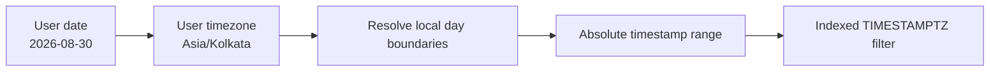

# 10- Date Filtering

## Overview

Date filtering is the process of selecting rows based on `DATE`, `TIMESTAMP`, or `TIMESTAMPTZ` values.

In production backend systems, date filtering is common for:

- Fetching records created within a time window.
- Building dashboards and reports.
- Implementing retention policies.
- Processing events incrementally.
- Finding records modified since the last job execution.
- Implementing time-based pagination or synchronization.
- Supporting business rules such as subscriptions, bookings, and expirations.

The critical engineering principle is to **filter using native temporal values and explicit boundaries**, rather than converting dates to strings or extracting date components unnecessarily.

```sql
SELECT *
FROM orders
WHERE created_at >= TIMESTAMPTZ '2026-08-01 00:00:00+00'
  AND created_at <  TIMESTAMPTZ '2026-09-01 00:00:00+00';
```

This half-open interval:

```text
[start, end)
```

includes the start boundary and excludes the end boundary. It is one of the safest patterns for production date filtering.

## Temporal Data Types

PostgreSQL provides several temporal types with different semantics.

| Type | Stores | Typical backend use |
|---|---|---|
| `DATE` | Calendar date | Birth date, business date, holiday |
| `TIME` | Time of day | Opening time, daily schedule |
| `TIMESTAMP` | Date + time without timezone | Local wall-clock values where timezone is intentionally irrelevant |
| `TIMESTAMPTZ` | Absolute instant with timezone-aware semantics | Events, audit records, API timestamps |
| `INTERVAL` | Duration | Retention periods, scheduling calculations |

For most distributed backend systems, `TIMESTAMPTZ` is the safer default for events representing a real point in time.

Example:

```sql
CREATE TABLE orders (
    id BIGINT PRIMARY KEY,
    created_at TIMESTAMPTZ NOT NULL DEFAULT CURRENT_TIMESTAMP
);
```

## Basic Comparison Operators

Temporal values support normal comparison operators:

```sql
=
<>
>
>=
<
<=
```

Example:

```sql
SELECT *
FROM orders
WHERE created_at >= TIMESTAMPTZ '2026-08-30 00:00:00+00';
```

This returns orders created at or after the specified instant.

Other examples:

```sql
SELECT *
FROM orders
WHERE created_at < TIMESTAMPTZ '2026-09-01 00:00:00+00';
```

```sql
SELECT *
FROM orders
WHERE created_at = TIMESTAMPTZ '2026-08-30 14:30:00+00';
```

Exact timestamp equality is uncommon for user-facing searches because timestamps often contain fractional seconds.

## Filtering by a Date Range

For an inclusive start and exclusive end:

```sql
SELECT *
FROM orders
WHERE created_at >= TIMESTAMPTZ '2026-08-01 00:00:00+00'
  AND created_at <  TIMESTAMPTZ '2026-09-01 00:00:00+00';
```

Conceptually:

```text
                included                    excluded
                   ↓                            ↓
             2026-08-01                  2026-09-01
                  [------------------------------)
```

This includes every instant during August without needing to guess the final representable timestamp of the month.

## Why Half-Open Intervals Are Preferred

A common mistake is to write:

```sql
WHERE created_at BETWEEN
    '2026-08-01 00:00:00'
    AND
    '2026-08-31 23:59:59'
```

This can miss records containing fractional seconds after `23:59:59`, such as:

```text
2026-08-31 23:59:59.500000
```

Instead:

```sql
WHERE created_at >= TIMESTAMPTZ '2026-08-01 00:00:00+00'
  AND created_at <  TIMESTAMPTZ '2026-09-01 00:00:00+00'
```

The half-open interval also composes cleanly:

```text
August:   [Aug 1, Sep 1)
September:[Sep 1, Oct 1)
```

There is no overlap and no gap between adjacent periods.

## `BETWEEN`

`BETWEEN` is inclusive at both ends:

```sql
WHERE created_at BETWEEN
    TIMESTAMPTZ '2026-08-01 00:00:00+00'
    AND
    TIMESTAMPTZ '2026-08-31 23:59:59+00'
```

It is useful when both endpoints genuinely represent inclusive boundaries.

For timestamp ranges covering complete calendar periods, however, explicit half-open predicates are usually clearer:

```sql
WHERE created_at >= :start_time
  AND created_at < :end_time
```

### `BETWEEN` Semantics

```text
BETWEEN start AND end

start <= value <= end
```

Whereas the preferred half-open form is:

```text
start <= value < end
```

Understanding this distinction is a common SQL interview topic.

## Filtering a `DATE` Column

For a `DATE` column, range filtering is simpler because there is no time-of-day component.

```sql
SELECT *
FROM users
WHERE birth_date >= DATE '1990-01-01'
  AND birth_date <  DATE '2000-01-01';
```

This selects dates from January 1, 1990 through December 31, 1999.

For an exact date:

```sql
SELECT *
FROM users
WHERE birth_date = DATE '1995-06-15';
```

## Filtering by a Calendar Day

Suppose:

```text
created_at = TIMESTAMPTZ
```

and the requirement is:

> Find all events occurring on August 30, 2026.

Avoid:

```sql
WHERE created_at::date = DATE '2026-08-30'
```

when the column is indexed and the query is performance-sensitive.

Prefer a range:

```sql
WHERE created_at >= TIMESTAMPTZ '2026-08-30 00:00:00+00'
  AND created_at <  TIMESTAMPTZ '2026-08-31 00:00:00+00';
```

The range expresses the exact set of instants and allows PostgreSQL to use an ordinary index on `created_at` efficiently.

## The Timezone Problem

"August 30" is not a globally unique time interval.

For example:

```text
August 30 in UTC
```

is different from:

```text
August 30 in Asia/Kolkata
```

Therefore, a production requirement such as:

> Show orders created on August 30 according to the user's local timezone.

requires three distinct concepts:

1. The user's calendar date.
2. The user's timezone.
3. The UTC or database timestamp range corresponding to that local day.



The database query should ultimately operate on absolute temporal boundaries.

## Timezone-Aware Day Filtering

For a `TIMESTAMPTZ` column, PostgreSQL can construct a local-day range using timezone-aware expressions.

For example, to find events occurring on August 30, 2026 in `Asia/Kolkata`:

```sql
SELECT *
FROM events
WHERE created_at >= TIMESTAMPTZ '2026-08-30 00:00:00 Asia/Kolkata'
  AND created_at <  TIMESTAMPTZ '2026-08-31 00:00:00 Asia/Kolkata';
```

The resulting instants are converted to the absolute timeline used by `TIMESTAMPTZ`.

In application code, it is often cleaner to resolve the user's local start and end boundaries first and pass the resulting aware timestamps as parameters.

## DST and Calendar-Day Filtering

Daylight saving time makes fixed-duration assumptions dangerous.

A local calendar day is not necessarily exactly:

```text
24 hours
```

Some days contain 23 hours and others 25 hours due to DST transitions.

Therefore, do not implement:

```text
end = start + 24 hours
```

when the business requirement is "the next local calendar day."

Instead, calculate:

```text
local date
→ next local date
→ timezone conversion
→ absolute timestamp boundaries
```

This is especially important for systems serving users in regions with DST.

## Filtering Relative to the Current Time

PostgreSQL provides current-time functions such as:

```sql
CURRENT_DATE
```

and:

```sql
CURRENT_TIMESTAMP
```

Example:

```sql
SELECT *
FROM sessions
WHERE expires_at > CURRENT_TIMESTAMP;
```

This retrieves sessions that have not yet expired.

For records created within the last hour:

```sql
SELECT *
FROM events
WHERE created_at >= CURRENT_TIMESTAMP - INTERVAL '1 hour';
```

For the previous seven days:

```sql
SELECT *
FROM events
WHERE created_at >= CURRENT_TIMESTAMP - INTERVAL '7 days';
```

## Current Time and Transaction Semantics

PostgreSQL distinguishes several notions of current time.

The most commonly used is:

```sql
CURRENT_TIMESTAMP
```

which represents the start time of the current transaction.

PostgreSQL also provides:

```sql
statement_timestamp()
```

and:

```sql
clock_timestamp()
```

They have different semantics.

| Function | Behavior |
|---|---|
| `CURRENT_TIMESTAMP` | Transaction start time |
| `statement_timestamp()` | Start time of the current statement |
| `clock_timestamp()` | Actual wall-clock time when evaluated |

For normal data filtering, `CURRENT_TIMESTAMP` is usually the appropriate choice because a query or transaction gets a consistent notion of "now."

## Filtering Future Records

To find scheduled jobs that should execute:

```sql
SELECT *
FROM scheduled_jobs
WHERE scheduled_for <= CURRENT_TIMESTAMP
  AND status = 'pending';
```

A worker such as Celery can use this pattern to claim due work.

For future events:

```sql
SELECT *
FROM appointments
WHERE scheduled_for > CURRENT_TIMESTAMP;
```

For a bounded future window:

```sql
SELECT *
FROM appointments
WHERE scheduled_for >= CURRENT_TIMESTAMP
  AND scheduled_for < CURRENT_TIMESTAMP + INTERVAL '24 hours';
```

## Filtering by Year, Month, or Day

PostgreSQL provides extraction functions such as:

```sql
EXTRACT(YEAR FROM created_at)
EXTRACT(MONTH FROM created_at)
EXTRACT(DAY FROM created_at)
```

For example:

```sql
SELECT *
FROM orders
WHERE EXTRACT(YEAR FROM created_at) = 2026;
```

This is readable but can be problematic for a large indexed table because the database must evaluate an expression against the column.

For an indexed timestamp, prefer a range:

```sql
SELECT *
FROM orders
WHERE created_at >= TIMESTAMPTZ '2026-01-01 00:00:00+00'
  AND created_at <  TIMESTAMPTZ '2027-01-01 00:00:00+00';
```

The same principle applies to months:

```sql
SELECT *
FROM orders
WHERE created_at >= TIMESTAMPTZ '2026-08-01 00:00:00+00'
  AND created_at <  TIMESTAMPTZ '2026-09-01 00:00:00+00';
```

## `DATE_TRUNC()` in Filtering

`DATE_TRUNC()` can normalize a timestamp to a particular boundary:

```sql
DATE_TRUNC('day', created_at)
```

For example:

```sql
SELECT DATE_TRUNC('month', TIMESTAMP '2026-08-30 14:37:22');
```

returns the start of the month.

It can be useful for grouping:

```sql
SELECT
    DATE_TRUNC('month', created_at) AS month,
    COUNT(*) AS order_count
FROM orders
GROUP BY DATE_TRUNC('month', created_at)
ORDER BY month;
```

For selective filtering on an indexed timestamp, however, prefer a range predicate over applying `DATE_TRUNC()` directly to the column.

## Index Usage

Suppose:

```sql
CREATE INDEX idx_orders_created_at
ON orders (created_at);
```

Prefer:

```sql
SELECT *
FROM orders
WHERE created_at >= :start_time
  AND created_at < :end_time;
```

The predicate compares the indexed column directly with boundary values.

Be cautious with:

```sql
WHERE DATE(created_at) = :date
```

or:

```sql
WHERE DATE_TRUNC('day', created_at) = :day
```

These expressions transform the indexed column before comparison.

A useful mental model is:

```text
Good:

indexed_column >= boundary
AND
indexed_column < boundary


Potentially problematic:

function(indexed_column) = value
```

If an expression-based predicate is required by a specific workload, PostgreSQL can support expression indexes. Do not add one automatically; measure the query and choose the index based on actual access patterns.

## Query Planner Considerations

Use:

```sql
EXPLAIN (ANALYZE, BUFFERS)
```

to verify how PostgreSQL executes a date-filtering query.

Example:

```sql
EXPLAIN (ANALYZE, BUFFERS)
SELECT *
FROM orders
WHERE created_at >= TIMESTAMPTZ '2026-08-01 00:00:00+00'
  AND created_at <  TIMESTAMPTZ '2026-09-01 00:00:00+00';
```

Look for:

- Index Scan.
- Index Only Scan where applicable.
- Bitmap Index Scan.
- Rows estimated versus actual.
- Heap blocks read.
- Execution time.
- Whether a sequential scan is more efficient for a large fraction of the table.

An index is not guaranteed to be used. PostgreSQL's planner may correctly choose a sequential scan when the requested range covers a large percentage of the table.

## Date Filtering and Partitioning

Large event tables are often partitioned by time.

For example:

```text
events
├── events_2026_08
├── events_2026_09
└── events_2026_10
```

A query such as:

```sql
SELECT *
FROM events
WHERE created_at >= TIMESTAMPTZ '2026-08-01 00:00:00+00'
  AND created_at <  TIMESTAMPTZ '2026-09-01 00:00:00+00';
```

can allow PostgreSQL to eliminate partitions that cannot contain matching rows.

This is called **partition pruning**.

The key production principle is that the filtering predicate should expose the partition key clearly enough for the planner to determine which partitions are relevant.

## Date Filtering for Incremental Processing

Date filtering is frequently used for background workers and data pipelines.

A naive approach is:

```sql
SELECT *
FROM events
WHERE created_at > :last_processed_at;
```

This can be insufficient if multiple rows share the same timestamp or if records arrive with identical timestamps.

A more robust keyset approach uses a deterministic tie-breaker:

```sql
SELECT *
FROM events
WHERE (created_at, id) > (:last_created_at, :last_id)
ORDER BY created_at, id
LIMIT 1000;
```

This provides stable pagination through a large event stream.

The composite index should match the access pattern:

```sql
CREATE INDEX idx_events_created_at_id
ON events (created_at, id);
```

This pattern is useful for:

- ETL jobs.
- Kafka publishing workers.
- Search indexing.
- Data synchronization.
- Batch processing.
- Large-table migrations.

## Filtering Records for Retention

Suppose events older than 90 days should be removed:

```sql
DELETE FROM events
WHERE created_at < CURRENT_TIMESTAMP - INTERVAL '90 days';
```

For a large production table, a single massive `DELETE` can generate substantial:

- WAL.
- Lock pressure.
- Dead tuples.
- Autovacuum work.
- Replication lag.
- I/O load.

Operationally, large retention jobs may need:

- Batched deletion.
- Time-based partitioning.
- Partition dropping.
- Controlled scheduling.
- Monitoring of replication lag and database load.

For very large append-only datasets, partitioning can make retention dramatically cheaper because dropping an old partition avoids row-by-row deletion.

## Parameterized Date Filtering

Application code should pass temporal boundaries as parameters.

For example, with Python:

```python
cursor.execute(
    """
    SELECT id, created_at, total_amount
    FROM orders
    WHERE created_at >= %s
      AND created_at < %s
    ORDER BY created_at, id
    """,
    (start_time, end_time),
)
```

Do not construct SQL using string interpolation:

```python
query = f"""
    SELECT *
    FROM orders
    WHERE created_at >= '{start_time}'
"""
```

Parameterized queries provide safer separation between SQL structure and values and allow the database driver to handle appropriate type conversion.

## Django Example

Django's ORM can express the same range efficiently.

```python
orders = Order.objects.filter(
    created_at__gte=start_time,
    created_at__lt=end_time,
).order_by("created_at", "id")
```

This is generally preferable to applying Python or database functions to every row.

For a date-only business field:

```python
users = User.objects.filter(
    birth_date__gte=date(1990, 1, 1),
    birth_date__lt=date(2000, 1, 1),
)
```

Keep the semantics of the Django field aligned with the database column type.

## FastAPI Example

A FastAPI endpoint might accept a time range:

```python
from datetime import datetime

from fastapi import FastAPI, Query

app = FastAPI()


@app.get("/events")
def list_events(
    start: datetime = Query(...),
    end: datetime = Query(...),
):
    if start >= end:
        raise ValueError("start must be before end")

    # Pass aware datetimes to the database layer.
    return {"start": start, "end": end}
```

The service layer should then convert the validated request into a parameterized SQL query.

The API contract should define whether timestamps must contain an explicit timezone or offset. Ambiguous local timestamps should generally be rejected or explicitly interpreted according to a documented business timezone.

## Common Date Filtering Patterns

| Requirement | Recommended pattern |
|---|---|
| Exact `DATE` | `date_column = :date` |
| Date range | `column >= :start AND column < :end` |
| Current records | `column >= CURRENT_TIMESTAMP` |
| Expired records | `column < CURRENT_TIMESTAMP` |
| Last N hours | `column >= CURRENT_TIMESTAMP - INTERVAL 'N hours'` |
| Calendar month | Start/end range |
| Calendar year | Start/end range |
| User-local day | Convert local boundaries to absolute timestamps |
| Large-table incremental processing | `(timestamp, id)` keyset predicate |
| Retention | Time range, preferably with partition strategy at scale |

## Common Mistakes

### Using String Conversion for Filtering

Avoid:

```sql
WHERE TO_CHAR(created_at, 'YYYY-MM-DD') = '2026-08-30'
```

The query converts each candidate timestamp to text before comparison and obscures the temporal semantics.

Prefer:

```sql
WHERE created_at >= TIMESTAMPTZ '2026-08-30 00:00:00+00'
  AND created_at <  TIMESTAMPTZ '2026-08-31 00:00:00+00';
```

### Using `BETWEEN` with a Manually Constructed End-of-Day

Avoid:

```sql
WHERE created_at BETWEEN
    :start_of_day
    AND
    :end_of_day
```

where `:end_of_day` is manually set to `23:59:59`.

Use:

```sql
WHERE created_at >= :start_of_day
  AND created_at < :start_of_next_day
```

### Ignoring Fractional Seconds

This predicate:

```sql
created_at <= '2026-08-30 23:59:59'
```

does not include:

```text
2026-08-30 23:59:59.123456
```

Half-open ranges avoid this class of bug.

### Ignoring Timezones

A query for:

```text
2026-08-30
```

is incomplete if the system does not know which timezone defines that calendar day.

Always distinguish:

```text
calendar date
```

from:

```text
absolute instant
```

### Applying Functions to Indexed Columns

Avoid unnecessary expressions such as:

```sql
WHERE EXTRACT(YEAR FROM created_at) = 2026
```

or:

```sql
WHERE DATE(created_at) = :date
```

when an indexed range predicate can express the same requirement.

### Assuming 24 Hours Equals One Local Day

This can fail around daylight saving transitions.

Use calendar arithmetic in the intended timezone when the requirement is based on local dates.

### Using Application Local Time Without a Contract

If one service runs in UTC and another uses a local server timezone, apparently identical queries can produce different results.

Prefer explicit timezone-aware values and a documented storage/query policy.

## Production Best Practices

### Prefer Half-Open Ranges

Use:

```sql
column >= :start
AND column < :end
```

for most timestamp range queries.

This eliminates end-of-day precision problems and makes adjacent ranges compose cleanly.

### Keep Columns Native

Prefer:

```sql
created_at TIMESTAMPTZ NOT NULL
```

over:

```sql
created_at VARCHAR
```

Native temporal columns support:

- Correct comparisons.
- Date arithmetic.
- Indexing.
- Constraints.
- Query planner optimizations.
- Timezone semantics where applicable.

### Keep Timezone Semantics Explicit

For distributed systems, a common design is:

```text
Database
    ↓
Absolute timestamp

Application
    ↓
Business timezone conversion

API
    ↓
Canonical timestamp

Client
    ↓
User-local presentation
```

Do not let server operating-system timezone configuration silently determine business behavior.

### Index According to Access Patterns

For frequent queries such as:

```sql
WHERE created_at >= :start
  AND created_at < :end
```

consider:

```sql
CREATE INDEX idx_events_created_at
ON events (created_at);
```

For keyset pagination:

```sql
CREATE INDEX idx_events_created_at_id
ON events (created_at, id);
```

For large append-only tables, evaluate time partitioning when retention and query locality justify the additional operational complexity.

### Validate Query Plans

Do not assume an index is useful merely because one exists.

Measure with:

```sql
EXPLAIN (ANALYZE, BUFFERS)
```

and inspect real production-like data volumes.

### Avoid Fetching Unnecessary Rows

A date predicate that returns millions of records is still expensive even when the predicate is index-friendly.

Combine filtering with:

- Appropriate projections.
- Pagination.
- Aggregation.
- Partition pruning.
- Reasonable batch sizes.

## Reliability and Operational Considerations

Date filtering often appears in scheduled workers and operational jobs, where correctness matters more than simple query syntax.

For a recurring worker:

```text
Worker
  ↓
Determine checkpoint/window
  ↓
Query [start, end)
  ↓
Process records
  ↓
Persist checkpoint
  ↓
Repeat
```

The checkpoint should be designed to tolerate retries and failures.

For example, a worker processing:

```text
[10:00, 11:00)
```

should not accidentally skip records at exactly:

```text
11:00:00
```

because the next window can naturally begin at:

```text
[11:00, 12:00)
```

For high-reliability pipelines, combine temporal boundaries with a deterministic key such as `id`, and design processing to be idempotent where possible.

## Security Considerations

Date filtering itself is not usually a security boundary, but date parameters can influence authorization-sensitive queries.

For example, never assume a client-provided range is automatically authorized:

```text
GET /reports?start=2020-01-01&end=2030-01-01
```

The service must still enforce:

- Tenant boundaries.
- User permissions.
- Maximum query ranges where appropriate.
- Row-level access rules.
- Parameter validation.

In multi-tenant systems, the date predicate should be combined with tenant isolation:

```sql
SELECT *
FROM events
WHERE tenant_id = :tenant_id
  AND created_at >= :start_time
  AND created_at < :end_time;
```

Date filtering should never replace authorization filtering.

## Interview Traps

| Question | Strong answer |
|---|---|
| Why prefer `>= start AND < end`? | It avoids precision problems and composes cleanly for adjacent ranges |
| Is `BETWEEN` inclusive? | Yes, both endpoints are inclusive |
| Why can `DATE(created_at) = :date` hurt performance? | It applies an expression to the indexed column instead of directly constraining the column |
| How do you query a calendar month efficiently? | Use the month's start boundary and the next month's start boundary |
| How do you query a user's local day? | Resolve local start/end boundaries in the user's timezone and filter the absolute timestamp column using those boundaries |
| Is a local day always 24 hours? | No; DST can produce 23- or 25-hour local days |
| Why store event timestamps as `TIMESTAMPTZ`? | It represents an absolute instant and avoids treating local wall-clock time as globally unambiguous |
| How do you filter the last 24 hours? | Use an instant-based interval such as `created_at >= CURRENT_TIMESTAMP - INTERVAL '24 hours'` |
| How do you filter a calendar day? | Use the exact start of that day and the start of the next day |
| How do you paginate large time-ordered datasets reliably? | Use keyset pagination, commonly `(created_at, id)` |
| Does PostgreSQL always use an index for a date range? | No; the planner chooses based on estimated cost and selectivity |
| What is partition pruning? | Eliminating time partitions that cannot contain rows matching the filter |

## Key Takeaways

- **Prefer half-open temporal ranges: `column >= start AND column < end`; they avoid end-of-day precision bugs and compose cleanly.**
- **Filter indexed temporal columns directly instead of applying functions such as `DATE()`, `TO_CHAR()`, or `EXTRACT()` to them unnecessarily.**
- **Treat calendar dates and absolute instants as different concepts; timezone-aware filtering requires explicit local-day boundaries.**
- **For large datasets and incremental processing, combine temporal filtering with appropriate indexes, partitioning, or `(timestamp, id)` keyset pagination.**
- **Keep date filtering parameterized, timezone semantics explicit, and authorization constraints separate from the temporal predicate.**