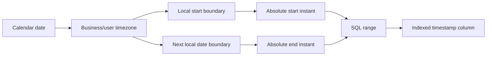

# 11- Date Ranges

## Overview

Date ranges are a fundamental SQL pattern for retrieving records between two temporal boundaries. They appear in reporting, analytics, APIs, background jobs, auditing, billing, retention, and incremental data processing.

The most reliable production pattern for timestamp ranges is a **half-open interval**:

```sql
WHERE created_at >= :start_time
  AND created_at < :end_time
```

This represents:

```text
[start_time, end_time)
```

The start is included; the end is excluded.

This convention avoids fractional-second bugs, makes adjacent ranges compose without overlap, and works naturally with indexes and partitioning.

## Why Date Ranges Matter

A backend service frequently needs queries such as:

- Orders created during a billing period.
- Events generated during a specific hour.
- Requests received during a reporting day.
- Records modified since the previous synchronization.
- Jobs scheduled within the next processing window.
- Audit events during an incident investigation.
- Data belonging to a particular calendar month.

The database should receive **precise temporal boundaries**, rather than being asked to repeatedly transform every stored timestamp.

For example:

```sql
SELECT id, created_at, total_amount
FROM orders
WHERE created_at >= TIMESTAMPTZ '2026-08-01 00:00:00+00'
  AND created_at <  TIMESTAMPTZ '2026-09-01 00:00:00+00'
ORDER BY created_at, id;
```

This query expresses the business period precisely and allows PostgreSQL to reason directly about `created_at`.

## Date Range Semantics

A range has two independent properties:

- **Boundary inclusion** — whether the start or end is included.
- **Boundary representation** — whether boundaries represent instants, calendar dates, or local business times.

Common interval types are:

| Range | Meaning | Typical use |
|---|---|---|
| `[start, end)` | Start included, end excluded | Production timestamp queries |
| `[start, end]` | Both included | Discrete values or genuinely inclusive endpoints |
| `(start, end)` | Both excluded | Specialized business rules |
| `[start, ∞)` | Start onward | Open-ended activity |
| `(-∞, end)` | Before end | Retention or historical queries |

For continuous timestamps, `[start, end)` is generally the safest convention.

## Inclusive and Exclusive Boundaries

Consider two daily windows:

```text
Day 1: [2026-08-30 00:00:00, 2026-08-31 00:00:00)
Day 2: [2026-08-31 00:00:00, 2026-09-01 00:00:00)
```

The boundary:

```text
2026-08-31 00:00:00
```

belongs only to Day 2.

There is neither an overlap nor a gap.

This becomes especially valuable when processing data in batches:

```text
Batch A: [10:00, 11:00)
Batch B: [11:00, 12:00)
Batch C: [12:00, 13:00)
```

Every timestamp belongs to exactly one batch.

## `BETWEEN` and Date Ranges

SQL `BETWEEN` is inclusive at both ends.

```sql
WHERE created_at BETWEEN :start_time AND :end_time
```

is equivalent to:

```sql
WHERE created_at >= :start_time
  AND created_at <= :end_time
```

For timestamp ranges, this can create boundary problems.

Suppose:

```text
start = 2026-08-01 00:00:00
end   = 2026-08-31 23:59:59
```

A row containing:

```text
2026-08-31 23:59:59.500000
```

is outside the range.

Avoid manufacturing an artificial "last second of the day." Instead, use the next boundary:

```sql
WHERE created_at >= TIMESTAMPTZ '2026-08-01 00:00:00+00'
  AND created_at <  TIMESTAMPTZ '2026-09-01 00:00:00+00';
```

## Date Ranges vs Timestamp Ranges

A `DATE` represents a calendar date. A timestamp represents a point on a timeline or a date/time value depending on its type and semantics.

For a `DATE` column:

```sql
SELECT *
FROM users
WHERE birth_date >= DATE '1990-01-01'
  AND birth_date < DATE '2000-01-01';
```

For a timestamp column:

```sql
SELECT *
FROM events
WHERE created_at >= TIMESTAMPTZ '2026-01-01 00:00:00+00'
  AND created_at <  TIMESTAMPTZ '2027-01-01 00:00:00+00';
```

Do not treat a calendar date as if it were already an absolute timestamp.

## Calendar Ranges

Calendar-based requirements are different from duration-based requirements.

Examples:

```text
January 2026
August 30, 2026
Q3 2026
2026
Business week
Billing period
```

For a month:

```sql
SELECT COUNT(*)
FROM orders
WHERE created_at >= TIMESTAMPTZ '2026-08-01 00:00:00+00'
  AND created_at <  TIMESTAMPTZ '2026-09-01 00:00:00+00';
```

For a year:

```sql
SELECT COUNT(*)
FROM orders
WHERE created_at >= TIMESTAMPTZ '2026-01-01 00:00:00+00'
  AND created_at <  TIMESTAMPTZ '2027-01-01 00:00:00+00';
```

The upper boundary should be the beginning of the following calendar period.

## Duration Ranges

A duration represents elapsed time rather than a calendar period.

For example, the previous 24 hours:

```sql
SELECT *
FROM events
WHERE created_at >= CURRENT_TIMESTAMP - INTERVAL '24 hours'
  AND created_at < CURRENT_TIMESTAMP;
```

This is different from:

> All events created yesterday.

"Previous 24 hours" is an elapsed-time requirement.

"Yesterday" is a calendar requirement.

That distinction matters around timezone and daylight-saving transitions.

## Current-Time Ranges

PostgreSQL provides `CURRENT_TIMESTAMP` for transaction-consistent current time.

Example:

```sql
SELECT *
FROM sessions
WHERE expires_at > CURRENT_TIMESTAMP;
```

A future window can be expressed as:

```sql
SELECT *
FROM appointments
WHERE scheduled_for >= CURRENT_TIMESTAMP
  AND scheduled_for < CURRENT_TIMESTAMP + INTERVAL '7 days';
```

The semantics are:

```text
now ──────────────────────── now + 7 days
 ↑                              ↑
 included                       excluded
```

Use a fixed upper boundary if the query needs a stable snapshot of the range.

## User-Defined Date Ranges

An API might expose:

```text
GET /orders?start=2026-08-01T00:00:00Z&end=2026-09-01T00:00:00Z
```

The application should:

1. Parse the input.
2. Validate that both values are valid.
3. Validate timezone semantics.
4. Ensure `start < end`.
5. Apply business limits.
6. Pass the values as query parameters.

The SQL should remain parameterized:

```sql
SELECT id, created_at, total_amount
FROM orders
WHERE created_at >= :start_time
  AND created_at < :end_time
ORDER BY created_at, id;
```

Do not construct SQL by interpolating request parameters.

## API Range Validation

A production API should not blindly accept arbitrary ranges.

For example:

```python
from datetime import datetime, timedelta, timezone


def validate_range(start: datetime, end: datetime) -> None:
    if start.tzinfo is None or end.tzinfo is None:
        raise ValueError("timestamps must be timezone-aware")

    if start >= end:
        raise ValueError("start must be before end")

    if end - start > timedelta(days=31):
        raise ValueError("date range cannot exceed 31 days")
```

The maximum range is a business and capacity decision, not a universal SQL rule.

Limits can protect the database from accidentally expensive reporting requests.

## Timezone-Aware Date Ranges

A calendar date is timezone-dependent.

For example:

```text
2026-08-30 in UTC
```

does not represent the same interval as:

```text
2026-08-30 in Asia/Kolkata
```

If the requirement is:

> Return orders created on August 30 according to the customer's timezone.

the service must first determine:

```text
calendar date
        ↓
customer timezone
        ↓
local start of day
        ↓
local start of next day
        ↓
absolute timestamp boundaries
        ↓
SQL range query
```



For a timezone-aware database column, use the resulting absolute boundaries:

```sql
WHERE created_at >= :start_instant
  AND created_at < :end_instant
```

This keeps timezone conversion out of the indexed column expression.

## DST and Date Ranges

Daylight saving time introduces an important distinction:

```text
calendar day
```

is not always:

```text
24 elapsed hours
```

A local day can be 23 or 25 hours.

Therefore, if the business requirement is a local calendar day, do not calculate:

```text
end = start + 24 hours
```

Instead:

```text
local date
→ next local calendar date
→ timezone conversion
→ absolute boundaries
```

This is a critical distinction for global applications.

## Index-Friendly Date Ranges

Assume:

```sql
CREATE INDEX idx_orders_created_at
ON orders (created_at);
```

The preferred predicate is:

```sql
WHERE created_at >= :start_time
  AND created_at < :end_time
```

The indexed column remains directly comparable to the boundary values.

Avoid unnecessary transformations:

```sql
WHERE DATE(created_at) = :date
```

```sql
WHERE DATE_TRUNC('day', created_at) = :day
```

```sql
WHERE EXTRACT(YEAR FROM created_at) = 2026
```

These expressions can prevent PostgreSQL from using a normal index as efficiently because the query is operating on a derived expression rather than directly constraining the indexed column.

For example, replace:

```sql
WHERE EXTRACT(YEAR FROM created_at) = 2026
```

with:

```sql
WHERE created_at >= TIMESTAMPTZ '2026-01-01 00:00:00+00'
  AND created_at <  TIMESTAMPTZ '2027-01-01 00:00:00+00';
```

## Composite Indexes for Date Ranges

Date filtering is often combined with another predicate.

For example:

```sql
SELECT *
FROM orders
WHERE tenant_id = :tenant_id
  AND created_at >= :start_time
  AND created_at < :end_time;
```

A potentially useful index is:

```sql
CREATE INDEX idx_orders_tenant_created_at
ON orders (tenant_id, created_at);
```

The correct column order depends on the workload.

If queries primarily identify a tenant and then scan a time range within that tenant, this ordering is often appropriate:

```text
tenant_id → created_at range
```

For a different workload, another ordering may be better.

Do not select composite index order based solely on intuition; validate with real query plans and workload characteristics.

## Date Ranges and Query Planning

Use:

```sql
EXPLAIN (ANALYZE, BUFFERS)
```

to inspect a production-like query.

```sql
EXPLAIN (ANALYZE, BUFFERS)
SELECT id, created_at
FROM orders
WHERE created_at >= TIMESTAMPTZ '2026-08-01 00:00:00+00'
  AND created_at <  TIMESTAMPTZ '2026-09-01 00:00:00+00';
```

Important signals include:

- Estimated versus actual row counts.
- Index Scan versus Sequential Scan.
- Bitmap scans.
- Buffer reads.
- Execution time.
- Rows removed by filtering.
- Whether the range is selective enough to justify index access.

An index does not guarantee an index scan. If the range covers most of a table, a sequential scan can be the correct plan.

## Date Ranges and Partitioning

Time-based partitioning is useful for very large tables where data naturally follows temporal access patterns.

For example:

```text
events
├── events_2026_07
├── events_2026_08
├── events_2026_09
└── events_2026_10
```

A range query:

```sql
SELECT *
FROM events
WHERE created_at >= TIMESTAMPTZ '2026-08-01 00:00:00+00'
  AND created_at <  TIMESTAMPTZ '2026-09-01 00:00:00+00';
```

can allow PostgreSQL to prune partitions outside August.

This provides two major operational benefits:

- Less data needs to be scanned.
- Old partitions can be managed independently for retention.

Partitioning should not be introduced merely because a table is large. It adds operational and schema complexity and should be justified by access patterns, retention requirements, and measured performance.

## Date Ranges for Incremental Processing

Background workers frequently process records created or modified since a checkpoint.

A simple approach is:

```sql
SELECT *
FROM events
WHERE created_at > :last_processed_at
ORDER BY created_at;
```

This can be ambiguous when multiple rows have the same timestamp.

A stronger approach uses a deterministic tie-breaker:

```sql
SELECT id, created_at, payload
FROM events
WHERE (created_at, id) > (:last_created_at, :last_id)
ORDER BY created_at, id
LIMIT 1000;
```

With:

```sql
CREATE INDEX idx_events_created_at_id
ON events (created_at, id);
```

This provides stable keyset pagination.

It is useful for:

- ETL pipelines.
- Search indexing.
- Event publishing.
- Data synchronization.
- Batch workers.
- Large migrations.

## Windowed Batch Processing

For controlled batch processing, explicit windows are often easier to reason about:

```sql
SELECT id, created_at
FROM events
WHERE created_at >= :window_start
  AND created_at < :window_end
ORDER BY created_at, id;
```

The worker can process:

```text
[00:00, 01:00)
[01:00, 02:00)
[02:00, 03:00)
```

without overlap.

However, timestamps alone may not be sufficient when records can arrive late or when `created_at` does not represent processing order. For event-driven systems, consider an explicit event sequence, ingestion timestamp, or durable checkpoint strategy.

## Date Ranges and Late-Arriving Data

Consider an event whose business timestamp is:

```text
2026-08-30 10:00
```

but which is inserted into the database at:

```text
2026-08-30 10:15
```

A job that processes only:

```text
created_at < 10:00
```

may behave differently depending on whether `created_at` represents event time or ingestion time.

For event-driven systems, distinguish fields such as:

```text
event_at
ingested_at
processed_at
```

They answer different questions.

Do not use one timestamp to represent multiple temporal concepts.

## Date Ranges in Django

Django can express half-open ranges using `__gte` and `__lt`:

```python
orders = Order.objects.filter(
    created_at__gte=start_time,
    created_at__lt=end_time,
).order_by("created_at", "id")
```

This maps naturally to:

```sql
WHERE created_at >= ...
  AND created_at < ...
```

For date-only fields:

```python
users = User.objects.filter(
    birth_date__gte=start_date,
    birth_date__lt=end_date,
)
```

Prefer explicit boundaries rather than broad lookups that hide timezone or boundary behavior.

## Date Ranges in SQL and Reporting

Reporting queries often aggregate by a temporal range:

```sql
SELECT
    COUNT(*) AS order_count,
    SUM(total_amount) AS revenue
FROM orders
WHERE created_at >= :start_time
  AND created_at < :end_time;
```

For monthly reporting:

```sql
SELECT
    DATE_TRUNC('month', created_at) AS month,
    COUNT(*) AS order_count,
    SUM(total_amount) AS revenue
FROM orders
WHERE created_at >= TIMESTAMPTZ '2026-01-01 00:00:00+00'
  AND created_at <  TIMESTAMPTZ '2027-01-01 00:00:00+00'
GROUP BY DATE_TRUNC('month', created_at)
ORDER BY month;
```

Notice the distinction:

- The `WHERE` clause uses a range for efficient filtering.
- `DATE_TRUNC()` is used for grouping the already selected rows.

This separation is often preferable to applying functions to the timestamp solely for filtering.

## Date Range Validation

A production service should validate:

| Validation | Reason |
|---|---|
| `start < end` | Prevent invalid or empty ranges |
| Both timestamps have explicit timezone semantics | Avoid ambiguous instants |
| Maximum range | Protect database capacity |
| Allowed historical window | Prevent unnecessary expensive scans |
| Tenant authorization | Prevent cross-tenant access |
| Pagination/aggregation requirements | Prevent huge result sets |
| Business-calendar rules | Ensure the range matches domain semantics |

For example:

```python
if start >= end:
    raise ValueError("start must be before end")

if end - start > timedelta(days=31):
    raise ValueError("maximum supported range is 31 days")
```

## Security Considerations

Date ranges can become an indirect denial-of-service vector.

An endpoint such as:

```text
GET /audit-events?start=2000-01-01&end=2030-01-01
```

could force the database to process a very large dataset.

Production APIs may therefore enforce:

- Maximum date-range duration.
- Maximum result count.
- Pagination.
- Rate limits.
- Role-based access.
- Tenant restrictions.
- Query timeouts for expensive reporting operations.

The date predicate must also be combined with authorization constraints:

```sql
SELECT *
FROM audit_events
WHERE tenant_id = :tenant_id
  AND created_at >= :start_time
  AND created_at < :end_time;
```

A valid date range does not imply that the caller is authorized to see the rows.

## Reliability Considerations

Time-window processing must account for retries and failures.

A robust batch workflow can use:

```text
Checkpoint
    ↓
Determine [start, end)
    ↓
Read rows
    ↓
Process idempotently
    ↓
Commit result
    ↓
Advance checkpoint
```

Do not advance the checkpoint before successful processing.

For example:

```text
Processed:
[10:00, 11:00)

Next:
[11:00, 12:00)
```

The half-open convention ensures the boundary is not accidentally skipped or processed twice.

For systems where records can arrive late, consider a watermark or replay window rather than assuming that the timestamp order is identical to ingestion order.

## Retention with Date Ranges

Retention policies commonly use a date boundary:

```sql
DELETE FROM audit_events
WHERE created_at < CURRENT_TIMESTAMP - INTERVAL '90 days';
```

For large tables, this can generate significant:

- WAL.
- Dead tuples.
- Vacuum work.
- Replication traffic.
- I/O.
- Lock contention.

For very large append-only datasets, time-based partitioning can make retention operationally cheaper by allowing old partitions to be detached or dropped rather than deleting millions of rows individually.

## Common Mistakes

### Using End-of-Day Timestamps

Avoid:

```sql
WHERE created_at <= '2026-08-31 23:59:59'
```

Use:

```sql
WHERE created_at >= '2026-08-01 00:00:00'
  AND created_at <  '2026-09-01 00:00:00'
```

### Forgetting Fractional Seconds

This:

```sql
created_at <= '2026-08-31 23:59:59'
```

does not include:

```text
2026-08-31 23:59:59.500000
```

Half-open ranges eliminate this problem.

### Treating `BETWEEN` as Half-Open

`BETWEEN` includes both endpoints:

```sql
value BETWEEN start AND end
```

means:

```sql
value >= start
AND value <= end
```

It is not equivalent to:

```sql
value >= start
AND value < end
```

### Applying Functions to the Indexed Column

Avoid:

```sql
WHERE DATE(created_at) = :date
```

when an ordinary indexed range can express the requirement.

Prefer:

```sql
WHERE created_at >= :start
  AND created_at < :end
```

### Ignoring Timezones

A date such as:

```text
2026-08-30
```

does not uniquely identify a global interval.

Always define the timezone when the requirement is based on a user's or business's local calendar.

### Assuming Every Day Is 24 Hours

Calendar days can differ in elapsed duration because of timezone and DST rules.

Do not convert local calendar-day requirements into fixed 24-hour durations.

### Using One Timestamp for Multiple Meanings

Do not use `created_at` simultaneously to mean:

```text
business event time
ingestion time
processing time
```

Store distinct timestamps when those concepts have different semantics.

### Allowing Unbounded API Ranges

A technically valid query can still be operationally dangerous.

Avoid endpoints that allow unlimited historical scans without pagination, authorization, or range limits.

## Production Best Practices

| Practice | Recommendation |
|---|---|
| Timestamp ranges | Prefer `[start, end)` |
| Calendar periods | Use start of period and start of next period |
| Indexed timestamps | Compare column directly to boundaries |
| Timezones | Resolve local calendar boundaries explicitly |
| APIs | Validate and parameterize ranges |
| Large queries | Use pagination, aggregation, or batching |
| Incremental processing | Use deterministic checkpoints |
| High-volume tables | Evaluate time partitioning |
| Retention | Prefer partition lifecycle management at sufficient scale |
| Query performance | Verify with `EXPLAIN (ANALYZE, BUFFERS)` |
| Security | Combine range filters with authorization and tenant predicates |

## Interview Traps

| Question | Strong answer |
|---|---|
| What is the preferred timestamp range pattern? | `column >= start AND column < end` |
| Why use a half-open interval? | It avoids precision issues and allows adjacent ranges without overlap |
| Is `BETWEEN` inclusive? | Yes, both endpoints are inclusive |
| Why avoid `23:59:59` as an end boundary? | Fractional seconds can exist after that value |
| How do you query a month efficiently? | Use the first instant of the month and the first instant of the next month |
| Why can `DATE(created_at) = :date` hurt performance? | It transforms the indexed column instead of directly constraining it |
| How do you query a user's local day? | Calculate the local start and next local-day boundary, then convert them to absolute instants |
| Is a local day always 24 hours? | No; DST can create 23- or 25-hour days |
| How do you process records incrementally? | Use a durable checkpoint and deterministic ordering, often `(timestamp, id)` |
| Does adding an index guarantee an index scan? | No; PostgreSQL chooses the lowest-cost plan |
| How can date ranges help partitioned tables? | They enable partition pruning when the range aligns with the partition key |
| What is the difference between a calendar period and a duration? | A calendar period follows calendar boundaries; a duration measures elapsed time |

## Key Takeaways

- **Use half-open ranges — `start <= value < end` — as the default pattern for timestamp filtering.**
- **Represent calendar periods with the start of the current period and the start of the next period instead of manually constructing an end-of-day timestamp.**
- **Keep indexed timestamp columns unmodified in predicates; calculate boundaries outside the column expression.**
- **Treat timezone-aware calendar ranges, elapsed durations, and absolute instants as distinct concepts.**
- **For production workloads, combine date ranges with appropriate indexes, bounded APIs, deterministic checkpoints, and partitioning where scale justifies it.**