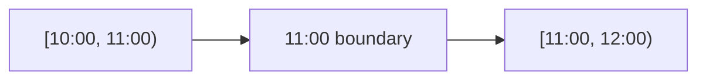

# 12- Inclusive vs Exclusive Time Ranges

## Overview

SQL date and timestamp filtering depends not only on the values being compared, but also on whether the range boundaries are **inclusive** or **exclusive**.

The two common forms are:

```text
Inclusive: [start, end]
Exclusive: (start, end)
Half-open: [start, end)
```

For production timestamp queries, the **half-open interval**—start inclusive and end exclusive—is generally the most robust convention:

```sql
WHERE created_at >= :start_time
  AND created_at < :end_time
```

This convention avoids precision problems, prevents overlapping adjacent ranges, works naturally with timestamps of arbitrary precision, and maps cleanly to batch processing and partitioning.

## Range Boundary Semantics

A range can independently define whether each boundary is included.

| Range | Start | End | SQL equivalent |
|---|---|---|---|
| `[start, end]` | Included | Included | `>= start AND <= end` |
| `[start, end)` | Included | Excluded | `>= start AND < end` |
| `(start, end]` | Excluded | Included | `> start AND <= end` |
| `(start, end)` | Excluded | Excluded | `> start AND < end` |

The notation:

```text
[start, end)
```

means:

```text
start <= value < end
```

The `[` means included, while `)` means excluded.

## Why Half-Open Ranges Are Preferred

Suppose an application processes events hourly.

Using inclusive ranges:

```text
[10:00, 11:00]
[11:00, 12:00]
```

the event at exactly:

```text
11:00:00
```

belongs to both ranges.

That creates duplicate processing.

With half-open ranges:

```text
[10:00, 11:00)
[11:00, 12:00)
```

the boundary belongs only to the second range.



This gives three useful properties:

- No overlap between adjacent ranges.
- No gap between adjacent ranges.
- Every timestamp belongs to exactly one range.

## Inclusive Ranges

An inclusive range includes both endpoints.

```sql
SELECT *
FROM orders
WHERE created_at >= :start_time
  AND created_at <= :end_time;
```

This is appropriate when the business requirement genuinely means:

> Include records whose timestamp is exactly equal to both boundaries.

Inclusive ranges are also useful for discrete values where the endpoint is naturally representable.

For example:

```sql
SELECT *
FROM invoices
WHERE invoice_number BETWEEN 1000 AND 2000;
```

`BETWEEN` is inclusive at both boundaries.

## Exclusive Ranges

An exclusive range excludes both boundaries:

```sql
SELECT *
FROM events
WHERE occurred_at > :start_time
  AND occurred_at < :end_time;
```

This can be appropriate when the business semantics explicitly require strict inequality.

For example:

> Find events strictly after the previous checkpoint and strictly before the current checkpoint.

However, fully exclusive timestamp ranges are less common than half-open ranges in production data pipelines.

## Half-Open Ranges

The standard timestamp pattern is:

```sql
SELECT *
FROM events
WHERE occurred_at >= :start_time
  AND occurred_at < :end_time;
```

This means:

```text
start_time ≤ occurred_at < end_time
```

For example:

```text
[2026-08-30 10:00:00, 2026-08-30 11:00:00)
```

includes:

```text
10:00:00
10:15:32
10:59:59.999999
```

but excludes:

```text
11:00:00
```

This remains correct regardless of the timestamp's fractional-second precision.

## The Precision Problem with Inclusive Endpoints

A common implementation mistake is defining the end of a day as:

```text
23:59:59
```

For example:

```sql
WHERE created_at >= '2026-08-30 00:00:00'
  AND created_at <= '2026-08-30 23:59:59';
```

This can miss values such as:

```text
2026-08-30 23:59:59.123456
```

or:

```text
2026-08-30 23:59:59.999999
```

The exact precision depends on the database type and system, but the underlying problem is the same: there is no universal "last possible timestamp of the day" that should be manually constructed.

Prefer:

```sql
WHERE created_at >= TIMESTAMPTZ '2026-08-30 00:00:00+00'
  AND created_at <  TIMESTAMPTZ '2026-08-31 00:00:00+00';
```

The next period's start is a precise and stable exclusive boundary.

## `BETWEEN` Is Inclusive

`BETWEEN` frequently causes confusion.

```sql
WHERE created_at BETWEEN :start_time AND :end_time
```

is equivalent to:

```sql
WHERE created_at >= :start_time
  AND created_at <= :end_time
```

It is **not** equivalent to:

```sql
WHERE created_at >= :start_time
  AND created_at < :end_time
```

Therefore, avoid `BETWEEN` when you specifically need half-open timestamp semantics.

## Adjacent Time Windows

Half-open ranges compose naturally.

Suppose a system processes one-hour windows:

```text
Window A: [09:00, 10:00)
Window B: [10:00, 11:00)
Window C: [11:00, 12:00)
```

The complete interval is:

```text
[09:00, 12:00)
```

and can be divided without changing the meaning of the overall range.

This property is valuable for:

- ETL jobs.
- Kafka event processing.
- Celery workers.
- Metrics aggregation.
- Audit processing.
- Data migrations.
- Time-based partitioning.
- Scheduled reporting.

## Range Composition

Consider:

```sql
WHERE occurred_at >= :start
  AND occurred_at < :end
```

If:

```text
start = 10:00
end   = 12:00
```

the range can safely be divided:

```text
[10:00, 11:00)
+
[11:00, 12:00)
```

without changing the set of matching timestamps.

This makes half-open ranges particularly useful when a large job is split among multiple workers.

## Date-Based Ranges

For a calendar day, calculate:

```text
start = beginning of requested day
end   = beginning of next day
```

Then query:

```sql
SELECT *
FROM orders
WHERE created_at >= :start
  AND created_at < :end;
```

For example:

```text
Requested date: 2026-08-30

start = 2026-08-30 00:00:00
end   = 2026-08-31 00:00:00
```

This is preferable to:

```text
start = 00:00:00
end   = 23:59:59.999999
```

because the latter depends on timestamp precision.

## Monthly Ranges

The same pattern applies to months.

```sql
SELECT COUNT(*)
FROM orders
WHERE created_at >= TIMESTAMPTZ '2026-08-01 00:00:00+00'
  AND created_at <  TIMESTAMPTZ '2026-09-01 00:00:00+00';
```

The range represents exactly:

```text
August 1, 00:00
        ↓
September 1, 00:00
```

This is preferable to constructing:

```text
August 31, 23:59:59.999999
```

## Yearly Ranges

For an entire year:

```sql
SELECT COUNT(*)
FROM events
WHERE occurred_at >= TIMESTAMPTZ '2026-01-01 00:00:00+00'
  AND occurred_at <  TIMESTAMPTZ '2027-01-01 00:00:00+00';
```

The end boundary is the beginning of the next year.

This approach remains consistent across:

- Days.
- Weeks.
- Months.
- Quarters.
- Years.
- Custom business periods.

## Time Zones and Boundary Semantics

Inclusive and exclusive semantics become more important when ranges are based on local calendar dates.

Suppose a customer asks:

> Show all orders placed on August 30 in the customer's timezone.

The application must determine:

```text
August 30, local timezone
        ↓
local start of August 30
        ↓
local start of August 31
        ↓
convert both boundaries to absolute instants
        ↓
query the database
```

The final SQL remains:

```sql
WHERE created_at >= :start_instant
  AND created_at < :end_instant
```

The database does not need to know that the boundaries originally came from a user's calendar day.

## DST and Exclusive End Boundaries

Daylight-saving transitions demonstrate why calendar arithmetic and elapsed-time arithmetic must be distinguished.

A local calendar day may represent:

```text
23 elapsed hours
```

or:

```text
25 elapsed hours
```

depending on the timezone and date.

Therefore, for a local calendar day:

```text
local date
→ next local date
```

is safer than:

```text
start + 24 hours
```

The resulting local boundaries are then converted into absolute instants.

The exclusive upper boundary remains the beginning of the next calendar period.

## PostgreSQL Range Types

PostgreSQL provides native range types that make boundary semantics explicit.

For timestamps:

```sql
tsrange
```

represents timestamp ranges without timezone, while:

```sql
tstzrange
```

represents timestamp-with-time-zone ranges.

A half-open range can be represented as:

```sql
tstzrange(
    TIMESTAMPTZ '2026-08-30 10:00:00+00',
    TIMESTAMPTZ '2026-08-30 11:00:00+00',
    '[)'
);
```

The third argument specifies the bounds:

```text
[)
```

meaning:

```text
lower inclusive
upper exclusive
```

PostgreSQL can also query range columns using operators designed for range semantics.

For example:

```sql
CREATE TABLE reservations (
    id BIGSERIAL PRIMARY KEY,
    room_id BIGINT NOT NULL,
    during TSTZRANGE NOT NULL
);
```

A reservation can be stored as:

```sql
INSERT INTO reservations (room_id, during)
VALUES (
    42,
    tstzrange(
        TIMESTAMPTZ '2026-08-30 10:00:00+00',
        TIMESTAMPTZ '2026-08-30 11:00:00+00',
        '[)'
    )
);
```

PostgreSQL's range types are useful when the range itself is domain data rather than merely a query filter.

## Range Overlap

A common production requirement is detecting overlapping bookings.

With PostgreSQL range types:

```sql
SELECT *
FROM reservations
WHERE room_id = :room_id
  AND during && tstzrange(:start_time, :end_time, '[)');
```

The `&&` operator checks whether the ranges overlap.

Using half-open ranges means:

```text
[10:00, 11:00)
[11:00, 12:00)
```

do not overlap.

This is ideal for reservations, scheduling, resource allocation, and availability systems.

## Preventing Overlapping Reservations

PostgreSQL can enforce non-overlapping reservations using an exclusion constraint.

For example:

```sql
CREATE EXTENSION IF NOT EXISTS btree_gist;

CREATE TABLE reservations (
    id BIGSERIAL PRIMARY KEY,
    room_id BIGINT NOT NULL,
    during TSTZRANGE NOT NULL,
    EXCLUDE USING gist (
        room_id WITH =,
        during WITH &&
    )
);
```

The database then rejects conflicting reservations for the same room.

This is stronger than relying only on application-level checks because concurrent requests can otherwise both observe availability before either transaction commits.

## Date Ranges and Indexes

A half-open range is naturally index-friendly:

```sql
SELECT id
FROM events
WHERE occurred_at >= :start_time
  AND occurred_at < :end_time;
```

For:

```sql
CREATE INDEX idx_events_occurred_at
ON events (occurred_at);
```

the indexed column is compared directly with the boundaries.

Avoid unnecessary transformations such as:

```sql
WHERE DATE(occurred_at) = :date;
```

when a range can express the requirement.

Prefer:

```sql
WHERE occurred_at >= :start_time
  AND occurred_at < :end_time;
```

This allows the optimizer to use the ordinary timestamp index more effectively.

## Composite Indexes

Date ranges are frequently combined with tenant or entity filters:

```sql
SELECT id, created_at
FROM orders
WHERE tenant_id = :tenant_id
  AND created_at >= :start_time
  AND created_at < :end_time
ORDER BY created_at, id;
```

A common index for this workload is:

```sql
CREATE INDEX idx_orders_tenant_created_id
ON orders (tenant_id, created_at, id);
```

The exact index design should depend on:

- Selectivity.
- Query frequency.
- Sort requirements.
- Tenant distribution.
- Data volume.
- Write workload.

Use `EXPLAIN (ANALYZE, BUFFERS)` against representative data rather than assuming an index is beneficial.

## Date Ranges in Batch Processing

Consider a worker processing one hour of events:

```sql
SELECT id, occurred_at, payload
FROM events
WHERE occurred_at >= :window_start
  AND occurred_at < :window_end
ORDER BY occurred_at, id;
```

The worker can safely retry the same range if processing is idempotent.

For example:

```text
Run 1:
[10:00, 11:00)

Retry:
[10:00, 11:00)
```

There is no need to change the boundaries after a partial failure.

Once successfully completed:

```text
Next:
[11:00, 12:00)
```

This makes checkpoint-based processing easier to reason about.

## Keyset Pagination with Time Ranges

Timestamp ordering alone can be insufficient because multiple rows may have identical timestamps.

Instead of:

```sql
ORDER BY created_at
```

use:

```sql
ORDER BY created_at, id
```

and maintain a compound cursor.

```sql
SELECT id, created_at, payload
FROM events
WHERE (created_at, id) > (:last_created_at, :last_id)
ORDER BY created_at, id
LIMIT 1000;
```

A corresponding index is:

```sql
CREATE INDEX idx_events_created_id
ON events (created_at, id);
```

This provides deterministic ordering and avoids relying on timestamp uniqueness.

## Application-Level Range Construction

A backend API should construct and validate boundaries before executing SQL.

For example:

```python
from datetime import datetime


def validate_time_range(start: datetime, end: datetime) -> None:
    if start.tzinfo is None or end.tzinfo is None:
        raise ValueError("timestamps must be timezone-aware")

    if start >= end:
        raise ValueError("start must be before end")
```

The SQL layer should then receive explicit parameters:

```sql
SELECT id, created_at
FROM events
WHERE created_at >= :start_time
  AND created_at < :end_time;
```

Do not dynamically concatenate timestamp values into SQL.

Parameterized queries provide both correctness and SQL injection protection.

## Django

Django maps naturally to half-open ranges:

```python
events = Event.objects.filter(
    occurred_at__gte=start_time,
    occurred_at__lt=end_time,
).order_by("occurred_at", "id")
```

This is preferable to constructing an artificial end-of-day value.

For a date-based API, application code should first establish the correct timezone-aware boundaries and then pass those boundaries to the ORM.

## FastAPI

A FastAPI endpoint can accept explicit temporal parameters and validate them before querying:

```python
from datetime import datetime

from fastapi import FastAPI, HTTPException

app = FastAPI()


def validate_range(start: datetime, end: datetime) -> None:
    if start.tzinfo is None or end.tzinfo is None:
        raise HTTPException(
            status_code=400,
            detail="timestamps must include timezone information",
        )

    if start >= end:
        raise HTTPException(
            status_code=400,
            detail="start must be before end",
        )
```

The database layer should still use parameterized SQL or the ORM rather than interpolating values into query strings.

## Choosing Boundary Semantics

Use the following decision framework:

| Requirement | Recommended range |
|---|---|
| Hourly processing window | `[start, end)` |
| Daily reporting | `[day_start, next_day_start)` |
| Monthly reporting | `[month_start, next_month_start)` |
| Incremental processing | Usually `(checkpoint, next_checkpoint]` or a deterministic keyset strategy |
| Booking duration | Usually `[start, end)` |
| Strictly after/before business rule | `(start, end)` |
| Discrete numeric interval | `BETWEEN` may be appropriate |
| PostgreSQL temporal range column | Prefer explicit `[)` semantics unless domain rules require otherwise |

For incremental processing, the exact boundary convention should be documented with the checkpoint semantics. The important requirement is that the checkpoint and range convention are deterministic and cannot silently skip or duplicate records.

## Production Considerations

### Performance

Prefer:

```sql
column >= :start
AND column < :end
```

over:

```sql
DATE(column) = :date
```

when the column is indexed.

Keep temporal predicates sargable and validate query plans using:

```sql
EXPLAIN (ANALYZE, BUFFERS)
```

### Scalability

For large event tables:

- Index commonly queried temporal columns.
- Use composite indexes for tenant/entity plus time workloads.
- Use keyset pagination for large result sets.
- Consider partitioning for very large time-oriented datasets.
- Keep reporting queries bounded.
- Avoid repeatedly scanning historical data unnecessarily.

### Reliability

For batch processing:

- Use deterministic boundaries.
- Persist checkpoints.
- Make processing idempotent.
- Retry the same range after failures when safe.
- Advance checkpoints only after successful processing.
- Account for late-arriving records where necessary.

### Security

Date range parameters should be:

- Validated.
- Parameterized.
- Subject to authorization.
- Limited to reasonable ranges.
- Combined with tenant or ownership predicates.

A valid timestamp range does not grant access to the records inside it.

## Common Mistakes

### Using `BETWEEN` for Half-Open Semantics

Incorrect:

```sql
WHERE created_at BETWEEN :start AND :end
```

when the requirement is `[start, end)`.

Correct:

```sql
WHERE created_at >= :start
  AND created_at < :end
```

### Using `23:59:59` as the End of a Day

Incorrect:

```sql
WHERE created_at <= '2026-08-30 23:59:59'
```

Correct:

```sql
WHERE created_at >= '2026-08-30 00:00:00'
  AND created_at <  '2026-08-31 00:00:00'
```

### Assuming Timestamp Precision

Do not assume that a timestamp ends at whole seconds.

Fractional seconds can make manually constructed inclusive endpoints incorrect.

### Creating Overlapping Batch Windows

Avoid:

```text
[10:00, 11:00]
[11:00, 12:00]
```

Prefer:

```text
[10:00, 11:00)
[11:00, 12:00)
```

### Leaving Gaps Between Windows

Avoid mixing conventions such as:

```text
[10:00, 10:59:59]
[11:00, 12:00)
```

The first range may omit fractional-second values near 11:00.

Use consistent boundaries.

### Ignoring Timezones

A local date is not an absolute instant.

Calculate the local calendar boundaries in the correct timezone before querying a UTC-normalized timestamp column.

### Adding 24 Hours to Represent a Local Day

A local calendar day is not guaranteed to contain exactly 24 elapsed hours.

Calculate the next calendar date in the relevant timezone instead.

### Using Timestamp Alone as a Cursor

If timestamps are not unique:

```sql
ORDER BY created_at
```

can produce unstable pagination.

Use:

```sql
ORDER BY created_at, id
```

with a corresponding compound cursor.

## Interview Traps

| Question | Strong answer |
|---|---|
| What does `[start, end)` mean? | Start is included; end is excluded |
| Why are half-open ranges preferred for timestamps? | They avoid precision problems and compose adjacent ranges without overlap |
| Is `BETWEEN` inclusive? | Yes, both endpoints are included |
| Why is `23:59:59` a bad end-of-day boundary? | Fractional-second timestamps can occur after it |
| How should a day be represented? | `[start of day, start of next day)` |
| How should adjacent processing windows be represented? | `[10:00, 11:00)`, `[11:00, 12:00)`, etc. |
| Does an exclusive end mean the last instant is manually calculated? | No; use the next logical boundary |
| Is a local day always 24 hours? | No; timezone and DST transitions can change its elapsed duration |
| Why avoid functions on indexed timestamp columns? | They can prevent efficient use of a normal index |
| How do PostgreSQL range types represent half-open ranges? | With the `[)` bounds specification |
| How do you prevent concurrent overlapping reservations? | Use database-enforced constraints such as PostgreSQL exclusion constraints |
| Is an index guaranteed to be used for a date range? | No; the optimizer chooses the cheapest plan |

## Key Takeaways

- **Use `[start, end)` as the default convention for timestamp ranges: `column >= start AND column < end`.**
- **Avoid artificial end-of-day values such as `23:59:59`; use the beginning of the next logical period as the exclusive boundary.**
- **Consistent half-open ranges prevent both overlap and gaps when adjacent windows are processed or partitioned.**
- **Timezone-aware calendar ranges must be converted into correct absolute boundaries; a local day is not necessarily 24 elapsed hours.**
- **For production systems, combine explicit range semantics with sargable predicates, deterministic pagination, validation, and database-level constraints where temporal correctness matters.**