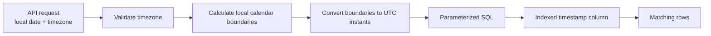
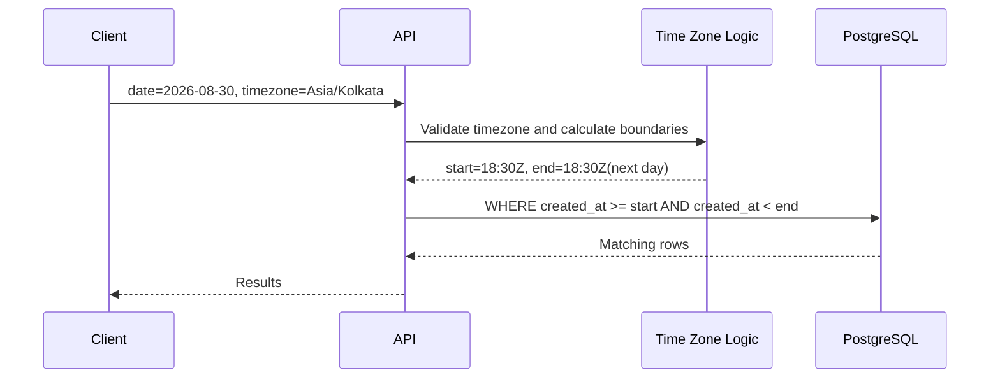

# 13- Time Zone Safe Queries

## Overview

Time zone handling becomes difficult when a backend system stores timestamps in one representation but users, reports, APIs, and business rules operate in another.

A production-safe design separates three concerns:

- **Instant:** a precise point on the global timeline.
- **Time zone:** the rules required to interpret an instant as local date/time.
- **Calendar representation:** a business concept such as "August 30 in Asia/Kolkata".

For most backend systems, store event timestamps as absolute instants, commonly normalized to UTC, and perform range filtering using explicit timezone-aware boundaries.

The core production pattern is:

```text
User's local date/time
        ↓
Interpret in user's IANA timezone
        ↓
Calculate timezone-aware boundary
        ↓
Convert boundary to an absolute instant
        ↓
Parameterized SQL query
        ↓
Indexed timestamp column
```

For timestamp filtering, prefer half-open ranges:

```sql
WHERE created_at >= :start_utc
  AND created_at < :end_utc
```

The difficult part is usually not the SQL predicate itself. It is calculating `:start_utc` and `:end_utc` correctly.

## Instant vs Local Time

An **instant** identifies one point on the global timeline.

For example:

```text
2026-08-30 10:00:00 UTC
```

can represent the same instant as:

```text
2026-08-30 15:30:00 Asia/Kolkata
```

The local representations differ, but the underlying instant is identical.

| Concept | Example | Meaning |
|---|---|---|
| Instant | `2026-08-30T10:00:00Z` | Exact point on timeline |
| UTC | `UTC` | Global reference timezone |
| IANA timezone | `Asia/Kolkata` | Rules for local time |
| Local datetime | `2026-08-30 15:30` | Human-facing representation |
| Local date | `2026-08-30` | Calendar date in a specific timezone |

A timestamp column representing an event should normally answer:

> **When did this event actually happen?**

A user's timezone should answer:

> **What local time/date was that instant for this user?**

Do not confuse these two questions.

## Why Time Zone Safe Queries Matter

Consider an API:

```http
GET /orders?date=2026-08-30
```

The parameter:

```text
2026-08-30
```

does not identify an instant.

It identifies a **calendar day**.

The meaning depends on the timezone.

For:

```text
Asia/Kolkata
```

the requested day is:

```text
2026-08-30 00:00:00 +05:30
```

through:

```text
2026-08-31 00:00:00 +05:30
```

Those boundaries must then be converted to absolute instants before querying the database.

## The Correct Query Architecture

A robust backend separates boundary calculation from database filtering.



For example:

```text
Request:
date = 2026-08-30
timezone = Asia/Kolkata

Local:
start = 2026-08-30 00:00:00 +05:30
end   = 2026-08-31 00:00:00 +05:30

UTC:
start = 2026-08-29 18:30:00Z
end   = 2026-08-30 18:30:00Z
```

The database query becomes:

```sql
SELECT id, created_at
FROM orders
WHERE created_at >= :start_utc
  AND created_at < :end_utc;
```

The database does not need to perform timezone conversion for every row.

## Store Instants, Not User-Local Times

For event timestamps such as:

- `created_at`
- `updated_at`
- `published_at`
- `processed_at`
- `deleted_at`

store the instant rather than a user's local representation.

A common production convention is:

```text
Database → UTC
Application → timezone-aware datetime
API → explicit timezone representation when needed
UI → user's preferred timezone
```

PostgreSQL's `timestamptz` is commonly appropriate for instant-oriented data.

```sql
CREATE TABLE orders (
    id BIGSERIAL PRIMARY KEY,
    created_at TIMESTAMPTZ NOT NULL DEFAULT CURRENT_TIMESTAMP
);
```

`TIMESTAMPTZ` does not mean that PostgreSQL stores a timezone name with every value. It represents an instant and displays/converts it according to the relevant session or expression timezone.

## `timestamp` vs `timestamptz` in PostgreSQL

PostgreSQL provides two commonly confused timestamp types:

| Type | PostgreSQL type | Typical use |
|---|---|---|
| Timestamp without timezone | `timestamp` | Local wall-clock value with no timezone semantics |
| Timestamp with timezone | `timestamptz` | Absolute instant |
| Date | `date` | Calendar date without time |
| Time without timezone | `time` | Local clock time without timezone |
| Time with timezone | `timetz` | Specialized use; generally uncommon for application event timestamps |

For event data:

```sql
created_at TIMESTAMPTZ NOT NULL
```

is generally preferable to:

```sql
created_at TIMESTAMP NOT NULL
```

when the value represents an actual moment.

## Why `timestamp without time zone` Can Be Dangerous

Suppose a database contains:

```text
2026-08-30 10:00:00
```

Without timezone information, the database cannot inherently determine whether this means:

```text
10:00 UTC
```

or:

```text
10:00 Asia/Kolkata
```

or:

```text
10:00 America/New_York
```

The value is a wall-clock representation, not a complete instant.

This can be appropriate for domain concepts such as:

```text
store opens at 09:00 local time
```

but is dangerous for:

```text
payment completed at 09:00
```

because the latter describes an instant.

## The Golden Rule

Classify the data before choosing the database type.

### Instant-Based Data

Use an instant-oriented representation for:

```text
created_at
updated_at
payment_completed_at
request_received_at
job_started_at
job_finished_at
```

### Local Calendar Data

A business event may instead be tied to a local calendar:

```text
store opens at 09:00
meeting occurs at 14:00 local time
business date is 2026-08-30
```

These concepts may require a timezone or calendar context in addition to the local time.

Do not force every temporal domain concept into UTC if the actual business meaning is a local wall-clock rule.

## Time Zone Identifiers

Prefer **IANA timezone identifiers**:

```text
Asia/Kolkata
America/New_York
Europe/London
Australia/Sydney
```

Avoid storing only fixed offsets such as:

```text
+05:30
-04:00
```

when the business concept requires a named timezone.

A fixed offset tells you the offset but not the timezone's historical or future rules.

For example:

```text
America/New_York
```

can switch between standard time and daylight time, while:

```text
-05:00
```

does not encode those rules.

## User-Local Date Filtering

Suppose a customer requests:

```text
orders for 2026-08-30
timezone = Asia/Kolkata
```

The correct process is:

```text
1. Interpret 2026-08-30 as a calendar date in Asia/Kolkata.
2. Calculate the start of that local day.
3. Calculate the start of the next local day.
4. Convert both to absolute instants.
5. Query using >= start and < end.
```

The SQL remains:

```sql
SELECT id, created_at
FROM orders
WHERE created_at >= :start
  AND created_at < :end
ORDER BY created_at, id;
```

This pattern works for days, months, weeks, and other calendar periods.

## Why You Should Not Convert the Database Column Per Row

A tempting query is:

```sql
SELECT *
FROM orders
WHERE (created_at AT TIME ZONE 'Asia/Kolkata')::date = DATE '2026-08-30';
```

Although PostgreSQL can express this logic, applying a transformation to every indexed row can make ordinary index usage less effective.

Instead, calculate the boundaries once:

```text
local calendar range
        ↓
UTC/instant range
        ↓
indexed column comparison
```

and query:

```sql
WHERE created_at >= :start
  AND created_at < :end
```

This keeps the timestamp column directly comparable to parameters.

## Sargability

A predicate is **sargable** when the database can efficiently use an index to locate qualifying rows.

Prefer:

```sql
WHERE created_at >= :start
  AND created_at < :end
```

over:

```sql
WHERE DATE(created_at) = :date
```

The first form allows an index such as:

```sql
CREATE INDEX idx_orders_created_at
ON orders (created_at);
```

to support the range lookup.

For large production tables, this difference can be substantial.

## Half-Open Ranges

Use:

```text
[start, end)
```

for timestamp filtering.

That translates to:

```sql
WHERE created_at >= :start
  AND created_at < :end
```

Avoid:

```sql
WHERE created_at <= :end
```

when `end` represents the beginning of the next period.

For a local day:

```text
[2026-08-30 00:00, 2026-08-31 00:00)
```

means:

```text
include the entire local day
exclude the beginning of the next local day
```

This avoids fractional-second precision problems and makes adjacent ranges compose correctly.

## Daylight Saving Time

DST is one of the strongest reasons not to implement local calendar ranges using manual offset arithmetic.

Consider:

```text
start + 24 hours
```

This does not necessarily mean:

```text
same local clock time on the next calendar day
```

around DST transitions.

For calendar-based requirements, calculate:

```text
local date → next local date
```

in the target IANA timezone.

Then convert both boundaries to instants.

The duration between them may be:

```text
23 hours
```

or:

```text
25 hours
```

while still correctly representing one local calendar day.

## Python

Modern Python applications should use timezone-aware `datetime` objects.

Prefer:

```python
from datetime import datetime, timezone

now = datetime.now(timezone.utc)
```

rather than:

```python
from datetime import datetime

now = datetime.utcnow()
```

The latter returns a naive datetime and can lead to accidental mixing of naive and aware values.

For IANA timezone calculations, use `zoneinfo`:

```python
from datetime import date, datetime, time, timedelta, timezone
from zoneinfo import ZoneInfo


def utc_day_bounds(local_date: date, timezone_name: str) -> tuple[datetime, datetime]:
    tz = ZoneInfo(timezone_name)

    local_start = datetime.combine(
        local_date,
        time.min,
        tzinfo=tz,
    )

    local_end = datetime.combine(
        local_date + timedelta(days=1),
        time.min,
        tzinfo=tz,
    )

    return (
        local_start.astimezone(timezone.utc),
        local_end.astimezone(timezone.utc),
    )
```

The important detail is that the next calendar date is constructed in the target timezone before conversion to UTC.

## Python Query Example

The resulting values can be passed to a parameterized query:

```python
from datetime import date

start_utc, end_utc = utc_day_bounds(
    date(2026, 8, 30),
    "Asia/Kolkata",
)

query = """
    SELECT id, created_at
    FROM orders
    WHERE created_at >= %(start)s
      AND created_at < %(end)s
    ORDER BY created_at, id
"""

params = {
    "start": start_utc,
    "end": end_utc,
}
```

The application calculates the business boundary; PostgreSQL performs the indexed range lookup.

## Django

Django applications should keep timezone support enabled and use timezone-aware values.

A typical filtering pattern is:

```python
from django.utils import timezone

orders = Order.objects.filter(
    created_at__gte=start_utc,
    created_at__lt=end_utc,
).order_by("created_at", "id")
```

Avoid:

```python
orders = Order.objects.filter(
    created_at__date=requested_date,
)
```

when the requirement is specifically:

> calendar date according to a particular user timezone

because the database-side date interpretation must be carefully controlled.

Calculate the user's local boundaries first and query the timestamp range.

## FastAPI

A FastAPI service should explicitly define the timezone contract.

For example, an API might accept:

```http
GET /orders?date=2026-08-30&timezone=Asia/Kolkata
```

The service should:

```text
Validate date
    ↓
Validate IANA timezone
    ↓
Calculate local boundaries
    ↓
Convert to UTC
    ↓
Execute parameterized SQL
```

Do not silently interpret a date according to the application server's timezone.

A Kubernetes deployment may run with:

```text
UTC
```

while users may be distributed globally.

The container's timezone should not determine the meaning of user business dates.

## Database Session Time Zone

PostgreSQL has a session timezone setting.

You can inspect it with:

```sql
SHOW TIME ZONE;
```

and set it for a session with:

```sql
SET TIME ZONE 'UTC';
```

A UTC database session is a useful operational convention, but it does not eliminate application-level timezone requirements.

The database session timezone should not be used as a substitute for explicitly defining the business timezone of a request.

For example:

```text
"Show today's orders"
```

still requires knowing whose "today" is being requested.

## `AT TIME ZONE` in PostgreSQL

PostgreSQL provides `AT TIME ZONE` for timezone conversions.

For an instant:

```sql
SELECT created_at AT TIME ZONE 'Asia/Kolkata'
FROM orders;
```

this produces the local wall-clock representation in that timezone.

This can be useful for:

- Display.
- Reporting.
- Debugging.
- Ad hoc analysis.

However, avoid using it unnecessarily on indexed columns in high-volume filtering predicates.

A better production design is often:

```text
Application calculates boundaries
        ↓
Database receives instant parameters
        ↓
Index performs timestamp range scan
```

## Display vs Filtering

Timezone conversion is often necessary for **display**, but not necessarily for **filtering**.

For example:

```text
Database:
2026-08-30T10:00:00Z

User timezone:
Asia/Kolkata

Display:
2026-08-30 15:30
```

The stored instant does not change.

For filtering:

```text
calculate local boundaries
        ↓
convert to UTC
        ↓
query UTC/instant column
```

For display:

```text
stored instant
        ↓
convert to user's timezone
        ↓
render local time
```

Keeping these responsibilities separate makes systems easier to reason about.

## Reporting by Local Calendar Periods

Reports commonly expose:

```text
today
yesterday
this week
this month
```

These are calendar concepts, not fixed-duration concepts.

For example:

```text
"today in America/New_York"
```

means:

```text
start of today's calendar day in New York
→ start of tomorrow's calendar day in New York
```

It does not necessarily mean:

```text
now - 24 hours
→ now
```

Similarly:

```text
this month
```

should be represented as:

```text
month_start
→ next_month_start
```

rather than calculating a fixed number of hours.

## Recurring Jobs

A Celery or Kubernetes job may run according to UTC while the business requirement is local:

> Send the daily report at 09:00 in each customer's timezone.

Do not assume:

```text
09:00 UTC
```

means:

```text
09:00 local
```

Instead, treat the schedule as a timezone-aware business rule.

A scalable architecture may maintain:

```text
customer_id
timezone
preferred_local_time
```

and calculate the corresponding execution instant.

For large multi-tenant systems, scheduling thousands of independent timezone-aware jobs may require careful queueing and batching rather than creating an excessive number of scheduler entries.

## Time Zones Across Microservices

A distributed system should establish a consistent temporal contract.

A practical convention is:

```text
External API
    ↓
Timezone-aware ISO 8601 values
    ↓
Service boundary
    ↓
UTC/absolute instant internally
    ↓
Database
```

For example:

```text
2026-08-30T10:00:00Z
```

is unambiguous.

An offset-bearing value is also explicit:

```text
2026-08-30T15:30:00+05:30
```

Avoid ambiguous strings such as:

```text
2026-08-30 15:30:00
```

unless the API contract explicitly defines the timezone.

## REST API Contracts

For an API representing an instant, prefer ISO 8601 with an explicit offset or UTC marker:

```json
{
  "created_at": "2026-08-30T10:00:00Z"
}
```

For a request representing a local calendar date:

```json
{
  "date": "2026-08-30",
  "timezone": "Asia/Kolkata"
}
```

The distinction matters.

```text
created_at → instant
date       → calendar date
timezone   → interpretation context
```

Do not overload a single string field to represent all three concepts.

## Kafka and Event-Driven Systems

Events published to Kafka should carry unambiguous timestamps.

For example:

```json
{
  "event_id": "evt_123",
  "occurred_at": "2026-08-30T10:00:00Z",
  "event_type": "order.created"
}
```

Consumers can convert the instant to local time when necessary.

For event windows:

```sql
WHERE occurred_at >= :start
  AND occurred_at < :end
```

keeps the processing boundary deterministic.

Be careful when using consumer processing time instead of event occurrence time. They answer different questions:

```text
occurred_at → when the event happened
processed_at → when a consumer processed it
```

Both may be useful, but they should not be conflated.

## Querying by "Today"

This query is often incorrect:

```sql
SELECT *
FROM orders
WHERE created_at::date = CURRENT_DATE;
```

It depends on the database session's timezone and applies a transformation to the column.

A safer pattern for a known business timezone is:

```text
Determine today's local boundaries
        ↓
Convert to instants
        ↓
created_at >= start
created_at < end
```

For example:

```sql
SELECT id, created_at
FROM orders
WHERE created_at >= :today_start
  AND created_at < :tomorrow_start;
```

The meaning of "today" is now explicit.

## Time Zone Safe Indexing

For an orders table:

```sql
CREATE INDEX idx_orders_created_at
ON orders (created_at);
```

supports:

```sql
SELECT id
FROM orders
WHERE created_at >= :start_utc
  AND created_at < :end_utc;
```

For multi-tenant systems:

```sql
CREATE INDEX idx_orders_tenant_created_at
ON orders (tenant_id, created_at);
```

may be appropriate for:

```sql
SELECT id, created_at
FROM orders
WHERE tenant_id = :tenant_id
  AND created_at >= :start_utc
  AND created_at < :end_utc;
```

Index order should follow the actual workload. Validate with:

```sql
EXPLAIN (ANALYZE, BUFFERS)
SELECT id, created_at
FROM orders
WHERE tenant_id = 42
  AND created_at >= TIMESTAMPTZ '2026-08-29 18:30:00+00'
  AND created_at < TIMESTAMPTZ '2026-08-30 18:30:00+00';
```

## Common Production Pattern

A robust production implementation looks like:



The important design decision is that timezone interpretation happens at the application/business boundary, while the database receives an explicit instant range.

## Common Mistakes

### Treating a Local Date as UTC

Incorrect:

```text
date=2026-08-30
→ 2026-08-30 00:00 UTC
```

when the user means:

```text
2026-08-30 in Asia/Kolkata
```

Correct:

```text
2026-08-30 Asia/Kolkata
→ local start/end
→ convert to UTC
→ query
```

### Using the Server's Timezone

A service running in Docker or Kubernetes may use UTC.

Do not make:

```text
server timezone
```

the implicit definition of:

```text
user's business timezone
```

The timezone must come from explicit business context.

### Using Fixed Offsets Instead of IANA Zones

Avoid storing only:

```text
+05:30
```

when you actually need:

```text
Asia/Kolkata
```

A named timezone carries timezone rules; a fixed offset does not.

### Using `23:59:59`

Avoid:

```sql
created_at <= '2026-08-30 23:59:59'
```

Prefer:

```sql
created_at >= :day_start
AND created_at < :next_day_start
```

### Converting the Indexed Column

Avoid high-volume predicates such as:

```sql
WHERE DATE(created_at) = :date
```

or unnecessary per-row timezone transformations.

Calculate boundaries once and compare the indexed column directly.

### Mixing Naive and Aware Datetimes

Avoid:

```python
naive_datetime < aware_datetime
```

Python will reject incompatible comparisons in many cases, and silent conversions in other systems can produce incorrect behavior.

Use timezone-aware values consistently for instants.

### Assuming Every Day Is 24 Hours

A local calendar day can be 23 or 25 elapsed hours during DST transitions.

Do calendar arithmetic in the relevant timezone, then convert to instants.

### Assuming UTC Solves All Timezone Problems

UTC solves ambiguity for instants.

It does not answer:

```text
What does "Monday" mean for this customer?
```

or:

```text
When is 09:00 local time?
```

Business calendar semantics still require timezone context.

### Using Database Session Timezone as Business Logic

Changing:

```sql
SET TIME ZONE ...
```

does not make an application timezone-safe.

Business timezone should be explicit in application logic and API contracts.

### Confusing Event Time and Processing Time

For event-driven systems:

```text
occurred_at
```

and:

```text
processed_at
```

represent different concepts.

Choosing the wrong one can produce incorrect reports, delayed-event handling errors, or inconsistent metrics.

## Production Checklist

Before deploying timezone-sensitive functionality, verify:

- [ ] All instant timestamps are timezone-aware.
- [ ] The database representation is appropriate for absolute instants.
- [ ] User/business timezones use IANA identifiers.
- [ ] Local dates are interpreted in the correct business timezone.
- [ ] Range boundaries are calculated before querying.
- [ ] Timestamp filters use `>= start AND < end`.
- [ ] Queries do not unnecessarily transform indexed timestamp columns.
- [ ] API timestamps contain an explicit timezone or `Z`.
- [ ] Server/container timezone is not being used as implicit business logic.
- [ ] DST transition dates are covered by tests.
- [ ] Queries are parameterized.
- [ ] Indexes are validated with realistic query plans.
- [ ] Event time and processing time are modeled separately when both matter.

## Testing Time Zone Logic

Timezone bugs frequently remain hidden when tests use only UTC.

Test at least:

| Scenario | What to verify |
|---|---|
| UTC | Basic conversion correctness |
| Positive offset | Boundary conversion |
| Negative offset | Boundary conversion |
| DST start | Short local day |
| DST end | Long local day |
| Midnight boundary | Correct date inclusion |
| Fractional seconds | End boundary remains exclusive |
| Adjacent ranges | No overlap or gaps |
| Multiple tenants | Each tenant's timezone is respected |
| Invalid timezone | Request is rejected |
| Naive timestamp | Validation fails |

For Python services, keep timezone calculations in a small, testable domain utility rather than duplicating timezone arithmetic throughout API handlers and repository code.

## Interview Traps

| Question | Strong answer |
|---|---|
| Should timestamps usually be stored in UTC? | Store absolute instants consistently; UTC is a common representation/convention |
| Does UTC eliminate timezone handling? | No; local calendar and scheduling semantics still require timezone context |
| Why prefer `[start, end)`? | It avoids precision problems and composes adjacent ranges without overlap |
| Why avoid `DATE(created_at) = ...` on large tables? | It transforms the indexed column and can prevent efficient index access |
| What is `Asia/Kolkata`? | An IANA timezone identifier |
| Is `+05:30` equivalent to `Asia/Kolkata`? | Not semantically; an offset does not encode a timezone's rules |
| Is a local day always 24 hours? | No; DST can make it 23 or 25 elapsed hours |
| What should an API return for an instant? | An unambiguous ISO 8601 timestamp with `Z` or an explicit offset |
| What does `2026-08-30` represent? | A calendar date, not an instant |
| Where should timezone boundaries be calculated? | In explicit business/application timezone context before the database range query |
| Should the database session timezone define a user's timezone? | No; user/business timezone should be explicit |
| What is the difference between event time and processing time? | Event time is when the event occurred; processing time is when a system handled it |

## Key Takeaways

- **Treat event timestamps as absolute instants and keep timezone context explicit rather than relying on server or database session defaults.**
- **For local-date queries, calculate the start of the requested local period and the start of the next period in the correct IANA timezone, then convert both boundaries to instants.**
- **Use sargable half-open predicates—`column >= start AND column < end`—so timezone-safe filtering remains index-friendly.**
- **Do not treat fixed offsets, UTC, local dates, and named timezones as interchangeable concepts; each represents different temporal semantics.**
- **Test timezone-sensitive code around DST transitions, midnight boundaries, fractional seconds, adjacent ranges, and multiple business timezones.**