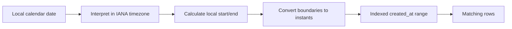
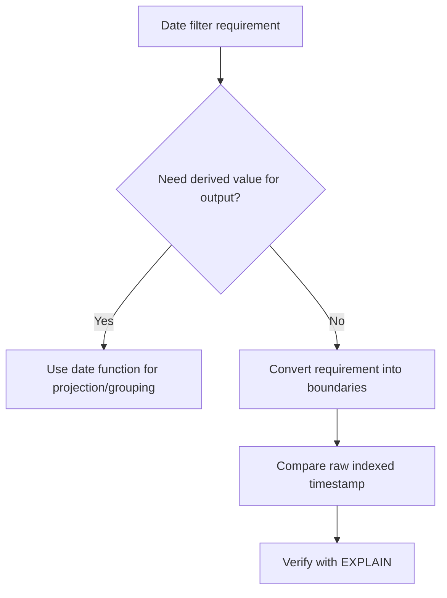

# 14- Date Functions and Indexes

## Overview

Date and time functions are essential for reporting, retention, scheduling, auditing, analytics, and operational queries. The engineering challenge is that many convenient date functions transform a timestamp before comparison, which can prevent the database from efficiently using an index on the underlying column.

Consider:

```sql
SELECT id
FROM orders
WHERE DATE(created_at) = DATE '2026-08-30';
```

This is readable, but the database may need to evaluate `DATE(created_at)` for many rows before determining which rows qualify.

For an indexed `created_at` column, prefer an equivalent range:

```sql
SELECT id
FROM orders
WHERE created_at >= TIMESTAMPTZ '2026-08-30 00:00:00+00'
  AND created_at <  TIMESTAMPTZ '2026-08-31 00:00:00+00';
```

The general production principle is:

> **Transform the search boundaries, not the indexed column.**

This preserves sargability and allows the optimizer to use a normal B-tree index for range access.

## Why Date Functions Affect Index Usage

Suppose a table contains:

```sql
CREATE TABLE orders (
    id BIGSERIAL PRIMARY KEY,
    created_at TIMESTAMPTZ NOT NULL
);

CREATE INDEX idx_orders_created_at
ON orders (created_at);
```

The index is ordered by the raw `created_at` values.

A query such as:

```sql
WHERE created_at >= :start
  AND created_at < :end
```

maps naturally to an index range:

```text
created_at index

2026-08-29 ────────┬───────────────┬───────────────┬────────
                   │               │
                 start             end
                   │<--- scan --->│
```

The database can locate the beginning of the range and scan only the relevant index region.

With:

```sql
WHERE DATE(created_at) = :date
```

the indexed values are effectively being transformed:

```text
created_at
    ↓
DATE(created_at)
    ↓
compare with :date
```

The normal index is ordered by `created_at`, not by `DATE(created_at)`.

## Sargability

A predicate is **sargable** when the optimizer can use an index efficiently to search for qualifying values.

### Sargable

```sql
WHERE created_at >= :start
  AND created_at < :end
```

### Potentially Non-Sargable

```sql
WHERE DATE(created_at) = :date
```

### Another Common Example

Avoid:

```sql
WHERE EXTRACT(YEAR FROM created_at) = 2026;
```

Prefer:

```sql
WHERE created_at >= TIMESTAMPTZ '2026-01-01 00:00:00+00'
  AND created_at <  TIMESTAMPTZ '2027-01-01 00:00:00+00';
```

The second query expresses the same calendar constraint as an index-friendly range.

## Common Date Functions That Can Affect Indexes

| Expression | Typical purpose | Index-friendly alternative |
|---|---|---|
| `DATE(created_at)` | Filter by date | `[day_start, next_day_start)` |
| `created_at::date` | Filter by date | Timestamp range |
| `EXTRACT(YEAR FROM created_at)` | Filter by year | `[year_start, next_year_start)` |
| `EXTRACT(MONTH FROM created_at)` | Filter by month | `[month_start, next_month_start)` |
| `DATE_TRUNC('day', created_at)` | Group/filter by day | Range for filtering |
| `DATE_TRUNC('month', created_at)` | Group/filter by month | Range for filtering |
| `created_at AT TIME ZONE ...` | Local-time interpretation | Calculate local boundaries first |
| `AGE(...)` | Calculate elapsed age | Usually not a direct index predicate |

The exact optimizer behavior depends on the database, statistics, indexes, expression, and query plan. The rule is therefore not "functions always make indexes unusable"; it is:

> **Do not assume an expression on an indexed column is efficiently indexable. Verify the execution plan.**

## Filtering by Day

### Anti-Pattern

```sql
SELECT id, created_at
FROM orders
WHERE created_at::date = DATE '2026-08-30';
```

### Preferred Pattern

```sql
SELECT id, created_at
FROM orders
WHERE created_at >= TIMESTAMPTZ '2026-08-30 00:00:00+00'
  AND created_at <  TIMESTAMPTZ '2026-08-31 00:00:00+00';
```

The half-open range:

```text
[start, end)
```

includes the beginning of the requested day and excludes the beginning of the following day.

This is safer than constructing:

```text
23:59:59.999999
```

because database timestamp precision and application precision may differ.

## Filtering by Month

Avoid:

```sql
SELECT COUNT(*)
FROM orders
WHERE EXTRACT(YEAR FROM created_at) = 2026
  AND EXTRACT(MONTH FROM created_at) = 8;
```

Prefer:

```sql
SELECT COUNT(*)
FROM orders
WHERE created_at >= TIMESTAMPTZ '2026-08-01 00:00:00+00'
  AND created_at <  TIMESTAMPTZ '2026-09-01 00:00:00+00';
```

This is both simpler and naturally represents the month as a range.

The same principle applies to:

- Year.
- Quarter.
- Week.
- Day.
- Hour.
- Other contiguous temporal periods.

## Filtering by Year

Instead of:

```sql
WHERE EXTRACT(YEAR FROM created_at) = 2026
```

use:

```sql
WHERE created_at >= TIMESTAMPTZ '2026-01-01 00:00:00+00'
  AND created_at <  TIMESTAMPTZ '2027-01-01 00:00:00+00'
```

This gives the optimizer a direct range on `created_at`.

For a large production table, this distinction can determine whether a query scans a small fraction of the index or evaluates a function across a much larger number of rows.

## `DATE_TRUNC` and Indexes

`DATE_TRUNC` is particularly useful for aggregation:

```sql
SELECT
    DATE_TRUNC('day', created_at) AS day,
    COUNT(*) AS order_count
FROM orders
GROUP BY DATE_TRUNC('day', created_at)
ORDER BY day;
```

This is a legitimate use of the function because the query needs a derived grouping key.

The problem is different when using it solely to filter an indexed timestamp:

```sql
WHERE DATE_TRUNC('day', created_at) = TIMESTAMPTZ '2026-08-30 00:00:00+00'
```

For a simple range condition, prefer:

```sql
WHERE created_at >= TIMESTAMPTZ '2026-08-30 00:00:00+00'
  AND created_at <  TIMESTAMPTZ '2026-08-31 00:00:00+00'
```

The distinction is important:

```text
Transformation needed for output/grouping
        → function can be appropriate

Transformation used only to filter indexed data
        → prefer boundary transformation
```

## Date Functions for Reporting

Date functions are often appropriate when producing reporting dimensions.

For example:

```sql
SELECT
    DATE_TRUNC('month', created_at) AS month,
    COUNT(*) AS orders
FROM orders
GROUP BY DATE_TRUNC('month', created_at)
ORDER BY month;
```

Here `DATE_TRUNC` creates the reporting bucket.

If the report covers only a limited time period, combine the aggregation with an index-friendly range:

```sql
SELECT
    DATE_TRUNC('month', created_at) AS month,
    COUNT(*) AS orders
FROM orders
WHERE created_at >= TIMESTAMPTZ '2026-01-01 00:00:00+00'
  AND created_at <  TIMESTAMPTZ '2027-01-01 00:00:00+00'
GROUP BY DATE_TRUNC('month', created_at)
ORDER BY month;
```

This gives the optimizer a bounded search range before performing the aggregation.

## Filtering and Grouping Are Different Problems

Consider:

```sql
SELECT
    DATE_TRUNC('day', created_at) AS day,
    COUNT(*)
FROM orders
WHERE created_at >= :start
  AND created_at < :end
GROUP BY DATE_TRUNC('day', created_at);
```

There are two different operations:

```text
WHERE
    Find rows efficiently
    ↓
    use raw indexed timestamp

GROUP BY
    Transform rows into reporting buckets
    ↓
    use DATE_TRUNC
```

Trying to use the same expression for both jobs can unnecessarily sacrifice query performance.

## Time Zone-Aware Filtering

Timezone conversion introduces another layer of complexity.

Suppose:

```text
created_at = TIMESTAMPTZ
```

and the user asks for:

```text
2026-08-30
timezone = Asia/Kolkata
```

The correct process is:



The SQL should receive the resulting instants:

```sql
SELECT id, created_at
FROM orders
WHERE created_at >= :start_utc
  AND created_at < :end_utc;
```

Avoid unnecessarily converting every database row to the user's timezone inside the filtering predicate.

## Example: Local Day in PostgreSQL

A local calendar day can be converted into UTC boundaries.

For a known timezone:

```sql
SELECT
    TIMESTAMPTZ '2026-08-30 00:00:00 Asia/Kolkata' AS start_utc,
    TIMESTAMPTZ '2026-08-31 00:00:00 Asia/Kolkata' AS end_utc;
```

The resulting instants can then be used as query parameters.

The application can also calculate these boundaries before executing SQL, which keeps business timezone handling outside the database scan.

## Python Boundary Calculation

For backend applications, calculate calendar boundaries using timezone-aware Python objects.

```python
from datetime import date, datetime, time, timedelta, timezone
from zoneinfo import ZoneInfo


def utc_bounds_for_local_day(
    local_date: date,
    timezone_name: str,
) -> tuple[datetime, datetime]:
    tz = ZoneInfo(timezone_name)

    start_local = datetime.combine(
        local_date,
        time.min,
        tzinfo=tz,
    )

    end_local = datetime.combine(
        local_date + timedelta(days=1),
        time.min,
        tzinfo=tz,
    )

    return (
        start_local.astimezone(timezone.utc),
        end_local.astimezone(timezone.utc),
    )
```

Then:

```python
start_utc, end_utc = utc_bounds_for_local_day(
    date(2026, 8, 30),
    "Asia/Kolkata",
)
```

can be passed as parameters to:

```sql
SELECT id, created_at
FROM orders
WHERE created_at >= %(start)s
  AND created_at < %(end)s;
```

The database can operate directly on the indexed timestamp.

## PostgreSQL Expression Indexes

Sometimes a function-based predicate is a legitimate requirement.

PostgreSQL supports expression indexes.

For example:

```sql
CREATE INDEX idx_orders_created_date
ON orders ((created_at::date));
```

A matching expression can potentially use this index:

```sql
SELECT id
FROM orders
WHERE created_at::date = DATE '2026-08-30';
```

This can be appropriate when:

- The expression is part of a frequent workload.
- The expression represents a stable query requirement.
- The additional index storage is acceptable.
- The query planner confirms the index is useful.

However, an expression index should not be the automatic solution to every non-sargable query.

For straightforward timestamp ranges, the ordinary timestamp index is usually more broadly useful.

## Advantages of Expression Indexes

Expression indexes can be valuable when the application genuinely searches by the derived value.

For example:

```sql
CREATE INDEX idx_users_lower_email
ON users (LOWER(email));
```

supports:

```sql
WHERE LOWER(email) = :email
```

The same principle can apply to date expressions.

Advantages include:

- Supports a specific derived lookup efficiently.
- Avoids recalculating the expression for every candidate row.
- Can match application query patterns directly.

## Limitations of Expression Indexes

Expression indexes introduce costs:

- Additional disk usage.
- Additional write overhead.
- Additional vacuum/index maintenance work.
- More complex schema management.
- Query expressions must match the indexed expression closely enough for the optimizer to use it.

For example, adding several indexes:

```text
created_at
DATE(created_at)
DATE_TRUNC(...)
timezone conversion
```

can create unnecessary write and storage overhead.

Prefer the simplest index that supports the actual workload.

## Generated Columns

A derived date value can sometimes be represented as a generated or maintained column, depending on the database and expression requirements.

For example, conceptually:

```text
created_at
    ↓
derived reporting key
    ↓
index
```

This can make a frequently queried derived attribute explicit.

However, generated columns are not a substitute for correct temporal modeling. If the derived value depends on a mutable timezone interpretation, carefully verify whether the expression is deterministic and whether materializing it preserves the intended business semantics.

## Composite Indexes

Date indexes frequently appear as part of composite indexes.

For a multi-tenant system:

```sql
CREATE INDEX idx_orders_tenant_created_at
ON orders (tenant_id, created_at);
```

A query such as:

```sql
SELECT id, created_at
FROM orders
WHERE tenant_id = :tenant_id
  AND created_at >= :start
  AND created_at < :end;
```

can efficiently narrow the search first by tenant and then by timestamp range.

This pattern is common in SaaS systems where almost every query includes tenant isolation.

The correct column order depends on the workload, cardinality, and other predicates. Do not choose composite indexes solely from generic rules; validate with realistic query plans.

## `EXPLAIN` and `EXPLAIN ANALYZE`

Never judge index usage purely from SQL syntax.

Use:

```sql
EXPLAIN
SELECT id, created_at
FROM orders
WHERE created_at >= TIMESTAMPTZ '2026-08-30 00:00:00+00'
  AND created_at <  TIMESTAMPTZ '2026-08-31 00:00:00+00';
```

For controlled performance testing:

```sql
EXPLAIN (ANALYZE, BUFFERS)
SELECT id, created_at
FROM orders
WHERE created_at >= TIMESTAMPTZ '2026-08-30 00:00:00+00'
  AND created_at <  TIMESTAMPTZ '2026-08-31 00:00:00+00';
```

Look for:

- Index Scan.
- Index Only Scan.
- Bitmap Index Scan.
- Actual row counts.
- Estimated row counts.
- Buffer usage.
- Execution time.

`EXPLAIN ANALYZE` executes the query, so use care with modifying statements and production workloads.

## Comparing Two Query Shapes

### Function on Column

```sql
SELECT COUNT(*)
FROM orders
WHERE DATE(created_at) = DATE '2026-08-30';
```

### Range Predicate

```sql
SELECT COUNT(*)
FROM orders
WHERE created_at >= TIMESTAMPTZ '2026-08-30 00:00:00+00'
  AND created_at <  TIMESTAMPTZ '2026-08-31 00:00:00+00';
```

Conceptually:



The second query generally gives the optimizer a clearer opportunity to perform an index range scan.

## Common Mistakes

### Applying `DATE()` to an Indexed Column

Avoid:

```sql
WHERE DATE(created_at) = :date
```

Prefer:

```sql
WHERE created_at >= :start
AND created_at < :end
```

The range predicate preserves direct comparison against the indexed column.

### Using `BETWEEN` for Adjacent Time Windows

This is risky:

```sql
WHERE created_at BETWEEN :start AND :end
```

`BETWEEN` is inclusive at both boundaries.

For adjacent periods:

```text
[10:00, 11:00]
[11:00, 12:00]
```

the timestamp exactly at `11:00` belongs to both ranges.

Prefer:

```sql
WHERE created_at >= :start
  AND created_at < :end
```

giving:

```text
[10:00, 11:00)
[11:00, 12:00)
```

with no overlap.

### Using `23:59:59` as the End of Day

Avoid:

```sql
WHERE created_at <= TIMESTAMPTZ '2026-08-30 23:59:59';
```

It can exclude values with fractional seconds.

Use:

```sql
WHERE created_at < TIMESTAMPTZ '2026-08-31 00:00:00+00';
```

### Ignoring Timezones

This is dangerous:

```sql
WHERE created_at >= '2026-08-30 00:00:00'
  AND created_at < '2026-08-31 00:00:00';
```

The meaning of the literals can depend on the database type and timezone context.

For instant-based data, make timezone semantics explicit.

### Assuming Every Function Prevents Index Usage

The statement:

> "Functions on columns always disable indexes."

is too simplistic.

Modern optimizers can use:

- Expression indexes.
- Specialized indexes.
- Rewritten predicates.
- Other planner strategies.

The correct engineering approach is:

```text
Understand predicate
    ↓
Choose appropriate query shape
    ↓
Inspect execution plan
    ↓
Benchmark with realistic data
```

### Creating an Index for Every Function

Do not respond to every slow function-based query by creating another index.

An additional index has:

- Storage cost.
- Insert/update/delete cost.
- Maintenance cost.
- Cache pressure.
- Operational complexity.

First determine whether the query can be expressed as a raw-column range.

## Production Considerations

### Index Selectivity

A timestamp index is particularly useful when the query restricts the data to a reasonably small time range.

A query such as:

```sql
WHERE created_at >= :start
AND created_at < :end
```

may still scan a large portion of the table if the range covers most of the data.

An index is not automatically beneficial simply because the filtered column is indexed.

### Large Historical Tables

For very large event tables, consider:

- Time-based partitioning.
- Appropriate composite indexes.
- Retention policies.
- Archival storage.
- Pre-aggregated reporting tables.
- Materialized views where appropriate.

Partitioning should be driven by workload and operational requirements, not simply because a timestamp exists.

### Partition Pruning

A query that directly constrains a partitioning key can allow the database to eliminate irrelevant partitions.

For example:

```sql
WHERE created_at >= :start
  AND created_at < :end
```

is generally much easier to reason about for partition pruning than a function-based condition over the partition key.

This is another reason to express temporal filters as ranges.

### Monitoring

For production systems, monitor:

- Slow date-range queries.
- Query execution time.
- Rows scanned versus rows returned.
- Buffer usage.
- Index hit ratio.
- Sequential scans on large tables.
- Query plan regressions.
- Table and index growth.

Performance should be measured using real workload characteristics rather than assumed from syntax alone.

### Query Plan Regression

A query that uses an index today may choose a different plan later because of:

- Data growth.
- Changed data distribution.
- Updated statistics.
- Different parameter values.
- New indexes.
- Database version changes.

For critical queries, performance testing and query-plan monitoring should be part of the operational lifecycle.

## Backend Application Guidance

A typical Django or FastAPI backend should keep temporal filtering explicit.

```text
HTTP request
    ↓
Validate date/time input
    ↓
Resolve business timezone
    ↓
Calculate start/end instants
    ↓
Parameterized SQL / ORM filter
    ↓
Indexed timestamp range
    ↓
Database result
    ↓
Timezone conversion for presentation
```

The ORM should not hide poor query shapes from engineers.

For example, an ORM expression that generates:

```sql
DATE(created_at) = ...
```

may look clean at the application layer while producing an inefficient database predicate.

Always inspect generated SQL and execution plans for high-volume queries.

## Security Considerations

Date filtering is not inherently a security boundary, but production APIs should still:

- Parameterize all date/time values.
- Validate timezone identifiers.
- Validate acceptable date ranges.
- Prevent unbounded historical queries where appropriate.
- Enforce tenant predicates in multi-tenant systems.
- Avoid allowing arbitrary SQL date expressions from clients.

For example, do not construct SQL dynamically from an API parameter:

```python
query = f"SELECT * FROM orders WHERE created_at >= '{start}'"
```

Use parameterized queries instead.

```python
query = """
    SELECT id, created_at
    FROM orders
    WHERE created_at >= %(start)s
      AND created_at < %(end)s
"""
```

Date validation is also useful for protecting database resources from accidental requests such as:

```text
10 years of high-cardinality event data
```

when the endpoint was intended for a daily report.

## Practical Decision Guide

| Requirement | Preferred approach |
|---|---|
| Filter one day | Timestamp range |
| Filter one month | Month-start to next-month-start |
| Filter one year | Year-start to next-year-start |
| Filter local calendar day | Calculate local boundaries, then query instant range |
| Group by day | `DATE_TRUNC` or equivalent |
| Group by month | `DATE_TRUNC` or equivalent |
| Search a derived date frequently | Consider expression/generated-column index |
| Large time-series table | Evaluate partitioning and retention strategy |
| Unknown performance | Run `EXPLAIN` / `EXPLAIN ANALYZE` |
| Adjacent time windows | Half-open `[start, end)` ranges |
| User timezone | Use explicit IANA timezone context |
| API instant | ISO 8601 with `Z` or explicit offset |

## Interview Traps

| Trap | Correct reasoning |
|---|---|
| "`DATE(created_at)` is always fine because `created_at` is indexed." | The expression may prevent efficient use of the ordinary timestamp index |
| "Any function on a column makes indexes impossible." | Too broad; expression indexes and optimizer capabilities can support function-based predicates |
| "`BETWEEN` is ideal for date ranges." | For adjacent timestamp windows, prefer `>= start AND < end` |
| "End of day is `23:59:59`." | Use the next day's midnight as an exclusive boundary |
| "`DATE_TRUNC` should never be used with indexed columns." | It is useful for grouping/projection; the issue is using it unnecessarily for filtering |
| "UTC makes every date query trivial." | Local calendar requirements still require timezone-aware boundary calculation |
| "If an index exists, the database will use it." | The optimizer chooses a plan based on cost and statistics |
| "Adding an index fixes every date-function query." | First rewrite the predicate into an index-friendly range when possible |
| "A timestamp index guarantees fast queries." | A very broad range may still require substantial scanning |
| "Query syntax tells you performance." | Verify with realistic execution plans and data |

## Key Takeaways

- **For indexed timestamp columns, prefer half-open range predicates such as `created_at >= start AND created_at < end` over applying date functions directly to the column.**
- **Use date functions such as `DATE_TRUNC` when deriving reporting or grouping values, but avoid them as unnecessary filters over indexed columns.**
- **Expression indexes are a valid production tool for genuinely required derived lookups, but they add storage and write-maintenance costs.**
- **Timezone-aware calendar filtering should calculate local boundaries first and convert them to absolute instants before querying the indexed timestamp.**
- **Use `EXPLAIN (ANALYZE, BUFFERS)` and realistic data to verify index usage rather than relying on rules about functions and indexes alone.**