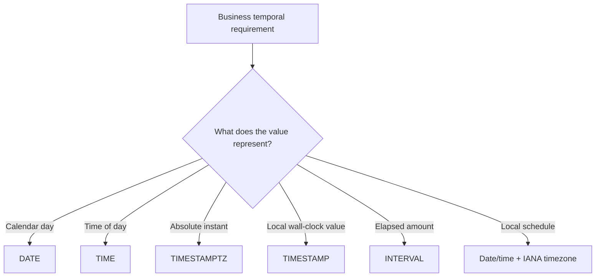
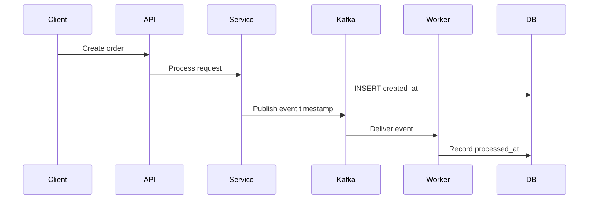

# 15- Choosing the Right Date Type

## Overview

Choosing a SQL date/time type is a data-modeling decision, not merely a syntax preference. The correct type depends on what the value represents:

- An **instant in time** — a globally identifiable point such as `2026-08-30T08:30:00Z`.
- A **calendar date** — a day without a time or timezone, such as a customer's birthday.
- A **local date and time** — a wall-clock value whose timezone context matters separately.
- A **time of day** — such as a store opening time.
- A **duration or elapsed amount** — such as "15 minutes" or "3 months."

A common production failure is storing every temporal value as a timestamp. That loses business semantics and can introduce timezone bugs.

A useful modeling rule is:

> **Store the type of temporal fact you actually have, not the type that happens to be convenient for the application.**

For backend systems, PostgreSQL is a particularly useful reference because it distinguishes `date`, `time`, `timestamp`, `timestamptz`, and `interval` clearly.

## Temporal Data Types

The most important PostgreSQL types are:

| Type | Represents | Timezone-aware? | Typical use |
|---|---|---:|---|
| `date` | Calendar date | No | Birthday, invoice date, holiday |
| `time` | Time of day | No | Store opening time |
| `time with time zone` | Time of day with offset | Yes | Rare; specialized cases |
| `timestamp` | Local date + time | No | Wall-clock value without an instant |
| `timestamptz` | Instant in time | Yes | Events, audit timestamps, jobs |
| `interval` | Duration / calendar-relative amount | N/A | Retention period, subscription duration |

The distinction between `timestamp` and `timestamptz` is especially important.

## `date`

### What It Is

`date` represents a calendar date without a time-of-day or timezone.

```sql
CREATE TABLE users (
    id BIGSERIAL PRIMARY KEY,
    birth_date DATE NOT NULL
);
```

A value such as:

```text
1995-07-21
```

does not mean midnight in UTC or midnight in the user's timezone. It simply represents that calendar date.

### When to Use It

Use `date` when the business concept is inherently a date.

Examples:

- Date of birth.
- Invoice date.
- Contract start date when only the calendar day matters.
- Tax filing date.
- Public holiday.
- Business reporting date.

### Advantages

- Explicit business semantics.
- No accidental timezone conversion.
- Smaller and simpler than timestamp types.
- Easy equality and range comparisons.
- Avoids inventing a meaningless time component.

### Common Mistake

Do not model a birthday as:

```sql
birth_at TIMESTAMPTZ
```

if the system only knows:

```text
1995-07-21
```

Adding midnight creates a false precision and introduces unnecessary timezone semantics.

## `time`

`time` represents a time of day without a date.

```sql
CREATE TABLE business_hours (
    id BIGSERIAL PRIMARY KEY,
    opens_at TIME NOT NULL,
    closes_at TIME NOT NULL
);
```

For example:

```text
09:00:00
18:00:00
```

### When to Use It

Use `time` when the date is intentionally irrelevant.

Examples:

- Store opens at 09:00.
- Daily maintenance begins at 02:00.
- Restaurant kitchen closes at 22:30.
- A recurring daily notification time.

### Production Consideration

A time-of-day value is not necessarily an instant.

For example:

```text
09:00 Asia/Kolkata
```

is different from:

```text
09:00 America/New_York
```

If the business rule is "run at 9 AM in each user's local timezone," storing only `TIME` is insufficient. You also need the timezone or an equivalent user preference.

## `timestamp`

PostgreSQL `timestamp without time zone` represents a date and time without timezone semantics.

```sql
CREATE TABLE meetings (
    id BIGSERIAL PRIMARY KEY,
    scheduled_at TIMESTAMP NOT NULL
);
```

Example:

```text
2026-08-30 14:30:00
```

The database does not inherently know whether that means:

```text
14:30 UTC
14:30 Asia/Kolkata
14:30 America/New_York
```

### When to Use It

Use `timestamp without time zone` when the value is deliberately a **local wall-clock value** and timezone interpretation is either irrelevant or stored separately.

Examples can include:

- A locally defined recurring schedule.
- A business-local appointment representation where the timezone is modeled independently.
- Imported legacy data whose timezone semantics are explicitly preserved elsewhere.

### Risks

The biggest risk is ambiguity.

If one service interprets:

```text
2026-08-30 14:30:00
```

as UTC and another interprets it as local time, the same database value can represent different instants.

For distributed systems, this ambiguity can become especially difficult when services run in different containers, hosts, regions, or AWS environments.

## `timestamptz`

PostgreSQL's `timestamp with time zone`, commonly written as `timestamptz`, represents an **instant in time**.

```sql
CREATE TABLE orders (
    id BIGSERIAL PRIMARY KEY,
    created_at TIMESTAMPTZ NOT NULL DEFAULT CURRENT_TIMESTAMP
);
```

A value such as:

```text
2026-08-30 08:30:00+00
```

identifies one instant.

PostgreSQL stores the instant internally and converts it to the session timezone when displaying it.

### When to Use It

Use `timestamptz` for events whose exact point in time matters.

Typical examples:

- `created_at`
- `updated_at`
- `deleted_at`
- `published_at`
- `processed_at`
- `payment_completed_at`
- `last_login_at`
- Kafka event timestamps
- Audit events
- Distributed job execution timestamps

### Why It Is Usually the Default for Backend Events

A distributed backend needs a common temporal reference.

```text
Browser
   ↓
API
   ↓
Service A
   ↓
Kafka
   ↓
Service B
   ↓
PostgreSQL
```

Each component may run in a different timezone. An absolute instant avoids interpreting the same event differently across services.

## `timestamp` vs `timestamptz`

This is one of the most important SQL interview and production distinctions.

| Property | `timestamp` | `timestamptz` |
|---|---|---|
| Stores calendar date/time | Yes | Yes |
| Represents an absolute instant | No | Yes |
| Timezone semantics | None | Yes |
| Display affected by session timezone | No | Yes |
| Good for audit/event timestamps | Usually no | Yes |
| Good for local wall-clock values | Yes | Not always |
| Common backend default | Usually no | Usually yes |

The names can be misleading.

`timestamptz` does **not** store a timezone name such as:

```text
Asia/Kolkata
```

It represents an instant and PostgreSQL uses the session timezone when displaying it.

If the business needs the user's named timezone, store that separately.

For example:

```sql
CREATE TABLE users (
    id BIGSERIAL PRIMARY KEY,
    timezone TEXT NOT NULL
);
```

A value such as:

```text
Asia/Kolkata
```

is an IANA timezone identifier, not part of the `timestamptz` value itself.

## Instants vs Local Date/Time

A senior engineer should distinguish these concepts explicitly.

### Instant

```text
2026-08-30T08:30:00Z
```

One point on the global timeline.

### Local Date/Time

```text
2026-08-30 14:00:00
```

A wall-clock representation with no inherent global meaning.

### Local Date + Timezone

```text
2026-08-30 14:00:00
Asia/Kolkata
```

This can be resolved to an instant.

### Calendar Date

```text
2026-08-30
```

A day, not an instant.

The modeling flow is:



## Modeling Common Backend Fields

A production schema might look like:

```sql
CREATE TABLE subscriptions (
    id BIGSERIAL PRIMARY KEY,
    user_id BIGINT NOT NULL,
    start_date DATE NOT NULL,
    expires_at TIMESTAMPTZ,
    created_at TIMESTAMPTZ NOT NULL DEFAULT CURRENT_TIMESTAMP,
    updated_at TIMESTAMPTZ NOT NULL DEFAULT CURRENT_TIMESTAMP
);
```

The fields have different semantics:

| Field | Type | Reason |
|---|---|---|
| `start_date` | `DATE` | Business calendar date |
| `expires_at` | `TIMESTAMPTZ` | Exact expiration instant |
| `created_at` | `TIMESTAMPTZ` | Audit/event instant |
| `updated_at` | `TIMESTAMPTZ` | Audit/update instant |

Using one type for all four would make the schema less expressive.

## Recurring Schedules

Recurring schedules require special care.

Suppose a user says:

> Send my report every day at 09:00 in my timezone.

The business concept is not simply:

```text
09:00 UTC
```

It is:

```text
09:00
+
Asia/Kolkata
+
recurring schedule
```

A reasonable model is:

```sql
CREATE TABLE notification_schedules (
    id BIGSERIAL PRIMARY KEY,
    user_id BIGINT NOT NULL,
    local_time TIME NOT NULL,
    timezone TEXT NOT NULL,
    enabled BOOLEAN NOT NULL DEFAULT TRUE
);
```

The scheduler then resolves the local schedule into an instant for each execution.

This is different from storing:

```sql
next_run_at TIMESTAMPTZ
```

which represents the next concrete execution instant.

A mature scheduler may store both:

```text
schedule definition
    ↓
local time + timezone + recurrence
    ↓
next concrete execution
    ↓
next_run_at TIMESTAMPTZ
```

## Daylight Saving Time

Timezone-aware scheduling cannot be modeled correctly using fixed UTC offsets alone.

For example:

```text
America/New_York
```

does not always have the same UTC offset throughout the year.

Therefore, prefer:

```text
America/New_York
```

over:

```text
UTC-05:00
```

when the requirement is tied to a geographic timezone's civil-time rules.

This matters for:

- Celery periodic jobs.
- User notifications.
- Appointment systems.
- Calendar integrations.
- Billing schedules.
- Business opening hours.

## `interval`

`interval` represents an amount of time.

```sql
SELECT CURRENT_TIMESTAMP + INTERVAL '30 days';
```

It is useful when the business concept is an elapsed or calendar-relative amount.

Examples:

```sql
INTERVAL '15 minutes'
INTERVAL '2 hours'
INTERVAL '30 days'
INTERVAL '3 months'
```

### Important Distinction

A duration is not always equivalent to a fixed number of seconds.

For example:

```text
1 month
```

does not have one universal number of seconds.

Likewise:

```text
1 day
```

as a calendar operation can differ from exactly 24 elapsed hours around daylight-saving transitions.

This distinction becomes important when implementing billing, subscriptions, recurring jobs, and calendar operations.

## Choosing Between Duration and Expiration Time

Suppose a session lasts 30 minutes.

You could model:

```text
duration = 30 minutes
```

or:

```text
expires_at = 2026-08-30T09:00:00Z
```

They answer different questions.

| Requirement | Better representation |
|---|---|
| Policy says session lasts 30 minutes | Duration/configuration |
| This session expires at a specific instant | `TIMESTAMPTZ` |
| Need to query currently expired sessions | `TIMESTAMPTZ` |
| Need configurable TTL | Duration |
| Need auditability of actual expiration | `TIMESTAMPTZ` |

In many systems, both are useful:

```text
session_ttl = 30 minutes
created_at = instant
expires_at = instant
```

The application derives:

```text
expires_at = created_at + session_ttl
```

and stores the resulting instant if it is operationally useful.

## Python, Django, and FastAPI

Application-layer types should preserve the same semantics as the database.

In modern Python:

```python
from datetime import date, datetime
from zoneinfo import ZoneInfo

birth_date: date
created_at: datetime
timezone = ZoneInfo("Asia/Kolkata")
```

The important distinction is between:

```python
date
```

and:

```python
datetime
```

A birthday should normally remain a `date`.

An event timestamp should normally be a timezone-aware `datetime`.

For example:

```python
from datetime import UTC, datetime

created_at = datetime.now(UTC)
```

Avoid creating naive event timestamps:

```python
created_at = datetime.now()
```

when the value is intended to represent a globally meaningful instant.

### Django

For event timestamps, Django projects commonly use timezone-aware datetimes:

```python
from django.db import models


class Order(models.Model):
    created_at = models.DateTimeField(auto_now_add=True)
```

With timezone support enabled, application code should consistently use timezone-aware datetimes.

For a calendar date:

```python
class User(models.Model):
    birth_date = models.DateField()
```

The model should reflect the business semantics rather than forcing everything into `DateTimeField`.

### FastAPI

API schemas should distinguish date and datetime values.

For example, conceptually:

```python
from datetime import date, datetime

from pydantic import BaseModel


class UserResponse(BaseModel):
    birth_date: date
    created_at: datetime
```

This allows API contracts to preserve the distinction between:

```text
2026-08-30
```

and:

```text
2026-08-30T08:30:00Z
```

## API Boundary Design

A REST API should use explicit temporal representations.

For an instant:

```json
{
  "created_at": "2026-08-30T08:30:00Z"
}
```

For a calendar date:

```json
{
  "birth_date": "1995-07-21"
}
```

For a local schedule:

```json
{
  "send_time": "09:00:00",
  "timezone": "Asia/Kolkata"
}
```

Do not silently convert:

```text
date
```

into:

```text
timestamp at midnight
```

unless that conversion is explicitly part of the business logic.

## Distributed Systems

Temporal consistency becomes more important as systems become distributed.

Consider:



If all event timestamps represent absolute instants:

```text
created_at
published_at
processed_at
```

the system can reliably reason about event ordering and latency.

For example:

```sql
SELECT
    processed_at - created_at AS processing_latency
FROM orders;
```

This becomes much harder if timestamps were stored as ambiguous local values.

## Timezone Storage Strategy

A practical backend strategy is:

```text
Event timestamp
    → TIMESTAMPTZ

Calendar date
    → DATE

Recurring local schedule
    → local time/date + IANA timezone

User timezone preference
    → IANA timezone identifier

Display
    → convert instant to user's timezone
```

For example:

```sql
CREATE TABLE users (
    id BIGSERIAL PRIMARY KEY,
    timezone TEXT NOT NULL
);

CREATE TABLE orders (
    id BIGSERIAL PRIMARY KEY,
    created_at TIMESTAMPTZ NOT NULL DEFAULT CURRENT_TIMESTAMP
);
```

The database stores the instant.

The user's timezone determines presentation:

```text
DB instant
    ↓
Asia/Kolkata
    ↓
UI representation
```

This separates storage semantics from presentation semantics.

## Date Type Selection Matrix

| Business concept | Recommended type | Reason |
|---|---|---|
| Birthday | `DATE` | Calendar date |
| Holiday | `DATE` | Calendar date |
| Invoice date | `DATE` | Business date |
| Order creation | `TIMESTAMPTZ` | Exact instant |
| Payment completed | `TIMESTAMPTZ` | Exact instant |
| API request timestamp | `TIMESTAMPTZ` | Global event |
| Audit event | `TIMESTAMPTZ` | Global event |
| Store opens at 09:00 | `TIME` | Local time-of-day |
| Daily job at 09:00 in user timezone | `TIME` + timezone | Civil-time schedule |
| Appointment instant | `TIMESTAMPTZ` | Exact point in time |
| Local wall-clock appointment | `TIMESTAMP` + timezone if needed | Local representation |
| Subscription TTL | `INTERVAL` or application duration | Relative amount |
| Actual subscription expiration | `TIMESTAMPTZ` | Concrete instant |
| User timezone | IANA timezone string | Civil-time rules |

## Production Schema Example

A realistic system may combine several temporal types:

```sql
CREATE TABLE users (
    id BIGSERIAL PRIMARY KEY,
    birth_date DATE,
    timezone TEXT NOT NULL DEFAULT 'UTC'
);

CREATE TABLE subscriptions (
    id BIGSERIAL PRIMARY KEY,
    user_id BIGINT NOT NULL REFERENCES users(id),
    started_at TIMESTAMPTZ NOT NULL DEFAULT CURRENT_TIMESTAMP,
    expires_at TIMESTAMPTZ,
    billing_period INTERVAL
);

CREATE TABLE notification_schedules (
    id BIGSERIAL PRIMARY KEY,
    user_id BIGINT NOT NULL REFERENCES users(id),
    local_time TIME NOT NULL,
    timezone TEXT NOT NULL,
    next_run_at TIMESTAMPTZ,
    enabled BOOLEAN NOT NULL DEFAULT TRUE
);
```

The model deliberately separates:

```text
birth_date
    → calendar concept

started_at / expires_at
    → absolute instants

billing_period
    → relative period

local_time + timezone
    → recurring civil-time rule

next_run_at
    → next concrete instant
```

This separation prevents many classes of temporal bugs.

## Indexing Implications

Date type selection also affects query design.

For:

```sql
created_at TIMESTAMPTZ NOT NULL
```

a typical index is:

```sql
CREATE INDEX idx_orders_created_at
ON orders (created_at);
```

Range queries can then use the raw timestamp:

```sql
SELECT id
FROM orders
WHERE created_at >= :start
  AND created_at < :end;
```

For:

```sql
birth_date DATE NOT NULL
```

an index supports date-based filtering:

```sql
CREATE INDEX idx_users_birth_date
ON users (birth_date);
```

The key is to preserve the semantic type and avoid unnecessary conversions in indexed predicates.

## Data Migration Considerations

Changing temporal types in production can be dangerous.

Suppose a legacy system stores:

```text
timestamp without time zone
```

but nobody knows whether values are UTC or local time.

Do not blindly execute:

```sql
ALTER TABLE events
ALTER COLUMN created_at TYPE TIMESTAMPTZ;
```

First establish:

1. What timezone the existing values represent.
2. Whether historical records follow one rule.
3. Whether different services inserted different interpretations.
4. Whether daylight-saving transitions affected historical data.
5. Whether application code assumes the old behavior.

A safe migration may require:

```text
Legacy timestamp
      ↓
Determine historical timezone semantics
      ↓
Convert to explicit instant
      ↓
Validate representative records
      ↓
Backfill new column
      ↓
Dual-write if necessary
      ↓
Compare old/new values
      ↓
Switch reads
      ↓
Retire legacy representation
```

Temporal migrations are data migrations, not merely schema migrations.

## Reliability Considerations

Never use application wall-clock time as an implicit source of truth across distributed systems.

For example, two containers may have slightly different system clocks.

For event timestamps:

- Synchronize host/container clocks.
- Prefer UTC-based instants.
- Treat database/server timestamps consistently.
- Avoid using timestamps as unique identifiers.
- Do not assume two timestamps generated by different services are perfectly ordered.

For measuring elapsed execution time inside application code, a monotonic clock is often more appropriate than wall-clock time.

For example, Python provides:

```python
import time

start = time.monotonic()
# operation
elapsed = time.monotonic() - start
```

Wall clocks can move due to synchronization or administrative changes; monotonic clocks are designed for measuring elapsed duration.

## Common Mistakes

### Storing Everything as `TIMESTAMP`

A birthday does not become more correct because it is stored as midnight.

Use:

```sql
birth_date DATE
```

when the business concept is a date.

### Using Naive Timestamps for Events

Avoid ambiguous values such as:

```text
2026-08-30 14:00:00
```

for distributed event timestamps.

Prefer an explicit instant:

```text
2026-08-30T14:00:00Z
```

and a timezone-aware database representation.

### Assuming `timestamptz` Stores the Timezone Name

It does not preserve:

```text
Asia/Kolkata
```

as the timezone identity of the event.

It represents an instant. Store the named timezone separately when the business needs it.

### Storing UTC Offsets Instead of IANA Zones

This:

```text
UTC+05:30
```

is useful for representing an offset.

It is not equivalent to:

```text
Asia/Kolkata
```

when recurring civil-time behavior matters.

Use IANA timezone identifiers for recurring schedules.

### Converting Local Dates to Midnight UTC

This can silently change the business date.

For example:

```text
2026-08-30
```

should not automatically become:

```text
2026-08-30T00:00:00Z
```

unless the business explicitly defines the date that way.

### Using `TIME` for an Absolute Event

This loses the date entirely.

```text
14:30
```

cannot identify when an actual payment occurred.

Use an instant type for events.

### Confusing Duration with Expiration

These are different:

```text
30 minutes
```

and:

```text
2026-08-30T09:30:00Z
```

The first is a relative amount; the second is an instant.

### Ignoring Calendar Semantics

"One month later" is not necessarily equivalent to adding a fixed number of seconds.

Calendar operations should use calendar-aware types and database/application semantics rather than arbitrary second counts.

## Interview Traps

| Question | Strong answer |
|---|---|
| What should `created_at` usually use in PostgreSQL? | `TIMESTAMPTZ`, because it represents an absolute instant |
| Should a birthday be a timestamp? | Usually no; use `DATE` because the time and timezone are irrelevant |
| Does `TIMESTAMPTZ` store a timezone name? | No; it represents an instant and displays it according to the session timezone |
| When is `TIMESTAMP` appropriate? | When a timezone-free local wall-clock value is intentionally modeled |
| How do you model "9 AM in the user's timezone"? | Store the local schedule plus an IANA timezone and resolve it to an instant for execution |
| Is `UTC+05:30` equivalent to `Asia/Kolkata`? | No; an offset is not a timezone rule database |
| Is a duration the same as an expiration timestamp? | No; a duration is relative, while an expiration timestamp is an absolute instant |
| Why not store all dates as timestamps? | It introduces false precision and unnecessary timezone semantics |
| What should an API use for an instant? | An explicit ISO 8601/RFC 3339 datetime with timezone information |
| What type should represent a calendar date? | `DATE` |

## Best Practices

- Model temporal values according to their business semantics.
- Use `DATE` for calendar dates.
- Use `TIME` for timezone-independent time-of-day values.
- Use `TIMESTAMPTZ` for absolute event timestamps.
- Use `TIMESTAMP` only when timezone-free wall-clock semantics are intentional.
- Store recurring timezone-sensitive schedules as local time/date plus an IANA timezone.
- Store user timezone preferences separately from event timestamps.
- Prefer UTC-normalized instants for distributed event data.
- Use timezone-aware Python `datetime` objects for absolute instants.
- Use half-open ranges for timestamp filtering.
- Validate temporal migrations carefully; do not assume legacy timestamps have known timezone semantics.
- Use database indexes on the native temporal column rather than unnecessarily transforming it in predicates.
- Distinguish wall-clock time from elapsed duration when measuring performance or TTLs.

## Key Takeaways

- **Choose the temporal type based on business semantics: `DATE` for calendar dates, `TIME` for time-of-day, and `TIMESTAMPTZ` for absolute instants.**
- **Use `TIMESTAMPTZ` for distributed backend events such as `created_at`, `updated_at`, payments, audit records, and Kafka event timestamps.**
- **A timezone-aware instant does not preserve an IANA timezone name; store the user's or schedule's timezone separately when civil-time behavior matters.**
- **Recurring local schedules require timezone-aware modeling, while concrete execution times should be represented as absolute instants.**
- **Treat temporal migrations and timezone assumptions as data-modeling problems; incorrect historical interpretation cannot be fixed safely by changing the column type alone.**