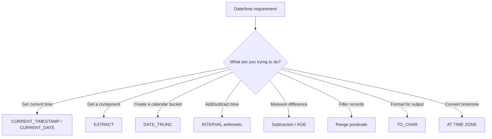

# 16- Choosing the Right Date Function

## Overview

SQL provides many date and time functions, but the difficult part in production systems is not remembering function names. It is choosing the operation that preserves the intended temporal semantics, remains index-friendly, and behaves correctly across time zones.

The same requirement can often be implemented in several ways:

```sql
EXTRACT(YEAR FROM created_at)
DATE_TRUNC('day', created_at)
created_at >= :start AND created_at < :end
created_at + INTERVAL '7 days'
created_at - INTERVAL '30 minutes'
```

These expressions are not interchangeable. They answer different questions and can have very different performance characteristics.

A practical decision rule is:

> **Use the simplest date function that expresses the business operation, and avoid transforming an indexed column when a range predicate can express the same filter.**

This document uses PostgreSQL syntax as the primary reference. Other SQL databases provide equivalent functionality, but function names and timezone semantics vary.

## Think in Terms of the Operation

Most date/time requirements fall into a small number of categories.

| Requirement | Typical PostgreSQL operation |
|---|---|
| Get current instant | `CURRENT_TIMESTAMP` / `now()` |
| Get current calendar date | `CURRENT_DATE` |
| Extract year/month/day | `EXTRACT()` |
| Truncate to a calendar boundary | `DATE_TRUNC()` |
| Add/subtract a duration or calendar period | `+` / `-` with `INTERVAL` |
| Calculate elapsed temporal difference | `-` |
| Filter a time period | Range predicates |
| Format for presentation | `TO_CHAR()` |
| Convert an instant to another timezone | `AT TIME ZONE` |
| Check whether a timestamp falls in a period | Range or explicit boundary comparison |
| Build calendar-based reporting buckets | `DATE_TRUNC()` |
| Find a rolling time window | Relative range predicate |

The important distinction is between **transforming a value** and **filtering a column**.

## Current Date and Time

Use `CURRENT_TIMESTAMP` when the requirement is the current transaction timestamp.

```sql
SELECT CURRENT_TIMESTAMP;
```

PostgreSQL also provides:

```sql
SELECT CURRENT_DATE;
SELECT CURRENT_TIME;
SELECT LOCALTIME;
SELECT LOCALTIMESTAMP;
```

For backend event timestamps, `CURRENT_TIMESTAMP` is usually the appropriate choice when the column is `TIMESTAMPTZ`.

```sql
CREATE TABLE orders (
    id BIGSERIAL PRIMARY KEY,
    created_at TIMESTAMPTZ NOT NULL DEFAULT CURRENT_TIMESTAMP
);
```

### Choosing the Current-Time Function

| Requirement | Function |
|---|---|
| Current date | `CURRENT_DATE` |
| Current timestamp | `CURRENT_TIMESTAMP` |
| Current time | `CURRENT_TIME` |
| Transaction-consistent timestamp | `CURRENT_TIMESTAMP` / `now()` |
| Wall-clock timestamp at execution | `clock_timestamp()` |

An important PostgreSQL detail is that `CURRENT_TIMESTAMP` and `now()` represent the start of the current transaction, not a continuously changing clock value.

For example:

```sql
BEGIN;

SELECT CURRENT_TIMESTAMP;
SELECT pg_sleep(2);
SELECT CURRENT_TIMESTAMP;

COMMIT;
```

Both timestamp expressions represent the same transaction timestamp.

If the requirement is to measure actual wall-clock progression inside a transaction, `clock_timestamp()` has different semantics.

This distinction matters for auditing, long-running transactions, and performance instrumentation.

## Extracting Components with `EXTRACT`

Use `EXTRACT()` when the requirement is to obtain a component of a date or timestamp.

```sql
SELECT EXTRACT(YEAR FROM created_at)
FROM orders;
```

Other fields include:

```sql
SELECT
    EXTRACT(YEAR FROM created_at) AS year,
    EXTRACT(MONTH FROM created_at) AS month,
    EXTRACT(DAY FROM created_at) AS day,
    EXTRACT(HOUR FROM created_at) AS hour,
    EXTRACT(MINUTE FROM created_at) AS minute
FROM orders;
```

### When to Use It

`EXTRACT()` is appropriate when the extracted component is itself part of the result or grouping logic.

For example:

```sql
SELECT
    EXTRACT(YEAR FROM created_at) AS year,
    COUNT(*) AS order_count
FROM orders
GROUP BY EXTRACT(YEAR FROM created_at)
ORDER BY year;
```

### Limitation

`EXTRACT()` is usually the wrong tool for filtering an indexed timestamp.

Avoid:

```sql
SELECT *
FROM orders
WHERE EXTRACT(YEAR FROM created_at) = 2026;
```

Prefer:

```sql
SELECT *
FROM orders
WHERE created_at >= TIMESTAMPTZ '2026-01-01 00:00:00+00'
  AND created_at <  TIMESTAMPTZ '2027-01-01 00:00:00+00';
```

The second form expresses the actual time range and can use a normal B-tree index on `created_at`.

## `DATE_TRUNC`

Use `DATE_TRUNC()` when you need to map a timestamp to a calendar boundary.

```sql
SELECT DATE_TRUNC('day', created_at)
FROM orders;
```

Common precision values include:

```text
minute
hour
day
week
month
quarter
year
```

For example:

```sql
SELECT
    DATE_TRUNC('month', created_at) AS month,
    COUNT(*) AS order_count
FROM orders
GROUP BY DATE_TRUNC('month', created_at)
ORDER BY month;
```

This is particularly useful for reporting and aggregation.

### `DATE_TRUNC` vs `EXTRACT`

The two functions answer different questions.

| Requirement | Use |
|---|---|
| "What year is this timestamp in?" | `EXTRACT(YEAR ...)` |
| "What month number is this timestamp in?" | `EXTRACT(MONTH ...)` |
| "What is the start of this month?" | `DATE_TRUNC('month', ...)` |
| "Group timestamps by month" | Usually `DATE_TRUNC()` |
| "Filter one month efficiently" | Range predicate |

For example:

```sql
DATE_TRUNC('month', created_at)
```

produces a temporal bucket, whereas:

```sql
EXTRACT(MONTH FROM created_at)
```

produces a numeric component.

## `DATE_TRUNC` and Time Zones

Timezone semantics matter when truncating `TIMESTAMPTZ`.

For example:

```sql
SELECT DATE_TRUNC('day', created_at)
FROM orders;
```

The result depends on the session timezone because a `TIMESTAMPTZ` is displayed and interpreted according to timezone context.

If reporting must follow a user's or business region's calendar, explicitly establish the intended timezone before truncating.

Conceptually:

```text
UTC instant
    ↓
Business timezone
    ↓
Calendar interpretation
    ↓
Day/month bucket
```

This is critical for reports such as:

- Daily sales.
- Local business-day metrics.
- User activity by local date.
- Regional dashboards.

## Date Arithmetic

Use direct arithmetic with `INTERVAL` for adding or subtracting temporal amounts.

```sql
SELECT CURRENT_TIMESTAMP + INTERVAL '7 days';
```

Examples:

```sql
SELECT created_at + INTERVAL '30 minutes'
FROM orders;

SELECT created_at - INTERVAL '7 days'
FROM orders;

SELECT created_at + INTERVAL '3 months'
FROM orders;
```

This is generally clearer than manually converting everything into seconds.

### Duration vs Calendar Period

Be careful with calendar arithmetic.

```sql
INTERVAL '24 hours'
```

and:

```sql
INTERVAL '1 day'
```

may have different practical semantics around timezone transitions when working with timezone-aware timestamps.

Similarly:

```sql
INTERVAL '30 days'
```

is not necessarily equivalent to:

```sql
INTERVAL '1 month'
```

Use the expression that matches the business requirement.

If the requirement is:

> exactly 30 elapsed days

use:

```sql
INTERVAL '30 days'
```

If the requirement is:

> one calendar month later

use:

```sql
INTERVAL '1 month'
```

## Date Difference

Use subtraction when the requirement is to calculate temporal distance.

For timestamps:

```sql
SELECT completed_at - created_at AS processing_time
FROM orders;
```

For dates:

```sql
SELECT CURRENT_DATE - birth_date AS age_in_days
FROM users;
```

For more explicit calendar calculations, use `AGE()`.

```sql
SELECT AGE(CURRENT_DATE, birth_date)
FROM users;
```

`AGE()` returns a calendar-oriented interval rather than simply counting seconds or days.

### Choosing Between Subtraction and `AGE()`

| Requirement | Better operation |
|---|---|
| Exact elapsed duration | Timestamp subtraction |
| Number of elapsed days | Date subtraction |
| Calendar-oriented age | `AGE()` |
| Processing latency | Timestamp subtraction |
| Subscription runtime | Timestamp subtraction |
| Human-readable calendar difference | `AGE()` |

Do not use `AGE()` simply because it sounds appropriate for every difference calculation. For operational latency, a precise elapsed duration is usually more useful.

## Filtering by Date

Filtering is where date-function selection has the biggest performance impact.

Suppose:

```sql
CREATE INDEX idx_orders_created_at
ON orders (created_at);
```

For a daily query, prefer:

```sql
SELECT *
FROM orders
WHERE created_at >= :start
  AND created_at < :end;
```

For example:

```sql
SELECT *
FROM orders
WHERE created_at >= TIMESTAMPTZ '2026-08-30 00:00:00+00'
  AND created_at <  TIMESTAMPTZ '2026-08-31 00:00:00+00';
```

This is preferable to:

```sql
WHERE DATE(created_at) = DATE '2026-08-30'
```

because applying a function to the indexed column can prevent efficient use of a normal index.

## Half-Open Ranges

The preferred pattern for timestamp ranges is:

```sql
column >= start
AND column < end
```

This is called a **half-open interval**.

For example:

```text
[2026-08-30 00:00:00, 2026-08-31 00:00:00)
```

It includes the start and excludes the end.

This avoids precision problems around values such as:

```text
23:59:59.999999
```

and makes adjacent periods compose cleanly:

```text
[Jan 1, Feb 1)
[Feb 1, Mar 1)
[Mar 1, Apr 1)
```

There is no overlap and no gap.

This pattern is particularly important for:

- Reporting.
- Pagination.
- Event processing.
- ETL jobs.
- Kafka consumers.
- Incremental data processing.
- Time-based partitioning.

## `TO_CHAR` for Formatting

Use `TO_CHAR()` when the database needs to produce a formatted textual representation.

```sql
SELECT TO_CHAR(
    created_at,
    'YYYY-MM-DD HH24:MI:SS'
)
FROM orders;
```

For reporting:

```sql
SELECT
    TO_CHAR(created_at, 'YYYY-MM') AS month,
    COUNT(*) AS order_count
FROM orders
GROUP BY TO_CHAR(created_at, 'YYYY-MM');
```

### Important Production Rule

Formatting converts a temporal value into text.

After:

```sql
TO_CHAR(created_at, 'YYYY-MM-DD')
```

the result is no longer a date/timestamp. It is text.

Therefore, do not use formatting as a substitute for temporal filtering or sorting.

Avoid:

```sql
WHERE TO_CHAR(created_at, 'YYYY-MM') = '2026-08'
```

Prefer:

```sql
WHERE created_at >= TIMESTAMPTZ '2026-08-01 00:00:00+00'
  AND created_at <  TIMESTAMPTZ '2026-09-01 00:00:00+00';
```

Format only at the presentation boundary when possible.

## `AT TIME ZONE`

Use `AT TIME ZONE` when you need explicit timezone conversion or interpretation.

For example:

```sql
SELECT created_at AT TIME ZONE 'Asia/Kolkata'
FROM orders;
```

This is useful when presenting an instant in a user's timezone.

A typical backend flow is:

```text
TIMESTAMPTZ in database
        ↓
User timezone
        ↓
AT TIME ZONE
        ↓
Application/API presentation
```

Do not confuse timezone conversion with timezone storage.

A database event timestamp should generally remain an absolute instant. Convert it when the consumer needs a local representation.

## Choosing Functions for Common Requirements

| Requirement | Recommended expression |
|---|---|
| Current instant | `CURRENT_TIMESTAMP` |
| Current calendar date | `CURRENT_DATE` |
| Extract year | `EXTRACT(YEAR FROM value)` |
| Extract month | `EXTRACT(MONTH FROM value)` |
| Start of month | `DATE_TRUNC('month', value)` |
| Start of day | `DATE_TRUNC('day', value)` |
| Add 7 days | `value + INTERVAL '7 days'` |
| Subtract 30 minutes | `value - INTERVAL '30 minutes'` |
| Exact timestamp difference | `end - start` |
| Calendar age/difference | `AGE(end, start)` |
| Format as text | `TO_CHAR(value, pattern)` |
| Convert timezone | `value AT TIME ZONE 'Zone'` |
| Filter indexed timestamp | `value >= :start AND value < :end` |
| Filter a calendar month | Timestamp range |
| Group by month | `DATE_TRUNC('month', value)` |

## Function Selection by Intent

A useful mental model is:



The key optimization is that **filtering should usually be expressed as a range rather than a transformation**.

## Grouping vs Filtering

Consider monthly reporting.

For grouping, use:

```sql
SELECT
    DATE_TRUNC('month', created_at) AS month,
    COUNT(*) AS orders
FROM orders
GROUP BY DATE_TRUNC('month', created_at)
ORDER BY month;
```

For filtering, use boundaries:

```sql
SELECT COUNT(*)
FROM orders
WHERE created_at >= TIMESTAMPTZ '2026-08-01 00:00:00+00'
  AND created_at <  TIMESTAMPTZ '2026-09-01 00:00:00+00';
```

This distinction is worth remembering:

> **Transform for projection/grouping; use ranges for indexed filtering.**

## Index and Query Planner Considerations

Suppose the table contains millions of rows:

```sql
CREATE INDEX idx_orders_created_at
ON orders (created_at);
```

This query is generally index-friendly:

```sql
SELECT id
FROM orders
WHERE created_at >= :start
  AND created_at < :end;
```

This query may require a scan or a different access strategy:

```sql
SELECT id
FROM orders
WHERE DATE(created_at) = :date;
```

The exact execution plan depends on data distribution, statistics, available indexes, and PostgreSQL's planner decisions.

Always verify important production queries with:

```sql
EXPLAIN (ANALYZE, BUFFERS)
SELECT id
FROM orders
WHERE created_at >= :start
  AND created_at < :end;
```

Look for:

- Index scans where appropriate.
- Unexpected sequential scans.
- Excessive rows removed by filters.
- High buffer reads.
- Poor cardinality estimates.
- Expensive sorts or aggregates.

## When a Functional Index Is Appropriate

Sometimes a transformed expression is genuinely part of the application's query model.

For example:

```sql
CREATE INDEX idx_orders_created_date
ON orders ((created_at::date));
```

Then a query such as:

```sql
SELECT *
FROM orders
WHERE created_at::date = DATE '2026-08-30';
```

can potentially use the expression index.

However, do not create functional indexes simply to compensate for poorly designed filtering.

Prefer the native range approach when it expresses the requirement naturally:

```sql
WHERE created_at >= :start
  AND created_at < :end
```

Functional indexes have additional storage and write-maintenance costs and should be justified by real query patterns.

## Backend API Example

Suppose a REST API supports:

```text
GET /orders?from=2026-08-01T00:00:00Z&to=2026-09-01T00:00:00Z
```

The backend should parse the values into timezone-aware datetimes and issue a parameterized range query:

```sql
SELECT id, user_id, created_at, total_amount
FROM orders
WHERE created_at >= :from_timestamp
  AND created_at < :to_timestamp
ORDER BY created_at, id;
```

This approach provides:

- Explicit temporal boundaries.
- Index-friendly filtering.
- No dependence on server-local timezone.
- Safe parameter binding.
- Clear API semantics.

The database should not need to interpret user-provided strings through dynamic SQL.

## Pagination with Timestamps

Timestamp filtering is also useful for keyset pagination.

Avoid relying only on:

```sql
ORDER BY created_at
```

when multiple records can share the same timestamp.

Use a deterministic composite ordering:

```sql
SELECT id, created_at, total_amount
FROM orders
WHERE (created_at, id) > (:last_created_at, :last_id)
ORDER BY created_at, id
LIMIT 100;
```

An appropriate index is:

```sql
CREATE INDEX idx_orders_created_id
ON orders (created_at, id);
```

This is more scalable than repeatedly increasing large `OFFSET` values for very large datasets.

## Timezone-Safe Reporting

Suppose the requirement is:

> Return all orders placed on August 30 in the user's local timezone.

Do not simply compare the UTC date:

```sql
WHERE created_at::date = DATE '2026-08-30'
```

That answers:

> Which orders occurred on August 30 according to the database/session timezone?

Instead:

1. Interpret the requested calendar date in the user's timezone.
2. Convert its local start and next-day boundary into absolute instants.
3. Query the timestamp using those boundaries.

Conceptually:

```text
User date
2026-08-30
     +
Asia/Kolkata
     ↓
Local start instant
     ↓
Next local-day boundary
     ↓
TIMESTAMPTZ range query
```

This prevents users in different timezones from receiving incorrect calendar-day results.

## Common Mistakes

### Applying Functions to Indexed Columns

Avoid:

```sql
WHERE DATE(created_at) = :date
```

when a range predicate can express the same requirement.

Prefer:

```sql
WHERE created_at >= :start
  AND created_at < :end
```

### Using `TO_CHAR` for Filtering

Avoid:

```sql
WHERE TO_CHAR(created_at, 'YYYY-MM') = '2026-08'
```

Formatting is a presentation operation, not an efficient temporal filter.

### Using `BETWEEN` for Timestamp Days

Avoid:

```sql
WHERE created_at BETWEEN
    '2026-08-01 00:00:00'
    AND '2026-08-31 23:59:59';
```

This creates precision and boundary problems.

Prefer:

```sql
WHERE created_at >= '2026-08-01 00:00:00'
  AND created_at <  '2026-09-01 00:00:00';
```

### Extracting a Month Without Considering the Year

This:

```sql
EXTRACT(MONTH FROM created_at) = 8
```

matches August across every year.

If the requirement is August 2026, use explicit boundaries.

### Using UTC Date for Local Business Days

An instant's UTC date is not necessarily its local business date.

For timezone-sensitive reports, derive boundaries in the intended timezone.

### Treating `INTERVAL '30 days'` as One Month

A month is a calendar concept, not a fixed number of days.

Use:

```sql
INTERVAL '1 month'
```

when the requirement is calendar-month arithmetic.

### Formatting Too Early

Once a timestamp has been converted to text with `TO_CHAR()`, downstream SQL operations lose native temporal semantics.

Keep values as temporal types until the presentation boundary.

### Using Database Timezone Accidentally

A query involving `TIMESTAMPTZ` can produce different displayed calendar values depending on the session timezone.

Production queries should make timezone requirements explicit rather than depending on connection defaults.

## Production Considerations

### Indexing

For high-volume event tables:

```sql
CREATE INDEX idx_events_created_at
ON events (created_at);
```

Use range predicates that operate directly on the indexed column.

For very large append-heavy tables, consider whether additional techniques such as partitioning are justified by retention and query patterns.

### Partitioning

Time-based partitioning can be appropriate for large event or audit tables.

For example:

```text
events
├── 2026-07
├── 2026-08
├── 2026-09
└── ...
```

Queries with explicit temporal boundaries can allow PostgreSQL to eliminate irrelevant partitions.

Partitioning should not replace proper indexing or query design.

### Application Timezone Policy

A production backend should establish a clear policy:

- Store absolute event timestamps consistently.
- Use UTC-oriented representations for cross-service event data.
- Store user/business timezone separately when required.
- Convert to local time at the appropriate boundary.
- Avoid depending on host operating-system timezone settings.

This is particularly important with Docker, Kubernetes, CI/CD, and multi-region AWS deployments.

### Monitoring

Monitor expensive temporal queries with:

```sql
EXPLAIN (ANALYZE, BUFFERS)
```

and database observability tooling.

Track:

- Query latency.
- Rows scanned vs returned.
- Sequential scans on large temporal tables.
- Index usage.
- Partition pruning.
- Slow reporting queries.
- Long-running transactions.

Date functions themselves are rarely the primary performance problem. The larger issue is usually whether the query can efficiently restrict the amount of data processed.

## Security Considerations

Date/time functions do not remove the need for safe query construction.

Always parameterize application-provided temporal values.

Prefer:

```sql
SELECT *
FROM orders
WHERE created_at >= :start
  AND created_at < :end;
```

over dynamically constructing SQL:

```text
"... WHERE created_at >= '" + user_input + "'"
```

Parameterization protects against SQL injection and also gives the database driver an opportunity to send values using appropriate database types.

Temporal authorization boundaries should also be enforced at the application/data-access layer. A user-controlled `from`/`to` range must not allow access to records outside the user's authorization scope.

## Django and FastAPI Considerations

In Django, prefer database-aware filtering over applying Python transformations to every row after retrieval.

For example, conceptually:

```python
Order.objects.filter(
    created_at__gte=start,
    created_at__lt=end,
)
```

This maps naturally to an indexed SQL range predicate.

For FastAPI, parse incoming ISO 8601 timestamps into timezone-aware Python values before passing them to the database.

The important architectural flow is:

```text
HTTP request
    ↓
Parse datetime
    ↓
Validate timezone semantics
    ↓
Parameterized query
    ↓
Indexed temporal range
    ↓
PostgreSQL
```

Do not fetch a large dataset and perform date filtering in Python unless there is a specific reason to do so.

## Portability Considerations

Date functions are one area where SQL dialects differ significantly.

| Concept | PostgreSQL | Other databases |
|---|---|---|
| Current timestamp | `CURRENT_TIMESTAMP` | Usually available |
| Component extraction | `EXTRACT()` | Varies |
| Truncation | `DATE_TRUNC()` | Varies |
| Formatting | `TO_CHAR()` | Often different |
| Timezone conversion | `AT TIME ZONE` | Varies |
| Interval arithmetic | `INTERVAL` | Syntax varies |

If an application supports multiple database engines, isolate dialect-specific SQL where necessary.

Do not assume a PostgreSQL expression can be copied unchanged into MySQL, SQL Server, or SQLite.

## Interview Traps

| Question | Strong answer |
|---|---|
| When should you use `EXTRACT()`? | When you need a component such as year, month, or hour |
| When should you use `DATE_TRUNC()`? | When you need a calendar-aligned bucket such as month or day |
| Should `DATE_TRUNC()` normally be used to filter an indexed timestamp? | Prefer a range predicate when possible |
| Why is `created_at::date = :date` potentially problematic? | It transforms the indexed column and may prevent efficient use of a normal index |
| Why prefer `>= start AND < end`? | It avoids timestamp precision and boundary problems |
| When is `TO_CHAR()` appropriate? | Formatting temporal values for textual presentation or reporting output |
| Is `TO_CHAR()` suitable for filtering? | Usually no; preserve temporal types and use ranges |
| Difference between `CURRENT_TIMESTAMP` and `clock_timestamp()` in PostgreSQL? | `CURRENT_TIMESTAMP` is transaction-start time; `clock_timestamp()` returns the actual wall-clock time |
| When should `AGE()` be used? | For calendar-oriented differences such as human age |
| How should a monthly filter be implemented? | Use the month's start and the next month's start as a half-open range |
| Why can timezone matter when truncating `TIMESTAMPTZ`? | Calendar boundaries depend on the timezone in which the instant is interpreted |
| Should application code perform filtering after fetching rows? | Usually no; push temporal filtering into indexed SQL predicates |

## Best Practices

- Choose date functions based on the operation: extraction, truncation, arithmetic, formatting, conversion, or filtering.
- Use `EXTRACT()` for components and `DATE_TRUNC()` for calendar buckets.
- Use `INTERVAL` arithmetic for temporal addition and subtraction.
- Use timestamp subtraction for elapsed durations and `AGE()` for calendar-oriented differences.
- Use `TO_CHAR()` primarily at the presentation/reporting boundary.
- Prefer half-open timestamp ranges: `>= start AND < end`.
- Avoid applying functions or casts to indexed timestamp columns when a native range predicate can express the requirement.
- Use functional indexes only when the transformed expression is a deliberate and frequently queried access pattern.
- Make timezone semantics explicit for user-local and business-local reporting.
- Keep temporal values as temporal types for as long as possible; convert to text only when required for presentation.
- Parameterize all application-provided date/time values.
- Validate production temporal queries with `EXPLAIN (ANALYZE, BUFFERS)`.
- Keep database-specific date/time syntax isolated when portability matters.

## Key Takeaways

- **Choose the function according to intent: `EXTRACT()` for components, `DATE_TRUNC()` for calendar buckets, `INTERVAL` for arithmetic, `AGE()` for calendar differences, and `TO_CHAR()` for formatting.**
- **For filtering indexed timestamps, prefer half-open ranges such as `created_at >= :start AND created_at < :end` instead of transforming the indexed column.**
- **Timezone semantics are part of the query design; local calendar boundaries must be derived in the intended timezone before querying absolute instants.**
- **Keep date/time values as native temporal types until the presentation boundary, and use parameterized queries for all application-provided temporal values.**
- **In production, evaluate date-function choices together with indexes, query plans, partitioning, database timezone configuration, and application-level temporal semantics.**