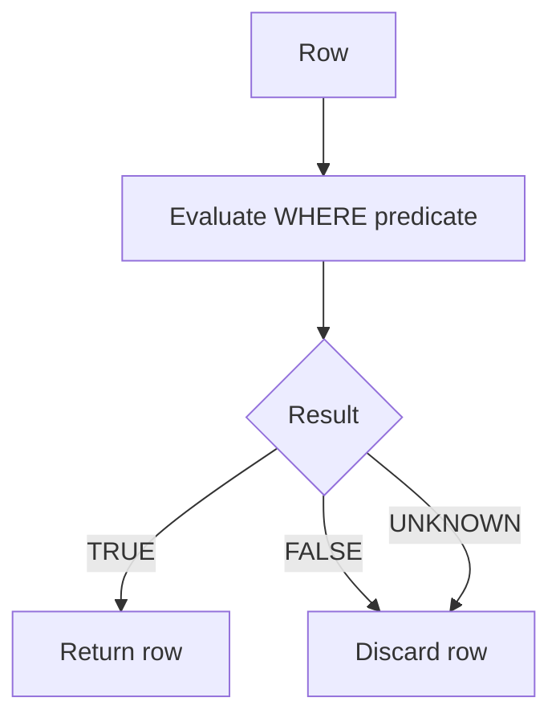

# 03- Three-Valued Logic

## Overview

SQL uses **three-valued logic (3VL)** because a column can contain `NULL`, representing the absence or unknownness of a value. Traditional Boolean logic has two possible results:

```text
TRUE
FALSE
```

SQL predicates can additionally evaluate to:

```text
UNKNOWN
```

This is one of the most important consequences of `NULL`. It affects comparisons, `WHERE` filtering, joins, `CASE` expressions, `CHECK` constraints, `NOT`, `AND`, `OR`, aggregates, and query correctness.

The key rule is:

> `WHERE` returns rows only when its predicate evaluates to `TRUE`. Both `FALSE` and `UNKNOWN` are filtered out.

Understanding this behavior is essential for writing correct production queries.

## Why SQL Needs Three-Valued Logic

Consider a table containing:

```text
id | status
---+--------
1  | active
2  | inactive
3  | NULL
```

Now execute:

```sql
SELECT *
FROM users
WHERE status = 'active';
```

For each row:

| `status` | `status = 'active'` |
|---|---|
| `'active'` | `TRUE` |
| `'inactive'` | `FALSE` |
| `NULL` | `UNKNOWN` |

The third row cannot be classified as equal or not equal to `'active'` because there is no known value to compare.

SQL therefore introduces `UNKNOWN`.

## The Three Possible Results

SQL predicates can produce:

| Result | Meaning |
|---|---|
| `TRUE` | Predicate is known to be true |
| `FALSE` | Predicate is known to be false |
| `UNKNOWN` | Predicate cannot be determined because of `NULL` or another unknown result |

`UNKNOWN` is not the same thing as `FALSE`.

This distinction becomes critical in compound predicates.

## `NULL` Is Not a Value

A common mental model is:

```text
NULL = special value
```

A better model is:

```text
NULL = absence of a known value
```

Therefore:

```sql
NULL = 10
```

does not return `FALSE`.

It returns:

```text
UNKNOWN
```

Likewise:

```sql
NULL = NULL
```

also returns:

```text
UNKNOWN
```

This is why:

```sql
WHERE column = NULL
```

does not find `NULL` rows.

Use:

```sql
WHERE column IS NULL
```

instead.

## Basic Comparison Rules

Assume:

```text
x = NULL
```

Then ordinary comparisons behave as follows:

| Expression | Result |
|---|---|
| `x = NULL` | `UNKNOWN` |
| `x <> NULL` | `UNKNOWN` |
| `x > NULL` | `UNKNOWN` |
| `x < NULL` | `UNKNOWN` |
| `x >= NULL` | `UNKNOWN` |
| `x <= NULL` | `UNKNOWN` |

Even:

```sql
NULL = NULL
```

returns `UNKNOWN`.

This is fundamentally different from ordinary value comparison.

## `IS NULL` and `IS NOT NULL`

SQL provides special predicates for testing nullness:

```sql
SELECT *
FROM users
WHERE status IS NULL;
```

and:

```sql
SELECT *
FROM users
WHERE status IS NOT NULL;
```

These produce deterministic Boolean results.

| Expression | `status = NULL` | `status IS NULL` |
|---|---:|---:|
| `status = 'active'` | `UNKNOWN` if status is `NULL` | — |
| `status = NULL` | `UNKNOWN` | — |
| `status IS NULL` | — | `TRUE` |
| `status IS NOT NULL` | — | `FALSE` |

The distinction is important:

```text
= NULL      → comparison
IS NULL     → nullness test
```

## `WHERE` and `UNKNOWN`

This is the most important operational rule.

Consider:

```sql
SELECT *
FROM users
WHERE status = 'active';
```

If `status` is `NULL`, the predicate becomes:

```text
NULL = 'active'
       ↓
    UNKNOWN
```

`WHERE` retains only:

```text
TRUE
```

Therefore both:

```text
FALSE
UNKNOWN
```

are excluded.

Conceptually:



This explains many apparently surprising SQL results.

## `AND` With Three-Valued Logic

`AND` follows these rules:

| A | B | A `AND` B |
|---|---|---|
| TRUE | TRUE | TRUE |
| TRUE | FALSE | FALSE |
| TRUE | UNKNOWN | UNKNOWN |
| FALSE | TRUE | FALSE |
| FALSE | FALSE | FALSE |
| FALSE | UNKNOWN | FALSE |
| UNKNOWN | TRUE | UNKNOWN |
| UNKNOWN | FALSE | FALSE |
| UNKNOWN | UNKNOWN | UNKNOWN |

The important optimization principle is:

> `FALSE AND anything` is always `FALSE`.

For example:

```sql
WHERE status = 'active'
  AND deleted_at IS NULL
```

If:

```text
status = NULL
```

then:

```text
status = 'active' → UNKNOWN
deleted_at IS NULL → TRUE
```

Therefore:

```text
UNKNOWN AND TRUE → UNKNOWN
```

The row is filtered.

If:

```text
status = NULL
deleted_at IS NOT NULL
```

then:

```text
UNKNOWN AND FALSE → FALSE
```

The row is also filtered.

## `OR` With Three-Valued Logic

`OR` follows these rules:

| A | B | A `OR` B |
|---|---|---|
| TRUE | TRUE | TRUE |
| TRUE | FALSE | TRUE |
| TRUE | UNKNOWN | TRUE |
| FALSE | TRUE | TRUE |
| FALSE | FALSE | FALSE |
| FALSE | UNKNOWN | UNKNOWN |
| UNKNOWN | TRUE | TRUE |
| UNKNOWN | FALSE | UNKNOWN |
| UNKNOWN | UNKNOWN | UNKNOWN |

The key rule is:

> `TRUE OR anything` is always `TRUE`.

For example:

```sql
WHERE status = 'active'
   OR status IS NULL;
```

For a `NULL` status:

```text
status = 'active' → UNKNOWN
status IS NULL    → TRUE

UNKNOWN OR TRUE → TRUE
```

Therefore the row is returned.

## `NOT` With `UNKNOWN`

`NOT` reverses `TRUE` and `FALSE`, but `UNKNOWN` remains `UNKNOWN`.

| A | `NOT A` |
|---|---|
| TRUE | FALSE |
| FALSE | TRUE |
| UNKNOWN | UNKNOWN |

Therefore:

```sql
NOT (NULL = 10)
```

still produces:

```text
UNKNOWN
```

This leads to a common production bug.

## The `NOT` Trap

Suppose:

```sql
SELECT *
FROM users
WHERE status <> 'active';
```

A developer may expect this to return:

```text
inactive
NULL
```

It does not.

For:

```text
status = 'inactive'
```

the predicate is:

```text
'inactive' <> 'active' → TRUE
```

For:

```text
status = NULL
```

it becomes:

```text
NULL <> 'active' → UNKNOWN
```

Since `WHERE` rejects `UNKNOWN`, the `NULL` row is excluded.

If the business rule is:

> Return users whose status is not active, including users whose status is missing.

then write the rule explicitly:

```sql
SELECT *
FROM users
WHERE status <> 'active'
   OR status IS NULL;
```

Do not assume `<>` automatically includes `NULL`.

## De Morgan's Laws

In classical two-valued Boolean logic:

```text
NOT (A AND B) = (NOT A) OR (NOT B)
NOT (A OR B)  = (NOT A) AND (NOT B)
```

These transformations remain valid under SQL's standard three-valued logic.

For example:

```sql
NOT (
    status = 'active'
    AND account_type = 'premium'
)
```

can be transformed into:

```sql
status <> 'active'
OR account_type <> 'premium'
```

However, both expressions can produce `UNKNOWN` when either operand contains `NULL`.

This means that logically equivalent expressions can still produce unexpected business behavior if the developer assumes `UNKNOWN` behaves like `FALSE`.

## `NOT IN` and `NULL`

`NOT IN` is one of the most important 3VL traps.

Consider:

```sql
SELECT *
FROM users
WHERE id NOT IN (1, 2, NULL);
```

Conceptually, for `id = 3`:

```text
3 NOT IN (1, 2, NULL)
```

is equivalent to:

```text
3 <> 1
AND 3 <> 2
AND 3 <> NULL
```

The results are:

```text
TRUE
AND TRUE
AND UNKNOWN
```

which becomes:

```text
UNKNOWN
```

The row is therefore not returned.

### Safer Alternative

When excluding values from another table, `NOT EXISTS` is usually safer:

```sql
SELECT u.*
FROM users AS u
WHERE NOT EXISTS (
    SELECT 1
    FROM blocked_users AS b
    WHERE b.user_id = u.id
);
```

`NOT EXISTS` does not have the same `NULL` contamination behavior as `NOT IN`.

This is both a correctness and an interview-important distinction.

## `IN` and `NULL`

`IN` also interacts with `NULL`.

Consider:

```sql
WHERE status IN ('active', 'pending', NULL)
```

For:

```text
status = 'active'
```

the result is `TRUE`.

For:

```text
status = 'inactive'
```

the predicate becomes effectively:

```text
FALSE OR FALSE OR UNKNOWN
```

which is:

```text
UNKNOWN
```

For:

```text
status = NULL
```

the entire comparison is also `UNKNOWN`.

If `NULL` should be included, write it explicitly:

```sql
WHERE status IN ('active', 'pending')
   OR status IS NULL;
```

## `CASE` Expressions

`CASE` conditions are also affected by 3VL.

Consider:

```sql
SELECT
    CASE
        WHEN status = 'active' THEN 'Active'
        WHEN status = 'inactive' THEN 'Inactive'
        ELSE 'Unknown'
    END AS status_label
FROM users;
```

For:

```text
status = NULL
```

both `WHEN` conditions evaluate to `UNKNOWN`.

Neither condition is true, so the `ELSE` branch is selected.

This is useful when intentionally handling missing data:

```sql
CASE
    WHEN status IS NULL THEN 'Missing'
    WHEN status = 'active' THEN 'Active'
    ELSE 'Other'
END
```

## `CHECK` Constraints

`CHECK` constraints have an important difference from `WHERE`.

For many SQL databases, including PostgreSQL, a `CHECK` constraint is violated only when its condition evaluates to `FALSE`; `UNKNOWN` is allowed.

Consider:

```sql
CREATE TABLE accounts (
    balance NUMERIC,
    CONSTRAINT positive_balance CHECK (balance >= 0)
);
```

This permits:

```text
balance = 100 → TRUE  → allowed
balance = -10 → FALSE → rejected
balance = NULL → UNKNOWN → allowed
```

Therefore:

```sql
CHECK (balance >= 0)
```

does **not** imply:

```text
balance must exist
```

If `balance` must always be present:

```sql
balance NUMERIC NOT NULL
    CHECK (balance >= 0)
```

Now the constraints enforce two different invariants:

```text
NOT NULL        → value must exist
CHECK balance≥0 → value must be non-negative
```

This distinction is frequently tested in interviews.

## `WHERE` vs `CHECK`

The different treatment of `UNKNOWN` is worth memorizing:

| Context | `TRUE` | `FALSE` | `UNKNOWN` |
|---|---|---|---|
| `WHERE` | Keep row | Filter | Filter |
| `HAVING` | Keep group | Filter | Filter |
| `JOIN ... ON` | Match | No match | No match |
| `CHECK` | Accept | Reject | Usually accept |
| `CASE WHEN` | Select branch | Continue | Continue |

This difference explains why a constraint can permit a `NULL` value while a query predicate silently excludes the same row.

## `HAVING`

`HAVING` filters groups using the same predicate behavior as `WHERE`.

For example:

```sql
SELECT department_id, AVG(salary)
FROM employees
GROUP BY department_id
HAVING AVG(salary) > 50000;
```

If `AVG(salary)` is `NULL`, then:

```text
NULL > 50000 → UNKNOWN
```

The group is excluded.

This can happen when all values in the aggregated expression are `NULL`.

## `JOIN` Conditions

Join predicates also use SQL's three-valued logic.

Consider:

```sql
SELECT *
FROM orders AS o
JOIN users AS u
    ON o.user_id = u.id;
```

If:

```text
o.user_id = NULL
```

then:

```text
NULL = u.id → UNKNOWN
```

The row does not match the join condition.

This is why nullable foreign-key relationships require careful reasoning.

For an `INNER JOIN`, rows with no matching condition are removed.

For a `LEFT JOIN`, the left-side row remains, but the right-side columns become `NULL` when no match exists.

## `LEFT JOIN` and `WHERE` Interaction

Consider:

```sql
SELECT u.id, o.id
FROM users AS u
LEFT JOIN orders AS o
    ON o.user_id = u.id
WHERE o.status = 'paid';
```

Although the query uses `LEFT JOIN`, the `WHERE` condition can eliminate users with no order.

For a user without an order:

```text
o.status = NULL
NULL = 'paid' → UNKNOWN
```

The row is filtered.

The query therefore behaves much like an inner join for this condition.

If the requirement is:

> Return every user and only attach paid orders.

put the condition in the join:

```sql
SELECT u.id, o.id
FROM users AS u
LEFT JOIN orders AS o
    ON o.user_id = u.id
   AND o.status = 'paid';
```

This preserves users without paid orders.

This is an important production SQL pattern.

## `NULL` and Aggregates

Most SQL aggregate functions ignore `NULL` values.

For example:

```sql
SELECT AVG(amount)
FROM payments;
```

does not include `NULL` amounts in the average.

Similarly:

```sql
COUNT(amount)
```

counts non-`NULL` values.

But:

```sql
COUNT(*)
```

counts rows regardless of whether `amount` is `NULL`.

Example:

```text
amount
------
100
200
NULL
```

Then:

```sql
COUNT(*)       → 3
COUNT(amount)  → 2
AVG(amount)    → 150
```

This distinction matters when defining metrics.

## `NULL` and Boolean Columns

A nullable Boolean column can have three states:

```text
TRUE
FALSE
NULL
```

For example:

```sql
is_verified BOOLEAN
```

might represent:

```text
TRUE  → verified
FALSE → explicitly not verified
NULL  → verification status unknown/not evaluated
```

Then:

```sql
WHERE is_verified = FALSE
```

does not include `NULL`.

If the domain considers `NULL` equivalent to `FALSE`, that should be explicitly modeled or queried:

```sql
WHERE is_verified = FALSE
   OR is_verified IS NULL;
```

In many systems, a nullable Boolean creates unnecessary ambiguity. If the domain only needs two states, prefer:

```sql
is_verified BOOLEAN NOT NULL
```

with an explicit default when appropriate.

## `COALESCE()` as a Two-State Conversion

`COALESCE()` can intentionally collapse `NULL` into a concrete value:

```sql
SELECT COALESCE(status, 'unknown')
FROM users;
```

Now:

```text
NULL → 'unknown'
```

This can simplify presentation and some business logic.

But be careful:

```sql
WHERE COALESCE(status, 'inactive') = 'inactive'
```

means:

```text
status = 'inactive'
OR status IS NULL
```

This may be correct, but it is a semantic decision, not merely a formatting operation.

It can also affect index usage because the expression transforms the column.

## Null-Safe Equality

Some database systems provide operators for null-safe equality.

PostgreSQL provides:

```sql
a IS NOT DISTINCT FROM b
```

and:

```sql
a IS DISTINCT FROM b
```

For example:

```sql
SELECT *
FROM users
WHERE display_name IS NOT DISTINCT FROM :display_name;
```

This treats:

```text
NULL compared with NULL → equal
```

while ordinary SQL equality does not.

Conceptually:

| A | B | `A = B` | `A IS NOT DISTINCT FROM B` |
|---|---|---|---|
| `1` | `1` | TRUE | TRUE |
| `1` | `2` | FALSE | FALSE |
| `NULL` | `1` | UNKNOWN | FALSE |
| `NULL` | `NULL` | UNKNOWN | TRUE |

This is particularly useful when implementing synchronization, change detection, or nullable-field comparisons.

## Practical Backend Example

Suppose an order service stores:

```sql
CREATE TABLE orders (
    id BIGINT PRIMARY KEY,
    user_id BIGINT,
    shipped_at TIMESTAMPTZ,
    cancelled_at TIMESTAMPTZ,
    status TEXT
);
```

A developer wants orders that are:

> not cancelled and not shipped.

A naive query might be:

```sql
SELECT *
FROM orders
WHERE cancelled_at = NULL
  AND shipped_at = NULL;
```

This is incorrect because both comparisons produce `UNKNOWN`.

Correct:

```sql
SELECT *
FROM orders
WHERE cancelled_at IS NULL
  AND shipped_at IS NULL;
```

Now consider:

> Orders that are not cancelled.

This is also incorrect:

```sql
WHERE cancelled_at <> NULL
```

The correct interpretation depends on the requirement:

```sql
WHERE cancelled_at IS NULL
```

means:

```text
not cancelled
```

if the schema defines `cancelled_at` as the cancellation marker.

The schema semantics matter more than the generic meaning of `NULL`.

## Query Design Around `NULL`

When designing a production query, explicitly ask:

1. Can this column contain `NULL`?
2. What does `NULL` mean in this domain?
3. Should missing values be included?
4. Should missing values be treated as a default?
5. Is `NULL` semantically different from an empty or zero value?
6. Could `IN` or `NOT IN` contain `NULL`?
7. Could a `LEFT JOIN` condition unintentionally move into `WHERE`?
8. Will applying `COALESCE()` or another function affect index usage?

This prevents many subtle correctness bugs.

## Performance Considerations

Three-valued logic itself is not normally a performance problem. The concern is how the predicate is expressed.

Prefer direct predicates when possible:

```sql
WHERE status = 'active'
```

over unnecessarily transforming the column:

```sql
WHERE COALESCE(status, '') = 'active'
```

The latter changes the expression being evaluated and may make an ordinary index less useful.

If a normalized expression is required frequently, consider an appropriate expression index where supported.

For production workloads, verify assumptions with:

```sql
EXPLAIN (ANALYZE, BUFFERS)
SELECT *
FROM users
WHERE status = 'active';
```

Correctness comes first, but predicate shape should also be considered alongside indexing and cardinality.

## Common Mistakes

| Mistake | Why It Fails | Correct Approach |
|---|---|---|
| `column = NULL` | Produces `UNKNOWN` | Use `IS NULL` |
| `column <> NULL` | Produces `UNKNOWN` | Use `IS NOT NULL` when testing nullness |
| Assuming `NULL = NULL` | Ordinary equality returns `UNKNOWN` | Use null-safe equality when supported |
| Assuming `<>` includes `NULL` | `NULL <> value` is `UNKNOWN` | Explicitly handle `NULL` |
| Using `NOT IN` with nullable data | A `NULL` can make the predicate `UNKNOWN` | Prefer `NOT EXISTS` or handle `NULL` explicitly |
| Assuming `NULL` behaves like `FALSE` | `UNKNOWN` is a third state | Reason using 3VL |
| Putting a right-side filter in `WHERE` after `LEFT JOIN` | Can remove unmatched rows | Put relationship filters in `ON` when appropriate |
| Assuming `NOT` turns `UNKNOWN` into `TRUE` | `NOT UNKNOWN` is `UNKNOWN` | Handle `NULL` explicitly |
| Assuming `CHECK` rejects `NULL` | `UNKNOWN` generally satisfies `CHECK` | Add `NOT NULL` when required |
| Using nullable Boolean unnecessarily | Creates three business states | Use `NOT NULL` for genuinely binary state |
| Using `COALESCE()` indiscriminately | Can change semantics and query shape | Use only when collapsing `NULL` is intentional |

## Interview Traps

### Why does `NULL = NULL` not return `TRUE`?

Because `NULL` represents an unknown or absent value. SQL cannot establish that two unknown values are equal through ordinary equality.

```sql
NULL = NULL
```

produces:

```text
UNKNOWN
```

Use:

```sql
IS NULL
```

for nullness or a database-supported null-safe equality operator when comparing nullable values.

### Why doesn't `WHERE column <> 'active'` return `NULL` rows?

For a `NULL` column:

```text
NULL <> 'active'
```

produces:

```text
UNKNOWN
```

`WHERE` keeps only `TRUE`, so the row is excluded.

### What happens to `UNKNOWN AND FALSE`?

```text
UNKNOWN AND FALSE → FALSE
```

### What happens to `UNKNOWN OR TRUE`?

```text
UNKNOWN OR TRUE → TRUE
```

### What happens to `NOT UNKNOWN`?

```text
NOT UNKNOWN → UNKNOWN
```

### Why can a `CHECK` constraint allow `NULL`?

Because a `CHECK` constraint generally rejects only `FALSE`; `UNKNOWN` is accepted.

Therefore:

```sql
CHECK (age >= 18)
```

does not necessarily mean:

```text
age must be present
```

Use:

```sql
age INTEGER NOT NULL
CHECK (age >= 18)
```

when both requirements are needed.

## Production Guidelines

### Model `NULL` Intentionally

Do not use `NULL` merely because a column was convenient to make nullable.

Define what it means:

```text
unknown
not applicable
not yet calculated
not provided
not occurred
```

These meanings can have very different business consequences.

### Prefer Explicit Predicates

Instead of relying on implicit behavior:

```sql
WHERE status <> 'active'
```

ask whether `NULL` should be included.

If yes:

```sql
WHERE status <> 'active'
   OR status IS NULL;
```

If no, the original predicate may be correct.

### Be Careful With `NOT IN`

When nullable values are involved, prefer:

```sql
NOT EXISTS
```

for anti-joins:

```sql
SELECT u.*
FROM users AS u
WHERE NOT EXISTS (
    SELECT 1
    FROM blocked_users AS b
    WHERE b.user_id = u.id
);
```

This avoids the classic `NULL` behavior of `NOT IN`.

### Keep Join Semantics Explicit

For outer joins, distinguish between:

```sql
LEFT JOIN ... ON ...
```

and:

```sql
LEFT JOIN ...
WHERE ...
```

A condition in `WHERE` can eliminate rows that the outer join was intended to preserve.

### Enforce Invariants at the Database Layer

If a value must exist:

```sql
NOT NULL
```

If it must satisfy a rule:

```sql
CHECK (...)
```

Use both when both properties are required.

### Test `NULL` Explicitly

Production tests should include:

```text
normal value
boundary value
NULL
```

For nullable Boolean or state fields, test all valid states:

```text
TRUE
FALSE
NULL
```

This is especially important for repository methods, ORM filters, reporting queries, and authorization logic.

## Key Takeaways

- **SQL uses three-valued logic: predicates can evaluate to `TRUE`, `FALSE`, or `UNKNOWN`; `WHERE` keeps only `TRUE`.**
- **Ordinary comparisons with `NULL` produce `UNKNOWN`; use `IS NULL`, `IS NOT NULL`, or a database-specific null-safe comparison when appropriate.**
- **`NOT IN` is a major `NULL` trap; prefer `NOT EXISTS` for anti-join logic when nullable data can be involved.**
- **`LEFT JOIN` filters placed in `WHERE` can eliminate unmatched rows, while filters placed in `ON` can preserve outer-join semantics.**
- **`NOT NULL` and `CHECK` enforce different invariants: `CHECK` alone generally does not reject `NULL`, so use both when presence and validity are required.**