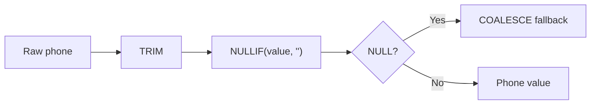

# 11- NULLIF

## Overview

`NULLIF()` is a SQL conditional function that returns `NULL` when two expressions are equal; otherwise, it returns the first expression.

```sql
NULLIF(expression_1, expression_2)
```

Conceptually:

```text
expression_1 = expression_2
        │
        ├── Yes → NULL
        │
        └── No  → expression_1
```

Its most useful production applications are:

- converting sentinel values into `NULL`;
- preventing division-by-zero errors;
- normalizing legacy data;
- combining with `COALESCE()` for controlled fallback behavior;
- simplifying conditional expressions.

`NULLIF()` is especially valuable when an application receives data where a value such as `0`, `''`, or a placeholder string means "no meaningful value."

## Basic Syntax

```sql
NULLIF(expression_1, expression_2)
```

Examples:

```sql
SELECT NULLIF(10, 10);
```

Result:

```text
NULL
```

```sql
SELECT NULLIF(10, 20);
```

Result:

```text
10
```

The function effectively behaves like:

```sql
CASE
    WHEN expression_1 = expression_2 THEN NULL
    ELSE expression_1
END
```

This equivalence is useful for understanding its semantics, although the exact optimizer treatment can be database-specific.

## Why NULLIF Exists

Many systems use special values to represent the absence of meaningful data.

Examples include:

| Stored value | Possible meaning |
|---|---|
| `0` | No quantity |
| `''` | No text supplied |
| `'N/A'` | Unknown |
| `-1` | Not applicable |
| `0` denominator | No measurable base |

These values are not necessarily equivalent to SQL `NULL`.

For example:

```text
NULL → value is unknown or absent
0    → value is explicitly zero
```

However, legacy systems sometimes use `0` to represent "not available."

`NULLIF()` provides a controlled conversion:

```sql
NULLIF(quantity, 0)
```

which means:

```text
quantity = 0 → NULL
quantity ≠ 0 → quantity
```

## NULLIF vs CASE

The following expressions have the same logical intent:

```sql
NULLIF(status, 'unknown')
```

and:

```sql
CASE
    WHEN status = 'unknown' THEN NULL
    ELSE status
END
```

`NULLIF()` is preferable when the transformation is simply:

> Return NULL if these two values are equal.

Use `CASE` when the conditional logic has multiple branches.

```sql
CASE
    WHEN status = 'pending' THEN 1
    WHEN status = 'active' THEN 2
    WHEN status = 'disabled' THEN 3
    ELSE 0
END
```

Trying to encode complex branching through nested `NULLIF()` calls usually reduces readability.

## NULLIF and Division by Zero

One of the most useful patterns is protecting division from a zero denominator.

Consider:

```sql
SELECT
    revenue / orders
FROM daily_metrics;
```

If `orders = 0`, the expression can produce a division-by-zero error in database systems that reject zero denominators.

Use:

```sql
SELECT
    revenue / NULLIF(orders, 0) AS average_order_value
FROM daily_metrics;
```

The transformation is:

```text
orders = 0
    ↓
NULLIF(orders, 0)
    ↓
NULL
    ↓
revenue / NULL
    ↓
NULL
```

This avoids the division-by-zero exception.

### Production Example

Suppose a metrics table contains:

```text
date        revenue    completed_orders
----------  ---------  ----------------
2026-08-01  10000.00   100
2026-08-02  0.00       0
```

A safe average calculation is:

```sql
SELECT
    metric_date,
    revenue / NULLIF(completed_orders, 0) AS average_order_value
FROM daily_metrics;
```

The second row produces `NULL` rather than an invalid numeric result.

That distinction can be meaningful:

```text
NULL → average cannot be calculated
0    → calculated average is actually zero
```

Do not automatically convert the result to zero unless that matches the domain semantics.

## NULLIF Combined With COALESCE

A common pattern is:

```sql
COALESCE(
    revenue / NULLIF(completed_orders, 0),
    0
)
```

This performs two transformations:

```text
completed_orders = 0
        ↓
NULLIF(..., 0)
        ↓
NULL denominator
        ↓
division returns NULL
        ↓
COALESCE(..., 0)
        ↓
0
```

Example:

```sql
SELECT
    COALESCE(
        revenue / NULLIF(completed_orders, 0),
        0
    ) AS average_order_value
FROM daily_metrics;
```

This should only be used when the API or business contract explicitly defines an unavailable ratio as zero.

Otherwise, preserve the `NULL`:

```sql
revenue / NULLIF(completed_orders, 0)
```

## NULLIF With Zero

The pattern:

```sql
NULLIF(value, 0)
```

is useful when zero represents a sentinel value.

Example:

```sql
SELECT
    NULLIF(stock_quantity, 0) AS available_stock
FROM products;
```

But be careful with the business meaning.

If:

```text
stock_quantity = 0
```

means:

> The product genuinely has zero stock.

then converting it to `NULL` may destroy useful information.

Use `NULLIF()` for normalization only when the two values genuinely represent the same business state.

## NULLIF With Empty Strings

Legacy systems frequently store missing text as an empty string:

```text
''
```

You can normalize it to SQL `NULL`:

```sql
SELECT
    NULLIF(email, '') AS email
FROM users;
```

The result is:

```text
email = ''      → NULL
email = 'a@x.io' → 'a@x.io'
```

This can be combined with `COALESCE()`:

```sql
SELECT
    COALESCE(
        NULLIF(TRIM(email), ''),
        'unknown@example.com'
    ) AS email
FROM users;
```

The transformation is:

```text
"   "
 ↓
TRIM()
 ↓
""
 ↓
NULLIF()
 ↓
NULL
 ↓
COALESCE()
 ↓
fallback
```

This is useful when cleaning inconsistent input from older systems.

## NULLIF With Sentinel Values

A legacy database might use:

```text
-1 = unknown customer
0  = not supplied
9999-12-31 = no expiration
'N/A' = unavailable
```

A query can normalize these values:

```sql
SELECT
    NULLIF(customer_id, -1) AS customer_id
FROM legacy_orders;
```

Or:

```sql
SELECT
    NULLIF(status, 'N/A') AS status
FROM legacy_records;
```

For multiple sentinel values, `CASE` is usually clearer:

```sql
SELECT
    CASE
        WHEN status IN ('N/A', 'UNKNOWN', 'NOT_PROVIDED') THEN NULL
        ELSE status
    END AS normalized_status
FROM legacy_records;
```

`NULLIF()` is best when there is one specific sentinel-to-NULL mapping.

## NULLIF and Aggregates

`NULLIF()` can influence what aggregate functions include.

For example:

```sql
SELECT
    AVG(NULLIF(score, 0)) AS average_score
FROM survey_results;
```

This treats `0` as missing and therefore excludes it from `AVG()`.

That is materially different from:

```sql
SELECT
    AVG(score) AS average_score
FROM survey_results;
```

and:

```sql
SELECT
    AVG(COALESCE(score, 0)) AS average_score
FROM survey_results;
```

The difference matters because most aggregate functions ignore `NULL` input values.

Consider:

```text
scores = 10, 20, 0
```

If `0` is a sentinel for "not answered":

```sql
AVG(NULLIF(score, 0))
```

calculates:

```text
(10 + 20) / 2 = 15
```

Whereas:

```sql
AVG(score)
```

calculates:

```text
(10 + 20 + 0) / 3 = 10
```

The SQL is technically valid in both cases, but only one may represent the business requirement.

## NULLIF With COUNT

`COUNT(column)` ignores `NULL`.

Therefore:

```sql
COUNT(NULLIF(status, 'cancelled'))
```

can count rows whose status is not `'cancelled'`.

Example:

```sql
SELECT
    COUNT(NULLIF(status, 'cancelled')) AS non_cancelled_count
FROM orders;
```

This works because:

```text
status = 'cancelled'
    ↓
NULL
    ↓
COUNT(column) ignores it
```

while other statuses remain countable.

For clarity, an explicit conditional aggregate may be preferable in many production queries:

```sql
SELECT
    COUNT(*) FILTER (WHERE status <> 'cancelled') AS non_cancelled_count
FROM orders;
```

when the database supports `FILTER`.

For portable SQL, use an appropriate `CASE` expression where necessary.

## NULLIF With Ratios and Percentages

Ratios are a frequent source of production errors.

Suppose an API reports conversion rate:

```sql
SELECT
    successful_signups / total_visitors AS conversion_rate
FROM daily_metrics;
```

Protect the denominator:

```sql
SELECT
    successful_signups / NULLIF(total_visitors, 0) AS conversion_rate
FROM daily_metrics;
```

For a percentage:

```sql
SELECT
    100.0 * successful_signups
    / NULLIF(total_visitors, 0) AS conversion_percentage
FROM daily_metrics;
```

The `100.0` is intentional in systems where integer arithmetic could otherwise produce an integer result.

For PostgreSQL, explicit numeric handling may be written as:

```sql
SELECT
    100.0 * successful_signups
    / NULLIF(total_visitors, 0) AS conversion_percentage
FROM daily_metrics;
```

The exact numeric behavior depends on the database's data types and operator rules.

## NULLIF With Numeric Types

The two arguments should be type-compatible.

For example:

```sql
NULLIF(amount, 0)
```

is generally straightforward when `amount` is numeric.

For decimal calculations, ensure that the expression's resulting type preserves the required precision:

```sql
SELECT
    revenue / NULLIF(
        CAST(order_count AS DECIMAL(18, 4)),
        0
    ) AS average_revenue
FROM daily_metrics;
```

Explicit casts are useful when numeric precision is part of the application contract.

## NULLIF and NULL Input

`NULLIF()` itself can return `NULL` when its first expression is already `NULL`.

For example:

```sql
SELECT NULLIF(NULL, 0);
```

returns:

```text
NULL
```

Conceptually:

```text
NULLIF(NULL, 0)
    ↓
NULL
```

There is no meaningful non-NULL first expression to return.

Similarly:

```sql
SELECT NULLIF(NULL, NULL);
```

returns `NULL`.

This follows naturally from SQL's NULL semantics and three-valued logic.

## NULLIF and Three-Valued Logic

`NULLIF(a, b)` can be understood as:

```sql
CASE
    WHEN a = b THEN NULL
    ELSE a
END
```

But SQL comparison involving `NULL` does not produce ordinary `TRUE` or `FALSE`.

For example:

```sql
NULL = NULL
```

evaluates to `UNKNOWN`, not `TRUE`.

Therefore, `NULLIF(NULL, NULL)` does not behave like a conventional programming-language equality check that says both values are equal.

This is an important interview and production detail:

> `NULLIF()` follows SQL's NULL semantics; it is not a general-purpose equality function.

## Evaluation and Side Effects

Do not rely on `NULLIF()` as a guaranteed mechanism for controlling evaluation of arbitrary expressions.

For example, expressions involving:

- volatile functions;
- errors;
- expensive computations;
- database-specific functions;

can have engine-specific evaluation behavior.

The safe production assumption is:

> Use `NULLIF()` for its value transformation semantics, not as a general-purpose execution-control primitive.

For example, this is a good use:

```sql
revenue / NULLIF(order_count, 0)
```

Do not use complicated nested expressions inside `NULLIF()` merely to try to control whether another expression executes.

## NULLIF and Indexes

Using `NULLIF()` in a `SELECT` expression generally does not prevent an index from being used to locate rows because the function is not necessarily part of the filtering predicate.

For example:

```sql
SELECT
    id,
    NULLIF(status, 'unknown') AS normalized_status
FROM users
WHERE customer_id = 1001;
```

An index on:

```text
customer_id
```

can still be relevant to the `WHERE` predicate.

However, putting expressions around indexed columns in filtering conditions can change the optimizer's available access paths:

```sql
WHERE NULLIF(status, 'unknown') = 'active'
```

For large tables, prefer a predicate that directly expresses the required condition when possible and inspect the execution plan.

Do not make assumptions about index usage solely from the presence of `NULLIF()`.

## NULLIF and Data Normalization

`NULLIF()` is useful for normalizing data at query boundaries, but normalization should usually happen as early as practical.

For example:

```text
External API
     ↓
Application validation
     ↓
Canonical domain representation
     ↓
Database
```

If a service repeatedly needs:

```sql
NULLIF(TRIM(email), '')
```

the system may have an upstream data-quality problem.

Repeated query-time normalization can:

- increase query complexity;
- make indexes harder to reason about;
- create inconsistent interpretations;
- spread data-cleaning rules across services.

Prefer enforcing canonical representations at write time when the business rule is stable.

## Production Example: Legacy Import

Suppose a legacy import table contains:

```text
customer_id | phone       | amount
------------|-------------|-------
1001        |             | 500
1002        | N/A         | 0
1003        | +91123...   | 750
```

A normalization query could be:

```sql
SELECT
    customer_id,
    NULLIF(NULLIF(TRIM(phone), ''), 'N/A') AS phone,
    amount
FROM legacy_imports;
```

The transformation is:

```text
"   " → "" → NULL
"N/A" → NULL
"+91123..." → "+91123..."
```

For a permanent data migration, it is generally better to normalize the stored data rather than forcing every future query to repeat the expression.

## Combining NULLIF, COALESCE, and CASE

These functions solve different problems:

| Function | Primary purpose |
|---|---|
| `NULLIF(a, b)` | Convert `a` to `NULL` when it equals `b` |
| `COALESCE(a, b, ...)` | Return the first non-NULL expression |
| `CASE` | Implement general conditional logic |

They can be composed:

```sql
COALESCE(
    NULLIF(TRIM(phone), ''),
    'Not provided'
)
```

The flow is:



This is a useful pattern for converting a legacy representation into an API-friendly value.

## Backend Application Example

Consider a FastAPI endpoint returning product metrics.

The database query:

```sql
SELECT
    product_id,
    revenue,
    units_sold,
    revenue / NULLIF(units_sold, 0) AS revenue_per_unit
FROM product_metrics
WHERE product_id = :product_id;
```

The API layer should preserve the semantic distinction:

```text
revenue_per_unit = NULL
```

means:

> The metric could not be calculated because there were no units.

It should not blindly convert that value to:

```text
0
```

unless the API contract explicitly defines zero as the representation.

This distinction prevents consumers from interpreting:

```text
"no denominator"
```

as:

```text
"zero revenue per unit"
```

Those are different states.

## Django Considerations

Django provides database-aware expression functions, including `NullIf`:

```python
from django.db.models import F
from django.db.models.functions import NullIf

queryset = ProductMetric.objects.annotate(
    safe_units=NullIf(F("units_sold"), 0),
)
```

A calculated expression can then use the normalized denominator.

For example, the ORM can express the same conceptual pattern without embedding SQL Server-specific syntax.

When using Django with PostgreSQL in production, prefer Django's database-agnostic expressions when they satisfy the requirement. This keeps the application less coupled to one SQL dialect.

## SQLAlchemy / FastAPI Considerations

With SQLAlchemy, SQL expressions can represent the same operation:

```python
from sqlalchemy import func, select

stmt = select(
    ProductMetric.product_id,
    (
        ProductMetric.revenue
        / func.nullif(ProductMetric.units_sold, 0)
    ).label("revenue_per_unit"),
)
```

The application still needs to define what a `NULL` result means at the API boundary.

The database should calculate the metric correctly; the API should preserve or intentionally transform its semantics.

## Performance Considerations

`NULLIF()` is generally inexpensive when used in projections and arithmetic expressions.

The larger performance concern is **where the expression is used**.

Good:

```sql
SELECT
    revenue / NULLIF(order_count, 0)
FROM daily_metrics
WHERE metric_date >= CURRENT_DATE - INTERVAL '30 days';
```

Potentially more problematic:

```sql
SELECT *
FROM orders
WHERE NULLIF(status, 'unknown') = 'active';
```

The second query applies an expression to a filtered column.

For high-volume workloads:

1. Keep filtering predicates simple where possible.
2. Avoid unnecessary functions around indexed columns.
3. Check actual execution plans.
4. Consider expression indexes or generated/computed columns only when justified by workload.
5. Measure before optimizing.

The presence of `NULLIF()` alone is not evidence of a performance problem.

## Common Mistakes and Pitfalls

| Mistake | Problem | Better approach |
|---|---|---|
| Using `NULLIF(value, 0)` without checking semantics | Genuine zero becomes NULL | Confirm zero is actually a sentinel |
| Returning zero after division by zero | "Cannot calculate" becomes "zero" | Preserve NULL unless zero is the domain value |
| Treating `NULLIF()` as equality testing | SQL uses three-valued logic | Understand NULL comparison semantics |
| Using nested `NULLIF()` for complex rules | Query becomes difficult to understand | Use `CASE` |
| Cleaning legacy data only at query time | Normalization logic spreads everywhere | Normalize at write/migration boundaries |
| Ignoring numeric types | Ratio may have incorrect precision | Use appropriate numeric types and explicit casts |
| Wrapping indexed predicates unnecessarily | May reduce useful access paths | Keep predicates index-friendly |
| Assuming all databases evaluate expressions identically | SQL engines differ in implementation details | Depend only on documented semantics |
| Converting every NULL result to zero | Loses business meaning | Define NULL vs zero explicitly |
| Using `NULLIF()` to hide data-quality problems | Invalid source data remains | Fix canonical representation upstream |

## Production Best Practices

### Use NULLIF for explicit semantic transformations

Good:

```sql
NULLIF(quantity, 0)
```

when `0` is explicitly defined as "unknown" or "not provided."

Avoid:

```sql
NULLIF(quantity, 0)
```

merely because zero is inconvenient for a calculation.

### Protect denominators

For ratios:

```sql
numerator / NULLIF(denominator, 0)
```

is a concise and reliable pattern.

### Preserve NULL when it carries meaning

Prefer:

```sql
revenue / NULLIF(order_count, 0)
```

over:

```sql
COALESCE(
    revenue / NULLIF(order_count, 0),
    0
)
```

unless the business contract explicitly requires zero.

### Normalize legacy data deliberately

For imported or legacy values:

```sql
NULLIF(TRIM(value), '')
```

can be appropriate during migration or controlled query boundaries.

For permanent canonicalization, prefer cleaning the stored data.

### Keep calculations type-safe

Review:

- integer vs decimal division;
- precision;
- scale;
- implicit casts;
- overflow;
- database-specific numeric behavior.

### Test edge cases

At minimum, test:

| Input | Expected behavior |
|---|---|
| Normal value | Original value |
| Equal comparison value | `NULL` |
| `NULL` | `NULL` |
| Zero denominator | Safe `NULL` result |
| Empty string | Depends on explicit normalization rule |
| Negative values | Preserve unless domain says otherwise |

## Interview Traps

### What does `NULLIF(5, 5)` return?

```sql
NULL
```

because the two expressions are equal.

### What does `NULLIF(5, 10)` return?

```text
5
```

because the expressions are different.

### Why is this useful?

A common production use is:

```sql
numerator / NULLIF(denominator, 0)
```

which converts a zero denominator into `NULL` and prevents division-by-zero errors.

### Is `NULLIF(a, b)` equivalent to `CASE`?

Conceptually:

```sql
CASE
    WHEN a = b THEN NULL
    ELSE a
END
```

Yes, for the core logical behavior.

### What is the difference between `NULLIF()` and `COALESCE()`?

`NULLIF()` can create a `NULL`:

```sql
NULLIF(value, sentinel)
```

`COALESCE()` consumes NULLs by selecting the first non-NULL expression:

```sql
COALESCE(value, fallback)
```

A common combination is:

```sql
COALESCE(NULLIF(value, ''), 'fallback')
```

### Why not simply use `CASE` everywhere?

You can, but `NULLIF()` communicates a very specific intent more concisely:

> Convert this exact value to NULL.

When the logic becomes more complex, `CASE` is usually clearer.

## Key Takeaways

- **`NULLIF(a, b)` returns `NULL` when `a` equals `b`; otherwise it returns `a`.**
- **The canonical production pattern `numerator / NULLIF(denominator, 0)` prevents division-by-zero errors while preserving the fact that the ratio cannot be calculated.**
- **Use `NULLIF()` to normalize explicit sentinel values such as empty strings or legacy placeholders, not to arbitrarily convert meaningful values into NULL.**
- **`NULLIF()` and `COALESCE()` complement each other: `NULLIF()` turns selected values into NULL, while `COALESCE()` replaces NULL with a fallback.**
- **Treat NULL, zero, empty string, and other sentinel values as distinct domain states unless the business model explicitly defines them as equivalent.**