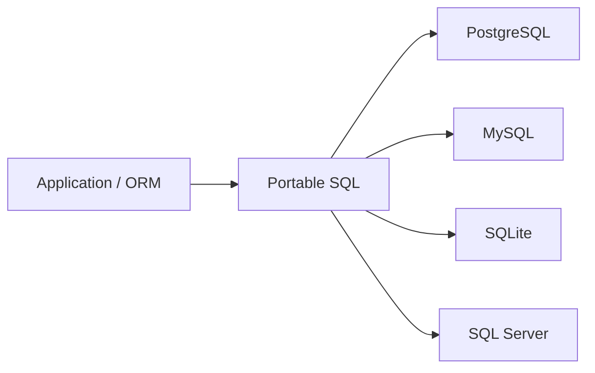

# 12- IFNULL and Database-Specific Functions

## Overview

`IFNULL()` is a NULL-handling function primarily associated with MySQL and SQLite. It returns the first expression when it is not `NULL`; otherwise, it returns the second expression.

```sql
IFNULL(expression, replacement)
```

Example:

```sql
SELECT IFNULL(phone_number, 'Not provided') AS phone_number
FROM users;
```

Conceptually:

```text
value
  │
  ├── NOT NULL ──→ value
  │
  └── NULL ──────→ replacement
```

The important engineering issue is not the function itself but **database portability**. SQL provides standard NULL-handling constructs such as `COALESCE()`, while functions such as `IFNULL()`, SQL Server's `ISNULL()`, and Oracle's `NVL()` are database-specific.

For systems expected to remain portable across PostgreSQL, MySQL, SQLite, SQL Server, or Oracle, prefer standard SQL constructs where they provide equivalent behavior.

## IFNULL Syntax

```sql
IFNULL(expression, replacement)
```

The function evaluates the first expression:

- If it is non-NULL, return it.
- If it is NULL, return the replacement.

Example:

```sql
SELECT
    IFNULL(discount, 0) AS discount
FROM products;
```

Given:

| `discount` | Result |
|---:|---:|
| `10` | `10` |
| `0` | `0` |
| `NULL` | `0` |

`IFNULL()` does **not** treat zero, an empty string, or a blank space as NULL.

```text
NULL       → replacement
0          → original value
''         → original value
'   '      → original value
```

This distinction is important when normalizing application data.

## IFNULL vs COALESCE

For two arguments, these expressions usually express the same intent:

```sql
IFNULL(email, 'unknown')
```

and:

```sql
COALESCE(email, 'unknown')
```

`COALESCE()` is part of standard SQL and supports multiple expressions:

```sql
COALESCE(primary_email, secondary_email, backup_email, 'unknown')
```

`IFNULL()` accepts exactly two arguments.

| Characteristic | `IFNULL()` | `COALESCE()` |
|---|---|---|
| Standard SQL | No | Yes |
| Typical databases | MySQL, SQLite | PostgreSQL, MySQL, SQL Server, Oracle, SQLite |
| Arguments | 2 | 2 or more |
| NULL fallback | Yes | Yes |
| Portability | Lower | Higher |
| Multiple fallbacks | No | Yes |
| Best default for portable SQL | Usually no | Usually yes |

For new application code, `COALESCE()` is generally the better default when portability matters.

## Database-Specific NULL Functions

Different database engines provide equivalent or similar NULL-handling functions.

| Database | Function | Example |
|---|---|---|
| PostgreSQL | `COALESCE()` | `COALESCE(value, 0)` |
| MySQL | `IFNULL()` / `COALESCE()` | `IFNULL(value, 0)` |
| SQLite | `IFNULL()` / `COALESCE()` | `IFNULL(value, 0)` |
| SQL Server | `ISNULL()` / `COALESCE()` | `ISNULL(value, 0)` |
| Oracle | `NVL()` / `COALESCE()` | `NVL(value, 0)` |

The functions are similar but **not necessarily interchangeable in all type-resolution and evaluation details**.

A senior engineer should distinguish:

> Same business intent does not necessarily mean identical database semantics.

## Why Database-Specific Functions Exist

Database vendors implement additional functions for:

- compatibility with existing applications;
- convenience;
- historical reasons;
- engine-specific behavior;
- integration with the database's type system.

For example, SQL Server's `ISNULL()` predates some common usage patterns involving `COALESCE()`, while Oracle historically provided `NVL()`.

These functions can be perfectly valid when an application is intentionally coupled to a specific database.

The engineering trade-off is between:

```text
database-specific optimization/convenience
              vs
database portability
```

## MySQL and SQLite: IFNULL

In MySQL:

```sql
SELECT IFNULL(last_login, created_at) AS effective_timestamp
FROM users;
```

In SQLite:

```sql
SELECT IFNULL(last_login, created_at) AS effective_timestamp
FROM users;
```

The same SQL can therefore work across these engines.

For portable SQL across a broader range of databases, prefer:

```sql
SELECT
    COALESCE(last_login, created_at) AS effective_timestamp
FROM users;
```

## SQL Server: ISNULL

SQL Server provides:

```sql
ISNULL(expression, replacement)
```

Example:

```sql
SELECT
    ISNULL(display_name, username) AS effective_name
FROM users;
```

It looks similar to:

```sql
COALESCE(display_name, username)
```

but there are important differences, particularly around **data type resolution**.

### Data Type Differences

`ISNULL()` uses the data type of its first argument for its result type, subject to SQL Server's conversion rules.

`COALESCE()` follows SQL Server's type-precedence rules when determining the resulting type.

This can affect:

- implicit conversions;
- truncation;
- string lengths;
- numeric precision;
- query behavior after schema changes.

For production SQL Server code, do not replace `ISNULL()` with `COALESCE()` mechanically without checking the resulting data type.

## Oracle: NVL

Oracle provides:

```sql
NVL(expression, replacement)
```

Example:

```sql
SELECT
    NVL(discount, 0) AS discount
FROM products;
```

The standard alternative is:

```sql
SELECT
    COALESCE(discount, 0) AS discount
FROM products;
```

Again, Oracle's type-conversion and evaluation semantics should be considered before treating the expressions as completely interchangeable.

## PostgreSQL

PostgreSQL does not use `IFNULL()` or `ISNULL()` as its normal NULL-replacement function.

Use:

```sql
COALESCE(value, replacement)
```

Example:

```sql
SELECT
    COALESCE(phone_number, 'Not provided') AS phone_number
FROM users;
```

For PostgreSQL-backed Django and FastAPI applications, `COALESCE()` is therefore the natural SQL expression for portable NULL fallback behavior.

## IFNULL vs NULLIF

These functions perform opposite-looking transformations and are easy to confuse.

### IFNULL

`IFNULL()` converts NULL into another value:

```sql
IFNULL(value, replacement)
```

```text
NULL → replacement
value → value
```

### NULLIF

`NULLIF()` converts a matching value into NULL:

```sql
NULLIF(value, sentinel)
```

```text
value = sentinel → NULL
value ≠ sentinel  → value
```

Example:

```sql
IFNULL(phone, 'Not provided')
```

means:

> If the phone is NULL, provide a fallback.

Whereas:

```sql
NULLIF(phone, '')
```

means:

> If the phone is an empty string, treat it as NULL.

They are frequently composed:

```sql
COALESCE(NULLIF(TRIM(phone), ''), 'Not provided')
```

This normalizes whitespace-only values and then provides a fallback.

## Common Production Patterns

### Display fallback

```sql
SELECT
    IFNULL(display_name, username) AS name
FROM users;
```

Use this when the fallback is purely presentation logic.

For portable SQL:

```sql
SELECT
    COALESCE(display_name, username) AS name
FROM users;
```

### Numeric fallback

```sql
SELECT
    IFNULL(discount_amount, 0) AS discount_amount
FROM orders;
```

Use this only when `NULL` semantically means "no discount."

Do not use it if `NULL` means "discount information is unknown."

### Fallback timestamps

```sql
SELECT
    IFNULL(updated_at, created_at) AS effective_timestamp
FROM orders;
```

This is useful when an application defines:

```text
updated_at = NULL
```

as "never updated."

### Safe division

`IFNULL()` should not be confused with `NULLIF()` for division safety.

This:

```sql
revenue / IFNULL(order_count, 0)
```

does **not** protect against division by zero. It can actually turn a NULL denominator into zero.

Use:

```sql
revenue / NULLIF(order_count, 0)
```

The distinction is critical:

```text
IFNULL(order_count, 0)
       ↓
NULL becomes 0
       ↓
possible division-by-zero
```

versus:

```text
NULLIF(order_count, 0)
       ↓
0 becomes NULL
       ↓
division produces NULL
```

## Combining IFNULL With NULLIF

In MySQL, a common normalization pattern is:

```sql
IFNULL(
    NULLIF(TRIM(phone_number), ''),
    'Not provided'
)
```

The processing pipeline is:

```text
raw phone
   ↓
TRIM()
   ↓
empty string?
   ↓
NULLIF()
   ↓
NULL?
   ↓
IFNULL()
   ↓
fallback
```

For portable SQL, use:

```sql
COALESCE(
    NULLIF(TRIM(phone_number), ''),
    'Not provided'
)
```

This is generally preferable when the query may eventually run against another database.

## IFNULL and Aggregates

NULL-replacement functions can materially change aggregate results.

Suppose:

```text
amount
------
100
200
NULL
```

Then:

```sql
SELECT AVG(amount)
FROM payments;
```

calculates the average of the non-NULL values:

```text
150
```

But:

```sql
SELECT AVG(IFNULL(amount, 0))
FROM payments;
```

includes the NULL row as zero:

```text
100 + 200 + 0
---------------- = 100
       3
```

These queries answer different business questions.

Use a NULL fallback inside an aggregate only when the replacement value is semantically correct.

## IFNULL and COUNT

Consider:

```sql
SELECT COUNT(amount)
FROM payments;
```

`COUNT(amount)` ignores NULL values.

Replacing NULL with zero changes that behavior:

```sql
SELECT COUNT(IFNULL(amount, 0))
FROM payments;
```

Now the expression is non-NULL for every row, so the count can include rows where `amount` was originally NULL.

This is an important distinction:

```text
COUNT(column)
    ↓
counts non-NULL values

COUNT(IFNULL(column, 0))
    ↓
counts rows whose transformed expression is non-NULL
```

Do not add `IFNULL()` to aggregate expressions without considering how it changes cardinality.

## IFNULL and JOINs

NULL handling frequently appears after an outer join.

Example:

```sql
SELECT
    u.id,
    u.username,
    IFNULL(p.amount, 0) AS total_payment
FROM users AS u
LEFT JOIN payments AS p
    ON p.user_id = u.id;
```

If no matching payment row exists:

```text
p.amount = NULL
```

and:

```text
IFNULL(p.amount, 0) = 0
```

This is useful for reports where "no matching row" should be displayed as zero.

However, if there are multiple payment rows per user, the join can produce multiple rows. `IFNULL()` does not solve aggregation or cardinality problems.

For totals, aggregate first:

```sql
SELECT
    u.id,
    u.username,
    COALESCE(SUM(p.amount), 0) AS total_payment
FROM users AS u
LEFT JOIN payments AS p
    ON p.user_id = u.id
GROUP BY
    u.id,
    u.username;
```

The important point is that:

> NULL handling does not replace correct relational modeling or aggregation.

## Query Performance

NULL replacement functions are generally inexpensive when used in projections:

```sql
SELECT
    COALESCE(status, 'unknown')
FROM orders;
```

The more important performance concern is applying functions to columns used for filtering or joining.

For example:

```sql
WHERE COALESCE(status, 'unknown') = 'active'
```

may make it harder for the optimizer to use a normal index on `status`, depending on the database and query plan.

Prefer predicates that directly express the intended condition where possible:

```sql
WHERE status = 'active'
```

If NULL has to be included explicitly:

```sql
WHERE status = 'active'
   OR status IS NULL
```

The exact optimal form is database- and workload-dependent, so verify with the execution plan.

### Production Rule

Do not assume:

> "Functions are cheap, therefore putting them everywhere is harmless."

Instead:

1. Keep indexed predicates simple where possible.
2. Inspect `EXPLAIN` plans for important queries.
3. Consider functional/expression indexes when justified.
4. Benchmark with production-scale data.
5. Avoid adding database-specific functions without a measurable reason.

## Portability Strategy

A backend service can become unintentionally coupled to one database through SQL-specific functions.

For example:

```sql
SELECT IFNULL(email, 'unknown')
FROM users;
```

is natural for MySQL, but moving the query directly to PostgreSQL requires changing the function.

A more portable expression is:

```sql
SELECT COALESCE(email, 'unknown')
FROM users;
```

A practical portability strategy is:



This does not mean database-specific SQL is always bad.

Use database-specific features when they provide meaningful value and the database dependency is intentional.

## When Database-Specific Functions Are Appropriate

Database-specific functions can be appropriate when:

- the application is permanently tied to one database;
- the function provides important database-specific behavior;
- performance has been measured;
- the query is isolated behind a repository or data-access layer;
- migration to another database is not a requirement.

For example, a PostgreSQL-specific system may intentionally use PostgreSQL-specific SQL features throughout its data layer.

The mistake is not using vendor-specific SQL.

The mistake is **creating accidental coupling without realizing it**.

## Django Considerations

Django applications frequently use ORM expressions instead of writing vendor-specific SQL directly.

For example:

```python
from django.db.models.functions import Coalesce
from django.db.models import Value

queryset = User.objects.annotate(
    effective_name=Coalesce(
        "display_name",
        "username",
        Value("Unknown"),
    )
)
```

This expresses the standard SQL concept:

```sql
COALESCE(display_name, username, 'Unknown')
```

For database portability, prefer ORM abstractions or standard SQL where they adequately represent the requirement.

When a database-specific function is genuinely required, isolate that dependency and document the supported database.

## SQLAlchemy Considerations

SQLAlchemy can express standard NULL handling through `func.coalesce()`:

```python
from sqlalchemy import func, select

stmt = select(
    User.id,
    func.coalesce(User.display_name, User.username).label("name"),
)
```

For a database-specific function:

```python
func.ifnull(User.display_name, User.username)
```

may generate:

```sql
IFNULL(display_name, username)
```

That is appropriate only when the application intentionally targets a database supporting that function.

## API Contract Considerations

Database NULL handling should not automatically dictate API semantics.

For example, the database might contain:

```text
phone_number = NULL
```

The API could intentionally expose:

```json
{
  "phone_number": null
}
```

or:

```json
{
  "phone_number": ""
}
```

or potentially omit the field.

These are different API contracts.

Similarly:

```sql
COALESCE(balance, 0)
```

should not be added merely because the frontend prefers a number.

First determine whether:

```text
NULL balance
```

means:

- zero balance;
- unknown balance;
- unavailable balance;
- balance not yet calculated.

The SQL transformation should follow the domain model, not compensate for an unclear API contract.

## Type and Conversion Pitfalls

Database-specific functions can differ in how they resolve result types.

This is especially important for:

- SQL Server `ISNULL()`;
- Oracle `NVL()`;
- numeric expressions;
- strings with different lengths;
- timestamps;
- implicit casts.

Avoid relying on implicit conversions when the type matters.

Prefer explicit casting when necessary:

```sql
SELECT
    COALESCE(
        CAST(discount_amount AS DECIMAL(12, 2)),
        CAST(0 AS DECIMAL(12, 2))
    ) AS discount_amount
FROM orders;
```

The exact syntax and type behavior remain database-specific.

## Common Mistakes

| Mistake | Why it is a problem | Better approach |
|---|---|---|
| Using `IFNULL()` in portable SQL | Couples query to supported dialects | Prefer `COALESCE()` |
| Confusing `IFNULL()` with `NULLIF()` | They perform opposite transformations | Know which value should become NULL |
| Using `IFNULL(denominator, 0)` for division | Can create division by zero | Use `NULLIF(denominator, 0)` |
| Converting NULL to zero automatically | Can destroy business semantics | Define NULL vs zero explicitly |
| Applying fallback before `AVG()` | Changes aggregate semantics | Decide whether NULL should be excluded |
| Wrapping indexed columns unnecessarily | May affect index access | Keep predicates index-friendly |
| Assuming vendor functions are identical | Type/evaluation rules can differ | Check database documentation |
| Treating API requirements as SQL requirements | Database representation becomes coupled to presentation | Separate persistence and API semantics |
| Replacing all vendor functions mechanically | Can change result types or behavior | Test semantic equivalence |
| Ignoring database version | Function behavior and optimizer capabilities can vary | Validate against supported versions |

## Production Checklist

Before using a database-specific NULL function, verify:

- **Database:** Which engine and versions are supported?
- **Portability:** Is migration to another database realistic?
- **Semantics:** Does NULL genuinely mean the fallback value?
- **Type:** What data type does the expression return?
- **Indexes:** Is the expression being used in a filter or join?
- **Aggregates:** Does replacing NULL change the calculation?
- **API:** Should the application expose NULL or a fallback?
- **ORM:** Can Django or SQLAlchemy express the requirement portably?
- **Testing:** Are NULL, zero, empty string, and normal values covered?
- **Operations:** Is the query performance verified with realistic data?

## Interview Traps

### Is `IFNULL()` standard SQL?

No. `COALESCE()` is the standard SQL construct for this general purpose.

### Is `IFNULL(a, b)` equivalent to `COALESCE(a, b)`?

For ordinary two-argument NULL fallback behavior, they commonly produce the same result, but database-specific type-resolution and evaluation behavior can differ.

### What is the difference between `IFNULL()` and `NULLIF()`?

```sql
IFNULL(a, b)
```

means:

> If `a` is NULL, return `b`.

While:

```sql
NULLIF(a, b)
```

means:

> If `a` equals `b`, return NULL.

### Why is this wrong for safe division?

```sql
revenue / IFNULL(order_count, 0)
```

Because it can transform a NULL denominator into zero.

Use:

```sql
revenue / NULLIF(order_count, 0)
```

### Why prefer `COALESCE()`?

It is standard SQL, supports multiple fallback values, and generally improves portability:

```sql
COALESCE(primary_email, secondary_email, 'unknown')
```

### Does NULL equal an empty string?

No.

```text
NULL ≠ ''
```

If empty strings represent missing data, explicitly normalize them:

```sql
NULLIF(TRIM(value), '')
```

## Key Takeaways

- **`IFNULL()` replaces NULL with a fallback value, but it is database-specific; `COALESCE()` is generally the better portable SQL choice.**
- **Do not confuse `IFNULL()` with `NULLIF()`: `IFNULL()` replaces NULL, while `NULLIF()` can turn a matching value into NULL.**
- **Database-specific functions can differ in type resolution and evaluation semantics, so equivalent-looking expressions should not be swapped mechanically.**
- **NULL replacement can change aggregate, filtering, indexing, and API semantics; apply it only when the fallback value represents the intended domain meaning.**
- **Use vendor-specific SQL deliberately when its benefits justify database coupling; otherwise prefer standard SQL and ORM abstractions.**