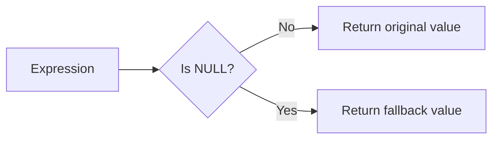
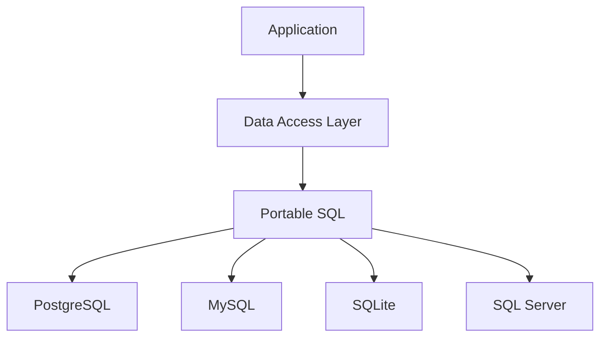

# 13- COALESCE vs ISNULL vs IFNULL

## Overview

`COALESCE`, `ISNULL`, and `IFNULL` solve a similar problem: replacing a `NULL` value with another value. They are not interchangeable across database engines, however. The differences matter for portability, type resolution, evaluation behavior, query design, and long-term maintenance.

The most important distinction is:

| Function | Common database | Standard SQL | Arguments |
|---|---|---:|---:|
| `COALESCE()` | PostgreSQL, MySQL, SQL Server, Oracle, SQLite | Yes | 2+ |
| `ISNULL()` | SQL Server | No | 2 |
| `IFNULL()` | MySQL, SQLite | No | 2 |
| `NVL()` | Oracle | No | 2 |

For application code that may support multiple relational databases, `COALESCE()` is generally the safest default:

```sql
COALESCE(value, fallback)
```

For production systems, the decision should be based on **database compatibility and exact semantics**, not simply on which function is shorter.

## The Common Problem

Suppose an `orders` table contains an optional discount:

```text
order_id | discount_amount
---------+----------------
1001     | 25.00
1002     | NULL
1003     | 10.00
```

A query that needs a displayable discount can use:

```sql
COALESCE(discount_amount, 0)
```

The result is:

```text
25.00
0
10.00
```

The transformation is:



This transformation should only be applied when `NULL` and the fallback have the same business meaning.

For example:

- `NULL discount` → `0` may be valid if NULL means "no discount".
- `NULL discount` → `0` may be wrong if NULL means "discount has not been calculated".

## COALESCE

### What It Is

`COALESCE()` is a standard SQL expression that returns the first non-NULL expression.

```sql
COALESCE(expression_1, expression_2, expression_3, ...)
```

Example:

```sql
SELECT
    COALESCE(
        primary_email,
        secondary_email,
        'unknown@example.com'
    ) AS email
FROM users;
```

The database evaluates the expressions in order and returns the first usable non-NULL value.

```text
primary_email
      │
      ├── value ──→ return it
      │
      └── NULL
            ↓
      secondary_email
            │
            ├── value ──→ return it
            │
            └── NULL
                  ↓
              fallback
```

### Why It Exists

`COALESCE()` provides a portable way to express fallback logic without relying on vendor-specific functions.

It is particularly useful when multiple fallback values are possible:

```sql
COALESCE(
    billing_address,
    shipping_address,
    registered_address
)
```

### When to Use It

Use `COALESCE()` when:

- you need one or more NULL fallbacks;
- portability matters;
- the expression is valid in the target SQL dialect;
- multiple candidate values need to be considered;
- you want the SQL to communicate fallback semantics clearly.

### Advantages

- Standard SQL.
- Supported by major relational databases.
- Supports multiple expressions.
- Expresses fallback chains naturally.
- Works well with aggregates and outer joins.
- Usually maps cleanly through modern ORMs.

### Limitations

- Result type resolution is database-specific at the implementation level.
- Implicit casts can still cause unexpected behavior.
- Applying it to indexed predicates can affect query plans.
- It can hide meaningful distinctions between NULL and an actual value if used carelessly.

## IFNULL

### What It Is

`IFNULL()` is a two-argument NULL-replacement function commonly associated with MySQL and SQLite.

```sql
IFNULL(expression, replacement)
```

Example:

```sql
SELECT
    IFNULL(discount_amount, 0) AS discount_amount
FROM orders;
```

It means:

```text
IF expression IS NOT NULL
    return expression
ELSE
    return replacement
```

### When to Use It

Use `IFNULL()` when:

- the application intentionally targets MySQL or SQLite;
- two-argument NULL fallback is all that is required;
- database-specific SQL is acceptable;
- there is a clear reason not to use `COALESCE()`.

For portable application SQL, prefer:

```sql
COALESCE(discount_amount, 0)
```

instead.

### Advantages

- Simple syntax.
- Well supported by MySQL.
- Supported by SQLite.
- Convenient for two-value fallback logic.

### Limitations

- Not standard SQL.
- Limited to two arguments.
- Creates unnecessary dialect coupling when portability is required.
- Should not be assumed to have identical semantics to every other NULL-handling function.

## ISNULL

### What It Is

SQL Server provides:

```sql
ISNULL(expression, replacement)
```

Example:

```sql
SELECT
    ISNULL(display_name, username) AS effective_name
FROM users;
```

`ISNULL()` is therefore similar in appearance to:

```sql
COALESCE(display_name, username)
```

but SQL Server's implementation has important differences.

### SQL Server Type Resolution

One of the most important differences is result type determination.

Consider:

```sql
SELECT ISNULL(CAST(NULL AS VARCHAR(3)), 'abcdef');
```

The result type is based on the first argument's type, which can result in truncation behavior depending on the expression.

`COALESCE()` follows SQL Server's type-precedence rules instead.

Therefore, this is not a safe assumption:

```text
ISNULL(a, b) == COALESCE(a, b)
```

The values may appear equivalent in simple queries while their resulting data types differ.

### When to Use It

Use `ISNULL()` when:

- the system is intentionally SQL Server-specific;
- existing SQL Server code already relies on its semantics;
- its type-resolution behavior is desirable;
- the query has been tested against the supported SQL Server version.

Do not replace `ISNULL()` across an entire codebase with `COALESCE()` as a mechanical refactoring.

Check:

- result types;
- string lengths;
- numeric precision;
- implicit conversions;
- computed-column behavior;
- query plans;
- application serialization.

## Direct Comparison

| Property | `COALESCE()` | `ISNULL()` | `IFNULL()` |
|---|---|---|---|
| Standard SQL | Yes | No | No |
| SQL Server | Yes | Yes | No |
| PostgreSQL | Yes | No | No |
| MySQL | Yes | No | Yes |
| SQLite | Yes | No | Yes |
| Oracle | Yes | No | No |
| Number of arguments | 2+ | 2 | 2 |
| Primary purpose | NULL fallback | NULL fallback | NULL fallback |
| Portability | High | Low | Low |
| Multiple fallback values | Yes | No | No |
| Type behavior | Database-specific | SQL Server-specific | Database-specific |

## Equivalent Basic Queries

For a simple two-value fallback:

```sql
COALESCE(email, 'unknown')
```

MySQL:

```sql
IFNULL(email, 'unknown')
```

SQL Server:

```sql
ISNULL(email, 'unknown')
```

These may produce the same visible result:

```text
email                  result
---------------------  ----------------
alice@example.com      alice@example.com
NULL                   unknown
```

But "same visible result" does not imply:

- same result data type;
- same implicit conversion behavior;
- same optimizer behavior;
- same evaluation semantics;
- same portability.

That distinction becomes important in production SQL.

## COALESCE With Multiple Values

This is where `COALESCE()` provides a significant advantage:

```sql
SELECT
    COALESCE(
        preferred_name,
        legal_name,
        username,
        'Unknown'
    ) AS display_name
FROM users;
```

Equivalent logic using nested two-argument functions becomes cumbersome:

```sql
IFNULL(
    preferred_name,
    IFNULL(
        legal_name,
        IFNULL(username, 'Unknown')
    )
)
```

For SQL Server:

```sql
ISNULL(
    preferred_name,
    ISNULL(
        legal_name,
        ISNULL(username, 'Unknown')
    )
)
```

`COALESCE()` communicates the intent much more clearly.

## Type Resolution

Type handling is one of the most important senior-level differences between these functions.

A NULL fallback expression does not exist independently of the database's type system. The database must determine the type of the resulting expression.

Consider:

```sql
COALESCE(amount, 0)
```

If `amount` is:

```sql
DECIMAL(12, 2)
```

the database must determine the resulting numeric type.

Similarly:

```sql
COALESCE(name, 'Unknown')
```

requires compatible string types.

Avoid depending unnecessarily on implicit conversions.

When exact type behavior matters, make it explicit:

```sql
SELECT
    COALESCE(
        CAST(discount_amount AS DECIMAL(12, 2)),
        CAST(0 AS DECIMAL(12, 2))
    ) AS discount_amount
FROM orders;
```

The exact casting syntax and resulting precision remain database-specific.

## Evaluation Semantics

A common interview statement is:

> "`COALESCE()` is always equivalent to a `CASE` expression and always evaluates each argument exactly once."

That is too strong.

`COALESCE()` is logically equivalent to a searched `CASE` expression for NULL selection:

```sql
COALESCE(a, b)
```

can be conceptually represented as:

```sql
CASE
    WHEN a IS NOT NULL THEN a
    ELSE b
END
```

However, optimizer transformations and database-specific expression evaluation rules mean application code should not rely on side effects or exact evaluation counts.

Avoid putting expressions with important side effects or nondeterministic behavior into fallback expressions when evaluation behavior matters.

Prefer deterministic expressions:

```sql
COALESCE(last_login, created_at)
```

over expressions whose repeated evaluation could create correctness problems.

## NULL Handling With Aggregates

The choice of function can affect aggregate semantics because adding a fallback changes the values being aggregated.

Consider:

```text
amount
------
100
200
NULL
```

This query:

```sql
SELECT AVG(amount)
FROM payments;
```

ignores NULL and returns:

```text
150
```

But:

```sql
SELECT AVG(COALESCE(amount, 0))
FROM payments;
```

treats NULL as zero:

```text
100 + 200 + 0
---------------- = 100
       3
```

These are different business calculations.

The same principle applies to:

- `SUM()`;
- `AVG()`;
- `COUNT()`;
- `MIN()`;
- `MAX()`.

Do not add `COALESCE()` simply to make output "look complete."

## NULL Handling With JOINs

Outer joins commonly produce NULL values for columns on the unmatched side.

Example:

```sql
SELECT
    u.id,
    u.username,
    COALESCE(SUM(p.amount), 0) AS total_payment
FROM users AS u
LEFT JOIN payments AS p
    ON p.user_id = u.id
GROUP BY
    u.id,
    u.username;
```

A user with no payments can produce:

```text
total_payment = 0
```

This is often useful for reporting.

The important distinction is:

```text
no matching payment rows
            ↓
aggregate result may be NULL
            ↓
COALESCE(..., 0)
            ↓
business-level zero
```

That transformation is valid only when "no payments" really means a zero total.

## NULLIF and Safe Division

`COALESCE()` and `NULLIF()` are frequently combined.

For example:

```sql
SELECT
    revenue / NULLIF(order_count, 0) AS revenue_per_order
FROM metrics;
```

`NULLIF()` converts zero into NULL:

```text
order_count = 0
        ↓
NULLIF(order_count, 0)
        ↓
NULL
```

This prevents division by zero.

You can then provide a fallback:

```sql
SELECT
    COALESCE(
        revenue / NULLIF(order_count, 0),
        0
    ) AS revenue_per_order
FROM metrics;
```

This means:

1. Treat zero orders as NULL for the division.
2. Perform the division when possible.
3. Convert a NULL result to zero.

Use this only when zero is the desired business representation for "no calculable average."

## Empty Strings Are Not NULL

None of these functions automatically means:

```text
NULL
=
empty string
```

They are distinct values.

For example:

```sql
COALESCE(phone_number, 'Not provided')
```

does not normally replace:

```text
''
```

with:

```text
Not provided
```

If empty strings are considered missing data, normalize them explicitly:

```sql
COALESCE(NULLIF(TRIM(phone_number), ''), 'Not provided')
```

The processing is:

```text
"   "
 ↓
TRIM()
 ↓
""
 ↓
NULLIF(..., '')
 ↓
NULL
 ↓
COALESCE(..., 'Not provided')
 ↓
"Not provided"
```

This pattern is useful when legacy systems allow multiple representations of "missing."

## Index and Query Performance

NULL functions are usually inexpensive when used in the `SELECT` list:

```sql
SELECT
    COALESCE(display_name, username)
FROM users;
```

The larger concern is using expressions around indexed columns in predicates.

For example:

```sql
WHERE COALESCE(status, 'unknown') = 'active'
```

may prevent or complicate use of a normal index on `status`, depending on the database and optimizer.

Prefer a direct predicate when it represents the same requirement:

```sql
WHERE status = 'active'
```

If NULL must also satisfy the condition:

```sql
WHERE status = 'active'
   OR status IS NULL
```

The exact plan should be validated using the database's execution-plan tools.

For PostgreSQL:

```sql
EXPLAIN (ANALYZE, BUFFERS)
SELECT *
FROM orders
WHERE status = 'active';
```

For SQL Server, inspect the actual execution plan.

For MySQL:

```sql
EXPLAIN
SELECT *
FROM orders
WHERE status = 'active';
```

### Production Rule

Do not decide that one formulation is faster based solely on syntax.

Measure:

- execution plan;
- rows scanned;
- index usage;
- CPU;
- I/O;
- execution time;
- cardinality estimates.

## ORM Considerations

Application frameworks can hide database-specific SQL differences.

### Django

Django provides `Coalesce`:

```python
from django.db.models import Value
from django.db.models.functions import Coalesce

users = User.objects.annotate(
    effective_name=Coalesce(
        "display_name",
        "username",
        Value("Unknown"),
    )
)
```

This is preferable to embedding a vendor-specific function when standard SQL adequately expresses the requirement.

If database-specific behavior is genuinely required, isolate it in the data-access layer.

### SQLAlchemy

SQLAlchemy can express `COALESCE()` using:

```python
from sqlalchemy import func, select

stmt = select(
    User.id,
    func.coalesce(
        User.display_name,
        User.username,
    ).label("effective_name"),
)
```

The application can therefore keep the business expression independent of a specific vendor function.

## Database Portability

Consider an application originally built on MySQL:

```sql
SELECT IFNULL(phone_number, 'Not provided')
FROM users;
```

If it later moves to PostgreSQL, the query must change:

```sql
SELECT COALESCE(phone_number, 'Not provided')
FROM users;
```

If the original query used:

```sql
SELECT COALESCE(phone_number, 'Not provided')
FROM users;
```

the expression itself generally requires no dialect-specific replacement.

This is one reason standard SQL is valuable in long-lived systems.



Portability does not mean avoiding all database-specific SQL. It means making the coupling **intentional and controlled**.

## When Vendor-Specific Functions Are Appropriate

Vendor-specific functions are reasonable when:

- the database is a deliberate architectural dependency;
- the function provides behavior unavailable through standard SQL;
- performance benefits have been measured;
- the organization accepts database lock-in;
- the data-access layer isolates database-specific code.

For example, a SQL Server-specific application may intentionally use:

```sql
ISNULL(column, fallback)
```

throughout its data layer.

The problem is not vendor-specific SQL itself.

The problem is **unintentional vendor coupling**.

## Migration Considerations

Database migrations often expose assumptions that were hidden by vendor-specific functions.

When migrating:

```text
MySQL
  ↓
PostgreSQL
```

or:

```text
SQL Server
  ↓
PostgreSQL
```

review:

- NULL functions;
- type coercion;
- string behavior;
- date/time functions;
- boolean handling;
- implicit casts;
- index expressions;
- generated columns;
- aggregate semantics;
- ORM-generated SQL.

A function replacement should be validated with representative data rather than assumed to be equivalent.

## Practical Decision Guide

| Requirement | Recommended choice |
|---|---|
| Portable SQL | `COALESCE()` |
| Multiple fallback values | `COALESCE()` |
| PostgreSQL | `COALESCE()` |
| MySQL | `COALESCE()` or `IFNULL()` |
| SQLite | `COALESCE()` or `IFNULL()` |
| SQL Server | `COALESCE()` or `ISNULL()` depending on semantics |
| Existing SQL Server code relying on `ISNULL()` type behavior | Keep `ISNULL()` |
| Oracle | `COALESCE()` or `NVL()` depending on requirements |
| Database-specific optimization | Vendor-specific function when justified |
| New application with uncertain future database | Prefer `COALESCE()` |

## Common Mistakes

### Treating the Functions as Universally Equivalent

This is the most common conceptual mistake.

```sql
ISNULL(a, b)
```

and:

```sql
COALESCE(a, b)
```

may produce the same visible value while producing different data types or conversions.

Always validate the target database's semantics.

### Using IFNULL in Portable SQL

This:

```sql
SELECT IFNULL(name, 'Unknown')
FROM users;
```

creates unnecessary coupling if PostgreSQL or SQL Server may become supported later.

Prefer:

```sql
SELECT COALESCE(name, 'Unknown')
FROM users;
```

### Using COALESCE to Hide Bad Data

This:

```sql
COALESCE(customer_age, 0)
```

does not necessarily mean the customer is zero years old.

If NULL means "unknown," replacing it with zero corrupts the meaning of the data.

### Changing Aggregate Semantics

Avoid blindly changing:

```sql
AVG(amount)
```

to:

```sql
AVG(COALESCE(amount, 0))
```

The second query includes previously NULL values in the calculation.

### Ignoring Type Resolution

Vendor-specific functions can differ in result-type behavior.

Test expressions involving:

- `VARCHAR` lengths;
- `CHAR`;
- decimals;
- integers;
- timestamps;
- nullable expressions with different types.

### Wrapping Indexed Columns

Avoid unnecessarily writing:

```sql
WHERE COALESCE(status, 'unknown') = 'active'
```

when:

```sql
WHERE status = 'active'
```

expresses the actual requirement.

Check the execution plan before and after any rewrite.

### Assuming ORM Portability Is Absolute

Django or SQLAlchemy can generate portable SQL for many expressions, but not every database feature has identical behavior across vendors.

Review generated SQL for performance-critical queries.

## Production Best Practices

### Prefer Standard SQL by Default

For general NULL fallback:

```sql
COALESCE(value, fallback)
```

is usually the best default.

### Preserve Intentional Vendor Coupling

If a system is deliberately SQL Server-specific, using:

```sql
ISNULL()
```

is not inherently wrong.

Document the dependency instead of pretending the SQL is portable.

### Keep Business Semantics Explicit

Before replacing NULL, establish what it means:

```text
NULL → unknown?
NULL → unavailable?
NULL → not applicable?
NULL → zero?
NULL → empty?
```

Only then choose the fallback.

### Test Boundary Values

At minimum, test:

- normal value;
- `NULL`;
- zero;
- empty string;
- whitespace-only string where applicable;
- unexpected type combinations;
- missing JOIN rows.

### Inspect Query Plans

For production queries, validate that NULL-handling expressions do not create an unexpected performance regression.

### Avoid Application-Level Workarounds

Do not retrieve NULL values into Python merely to replace them when the database can safely perform the transformation as part of the query.

For example, when the value is needed for a database-side aggregate:

```sql
SELECT
    COALESCE(SUM(amount), 0)
FROM payments;
```

is usually preferable to retrieving all rows and calculating the fallback in application code.

## Interview Traps

### Which function is standard SQL?

`COALESCE()`.

### Which function accepts multiple fallback values?

`COALESCE()`:

```sql
COALESCE(a, b, c, d)
```

`ISNULL()` and `IFNULL()` accept two arguments.

### Is `ISNULL()` the same as `COALESCE()`?

Not necessarily.

In SQL Server, their type-resolution behavior differs, and this can affect the resulting expression.

### Is `IFNULL()` available in PostgreSQL?

No. PostgreSQL normally uses:

```sql
COALESCE()
```

### Is `COALESCE()` only for two values?

No:

```sql
COALESCE(primary_email, secondary_email, backup_email, 'unknown')
```

returns the first non-NULL expression.

### Does `COALESCE()` convert empty strings to NULL?

No.

```text
NULL ≠ ''
```

Use explicit normalization when empty strings represent missing data:

```sql
COALESCE(NULLIF(TRIM(value), ''), 'fallback')
```

### Which function should you use in new portable SQL?

Usually:

```sql
COALESCE()
```

because it is standard SQL and supports multiple arguments.

## Key Takeaways

- **`COALESCE()` is the standard SQL choice for NULL fallback and is generally preferred when database portability matters.**
- **`ISNULL()` and `IFNULL()` are database-specific two-argument functions whose semantics can differ from `COALESCE()`, especially around type resolution.**
- **Do not treat equivalent-looking functions as mechanically interchangeable; validate result types, conversions, evaluation behavior, and query plans.**
- **NULL replacement is a business decision as much as a SQL decision: never replace NULL with zero, empty text, or another value unless that represents the intended meaning.**
- **Use vendor-specific NULL functions deliberately when database coupling is intentional; otherwise prefer standard SQL and ORM abstractions.**