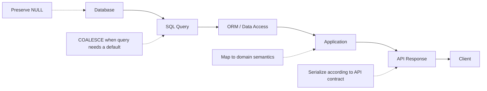
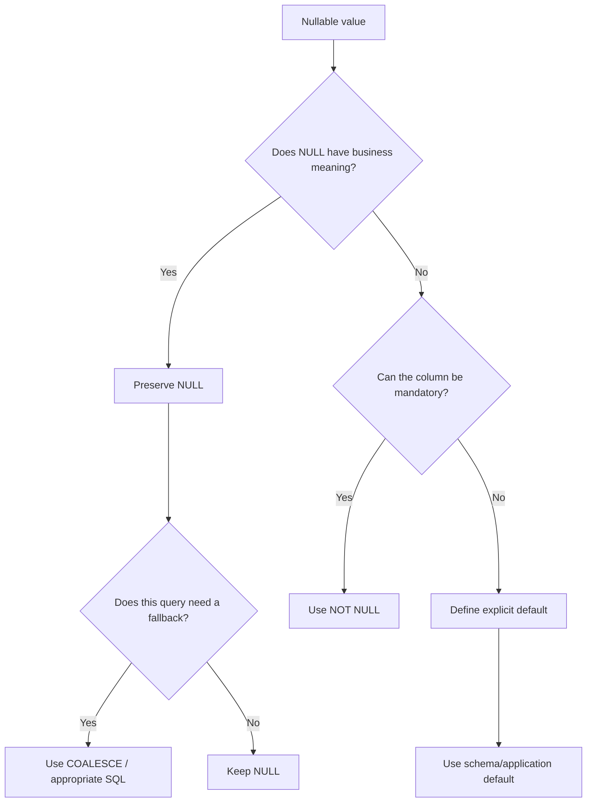
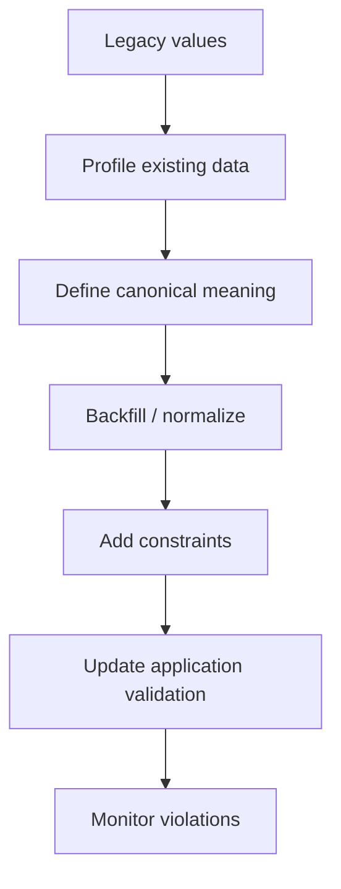

# 14- Choosing a NULL Handling Strategy

## Overview

`NULL` is not merely a missing string or a default value. It represents the absence of a known value and participates in SQL's three-valued logic. A production-grade NULL strategy therefore requires decisions at multiple layers:

- database schema;
- SQL queries;
- aggregates and joins;
- API serialization;
- application code;
- data validation;
- reporting and analytics.

The key engineering question is not:

> "How do I replace NULL?"

It is:

> "What does NULL mean for this piece of data, and where should that meaning be handled?"

A robust strategy preserves semantic information in storage and applies defaults only at the boundary where a default is actually required.

## NULL Has Business Meaning

Before choosing a NULL-handling technique, define what NULL represents.

Common meanings include:

| Meaning | Example | Appropriate representation |
|---|---|---|
| Unknown | Customer birth date is unknown | `NULL` |
| Not provided | User did not enter a phone number | `NULL` |
| Not applicable | Discount does not apply to an item | `NULL` |
| Not yet calculated | Risk score is pending | `NULL` |
| No quantity | Number of retries is genuinely zero | `0` |
| Empty text | User intentionally stored empty content | `''` |
| False | Feature is explicitly disabled | `FALSE` |

These meanings are not interchangeable.

For example:

```text
NULL discount
```

could mean:

```text
discount has not been calculated
```

while:

```text
0 discount
```

means:

```text
discount was calculated and is zero
```

Replacing the first with the second destroys information.

## Choosing Where to Handle NULL

NULL can be handled at several layers:



The correct layer depends on the requirement.

### Database Layer

Use schema constraints to prevent NULL when the business rule requires a value.

```sql
CREATE TABLE users (
    id BIGINT PRIMARY KEY,
    username VARCHAR(100) NOT NULL,
    display_name VARCHAR(200)
);
```

`username` is mandatory, while `display_name` is optional.

### Query Layer

Use `COALESCE()` when the query itself requires a fallback:

```sql
SELECT
    id,
    COALESCE(display_name, username) AS effective_name
FROM users;
```

### Application Layer

Handle domain-specific behavior when the meaning cannot be expressed correctly by a generic SQL fallback.

For example:

```python
if user.display_name is None:
    display_name = user.username
else:
    display_name = user.display_name
```

### API Layer

The API contract should explicitly define whether an absent value is:

```json
{
  "phone_number": null
}
```

or:

```json
{
  "phone_number": ""
}
```

or whether the property should be omitted.

These are different API contracts and should not be chosen accidentally.

## Decision Framework

Use the following sequence when designing NULL handling:



The general rule is:

> **Preserve semantic information in storage; transform NULL only when the consuming operation requires a different representation.**

## Schema Strategy

### Prefer NOT NULL When a Value Is Required

If an order must always have a creation timestamp:

```sql
CREATE TABLE orders (
    id BIGINT PRIMARY KEY,
    created_at TIMESTAMP NOT NULL
);
```

Do not allow:

```text
created_at = NULL
```

and then compensate everywhere with:

```sql
COALESCE(created_at, CURRENT_TIMESTAMP)
```

That hides invalid state rather than preventing it.

### Use Defaults for Genuine Defaults

A database default is appropriate when a value has a well-defined default at insertion time.

For example:

```sql
CREATE TABLE orders (
    id BIGINT PRIMARY KEY,
    retry_count INTEGER NOT NULL DEFAULT 0
);
```

This establishes:

```text
missing retry_count
        ↓
database default
        ↓
0
```

This is fundamentally different from using `COALESCE()` during reads.

A schema default establishes a value **when data is written**.

`COALESCE()` establishes a value **when data is read**.

## NULL Versus DEFAULT

These concepts solve different problems.

| Mechanism | When applied | Purpose |
|---|---|---|
| `NOT NULL` | Write | Prevent missing values |
| `DEFAULT` | Write | Supply a value when omitted |
| `COALESCE()` | Read | Provide a fallback in a query |
| `NULLIF()` | Read/expression | Convert a specific value to NULL |
| Application logic | Any layer | Apply domain-specific semantics |

Consider:

```sql
CREATE TABLE products (
    id BIGINT PRIMARY KEY,
    stock_count INTEGER NOT NULL DEFAULT 0,
    description TEXT
);
```

Here:

```text
stock_count = 0
```

means there is no stock.

But:

```text
description = NULL
```

can mean the description has not been provided.

The schema preserves those distinct meanings.

## Choosing a Fallback Function

For general SQL fallback logic, prefer:

```sql
COALESCE(value, fallback)
```

For multiple candidates:

```sql
COALESCE(
    preferred_value,
    secondary_value,
    fallback
)
```

Database-specific functions such as:

```sql
ISNULL(value, fallback)
```

or:

```sql
IFNULL(value, fallback)
```

can be appropriate when vendor-specific SQL is intentional.

For portable application SQL, `COALESCE()` is generally the better default.

## NULL and Aggregates

Aggregation is one of the areas where careless NULL handling can change business meaning.

Consider:

```text
amount
------
100
200
NULL
```

This:

```sql
SELECT AVG(amount)
FROM payments;
```

ignores NULL and calculates:

```text
(100 + 200) / 2 = 150
```

But:

```sql
SELECT AVG(COALESCE(amount, 0))
FROM payments;
```

calculates:

```text
(100 + 200 + 0) / 3 = 100
```

The queries answer different questions.

Therefore:

> Never add `COALESCE(..., 0)` to an aggregate merely because NULL looks inconvenient.

First determine whether NULL means:

- missing observation;
- zero;
- not applicable;
- unavailable;
- no matching rows.

## NULL and JOINs

Outer joins naturally introduce NULL values.

Example:

```sql
SELECT
    u.id,
    u.username,
    COALESCE(SUM(p.amount), 0) AS total_payment
FROM users AS u
LEFT JOIN payments AS p
    ON p.user_id = u.id
GROUP BY
    u.id,
    u.username;
```

This is often correct for a dashboard where:

```text
no payments
    ↓
total payment = 0
```

But the fallback should represent the report's business semantics.

If the report needs to distinguish:

```text
no payment records
```

from:

```text
payment records exist but their amounts are unknown
```

then blindly converting everything to zero is incorrect.

## NULL With Comparisons

Avoid:

```sql
WHERE email = NULL
```

Use:

```sql
WHERE email IS NULL
```

Similarly:

```sql
WHERE email IS NOT NULL
```

is the correct test for presence.

This matters because:

```text
NULL = NULL
```

does not evaluate to `TRUE`.

It evaluates to `UNKNOWN`.

That behavior propagates through SQL predicates and is one reason NULL handling must be designed rather than improvised.

## NULL With Logical Operators

SQL uses three-valued logic:

```text
TRUE
FALSE
UNKNOWN
```

For example:

```sql
SELECT *
FROM users
WHERE is_active = TRUE
   OR deleted_at = NULL;
```

The second predicate is not a valid NULL test.

Use:

```sql
SELECT *
FROM users
WHERE is_active = TRUE
   OR deleted_at IS NULL;
```

When combining predicates, reason about `UNKNOWN` explicitly.

A useful mental model is:

| A | B | `A AND B` | `A OR B` |
|---|---|---|---|
| TRUE | UNKNOWN | UNKNOWN | TRUE |
| FALSE | UNKNOWN | FALSE | UNKNOWN |
| UNKNOWN | UNKNOWN | UNKNOWN | UNKNOWN |

This becomes particularly important for `WHERE`, `JOIN`, `HAVING`, and `CASE` expressions.

## Empty String and Blank Space

Do not assume:

```text
NULL
''
'   '
```

are equivalent.

If a legacy system uses empty or whitespace-only strings to represent missing values, normalize explicitly:

```sql
COALESCE(NULLIF(TRIM(phone_number), ''), 'Not provided')
```

The transformation is:

```text
"   "
  ↓
TRIM()
  ↓
""
  ↓
NULLIF(..., '')
  ↓
NULL
  ↓
COALESCE(..., 'Not provided')
```

For new schemas, establish a consistent representation instead of allowing multiple forms of "missing."

## Database-Specific Behavior

Different database engines can implement NULL-related functions differently.

| Requirement | Preferred approach |
|---|---|
| Portable SQL fallback | `COALESCE()` |
| SQL Server-specific behavior | `ISNULL()` when appropriate |
| MySQL-specific behavior | `IFNULL()` when appropriate |
| Multiple fallback values | `COALESCE()` |
| Convert a sentinel to NULL | `NULLIF()` |
| Prevent division by zero | `NULLIF()` |
| Required database value | `NOT NULL` |
| Insertion-time fallback | `DEFAULT` |

Do not mechanically replace:

```sql
ISNULL(a, b)
```

with:

```sql
COALESCE(a, b)
```

in SQL Server code without checking:

- result type;
- implicit conversion;
- string length;
- numeric precision;
- execution plan;
- computed columns;
- application expectations.

## Application and API Strategy

A backend service should establish a clear contract between SQL and application code.

Consider a Django application:

```python
from django.db.models import Value
from django.db.models.functions import Coalesce

users = User.objects.annotate(
    effective_name=Coalesce(
        "display_name",
        "username",
        Value("Unknown"),
    )
)
```

This is useful when the query genuinely needs an effective display name.

However, avoid converting every nullable database field into a non-NULL value globally.

For example, changing:

```python
user.middle_name  # None
```

into:

```python
user.middle_name  # ""
```

may erase the distinction between:

```text
middle name is unknown/not provided
```

and:

```text
middle name was explicitly stored as empty
```

The API contract should define the intended representation.

### REST API Example

A nullable field can legitimately be represented as:

```json
{
  "id": 1001,
  "display_name": null
}
```

If the API contract requires an effective display name:

```json
{
  "id": 1001,
  "display_name": "alice"
}
```

That transformation should be intentional.

### FastAPI and Pydantic

A nullable field should be modeled explicitly when NULL is part of the contract:

```python
from pydantic import BaseModel


class UserResponse(BaseModel):
    id: int
    display_name: str | None
```

If the API guarantees a non-NULL value, model that contract accordingly and ensure the transformation occurs in a controlled layer.

## Data Ingestion and ETL

NULL strategy becomes more important in batch pipelines and event-driven systems.

Consider:

```text
Kafka event
    ↓
Consumer
    ↓
Validation
    ↓
Database
```

An incoming event might contain:

```json
{
  "customer_id": 1001,
  "phone_number": null
}
```

The consumer must distinguish:

```text
field omitted
```

from:

```text
field present with null
```

and potentially:

```text
field present with ""
```

These can represent different update semantics.

For example, in a PATCH-style workflow:

```text
field omitted → do not modify existing value
field = null  → clear existing value
field = ""    → possibly invalid or empty value
```

Do not collapse these states during deserialization without first defining the API or event contract.

## Performance Considerations

NULL handling itself is usually inexpensive, but its placement can affect query performance.

A projection such as:

```sql
SELECT COALESCE(display_name, username)
FROM users;
```

is generally straightforward.

More caution is required when wrapping indexed columns in predicates:

```sql
WHERE COALESCE(status, 'unknown') = 'active'
```

Depending on the database, this may prevent efficient use of a normal index.

Prefer predicates that directly express the filtering requirement when possible:

```sql
WHERE status = 'active'
```

If NULL has to be included:

```sql
WHERE status = 'active'
   OR status IS NULL
```

For important production queries, verify the result using an execution plan rather than assuming the rewrite is faster.

PostgreSQL example:

```sql
EXPLAIN (ANALYZE, BUFFERS)
SELECT *
FROM orders
WHERE status = 'active';
```

## Data Quality and Migration Strategy

Legacy databases often contain multiple representations of missing data:

```text
NULL
''
' '
'UNKNOWN'
'N/A'
0
-1
```

Do not normalize these blindly.

First determine the semantics of each representation.

A safe migration typically follows:



For example, if:

```text
'UNKNOWN'
''
'   '
```

all mean "not provided," they can potentially be normalized to `NULL`.

But if:

```text
'UNKNOWN'
```

means a user explicitly selected "Unknown," converting it to NULL would lose information.

## Production Checklist

Before introducing or changing NULL handling, verify:

### Schema

- Is the field genuinely optional?
- Should it be `NOT NULL`?
- Is there an appropriate database default?
- Does NULL have a defined business meaning?
- Are sentinel values being used?

### SQL

- Is `IS NULL` used instead of `= NULL`?
- Does `COALESCE()` change aggregate semantics?
- Do outer joins introduce expected NULL values?
- Could an expression around an indexed column affect the query plan?
- Are implicit type conversions safe?

### Application

- Does the ORM preserve NULL correctly?
- Is `None` handled intentionally in Python?
- Does validation distinguish omitted values from explicit NULL?
- Is fallback logic duplicated across services?

### API

- Does the API contract define nullable fields?
- Is `null` different from an omitted property?
- Is empty string a valid value?
- Are clients relying on a particular representation?

### Operations

- Are NULL rates monitored for important fields?
- Are unexpected NULLs treated as data-quality incidents?
- Are migrations backward compatible?
- Can old application versions coexist during deployment?

## Common Mistakes

### Replacing Every NULL With Zero

```sql
COALESCE(amount, 0)
```

is not universally correct.

Zero means a measured quantity of zero, not necessarily "unknown."

### Using Empty Strings Instead of NULL Everywhere

Using:

```text
''
```

to represent missing values creates ambiguity and makes validation and querying more complicated.

Prefer a consistent representation.

### Making Every Column NOT NULL

`NOT NULL` is not automatically better.

Some fields are legitimately optional:

```text
middle_name
secondary_email
completed_at
cancelled_at
```

Use constraints to encode business rules, not personal preference.

### Using COALESCE to Hide Invalid State

This:

```sql
COALESCE(created_at, CURRENT_TIMESTAMP)
```

can conceal corrupted data.

If `created_at` must always exist, enforce:

```sql
created_at TIMESTAMP NOT NULL
```

instead.

### Changing NULL Semantics During a Migration

A migration that changes:

```text
NULL → 0
```

is a data-model change, not merely a query optimization.

Review reporting, analytics, APIs, and downstream consumers.

### Duplicating Fallback Logic

Avoid having:

```text
SQL layer → fallback A
Django serializer → fallback B
FastAPI service → fallback C
frontend → fallback D
```

This creates inconsistent behavior.

Define the semantic boundary where the fallback should occur and reuse that contract.

### Ignoring Query Plans

A logically correct NULL expression can still produce an inefficient query when used in a predicate.

Measure critical queries with realistic data.

## Senior-Level Design Principles

### Preserve Information

Prefer:

```text
NULL
```

over an arbitrary sentinel when NULL has meaningful semantics.

Sentinels such as:

```text
0
-1
'UNKNOWN'
'1970-01-01'
```

often create ambiguity.

### Encode Invariants in the Database

If a property is mandatory:

```sql
NOT NULL
```

If it has a genuine insertion-time default:

```sql
DEFAULT
```

Do not depend exclusively on application validation.

### Transform at the Right Boundary

A useful rule is:

```text
Storage
  ↓
Preserve semantic state
  ↓
Query
  ↓
Transform when query semantics require it
  ↓
Application
  ↓
Apply domain behavior
  ↓
API
  ↓
Expose an explicit contract
```

This avoids both excessive NULL propagation and premature data loss.

### Prefer Standard SQL Where Practical

For portable SQL:

```sql
COALESCE()
```

is generally preferable to:

```sql
ISNULL()
IFNULL()
```

unless vendor-specific behavior is intentional.

### Treat NULL as a State

For senior engineering work, think of NULL as one possible state in a domain model rather than merely a database inconvenience.

For a workflow field:

```text
completed_at = NULL
```

might mean:

```text
not completed
```

while:

```text
completed_at = timestamp
```

means:

```text
completed
```

In such cases, NULL is part of the state machine and should not be replaced casually.

## Interview Traps

### Should NULL always be replaced?

No. NULL may carry important business meaning.

### Should optional database fields always have a default?

No. A default can destroy the distinction between "not provided" and an actual value.

### Is `COALESCE()` only a presentation feature?

No. It can affect:

- aggregates;
- joins;
- calculations;
- filtering;
- generated expressions;
- API query projections.

### Is `NULL` equivalent to zero?

No.

```text
NULL ≠ 0
```

Zero is a known numeric value.

### Is `NULL` equivalent to an empty string?

No.

```text
NULL ≠ ''
```

They represent different database states.

### Is `COALESCE()` always better than vendor-specific functions?

Not universally.

`COALESCE()` is generally preferable for portability, but vendor-specific functions can be appropriate when their semantics are intentionally required.

### Should NULL handling always happen in SQL?

No.

Use SQL when the transformation belongs to query semantics, application code when it represents domain behavior, and API serialization when it belongs to the external contract.

## Key Takeaways

- **Choose NULL handling based on business semantics first; do not replace NULL with zero, empty text, or another sentinel merely for convenience.**
- **Use `NOT NULL` and `DEFAULT` to enforce storage invariants, and use `COALESCE()` or similar expressions when a read/query genuinely requires a fallback.**
- **Preserve NULL when it represents meaningful state, especially for workflows, optional attributes, aggregates, and outer joins.**
- **Handle NULL at the appropriate boundary—database, SQL, application, or API—and avoid duplicating conflicting fallback logic across layers.**
- **Treat NULL handling as part of data-model and query design: validate type behavior, API semantics, migration impact, and execution plans before changing production behavior.**