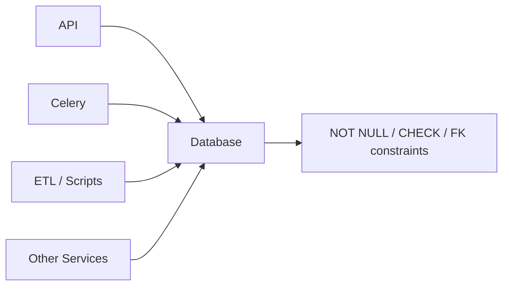
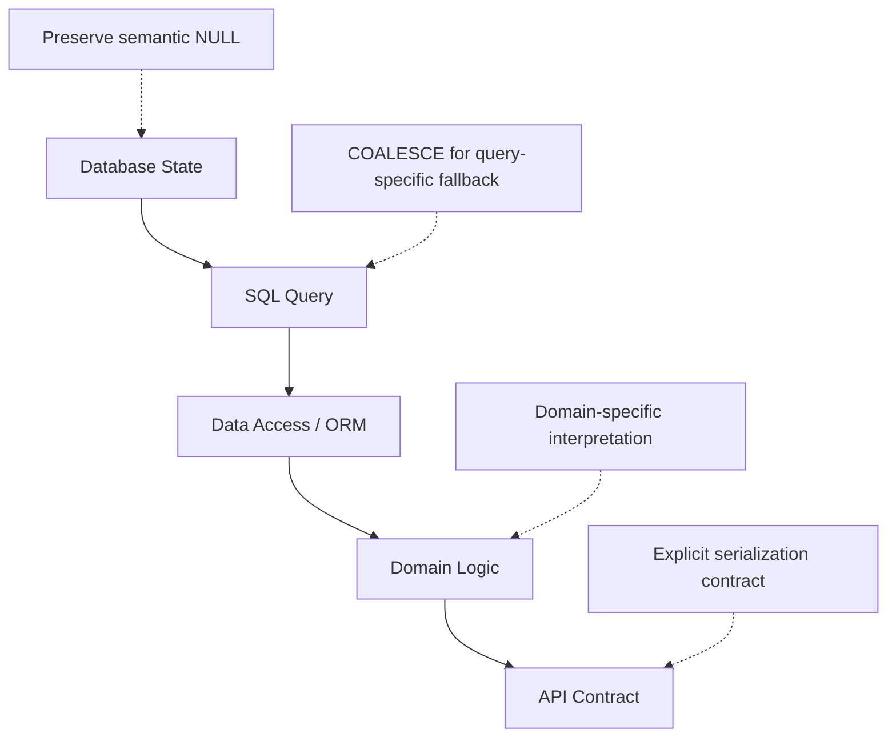
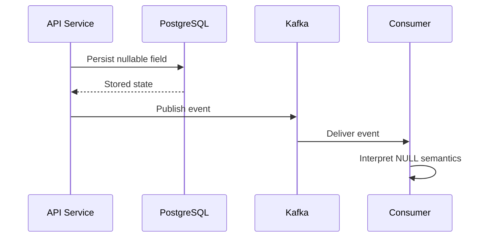

# 15- NULL Design Rules

## Overview

`NULL` is a data-modeling decision, not merely a SQL syntax concern. A well-designed database uses `NULL` deliberately to represent the absence of a value when that absence has meaningful semantics.

Poor NULL design usually appears as inconsistent representations of missing data:

```text
NULL
''
' '
'UNKNOWN'
'N/A'
0
-1
```

Once these representations spread across database tables, application code, APIs, reports, and event streams, every consumer must understand the differences.

The goal of NULL design is therefore to establish a small, explicit set of rules:

- Define what `NULL` means for each nullable attribute.
- Use `NOT NULL` when the domain requires a value.
- Use defaults only when a real default exists.
- Do not use sentinel values without a strong domain reason.
- Preserve meaningful distinctions between unknown, absent, zero, empty, and not applicable.
- Handle NULL at the layer where the transformation belongs.
- Make API, ORM, reporting, and event semantics consistent with the database model.

## NULL Is a Domain State

The most important rule is:

> **Do not choose NULL because a column happens to allow it; choose NULL because the domain requires an absent or unknown state.**

Consider an order:

```sql
CREATE TABLE orders (
    id BIGINT PRIMARY KEY,
    created_at TIMESTAMP NOT NULL,
    shipped_at TIMESTAMP,
    cancelled_at TIMESTAMP
);
```

The nullable timestamps have useful semantics:

| Value | Meaning |
|---|---|
| `created_at` | Always known when the row exists |
| `shipped_at = NULL` | Order has not shipped or shipping time is not available |
| `shipped_at = timestamp` | Order has shipped |
| `cancelled_at = NULL` | Order has not been cancelled |
| `cancelled_at = timestamp` | Order was cancelled |

Replacing `cancelled_at = NULL` with an artificial timestamp such as `1970-01-01` creates invalid domain semantics.

## Distinguish Absence From Known Values

A database should preserve meaningful distinctions.

| Representation | Typical meaning |
|---|---|
| `NULL` | Unknown, absent, or not applicable |
| `0` | Known numeric value of zero |
| `FALSE` | Known negative boolean state |
| `''` | Known empty string |
| `'   '` | String containing whitespace |
| Sentinel value | Special domain-specific state |

For example:

```text
discount = NULL
```

may mean:

```text
discount has not been calculated
```

while:

```text
discount = 0
```

means:

```text
discount was calculated and is zero
```

Those states should not be collapsed without an explicit business decision.

## Prefer NOT NULL for Required Data

If the application cannot operate correctly without a value, enforce that invariant in the database.

Prefer:

```sql
CREATE TABLE payments (
    id BIGINT PRIMARY KEY,
    order_id BIGINT NOT NULL,
    amount NUMERIC(12, 2) NOT NULL,
    currency CHAR(3) NOT NULL,
    created_at TIMESTAMP NOT NULL
);
```

over:

```sql
CREATE TABLE payments (
    id BIGINT PRIMARY KEY,
    order_id BIGINT,
    amount NUMERIC(12, 2),
    currency CHAR(3),
    created_at TIMESTAMP
);
```

and then compensating for missing data everywhere in application code.

### Why Database Constraints Matter

Application validation alone is insufficient in production systems.

Data can enter through:

- Django or FastAPI services;
- background workers;
- Celery tasks;
- administrative scripts;
- ETL jobs;
- migrations;
- direct SQL;
- other microservices.

A database constraint provides a final integrity boundary.



The database should enforce invariants that must hold regardless of which application path writes the data.

## Use DEFAULT Only for Genuine Defaults

A `DEFAULT` supplies a value when an insert does not explicitly provide one.

For example:

```sql
CREATE TABLE jobs (
    id BIGINT PRIMARY KEY,
    retry_count INTEGER NOT NULL DEFAULT 0
);
```

This is appropriate because zero is a valid initial state.

The distinction is:

```text
NOT NULL
    ↓
value must exist

DEFAULT
    ↓
database can supply a value when omitted
```

Do not use a default simply to eliminate NULL.

For example, this can be semantically dangerous:

```sql
phone_number VARCHAR(30) NOT NULL DEFAULT ''
```

if an empty string does not mean anything different from "phone number was not provided."

In that case:

```sql
phone_number VARCHAR(30)
```

may be more accurate.

## Avoid Sentinel Values

A sentinel value is an ordinary value overloaded to mean something special.

Examples:

```text
-1
0
9999-12-31
'UNKNOWN'
'N/A'
```

Sentinels can appear attractive because they avoid NULL, but they usually make the domain harder to reason about.

For example:

```sql
last_login_at = '1970-01-01'
```

to mean "never logged in" is inferior to:

```sql
last_login_at = NULL
```

because the timestamp column now contains a value that looks like a legitimate timestamp.

### When Sentinels Can Be Valid

A sentinel can be appropriate when it is a genuine domain value.

For example, an application may explicitly define:

```text
status = UNKNOWN
```

as a first-class state.

In that case, prefer a dedicated status representation:

```sql
status VARCHAR(20) NOT NULL
```

with an appropriate constraint or enum rather than disguising the state as an arbitrary value.

## Do Not Use NULL as a Replacement for Every State

The opposite mistake is making every state NULL.

Suppose a payment has these states:

```text
pending
authorized
captured
failed
refunded
```

Do not model all of them through combinations of nullable timestamps and amounts when an explicit state is required.

Prefer an explicit state:

```sql
CREATE TABLE payments (
    id BIGINT PRIMARY KEY,
    status VARCHAR(20) NOT NULL,
    captured_at TIMESTAMP,
    refunded_at TIMESTAMP
);
```

Here:

```text
status
```

represents the primary lifecycle state, while timestamps represent additional facts.

NULL should represent absence of a particular fact, not replace an explicit domain state machine.

## Define Nullable Columns Explicitly

For every nullable column, document what NULL means.

For example:

```sql
CREATE TABLE users (
    id BIGINT PRIMARY KEY,
    email VARCHAR(320) NOT NULL,
    phone_number VARCHAR(30),
    deleted_at TIMESTAMP
);
```

A design document or schema convention should define:

| Column | NULL meaning |
|---|---|
| `phone_number` | User has not provided a phone number |
| `deleted_at` | User has not been soft-deleted |

This prevents different engineers from interpreting the same NULL differently.

## NULL and Empty Strings

Do not casually treat:

```text
NULL
''
'   '
```

as equivalent.

If a legacy system contains multiple representations of missing text, normalize them deliberately.

For example:

```sql
SELECT
    NULLIF(TRIM(phone_number), '') AS normalized_phone
FROM users;
```

This converts:

```text
NULL → NULL
''   → NULL
' '  → NULL
'   ' → NULL
'123' → '123'
```

If the canonical database representation is NULL, consider normalizing data during a controlled migration rather than forcing every query to repeat the transformation.

## NULL and Boolean Design

Boolean columns require special attention.

Avoid nullable booleans unless there is a meaningful third state.

For example:

```text
is_active
---------
TRUE
FALSE
NULL
```

could mean:

```text
TRUE  = active
FALSE = inactive
NULL  = unknown
```

If "unknown" is not meaningful, prefer:

```sql
is_active BOOLEAN NOT NULL DEFAULT TRUE
```

If there are genuinely three states, an explicit status may communicate the domain more clearly:

```text
active
inactive
unknown
```

### Production Rule

Ask:

> Does the application need to distinguish FALSE from unknown?

If not, a nullable boolean usually introduces unnecessary complexity.

## NULL and Numeric Columns

Numeric NULLs require the same semantic discipline.

Consider:

```sql
quantity INTEGER
```

There is an important distinction between:

```text
quantity = 0
```

and:

```text
quantity = NULL
```

For inventory:

```text
0    → inventory is known to be zero
NULL → inventory is unknown or unavailable
```

For a metric:

```text
NULL → metric was not measured
0    → metric was measured and was zero
```

This distinction can materially affect analytics.

## NULL and Date/Time Columns

Date and timestamp columns frequently use NULL to represent lifecycle states.

Example:

```sql
CREATE TABLE subscriptions (
    id BIGINT PRIMARY KEY,
    started_at TIMESTAMP NOT NULL,
    ended_at TIMESTAMP
);
```

Here:

```text
ended_at = NULL
```

can naturally represent:

```text
subscription has not ended
```

Avoid artificial timestamps such as:

```text
9999-12-31
1970-01-01
0001-01-01
```

unless the domain explicitly defines them.

Artificial dates can cause:

- incorrect sorting;
- incorrect duration calculations;
- reporting errors;
- timezone confusion;
- invalid business calculations.

## NULL and Relationships

Nullable foreign keys are sometimes correct.

For example:

```sql
CREATE TABLE tickets (
    id BIGINT PRIMARY KEY,
    assigned_agent_id BIGINT REFERENCES agents(id)
);
```

If unassigned tickets are a valid state:

```text
assigned_agent_id = NULL
```

can be appropriate.

Do not invent an agent such as:

```text
agent_id = 0
```

just to avoid NULL.

However, if every ticket must have an owner, enforce:

```sql
assigned_agent_id BIGINT NOT NULL REFERENCES agents(id)
```

The relationship constraint should reflect the actual business invariant.

## NULL and JOINs

Outer joins naturally create NULL values.

Suppose:

```sql
SELECT
    u.id,
    u.username,
    p.id AS payment_id
FROM users AS u
LEFT JOIN payments AS p
    ON p.user_id = u.id;
```

For a user without payments:

```text
payment_id = NULL
```

This does not mean the payment record contains NULL.

It means:

> No matching payment row existed for this user.

This distinction is important when designing reports and aggregates.

For example:

```sql
SELECT
    u.id,
    COALESCE(SUM(p.amount), 0) AS total_paid
FROM users AS u
LEFT JOIN payments AS p
    ON p.user_id = u.id
GROUP BY u.id;
```

Here converting the aggregate result to zero may be correct if the report defines:

```text
no payment rows → total paid = 0
```

But this should be an explicit reporting decision.

## NULL and Aggregates

SQL aggregate functions generally ignore NULL input values.

Consider:

```text
amount
------
100
200
NULL
```

Then:

```sql
SELECT AVG(amount)
FROM payments;
```

calculates:

```text
150
```

because the NULL value is not included in the average.

But:

```sql
SELECT AVG(COALESCE(amount, 0))
FROM payments;
```

calculates:

```text
100
```

because the NULL is converted into zero before aggregation.

Therefore:

> **Do not use `COALESCE()` inside an aggregate unless the replacement value is part of the metric's definition.**

## NULL and SQL Predicates

NULL participates in SQL's three-valued logic:

```text
TRUE
FALSE
UNKNOWN
```

Therefore:

```sql
WHERE email = NULL
```

does not correctly test for NULL.

Use:

```sql
WHERE email IS NULL
```

and:

```sql
WHERE email IS NOT NULL
```

This is a fundamental design rule because predicates involving NULL can otherwise silently exclude rows.

## Handle NULL at the Correct Layer

NULL can be transformed at multiple layers:



A useful rule is:

> **Store canonical semantics in the database and transform them only at the boundary that requires a different representation.**

### Database

Use:

```sql
NOT NULL
DEFAULT
CHECK
FOREIGN KEY
```

to enforce invariants.

### SQL

Use:

```sql
COALESCE()
NULLIF()
CASE
```

when query semantics require transformation.

### Application

Use domain logic when NULL maps to business behavior.

### API

Use serialization rules when an external client requires a particular representation.

## Avoid Global NULL Normalization

A common anti-pattern is:

```text
Every NULL → ""
```

or:

```text
Every NULL → 0
```

at the application boundary.

This may simplify one consumer while corrupting the domain model for others.

For example:

```python
{
    "middle_name": ""
}
```

does not necessarily communicate the same meaning as:

```python
{
    "middle_name": None
}
```

The API should expose the semantics required by its contract rather than applying a universal database-to-API conversion.

## ORM Considerations

ORMs such as Django's ORM generally map SQL NULL to Python `None`.

For example:

```python
user.phone_number is None
```

should be expected when the corresponding database value is NULL.

When a query requires a fallback, perform it intentionally:

```python
from django.db.models import Value
from django.db.models.functions import Coalesce

users = User.objects.annotate(
    effective_name=Coalesce(
        "display_name",
        "username",
        Value("Unknown"),
    )
)
```

The important distinction is:

```text
user.display_name
```

represents stored state.

```text
effective_name
```

represents a query-derived value.

Do not overwrite the semantic distinction merely because a particular screen needs a fallback.

## API Contract Rules

For REST APIs, decide explicitly how nullable fields are represented.

Possible contracts include:

```json
{
  "phone_number": null
}
```

or:

```json
{
  "phone_number": ""
}
```

or omission:

```json
{}
```

These have different semantics.

For update operations, the distinction can be even more important:

```text
field omitted
    → leave existing value unchanged

field = null
    → clear existing value

field = ""
    → store an empty string, if permitted
```

A PATCH API should document these semantics clearly.

## Event and Microservice Boundaries

NULL semantics must remain consistent when data crosses service boundaries.

Consider:



If one service interprets:

```text
NULL = unknown
```

while another interprets:

```text
NULL = delete
```

the system can produce destructive behavior.

Event schemas should therefore define:

- whether a field is optional;
- whether `null` is allowed;
- what `null` means;
- whether omitted and null are different;
- compatibility requirements for old consumers.

## Migration Rules

Changing NULL semantics is a data-model migration.

For example:

```text
NULL → 0
```

is not merely a query change.

It can affect:

- historical reports;
- analytics;
- APIs;
- ETL;
- machine-learning datasets;
- downstream services;
- business logic;
- indexes and constraints.

A safer migration process is:


Before changing a nullable column to `NOT NULL`, identify and resolve existing NULL rows.

Example:

```sql
SELECT COUNT(*)
FROM orders
WHERE created_at IS NULL;
```

Only after the data is clean should the constraint be introduced.

## Performance Considerations

NULL handling is usually not expensive by itself, but expressions involving nullable columns can influence query planning.

For example:

```sql
WHERE COALESCE(status, 'unknown') = 'active'
```

may make ordinary index usage less straightforward than a direct predicate, depending on the database and available indexes.

For critical queries, inspect the execution plan:

```sql
EXPLAIN (ANALYZE, BUFFERS)
SELECT *
FROM orders
WHERE status = 'active';
```

Do not optimize NULL expressions based solely on intuition.

Measure against realistic production-sized data.

## Constraints and Data Quality

Use constraints to encode the intended NULL strategy.

For example:

```sql
CREATE TABLE accounts (
    id BIGINT PRIMARY KEY,
    email VARCHAR(320) NOT NULL,
    display_name VARCHAR(200),
    balance NUMERIC(12, 2) NOT NULL DEFAULT 0,
    status VARCHAR(20) NOT NULL,
    CHECK (balance >= 0)
);
```

This design communicates several invariants:

- `email` must exist;
- `display_name` is optional;
- `balance` has a known zero default;
- `status` must always have a value;
- negative balances are invalid.

Good schemas reduce the amount of NULL interpretation required in application code.

## Production Review Checklist

Before approving a nullable column, ask:

### Data Modeling

- What exactly does NULL mean?
- Is the field genuinely optional?
- Is NULL different from zero?
- Is NULL different from empty string?
- Is NULL different from "not applicable"?
- Should this be represented by an explicit state instead?

### Database

- Should the column be `NOT NULL`?
- Is a `DEFAULT` actually meaningful?
- Can a `CHECK` constraint enforce the invariant?
- Does a nullable foreign key represent a legitimate relationship state?
- Are sentinel values being introduced unnecessarily?

### Query Layer

- Are `IS NULL` and `IS NOT NULL` used correctly?
- Are outer joins introducing expected NULLs?
- Does `COALESCE()` change aggregate semantics?
- Could NULL-related expressions affect index usage?
- Are type conversions safe?

### Application

- Does the ORM correctly distinguish `None` from empty values?
- Is fallback logic domain-specific?
- Are validation rules consistent with database constraints?
- Are different services interpreting NULL consistently?

### API and Events

- Is `null` different from an omitted property?
- Is empty string valid?
- Can clients clear the field?
- Is the event schema explicit about nullable fields?
- Are old consumers compatible with the representation?

### Operations

- Are unexpected NULLs observable?
- Are data-quality checks in place?
- Can migrations be deployed without breaking old application versions?
- Has historical data been profiled before changing constraints?

## Common Mistakes

### Making Everything NOT NULL

`NOT NULL` is valuable for invariants, but not every attribute is mandatory.

Legitimate nullable attributes include:

```text
middle_name
secondary_email
shipped_at
cancelled_at
deleted_at
assigned_agent_id
```

Use constraints according to domain requirements.

### Replacing NULL With Zero

This:

```sql
COALESCE(amount, 0)
```

does not mean "make the data correct."

It means:

```text
treat missing amount as zero for this expression
```

That distinction matters.

### Using Empty Strings as Missing Values

Using:

```text
''
```

for every missing string can create ambiguity and inconsistent querying.

If the domain has one canonical absence representation, enforce it consistently.

### Using Arbitrary Sentinel Values

Values such as:

```text
-1
1970-01-01
'UNKNOWN'
```

can silently become valid-looking application data.

Prefer NULL or an explicit domain state where appropriate.

### Using COALESCE to Hide Invalid Data

Avoid:

```sql
SELECT COALESCE(created_at, CURRENT_TIMESTAMP)
FROM orders;
```

if `created_at` is supposed to be mandatory.

The better design is:

```sql
created_at TIMESTAMP NOT NULL
```

and correcting existing invalid data.

### Forgetting Outer-Join Semantics

A NULL produced by a `LEFT JOIN` can mean:

```text
no matching row
```

rather than:

```text
matching row contains NULL
```

These cases can require different reporting logic.

### Treating NULL as FALSE

For nullable booleans:

```text
FALSE ≠ NULL
```

If the third state has no business meaning, use:

```sql
BOOLEAN NOT NULL DEFAULT FALSE
```

or another appropriate explicit default.

### Normalizing NULL Globally

A universal rule such as:

```text
NULL → ""
```

across all APIs and services usually destroys useful information.

Normalize only where the consuming contract requires it.

## Interview Traps

### Is NULL the same as zero?

No. Zero is a known numeric value; NULL represents absence or unknown state.

### Is NULL the same as an empty string?

No. `NULL` and `''` are distinct SQL values.

### Should every column be NOT NULL?

No. Only enforce `NOT NULL` when the domain requires a value.

### Why not use a sentinel value instead of NULL?

Sentinels overload valid data values and often create ambiguity in queries, calculations, ordering, and reporting.

### When should COALESCE be used?

Use it when a query intentionally requires a fallback representation. It should not be used merely to hide invalid database state.

### Should defaults replace NULL everywhere?

No. A default is appropriate when the domain has a genuine default value. Otherwise, it can destroy the distinction between missing and known data.

### Where should NULL handling happen?

At the layer that owns the semantics. Database constraints enforce invariants, SQL handles query-specific transformations, application code handles domain behavior, and APIs define external representation.

## Key Takeaways

- **Use `NULL` deliberately to represent meaningful absence, unknown state, or non-applicability; do not treat it as an arbitrary empty value.**
- **Use `NOT NULL` and `DEFAULT` to encode genuine database invariants and defaults rather than compensating for weak schema design in application code.**
- **Preserve distinctions between `NULL`, zero, empty strings, false, and sentinel values because they can represent different business states.**
- **Apply NULL transformations at the correct boundary and use `COALESCE()`, `NULLIF()`, and related functions only when their semantics are intentional.**
- **Treat changes to NULL semantics as data-model migrations that require impact analysis across queries, APIs, services, events, reports, and historical data.**