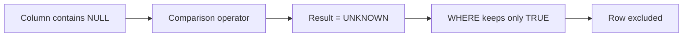

# 16- Common NULL Mistakes

## Overview

`NULL` is one of the most common sources of subtle SQL bugs because it does not behave like an ordinary value. It represents an absent, unknown, or non-applicable value and participates in SQL's three-valued logic:

```text
TRUE
FALSE
UNKNOWN
```

Most NULL-related production defects are not syntax errors. The SQL executes successfully but silently returns different rows, incorrect aggregates, incomplete reports, or incorrect application state.

The most important mistakes involve:

- comparing NULL with `=` or `<>`;
- assuming NULL behaves like `0`, `FALSE`, or `''`;
- misunderstanding `AND` and `OR`;
- filtering incorrectly after `LEFT JOIN`;
- using `COALESCE()` without understanding its semantic effect;
- incorrectly handling NULL inside aggregates;
- treating nullable booleans as ordinary booleans;
- confusing missing rows with rows containing NULL;
- hiding data-quality problems with fallback expressions.

## Mistake: Comparing NULL With `=` or `<>`

The most fundamental mistake is:

```sql
WHERE email = NULL
```

or:

```sql
WHERE email <> NULL
```

Neither expression correctly tests for NULL.

Use:

```sql
WHERE email IS NULL
```

and:

```sql
WHERE email IS NOT NULL
```

### Why It Happens

SQL does not evaluate:

```text
NULL = NULL
```

as `TRUE`.

The result is `UNKNOWN`.

The same applies to:

```text
NULL <> 'x'
NULL = 'x'
NULL > 10
NULL < 10
```

They all produce `UNKNOWN`.

Since a `WHERE` clause retains rows only when its predicate evaluates to `TRUE`, those rows are excluded.



### Correct Pattern

```sql
SELECT id, email
FROM users
WHERE email IS NULL;
```

```sql
SELECT id, email
FROM users
WHERE email IS NOT NULL;
```

## Mistake: Assuming NULL Equals NULL

This is another common misconception:

```sql
SELECT *
FROM users
WHERE email = email;
```

A developer may expect this to return every row because a value should equal itself.

For a NULL email:

```text
NULL = NULL → UNKNOWN
```

Therefore rows containing NULL are excluded.

This can also appear in joins:

```sql
SELECT *
FROM a
JOIN b
    ON a.external_id = b.external_id;
```

Rows where both `external_id` values are NULL do not match through ordinary equality.

If the business semantics require NULLs to be considered equal, use a database-supported null-safe comparison or explicit logic appropriate to the database.

For PostgreSQL:

```sql
SELECT *
FROM a
JOIN b
    ON a.external_id IS NOT DISTINCT FROM b.external_id;
```

This treats two NULLs as equal for comparison purposes.

## Mistake: Treating NULL as Zero

Consider:

```sql
SELECT price + tax
FROM orders;
```

If either value is NULL:

```text
price + tax → NULL
```

It does not automatically become zero.

If the business rule is that a missing tax value should contribute zero:

```sql
SELECT
    price + COALESCE(tax, 0) AS total
FROM orders;
```

But this transformation should be intentional.

`NULL` may mean:

```text
tax was not calculated
```

while `0` may mean:

```text
tax was calculated and is zero
```

Converting one into the other can destroy information.

## Mistake: Treating NULL as an Empty String

These are different values:

```text
NULL
''
' '
```

For example:

```sql
SELECT *
FROM users
WHERE phone_number = '';
```

does not find rows where `phone_number IS NULL`.

If the application considers empty strings equivalent to missing values, normalize them deliberately:

```sql
SELECT *
FROM users
WHERE NULLIF(TRIM(phone_number), '') IS NULL;
```

For production systems, prefer establishing one canonical representation rather than forcing every query to normalize legacy data.

## Mistake: Treating NULL as FALSE

A nullable boolean can contain three states:

| Value | Possible meaning |
|---|---|
| `TRUE` | Yes |
| `FALSE` | No |
| `NULL` | Unknown / not specified |

Therefore:

```sql
WHERE is_verified = FALSE
```

does not include NULL rows.

If the business rule is:

```text
NULL should behave as FALSE
```

then make that rule explicit:

```sql
WHERE COALESCE(is_verified, FALSE) = FALSE;
```

However, if unknown is not a meaningful state, a better schema is usually:

```sql
is_verified BOOLEAN NOT NULL DEFAULT FALSE
```

## Mistake: Forgetting Three-Valued Logic

SQL predicates can evaluate to:

| Expression | Result |
|---|---|
| `TRUE AND TRUE` | `TRUE` |
| `TRUE AND FALSE` | `FALSE` |
| `TRUE AND UNKNOWN` | `UNKNOWN` |
| `FALSE AND UNKNOWN` | `FALSE` |
| `TRUE OR UNKNOWN` | `TRUE` |
| `FALSE OR UNKNOWN` | `UNKNOWN` |
| `UNKNOWN OR UNKNOWN` | `UNKNOWN` |
| `NOT UNKNOWN` | `UNKNOWN` |

This matters when NULL is involved in compound predicates.

For example:

```sql
WHERE status = 'active'
   OR deleted_at <> CURRENT_TIMESTAMP
```

A NULL `deleted_at` does not make the second condition TRUE.

The final result depends on the complete three-valued evaluation.

### Production Rule

When a predicate involves nullable columns, evaluate each condition explicitly instead of reasoning as if every expression were binary boolean logic.

## Mistake: Using `NOT IN` With NULL

`NOT IN` is a particularly common NULL trap.

Consider:

```sql
SELECT *
FROM users
WHERE id NOT IN (
    SELECT user_id
    FROM blocked_users
);
```

If `blocked_users.user_id` contains a NULL, the subquery effectively contains:

```text
1
2
NULL
```

For an ID such as `3`, SQL must evaluate the equivalent of:

```text
3 <> 1
AND
3 <> 2
AND
3 <> NULL
```

The last comparison is `UNKNOWN`, so the entire predicate becomes `UNKNOWN`.

The query can unexpectedly return no rows or exclude rows you expected to receive.

### Safer Pattern

When the semantics are "return rows for which no matching record exists," prefer `NOT EXISTS`:

```sql
SELECT u.*
FROM users AS u
WHERE NOT EXISTS (
    SELECT 1
    FROM blocked_users AS b
    WHERE b.user_id = u.id
);
```

`NOT EXISTS` expresses the relationship directly and avoids the NULL behavior of `NOT IN`.

## Mistake: Misunderstanding `LEFT JOIN` + `WHERE`

Consider:

```sql
SELECT
    u.id,
    p.id AS payment_id
FROM users AS u
LEFT JOIN payments AS p
    ON p.user_id = u.id
WHERE p.status = 'completed';
```

The query appears to request:

```text
all users + completed payments
```

but the `WHERE` clause eliminates rows where no payment exists because:

```text
p.status = 'completed'
```

evaluates to `UNKNOWN` when `p.status` is NULL.

The result behaves like an inner join for that condition.

### If You Want to Preserve Users Without Payments

Move the condition into the join:

```sql
SELECT
    u.id,
    p.id AS payment_id
FROM users AS u
LEFT JOIN payments AS p
    ON p.user_id = u.id
   AND p.status = 'completed';
```

Now the outer-join semantics are preserved.

### General Rule

When filtering the optional side of a `LEFT JOIN`, ask:

> Should the condition determine which matching rows are joined, or should it determine which final rows are returned?

Those are different operations.

## Mistake: Confusing NULL Rows With Missing Rows

A `LEFT JOIN` can produce NULL values even when the original table's column is `NOT NULL`.

For example:

```sql
SELECT
    u.id,
    p.id
FROM users AS u
LEFT JOIN payments AS p
    ON p.user_id = u.id;
```

If a user has no payment, the result contains:

```text
u.id = 42
p.id = NULL
```

This does **not** mean:

```text
payments.id contains NULL
```

It means:

```text
no payment row matched
```

This distinction is essential for reporting and aggregate queries.

## Mistake: Assuming `COUNT(column)` Counts All Rows

Consider:

```sql
SELECT COUNT(phone_number)
FROM users;
```

`COUNT(column)` ignores NULL values.

If the data is:

```text
phone_number
------------
'123'
'456'
NULL
```

then:

```sql
COUNT(phone_number)
```

returns:

```text
2
```

while:

```sql
COUNT(*)
```

returns:

```text
3
```

Use:

```sql
COUNT(*)
```

when you mean:

> Count rows.

Use:

```sql
COUNT(column)
```

when you mean:

> Count non-NULL values in this column.

## Mistake: Misunderstanding Other Aggregates

Most aggregate functions ignore NULL input values.

Given:

```text
amount
------
100
200
NULL
```

then:

```sql
SELECT
    SUM(amount),
    AVG(amount),
    MIN(amount),
    MAX(amount),
    COUNT(amount),
    COUNT(*)
FROM payments;
```

produces conceptually:

| Expression | Result |
|---|---:|
| `SUM(amount)` | `300` |
| `AVG(amount)` | `150` |
| `MIN(amount)` | `100` |
| `MAX(amount)` | `200` |
| `COUNT(amount)` | `2` |
| `COUNT(*)` | `3` |

The NULL value is ignored by these aggregates, but it is still a row for `COUNT(*)`.

## Mistake: Using `COALESCE()` Without Defining Semantics

This query:

```sql
SELECT COALESCE(balance, 0)
FROM accounts;
```

means:

```text
if balance is NULL, present zero
```

It does not mean:

```text
NULL was actually zero.
```

That distinction matters.

For a financial system, blindly converting:

```text
NULL → 0
```

can hide incomplete calculations or missing ledger data.

Use `COALESCE()` when the replacement value is part of the intended query semantics.

## Mistake: Using `COALESCE()` Before an Aggregate

These queries are not necessarily equivalent:

```sql
SELECT AVG(amount)
FROM payments;
```

and:

```sql
SELECT AVG(COALESCE(amount, 0))
FROM payments;
```

Suppose:

```text
amount
------
100
200
NULL
```

The first query produces:

```text
150
```

because NULL is ignored.

The second produces:

```text
100
```

because the NULL becomes zero before aggregation:

```text
100 + 200 + 0
---------------- = 100
       3
```

Choose the expression according to the metric definition.

## Mistake: Using `COALESCE()` to Hide Invalid Data

Avoid using:

```sql
SELECT COALESCE(created_at, CURRENT_TIMESTAMP)
FROM orders;
```

when `created_at` is supposed to be mandatory.

This can make corrupted data look valid.

Prefer:

```sql
created_at TIMESTAMP NOT NULL
```

and investigate existing NULL rows.

Fallback expressions should solve legitimate query semantics, not hide schema violations.

## Mistake: Using `NULLIF()` Without Understanding Its Direction

`NULLIF(a, b)` returns:

```text
NULL if a = b
a otherwise
```

For example:

```sql
SELECT NULLIF(TRIM(phone_number), '')
FROM users;
```

converts empty or whitespace-only phone numbers into NULL.

This is useful for normalizing legacy input.

The common mistake is assuming it replaces NULL with a value.

It does the opposite:

```text
specific value → NULL
```

For replacing NULL:

```sql
COALESCE(value, replacement)
```

is usually the relevant function.

## Mistake: Treating `NULLIF()` as Data Validation

This:

```sql
NULLIF(amount, 0)
```

can convert zero into NULL, but it does not establish whether zero is valid.

For example:

```sql
SELECT revenue / NULLIF(order_count, 0)
FROM daily_metrics;
```

is useful because it prevents division by zero by turning zero into NULL for that calculation.

But if `order_count = 0` represents invalid stored data, the underlying data-quality problem still needs to be addressed.

## Mistake: Assuming `IS NULL` Is Equivalent to `= NULL`

They are fundamentally different.

```sql
column = NULL
```

performs a comparison and produces `UNKNOWN`.

```sql
column IS NULL
```

uses a NULL predicate and produces a deterministic boolean result.

| Predicate | NULL column result |
|---|---|
| `column = NULL` | `UNKNOWN` |
| `column <> NULL` | `UNKNOWN` |
| `column > NULL` | `UNKNOWN` |
| `column IS NULL` | `TRUE` |
| `column IS NOT NULL` | `FALSE` |

## Mistake: Forgetting NULL in Unique Constraints

NULL behavior in unique constraints is database-specific.

For example, PostgreSQL generally allows multiple NULLs in a normal unique constraint because NULL values are not considered equal for ordinary uniqueness enforcement.

Therefore:

```sql
CREATE TABLE users (
    id BIGINT PRIMARY KEY,
    phone_number VARCHAR(30) UNIQUE
);
```

can permit multiple users with:

```text
phone_number = NULL
```

If the business requirement is:

```text
only one row may have NULL
```

that requires additional design.

More commonly, the requirement is:

```text
non-NULL phone numbers must be unique
```

which is naturally represented by a nullable unique column in systems such as PostgreSQL.

For conditional uniqueness, a partial unique index can be useful:

```sql
CREATE UNIQUE INDEX users_phone_number_unique
ON users (phone_number)
WHERE phone_number IS NOT NULL;
```

Always verify the target database's NULL and uniqueness semantics before relying on them.

## Mistake: Assuming `DISTINCT` Treats NULL Like an Ordinary Value

`DISTINCT` removes duplicate result values, and NULL handling can surprise developers who reason purely in terms of ordinary equality.

For example:

```sql
SELECT DISTINCT department_id
FROM employees;
```

will produce one NULL result for all rows where `department_id` is NULL.

This is generally useful for reporting, but remember that:

```text
many NULL rows
```

can collapse into:

```text
one NULL result
```

when using `DISTINCT`.

## Mistake: Making Nullable Booleans When Two States Are Enough

This schema:

```sql
is_active BOOLEAN
```

allows:

```text
TRUE
FALSE
NULL
```

If the application only needs:

```text
active
inactive
```

the third state adds unnecessary complexity.

Prefer:

```sql
is_active BOOLEAN NOT NULL DEFAULT TRUE
```

This simplifies:

- filtering;
- application code;
- indexes;
- API serialization;
- business logic;
- testing.

Use nullable booleans only when the unknown state is meaningful.

## Mistake: Using NULL Instead of an Explicit State

Suppose an order can be:

```text
pending
paid
shipped
cancelled
```

Do not infer the primary state from several nullable columns if the domain actually has an explicit state machine.

Prefer:

```sql
status VARCHAR(20) NOT NULL
```

and use nullable timestamps for additional facts:

```sql
CREATE TABLE orders (
    id BIGINT PRIMARY KEY,
    status VARCHAR(20) NOT NULL,
    paid_at TIMESTAMP,
    shipped_at TIMESTAMP,
    cancelled_at TIMESTAMP
);
```

Here:

```text
status = 'pending'
paid_at = NULL
shipped_at = NULL
cancelled_at = NULL
```

is much easier to reason about than a collection of nullable fields whose combinations implicitly define state.

## Mistake: Using Sentinel Values Instead of NULL

Examples include:

```text
-1
0
1970-01-01
9999-12-31
'UNKNOWN'
'N/A'
```

These values can leak into calculations and reporting.

For example:

```sql
AVG(score)
```

can become incorrect if:

```text
-1 = score not available
```

is stored instead of NULL.

If a missing value has no legitimate numeric representation, NULL is usually safer than a fake numeric value.

## Mistake: Forgetting Nullable Foreign Keys

A nullable foreign key can represent a legitimate relationship state:

```sql
assigned_agent_id BIGINT REFERENCES agents(id)
```

with:

```text
NULL = ticket is currently unassigned
```

This is often preferable to:

```text
assigned_agent_id = 0
```

But if every ticket must have an agent, the column should be:

```sql
assigned_agent_id BIGINT NOT NULL REFERENCES agents(id)
```

The constraint should match the domain.

## Mistake: Ignoring NULL During Data Migration

Changing:

```sql
email VARCHAR(320)
```

to:

```sql
email VARCHAR(320) NOT NULL
```

requires handling existing NULL values.

First inspect:

```sql
SELECT COUNT(*)
FROM users
WHERE email IS NULL;
```

Then determine the correct business treatment.

Do not blindly execute:

```sql
UPDATE users
SET email = '';
```

just to make the constraint pass.

That creates a different data-quality problem.

A safe migration generally involves:

```text
Profile → Decide semantics → Backfill → Validate → Add constraint
```

## Mistake: Normalizing NULL Globally in the API

An API layer should not automatically convert every NULL into:

```text
''
0
false
```

For example:

```json
{
  "middle_name": null
}
```

can communicate:

```text
middle name is not present
```

while:

```json
{
  "middle_name": ""
}
```

can mean:

```text
middle name is explicitly empty
```

For PATCH-style APIs, distinguish carefully between:

```text
field omitted
```

and:

```text
field = null
```

because they may represent:

```text
omitted → do not change
null    → clear the value
```

## Mistake: Assuming ORM NULL Semantics Differ From SQL

In Django, a SQL NULL is normally represented as Python:

```python
None
```

For example:

```python
user.phone_number is None
```

When filtering through Django's ORM, use ORM expressions that correspond to SQL NULL semantics:

```python
User.objects.filter(phone_number__isnull=True)
```

rather than attempting to compare a field directly with SQL `NULL`.

The same principle applies to other ORMs: understand how the ORM maps NULL between the database and application language.

## Mistake: Applying Functions to Nullable Columns Without Considering Indexes

A query such as:

```sql
WHERE COALESCE(status, 'unknown') = 'active'
```

may have different optimization characteristics from:

```sql
WHERE status = 'active'
```

depending on the database, indexes, and query planner.

For critical queries:

```sql
EXPLAIN (ANALYZE, BUFFERS)
SELECT *
FROM orders
WHERE status = 'active';
```

Use actual execution plans rather than assuming that NULL handling is either free or inherently slow.

If an expression is required frequently, consider whether the schema, index strategy, or query formulation should represent that access pattern directly.

## Mistake: Hiding NULL Semantics in Complex Predicates

This query is difficult to reason about:

```sql
WHERE
    (status = 'active' OR status <> 'cancelled')
    AND (deleted_at <> CURRENT_TIMESTAMP OR priority > 10)
```

Nullable columns make already-complex predicates harder to verify.

Prefer explicit logic:

```sql
WHERE
    status IS NOT NULL
    AND status <> 'cancelled'
    AND (
        deleted_at IS NULL
        OR priority > 10
    );
```

The correct formulation depends on the business semantics, but the principle is consistent:

> Make NULL behavior explicit when it materially affects correctness.

## Production Debugging Strategy

When a query unexpectedly returns too few or too many rows, inspect NULL behavior systematically.

### Check the Data

```sql
SELECT
    COUNT(*) AS total_rows,
    COUNT(target_column) AS non_null_rows
FROM target_table;
```

The difference:

```text
COUNT(*) - COUNT(target_column)
```

is the number of NULL values in that column.

### Check Predicate Behavior

Break a complex condition into individual expressions:

```sql
SELECT
    id,
    nullable_column,
    nullable_column = 'expected' AS equality_result,
    nullable_column IS NULL AS is_null_result
FROM target_table;
```

This makes `UNKNOWN` behavior visible.

### Check Join Behavior

Compare:

```sql
INNER JOIN
LEFT JOIN
```

and inspect unmatched rows:

```sql
SELECT
    parent.id
FROM parent
LEFT JOIN child
    ON child.parent_id = parent.id
WHERE child.id IS NULL;
```

This identifies parents without matching children.

### Check Aggregation Semantics

Compare:

```sql
COUNT(*)
COUNT(column)
SUM(column)
AVG(column)
```

before adding `COALESCE()`.

This often exposes the source of reporting discrepancies.

## Production Design Checklist

Before introducing or modifying a nullable column, verify:

| Area | Question |
|---|---|
| Domain | What exactly does NULL mean? |
| Schema | Should the column actually be nullable? |
| Default | Is there a genuine default value? |
| Boolean | Is a third state meaningful? |
| Numeric | Is NULL different from zero? |
| Text | Is NULL different from empty string? |
| Dates | Is NULL different from an artificial timestamp? |
| Foreign key | Does NULL represent a legitimate relationship state? |
| Queries | Are NULL-safe predicates being used? |
| Aggregates | Are NULL values intentionally included or ignored? |
| Joins | Could an outer join introduce NULLs? |
| API | Is `null` different from omitted or empty? |
| Events | Do consumers agree on NULL semantics? |
| Migration | Can existing NULL data be safely migrated? |
| Performance | Does the query remain index-friendly? |

## Common Mistakes Reference

| Mistake | Why it fails | Preferred approach |
|---|---|---|
| `column = NULL` | Produces `UNKNOWN` | `column IS NULL` |
| `column <> NULL` | Produces `UNKNOWN` | `column IS NOT NULL` |
| `NULL = NULL` assumption | NULL is not ordinary equality | Use `IS NULL` or null-safe comparison |
| NULL treated as `0` | Loses semantic distinction | Use `COALESCE()` only intentionally |
| NULL treated as `''` | Missing and empty become ambiguous | Define canonical representation |
| Nullable boolean by default | Creates unnecessary third state | `BOOLEAN NOT NULL` when appropriate |
| `NOT IN` with nullable subquery | NULL can make predicate `UNKNOWN` | Prefer `NOT EXISTS` |
| `LEFT JOIN` + right-side WHERE filter | Can eliminate unmatched rows | Put join condition in `ON` when appropriate |
| `COUNT(column)` used for row count | NULL values are ignored | Use `COUNT(*)` |
| `COALESCE()` before `AVG()` | Changes metric semantics | Decide whether NULL should contribute |
| Sentinel values | Fake values leak into logic and analytics | Use NULL or explicit state |
| COALESCE hiding invalid data | Masks schema violations | Enforce invariants with constraints |
| Global API NULL conversion | Destroys domain semantics | Transform at the appropriate boundary |
| Ignoring NULL during migrations | Can corrupt or falsify data | Profile, backfill, validate, constrain |

## Interview Traps

### Why does `WHERE column = NULL` return no rows?

Because `column = NULL` evaluates to `UNKNOWN`, not `TRUE`. SQL requires `IS NULL` for NULL testing.

### Why can `NOT IN` behave unexpectedly with NULL?

A NULL in the subquery can make an otherwise true-looking comparison evaluate to `UNKNOWN`. `NOT EXISTS` is usually safer for anti-join semantics.

### Why can a `LEFT JOIN` behave like an `INNER JOIN`?

A predicate in the `WHERE` clause referencing the nullable right side can eliminate rows where no match exists.

### Does `COUNT(column)` count NULL values?

No. `COUNT(column)` counts non-NULL values. `COUNT(*)` counts rows.

### Does `COALESCE()` make NULL data valid?

No. It only substitutes a value for the current expression. It should not be used to conceal violations of database invariants.

### Should NULL always be replaced with a default?

No. A replacement is appropriate only when the application or query has a defined semantic reason to treat NULL as that value.

### Is NULL the same as an empty string?

No. They are different SQL values and can require different business semantics.

## Key Takeaways

- **Use `IS NULL` and `IS NOT NULL` for NULL testing; ordinary comparison operators produce `UNKNOWN` when NULL participates.**
- **Treat `NULL`, zero, false, empty strings, and sentinel values as distinct states unless the domain explicitly defines them as equivalent.**
- **Be especially careful with `NOT IN`, `LEFT JOIN` filters, nullable booleans, and aggregate functions because NULL can silently change query results.**
- **Use `COALESCE()` and `NULLIF()` for intentional query transformations, not as a substitute for correct schema constraints or data-quality enforcement.**
- **Make NULL semantics explicit across database schemas, ORM code, APIs, events, migrations, and reporting so every system boundary interprets missing data consistently.**