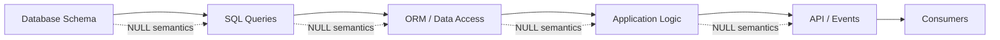

# README

## Overview

This section covers how SQL handles missing, unknown, and non-applicable values through `NULL`.

`NULL` is not an ordinary value such as `0`, `FALSE`, or an empty string. It participates in SQL's three-valued logic, which affects comparisons, predicates, joins, aggregates, expressions, and database-specific functions.

The material progresses from the mechanics of `NULL` through practical query behavior and finally into production-oriented design rules and common failure modes.

## Navigation

- [01- Understanding NULL](./01-%20Understanding%20NULL.md) — What NULL means in SQL and how it differs from zero or empty
- [02- NULL vs Empty String vs Blank Space](./02-%20NULL%20vs%20Empty%20String%20vs%20Blank%20Space.md) — Distinguishing missing, empty, and whitespace-only values
- [03- Three-Valued Logic](./03-%20Three-Valued%20Logic.md) — TRUE, FALSE, UNKNOWN, and predicate evaluation involving NULL
- [04- IS NULL and IS NOT NULL](./04-%20IS%20NULL%20and%20IS%20NOT%20NULL.md) — Correctly testing for NULL values
- [05- NULL with Comparison Operators](./05-%20NULL%20with%20Comparison%20Operators.md) — Why =, <>, and related operators produce UNKNOWN with NULL
- [06- NULL with Logical Operators](./06-%20NULL%20with%20Logical%20Operators.md) — AND, OR, and NOT behavior under three-valued logic
- [07- NULL with Aggregates](./07-%20NULL%20with%20Aggregates.md) — NULL behavior with COUNT, SUM, AVG, MIN, and MAX
- [08- NULL with JOINs](./08-%20NULL%20with%20JOINs.md) — NULLs in join predicates, outer joins, and unmatched rows
- [09- COALESCE](./09-%20COALESCE.md) — Replacing NULL with an explicitly chosen fallback value
- [10- ISNULL and Database-Specific Functions](./10-%20ISNULL%20and%20Database-Specific%20Functions.md) — ISNULL and other vendor-specific NULL-handling functions
- [11- NULLIF](./11-%20NULLIF.md) — Converting a specific value to NULL and protecting expressions such as division
- [12- IFNULL and Database-Specific Functions](./12-%20IFNULL%20and%20Database-Specific%20Functions.md) — MySQL/SQLite-style NULL replacement and database-specific alternatives
- [13- COALESCE vs ISNULL vs IFNULL](./13-%20COALESCE%20vs%20ISNULL%20vs%20IFNULL.md) — Portability, typing, evaluation behavior, and database-specific trade-offs
- [14- Choosing a NULL Handling Strategy](./14-%20Choosing%20a%20NULL%20Handling%20Strategy.md) — Choosing between schema constraints, predicates, COALESCE, NULLIF, and vendor-specific functions
- [15- NULL Design Rules](./15-%20NULL%20Design%20Rules.md) — Production-oriented rules for schema, queries, APIs, migrations, and data modeling
- [16- Common NULL Mistakes](./16-%20Common%20NULL%20Mistakes.md) — Frequent correctness, performance, ORM, JOIN, aggregate, and API mistakes

## Recommended Reading Order

Read the material in this order:

```text
NULL
  │
  ├── Three-Valued Logic
  │       │
  │       ├── IS NULL / IS NOT NULL
  │       ├── Comparison Operators
  │       └── Logical Operators
  │
  ├── Aggregates
  │
  ├── JOINs
  │
  ├── COALESCE
  │       │
  │       ├── ISNULL
  │       ├── IFNULL
  │       └── Function Comparison
  │
  ├── NULLIF
  │
  ├── Choosing a Strategy
  │
  ├── Design Rules
  │
  └── Common Mistakes
```

The first group establishes the execution semantics. The middle group covers practical query construction and NULL transformation. The final group focuses on production design and failure prevention.

## Core Concepts

### NULL Is Not a Value

`NULL` represents the absence of a known or applicable value. It should not automatically be interpreted as:

- `0`
- `FALSE`
- `''`
- `'UNKNOWN'`
- a missing row

The correct interpretation comes from the domain model.

### NULL Produces UNKNOWN

Ordinary comparisons involving NULL generally produce `UNKNOWN`:

```sql
NULL = 10
NULL <> 10
NULL > 10
NULL = NULL
```

Therefore:

```sql
WHERE column = NULL
```

is not the correct way to find NULL values.

Use:

```sql
WHERE column IS NULL
```

### NULL Changes Query Semantics

NULL can affect:

- `WHERE` filtering
- `JOIN` matching
- `AND` / `OR` / `NOT`
- aggregate calculations
- `GROUP BY`
- `DISTINCT`
- `IN` / `NOT IN`
- arithmetic expressions
- conditional expressions
- application serialization

A query can execute successfully while returning semantically incorrect results.

## Production Perspective

NULL handling should be considered at multiple layers:



A production system should define what NULL means for each important field and preserve that meaning across these boundaries.

For example:

```text
Database:
assigned_agent_id = NULL
        ↓
ORM:
assigned_agent = None
        ↓
Application:
ticket is unassigned
        ↓
API:
"assigned_agent": null
```

The representation changes, but the domain meaning remains consistent.

## Database Portability

The core SQL concepts in this folder are broadly applicable, but NULL-related functions can differ by database.

| Concept | PostgreSQL | MySQL | SQL Server | SQLite |
|---|---|---|---|---|
| NULL test | `IS NULL` | `IS NULL` | `IS NULL` | `IS NULL` |
| NULL replacement | `COALESCE()` | `COALESCE()` | `COALESCE()` | `COALESCE()` |
| Vendor-specific replacement | — | `IFNULL()` | `ISNULL()` | `IFNULL()` |
| Convert matching value to NULL | `NULLIF()` | `NULLIF()` | `NULLIF()` | `NULLIF()` |
| Three-valued logic | Yes | Yes | Yes | Yes |

Prefer standard SQL constructs such as `COALESCE`, `NULLIF`, `IS NULL`, and `IS NOT NULL` when portability matters.

Use vendor-specific functions when their database-specific behavior is deliberately required.

## Backend Engineering Applications

NULL handling appears frequently in backend systems.

### REST APIs

An API may need to distinguish:

```json
{
  "middle_name": null
}
```

from an omitted field:

```json
{}
```

For update operations, these can mean:

```text
null    → explicitly clear the value
omitted → leave the existing value unchanged
```

This distinction should be preserved by application validation and persistence logic.

### Django

Django maps SQL NULL to Python `None`.

A NULL query should use ORM semantics such as:

```python
User.objects.filter(phone_number__isnull=True)
```

rather than treating NULL as an ordinary Python value in SQL expressions.

### FastAPI

When exposing nullable database fields through Pydantic models, explicitly model whether a field can contain `None` and whether omission has a different meaning.

### Reporting and Analytics

NULL semantics directly affect:

```sql
COUNT(*)
COUNT(column)
SUM(column)
AVG(column)
```

For example:

```sql
COUNT(*)
```

counts rows, while:

```sql
COUNT(phone_number)
```

counts only non-NULL phone numbers.

### Microservices and Events

When publishing database-derived data through Kafka or other messaging infrastructure, define whether:

```text
null
```

means:

- value unavailable;
- value intentionally cleared;
- value not applicable;
- producer does not know the value.

Consumers should not have to infer this from SQL behavior.

## Schema Design Principles

Prefer constraints that represent domain invariants.

If a field must always exist:

```sql
email VARCHAR(320) NOT NULL
```

If missingness is meaningful:

```sql
assigned_agent_id BIGINT NULL
```

If a boolean has only two valid states:

```sql
is_active BOOLEAN NOT NULL DEFAULT TRUE
```

Do not introduce NULL merely because the database permits it.

Likewise, do not eliminate NULL merely to simplify queries if the domain genuinely has an unknown or not-applicable state.

## Common Query Review Checklist

When reviewing SQL containing nullable columns, ask:

- Does the query use `IS NULL` / `IS NOT NULL` correctly?
- Could `UNKNOWN` change a `WHERE` predicate?
- Does `NOT IN` involve a nullable expression?
- Does a `LEFT JOIN` have predicates on the optional side?
- Is `COUNT(*)` being confused with `COUNT(column)`?
- Does `COALESCE()` change the meaning of an aggregate?
- Is NULL being confused with zero, false, or empty string?
- Are nullable booleans actually necessary?
- Could a function applied to a column affect index usage?
- Does the ORM preserve the intended NULL semantics?
- Does the API distinguish NULL from an omitted field?
- Is NULL hiding a schema or data-quality problem?

## Production Guidelines

### Prefer Explicit Semantics

Document what NULL means for important domain fields.

For example:

```text
cancelled_at IS NULL
    → order has never been cancelled

assigned_agent_id IS NULL
    → ticket currently has no assigned agent

processed_at IS NULL
    → processing has not completed
```

This is much safer than allowing different services to infer meanings independently.

### Prefer Constraints Over Query Conventions

If a value cannot legitimately be NULL, enforce it:

```sql
ALTER TABLE orders
ALTER COLUMN created_at SET NOT NULL;
```

A database constraint provides a stronger guarantee than expecting every application query to remember the rule.

### Validate Critical Queries With Execution Plans

NULL handling itself is usually not the performance bottleneck, but expressions used for NULL handling can affect optimization.

For important queries, inspect the actual plan:

```sql
EXPLAIN (ANALYZE, BUFFERS)
SELECT *
FROM orders
WHERE status = 'active';
```

Avoid optimizing based solely on intuition.

### Treat NULL as Part of the Contract

For production systems, NULL semantics should remain consistent across:

```text
Schema
  ↓
SQL
  ↓
ORM
  ↓
Application
  ↓
API
  ↓
Events
  ↓
Consumers
```

Changing the meaning of NULL at one boundary can create difficult-to-diagnose distributed-system bugs.


## Key Takeaways

- **Understand NULL as a distinct SQL state governed by three-valued logic, not as zero, false, or an empty value.**
- **Use explicit NULL predicates and carefully reason about NULL in comparisons, logical expressions, joins, and aggregates.**
- **Prefer portable constructs such as `COALESCE()`, `NULLIF()`, `IS NULL`, and `IS NOT NULL` unless database-specific behavior is intentional.**
- **Define NULL semantics at the schema level and preserve those semantics through ORMs, backend services, APIs, and event-driven systems.**
- **Use constraints and deliberate data modeling to prevent NULL from becoming an accidental source of production bugs.**