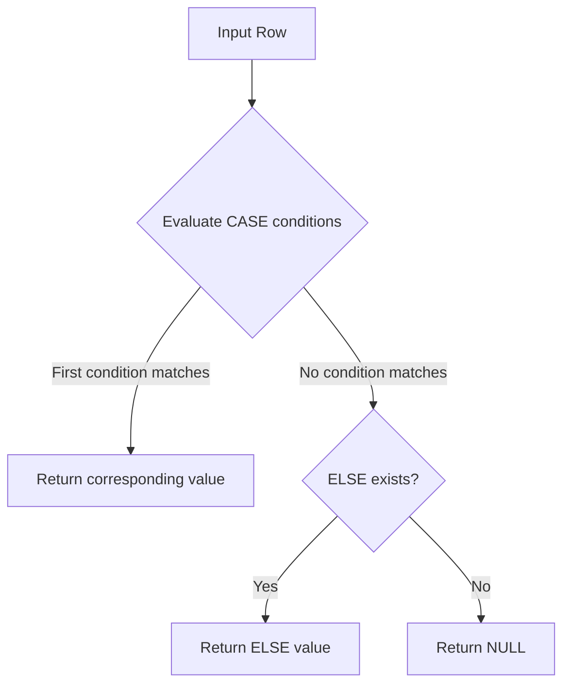

|  |  |
| --- | --- |
| What does `CASE` return? | A value; it is an SQL expression |
| What happens if no `WHEN` matches? | `ELSE` is returned; without `ELSE`, the result is `NULL` |
| Does `WHEN` order matter? | Yes. The first matching condition determines the result |
| How should `NULL` be tested? | Use `IS NULL` or `IS NOT NULL`, not `= NULL` |
| Can `CASE` be used in `SELECT`? | Yes. This is one of its most common uses |
| Can `CASE` be used in `ORDER BY`? | Yes. It is useful for custom business ordering |
| Can `CASE` be used in aggregates? | Yes. It enables conditional aggregation |
| Is `CASE` procedural control flow? | No. It is an expression that evaluates to a value |
| Should every query use `CASE` for filtering? | No. A direct predicate is usually clearer when no value transformation is required |

## Production Checklist

Before deploying non-trivial `CASE` logic, verify:

- Conditions are ordered from the most specific to the most general where overlap is possible.
- Boundary values have been explicitly tested.
- `NULL` behavior is intentional.
- An `ELSE` branch exists unless returning `NULL` is deliberate.
- All branches produce compatible data types.
- Repeated business rules are not independently implemented across multiple services.
- Large static mappings have been evaluated for a lookup or reference table.
- Queries containing expensive `CASE` expressions have been checked with `EXPLAIN`.
- SQL generated by Django or another ORM still matches the intended database behavior.
- Tests cover normal, boundary, `NULL`, unexpected, and overlapping cases.

## Key Takeaways

- `CASE` is a value-producing SQL expression used for conditional transformation and classification.
- In searched `CASE`, conditions are evaluated in order and the first matching condition determines the result.
- Always make `NULL`, unmatched rows, overlapping conditions, and boundary values explicit.
- Prefer direct predicates for simple filtering instead of unnecessarily wrapping conditions in `CASE`.
- Move large or frequently changing rule sets into reference data or domain logic when a `CASE` expression becomes difficult to maintain.
```
```

| Question | Correct Reasoning |
| --- | --- |
| What happens if no `WHEN` matches? | `ELSE` is returned; without `ELSE`, the result is `NULL` |
| Does `WHEN` order matter? | Yes. The first matching condition determines the result |
| How should `NULL` be tested? | Use `IS NULL` or `IS NOT NULL`, not `= NULL` |
| Can `CASE` be used in `SELECT`? | Yes. It is commonly used to derive values and classifications |
| Can `CASE` be used in `ORDER BY`? | Yes. It can implement custom sort precedence |
| Can `CASE` be used in aggregates? | Yes. It enables conditional aggregation |
| Is `CASE` procedural control flow? | No. It is an expression that produces a value |
| Should `CASE` always be used for filtering? | No. A direct predicate is usually clearer when no value transformation is required |

## Production Checklist

Before deploying non-trivial `CASE` logic, verify:

* Conditions are ordered from the most specific to the most general where overlap is possible.
* Boundary values have been explicitly tested.
* `NULL` behavior is intentional.
* An `ELSE` branch exists unless returning `NULL` is deliberate.
* All branches produce compatible data types.
* Repeated business rules are not independently implemented across multiple services.
* Large static mappings have been evaluated for a lookup or reference table.
* Queries containing expensive expressions have been checked with `EXPLAIN`.
* SQL generated by Django or another ORM still matches the intended database behavior.
* Tests cover normal, boundary, `NULL`, unexpected, and overlapping cases.

## Key Takeaways

* `CASE` is a value-producing SQL expression used for conditional transformation and classification.
* `WHEN` clauses are evaluated in order, so overlapping conditions must be deliberately ordered.
* Explicitly handle `NULL`, unmatched rows, boundaries, and unexpected values.
* Prefer direct predicates for simple filtering rather than wrapping filters unnecessarily in `CASE`.
* Move large or frequently changing rule sets into reference data or domain logic when `CASE` becomes difficult to maintain.

```
Markdown


```
# 01- CASE WHEN Introduction

## Overview

`CASE` is SQL's primary conditional expression. It evaluates one or more conditions and returns a value based on the first condition that matches.

Unlike procedural `if/elif/else` statements, `CASE` is an **expression**, so it can appear wherever an expression is valid: `SELECT`, `ORDER BY`, `GROUP BY`, aggregates, `UPDATE`, `INSERT`, and sometimes `WHERE` or `JOIN` logic.

For backend systems, `CASE` is particularly useful when the database already has the data required to derive a classification, display value, priority, bucket, or conditional metric. It allows transformation close to the data and can avoid unnecessary application-side processing.



A typical example:

```sql
SELECT
    order_id,
    CASE
        WHEN total_amount >= 10000 THEN 'high'
        WHEN total_amount >= 5000 THEN 'medium'
        ELSE 'low'
    END AS order_segment
FROM orders;
```

The important engineering property is that `CASE` **returns a value**. It does not directly control whether a row is returned.

---

## Why CASE Matters

Backend applications frequently need derived values:

- Order risk classification
- Customer segmentation
- HTTP/API response categories
- Payment status normalization
- Priority calculation
- SLA buckets
- Conditional aggregates
- Custom sorting
- Data migration transformations
- Reporting dimensions

Without `CASE`, developers often move this logic into Python, Django, or another application layer.

For example, an application could fetch every order and classify it in Python:

```python
def classify_order(total_amount: int) -> str:
    if total_amount >= 10_000:
        return "high"
    if total_amount >= 5_000:
        return "medium"
    return "low"
```

That can be appropriate when classification is application-specific. However, if the classification is required for filtering, grouping, aggregation, sorting, or reporting, performing it in SQL can be more efficient and easier to compose with the rest of the query.

---

## CASE Syntax

There are two major forms of `CASE`.

### Searched CASE

The searched form evaluates independent boolean conditions.

```sql
CASE
    WHEN condition_1 THEN result_1
    WHEN condition_2 THEN result_2
    ELSE default_result
END
```

Example:

```sql
SELECT
    customer_id,
    CASE
        WHEN lifetime_value >= 100000 THEN 'enterprise'
        WHEN lifetime_value >= 25000 THEN 'growth'
        ELSE 'standard'
    END AS customer_tier
FROM customers;
```

This is the most flexible form and is generally the preferred form for business rules.

### Simple CASE

The simple form compares one expression against multiple values.

```sql
CASE expression
    WHEN value_1 THEN result_1
    WHEN value_2 THEN result_2
    ELSE default_result
END
```

Example:

```sql
SELECT
    order_id,
    CASE status
        WHEN 'pending' THEN 'awaiting_payment'
        WHEN 'paid' THEN 'processing'
        WHEN 'shipped' THEN 'in_transit'
        WHEN 'cancelled' THEN 'inactive'
        ELSE 'unknown'
    END AS normalized_status
FROM orders;
```

Simple `CASE` is concise when the logic is equality-based.

| Form | Best suited for |
| --- | --- |
| Searched `CASE` | Ranges, boolean conditions, compound rules, `NULL` handling |
| Simple `CASE` | Equality mapping from one expression to several values |

---

## Evaluation Order

`WHEN` clauses are evaluated in order. The first matching branch determines the result.

Consider:

```sql
SELECT
    CASE
        WHEN amount >= 1000 THEN 'large'
        WHEN amount >= 500 THEN 'medium'
        ELSE 'small'
    END AS category
FROM payments;
```

An amount of `1500` matches both conditions, but the result is `large` because the first condition matches.

Therefore, overlapping conditions must be deliberately ordered.

### Incorrect Ordering

```sql
CASE
    WHEN amount >= 500 THEN 'medium'
    WHEN amount >= 1000 THEN 'large'
    ELSE 'small'
END
```

An amount of `1500` becomes `medium`, because the broader condition is evaluated first.

### Correct Ordering

```sql
CASE
    WHEN amount >= 1000 THEN 'large'
    WHEN amount >= 500 THEN 'medium'
    ELSE 'small'
END
```

A useful rule is:

> Put more specific conditions before broader conditions.

---

## ELSE and Unmatched Rows

`ELSE` defines what happens when no `WHEN` condition matches.

```sql
CASE
    WHEN status = 'active' THEN 'enabled'
    WHEN status = 'suspended' THEN 'blocked'
    ELSE 'unknown'
END
```

If `ELSE` is omitted and no condition matches, the result is `NULL`.

```sql
CASE
    WHEN status = 'active' THEN 'enabled'
END
```

This can be intentional, but omitting `ELSE` accidentally is a common source of data-quality bugs.

For production classification logic, an explicit `ELSE` is usually preferable:

```sql
CASE
    WHEN status = 'active' THEN 'enabled'
    WHEN status = 'suspended' THEN 'blocked'
    ELSE 'unknown'
END
```

An explicit fallback also makes unexpected states visible to downstream systems.

---

## CASE Is an Expression

The distinction between an expression and procedural control flow is important.

`CASE` can produce a value:

```sql
SELECT
    CASE
        WHEN is_active THEN 'active'
        ELSE 'inactive'
    END AS account_state
FROM accounts;
```

That value can then be consumed by another SQL operation.

For example:

```sql
SELECT
    CASE
        WHEN total_amount >= 10000 THEN 'high'
        ELSE 'normal'
    END AS segment,
    COUNT(*) AS order_count
FROM orders
GROUP BY
    CASE
        WHEN total_amount >= 10000 THEN 'high'
        ELSE 'normal'
    END;
```

The database evaluates the expression for rows and then groups the resulting values.

---

## CASE in SELECT

The most common use is deriving a value for each returned row.

```sql
SELECT
    user_id,
    last_login_at,
    CASE
        WHEN last_login_at IS NULL THEN 'never_logged_in'
        WHEN last_login_at < CURRENT_TIMESTAMP - INTERVAL '90 days'
            THEN 'inactive'
        ELSE 'active'
    END AS activity_status
FROM users;
```

This is useful when the database can calculate the representation required by the API or reporting query.

A Django application can also express similar logic using conditional expressions:

```python
from django.db.models import Case, CharField, Value, When

users = User.objects.annotate(
    activity_status=Case(
        When(last_login__isnull=True, then=Value("never_logged_in")),
        default=Value("active"),
        output_field=CharField(),
    )
)
```

The exact SQL generated depends on the ORM and database backend, so production queries should still be inspected when performance matters.

---

## CASE in ORDER BY

`CASE` can implement business-specific ordering.

Suppose an operations dashboard should display incidents in this order:

1. Critical
2. High
3. Medium
4. Low

Alphabetical sorting does not provide that order.

```sql
SELECT
    incident_id,
    severity,
    created_at
FROM incidents
ORDER BY
    CASE severity
        WHEN 'critical' THEN 1
        WHEN 'high' THEN 2
        WHEN 'medium' THEN 3
        WHEN 'low' THEN 4
        ELSE 5
    END,
    created_at ASC;
```

This is useful for dashboards and operational workflows where business priority differs from lexical or numeric ordering.

For very large datasets, inspect the execution plan. A computed sort expression may require additional work and can limit the usefulness of an index for ordering.

---

## CASE in GROUP BY

`CASE` can create logical buckets from raw data.

```sql
SELECT
    CASE
        WHEN amount < 1000 THEN 'small'
        WHEN amount < 10000 THEN 'medium'
        ELSE 'large'
    END AS order_size,
    COUNT(*) AS order_count
FROM orders
GROUP BY
    CASE
        WHEN amount < 1000 THEN 'small'
        WHEN amount < 10000 THEN 'medium'
        ELSE 'large'
    END;
```

This converts continuous numeric data into discrete reporting categories.

For complex reporting systems, consider whether the bucket definition belongs in SQL or should be represented by a maintained dimension or mapping table.

---

## CASE with Aggregates

`CASE` is commonly used for conditional aggregation.

For example, count completed orders:

```sql
SELECT
    COUNT(
        CASE
            WHEN status = 'completed' THEN 1
        END
    ) AS completed_orders
FROM orders;
```

A clearer and widely supported alternative is:

```sql
SELECT
    SUM(
        CASE
            WHEN status = 'completed' THEN 1
            ELSE 0
        END
    ) AS completed_orders
FROM orders;
```

Some databases also provide `FILTER` syntax, such as PostgreSQL:

```sql
SELECT
    COUNT(*) FILTER (WHERE status = 'completed') AS completed_orders,
    COUNT(*) FILTER (WHERE status = 'cancelled') AS cancelled_orders
FROM orders;
```

When targeting multiple database engines, `CASE` is often the more portable technique.

---

## CASE for Conditional Metrics

Consider an order table with `amount` and `status`.

```sql
SELECT
    SUM(
        CASE
            WHEN status = 'completed' THEN amount
            ELSE 0
        END
    ) AS completed_revenue
FROM orders;
```

This calculates revenue only from completed orders.

Multiple metrics can be calculated in one query:

```sql
SELECT
    COUNT(*) AS total_orders,
    SUM(
        CASE
            WHEN status = 'completed' THEN 1
            ELSE 0
        END
    ) AS completed_orders,
    SUM(
        CASE
            WHEN status = 'cancelled' THEN 1
            ELSE 0
        END
    ) AS cancelled_orders,
    SUM(
        CASE
            WHEN status = 'completed' THEN amount
            ELSE 0
        END
    ) AS completed_revenue
FROM orders;
```

This is particularly useful for dashboards and operational reporting because several metrics can be computed during one database operation.

---

## CASE and NULL

`NULL` requires deliberate handling because comparisons involving `NULL` do not behave like ordinary equality comparisons.

This does not correctly detect `NULL`:

```sql
CASE
    WHEN shipped_at = NULL THEN 'not_shipped'
    ELSE 'shipped'
END
```

Use:

```sql
CASE
    WHEN shipped_at IS NULL THEN 'not_shipped'
    ELSE 'shipped'
END
```

Similarly:

```sql
CASE
    WHEN shipped_at IS NOT NULL THEN 'shipped'
    ELSE 'not_shipped'
END
```

`NULL` can also cause a condition to evaluate to `UNKNOWN`, meaning that it does not satisfy a `WHEN` condition.

For example:

```sql
CASE
    WHEN shipped_at > CURRENT_TIMESTAMP THEN 'future'
    ELSE 'complete'
END
```

If `shipped_at` is `NULL`, the comparison is not `TRUE`, so the `ELSE` branch is selected.

If `NULL` represents a distinct domain state, handle it explicitly:

```sql
CASE
    WHEN shipped_at IS NULL THEN 'not_shipped'
    WHEN shipped_at > CURRENT_TIMESTAMP THEN 'future'
    ELSE 'shipped'
END
```

---

## CASE with Multiple Conditions

Conditions can use normal SQL boolean logic.

```sql
SELECT
    customer_id,
    CASE
        WHEN is_active = TRUE
             AND lifetime_value >= 100000
            THEN 'strategic'
        WHEN is_active = TRUE
             AND lifetime_value >= 25000
            THEN 'growth'
        WHEN is_active = TRUE
            THEN 'standard'
        ELSE 'inactive'
    END AS customer_segment
FROM customers;
```

This can encode multi-dimensional business rules directly in SQL.

However, readability becomes increasingly important as conditions grow. If a rule requires many nested conditions, repeated expressions, or dozens of branches, consider whether SQL is still the right place to represent the rule.

---

## Nested CASE

`CASE` expressions can be nested:

```sql
SELECT
    CASE
        WHEN is_active = TRUE THEN
            CASE
                WHEN lifetime_value >= 100000 THEN 'strategic'
                WHEN lifetime_value >= 25000 THEN 'growth'
                ELSE 'standard'
            END
        ELSE 'inactive'
    END AS customer_segment
FROM customers;
```

Nested expressions can be useful for genuinely hierarchical rules, but they quickly become difficult to review.

Often, a flat searched `CASE` is easier to understand:

```sql
CASE
    WHEN is_active = FALSE THEN 'inactive'
    WHEN lifetime_value >= 100000 THEN 'strategic'
    WHEN lifetime_value >= 25000 THEN 'growth'
    ELSE 'standard'
END
```

Prefer the simplest expression that makes the rule unambiguous.

---

## Data Type Compatibility

All possible `CASE` results should be compatible with the database's type system.

This is reasonable:

```sql
CASE
    WHEN status = 'paid' THEN 'completed'
    ELSE 'pending'
END
```

This can cause type-resolution problems or implicit conversions:

```sql
CASE
    WHEN status = 'paid' THEN 'completed'
    ELSE 0
END
```

The exact behavior varies by database because SQL engines have different type-resolution rules.

For production SQL, keep branch result types intentional and consistent.

---

## CASE and Data Transformation

`CASE` is useful when raw database values must be translated into a stable representation.

For example:

```sql
SELECT
    subscription_id,
    CASE
        WHEN status = 'trialing' THEN 'trial'
        WHEN status = 'active' THEN 'active'
        WHEN status = 'past_due' THEN 'attention_required'
        WHEN status = 'cancelled' THEN 'inactive'
        ELSE 'unknown'
    END AS api_status
FROM subscriptions;
```

This can be useful when a database schema contains internal states but an API exposes a smaller, stable vocabulary.

However, avoid hiding important domain states accidentally. The `ELSE 'unknown'` branch should be observable if unexpected database values indicate data corruption or an incomplete migration.

---

## CASE in UPDATE Statements

`CASE` can transform existing data during controlled migrations.

Example:

```sql
UPDATE customers
SET risk_level = CASE
    WHEN fraud_score >= 90 THEN 'high'
    WHEN fraud_score >= 60 THEN 'medium'
    ELSE 'low'
END;
```

For large production tables, do not assume that one massive update is operationally harmless.

Consider:

- Transaction duration
- Locking
- Replication lag
- WAL/binlog volume
- Database CPU and I/O
- Application traffic
- Rollback cost
- Batch size

A migration framework such as Django migrations should be designed carefully for large datasets rather than treating the SQL expression itself as the only concern.

---

## CASE in WHERE

`CASE` can technically be used to produce a value that participates in a predicate:

```sql
SELECT *
FROM orders
WHERE
    CASE
        WHEN status = 'completed' THEN 1
        ELSE 0
    END = 1;
```

But this is unnecessarily indirect.

Prefer:

```sql
SELECT *
FROM orders
WHERE status = 'completed';
```

The direct predicate is clearer and usually gives the optimizer a better expression to work with.

Use `CASE` primarily when you need to **derive a value**, not merely express a boolean filter.

---

## CASE in JOIN Conditions

`CASE` can appear in join logic, but this should be approached carefully.

Example:

```sql
SELECT
    o.order_id,
    p.policy_id
FROM orders AS o
JOIN pricing_policies AS p
    ON p.customer_type =
       CASE
           WHEN o.lifetime_value >= 100000 THEN 'enterprise'
           WHEN o.lifetime_value >= 25000 THEN 'business'
           ELSE 'standard'
       END;
```

This can be useful for derived relationships, but computed join keys can complicate query planning and indexing.

If the classification is stable and frequently queried, consider materializing the classification or modeling the relationship explicitly.

---

## CASE and Query Performance

`CASE` itself is not inherently slow. Performance depends on:

- Number of rows processed
- Complexity of expressions
- Whether functions are invoked repeatedly
- Whether sorting or grouping is performed on the result
- Whether the expression prevents efficient index usage
- Whether the result is calculated before or after filtering
- Database optimizer behavior

For example, this query should normally be preferred:

```sql
SELECT *
FROM orders
WHERE status = 'completed';
```

over:

```sql
SELECT *
FROM orders
WHERE CASE
    WHEN status = 'completed' THEN 1
    ELSE 0
END = 1;
```

The first form directly expresses the predicate and can make index usage more straightforward.

When a query becomes performance-sensitive, inspect the actual execution plan:

```sql
EXPLAIN
SELECT
    CASE
        WHEN amount >= 10000 THEN 'high'
        ELSE 'normal'
    END AS segment
FROM orders;
```

For PostgreSQL production diagnostics, `EXPLAIN (ANALYZE, BUFFERS)` can provide substantially more information, but it executes the query and therefore must be used carefully on write statements and production systems.

---

## CASE and Business Logic Ownership

A senior engineering concern is not merely whether SQL can express a rule, but **where the rule should live**.

Consider a customer tier:

```text
lifetime_value >= 100000 → enterprise
lifetime_value >= 25000  → growth
otherwise                → standard
```

There are several possible owners:

| Location | Good fit |
| --- | --- |
| SQL `CASE` | Reporting, filtering, aggregation, database-side transformation |
| Django/Python | Application behavior and domain workflows |
| Reference table | Frequently changing, data-driven rules |
| Materialized column | Frequently queried stable classification |
| Analytics warehouse | Reporting-specific segmentation |

Duplicating the same rule in SQL, Python, Kafka consumers, and reporting jobs is dangerous.

The system can eventually have multiple definitions of "enterprise customer."

Prefer one authoritative definition where the business rule has significant downstream impact.

---

## CASE vs Application-Side Logic

Moving a rule into SQL is not automatically better.

### Prefer SQL when

- The result is required for filtering or grouping.
- The result is required for aggregation.
- The transformation is naturally relational.
- Large numbers of rows would otherwise be transferred to the application.
- Reporting or analytics needs the derived value.
- The logic is tightly coupled to database values.

### Prefer application code when

- The rule is part of complex domain behavior.
- The result depends on external services.
- The rule is difficult to test or maintain in SQL.
- The logic is reused across database and non-database workflows.
- Domain behavior needs richer abstractions than SQL expressions provide.

A useful boundary is:

> Use SQL for data-oriented transformation; use application/domain code for behavior that extends beyond the database.

---

## Production Example: Order Operations Dashboard

A backend service may need to display operational priority:

```sql
SELECT
    order_id,
    status,
    total_amount,
    CASE
        WHEN status = 'payment_failed' THEN 'critical'
        WHEN status = 'pending'
             AND created_at < CURRENT_TIMESTAMP - INTERVAL '30 minutes'
            THEN 'high'
        WHEN status = 'pending' THEN 'normal'
        WHEN status = 'completed' THEN 'none'
        ELSE 'review'
    END AS operational_priority
FROM orders
WHERE created_at >= CURRENT_TIMESTAMP - INTERVAL '24 hours';
```

The `WHERE` clause first limits the working set to recent orders, while `CASE` derives the operational priority.

This separation is important:

- `WHERE` determines which rows are relevant.
- `CASE` determines the value derived for each relevant row.

If this query powers a high-traffic dashboard, consider whether the classification should be precomputed, indexed, or represented in an operational read model.

---

## Production Example: API Response Mapping

Suppose a REST API exposes a stable status model while the database has more detailed internal states:

```sql
SELECT
    payment_id,
    CASE
        WHEN status IN ('authorized', 'captured') THEN 'successful'
        WHEN status IN ('pending', 'processing') THEN 'pending'
        WHEN status IN ('failed', 'declined') THEN 'failed'
        WHEN status = 'refunded' THEN 'refunded'
        ELSE 'unknown'
    END AS api_status
FROM payments;
```

This is useful when the SQL result feeds an API read model.

However, if the mapping is a core domain contract shared by REST, gRPC, Kafka events, and background workers, centralizing the mapping in a domain component may be more appropriate than embedding it in every query.

---

## Common Mistakes

### Using CASE Instead of a Direct Predicate

Avoid:

```sql
WHERE CASE
    WHEN status = 'active' THEN 1
    ELSE 0
END = 1
```

when this is sufficient:

```sql
WHERE status = 'active'
```

The direct predicate is clearer and usually gives the optimizer a better expression to work with.

### Forgetting ELSE

This:

```sql
CASE
    WHEN status = 'active' THEN 'enabled'
    WHEN status = 'suspended' THEN 'blocked'
END
```

returns `NULL` for unexpected states.

If that is not intentional, use:

```sql
CASE
    WHEN status = 'active' THEN 'enabled'
    WHEN status = 'suspended' THEN 'blocked'
    ELSE 'unknown'
END
```

### Ignoring NULL

This:

```sql
CASE
    WHEN shipped_at > CURRENT_TIMESTAMP THEN 'future'
    ELSE 'complete'
END
```

does not distinguish `NULL` from a genuinely completed shipment.

If `NULL` has domain meaning:

```sql
CASE
    WHEN shipped_at IS NULL THEN 'not_shipped'
    WHEN shipped_at > CURRENT_TIMESTAMP THEN 'future'
    ELSE 'shipped'
END
```

### Incorrect Condition Ordering

A broad condition can make later branches unreachable.

```sql
CASE
    WHEN amount >= 100 THEN 'large'
    WHEN amount >= 1000 THEN 'very_large'
    ELSE 'small'
END
```

The second branch can never be reached for values above `1000`.

Order the more specific condition first:

```sql
CASE
    WHEN amount >= 1000 THEN 'very_large'
    WHEN amount >= 100 THEN 'large'
    ELSE 'small'
END
```

### Building Huge CASE Expressions

A `CASE` with dozens or hundreds of hard-coded business rules becomes difficult to test and maintain.

Consider a mapping table when the logic is data-driven:

```text
rule_id | min_value | max_value | category
--------+-----------+-----------+---------
1       | 0         | 9999      | standard
2       | 10000     | 99999     | growth
3       | 100000    | NULL      | enterprise
```

The exact schema depends on the rule model, but the principle is to treat frequently changing configuration as data rather than application code embedded in SQL.

### Duplicating Business Rules

If the same classification is independently implemented in:

- SQL
- Django
- FastAPI
- Kafka consumers
- reporting jobs

the system can eventually produce inconsistent answers.

Establish a clear owner for important domain rules and test all integration points against that definition.

### Assuming CASE Guarantees Evaluation of Every Branch

SQL optimizers may transform expressions, and database engines have different evaluation guarantees around expression evaluation and errors. Do not use `CASE` as a general-purpose mechanism to guarantee that an arbitrary problematic expression is never evaluated in every database context.

For example, avoid relying on subtle evaluation behavior to protect unsafe operations. Prefer explicit data constraints, appropriate functions, and database-specific documented behavior.

---

## Testing CASE Logic

Business classifications should be tested at their boundaries.

For:

```sql
CASE
    WHEN amount >= 10000 THEN 'high'
    WHEN amount >= 5000 THEN 'medium'
    ELSE 'low'
END
```

test at least:

| Input | Expected |
| ---: | --- |
| `NULL` | Depends on explicit domain policy |
| `0` | `low` |
| `4999` | `low` |
| `5000` | `medium` |
| `9999` | `medium` |
| `10000` | `high` |
| `10001` | `high` |

Boundary tests are especially important because most classification defects occur around inclusive/exclusive thresholds.

For application code using Django or SQLAlchemy, include database-backed tests for important SQL expressions rather than testing only an equivalent Python implementation. An equivalent Python function does not prove that the generated SQL has the intended semantics.

---

## Interview Traps

| Question | Correct Reasoning |
| --- | --- |
| What does `CASE` return? | A value; it is an SQL expression |
| What happens when no `WHEN` matches? | `ELSE` is returned, or `NULL` if `ELSE` is omitted |
| Does `WHEN` order matter? | Yes; the first matching condition determines the result |
| Can `CASE` be used in `SELECT`? | Yes |
| Can `CASE` be used in `ORDER BY`? | Yes |
| Can `CASE` be used in aggregates? | Yes; it is commonly used for conditional aggregation |
| Is `CASE` the SQL equivalent of a procedural `if` statement? | Conceptually similar, but technically it is an expression, not procedural control flow |
| How should `NULL` be checked? | Use `IS NULL` or `IS NOT NULL` |
| Should `CASE` normally be used to filter rows? | No; direct predicates are generally clearer |
| What is the biggest risk with overlapping conditions? | A broad earlier condition can make later conditions unreachable |
| When should a large `CASE` be replaced? | When rules become data-driven, frequently changing, duplicated, or difficult to maintain |

## Operational Considerations

For production workloads:

- Keep `CASE` expressions deterministic and understandable where possible.
- Filter rows before performing expensive transformations when the query semantics allow it.
- Avoid using computed expressions unnecessarily in predicates on large tables.
- Use `EXPLAIN` to validate performance-sensitive queries.
- Test boundary conditions and `NULL` behavior.
- Monitor query latency and database CPU for reporting queries containing complex expressions.
- Consider materialized values or read models when the same expensive classification is computed repeatedly at high volume.
- Keep database-specific behavior isolated when portability across PostgreSQL, MySQL, SQL Server, or other engines matters.
- Treat business rules embedded in SQL as production code: version them, review them, test them, and document their ownership.

## Key Takeaways

- `CASE` is a value-producing SQL expression used for conditional transformation, classification, sorting, grouping, and conditional aggregation.
- `WHEN` clauses are evaluated in order, so overlapping conditions must be deliberately ordered from specific to broad.
- Always define intentional behavior for `NULL`, unmatched values, and boundary conditions; omitted `ELSE` results in `NULL`.
- Prefer direct predicates for simple filtering and inspect execution plans when `CASE` appears in performance-sensitive queries.
- Use `CASE` for data-oriented transformation, but move large, changing, or widely shared business rules into an appropriate authoritative domain or reference-data layer.