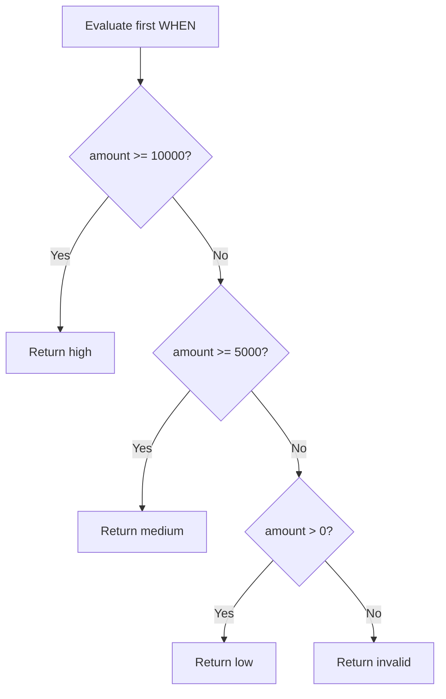

# 04- CASE Evaluation Rules

## Overview

A `CASE` expression is evaluated according to SQL's conditional expression rules. Understanding those rules is essential because the correctness of a `CASE` expression depends not only on its individual conditions, but also on their order, `NULL` semantics, result types, and the interaction between SQL's logical model and the optimizer.

The core rule for searched `CASE` is straightforward:

```sql
CASE
    WHEN condition_1 THEN result_1
    WHEN condition_2 THEN result_2
    ELSE result_default
END
```

The conditions are considered in order. The result associated with the first condition that evaluates to `TRUE` is selected. If no condition is `TRUE`, the `ELSE` result is selected; if there is no `ELSE`, the result is `NULL`.

For backend engineers, the important distinction is between **logical CASE semantics** and assumptions about **physical execution**. You can reason about which result a valid query must produce using the logical rules, but you should not automatically assume that every expression in every unselected branch will never be evaluated during planning or optimization.

---

## Logical Evaluation Order

Consider:

```sql
SELECT
    CASE
        WHEN amount >= 10000 THEN 'high'
        WHEN amount >= 5000 THEN 'medium'
        WHEN amount > 0 THEN 'low'
        ELSE 'invalid'
    END AS value_band
FROM orders;
```

The logical evaluation for a row can be represented as:



For:

```text
amount = 7500
```

the logical result is:

```text
medium
```

because:

```text
amount >= 10000  -> FALSE
amount >= 5000   -> TRUE
```

Once a matching branch determines the result, later `WHEN` conditions are not needed to determine that row's logical result.

---

## First Match Wins

When multiple conditions can be true, the first matching condition wins.

```sql
SELECT
    CASE
        WHEN amount > 0 THEN 'positive'
        WHEN amount >= 10000 THEN 'high'
        ELSE 'other'
    END AS category
FROM orders;
```

For:

```text
amount = 15000
```

both conditions are true:

```text
amount > 0
amount >= 10000
```

The result is:

```text
positive
```

The second condition does not override the first one.

The intended classification should therefore be written as:

```sql
CASE
    WHEN amount >= 10000 THEN 'high'
    WHEN amount > 0 THEN 'positive'
    ELSE 'other'
END
```

### Engineering Rule

When conditions overlap:

> Put the most specific condition before the broader condition.

This is especially important for:

- Pricing tiers
- Risk classifications
- Authorization decisions
- SLA states
- Customer segmentation
- Financial calculations
- Operational statuses

---

## ELSE Evaluation

The `ELSE` branch is the fallback result.

```sql
CASE
    WHEN status = 'paid' THEN 'complete'
    WHEN status = 'pending' THEN 'waiting'
    ELSE 'unknown'
END
```

For:

```text
status = 'cancelled'
```

neither `WHEN` matches, so:

```text
unknown
```

is returned.

Without `ELSE`:

```sql
CASE
    WHEN status = 'paid' THEN 'complete'
    WHEN status = 'pending' THEN 'waiting'
END
```

an unmatched row produces:

```text
NULL
```

### Production Recommendation

Use an explicit `ELSE` when the fallback has business meaning.

For example:

```sql
CASE
    WHEN status = 'paid' THEN 'complete'
    WHEN status = 'pending' THEN 'waiting'
    WHEN status = 'failed' THEN 'error'
    ELSE 'unknown'
END
```

This makes unexpected values visible rather than silently converting them into `NULL`.

However, `ELSE NULL` can be intentional when absence of a result is part of the query's semantics.

---

## TRUE, FALSE, and UNKNOWN

SQL does not use only two-valued boolean logic. Comparisons involving `NULL` can produce `UNKNOWN`.

For example:

```sql
SELECT
    amount > 100
FROM orders;
```

If:

```text
amount = NULL
```

the comparison is not `TRUE` or `FALSE`; it is `UNKNOWN`.

A searched `CASE` selects a `WHEN` branch only when its condition evaluates to `TRUE`.

Therefore:

```sql
CASE
    WHEN amount > 100 THEN 'large'
    ELSE 'not_large'
END
```

will use the `ELSE` branch when `amount` is `NULL`.

If `NULL` has a distinct business meaning:

```sql
CASE
    WHEN amount IS NULL THEN 'missing'
    WHEN amount > 100 THEN 'large'
    ELSE 'small'
END
```

This explicitly distinguishes:

```text
NULL    -> missing
150     -> large
50      -> small
```

---

## Evaluation of AND and OR

Conditions inside `WHEN` can contain compound predicates.

```sql
CASE
    WHEN is_active = TRUE
         AND email_verified = TRUE
        THEN 'trusted'
    WHEN is_active = TRUE
        THEN 'active'
    ELSE 'inactive'
END
```

The result depends on the combined boolean expression.

For complex conditions, remember that `AND` and `OR` have different precedence.

Prefer explicit parentheses:

```sql
CASE
    WHEN is_active = TRUE
         AND (country = 'IN' OR country = 'US')
        THEN 'eligible'
    ELSE 'ineligible'
END
```

This is easier to review and reduces ambiguity when business rules evolve.

---

## CASE Does Not Reorder Conditions

A common misconception is that the database may choose whichever `WHEN` condition is most selective.

For logical `CASE` semantics, branch order determines which matching result wins.

Consider:

```sql
CASE
    WHEN score >= 50 THEN 'pass'
    WHEN score >= 90 THEN 'excellent'
    ELSE 'fail'
END
```

A score of `95` produces:

```text
pass
```

not:

```text
excellent
```

because the first condition already matches.

The database optimizer may transform the physical execution plan, but it cannot change the result semantics of a valid `CASE` expression.

---

## CASE Is an Expression

`CASE` produces a value.

It can therefore appear in many SQL contexts.

### SELECT

```sql
SELECT
    order_id,
    CASE
        WHEN amount >= 10000 THEN 'high'
        ELSE 'standard'
    END AS order_class
FROM orders;
```

### ORDER BY

```sql
SELECT
    ticket_id,
    status
FROM support_tickets
ORDER BY
    CASE
        WHEN status = 'critical' THEN 1
        WHEN status = 'high' THEN 2
        ELSE 3
    END;
```

### GROUP BY

```sql
SELECT
    CASE
        WHEN amount >= 10000 THEN 'high'
        ELSE 'standard'
    END AS category,
    COUNT(*) AS order_count
FROM orders
GROUP BY
    CASE
        WHEN amount >= 10000 THEN 'high'
        ELSE 'standard'
    END;
```

### UPDATE

```sql
UPDATE customers
SET risk_tier = CASE
    WHEN risk_score >= 90 THEN 'high'
    WHEN risk_score >= 50 THEN 'medium'
    ELSE 'low'
END;
```

The important point is that `CASE` transforms an expression's value; it does not itself filter rows.

---

## CASE Does Not Filter Rows

This query:

```sql
SELECT
    order_id,
    CASE
        WHEN status = 'paid' THEN 'include'
        ELSE 'exclude'
    END AS classification
FROM orders;
```

still returns all rows.

`CASE` merely produces:

```text
include
exclude
```

To filter rows:

```sql
SELECT
    order_id
FROM orders
WHERE status = 'paid';
```

Avoid replacing straightforward predicates with `CASE` unnecessarily.

---

## Predicate vs CASE

Avoid:

```sql
WHERE CASE
    WHEN status = 'active' THEN 1
    ELSE 0
END = 1
```

Prefer:

```sql
WHERE status = 'active'
```

The direct predicate is clearer and normally provides the optimizer with a more natural predicate representation.

This also makes index usage easier to reason about.

For example, if an index exists on:

```sql
CREATE INDEX idx_users_status
ON users(status);
```

the direct query:

```sql
SELECT *
FROM users
WHERE status = 'active';
```

is a much clearer candidate for index-based access than wrapping the same condition inside unnecessary conditional logic.

---

## Result Expression Evaluation

Each `THEN` and `ELSE` clause produces a result value.

For example:

```sql
CASE
    WHEN status = 'paid' THEN amount * 0.95
    WHEN status = 'pending' THEN amount
    ELSE 0
END
```

The logical result is determined by the matching branch.

However, do not treat `CASE` as a general-purpose procedural programming construct with guaranteed procedural evaluation behavior for every subexpression.

SQL is declarative, and the optimizer is allowed to transform expressions while preserving the query's defined result.

---

## Constant Expressions and Planning

Some databases may evaluate constant or immutable expressions during query planning rather than waiting for row-by-row execution.

This matters when an expression can fail independently of the row data.

For example:

```sql
SELECT CASE
    WHEN FALSE THEN 1 / 0
    ELSE 0
END;
```

Do not use branch selection as a universal guarantee that an arbitrary problematic expression can never be evaluated.

The exact behavior is database-specific and can depend on constant folding, function volatility, and query planning.

### Safer Pattern

Instead of depending on conditional evaluation to protect arithmetic:

```sql
SELECT
    amount / NULLIF(quantity, 0) AS unit_price
FROM order_items;
```

This expresses the safety requirement directly.

The general principle is:

> Use expressions that are intrinsically safe rather than relying on an optimizer-sensitive evaluation assumption.

---

## Short-Circuit Assumptions

It is common to describe `CASE` as short-circuiting because the first matching branch determines the result.

That is useful for understanding logical behavior:

```sql
CASE
    WHEN condition_a THEN result_a
    WHEN condition_b THEN result_b
    ELSE result_c
END
```

But avoid making broad physical-execution assumptions such as:

> "The database will never evaluate anything in a later branch."

For ordinary row-dependent expressions, this distinction may not affect practical behavior. It becomes important when branches contain:

- Constant expressions
- Volatile functions
- Expensive functions
- User-defined functions
- Expressions capable of raising errors
- Database-specific constructs

Use the database's documented semantics rather than assuming procedural execution.

---

## Function Calls Inside CASE

Consider:

```sql
CASE
    WHEN status = 'active'
        THEN expensive_function(payload)
    ELSE NULL
END
```

It is reasonable to use conditional expressions to avoid unnecessary work in many ordinary cases.

However, expensive functions should still be treated carefully.

For millions of rows, even a function evaluated for a fraction of the dataset may become expensive.

Consider:

```text
10 million rows
x 20% matching rows
= 2 million function evaluations
```

At production scale, inspect:

- Query execution time
- CPU utilization
- Function cost
- Number of rows processed
- Query plan
- Database concurrency

If the derived value is repeatedly needed, materialization or precomputation may be more appropriate.

---

## CASE and NULL Results

A `THEN` branch can deliberately return `NULL`.

```sql
CASE
    WHEN status = 'cancelled' THEN NULL
    ELSE amount
END AS billable_amount
```

This is different from:

```sql
CASE
    WHEN status = 'cancelled' THEN 0
    ELSE amount
END AS billable_amount
```

The distinction can matter significantly.

| Result | Typical Meaning |
| --- | --- |
| `NULL` | Unknown, unavailable, or not applicable |
| `0` | Known numeric value of zero |
| `''` | Known empty string |
| `FALSE` | Known false boolean |

Do not substitute `0` for `NULL` merely to simplify aggregation or application code unless that matches the domain.

---

## CASE and Aggregate Evaluation

Consider:

```sql
SELECT
    SUM(
        CASE
            WHEN status = 'completed' THEN amount
        END
    ) AS completed_revenue
FROM orders;
```

Non-completed rows produce `NULL`, and `SUM` ignores `NULL`.

An explicit zero can be used:

```sql
SELECT
    SUM(
        CASE
            WHEN status = 'completed' THEN amount
            ELSE 0
        END
    ) AS completed_revenue
FROM orders;
```

These may produce the same value for ordinary datasets, but their semantics differ in edge cases.

For example, if there are no matching rows:

```sql
SUM(CASE WHEN ... THEN amount END)
```

can return `NULL`, while:

```sql
SUM(CASE WHEN ... THEN amount ELSE 0 END)
```

can return `0`.

Choose deliberately based on the API or reporting contract.

---

## CASE Result Type Resolution

A `CASE` expression must have a result type compatible with its possible outputs.

For example:

```sql
CASE
    WHEN status = 'active' THEN 'yes'
    ELSE 'no'
END
```

has a text-like result.

But:

```sql
CASE
    WHEN status = 'active' THEN 1
    ELSE 0
END
```

has a numeric result.

Avoid mixing unrelated types:

```sql
CASE
    WHEN status = 'active' THEN 'yes'
    ELSE 0
END
```

Different databases have different type-resolution and implicit-conversion rules. A query that works in one database may fail or behave differently after migration to another.

For production SQL, keep branch result types intentionally compatible.

---

## Evaluation and Data Type Conversion

Implicit conversion can introduce subtle bugs.

For example, mixing numeric and textual representations can cause:

- Conversion errors
- Unexpected comparisons
- Loss of precision
- Index-related issues
- Portability problems

Prefer explicit casts when a conversion is intentional.

PostgreSQL example:

```sql
CASE
    WHEN status = 'active' THEN amount::numeric(12, 2)
    ELSE 0::numeric(12, 2)
END
```

The exact casting syntax is database-specific.

For financial values, do not rely on floating-point conversion merely because the query happens to accept it.

---

## Evaluation with Date and Time Expressions

Consider:

```sql
CASE
    WHEN cancelled_at IS NOT NULL THEN 'cancelled'
    WHEN expires_at <= CURRENT_TIMESTAMP THEN 'expired'
    ELSE 'active'
END
```

The first condition has priority.

An order that is both:

```text
cancelled
```

and:

```text
expired
```

will be classified as:

```text
cancelled
```

because that condition appears first.

This makes branch ordering a representation of domain precedence.

When such precedence is business-critical, document and test it explicitly.

---

## Evaluation Rules for Classification

For classification logic, a useful review process is:

1. Identify all possible input states.
2. Identify conditions that overlap.
3. Determine which condition should have priority.
4. Put higher-priority conditions first.
5. Define the fallback explicitly.
6. Test boundary values.
7. Test `NULL`.
8. Test unexpected values.

For example:

```sql
CASE
    WHEN deleted_at IS NOT NULL THEN 'deleted'
    WHEN suspended_at IS NOT NULL THEN 'suspended'
    WHEN is_active = TRUE THEN 'active'
    ELSE 'inactive'
END
```

The precedence is visible directly in the query:

```text
deleted > suspended > active > inactive
```

---

## Testing CASE Evaluation

A `CASE` expression should be tested against representative boundaries rather than only a normal example.

For a tiered rule:

```sql
CASE
    WHEN score >= 90 THEN 'excellent'
    WHEN score >= 50 THEN 'pass'
    ELSE 'fail'
END
```

test at least:

| Input | Expected |
| ---: | --- |
| `NULL` | `fail` |
| `0` | `fail` |
| `49` | `fail` |
| `50` | `pass` |
| `89` | `pass` |
| `90` | `excellent` |
| `100` | `excellent` |

For production systems, boundary testing is particularly important for:

- Billing
- Tax
- Discounts
- Authorization
- Rate limiting
- Risk scoring
- SLA classification

---

## CASE Evaluation in Production Queries

A senior engineer should inspect more than the correctness of the expression.

Ask:

- Is the condition correct?
- Are branches ordered correctly?
- Is `NULL` handled intentionally?
- Is the fallback correct?
- Are result types compatible?
- Is the expression evaluated over millions of rows?
- Is it inside a `WHERE`, `JOIN`, `GROUP BY`, or `ORDER BY`?
- Could a direct predicate express the same logic?
- Is the rule duplicated elsewhere?
- Should the result be materialized?
- Is the rule stable enough to belong in SQL?

For large workloads, inspect the actual execution plan.

PostgreSQL example:

```sql
EXPLAIN (ANALYZE, BUFFERS)
SELECT
    order_id,
    CASE
        WHEN amount >= 10000 THEN 'high'
        WHEN amount >= 5000 THEN 'medium'
        ELSE 'low'
    END AS value_band
FROM orders
WHERE tenant_id = 42;
```

This helps determine whether the overall query is spending time on:

- Sequential scans
- Index scans
- Sorting
- Aggregation
- Joins
- Expression evaluation

Do not optimize a `CASE` expression in isolation when the real bottleneck is elsewhere in the query plan.

---

## CASE in ORM-Generated SQL

Frameworks such as Django can generate searched `CASE` expressions.

```python
from django.db.models import Case, CharField, Value, When

orders = Order.objects.annotate(
    value_band=Case(
        When(amount__gte=10000, then=Value("high")),
        When(amount__gte=5000, then=Value("medium")),
        default=Value("low"),
        output_field=CharField(),
    )
)
```

The same evaluation rules still apply because the database ultimately evaluates the generated SQL.

For complex ORM expressions:

1. Inspect the generated SQL.
2. Verify the generated predicates.
3. Check the result type.
4. Test `NULL` and boundaries.
5. Run an execution plan against production-like data.

The ORM does not change SQL's conditional semantics.

---

## CASE and Query Optimization

A `CASE` in a projection is usually less concerning than a `CASE` embedded in a predicate, join key, grouping expression, or sort key.

Compare:

```sql
SELECT
    order_id,
    CASE
        WHEN status = 'paid' THEN 'complete'
        ELSE 'other'
    END AS state
FROM orders
WHERE tenant_id = 42;
```

with:

```sql
SELECT
    order_id
FROM orders
WHERE CASE
    WHEN status = 'paid' THEN 1
    ELSE 0
END = 1;
```

The second query unnecessarily transforms the predicate.

Prefer expressing filtering logic directly:

```sql
WHERE status = 'paid'
```

When a computed expression is genuinely required, verify the execution plan instead of assuming it is or is not indexable.

---

## Common Evaluation Mistakes

### Assuming the Most Specific Condition Automatically Wins

It does not.

```sql
CASE
    WHEN score >= 50 THEN 'pass'
    WHEN score >= 90 THEN 'excellent'
END
```

A score of `95` returns `pass`.

Correct:

```sql
CASE
    WHEN score >= 90 THEN 'excellent'
    WHEN score >= 50 THEN 'pass'
    ELSE 'fail'
END
```

### Treating UNKNOWN as FALSE Everywhere

SQL's `UNKNOWN` is not the same as ordinary `FALSE`.

Explicitly handle `NULL` when it has business significance:

```sql
CASE
    WHEN score IS NULL THEN 'unrated'
    WHEN score >= 90 THEN 'excellent'
    ELSE 'standard'
END
```

### Assuming ELSE Is Optional in Business Logic

Technically it is optional.

Operationally, omitting it may hide unexpected states behind `NULL`.

Use:

```sql
ELSE 'unknown'
```

when unexpected input should remain visible.

### Assuming CASE Is Procedural

`CASE` is an SQL expression, not a procedural `if/elif/else` statement.

Do not assume that the database must physically execute expressions in the same order as a procedural program.

### Using CASE to Hide Predicates

Avoid:

```sql
WHERE CASE
    WHEN status = 'active' THEN TRUE
    ELSE FALSE
END
```

Prefer:

```sql
WHERE status = 'active'
```

### Ignoring Result Types

Do not mix unrelated branch result types and rely on implicit conversion.

Keep the result domain explicit and predictable.

---

## Production Review Checklist

Before shipping a query containing `CASE`, verify:

| Review Area | Question |
| --- | --- |
| Branch order | Can multiple conditions match the same row? |
| Precedence | Is the intended priority represented by branch order? |
| NULL | What happens when relevant inputs are `NULL`? |
| ELSE | What happens for unexpected values? |
| Boundaries | Have threshold values been tested? |
| Types | Do all branches return compatible types? |
| Predicate | Could a simpler `WHERE` condition be used? |
| Performance | Is the expression executed across a large dataset? |
| Indexes | Is `CASE` unnecessarily wrapping an indexed predicate or key? |
| Maintainability | Is the rule becoming too large for inline SQL? |
| Consistency | Is the same rule implemented elsewhere? |
| Testing | Are normal, boundary, `NULL`, and unexpected cases covered? |

## Interview Traps

| Question | Correct Reasoning |
| --- | --- |
| Which `WHEN` branch wins if several conditions are true? | The first matching `WHEN` |
| What happens if no `WHEN` condition is true? | `ELSE` is returned, or `NULL` if there is no `ELSE` |
| Does `UNKNOWN` satisfy a `WHEN` condition? | No; only `TRUE` selects the branch |
| Is `CASE` a statement or expression? | An expression that produces a value |
| Does `CASE` filter rows? | No; row filtering is performed by predicates such as `WHERE` |
| Can branch order affect results? | Yes, whenever conditions overlap |
| Should you assume every unselected expression is never physically evaluated? | No; logical result semantics should not be confused with optimizer behavior |
| Why can `CASE` hurt query performance? | Complex expressions can add CPU work, and expressions in filtering, joins, sorting, or grouping can complicate optimization |
| How should `NULL` be tested? | Use `IS NULL` or `IS NOT NULL` |
| What is a common optimization mistake? | Wrapping a simple predicate inside `CASE` instead of expressing the predicate directly |

## Key Takeaways

- `CASE` evaluates conditions in order, and the first `WHEN` that is `TRUE` determines the logical result.
- Branch ordering is part of the business logic; overlapping conditions must be arranged according to explicit precedence.
- SQL's three-valued logic means `NULL` can produce `UNKNOWN`, so `NULL` handling must be deliberate.
- Do not confuse logical `CASE` semantics with procedural execution or optimizer behavior; avoid relying on unsafe expressions being physically skipped.
- Treat `CASE` as an expression, keep result types compatible, use direct predicates where possible, and validate complex expressions with realistic execution plans and boundary tests.