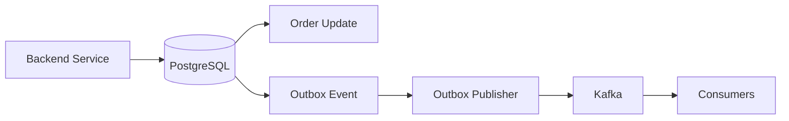

# 09- CASE in UPDATE Statements

## Overview

`CASE` can be used inside `UPDATE` statements to apply different update rules to different rows within a single SQL statement.

This is useful when a bulk operation needs conditional transformations:

- Assign different values based on status.
- Migrate legacy values to a new representation.
- Recalculate derived attributes.
- Normalize data during a migration.
- Apply different adjustments based on ranges or categories.
- Update multiple columns according to business conditions.

Instead of issuing separate statements such as:

```sql
UPDATE orders
SET priority = 1
WHERE status = 'failed';

UPDATE orders
SET priority = 2
WHERE status = 'pending';
```

you can often express the transformation as one statement:

```sql
UPDATE orders
SET priority = CASE
    WHEN status = 'failed' THEN 1
    WHEN status = 'pending' THEN 2
    ELSE priority
END;
```

The database evaluates the expression for each row selected by the `UPDATE`.

## Why CASE in UPDATE Matters

A normal `UPDATE` assigns the same expression to every affected row:

```sql
UPDATE orders
SET priority = 1
WHERE status = 'failed';
```

`CASE` allows the assigned value to depend on the current row:

```sql
UPDATE orders
SET priority = CASE
    WHEN status = 'failed' THEN 1
    WHEN status = 'pending' THEN 2
    WHEN status = 'processing' THEN 3
    ELSE priority
END;
```

Conceptually:

```text
Rows selected by UPDATE
        ↓
Evaluate CASE for each row
        ↓
Determine replacement value
        ↓
Write modified row
        ↓
Transaction commit
```

This makes `CASE` particularly valuable for controlled bulk transformations.

## Basic Syntax

The general pattern is:

```sql
UPDATE table_name
SET column_name =
    CASE
        WHEN condition_1 THEN value_1
        WHEN condition_2 THEN value_2
        ELSE value_default
    END
WHERE condition;
```

For example:

```sql
UPDATE users
SET account_tier = CASE
    WHEN lifetime_spend >= 10000 THEN 'enterprise'
    WHEN lifetime_spend >= 1000 THEN 'premium'
    ELSE 'standard'
END
WHERE account_tier IS DISTINCT FROM
    CASE
        WHEN lifetime_spend >= 10000 THEN 'enterprise'
        WHEN lifetime_spend >= 1000 THEN 'premium'
        ELSE 'standard'
    END;
```

The `WHERE` clause determines which rows are candidates for the update. The `CASE` determines the new value for each candidate.

These are separate responsibilities and should not be confused.

## CASE Versus WHERE

Consider:

```sql
UPDATE orders
SET status = 'cancelled'
WHERE payment_status = 'failed';
```

The `WHERE` clause determines **which rows** are updated.

Now consider:

```sql
UPDATE orders
SET status = CASE
    WHEN payment_status = 'failed' THEN 'cancelled'
    WHEN payment_status = 'refunded' THEN 'closed'
    ELSE status
END
WHERE payment_status IN ('failed', 'refunded');
```

The `WHERE` clause still determines the candidate rows, while `CASE` determines the value assigned to each row.

A useful mental model is:

```text
WHERE → row selection
CASE  → value selection
```

## Updating One Column with Multiple Rules

A common migration pattern is mapping several legacy values into a new representation.

Suppose:

```text
legacy_status
-------------
P
A
S
X
```

needs to become:

```text
P → pending
A → active
S → suspended
X → cancelled
```

Use:

```sql
UPDATE accounts
SET status = CASE legacy_status
    WHEN 'P' THEN 'pending'
    WHEN 'A' THEN 'active'
    WHEN 'S' THEN 'suspended'
    WHEN 'X' THEN 'cancelled'
    ELSE status
END
WHERE legacy_status IN ('P', 'A', 'S', 'X');
```

The simple `CASE` form is appropriate because every branch compares the same expression.

## Searched CASE in UPDATE

Use searched `CASE` when conditions depend on ranges or multiple columns:

```sql
UPDATE customers
SET customer_segment = CASE
    WHEN lifetime_value >= 10000 AND order_count >= 20 THEN 'enterprise'
    WHEN lifetime_value >= 5000 THEN 'high_value'
    WHEN order_count >= 5 THEN 'engaged'
    ELSE 'standard'
END
WHERE is_active = TRUE;
```

The first matching condition wins.

Therefore, overlapping conditions must be ordered from the most specific or highest-priority rule to the broader rule.

## Preserving Existing Values with ELSE

One of the most important production patterns is:

```sql
ELSE column_name
```

For example:

```sql
UPDATE orders
SET priority = CASE
    WHEN status = 'failed' THEN 1
    WHEN status = 'pending' THEN 2
    ELSE priority
END;
```

This means:

- Failed orders become priority `1`.
- Pending orders become priority `2`.
- Other rows retain their existing priority.

Without `ELSE`:

```sql
UPDATE orders
SET priority = CASE
    WHEN status = 'failed' THEN 1
    WHEN status = 'pending' THEN 2
END;
```

unmatched rows receive `NULL`.

That can be destructive when the existing value must be preserved.

## NULL and ELSE

`NULL` requires explicit consideration.

Suppose:

```sql
UPDATE users
SET risk_level = CASE
    WHEN failed_login_count >= 5 THEN 'high'
    WHEN failed_login_count >= 2 THEN 'medium'
    ELSE 'low'
END;
```

If `failed_login_count` is `NULL`, the comparisons do not evaluate to `TRUE`, so the `ELSE` branch is selected.

If `NULL` means "unknown" rather than zero, that may be incorrect.

Make the domain meaning explicit:

```sql
UPDATE users
SET risk_level = CASE
    WHEN failed_login_count IS NULL THEN 'unknown'
    WHEN failed_login_count >= 5 THEN 'high'
    WHEN failed_login_count >= 2 THEN 'medium'
    ELSE 'low'
END;
```

Do not silently convert unknown data into a business category unless that behavior is intentional.

## Updating Multiple Columns

`CASE` can be used independently for multiple columns in the same `UPDATE`.

```sql
UPDATE subscriptions
SET
    billing_status = CASE
        WHEN payment_failed = TRUE THEN 'past_due'
        WHEN cancelled_at IS NOT NULL THEN 'cancelled'
        ELSE billing_status
    END,
    retry_count = CASE
        WHEN payment_failed = TRUE THEN retry_count + 1
        ELSE retry_count
    END
WHERE account_id = :account_id;
```

Each assignment is evaluated according to the statement's row values.

This can be useful when several columns represent related state.

However, complex multi-column updates should be reviewed carefully because partial-looking state transitions can become difficult to reason about.

## Updating a Column Based on Its Existing Value

`CASE` can incorporate the existing column value.

For example:

```sql
UPDATE accounts
SET login_attempts = CASE
    WHEN login_attempts < 5 THEN login_attempts + 1
    ELSE login_attempts
END
WHERE account_id = :account_id;
```

This is preferable to reading the value into application code and then writing it back:

```text
SELECT login_attempts
        ↓
application calculates new value
        ↓
UPDATE login_attempts
```

because the database can perform the state transition atomically within the transaction.

For concurrency-sensitive counters, database-side expressions are generally preferable to application-side read-modify-write logic.

## Conditional Increment and Decrement

A practical bulk update is applying different changes based on a condition:

```sql
UPDATE inventory
SET quantity = CASE
    WHEN quantity >= :requested_quantity
        THEN quantity - :requested_quantity
    ELSE quantity
END
WHERE product_id = :product_id;
```

The SQL expression calculates the new value from the current row.

For correctness-sensitive inventory operations, however, the update should also enforce the business condition in the `WHERE` clause:

```sql
UPDATE inventory
SET quantity = quantity - :requested_quantity
WHERE product_id = :product_id
  AND quantity >= :requested_quantity;
```

The latter is often preferable because the database itself determines whether the operation is allowed.

The application can then inspect the affected-row count.

This illustrates an important rule:

> Do not use `CASE` merely because it can express a condition. Put row-selection constraints in `WHERE` when they define whether the update is allowed to occur.

## Conditional Updates with WHERE

A robust pattern combines `WHERE` and `CASE`:

```sql
UPDATE orders
SET
    status = CASE
        WHEN payment_status = 'failed' THEN 'cancelled'
        WHEN payment_status = 'succeeded' THEN 'confirmed'
        ELSE status
    END,
    updated_at = CURRENT_TIMESTAMP
WHERE status = 'pending'
  AND payment_status IN ('failed', 'succeeded');
```

The `WHERE` clause limits the operation to valid state-transition candidates.

The `CASE` chooses the target state.

This reduces unnecessary row processing and makes the update's scope explicit.

## State Transition Example

Suppose an order lifecycle is:

```text
pending
   ├── payment succeeded → confirmed
   └── payment failed    → cancelled
```

A conditional update can represent both transitions:

```sql
UPDATE orders
SET
    status = CASE
        WHEN payment_status = 'succeeded' THEN 'confirmed'
        WHEN payment_status = 'failed' THEN 'cancelled'
        ELSE status
    END,
    updated_at = CURRENT_TIMESTAMP
WHERE status = 'pending'
  AND payment_status IN ('succeeded', 'failed');
```

The database performs the transformation in one statement.

A senior-level design concern is whether this update is merely a data transformation or a true domain state transition.

If state changes have side effects such as:

- Sending email.
- Publishing Kafka events.
- Charging a payment provider.
- Triggering Celery tasks.
- Updating caches.

the database update alone is not enough. Those side effects need reliable transaction/event handling.

## CASE and Audit Columns

Conditional updates frequently modify audit fields:

```sql
UPDATE users
SET
    account_status = CASE
        WHEN suspended_until > CURRENT_TIMESTAMP THEN 'suspended'
        WHEN deleted_at IS NOT NULL THEN 'deleted'
        ELSE 'active'
    END,
    updated_at = CURRENT_TIMESTAMP
WHERE user_id = :user_id;
```

Be careful with audit semantics.

Updating `updated_at` for every candidate row can make rows appear modified even when the `CASE` ultimately preserves the original business value.

If meaningful change tracking is required, consider restricting the `WHERE` clause or using an explicit change predicate.

## Avoiding Unnecessary Writes

Consider:

```sql
UPDATE orders
SET priority = CASE
    WHEN status = 'failed' THEN 1
    WHEN status = 'pending' THEN 2
    ELSE priority
END;
```

If many rows already have the correct value, the statement may still process those rows.

A more targeted update can compare the current value with the desired value:

```sql
UPDATE orders
SET priority = CASE
    WHEN status = 'failed' THEN 1
    WHEN status = 'pending' THEN 2
    ELSE priority
END
WHERE status IN ('failed', 'pending');
```

For PostgreSQL, a null-safe comparison can be useful when the desired value may be `NULL`:

```sql
UPDATE orders
SET priority = CASE
    WHEN status = 'failed' THEN 1
    WHEN status = 'pending' THEN 2
    ELSE priority
END
WHERE priority IS DISTINCT FROM CASE
    WHEN status = 'failed' THEN 1
    WHEN status = 'pending' THEN 2
    ELSE priority
END;
```

Whether avoiding unchanged writes is worthwhile depends on workload and database behavior. Extra predicate complexity is not automatically an optimization.

## Bulk Data Migration

`CASE` is particularly useful during migrations.

Suppose a system changes from:

```text
is_premium = TRUE/FALSE
```

to:

```text
customer_tier = standard/premium
```

A migration might use:

```sql
UPDATE customers
SET customer_tier = CASE
    WHEN is_premium = TRUE THEN 'premium'
    ELSE 'standard'
END
WHERE customer_tier IS NULL;
```

The `WHERE` clause makes the migration idempotent with respect to rows already populated.

For large production tables, do not assume a single massive `UPDATE` is operationally harmless.

Large updates can cause:

- Long-running transactions.
- Lock contention.
- Large WAL/redo generation.
- Replication lag.
- Table/index bloat.
- Increased I/O.
- Delayed vacuum or cleanup.
- Longer recovery times.

For very large datasets, use controlled batching or an online migration strategy appropriate to the database.

## Transaction Safety

Bulk updates should normally run inside an explicit transaction when atomicity matters.

PostgreSQL example:

```sql
BEGIN;

UPDATE customers
SET customer_tier = CASE
    WHEN lifetime_value >= 10000 THEN 'enterprise'
    WHEN lifetime_value >= 1000 THEN 'premium'
    ELSE 'standard'
END
WHERE customer_tier IS NULL;

COMMIT;
```

If validation fails:

```sql
ROLLBACK;
```

Before executing a production migration, inspect the intended rows first:

```sql
SELECT
    customer_id,
    lifetime_value,
    customer_tier,
    CASE
        WHEN lifetime_value >= 10000 THEN 'enterprise'
        WHEN lifetime_value >= 1000 THEN 'premium'
        ELSE 'standard'
    END AS new_customer_tier
FROM customers
WHERE customer_tier IS NULL;
```

This provides a preview of the transformation.

## Concurrency Considerations

An `UPDATE` is not equivalent to:

```text
SELECT rows
→ calculate values in application
→ UPDATE rows
```

When the transformation can be expressed from current database state, keeping the calculation inside the `UPDATE` reduces the read-modify-write race window.

For example:

```sql
UPDATE inventory
SET quantity = quantity - :amount
WHERE product_id = :product_id
  AND quantity >= :amount;
```

The condition and update occur as one database operation.

If the operation depends on multiple business invariants, you may additionally need:

- Transactions.
- Appropriate isolation levels.
- Row locks.
- Constraints.
- Optimistic concurrency controls.
- Idempotency keys.

`CASE` itself does not provide concurrency control.

## CASE and Constraints

Database constraints remain important even when `CASE` contains correct business logic.

For example:

```sql
ALTER TABLE inventory
ADD CONSTRAINT inventory_quantity_nonnegative
CHECK (quantity >= 0);
```

Then:

```sql
UPDATE inventory
SET quantity = CASE
    WHEN quantity >= :amount THEN quantity - :amount
    ELSE quantity
END
WHERE product_id = :product_id;
```

The application should not rely exclusively on the `CASE` to protect invariants.

Constraints provide a final database-level enforcement mechanism.

## Performance Considerations

The cost of a conditional update depends on:

- Number of candidate rows.
- Complexity of the `CASE`.
- Indexes supporting the `WHERE`.
- Number of indexes on the updated columns.
- Row size.
- Lock contention.
- Replication configuration.
- Transaction duration.

A useful production workflow is:

```text
Define WHERE scope
       ↓
SELECT candidate rows
       ↓
Preview CASE result
       ↓
EXPLAIN / inspect query
       ↓
Run controlled UPDATE
       ↓
Validate affected rows
       ↓
Commit
       ↓
Monitor replication and application health
```

For large updates, an index supporting the filtering predicate can significantly reduce unnecessary scanning.

However, indexes on columns being updated have their own write cost because index entries may need maintenance.

## EXPLAIN and UPDATE

Before a high-impact update, inspect the plan where supported:

```sql
EXPLAIN
UPDATE orders
SET priority = CASE
    WHEN status = 'failed' THEN 1
    WHEN status = 'pending' THEN 2
    ELSE priority
END
WHERE status IN ('failed', 'pending');
```

For PostgreSQL, `EXPLAIN (ANALYZE, BUFFERS)` executes the statement, so do not casually use it against production data:

```sql
EXPLAIN (ANALYZE, BUFFERS)
UPDATE orders
SET priority = CASE
    WHEN status = 'failed' THEN 1
    WHEN status = 'pending' THEN 2
    ELSE priority
END
WHERE status IN ('failed', 'pending');
```

Use a controlled environment or a transaction that is deliberately rolled back when appropriate:

```sql
BEGIN;

EXPLAIN (ANALYZE, BUFFERS)
UPDATE orders
SET priority = CASE
    WHEN status = 'failed' THEN 1
    WHEN status = 'pending' THEN 2
    ELSE priority
END
WHERE status IN ('failed', 'pending');

ROLLBACK;
```

Even a rollback does not mean the operation was free: the statement still performed work and generated transactional effects during execution.

## Django ORM

Django's `Case` and `When` expressions can generate conditional SQL updates.

For example:

```python
from django.db.models import Case, IntegerField, Value, When

Order.objects.filter(
    status__in=["failed", "pending"],
).update(
    priority=Case(
        When(status="failed", then=Value(1)),
        When(status="pending", then=Value(2)),
        default="priority",
        output_field=IntegerField(),
    )
)
```

This keeps the transformation in the database instead of loading every object into Python.

Avoid:

```python
for order in Order.objects.filter(status__in=["failed", "pending"]):
    if order.status == "failed":
        order.priority = 1
    else:
        order.priority = 2
    order.save()
```

The loop can produce many database round trips and is generally less suitable for a bulk transformation.

For large or business-critical updates, still consider:

- Transaction boundaries.
- Locking behavior.
- Migration duration.
- Query plans.
- Signals and side effects.
- Replica lag.

A Django `QuerySet.update()` operates directly in SQL and does not call each model instance's `save()` method.

## Application and Event Consistency

A database update can succeed while an external side effect fails.

For example:

```text
UPDATE orders
SET status = 'confirmed'
```

followed by:

```text
publish Kafka event
```

creates a consistency boundary between the database and Kafka.

Do not assume that placing the state transition inside a `CASE` makes the entire workflow atomic.

For important event-driven workflows, consider the transactional outbox pattern:



The database transaction can atomically persist both the state transition and the outbox record. A separate publisher then delivers the event.

## Common Mistakes

### Omitting ELSE When Existing Values Must Be Preserved

Dangerous:

```sql
UPDATE users
SET status = CASE
    WHEN is_active = TRUE THEN 'active'
END;
```

Rows where `is_active` is not true receive `NULL`.

Safer:

```sql
UPDATE users
SET status = CASE
    WHEN is_active = TRUE THEN 'active'
    ELSE status
END;
```

### Using CASE Instead of WHERE for Safety

This:

```sql
UPDATE inventory
SET quantity = CASE
    WHEN quantity >= :amount THEN quantity - :amount
    ELSE quantity
END
WHERE product_id = :product_id;
```

does not clearly express that insufficient inventory should prevent the operation.

Prefer:

```sql
UPDATE inventory
SET quantity = quantity - :amount
WHERE product_id = :product_id
  AND quantity >= :amount;
```

Then inspect the affected-row count.

### Forgetting Overlapping Conditions

Incorrect:

```sql
UPDATE customers
SET segment = CASE
    WHEN lifetime_value >= 100 THEN 'valuable'
    WHEN lifetime_value >= 1000 THEN 'enterprise'
    ELSE 'standard'
END;
```

The second branch can never be reached for values above `1000`.

Correct:

```sql
UPDATE customers
SET segment = CASE
    WHEN lifetime_value >= 1000 THEN 'enterprise'
    WHEN lifetime_value >= 100 THEN 'valuable'
    ELSE 'standard'
END;
```

### Updating Every Row Unnecessarily

Avoid:

```sql
UPDATE orders
SET priority = CASE
    WHEN status = 'failed' THEN 1
    ELSE priority
END;
```

when only failed rows require processing.

Prefer:

```sql
UPDATE orders
SET priority = 1
WHERE status = 'failed';
```

`CASE` should be used when multiple conditional assignments genuinely benefit from a single statement.

### Performing Large Updates Without Operational Planning

A technically correct statement can still be operationally dangerous.

Before a large update, estimate:

- Number of affected rows.
- Expected execution time.
- Lock impact.
- Replication impact.
- WAL/redo volume.
- Index maintenance cost.
- Rollback requirements.

For large tables, consider batching or a dedicated migration strategy.

### Assuming CASE Makes an Update Atomic Across Systems

`CASE` participates in the database statement and transaction, but it does not make:

```text
PostgreSQL
Redis
Kafka
external API
```

one atomic system.

Cross-system consistency requires an appropriate distributed workflow pattern.

### Relying on Application-Side Loops

Loading records into Django or Python, modifying each object, and saving individually can create thousands of round trips.

Prefer database-side bulk expressions when the transformation is relational and does not require per-object application logic.

### Ignoring Constraints

Application logic and `CASE` expressions should not be the only protection for important invariants.

Use:

- `CHECK` constraints.
- `NOT NULL`.
- `UNIQUE`.
- Foreign keys.
- Appropriate transactional boundaries.

Database constraints protect correctness even when another application path performs the update.

## Interview Traps

| Question | Correct Reasoning |
| --- | --- |
| What does `CASE` do inside `UPDATE`? | It computes the value assigned to a column for each candidate row |
| What does `WHERE` do? | It determines which rows are candidates for modification |
| What happens when no `WHEN` matches and there is no `ELSE`? | The `CASE` expression returns `NULL` |
| How do you preserve an existing value? | Use `ELSE column_name` when that is the intended behavior |
| Does `CASE` itself provide concurrency control? | No; use transactions, locks, constraints, or concurrency-control mechanisms as required |
| Why prefer a database-side conditional update over an application loop? | It reduces round trips and can perform the transformation close to the data |
| Why can a large `UPDATE` be dangerous? | It can create locks, WAL/redo, replication lag, I/O pressure, bloat, and long transactions |
| Why should conditions be ordered carefully? | `CASE` returns the result of the first matching `WHEN` |
| Should `CASE` replace every `WHERE` condition? | No; `WHERE` should express which rows are valid candidates for the operation |
| Does a successful database update automatically publish a Kafka event? | No; cross-system consistency requires an explicit reliable integration pattern |
| Why use `ELSE column_name` in bulk transformations? | To leave unmatched rows unchanged instead of assigning `NULL` |
| Can a `CASE` update multiple columns? | Yes; each column can have its own conditional expression |

## Key Takeaways

- Use `CASE` in `UPDATE` when different candidate rows need different replacement values.
- Keep responsibilities clear: `WHERE` controls row selection, while `CASE` controls the value assigned to each selected row.
- Use `ELSE column_name` when unmatched rows must retain their existing values, and order overlapping conditions from highest priority to lowest.
- Treat large bulk updates as operational events: inspect scope, estimate impact, use transactions or batching appropriately, and monitor locks and replication.
- `CASE` does not solve cross-system consistency or concurrency by itself; combine database expressions with constraints, transactions, and reliable event patterns where required.