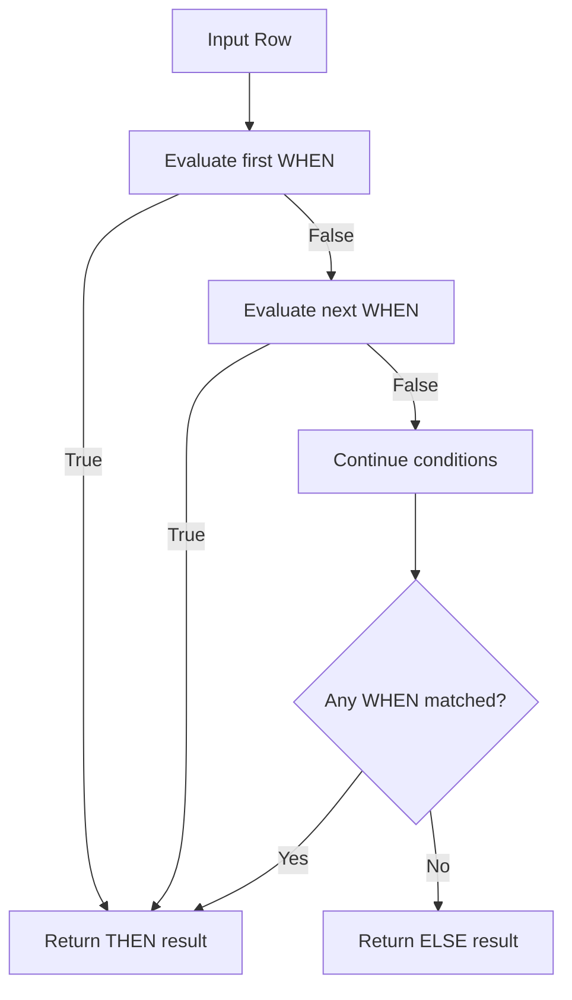
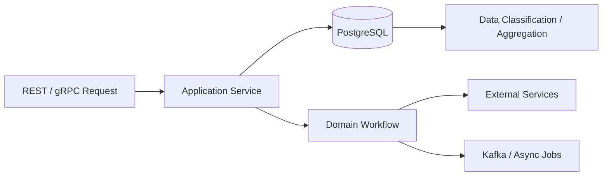

# README

## Overview

`CASE WHEN` is SQL's primary conditional expression. It allows a query to derive values from existing data without moving every classification decision into application code.

This folder focuses on using `CASE` effectively across common SQL operations:

## Navigation

| # | File | Description |
|---|---|---|
| 01 | [01- CASE WHEN Introduction](./01-%20CASE%20WHEN%20Introduction.md) | Core CASE concepts and syntax |
| 02 | [02- Simple CASE](./02-%20Simple%20CASE.md) | Equality-based CASE expressions |
| 03 | [03- Searched CASE](./03-%20Searched%20CASE.md) | Condition-based CASE expressions |
| 04 | [04- CASE Evaluation Rules](./04-%20CASE%20Evaluation%20Rules.md) | Branch ordering and evaluation behavior |
| 05 | [05- CASE with NULL](./05-%20CASE%20with%20NULL.md) | NULL handling inside conditional logic |
| 06 | [06- CASE with Aggregation](./06-%20CASE%20with%20Aggregation.md) | Conditional aggregation patterns |
| 07 | [07- CASE with GROUP BY](./07-%20CASE%20with%20GROUP%20BY.md) | Grouping data using derived classifications |
| 08 | [08- CASE with ORDER BY](./08-%20CASE%20with%20ORDER%20BY.md) | Conditional sorting and custom priorities |
| 09 | [09- CASE in UPDATE Statements](./09-%20CASE%20in%20UPDATE%20Statements.md) | Conditional data modification |
| 10 | [10- CASE for Conditional Logic](./10-%20CASE%20for%20Conditional%20Logic.md) | Practical conditional transformations |
| 11 | [11- CASE vs COALESCE](./11-%20CASE%20vs%20COALESCE.md) | Choosing between conditional logic and COALESCE |
| 12 | [12- CASE vs Application Logic](./12-%20CASE%20vs%20Application%20Logic.md) | Deciding where business logic should execute |
| 13 | [13- When to Use CASE WHEN](./13-%20When%20to%20Use%20CASE%20WHEN.md) | Practical decision-making and appropriate use cases |
| 14 | [14- Common CASE Mistakes](./14-%20Common%20CASE%20Mistakes.md) | Common correctness, performance, and design mistakes |

## What CASE WHEN Solves

`CASE` is useful when a query needs to transform data based on conditions.

Typical examples include:

- Classifying records into business categories.
- Converting database states into reporting labels.
- Creating conditional numeric values.
- Implementing conditional aggregation.
- Defining custom sort priorities.
- Applying different values during an `UPDATE`.
- Translating database values into API or reporting representations.

For example:

```sql
SELECT
    order_id,
    total_amount,
    CASE
        WHEN total_amount >= 10000 THEN 'large'
        WHEN total_amount >= 1000 THEN 'medium'
        ELSE 'small'
    END AS order_size
FROM orders;
```

The database performs the transformation as part of query execution, so consumers receive the derived classification without requiring a separate application-side loop.

## CASE Decision Model

The fundamental model is:



The first matching `WHEN` determines the result. Therefore, condition ordering is part of the correctness of the query.

A broad condition placed before a more specific condition can make the specific branch unreachable.

## Simple CASE vs Searched CASE

There are two primary forms.

### Simple CASE

Simple `CASE` compares one expression against multiple values:

```sql
CASE status
    WHEN 'pending' THEN 'waiting'
    WHEN 'active' THEN 'running'
    WHEN 'completed' THEN 'finished'
    ELSE 'unknown'
END
```

It is appropriate when the decision is essentially equality-based.

### Searched CASE

Searched `CASE` evaluates independent Boolean conditions:

```sql
CASE
    WHEN total_amount >= 10000 THEN 'large'
    WHEN total_amount >= 1000 THEN 'medium'
    ELSE 'small'
END
```

It is the more flexible form and is appropriate for:

- Ranges.
- Multiple columns.
- Compound predicates.
- `NULL` checks.
- Boolean conditions.
- More complex business classifications.

## CASE Across Query Operations

`CASE` can appear in many parts of a SQL statement.

| SQL operation | Typical use |
| --- | --- |
| `SELECT` | Derive or classify values |
| `WHERE` | Conditional predicates, although direct predicates are often clearer |
| `GROUP BY` | Group rows by derived categories |
| `ORDER BY` | Define custom sorting priority |
| `UPDATE` | Assign different values based on row conditions |
| Aggregation | Count or sum conditionally |
| `JOIN` | Conditional expressions in more specialized joins |
| CTEs / subqueries | Build reusable derived classifications |

A useful engineering distinction is:

> `CASE` is an expression that produces a value; it is not a replacement for every form of application control flow.

## Conditional Aggregation

One of the most important production patterns is conditional aggregation.

```sql
SELECT
    COUNT(*) AS total_orders,
    COUNT(CASE WHEN status = 'completed' THEN 1 END) AS completed_orders,
    COUNT(CASE WHEN status = 'cancelled' THEN 1 END) AS cancelled_orders
FROM orders;
```

For databases that support SQL's `FILTER` clause, such as PostgreSQL, this can often be expressed more directly:

```sql
SELECT
    COUNT(*) AS total_orders,
    COUNT(*) FILTER (WHERE status = 'completed') AS completed_orders,
    COUNT(*) FILTER (WHERE status = 'cancelled') AS cancelled_orders
FROM orders;
```

Use the form supported by the database and preferred by the project's SQL conventions.

## Conditional Grouping

`CASE` can derive a category and then aggregate by that category:

```sql
SELECT
    CASE
        WHEN total_amount >= 10000 THEN 'large'
        WHEN total_amount >= 1000 THEN 'medium'
        ELSE 'small'
    END AS order_size,
    COUNT(*) AS order_count
FROM orders
GROUP BY
    CASE
        WHEN total_amount >= 10000 THEN 'large'
        WHEN total_amount >= 1000 THEN 'medium'
        ELSE 'small'
    END;
```

When supported and appropriate, a derived relation can make repeated expressions easier to maintain:

```sql
WITH classified_orders AS (
    SELECT
        order_id,
        CASE
            WHEN total_amount >= 10000 THEN 'large'
            WHEN total_amount >= 1000 THEN 'medium'
            ELSE 'small'
        END AS order_size
    FROM orders
)
SELECT
    order_size,
    COUNT(*) AS order_count
FROM classified_orders
GROUP BY order_size;
```

Do not introduce a CTE solely for aesthetics. Query readability, optimizer behavior, and execution plans should all be considered.

## Conditional Ordering

`CASE` is useful when business priority does not correspond to normal alphabetical or numeric ordering.

```sql
SELECT
    ticket_id,
    status,
    created_at
FROM support_tickets
ORDER BY
    CASE status
        WHEN 'critical' THEN 1
        WHEN 'high' THEN 2
        WHEN 'normal' THEN 3
        ELSE 4
    END,
    created_at ASC;
```

This pattern is common for:

- Support queues.
- Job processing.
- Operational dashboards.
- SLA prioritization.
- Workflow states.

Always add deterministic secondary ordering when result order matters.

## Conditional Updates

`CASE` can update multiple rows differently in one statement:

```sql
UPDATE orders
SET priority = CASE
    WHEN total_amount >= 10000 THEN 'high'
    WHEN total_amount >= 1000 THEN 'medium'
    ELSE 'normal'
END
WHERE created_at >= CURRENT_DATE - INTERVAL '30 days';
```

This can be significantly cleaner than issuing separate update statements for each category.

For production updates, carefully constrain the `WHERE` clause and consider transaction behavior, locking, affected-row counts, and rollback strategy.

## NULL Handling

`NULL` requires explicit reasoning.

This is incorrect:

```sql
CASE
    WHEN deleted_at = NULL THEN 'active'
    ELSE 'deleted'
END
```

Use:

```sql
CASE
    WHEN deleted_at IS NULL THEN 'active'
    ELSE 'deleted'
END
```

Also distinguish `NULL` from valid values such as `0`, `false`, or an empty string.

When the requirement is simply to return the first non-`NULL` value, `COALESCE` is often clearer:

```sql
COALESCE(phone_number, email)
```

rather than:

```sql
CASE
    WHEN phone_number IS NOT NULL THEN phone_number
    ELSE email
END
```

## CASE vs Application Logic

The correct location for conditional logic depends on what the logic represents.

### SQL is a good fit when the logic is data-oriented

Examples:

- Reporting classifications.
- Aggregation rules.
- Database-level transformations.
- Filtering and sorting behavior.
- Bulk updates.
- Derived query columns.

### Application code is usually better for workflow logic

Examples:

- Calling external services.
- Orchestrating Kafka events.
- Retrying operations.
- Coordinating transactions across services.
- Complex domain workflows.
- Side effects.

A useful architecture boundary is:



SQL should generally calculate data close to the data. Application services should generally coordinate behavior and side effects.

## Production Considerations

### Performance

`CASE` itself is usually inexpensive, but complex expressions evaluated across millions of rows can consume meaningful CPU.

Review:

- Number of rows processed.
- Complexity of predicates.
- Whether filtering can happen before transformation.
- Whether the expression is repeated.
- Whether the result needs precomputation.
- Whether indexes remain useful.

Use execution plans for performance-sensitive queries:

```sql
EXPLAIN (ANALYZE, BUFFERS)
SELECT
    CASE
        WHEN total_amount >= 10000 THEN 'large'
        ELSE 'normal'
    END AS order_size
FROM orders
WHERE created_at >= CURRENT_DATE - INTERVAL '30 days';
```

Do not optimize based solely on intuition.

### Maintainability

A small `CASE` is often clearer than moving simple data classification into Python.

A `CASE` with hundreds of branches is usually a design smell.

If the logic represents changing reference data, consider a mapping table instead:

```text
rule_mapping
├── input_value
├── classification
└── priority
```

This allows the mapping to change as data rather than requiring SQL source changes.

### Consistency

Be careful when the same classification exists in:

- SQL queries.
- Django models.
- FastAPI services.
- Celery workers.
- Analytics pipelines.
- Kafka consumers.

Different implementations can create inconsistent behavior at boundaries.

For example, these rules are not equivalent:

```sql
amount >= 1000
```

and:

```python
amount > 1000
```

Boundary semantics should be defined once and tested explicitly.

### Security

`CASE` is not an authorization mechanism.

Do not rely on:

```sql
CASE
    WHEN is_admin THEN sensitive_value
    ELSE NULL
END
```

as the primary access-control boundary.

Use appropriate application authorization, database privileges, row-level security where appropriate, and least-privilege database credentials.

### Operational Safety

For `CASE` expressions inside `UPDATE` or `DELETE` operations:

- Verify the `WHERE` clause.
- Run a representative `SELECT` first.
- Check expected row counts.
- Use transactions where appropriate.
- Test against staging data.
- Understand locking behavior.
- Have a rollback strategy for high-impact changes.

A useful workflow is:

```sql
SELECT
    order_id,
    priority AS current_priority,
    CASE
        WHEN total_amount >= 10000 THEN 'high'
        WHEN total_amount >= 1000 THEN 'medium'
        ELSE 'normal'
    END AS new_priority
FROM orders
WHERE created_at >= CURRENT_DATE - INTERVAL '30 days';
```

Validate the proposed result before executing the corresponding `UPDATE`.

## Common Decision Guide

| Requirement | Preferred approach |
| --- | --- |
| Compare one column with several exact values | Simple `CASE` |
| Evaluate ranges | Searched `CASE` |
| Check multiple conditions | Searched `CASE` |
| Return first non-`NULL` value | `COALESCE` |
| Conditional count/sum | `CASE` or database-specific `FILTER` |
| Custom business ordering | `CASE` in `ORDER BY` |
| Bulk conditional assignment | `CASE` in `UPDATE` |
| Complex service workflow | Application/service layer |
| Frequently changing lookup values | Mapping table |
| Authorization | Dedicated access-control mechanism |
| Simple filtering | Direct `WHERE` predicate |

## Common Mistakes

The most important failure modes are:

- Putting broad `WHEN` conditions before specific ones.
- Forgetting that unmatched rows return `NULL` when `ELSE` is omitted.
- Using `= NULL` instead of `IS NULL`.
- Treating `NULL` and zero as equivalent.
- Using `CASE` where a simple predicate is clearer.
- Using `CASE` where `COALESCE` communicates the intent better.
- Creating incompatible result types across branches.
- Hiding data-quality problems behind a broad `ELSE`.
- Repeating large `CASE` expressions throughout a query.
- Duplicating the same business rule independently in SQL and application code.
- Creating huge `CASE` statements where a lookup table would be more maintainable.
- Assuming complex `CASE` expressions have no performance cost.
- Using `CASE` as an authorization mechanism.
- Ignoring time-zone semantics in date-based conditions.
- Performing conditional `UPDATE`s without first validating the affected rows.

## Practical Review Checklist

Before shipping significant `CASE` logic, verify:

- [ ] The correct `CASE` form is being used.
- [ ] Branch ordering is intentional.
- [ ] Overlapping conditions are understood.
- [ ] Boundary values have been tested.
- [ ] `NULL` behavior is explicit.
- [ ] `ELSE` behavior is intentional.
- [ ] Result data types are compatible.
- [ ] A simpler SQL construct does not communicate the intent better.
- [ ] Index and execution-plan implications have been considered.
- [ ] Large expressions are not unnecessarily repeated.
- [ ] Business logic is not duplicated across layers without a reason.
- [ ] Lookup data has not been hard-coded into an oversized `CASE`.
- [ ] Bulk updates have been validated with a corresponding `SELECT`.
- [ ] Authorization is enforced independently.
- [ ] Unexpected input values are handled deliberately.


## Key Takeaways

- `CASE WHEN` is a conditional SQL expression for deriving values, classifying rows, and implementing data-oriented transformations.
- The first matching `WHEN` wins, making condition ordering, overlap, and boundary behavior critical to correctness.
- `NULL` handling, `ELSE` behavior, result types, and query-plan implications should be explicit in production SQL.
- Use `CASE` for data-centric logic, but avoid turning SQL into a workflow engine or duplicating complex domain logic across application layers.
- Prefer simpler constructs or better schema design when they communicate the requirement more clearly than a large `CASE` expression.