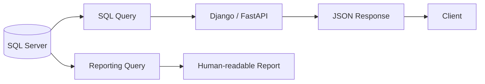

# 04- FORMAT

## Overview

`FORMAT` is a SQL Server function used to convert numeric and date/time values into formatted strings using .NET format patterns and an optional culture.

Unlike `CAST` and `CONVERT`, which primarily perform type conversion, `FORMAT` is a **presentation-oriented formatting function**.

```sql
FORMAT(value, format [, culture])
```

For example:

```sql
SELECT FORMAT(1234567.89, 'N2', 'en-US');
```

Result:

```text
1,234,567.89
```

A date can also be formatted:

```sql
SELECT FORMAT(
    GETDATE(),
    'yyyy-MM-dd HH:mm:ss'
);
```

`FORMAT` is useful when SQL Server itself must produce human-readable output. It should generally **not** be used for high-volume filtering, joining, sorting, or general-purpose data transformation because it is substantially more expensive than simpler native conversion operations.

## FORMAT vs CAST vs CONVERT

The most important distinction is the purpose of each function.

| Function | Primary purpose | Formatting support | Performance profile | Portability |
| --- | --- | --- | --- | --- |
| `CAST` | Type conversion | Limited | Generally efficient | High |
| `CONVERT` | Type conversion | SQL Server style codes | Generally efficient | SQL Server-specific |
| `FORMAT` | Presentation formatting | Rich .NET patterns and culture | Relatively expensive | SQL Server-specific |

Example:

```sql
SELECT CAST(amount AS DECIMAL(12, 2))
FROM payments;
```

This changes the value's data type.

```sql
SELECT CONVERT(VARCHAR(10), created_at, 23)
FROM orders;
```

This converts a date/time value to a string using a SQL Server style.

```sql
SELECT FORMAT(created_at, 'dd MMM yyyy')
FROM orders;
```

This formats the value into a human-readable string.

The distinction is:

```text
CAST
  ↓
Change type

CONVERT
  ↓
Change type + SQL Server conversion styles

FORMAT
  ↓
Produce presentation-oriented text
```

## Basic Syntax

The SQL Server syntax is:

```sql
FORMAT(value, format [, culture])
```

### Value

The value to format.

Examples:

```sql
FORMAT(order_date, 'yyyy-MM-dd')

FORMAT(total_amount, 'N2')

FORMAT(quantity, 'N0')
```

### Format

A .NET-compatible format pattern.

Examples:

```sql
'yyyy-MM-dd'
'dd/MM/yyyy'
'N2'
'C2'
'P2'
```

### Culture

An optional .NET culture identifier.

```sql
FORMAT(amount, 'C2', 'en-US')
```

or:

```sql
FORMAT(amount, 'C2', 'de-DE')
```

The same numeric value can therefore be presented differently according to locale.

## Formatting Dates

One of the most common uses of `FORMAT` is producing readable date strings.

```sql
SELECT
    FORMAT(created_at, 'yyyy-MM-dd') AS order_date
FROM orders;
```

Example result:

```text
2026-08-30
```

A more human-readable representation:

```sql
SELECT
    FORMAT(created_at, 'dd MMM yyyy') AS order_date
FROM orders;
```

Result:

```text
30 Aug 2026
```

Date and time can be included:

```sql
SELECT
    FORMAT(created_at, 'yyyy-MM-dd HH:mm:ss') AS created_at
FROM orders;
```

For a 12-hour representation:

```sql
SELECT
    FORMAT(created_at, 'dd MMM yyyy hh:mm tt') AS created_at
FROM orders;
```

`FORMAT` is useful when the database is directly producing a human-facing report.

## Date Format Patterns

Common patterns include:

| Pattern | Meaning | Example |
| --- | --- | --- |
| `yyyy` | Four-digit year | `2026` |
| `yy` | Two-digit year | `26` |
| `MM` | Two-digit month | `08` |
| `MMM` | Abbreviated month name | `Aug` |
| `MMMM` | Full month name | `August` |
| `dd` | Two-digit day | `30` |
| `ddd` | Abbreviated weekday | `Sun` |
| `dddd` | Full weekday | `Sunday` |
| `HH` | 24-hour hour | `14` |
| `hh` | 12-hour hour | `02` |
| `mm` | Minutes | `30` |
| `ss` | Seconds | `45` |
| `tt` | AM/PM designator | `PM` |

For example:

```sql
SELECT FORMAT(
    CAST('2026-08-30T14:30:45' AS DATETIME2),
    'dddd, dd MMMM yyyy HH:mm:ss'
);
```

Result resembles:

```text
Sunday, 30 August 2026 14:30:45
```

## Formatting Numbers

`FORMAT` can produce human-readable numeric representations.

```sql
SELECT FORMAT(1234567.8912, 'N2');
```

Result:

```text
1,234,567.89
```

`N2` means a number formatted with two decimal places.

Examples:

```sql
SELECT FORMAT(1234567.8912, 'N0');

SELECT FORMAT(1234567.8912, 'N2');

SELECT FORMAT(1234567.8912, 'N4');
```

Typical results:

```text
1,234,568
1,234,567.89
1,234,567.8912
```

The output is a **string**, not a numeric value.

## Currency Formatting

`FORMAT` supports currency formatting through standard numeric format strings.

```sql
SELECT FORMAT(1999.99, 'C2', 'en-US');
```

Result:

```text
$1,999.99
```

Another culture:

```sql
SELECT FORMAT(1999.99, 'C2', 'de-DE');
```

The representation follows the specified culture's conventions.

This can be useful for reports that are generated directly by SQL Server.

However, currency formatting is usually better handled by the application or presentation layer when the database is serving an API.

## Percentage Formatting

`P` can be used for percentages.

```sql
SELECT FORMAT(0.8565, 'P2');
```

Result:

```text
85.65%
```

This is particularly useful for reporting:

```sql
SELECT
    FORMAT(
        CAST(completed_orders AS DECIMAL(12, 4))
        / NULLIF(total_orders, 0),
        'P2'
    ) AS completion_rate
FROM order_metrics;
```

The `NULLIF` prevents division by zero.

## Culture-Aware Formatting

The optional culture parameter is one of the features that differentiates `FORMAT` from simpler conversion functions.

```sql
SELECT FORMAT(
    1234567.89,
    'N2',
    'en-US'
);
```

versus:

```sql
SELECT FORMAT(
    1234567.89,
    'N2',
    'de-DE'
);
```

The formatting conventions differ between cultures.

This matters for:

- Financial reports.
- International applications.
- Exported documents.
- User-facing database reports.

It should not be confused with changing the underlying numeric or temporal value.

The database value remains the same; only its textual representation changes.

## FORMAT Returns Text

This is a critical property.

```sql
SELECT FORMAT(1234.56, 'N2');
```

returns text.

It does not return:

```text
1234.56
```

as a numeric value.

This means that:

```sql
ORDER BY FORMAT(amount, 'N2')
```

sorts the formatted string rather than necessarily sorting numerically.

For example, textual ordering can produce unexpected results:

```text
1,000.00
100.00
20.00
9.00
```

The correct pattern is:

```sql
ORDER BY amount
```

while formatting only in the projection:

```sql
SELECT
    FORMAT(amount, 'N2') AS formatted_amount
FROM payments
ORDER BY amount;
```

Keep values typed for computation and ordering.

## FORMAT in SELECT

`FORMAT` is most appropriate in the `SELECT` list when the database must produce presentation-oriented output.

```sql
SELECT
    order_id,
    FORMAT(total_amount, 'N2') AS total_amount,
    FORMAT(created_at, 'dd MMM yyyy') AS order_date
FROM orders;
```

This is reasonable for:

- Internal reports.
- Administrative dashboards.
- Export queries.
- Human-readable SQL output.

For APIs, native values are usually preferable:

```sql
SELECT
    order_id,
    total_amount,
    created_at
FROM orders;
```

The application can then serialize them according to the API contract.

## FORMAT in WHERE

Avoid using `FORMAT` to filter data.

Bad:

```sql
SELECT *
FROM orders
WHERE FORMAT(created_at, 'yyyy-MM-dd') = '2026-08-30';
```

This converts the column into text before comparison.

Prefer a range predicate:

```sql
SELECT *
FROM orders
WHERE created_at >= '2026-08-30T00:00:00'
  AND created_at < '2026-08-31T00:00:00';
```

The range predicate preserves the native temporal column and is much more suitable for index access.

If the application provides date boundaries, parameterize them:

```sql
SELECT *
FROM orders
WHERE created_at >= @start_date
  AND created_at < @end_date;
```

## FORMAT and SARGability

`FORMAT` is presentation logic and should generally remain outside search predicates.

Consider an index:

```sql
CREATE INDEX IX_orders_created_at
ON orders(created_at);
```

Prefer:

```sql
WHERE created_at >= @start
  AND created_at < @end
```

over:

```sql
WHERE FORMAT(created_at, 'yyyy-MM-dd') = @date;
```

The second query requires SQL Server to format values before evaluating the predicate.

This can prevent efficient index usage and increase CPU consumption.

A practical rule is:

> **Filter using native types; format only after the database has identified the required rows.**

## FORMAT and ORDER BY

Do not sort by formatted values unless lexicographic ordering is explicitly desired.

Avoid:

```sql
SELECT
    order_id,
    FORMAT(created_at, 'dd/MM/yyyy') AS order_date
FROM orders
ORDER BY FORMAT(created_at, 'dd/MM/yyyy');
```

A format such as `dd/MM/yyyy` does not naturally preserve chronological ordering.

Prefer:

```sql
SELECT
    order_id,
    FORMAT(created_at, 'dd/MM/yyyy') AS order_date
FROM orders
ORDER BY created_at;
```

This produces human-readable output while preserving chronological ordering.

## FORMAT and GROUP BY

Avoid grouping by formatted values when the actual grouping key is a native temporal or numeric value.

For example, this is usually inferior:

```sql
SELECT
    FORMAT(created_at, 'yyyy-MM') AS month,
    COUNT(*) AS order_count
FROM orders
GROUP BY FORMAT(created_at, 'yyyy-MM');
```

It may be acceptable for a small reporting query, but formatting is being mixed with grouping logic.

For more scalable reporting, group using an appropriate date expression or pre-aggregated reporting structure, then format the result.

For example:

```sql
SELECT
    DATEFROMPARTS(YEAR(created_at), MONTH(created_at), 1) AS month_start,
    COUNT(*) AS order_count
FROM orders
GROUP BY
    DATEFROMPARTS(YEAR(created_at), MONTH(created_at), 1)
ORDER BY
    month_start;
```

The application or reporting layer can then format `month_start` as `2026-08`.

## FORMAT with Aggregation

`FORMAT` can format an aggregate result:

```sql
SELECT
    FORMAT(SUM(amount), 'N2') AS total_revenue
FROM payments;
```

This is appropriate when the query's purpose is to produce human-readable output.

However, if the result is going into another calculation, do not format it first.

Bad:

```sql
SELECT
    FORMAT(SUM(amount), 'N2') AS total_revenue
FROM payments;
```

and then attempt to treat `total_revenue` as a number in another layer.

Prefer:

```sql
SELECT
    SUM(amount) AS total_revenue
FROM payments;
```

and format at the presentation boundary.

The principle is:

```text
Aggregate native value
        ↓
Business logic
        ↓
Formatting
```

not:

```text
Aggregate
   ↓
FORMAT
   ↓
String
   ↓
More numeric processing
```

## FORMAT with CASE

`FORMAT` can be combined with `CASE` when different output formats are required.

```sql
SELECT
    CASE
        WHEN currency_code = 'USD'
            THEN FORMAT(amount, 'C2', 'en-US')
        WHEN currency_code = 'EUR'
            THEN FORMAT(amount, 'C2', 'de-DE')
        ELSE FORMAT(amount, 'N2')
    END AS display_amount
FROM payments;
```

This can be useful in a reporting query.

However, the resulting column is textual and therefore should not be reused for numeric calculations.

For APIs, returning:

```json
{
  "amount": 1999.99,
  "currency": "USD"
}
```

is generally more robust than returning:

```json
{
  "amount": "$1,999.99"
}
```

The latter couples the API response to presentation and locale.

## FORMAT with NULL

When the input is `NULL`, `FORMAT` returns `NULL`.

```sql
SELECT FORMAT(NULL, 'N2');
```

If a fallback is required:

```sql
SELECT COALESCE(
    FORMAT(amount, 'N2'),
    'N/A'
)
FROM payments;
```

The responsibilities remain distinct:

```text
FORMAT
→ Converts a value into presentation text

COALESCE
→ Supplies a fallback for NULL
```

Do not use `FORMAT` as a null-handling mechanism.

## FORMAT and Application APIs

A common backend architecture is:



For an API:

```sql
SELECT
    order_id,
    total_amount,
    created_at
FROM orders;
```

is usually preferable to:

```sql
SELECT
    order_id,
    FORMAT(total_amount, 'C2', 'en-US') AS total_amount,
    FORMAT(created_at, 'dd MMM yyyy') AS created_at
FROM orders;
```

The first keeps the data typed.

The second embeds presentation decisions into the database query.

Use `FORMAT` when the SQL query is itself a presentation/reporting boundary, not merely because the output happens to be displayed somewhere.

## FORMAT in Django and FastAPI Systems

In a Python backend, SQL should generally return native values.

For example:

```python
order = {
    "id": row.order_id,
    "amount": row.total_amount,
    "created_at": row.created_at,
}
```

The API serialization layer can then produce:

```json
{
  "id": 12345,
  "amount": 1999.99,
  "created_at": "2026-08-30T14:30:00"
}
```

This keeps the API contract machine-readable.

If a report explicitly requires:

```text
₹1,999.99
```

or:

```text
30 Aug 2026
```

formatting can happen at the appropriate presentation boundary.

The database should not become the default presentation engine for every backend request.

## Performance Considerations

`FORMAT` has a significant performance characteristic: it relies on the .NET CLR formatting infrastructure and is generally much more expensive than simple native conversion functions.

This matters when formatting large result sets.

For example:

```sql
SELECT
    FORMAT(created_at, 'yyyy-MM-dd')
FROM orders;
```

may be acceptable for a small report.

Running the same formatting operation across millions of rows can create unnecessary CPU overhead.

A useful distinction is:

| Workload | `FORMAT` suitability |
| --- | --- |
| Small administrative report | Good |
| Human-readable export | Good |
| Occasional ad-hoc query | Good |
| API returning thousands of records | Usually avoid |
| Millions of rows | Poor choice |
| Filtering | Avoid |
| Join condition | Avoid |
| Indexed search predicate | Avoid |
| Large aggregation pipeline | Prefer native expressions |

The correct decision should be based on measured workload characteristics, but `FORMAT` should not be the default choice for high-throughput query paths.

## Measuring FORMAT Performance

For SQL Server performance investigations:

```sql
SET STATISTICS TIME ON;
SET STATISTICS IO ON;

SELECT
    FORMAT(created_at, 'yyyy-MM-dd')
FROM orders;
```

Compare it against a native conversion approach where the required output can be achieved without `FORMAT`:

```sql
SET STATISTICS TIME ON;
SET STATISTICS IO ON;

SELECT
    CONVERT(VARCHAR(10), created_at, 23)
FROM orders;
```

Inspect:

- CPU time.
- Elapsed time.
- Logical reads.
- Actual execution plan.
- Rows processed.

The important engineering question is not whether `FORMAT` is convenient, but whether its cost is acceptable for the workload.

## FORMAT vs CONVERT for Dates

For simple SQL Server date representations, `CONVERT` is often preferable.

For example:

```sql
SELECT CONVERT(VARCHAR(10), created_at, 23)
FROM orders;
```

can produce:

```text
2026-08-30
```

`FORMAT` provides more expressive patterns:

```sql
SELECT FORMAT(created_at, 'dd MMM yyyy')
FROM orders;
```

which can produce:

```text
30 Aug 2026
```

The trade-off is:

```text
CONVERT
→ Limited formatting
→ Native SQL Server implementation
→ Usually better performance

FORMAT
→ Rich formatting
→ Culture-aware
→ More expensive
```

Use the simplest function that satisfies the requirement.

## FORMAT vs Application-Level Formatting

For backend systems, formatting can happen in either SQL or application code.

| Requirement | Preferred location |
| --- | --- |
| Database report | SQL can be appropriate |
| Export generated directly by SQL | SQL can be appropriate |
| API response | Application/API layer |
| UI-specific formatting | Client/UI layer |
| Numeric calculation | Database/application using native numeric values |
| Date filtering | Database using native dates |
| Sorting | Database using native values |
| Locale-specific UI | Usually presentation layer |
| Shared machine-readable data | Preserve native semantic values |

A strong architecture keeps presentation concerns close to the presentation boundary.

## Common Mistakes

### Using FORMAT in WHERE

Avoid:

```sql
WHERE FORMAT(created_at, 'yyyy-MM-dd') = @date
```

Prefer:

```sql
WHERE created_at >= @start
  AND created_at < @end
```

This preserves native temporal semantics and is more suitable for index access.

### Formatting Before Sorting

Avoid:

```sql
ORDER BY FORMAT(amount, 'N2')
```

Prefer:

```sql
ORDER BY amount
```

Format only the displayed value.

### Formatting Before Aggregation

Avoid turning numeric values into strings before aggregation.

Bad:

```sql
SUM(FORMAT(amount, 'N2'))
```

`FORMAT` returns text and is not appropriate for numeric aggregation.

Aggregate first:

```sql
FORMAT(SUM(amount), 'N2')
```

### Using FORMAT for API Contracts

Avoid returning currency-formatted strings when consumers need numeric values.

Prefer:

```json
{
  "amount": 1999.99,
  "currency": "USD"
}
```

over:

```json
{
  "amount": "$1,999.99"
}
```

The latter makes clients parse presentation text and complicates localization.

### Ignoring Performance

`FORMAT` is convenient but comparatively expensive.

Do not introduce it into a hot query path without considering:

- Row count.
- Query frequency.
- CPU utilization.
- Latency requirements.
- Execution plans.
- API throughput.

### Assuming FORMAT Changes the Underlying Type

`FORMAT` returns a string representation.

It does not permanently change the database column.

```sql
SELECT FORMAT(amount, 'N2')
FROM payments;
```

does not convert `amount` itself.

### Using Locale-Dependent Output for Machine Processing

Avoid using presentation-oriented strings as integration formats.

Prefer an unambiguous machine-readable value such as:

```text
2026-08-30T14:30:00
```

rather than a localized display string such as:

```text
30/08/2026 02:30 PM
```

Machine interfaces should exchange semantic values, not UI formatting.

## Production Best Practices

Use `FORMAT` deliberately:

- Use it primarily for human-readable presentation.
- Prefer `CAST` or `CONVERT` for simple type conversion.
- Prefer `CONVERT` when a SQL Server date style is sufficient.
- Avoid `FORMAT` in `WHERE`, `JOIN`, and other search predicates.
- Do not format values before sorting or aggregation.
- Preserve native numeric and temporal types throughout business logic.
- Prefer application-level formatting for REST and gRPC responses.
- Use explicit culture when culture-specific formatting is genuinely required.
- Benchmark high-volume uses because `FORMAT` can be CPU-intensive.
- Keep formatting out of frequently executed database queries when the application can perform it cheaply.
- Use machine-readable representations for service-to-service communication.
- Treat presentation strings as output, not canonical data.

## Security Considerations

`FORMAT` itself is not a SQL injection defense.

Do not construct dynamic SQL by concatenating user-controlled values:

```python
query = f"""
    SELECT FORMAT(amount, '{user_format}')
    FROM payments
"""
```

If a user controls the format string and it must influence SQL behavior, validate it against an explicit allowlist.

For ordinary query parameters, use parameterized SQL.

```python
cursor.execute(
    """
    SELECT
        order_id,
        amount,
        created_at
    FROM orders
    WHERE customer_id = ?
    """,
    [customer_id],
)
```

Formatting requirements should generally be controlled by application configuration or trusted code rather than arbitrary client input.

## Reliability and Operational Considerations

Formatting is usually not a reliability concern by itself, but placing excessive presentation logic in SQL can increase coupling.

For example:

```text
Database query
    ↓
Locale-specific formatting
    ↓
API response
    ↓
Client
```

means a database query may implicitly depend on presentation requirements.

A more maintainable architecture is:

```text
Database
    ↓
Typed values
    ↓
Service/API
    ↓
Presentation formatting
    ↓
Client
```

This allows the same database result to support:

- Web clients.
- Mobile clients.
- Internal services.
- Data exports.
- Analytics.
- Multiple locales.

For reporting-only SQL, however, keeping formatting in the query can be a reasonable and practical choice.

## Interview Traps

| Question | Strong answer |
| --- | --- |
| What does `FORMAT` do? | Formats numeric or date/time values into strings using .NET format patterns and optional culture |
| Does `FORMAT` change the underlying column type? | No; it returns a formatted string |
| How does `FORMAT` differ from `CONVERT`? | `FORMAT` provides richer .NET-style and culture-aware formatting; `CONVERT` provides SQL Server type conversion and style codes |
| Is `FORMAT` suitable for filtering? | Generally no; filtering should use native typed predicates |
| Why can `FORMAT` be slow? | It relies on CLR-based formatting and has higher per-row overhead than simpler native conversion functions |
| Should `FORMAT` be used for API responses? | Usually no; APIs should generally return typed semantic values and let the presentation layer format them |
| Can `FORMAT` format currency? | Yes, using numeric format strings such as `C2` and an optional culture |
| Can `FORMAT` format percentages? | Yes, using patterns such as `P2` |
| What does the culture parameter control? | Locale-specific representation such as decimal separators, grouping, currency symbols, and date conventions |
| Why should sorting use the original value? | `FORMAT` returns text, so sorting the formatted result can produce lexicographic rather than semantic ordering |
| When is `FORMAT` a good choice? | Human-readable reports, exports, and other SQL Server queries whose output is explicitly presentation-oriented |
| What should be used for machine-readable dates? | Preserve a native date/time value or use an unambiguous standardized representation at the appropriate serialization boundary |

## Key Takeaways

- `FORMAT` is primarily a **presentation function** that converts numeric and date/time values into formatted strings using .NET format patterns and optional culture.
- Prefer native values for filtering, joining, sorting, and aggregation; use `FORMAT` only after the database has performed the required data operations.
- `FORMAT` is considerably more expensive than simpler conversion approaches such as `CONVERT`, making it unsuitable for many high-volume query paths.
- Keep API and service-to-service data strongly typed and perform locale-specific presentation formatting at the appropriate application or client boundary.
- Use `FORMAT` when SQL Server is intentionally responsible for human-readable output, especially reports and exports where its richer formatting capabilities provide real value.