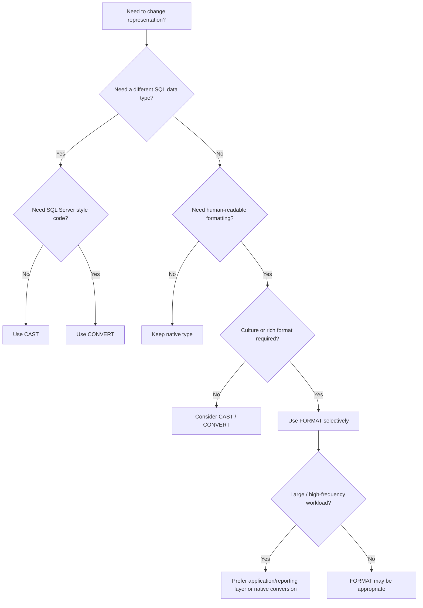

# 05- CAST vs CONVERT vs FORMAT

## Overview

SQL Server provides several mechanisms for converting and presenting values, but `CAST`, `CONVERT`, and `FORMAT` serve different purposes.

The distinction is important in production SQL because type conversion can affect:

- Query correctness.
- `NULL` behavior.
- Index usage and SARGability.
- Precision and rounding.
- Sorting and grouping.
- CPU consumption.
- API contracts.
- Data portability.
- Presentation-layer responsibilities.

A practical mental model is:

```text
CAST
  ↓
Standard SQL type conversion

CONVERT
  ↓
SQL Server-specific type conversion
+ style codes
+ binary conversion options

FORMAT
  ↓
Presentation-oriented string formatting
+ .NET format patterns
+ culture support
```

For most backend workloads:

> **Use `CAST` or `CONVERT` for data transformation. Use `FORMAT` primarily for human-readable presentation.**

## Quick Comparison

| Capability | `CAST` | `CONVERT` | `FORMAT` |
| --- | --- | --- | --- |
| Primary purpose | Type conversion | Type conversion | Presentation formatting |
| SQL standard | Yes | No | No |
| SQL Server-specific | No | Yes | Yes |
| Date style codes | No | Yes | No |
| .NET format patterns | No | No | Yes |
| Culture-aware formatting | No | Limited | Yes |
| Numeric formatting | Basic conversion | Basic conversion | Rich formatting |
| Returns formatted text | When target type is text | When target type is text | Yes |
| Typical performance | Efficient | Efficient | Relatively expensive |
| Good for predicates | Usually | Usually | Generally avoid |
| Good for API data | Yes | Yes | Usually avoid |
| Good for reports | Yes | Yes | Yes |
| Portability | Better | Lower | Lower |

## CAST

### What It Is

`CAST` converts an expression from one SQL data type to another.

```sql
CAST(expression AS data_type)
```

Example:

```sql
SELECT CAST(total_amount AS DECIMAL(12, 2))
FROM payments;
```

If `total_amount` is stored as a less precise numeric type, the expression is converted to `DECIMAL(12, 2)`.

### Why It Exists

Explicit type conversion removes ambiguity and gives the query author control over the type used in an expression.

This is important when:

- Combining different data types.
- Controlling numeric precision.
- Converting text to dates or numbers.
- Returning a specific type from a query.
- Avoiding undesirable implicit conversions.

### Basic Examples

```sql
SELECT CAST('2026-08-30' AS DATE);
```

```sql
SELECT CAST(1999.95 AS DECIMAL(12, 2));
```

```sql
SELECT CAST(order_id AS VARCHAR(50))
FROM orders;
```

### Converting to Integer

```sql
SELECT CAST(123.99 AS INT);
```

The fractional portion is discarded rather than rounded to the nearest integer.

For financial calculations, do not rely on an implicit conversion to communicate business rounding requirements. Use an explicit numeric operation such as `ROUND()` when rounding is required.

### Advantages

- Standard SQL syntax.
- Easy to read.
- Explicit about the target type.
- Generally efficient.
- More portable than SQL Server-specific conversion functions.

### Limitations

- Does not provide SQL Server date style codes.
- Does not provide culture-aware presentation formatting.
- Invalid conversions can raise errors.
- Converting to insufficient precision or scale can lose information.

## CONVERT

### What It Is

`CONVERT` is SQL Server's type-conversion function.

```sql
CONVERT(data_type, expression [, style])
```

The optional `style` argument is particularly useful for date/time and string conversions.

### Why It Exists

`CONVERT` provides SQL Server-specific conversion behavior that `CAST` does not expose, especially formatting styles.

For example:

```sql
SELECT CONVERT(VARCHAR(10), created_at, 23)
FROM orders;
```

Style `23` produces an ISO-like date representation:

```text
2026-08-30
```

### Date Conversion

Common SQL Server styles include:

| Style | Typical output | Direction |
| --- | --- | --- |
| `23` | `yyyy-mm-dd` | Date → text |
| `112` | `yyyymmdd` | Date → text |
| `120` | `yyyy-mm-dd hh:mi:ss` | Date/time → text |
| `121` | `yyyy-mm-dd hh:mi:ss.mmm` | Date/time → text |
| `101` | `mm/dd/yyyy` | Date → text |
| `103` | `dd/mm/yyyy` | Date → text |

Example:

```sql
SELECT
    CONVERT(VARCHAR(10), created_at, 23) AS order_date
FROM orders;
```

### Converting Text to Dates

`CONVERT` can also convert text into date/time types.

```sql
SELECT CONVERT(DATE, '2026-08-30', 23);
```

For production systems, prefer unambiguous input representations and parameterized values instead of relying on locale-dependent date strings.

### Advantages

- Efficient native SQL Server conversion.
- Supports style codes.
- Useful for SQL Server-specific date/time representations.
- More expressive than `CAST` for certain conversions.

### Limitations

- SQL Server-specific.
- Style codes are less self-explanatory than explicit format patterns.
- Invalid conversions can fail.
- It should not be treated as a general-purpose presentation framework.

## FORMAT

### What It Is

`FORMAT` converts a numeric or date/time value into a formatted string using .NET format patterns and an optional culture.

```sql
FORMAT(value, format [, culture])
```

Examples:

```sql
SELECT FORMAT(1999.95, 'N2');
```

```sql
SELECT FORMAT(
    created_at,
    'dd MMM yyyy'
)
FROM orders;
```

### Why It Exists

`FORMAT` is designed for richer presentation formatting than `CAST` and `CONVERT` provide.

It is useful when SQL Server itself needs to produce human-readable output such as:

```text
30 Aug 2026
₹1,999.95
85.25%
```

### Numeric Formatting

```sql
SELECT FORMAT(1234567.891, 'N2');
```

Result:

```text
1,234,567.89
```

Currency:

```sql
SELECT FORMAT(1999.95, 'C2', 'en-US');
```

Percentage:

```sql
SELECT FORMAT(0.8525, 'P2');
```

### Date Formatting

```sql
SELECT FORMAT(
    created_at,
    'yyyy-MM-dd HH:mm:ss'
)
FROM orders;
```

Human-readable:

```sql
SELECT FORMAT(
    created_at,
    'dd MMM yyyy'
)
FROM orders;
```

### Culture-Aware Formatting

```sql
SELECT FORMAT(
    amount,
    'C2',
    'en-US'
)
FROM payments;
```

versus:

```sql
SELECT FORMAT(
    amount,
    'C2',
    'de-DE'
)
FROM payments;
```

The underlying numeric value does not change. Only its textual representation changes.

### Advantages

- Rich formatting patterns.
- Culture-aware output.
- Convenient for reports.
- Useful for human-readable exports.

### Limitations

- Returns text.
- Relatively expensive compared with native conversion functions.
- SQL Server-specific.
- Poor choice for large-scale row-by-row formatting.
- Can encourage presentation logic to leak into database queries.

## Type Conversion vs Formatting

The most important conceptual distinction is:

```text
Conversion
    ↓
"I need this value to have another SQL data type."

Formatting
    ↓
"I need this value represented as human-readable text."
```

For example:

```sql
CAST(amount AS DECIMAL(12, 2))
```

means:

> Represent this expression as a decimal value.

Whereas:

```sql
FORMAT(amount, 'C2', 'en-US')
```

means:

> Produce a currency-formatted string for presentation.

This distinction becomes important when the result is subsequently:

- Calculated.
- Sorted.
- Grouped.
- Filtered.
- Joined.
- Serialized through an API.

## Choosing the Right Function

A useful decision table:

| Requirement | Preferred choice |
| --- | --- |
| Standard type conversion | `CAST` |
| SQL Server-specific conversion | `CONVERT` |
| Date style code | `CONVERT` |
| Simple conversion to string | `CAST` or `CONVERT` |
| Rich numeric formatting | `FORMAT` |
| Culture-specific formatting | `FORMAT` |
| Human-readable report | `FORMAT` can be appropriate |
| Filtering dates | Native date comparison |
| Sorting numbers | Native numeric column |
| Sorting dates | Native date/time column |
| Numeric aggregation | Native numeric values |
| REST API response | Preserve native values |
| Service-to-service payload | Preserve semantic types |
| High-volume row processing | Prefer `CAST`/`CONVERT` where possible |

## Date Conversion Examples

Assume:

```sql
CREATE TABLE orders (
    order_id BIGINT NOT NULL,
    created_at DATETIME2 NOT NULL
);
```

### CAST

```sql
SELECT
    CAST(created_at AS DATE) AS order_date
FROM orders;
```

This removes the time component from the expression.

The result remains a `DATE`, not a formatted string.

### CONVERT

```sql
SELECT
    CONVERT(DATE, created_at) AS order_date
FROM orders;
```

This is functionally similar for this use case.

For string output:

```sql
SELECT
    CONVERT(VARCHAR(10), created_at, 23) AS order_date
FROM orders;
```

### FORMAT

```sql
SELECT
    FORMAT(created_at, 'yyyy-MM-dd') AS order_date
FROM orders;
```

The last two produce text.

That distinction matters:

```text
CAST(created_at AS DATE)
        ↓
DATE

CONVERT(DATE, created_at)
        ↓
DATE

CONVERT(VARCHAR(10), created_at, 23)
        ↓
VARCHAR

FORMAT(created_at, 'yyyy-MM-dd')
        ↓
NVARCHAR/text
```

## Numeric Conversion Examples

Suppose:

```sql
SELECT
    CAST(amount AS DECIMAL(12, 2)) AS amount
FROM payments;
```

This produces a numeric value.

With `CONVERT`:

```sql
SELECT
    CONVERT(DECIMAL(12, 2), amount) AS amount
FROM payments;
```

These are often interchangeable when no SQL Server-specific style behavior is required.

With `FORMAT`:

```sql
SELECT
    FORMAT(amount, 'N2') AS amount
FROM payments;
```

the result is formatted text.

For financial calculations, the first two approaches are normally appropriate.

## Precision and Scale

Type conversion can change the precision of numeric data.

For example:

```sql
SELECT CAST(123.4567 AS DECIMAL(10, 2));
```

produces a value with two decimal places.

Do not confuse:

```sql
CAST(amount AS DECIMAL(12, 2))
```

with:

```sql
FORMAT(amount, 'N2')
```

The first controls the numeric type.

The second controls textual presentation.

This distinction is important in financial systems where:

- Arithmetic must remain numeric.
- Precision must be explicit.
- Rounding rules must be intentional.
- Currency formatting belongs at the presentation boundary.

## Implicit vs Explicit Conversion

SQL Server can automatically convert compatible data types.

For example:

```sql
SELECT *
FROM orders
WHERE customer_id = @customer_id;
```

If the parameter has a compatible type, no explicit conversion is necessary.

Problems occur when different data types are compared.

For example, if:

```text
customer_id → VARCHAR
@customer_id → INT
```

SQL Server may introduce an implicit conversion according to data type precedence.

This can have significant performance implications.

A useful rule is:

> **Align parameter types with column types instead of relying on SQL Server to perform implicit conversion.**

Explicit conversion is not automatically better if it is applied to the indexed column.

## Conversion and SARGability

Consider an indexed column:

```sql
CREATE INDEX IX_orders_created_at
ON orders(created_at);
```

Prefer:

```sql
SELECT *
FROM orders
WHERE created_at >= @start_date
  AND created_at < @end_date;
```

Avoid:

```sql
SELECT *
FROM orders
WHERE CAST(created_at AS DATE) = @target_date;
```

The second expression transforms the column before comparison and can reduce the optimizer's ability to perform an efficient index seek.

An even worse pattern for filtering is:

```sql
WHERE FORMAT(created_at, 'yyyy-MM-dd') = @target_date
```

The query is now doing presentation formatting as part of row selection.

The preferred data flow is:


Format after row selection whenever possible.

## Sorting

Never use formatted strings as a substitute for the underlying value when semantic sorting is required.

Bad:

```sql
SELECT
    FORMAT(amount, 'N2') AS amount
FROM payments
ORDER BY FORMAT(amount, 'N2');
```

Prefer:

```sql
SELECT
    FORMAT(amount, 'N2') AS amount
FROM payments
ORDER BY amount;
```

The output is formatted, but the database still sorts using the numeric value.

Similarly, avoid:

```sql
ORDER BY FORMAT(created_at, 'dd/MM/yyyy')
```

Prefer:

```sql
ORDER BY created_at;
```

Formatted dates can have textual ordering that differs from chronological ordering.

## GROUP BY and Aggregation

Keep values in their native types while grouping and aggregating.

Prefer:

```sql
SELECT
    customer_id,
    SUM(amount) AS total_amount
FROM payments
GROUP BY customer_id;
```

Then format only if the final result is explicitly intended for presentation:

```sql
SELECT
    customer_id,
    FORMAT(SUM(amount), 'N2') AS total_amount
FROM payments
GROUP BY customer_id;
```

Avoid formatting before aggregation:

```sql
SUM(FORMAT(amount, 'N2'))
```

because `FORMAT` produces text.

The correct conceptual pipeline is:

```text
Raw values
   ↓
Filter
   ↓
Group
   ↓
Aggregate
   ↓
Format final result
```

## CASE with CAST, CONVERT, and FORMAT

The functions can be combined with `CASE` when different conversion rules are required.

For example:

```sql
SELECT
    CASE
        WHEN status = 'active'
            THEN CAST(account_id AS VARCHAR(50))
        ELSE NULL
    END AS external_account_id
FROM accounts;
```

A SQL Server-specific style can be selected:

```sql
SELECT
    CASE
        WHEN include_time = 1
            THEN CONVERT(VARCHAR(19), created_at, 120)
        ELSE CONVERT(VARCHAR(10), created_at, 23)
    END AS display_timestamp
FROM orders;
```

For presentation-specific formatting:

```sql
SELECT
    CASE
        WHEN currency_code = 'USD'
            THEN FORMAT(amount, 'C2', 'en-US')
        WHEN currency_code = 'EUR'
            THEN FORMAT(amount, 'C2', 'de-DE')
        ELSE FORMAT(amount, 'N2')
    END AS display_amount
FROM payments;
```

This is appropriate for report generation, but usually not for a machine-oriented API.

## NULL Behavior

All three functions can produce `NULL` when their input is `NULL`.

For example:

```sql
SELECT
    CAST(NULL AS VARCHAR(20));
```

```sql
SELECT
    CONVERT(VARCHAR(20), NULL);
```

```sql
SELECT
    FORMAT(NULL, 'N2');
```

The result is `NULL`.

If a fallback value is required, use `COALESCE`:

```sql
SELECT
    COALESCE(
        FORMAT(amount, 'N2'),
        'N/A'
    ) AS display_amount
FROM payments;
```

Do not use formatting functions as a substitute for null-handling logic.

## Error Handling and TRY_CONVERT

`CAST` and `CONVERT` can fail when the input cannot be converted.

For example:

```sql
SELECT CAST('not-a-number' AS INT);
```

raises a conversion error.

When processing untrusted or potentially dirty data, SQL Server provides `TRY_CAST` and `TRY_CONVERT`.

```sql
SELECT TRY_CAST(raw_customer_id AS BIGINT)
FROM staging_customers;
```

Invalid values become `NULL` rather than aborting the conversion operation.

Similarly:

```sql
SELECT TRY_CONVERT(DATE, raw_date, 23)
FROM staging_orders;
```

This is particularly useful in:

- ETL pipelines.
- Data imports.
- Staging tables.
- Batch processing.
- Legacy-data migration.

A robust ingestion pattern is:

```text
External data
     ↓
Staging table
     ↓
TRY_CAST / TRY_CONVERT
     ↓
Validation
     ↓
Typed production table
```

`FORMAT` is not a replacement for `TRY_CAST` or `TRY_CONVERT`.

## Performance Considerations

The three functions have different performance characteristics.

### CAST

`CAST` is generally lightweight and should be the default when standard conversion is sufficient.

### CONVERT

`CONVERT` is also generally efficient and is often preferable when SQL Server style codes are required.

### FORMAT

`FORMAT` is considerably more expensive for large row sets because it relies on CLR-based formatting.

For example:

```sql
SELECT
    FORMAT(created_at, 'yyyy-MM-dd')
FROM orders;
```

can become CPU-intensive when executed across millions of rows.

If the required representation is simple, compare it with:

```sql
SELECT
    CONVERT(VARCHAR(10), created_at, 23)
FROM orders;
```

Measure using:

```sql
SET STATISTICS TIME ON;
SET STATISTICS IO ON;
```

For production workloads, also inspect the actual execution plan and query monitoring data.

## Conversion Inside Predicates

Conversion placement matters.

Consider:

```sql
WHERE CAST(customer_id AS VARCHAR(50)) = @customer_id
```

versus:

```sql
WHERE customer_id = CAST(@customer_id AS BIGINT)
```

If `customer_id` is indexed and the conversion is valid, converting the parameter rather than the column is generally preferable.

The broader principle is:

> **Do not transform an indexed column unnecessarily when you can normalize the comparison value instead.**

This is especially important for high-volume API endpoints.

## API and Backend Architecture

A backend service should generally preserve semantic types when communicating with the database.

For example:

```sql
SELECT
    order_id,
    total_amount,
    created_at
FROM orders
WHERE customer_id = @customer_id;
```

A Django or FastAPI service can serialize those values into an API contract.

```json
{
  "order_id": 12345,
  "total_amount": 1999.95,
  "created_at": "2026-08-30T14:30:00"
}
```

Avoid:

```sql
SELECT
    order_id,
    FORMAT(total_amount, 'C2', 'en-US') AS total_amount,
    FORMAT(created_at, 'dd MMM yyyy') AS created_at
FROM orders;
```

for general-purpose APIs.

That creates a response such as:

```json
{
  "order_id": 12345,
  "total_amount": "$1,999.95",
  "created_at": "30 Aug 2026"
}
```

This is presentation data, not strong semantic data.

It also makes localization harder because the database query has already chosen the representation.

## Reporting and Export Workloads

The trade-off changes for reports.

Suppose an internal finance report explicitly requires:

```text
Customer | Revenue | Last Payment
---------|---------|-------------
Acme     | $12,450.00 | 30 Aug 2026
```

Formatting in SQL can be reasonable:

```sql
SELECT
    customer_name,
    FORMAT(SUM(amount), 'C2', 'en-US') AS revenue,
    FORMAT(MAX(paid_at), 'dd MMM yyyy') AS last_payment
FROM payments
GROUP BY customer_name;
```

The query's output is intentionally presentation-oriented.

For a reusable reporting dataset, however, consider returning typed values and letting the reporting layer perform final formatting.

## Production Decision Framework

Use the following decision process:



The simplest correct function should normally win.

## Common Mistakes

### Using FORMAT for Filtering

Bad:

```sql
WHERE FORMAT(created_at, 'yyyy-MM-dd') = @date
```

Prefer:

```sql
WHERE created_at >= @start
  AND created_at < @end;
```

Formatting is not a filtering strategy.

### Formatting Before Aggregation

Bad:

```sql
SUM(FORMAT(amount, 'N2'))
```

Prefer:

```sql
FORMAT(SUM(amount), 'N2')
```

Or, for machine-oriented output:

```sql
SUM(amount)
```

### Sorting Formatted Values

Bad:

```sql
ORDER BY FORMAT(amount, 'N2')
```

Prefer:

```sql
ORDER BY amount
```

### Converting the Indexed Column Unnecessarily

Bad:

```sql
WHERE CAST(customer_id AS VARCHAR(50)) = @customer_id
```

Prefer converting the input parameter to the column's type when appropriate.

### Confusing Numeric Precision with Display Precision

These are different:

```sql
CAST(amount AS DECIMAL(12, 2))
```

and:

```sql
FORMAT(amount, 'N2')
```

The first changes the numeric representation.

The second creates formatted text.

### Using FORMAT Everywhere

`FORMAT` is convenient but should not become the default conversion function.

For simple date output:

```sql
CONVERT(VARCHAR(10), created_at, 23)
```

may be more appropriate than:

```sql
FORMAT(created_at, 'yyyy-MM-dd')
```

### Returning Presentation Strings from APIs

Avoid making clients consume:

```json
{
  "amount": "$1,999.95"
}
```

when the semantic value is numeric.

Prefer:

```json
{
  "amount": 1999.95,
  "currency": "USD"
}
```

The client or API serialization layer can determine how the value is displayed.

### Relying on Implicit Conversion

Do not assume SQL Server will always perform implicit conversion efficiently.

Check:

- Column data type.
- Parameter data type.
- Data type precedence.
- Execution plan.
- Index usage.

Align application parameter types with database column types.

## Security Considerations

Type conversion does not provide SQL injection protection.

Do not dynamically construct conversion expressions from untrusted input.

Bad:

```python
query = f"""
    SELECT CONVERT(VARCHAR(50), amount, {user_style})
    FROM payments
"""
```

If a style or format must be configurable, validate it against a strict allowlist.

Use parameterized queries for values:

```python
cursor.execute(
    """
    SELECT order_id, amount
    FROM orders
    WHERE customer_id = ?
    """,
    [customer_id],
)
```

For Django and FastAPI applications, use the framework's parameterization mechanisms rather than interpolating request values into SQL.

## Scalability Considerations

Conversion functions are usually inexpensive compared with network and application overhead, but row-by-row expression cost becomes important at scale.

For high-throughput systems:

- Avoid unnecessary conversion in hot paths.
- Avoid formatting thousands of API rows inside SQL.
- Preserve native database types.
- Use typed query parameters.
- Avoid expressions over indexed columns in predicates.
- Push presentation formatting toward the presentation boundary.
- Precompute reporting values only when there is a measured need.
- Benchmark large queries rather than assuming equivalent functions have equivalent cost.

A useful architecture is:

```text
Production tables
       ↓
Typed SQL query
       ↓
Application/service
       ↓
API serialization
       ↓
Client formatting
```

For reporting:

```text
Production tables
       ↓
Reporting query
       ↓
Aggregation
       ↓
Optional SQL formatting
       ↓
Report/export
```

## Operational Considerations

When changing conversion logic in production, validate:

- Result data type.
- Precision and scale.
- `NULL` behavior.
- Invalid-input behavior.
- Date/time semantics.
- Time zone assumptions.
- Index usage.
- CPU impact.
- Query latency.
- API response compatibility.

For a high-volume query, compare before and after execution metrics rather than evaluating the conversion function in isolation.

Useful SQL Server diagnostics include:

```sql
SET STATISTICS IO ON;
SET STATISTICS TIME ON;
```

and the actual execution plan.

For production services, correlate database changes with:

- Query duration.
- CPU utilization.
- Logical reads.
- Database wait statistics.
- API latency.
- Error rates.

## Interview Traps

| Question | Strong answer |
| --- | --- |
| `CAST` vs `CONVERT`? | Both convert types; `CAST` is standard SQL, while `CONVERT` is SQL Server-specific and supports style codes |
| `CONVERT` vs `FORMAT`? | `CONVERT` primarily performs type conversion with optional SQL Server styles; `FORMAT` is designed for rich presentation formatting |
| Which is usually fastest? | `CAST` and `CONVERT` are generally much cheaper than `FORMAT` |
| Does `FORMAT` return a numeric value? | No, it returns formatted text |
| Should `FORMAT` be used in `WHERE`? | Generally no; use native typed predicates |
| Why avoid conversion on indexed columns? | It can prevent efficient index access and make predicates less SARGable |
| When should `FORMAT` be used? | Human-readable reports, exports, and presentation-oriented output where its formatting capabilities justify the cost |
| How do you safely convert dirty input? | Use `TRY_CAST` or `TRY_CONVERT` where invalid input should become `NULL` rather than aborting |
| Does `CAST(... AS DECIMAL(12,2))` equal `FORMAT(..., 'N2')`? | No; the former produces a numeric value with defined precision/scale, while the latter produces formatted text |
| Should APIs return formatted currency strings? | Usually no; return the numeric amount and currency separately |
| What should be used for date filtering? | Typed range predicates against the native date/time column |
| Why can `FORMAT` be expensive? | It uses CLR-based formatting and has higher per-row overhead |

## Key Takeaways

- **`CAST` is the default standard SQL choice for explicit type conversion; `CONVERT` is the SQL Server-specific choice when features such as style codes are required.**
- **`FORMAT` is primarily for presentation**, returning formatted text with rich .NET patterns and optional culture support.
- **Keep native types for filtering, joining, sorting, and aggregation**; avoid applying conversion or formatting functions unnecessarily to indexed columns.
- **Prefer typed values in backend APIs and service-to-service communication**, moving locale-specific presentation formatting to the appropriate presentation boundary.
- **Use `TRY_CAST` and `TRY_CONVERT` for potentially invalid external data**, and benchmark conversion-heavy queries when operating at production scale.