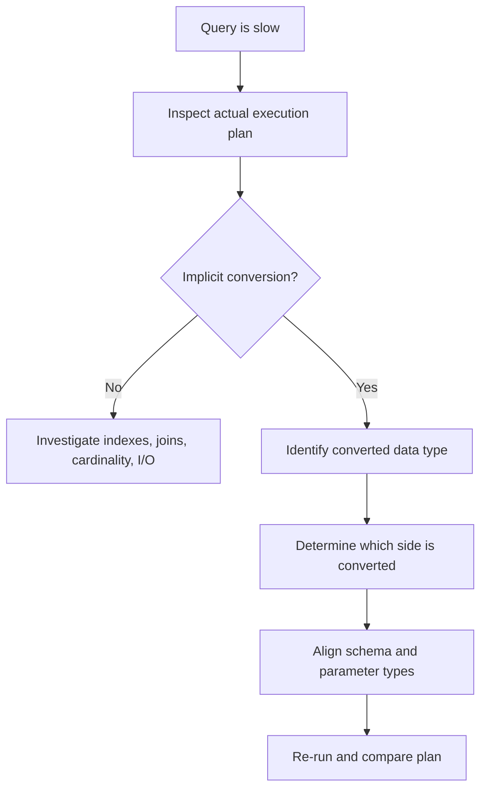
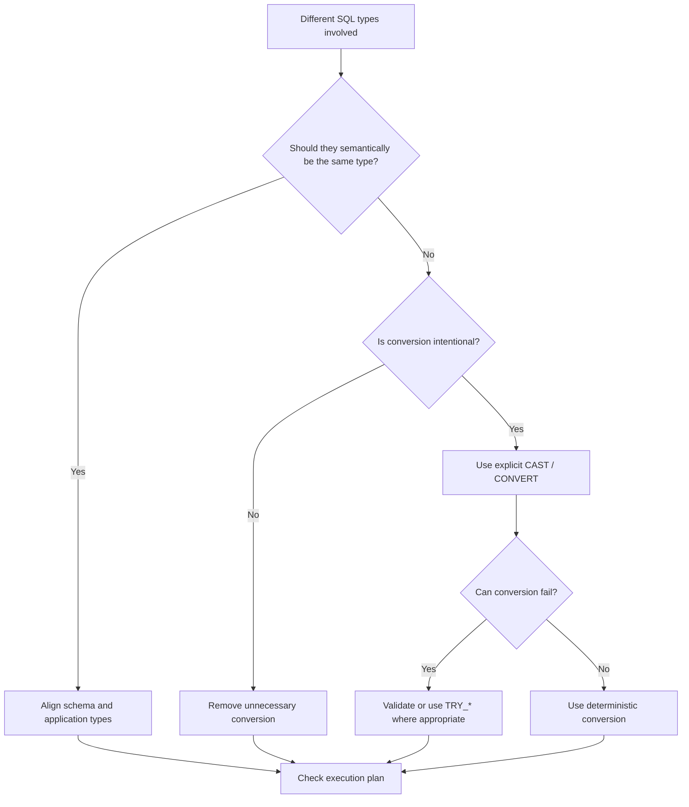

# 09- Implicit vs Explicit Conversion

## Overview

SQL type conversion occurs whenever a value is interpreted as a different data type. The conversion can be **explicit**, where the query specifies the target type, or **implicit**, where the database engine performs the conversion automatically to make an expression valid.

For backend systems, the distinction matters because implicit conversion can affect:

- Query correctness.
- Index usage.
- Execution plans.
- CPU consumption.
- Data truncation and precision.
- Application/database compatibility.
- Migration safety.
- Production reliability.

Explicit conversion makes the intended data contract visible:

```sql
CAST(order_id AS VARCHAR(20))
```

Implicit conversion allows the database engine to infer the required conversion:

```sql
WHERE numeric_column = '100'
```

The second query may work, but the database must reconcile the different types before evaluating the predicate.

> **Production rule:** Prefer explicit conversion at system boundaries and whenever the intended data type is not obvious. Do not rely on implicit conversion as part of a schema or API contract.

## Explicit Conversion

Explicit conversion means the SQL statement directly specifies the target data type.

Common SQL Server mechanisms include:

```sql
CAST(expression AS data_type)
```

and:

```sql
CONVERT(data_type, expression [, style])
```

Example:

```sql
SELECT CAST(order_id AS VARCHAR(20))
FROM orders;
```

The query explicitly states:

```text
order_id → VARCHAR(20)
```

This makes the conversion visible to developers, reviewers, and the query optimizer.

### Why Explicit Conversion Exists

Explicit conversion is useful when:

- A value must be represented using a specific type.
- An API or integration requires a defined representation.
- A comparison involves intentionally different types.
- Precision or length must be controlled.
- A migration requires deterministic conversion.
- A query needs to document its intended semantics.

Example:

```sql
SELECT
    CAST(total_amount AS DECIMAL(12, 2)) AS total_amount
FROM invoices;
```

The desired precision is part of the query rather than being inferred from surrounding expressions.

## Implicit Conversion

Implicit conversion occurs when SQL Server automatically converts one data type to another.

For example:

```sql
DECLARE @id INT = 100;

SELECT *
FROM orders
WHERE order_id = '100';
```

If `order_id` is an `INT`, SQL Server can implicitly convert the string literal to an integer.

Conceptually:

```text
order_id INT
     =
'100' VARCHAR
     ↓
Implicit conversion
     ↓
INT = INT
```

The database chooses the conversion according to its data-type precedence and conversion rules.

Implicit conversion is convenient, but convenience should not be confused with good schema design.

## Data Type Precedence

When SQL Server encounters different data types in an expression, it uses its data-type precedence rules to determine which type should dominate.

For example:

```sql
SELECT 10 + '20';
```

SQL Server can convert the string representation to an integer and perform numeric addition.

Conceptually:

```text
INT + VARCHAR
   ↓
VARCHAR converted to INT
   ↓
INT + INT
```

The exact behavior depends on the participating types and whether the values are convertible.

A critical production issue is that implicit conversion is not always applied to the side developers expect.

## How Implicit Conversion Can Affect Indexes

Consider:

```sql
CREATE TABLE customers (
    customer_id INT NOT NULL,
    email VARCHAR(255) NOT NULL
);

CREATE INDEX IX_customers_email
ON customers(email);
```

Now compare:

```sql
SELECT customer_id
FROM customers
WHERE email = 'alice@example.com';
```

with a parameter supplied using the wrong type:

```text
email VARCHAR
parameter NVARCHAR
```

SQL Server may introduce an implicit conversion because `NVARCHAR` has higher type precedence than `VARCHAR`.

Conceptually:

```text
VARCHAR column
      ↓
CONVERT(NVARCHAR, email)
      ↓
comparison
```

When the conversion is applied to the indexed column, the query may become less efficient and can result in a scan instead of an efficient seek.

The exact execution plan depends on the data types, collation, indexes, cardinality, and optimizer behavior, so the execution plan should be treated as the source of truth.

## Why Parameter Types Matter

Application code can accidentally introduce implicit conversions by binding parameters using a different SQL type than the column.

For example:

```text
Database:
email VARCHAR(255)

Application:
parameter NVARCHAR
```

The SQL may look perfectly reasonable:

```sql
WHERE email = @email
```

but the database receives a type mismatch.

This is particularly relevant in:

- Django database drivers.
- SQLAlchemy.
- Raw Python database drivers.
- Java/JDBC applications.
- .NET database clients.
- Stored procedures.
- ETL pipelines.

A senior engineer should inspect not only SQL text but also the **actual parameter types** reaching the database.

## Explicit vs Implicit Conversion

| Characteristic | Explicit conversion | Implicit conversion |
| --- | --- | --- |
| Developer controls conversion | Yes | No |
| Intent visible in SQL | Yes | Often no |
| Depends on type precedence | No | Yes |
| Easier to review | Yes | No |
| Can introduce runtime failures | Yes | Yes |
| Can affect indexes | Yes | Yes |
| Suitable for contracts | Yes | No |
| Suitable for accidental type mismatches | No | Sometimes unavoidable |
| Recommended for critical boundaries | Yes | No |

Implicit conversion is not inherently incorrect. It becomes a problem when developers depend on it without understanding its consequences.

## Common Implicit Conversion Examples

### Numeric and String Values

```sql
SELECT
    100 + '25' AS result;
```

The string can be implicitly converted to a numeric type.

This is convenient for literals but should not become a pattern for unvalidated external data.

### Integer and Decimal

```sql
SELECT
    10 + 2.50 AS result;
```

The integer participates in an expression with a decimal value and is converted according to SQL Server's type rules.

For financial calculations, explicitly defining the required decimal precision is safer:

```sql
SELECT
    CAST(10 AS DECIMAL(12, 2))
    + CAST(2.50 AS DECIMAL(12, 2));
```

### Date and String

```sql
SELECT *
FROM orders
WHERE order_date = '2026-08-30';
```

SQL Server may implicitly convert the string literal into a compatible date type.

For application-generated SQL, prefer typed parameters rather than relying on string parsing.

## Explicit Conversion with CAST

`CAST` is the clearest general-purpose syntax:

```sql
SELECT CAST(created_at AS DATE)
FROM orders;
```

It is useful when:

- Portability matters.
- No SQL Server-specific conversion style is required.
- The target type is the important part of the operation.

Example:

```sql
SELECT
    CAST(total_amount AS DECIMAL(12, 2)) AS total_amount
FROM payments;
```

## Explicit Conversion with CONVERT

`CONVERT` is SQL Server-specific and supports additional formatting styles.

```sql
SELECT
    CONVERT(VARCHAR(10), created_at, 23) AS created_date
FROM orders;
```

Here:

```text
created_at → VARCHAR(10)
style = 23
```

produces a `yyyy-mm-dd` representation.

Use `CONVERT` when SQL Server-specific functionality such as style codes is required.

## Explicit Conversion with TRY_CAST

`TRY_CAST` returns `NULL` when a conversion fails instead of raising a conversion error.

```sql
SELECT
    TRY_CAST(raw_customer_id AS INT) AS customer_id
FROM import_data;
```

For:

```text
raw_customer_id = '1001'
```

the result is:

```text
1001
```

For:

```text
raw_customer_id = 'INVALID'
```

the result is:

```text
NULL
```

This is useful for data ingestion and validation pipelines.

## Explicit Conversion with TRY_CONVERT

`TRY_CONVERT` provides similar behavior while supporting SQL Server's `CONVERT` style parameter.

```sql
SELECT
    TRY_CONVERT(DATE, raw_date, 23) AS parsed_date
FROM staging_orders;
```

This is useful when external input has a known textual format.

## Implicit Conversion in Comparisons

Consider:

```sql
CREATE TABLE orders (
    order_id INT NOT NULL,
    customer_id INT NOT NULL
);
```

A correctly typed comparison is:

```sql
SELECT *
FROM orders
WHERE customer_id = 100;
```

A mismatched comparison is:

```sql
SELECT *
FROM orders
WHERE customer_id = '100';
```

SQL Server may convert `'100'` to `INT`.

Although this usually works for a simple literal, application code should still bind the parameter as the correct type.

The stronger engineering approach is:

```text
Application type
      ↓
Database driver parameter type
      ↓
Database column type
```

These should agree whenever practical.

## Implicit Conversion and Query Performance

Implicit conversion becomes particularly dangerous when it occurs on large tables.

Suppose:

```sql
CREATE INDEX IX_orders_customer_id
ON orders(customer_id);
```

A parameter with a compatible integer type is preferable:

```sql
DECLARE @customer_id INT = 100;

SELECT *
FROM orders
WHERE customer_id = @customer_id;
```

Avoid unnecessarily forcing a conversion:

```sql
WHERE CONVERT(VARCHAR(20), customer_id) = @customer_id_text
```

This changes the expression from:

```text
indexed integer → comparison
```

to:

```text
conversion of indexed value → comparison
```

The latter can prevent efficient index access.

## Implicit Conversion and Execution Plans

SQL Server execution plans can expose implicit conversions through warnings or `CONVERT_IMPLICIT` expressions.

A typical investigation workflow is:



Do not optimize based solely on the presence of the word "conversion." Determine:

- Which expression is being converted.
- Which data type has higher precedence.
- Whether the indexed column is converted.
- How many rows are affected.
- Whether the conversion changes the access method.
- Whether the conversion is actually responsible for the performance problem.

## Implicit Conversion and SARGability

A predicate is generally more optimizer-friendly when the indexed column can be compared directly against a compatible value.

Prefer:

```sql
WHERE created_at >= @start_time
  AND created_at < @end_time
```

over:

```sql
WHERE CAST(created_at AS DATE) = @business_date
```

The first form preserves the timestamp column as the searchable expression.

This principle applies beyond dates:

```sql
-- Prefer
WHERE customer_id = @customer_id

-- Avoid unnecessary conversion
WHERE CAST(customer_id AS VARCHAR(20)) = @customer_id_text
```

The goal is not to eliminate every conversion. The goal is to avoid unnecessary transformations of indexed columns.

## Implicit Conversion During JOINs

Type mismatches in joins can be expensive.

Suppose:

```text
orders.customer_id = INT
legacy_customers.customer_id = VARCHAR(20)
```

A join such as:

```sql
SELECT ...
FROM orders o
JOIN legacy_customers c
    ON o.customer_id = c.customer_id;
```

may require conversion because the two sides have different types.

For large tables this can significantly affect query performance.

The best solution is usually to fix the schema mismatch rather than repeatedly converting values at query time.

If schema migration is not immediately possible, isolate the conversion carefully and validate the execution plan.

## Schema Design and Type Compatibility

The strongest way to prevent conversion problems is to maintain compatible types across related columns.

Good:

```text
orders.customer_id       INT
payments.customer_id     INT
shipments.customer_id    INT
```

Problematic:

```text
orders.customer_id       INT
payments.customer_id     VARCHAR(50)
shipments.customer_id    BIGINT
```

Every mismatch creates additional opportunities for:

- Implicit conversion.
- Conversion errors.
- Poor query plans.
- Application bugs.
- Data-quality problems.

Foreign-key relationships should normally use compatible data types.

## String Type Compatibility

SQL Server distinguishes between:

```text
VARCHAR
NVARCHAR
```

`NVARCHAR` supports Unicode data, while `VARCHAR` uses the database/code-page semantics associated with the column and collation.

A mismatch can introduce implicit conversions.

For example:

```sql
DECLARE @email NVARCHAR(255) = N'alice@example.com';

SELECT *
FROM customers
WHERE email = @email;
```

If `customers.email` is `VARCHAR`, SQL Server may need to reconcile the types.

The correct approach is not automatically "use NVARCHAR everywhere." Choose the column type based on the application's data requirements and ensure parameters use compatible types.

## Numeric Type Compatibility

Numeric mismatches can also cause conversions:

```text
INT
BIGINT
DECIMAL
NUMERIC
FLOAT
```

Do not assume all numeric types are interchangeable.

For example, converting from an exact numeric type to a floating-point type can change numerical semantics.

For financial values:

```sql
DECIMAL(19, 4)
```

is generally more appropriate than `FLOAT`.

When an expression combines different numeric types, explicitly define the desired type when precision and scale matter.

## Conversion and Precision Loss

Conversions can silently change the representation of data.

Example:

```sql
SELECT CAST(
    123.4567 AS DECIMAL(10, 2)
) AS amount;
```

The resulting value is subject to the target type's precision and scale.

Likewise:

```sql
SELECT CAST(
    '2026-08-30 14:35:42.1234567' AS DATETIME2(3)
);
```

reduces the available fractional-second precision.

Explicit conversion is valuable here because it makes the intended loss visible in code.

## Conversion and Truncation

String conversion can also truncate data.

For example:

```sql
SELECT CAST('production-order-12345' AS VARCHAR(10));
```

The target length is insufficient for the source value.

Never choose a conversion length arbitrarily in production code.

For persisted data migrations, validate:

- Maximum source length.
- Target column length.
- Truncation behavior.
- Character encoding.
- Existing invalid values.

A safe migration should identify problematic rows before modifying production data.

## Conversion at Application Boundaries

Backend systems frequently cross several type systems:

```text
HTTP JSON
    ↓
Python
    ↓
Database driver
    ↓
SQL
    ↓
Database column
```

For example:

```json
{
  "customer_id": 1001
}
```

should ideally become:

```text
Python int
    ↓
SQL INT parameter
    ↓
INT column
```

Avoid:

```text
JSON number
    ↓
Python string
    ↓
VARCHAR SQL parameter
    ↓
INT database column
```

The latter introduces unnecessary conversion.

This is particularly important in high-throughput Django and FastAPI services.

## Parameterized Queries

Parameterized queries provide both security and type clarity.

Prefer:

```python
cursor.execute(
    """
    SELECT order_id, created_at
    FROM orders
    WHERE customer_id = ?
    """,
    (customer_id,),
)
```

The exact parameter placeholder depends on the Python database driver, but the principle remains:

```text
SQL structure
+
typed parameter
```

Do not build SQL by concatenating values:

```python
query = f"""
SELECT *
FROM orders
WHERE customer_id = {customer_id}
"""
```

Parameterized queries reduce SQL injection risk and allow the database driver to communicate parameter values and types appropriately.

## ORM Considerations

ORMs can hide conversion behavior.

For example, Django:

```python
Order.objects.filter(customer_id=customer_id)
```

normally handles parameter binding for you.

However, raw SQL, annotations, database functions, custom expressions, and legacy schemas can introduce type mismatches.

When investigating a slow ORM query:

1. Inspect the generated SQL.
2. Inspect the actual parameter types when possible.
3. Check the execution plan.
4. Look for implicit conversions.
5. Verify index usage.
6. Correct the underlying type mismatch rather than masking it.

The ORM does not eliminate database type semantics.

## Production Data Migration

Implicit conversion is especially risky during migrations.

Suppose:

```text
legacy.customer_id = VARCHAR(50)
new.customer_id    = INT
```

A migration should not blindly execute:

```sql
INSERT INTO new_customers (customer_id)
SELECT customer_id
FROM legacy_customers;
```

Instead, validate the conversion first:

```sql
SELECT
    customer_id
FROM legacy_customers
WHERE TRY_CAST(customer_id AS INT) IS NULL
  AND customer_id IS NOT NULL;
```

Then quantify the affected records.

A robust migration flow is:

```text
Legacy data
    ↓
Validate convertibility
    ↓
Identify invalid records
    ↓
Remediate data
    ↓
Convert
    ↓
Load into new schema
    ↓
Validate counts and constraints
```

This prevents an implicit conversion from becoming an uncontrolled migration failure.

## Production Considerations

### Performance

Monitor for implicit conversions in high-volume queries.

Useful indicators include:

- Unexpected table scans.
- Index seeks becoming scans.
- High CPU usage.
- Increased logical reads.
- Execution-plan warnings.
- Regression after application deployments.

Parameter type changes can alter query plans even when the SQL text remains unchanged.

### Scalability

A conversion applied to one row may be negligible.

A conversion applied to hundreds of millions of rows can become a major CPU and I/O cost.

Avoid per-row conversions in:

- Large joins.
- High-frequency API queries.
- Reporting queries over transactional tables.
- Batch jobs.
- Event-processing workloads.

Normalize types at schema and application boundaries instead.

### Reliability

Implicit conversion can fail unexpectedly when data changes.

For example:

```sql
WHERE customer_id = raw_customer_id
```

may work while all existing `raw_customer_id` values are numeric, then fail when one malformed value arrives.

Do not confuse "currently convertible" with "type-safe."

### Monitoring

For production systems, monitor:

- Query duration.
- CPU time.
- Logical reads.
- Execution-plan changes.
- Scan/seek ratios.
- Conversion warnings.
- Failed conversion counts during ingestion.
- Database driver parameter-type changes after application releases.

Performance regressions caused by implicit conversion can be subtle because the query itself may still return correct results.

## Common Mistakes

### Relying on Implicit Conversion Because "SQL Handles It"

This works until:

- Data changes.
- Table size increases.
- An index becomes important.
- A deployment changes parameter types.
- A different database engine is introduced.

Treat implicit conversion as an engine behavior, not a data contract.

### Converting Indexed Columns Unnecessarily

Avoid:

```sql
WHERE CAST(customer_id AS VARCHAR(20)) = @customer_id
```

when the parameter can be supplied as `INT`.

Prefer:

```sql
WHERE customer_id = @customer_id
```

with a correctly typed parameter.

### Assuming Literal Conversion and Parameter Conversion Are Equivalent

These may behave differently from a performance perspective:

```sql
WHERE customer_id = '100'
```

and:

```sql
WHERE customer_id = @customer_id
```

The second query's behavior depends on the actual parameter type.

Always investigate the real workload rather than testing only with literals.

### Ignoring VARCHAR/NVARCHAR Mismatches

A seemingly harmless Unicode/non-Unicode mismatch can affect comparisons and index access.

Align:

```text
column type
parameter type
application representation
```

where possible.

### Using String Conversion for Numeric Comparisons

Avoid:

```sql
WHERE CAST(order_id AS VARCHAR(20)) = @order_id
```

when the application can send an integer.

Compare values using their native semantic types.

### Using TRY_CAST to Hide Invalid Production Data

This:

```sql
TRY_CAST(raw_value AS INT)
```

is useful for staging and validation.

It is dangerous when used to silently discard malformed data without monitoring.

### Fixing the Query Instead of Fixing the Schema

If every query contains:

```sql
CAST(a.customer_id AS VARCHAR(20))
```

the real problem may be incompatible schema design.

Repeated conversion is often a symptom of a data-model problem.

## Best Practices

| Area | Recommendation |
| --- | --- |
| Schema design | Use compatible types for related columns |
| Application parameters | Bind parameters using types compatible with database columns |
| SQL expressions | Use explicit conversion when semantics need to be controlled |
| External input | Validate and explicitly convert at ingestion boundaries |
| Indexed columns | Avoid unnecessary functions and conversions on indexed expressions |
| Numeric data | Explicitly control precision and scale when required |
| Date/time data | Use native temporal types and explicit time-zone semantics |
| Strings | Choose `VARCHAR` vs `NVARCHAR` intentionally |
| Migrations | Validate conversion before modifying production data |
| Performance debugging | Inspect actual execution plans for implicit conversions |
| ORMs | Inspect generated SQL and parameter behavior when diagnosing issues |
| Security | Use parameterized queries rather than string-built SQL |
| Error handling | Use `TRY_CAST`/`TRY_CONVERT` where invalid input is expected and observable |
| Portability | Avoid depending on database-specific implicit conversion behavior |

## A Practical Decision Rule

Use the following decision process when encountering a conversion:



The senior-level approach is not:

> "Always use explicit conversion."

It is:

> **Make type compatibility intentional, make required conversions explicit, and verify that conversions do not create correctness or performance problems.**

## Interview Traps

| Question | Strong answer |
| --- | --- |
| What is implicit conversion? | Automatic conversion performed by the database to reconcile compatible but different data types |
| What is explicit conversion? | Conversion explicitly requested using functions such as `CAST` or `CONVERT` |
| Why can implicit conversion hurt performance? | It can introduce expressions such as `CONVERT_IMPLICIT`, potentially preventing efficient index access and increasing CPU work |
| Is implicit conversion always bad? | No. Simple compatible literals may be safely converted; the problem is relying on it without understanding its type and performance implications |
| What determines which type SQL Server converts? | Its data-type precedence and conversion rules |
| Why are parameter types important? | A parameter with an incompatible type can cause conversion at runtime and potentially affect index usage |
| Why can `VARCHAR` vs `NVARCHAR` matter? | Their type precedence and encoding semantics can introduce implicit conversions |
| How do you detect implicit conversions? | Inspect the actual execution plan and look for implicit conversion warnings or conversion operators |
| Should you always use `CAST` to fix an implicit conversion? | No. First determine whether the schema or parameter type is wrong; conversion in the query can make performance worse |
| Why is schema alignment preferable to repeated conversion? | Compatible schema types reduce runtime work, simplify queries, and make joins and indexes more predictable |
| When is `TRY_CAST` useful? | During controlled ingestion or validation where malformed values should become `NULL` rather than aborting the query |
| Can implicit conversion cause incorrect results? | Yes, especially with incompatible representations, precision loss, truncation, collation behavior, or ambiguous date/string values |
| What is the best way to fix conversion problems in a large join? | Prefer aligning the underlying column types rather than repeatedly converting rows during the join |
| Does an ORM eliminate implicit conversion issues? | No. The database still receives typed parameters and executes according to database type rules |

## Key Takeaways

- **Implicit conversion is automatic, not inherently safe or efficient**; understand SQL Server's type precedence and inspect the actual execution plan.
- **Prefer compatible types across schemas, joins, and application parameters** so the database does not perform unnecessary runtime conversions.
- **Use explicit `CAST` or `CONVERT` when conversion is intentional**, especially when precision, length, formatting, or data semantics matter.
- **Avoid conversions on indexed columns when a correctly typed parameter or range predicate can express the same operation**, because conversions can interfere with efficient index access.
- **Treat conversion failures as data-quality or contract problems**, using `TRY_CAST`/`TRY_CONVERT` selectively and observably rather than silently hiding invalid data.