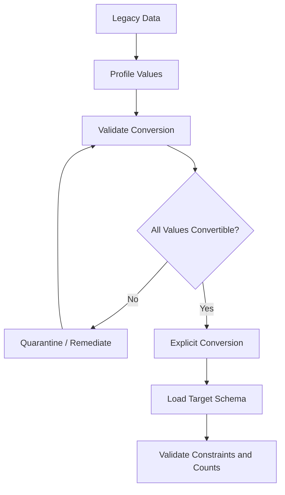
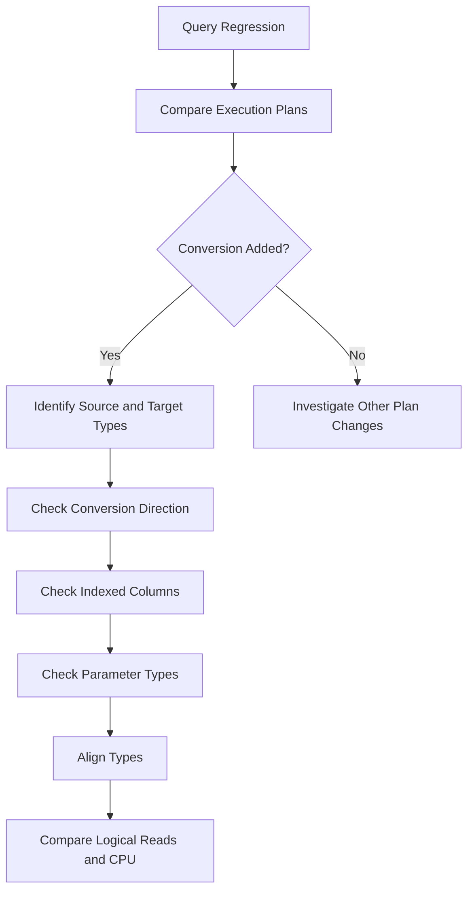

# 10- Conversion Rules

## Overview

SQL type conversion determines how values of different data types interact in expressions, comparisons, assignments, joins, and function calls. Conversion can be **explicit**, requested by the query, or **implicit**, performed automatically by the database engine.

Understanding conversion rules is important because a conversion that appears harmless can change:

- Whether a query succeeds or fails.
- Which value is compared.
- Precision and scale.
- String length and truncation behavior.
- Date/time interpretation.
- Index access and execution plans.
- CPU and I/O consumption.
- Portability between database systems.

This document focuses on SQL Server conversion behavior because functions such as `CONVERT`, `TRY_CONVERT`, and SQL Server data-type precedence are particularly relevant to these rules.

## Conversion Model

A conversion occurs when SQL Server needs to reconcile two different data types.

For example:

```sql
DECLARE @customer_id INT = 100;

SELECT *
FROM customers
WHERE customer_id = '100';
```

Conceptually, SQL Server needs to transform the expression into compatible types:

```text
INT column
    +
VARCHAR literal
    ↓
Type precedence
    ↓
VARCHAR → INT
    ↓
INT = INT
```

The important question is not simply whether the query works. A production engineer should also ask:

- Which value is converted?
- Is the conversion lossless?
- Can conversion fail?
- Is the conversion performed once or per row?
- Does it affect index usage?
- Is the conversion deterministic?
- Is the conversion appropriate for the application's data contract?

## Explicit Conversion

Explicit conversion directly specifies the desired target type.

```sql
SELECT CAST(order_id AS VARCHAR(20))
FROM orders;
```

or:

```sql
SELECT CONVERT(VARCHAR(20), order_id)
FROM orders;
```

Explicit conversion is preferable when the conversion is intentional and part of the query's semantics.

### Common Reasons to Convert Explicitly

Use explicit conversion when:

- Formatting a value for presentation.
- Controlling numeric precision.
- Converting imported data.
- Comparing intentionally different representations.
- Migrating a schema.
- Controlling date/time representation.
- Making a conversion contract obvious to reviewers.

Example:

```sql
SELECT
    CAST(total_amount AS DECIMAL(19, 4)) AS total_amount
FROM payments;
```

The precision and scale are explicit rather than inferred.

## Implicit Conversion

Implicit conversion occurs when SQL Server automatically converts one type to another.

For example:

```sql
SELECT *
FROM orders
WHERE order_id = '100';
```

If `order_id` is an `INT`, SQL Server can convert the string literal to `INT`.

Implicit conversion is often convenient for literals and simple expressions, but it should not be used as a substitute for compatible schema and application types.

## Data Type Precedence

When SQL Server encounters different data types, it uses **data type precedence** to determine which type should be converted.

The general rule is:

> When two expressions have different data types, SQL Server generally converts the lower-precedence type to the higher-precedence type when an implicit conversion is supported.

For example:

```sql
SELECT 10 + '20';
```

The character value can be converted to an integer because the numeric type has higher precedence than the character type involved in this expression.

The practical implication is that you must understand the direction of conversion rather than assuming that SQL Server will convert the column to the parameter's type.

## Conversion Direction

Consider:

```sql
DECLARE @value NVARCHAR(20) = N'100';

SELECT *
FROM orders
WHERE order_id = @value;
```

If:

```text
orders.order_id → INT
@value          → NVARCHAR
```

SQL Server may need to convert the `NVARCHAR` expression to `INT`, or otherwise introduce a conversion according to the relevant type precedence and expression semantics.

Now consider the opposite design:

```text
orders.order_id → VARCHAR
@value          → INT
```

The conversion direction can be different.

This matters because converting an indexed column can be much more expensive than converting a parameter or constant.

## Conversion Categories

SQL Server conversions can be grouped into several practical categories.

| Conversion | Example | Typical concern |
| --- | --- | --- |
| Numeric → numeric | `INT → BIGINT` | Range, precision |
| Numeric → string | `INT → VARCHAR` | Length, formatting |
| String → numeric | `VARCHAR → INT` | Invalid input |
| Date/time → string | `DATETIME2 → VARCHAR` | Formatting |
| String → date/time | `VARCHAR → DATE` | Invalid or ambiguous values |
| String → Unicode string | `VARCHAR → NVARCHAR` | Encoding/storage |
| String → string | `VARCHAR → CHAR` | Padding/truncation |
| Decimal → integer | `DECIMAL → INT` | Fractional component |
| Floating point → decimal | `FLOAT → DECIMAL` | Precision/rounding |

The risk depends on the source and target types.

## Conversion Matrix

Not every conversion is equally safe.

| Source | Target | Main Risk |
| --- | --- | --- |
| `INT` | `BIGINT` | Usually safe for existing integer values |
| `BIGINT` | `INT` | Overflow |
| `DECIMAL` | `INT` | Fractional/precision loss and overflow |
| `FLOAT` | `DECIMAL` | Precision/rounding differences |
| `INT` | `VARCHAR` | Target length and formatting |
| `VARCHAR` | `INT` | Invalid values |
| `VARCHAR` | `DATE` | Invalid or ambiguous date values |
| `DATETIME2` | `DATE` | Time component removed |
| `DATETIME2` | `VARCHAR` | Formatting and length |
| `VARCHAR` | `NVARCHAR` | Usually representational expansion |
| `NVARCHAR` | `VARCHAR` | Possible character loss |

Always evaluate conversion in the direction actually performed.

## Numeric Conversion Rules

Numeric conversions require particular attention to range, precision, scale, and rounding.

### Widening Numeric Conversion

A conversion such as:

```text
INT → BIGINT
```

generally provides a larger representable range.

```sql
SELECT CAST(order_id AS BIGINT)
FROM orders;
```

This is usually less risky than narrowing conversions.

### Narrowing Numeric Conversion

The opposite direction can fail:

```sql
SELECT CAST(2147483648 AS INT);
```

The source value exceeds the range of a SQL Server `INT`.

For potentially untrusted or inconsistent input, use validation or `TRY_CAST`:

```sql
SELECT TRY_CAST(raw_value AS INT) AS order_id
FROM staging_orders;
```

Invalid or out-of-range values become `NULL` rather than aborting the statement.

## Decimal Precision and Scale

For:

```text
DECIMAL(p, s)
```

- `p` is the total number of significant decimal digits.
- `s` is the number of digits to the right of the decimal point.

Example:

```sql
DECLARE @amount DECIMAL(19, 4) = 12345.6789;

SELECT CAST(@amount AS DECIMAL(12, 2)) AS amount;
```

The target type has only two fractional digits, so the conversion can alter the representation.

For financial systems, never rely on accidental numeric conversions.

Define the required precision explicitly at:

- Schema design.
- Calculation boundaries.
- Persistence boundaries.
- Reporting boundaries.

## Integer and Decimal Expressions

Mixed numeric expressions can cause type promotion.

For example:

```sql
SELECT
    CAST(quantity AS DECIMAL(19, 4))
    * unit_price AS total_amount
FROM order_items;
```

Explicitly controlling the calculation type is safer when the result must meet a defined precision contract.

For monetary values, prefer exact numeric types such as `DECIMAL`/`NUMERIC` rather than floating-point types.

## String Conversion Rules

Character conversion depends on:

- Source type.
- Target type.
- Target length.
- Unicode vs non-Unicode representation.
- Collation.
- Padding semantics.

Example:

```sql
SELECT CAST('production-order-12345' AS VARCHAR(10));
```

The target type cannot represent the complete source string.

Production migrations should therefore validate source lengths before changing a column to a smaller type.

## VARCHAR and NVARCHAR

SQL Server distinguishes between:

```text
VARCHAR
NVARCHAR
```

`NVARCHAR` is designed for Unicode character data.

A type mismatch can introduce implicit conversion:

```sql
DECLARE @email NVARCHAR(255) = N'alice@example.com';

SELECT *
FROM customers
WHERE email = @email;
```

If `customers.email` is `VARCHAR`, SQL Server must reconcile the different types.

Do not blindly standardize everything on one type. Choose based on the application's character requirements and maintain compatibility between:

```text
Column
  ↕
Parameter
  ↕
Application value
```

## CHAR and VARCHAR

`CHAR(n)` is fixed-length, while `VARCHAR(n)` is variable-length.

For example:

```sql
DECLARE @fixed CHAR(10) = 'ABC';
DECLARE @variable VARCHAR(10) = 'ABC';
```

Fixed-length types can introduce padding semantics that matter during comparisons, storage, and conversion.

Use fixed-length types only when fixed-width semantics are actually required.

## Date and Time Conversion

Date/time conversion is a common source of production bugs because textual date representations can be ambiguous.

Prefer typed date/time values:

```sql
DECLARE @start_date DATE = '2026-08-30';

SELECT *
FROM orders
WHERE order_date >= @start_date;
```

When receiving external strings, parse them explicitly according to a known format.

For SQL Server-specific parsing:

```sql
SELECT TRY_CONVERT(DATE, raw_date, 23)
FROM staging_orders;
```

Style `23` corresponds to the ISO-style `yyyy-mm-dd` representation.

## Date/Time Precision

Converting between temporal types can remove information.

For example:

```sql
SELECT CAST(
    created_at AS DATE
)
FROM orders;
```

This removes the time component.

Likewise:

```sql
SELECT CAST(
    created_at AS DATETIME2(3)
)
FROM orders;
```

limits fractional-second precision to the target type's precision.

Do not discard temporal information accidentally when the value is used for ordering, auditing, idempotency, or event processing.

## Time Zone Semantics

Type conversion does not automatically solve time-zone correctness.

A string such as:

```text
2026-08-30 14:00:00
```

does not inherently communicate whether the time is:

- UTC.
- India Standard Time.
- Server local time.
- Another time zone.

Backend systems should establish a clear temporal contract.

A common production approach is:

```text
API input
    ↓
Validate timezone/offset
    ↓
Normalize to UTC
    ↓
Persist with explicit temporal semantics
    ↓
Convert for presentation
```

Conversion should not be confused with time-zone transformation.

## Conversion of NULL

`NULL` represents an unknown or missing value and behaves differently from ordinary values.

For example:

```sql
SELECT CAST(NULL AS INT);
```

returns a typed `NULL`.

This matters when SQL Server needs to infer the type of an expression involving `NULL`.

Use explicit typing when the context does not provide sufficient type information:

```sql
SELECT CAST(NULL AS DECIMAL(19, 4)) AS amount;
```

This is particularly useful in:

- `UNION` queries.
- `CASE` expressions.
- Temporary tables.
- Stored procedures.
- Views.

## CASE and Conversion Rules

`CASE` expressions can involve multiple result types.

Consider:

```sql
SELECT
    CASE
        WHEN status = 'paid' THEN 1
        ELSE '0'
    END AS status_code
FROM orders;
```

The expressions have different types:

```text
THEN → INT
ELSE → VARCHAR
```

SQL Server resolves the result type using its conversion rules and type precedence.

A safer design is:

```sql
SELECT
    CASE
        WHEN status = 'paid' THEN 1
        ELSE 0
    END AS status_code
FROM orders;
```

All branches have the same intended type.

## UNION and Conversion Rules

`UNION` requires compatible column types.

For example:

```sql
SELECT order_id
FROM orders

UNION ALL

SELECT customer_id
FROM customers;
```

If the two columns have different but compatible types, SQL Server may perform implicit conversion.

For predictable behavior, explicitly align the types:

```sql
SELECT CAST(order_id AS BIGINT) AS entity_id
FROM orders

UNION ALL

SELECT CAST(customer_id AS BIGINT) AS entity_id
FROM customers;
```

This makes the resulting data contract explicit.

## JOIN Conversion Rules

Type mismatches in joins are particularly important for large datasets.

Suppose:

```text
orders.customer_id        INT
legacy_customers.id       VARCHAR(50)
```

A join may require conversion:

```sql
SELECT
    o.order_id,
    c.customer_name
FROM orders AS o
JOIN legacy_customers AS c
    ON o.customer_id = c.id;
```

This can introduce per-row conversion and affect the execution plan.

The preferred long-term solution is to align the schema types.

If a legacy schema prevents immediate migration, explicitly control and validate the conversion rather than relying on accidental implicit behavior.

## Conversion and Index Usage

A major production concern is whether conversion occurs on an indexed column.

Prefer:

```sql
DECLARE @customer_id INT = 100;

SELECT *
FROM orders
WHERE customer_id = @customer_id;
```

Avoid unnecessary transformations such as:

```sql
SELECT *
FROM orders
WHERE CAST(customer_id AS VARCHAR(20)) = @customer_id_text;
```

The second expression requires the database to evaluate a function against the column.

This can make efficient index access more difficult and may result in:

- Index scans.
- Increased CPU.
- Increased logical reads.
- Higher latency.

The actual execution plan should always be used to confirm the impact.

## SARGability

A predicate is generally more optimizer-friendly when the indexed column remains directly searchable.

Prefer:

```sql
WHERE created_at >= @start_time
  AND created_at < @end_time
```

over:

```sql
WHERE CAST(created_at AS DATE) = @business_date
```

The range predicate preserves the native column type and can use an index on `created_at` more effectively.

This principle applies broadly:

```text
Good:
indexed_column = compatible_parameter

Riskier:
FUNCTION(indexed_column) = parameter
```

Conversion is one of several operations that can make predicates less SARGable.

## Conversion Errors

Explicit conversion can fail.

Example:

```sql
SELECT CAST('not-a-number' AS INT);
```

This raises a conversion error.

When invalid input is expected during ingestion, use:

```sql
SELECT TRY_CAST(raw_value AS INT)
FROM staging_data;
```

The distinction is important:

| Function | Invalid conversion |
| --- | --- |
| `CAST` | Raises an error |
| `CONVERT` | Raises an error |
| `TRY_CAST` | Returns `NULL` |
| `TRY_CONVERT` | Returns `NULL` |

`TRY_*` functions are useful for controlled validation, not for silently hiding data-quality problems.

## Conversion and Data Validation

For external data, conversion should be treated as a validation boundary.

Example:

```sql
SELECT
    raw_customer_id,
    TRY_CAST(raw_customer_id AS INT) AS customer_id
FROM staging_customers;
```

Then identify invalid records:

```sql
SELECT raw_customer_id
FROM staging_customers
WHERE raw_customer_id IS NOT NULL
  AND TRY_CAST(raw_customer_id AS INT) IS NULL;
```

This allows an ingestion pipeline to separate:

```text
Valid records
    ↓
Normal processing

Invalid records
    ↓
Quarantine / remediation / alert
```

Do not simply convert invalid data to `NULL` and lose the information that it was invalid.

## Conversion in Application-Database Boundaries

Backend services cross several type systems:


A well-designed request path keeps compatible types across the boundary.

For example:

```text
JSON number
    ↓
Python int
    ↓
INT parameter
    ↓
INT column
```

is preferable to:

```text
JSON number
    ↓
Python string
    ↓
VARCHAR parameter
    ↓
INT column
```

The second path unnecessarily introduces conversion.

This matters in Django, FastAPI, Celery workers, batch jobs, and microservices that share database infrastructure.

## Parameterized Queries

Use parameterized SQL rather than constructing SQL strings.

Example:

```python
cursor.execute(
    """
    SELECT order_id, created_at
    FROM orders
    WHERE customer_id = ?
    """,
    (customer_id,),
)
```

The exact placeholder syntax depends on the database driver.

Parameterized queries provide:

- SQL injection protection.
- Better separation between SQL structure and data.
- More predictable parameter handling.
- Cleaner application/database contracts.

Never solve a type mismatch by interpolating values directly into SQL.

## Stored Procedures and Conversion

Stored procedures can expose type contracts explicitly.

Prefer:

```sql
CREATE PROCEDURE GetOrdersByCustomer
    @customer_id INT
AS
BEGIN
    SET NOCOUNT ON;

    SELECT
        order_id,
        created_at,
        total_amount
    FROM orders
    WHERE customer_id = @customer_id;
END;
```

over accepting an arbitrary string and relying on conversion inside the procedure:

```sql
-- Avoid using an unconstrained string as the public contract
CREATE PROCEDURE GetOrdersByCustomer
    @customer_id VARCHAR(50)
AS
BEGIN
    ...
END;
```

Database interfaces should expose the semantic type callers are expected to provide.

## Conversion During Data Migration

Schema migrations are one of the highest-risk places for conversion errors.

Suppose:

```text
Legacy:
customer_id VARCHAR(50)

Target:
customer_id INT
```

Do not immediately execute:

```sql
INSERT INTO customers (customer_id)
SELECT customer_id
FROM legacy_customers;
```

First validate:

```sql
SELECT customer_id
FROM legacy_customers
WHERE customer_id IS NOT NULL
  AND TRY_CAST(customer_id AS INT) IS NULL;
```

Then investigate:

- Invalid characters.
- Empty strings.
- Overflow values.
- Leading/trailing whitespace.
- Duplicate identifiers.
- Null semantics.
- Referential integrity.

A safer migration workflow is:



## Conversion and Query Performance

Conversion cost depends heavily on where and how often it occurs.

A conversion performed once:

```sql
DECLARE @id INT = CAST(@input AS INT);
```

is fundamentally different from converting millions of rows:

```sql
SELECT CAST(customer_id AS VARCHAR(20))
FROM large_customer_table;
```

When analyzing a production query, consider:

- Number of rows converted.
- CPU cost.
- Whether conversion occurs before filtering.
- Whether conversion affects index access.
- Whether conversion occurs inside joins.
- Whether the result is reused or recomputed.

The query optimizer may transform expressions, so verify assumptions with an actual execution plan.

## Common Mistakes

### Assuming Every Conversion Is Lossless

```sql
CAST(amount AS INT)
```

can change the value's representation.

Always inspect:

- Range.
- Precision.
- Scale.
- Fractional component.
- Target length.

### Assuming SQL Server Always Converts the Column

Conversion direction depends on the types involved and type precedence.

Do not reason from syntax alone. Inspect the execution plan when performance matters.

### Using CAST on Indexed Columns Without Considering SARGability

```sql
WHERE CAST(customer_id AS VARCHAR(20)) = @id
```

may be significantly worse than supplying `@id` as an integer.

Fix the type contract first.

### Using String Dates as an API Contract

```sql
WHERE created_at >= '08/30/2026'
```

creates unnecessary parsing and ambiguity.

Prefer typed parameters and unambiguous date representations.

### Using TRY_CAST to Hide Bad Data

```sql
TRY_CAST(raw_value AS INT)
```

should not become a silent data-cleaning mechanism.

Invalid records should remain observable and actionable.

### Ignoring Conversion in JOINs

Joining:

```text
INT ↔ VARCHAR
```

may appear to work but can create substantial runtime work on large datasets.

Align related key types where possible.

### Ignoring Length During String Conversion

```sql
CAST(description AS VARCHAR(50))
```

can create truncation or data-loss issues if the source values are longer.

### Assuming Application Types Are Automatically Compatible

An ORM or database driver does not eliminate database type semantics.

A Python value, driver parameter, SQL expression, and database column should have a deliberate type relationship.

## Production Troubleshooting

When a query unexpectedly becomes slow after a deployment, conversion should be one of the checks.



Useful evidence includes:

- Actual execution plan.
- Query duration.
- CPU time.
- Logical reads.
- Row counts.
- Parameter values and types.
- Index usage.
- Conversion warnings.
- Application release changes.

Do not assume that a visible conversion is automatically the root cause. Measure its effect.

## Production Best Practices

| Area | Best Practice |
| --- | --- |
| Schema | Use compatible types for related columns |
| Queries | Make intentional conversions explicit |
| Parameters | Bind values using compatible database types |
| Indexes | Avoid unnecessary conversion of indexed columns |
| Joins | Align key types across related tables |
| Numeric values | Control precision and scale explicitly |
| Dates | Prefer native date/time types |
| External data | Validate before conversion |
| Invalid data | Use `TRY_CAST`/`TRY_CONVERT` with monitoring |
| Migrations | Profile and validate source data before conversion |
| APIs | Define typed application/database contracts |
| ORMs | Inspect generated SQL and actual execution plans |
| Performance | Measure CPU, I/O, and plan changes |
| Security | Use parameterized SQL |

## Conversion Decision Framework

When two values have different types, use this decision process:

```text
Different types
      │
      ▼
Should they represent the same business value?
      │
 ┌────┴────┐
 │         │
Yes       No
 │         │
 ▼         ▼
Align     Is the conversion
types     intentional?
 │         │
 ▼      ┌──┴──┐
Check   │     │
schema  Yes   No
and     │     │
params  ▼     ▼
      Explicit  Remove
      conversion mismatch
          │
          ▼
    Can conversion fail?
       │       │
      Yes      No
       │       │
       ▼       ▼
 Validate   Deterministic
 / TRY_*    conversion
       │       │
       └───┬───┘
           ▼
      Check execution
          plan
```

The senior engineering objective is not to eliminate every implicit conversion. It is to make type behavior intentional, predictable, and operationally safe.

## Interview Traps

| Question | Strong Answer |
| --- | --- |
| What is implicit conversion? | Automatic conversion performed by SQL Server when compatible expressions have different types |
| What controls implicit conversion direction? | SQL Server's data type precedence and supported conversion rules |
| Is implicit conversion always a problem? | No. Simple conversions can be harmless, but unexpected conversions can cause correctness and performance problems |
| Why can conversion hurt index usage? | If an indexed column is converted as part of a predicate, the optimizer may not be able to use the index as efficiently |
| What is a narrowing conversion? | Conversion to a type with a smaller range, precision, scale, or representation capacity |
| Why can `VARCHAR` and `NVARCHAR` mismatches matter? | Their different type characteristics can cause implicit conversion and potentially affect comparison and index behavior |
| What is the difference between `CAST` and `TRY_CAST`? | `CAST` raises an error when conversion fails; `TRY_CAST` returns `NULL` |
| When should `TRY_CAST` be used? | Primarily for controlled validation or ingestion where invalid input is expected and must be handled explicitly |
| Why are joins between different types risky? | They can require per-row conversion and may prevent efficient index access |
| How do you investigate an implicit conversion problem? | Inspect the actual execution plan, identify conversion direction, verify parameter types, and compare CPU/I/O before and after correction |
| Should you fix every conversion by adding `CAST`? | No. Adding a cast to the indexed column can make the query worse; first fix schema or parameter compatibility |
| Why are typed parameters preferable to string values? | They preserve the application/database type contract and avoid unnecessary parsing and conversion |
| Why are date strings risky? | They can depend on parsing rules or ambiguous formats and do not inherently express time-zone semantics |
| What is the best long-term fix for repeated conversions between related columns? | Align the underlying schema types rather than converting values in every query |

## Key Takeaways

- **SQL Server conversion direction is governed by type compatibility and data type precedence**, so never assume which side of an expression will be converted.
- **Explicit conversion makes intentional type changes visible**, while implicit conversion should not be treated as an application or schema contract.
- **Avoid unnecessary conversions on indexed columns and join keys**, because runtime conversion can increase CPU/I/O and reduce efficient index access.
- **Validate narrowing, numeric, string, and date/time conversions carefully**, especially when data crosses API, application, and database boundaries.
- **Use `TRY_CAST` and `TRY_CONVERT` deliberately for validation and ingestion**, while keeping invalid data observable instead of silently hiding data-quality problems.