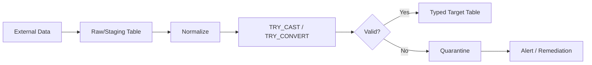
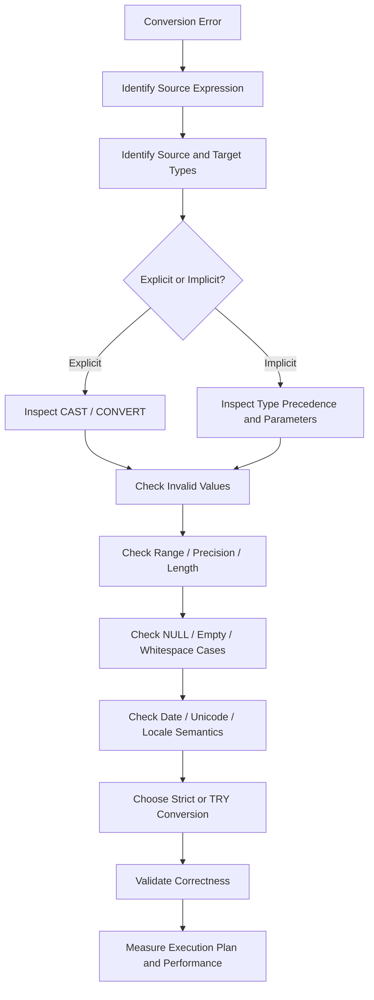

# 11- Conversion Errors and Edge Cases

## Overview

SQL type conversion is straightforward when source values are clean and the source and target types are naturally compatible. Production systems are rarely that simple. Data may contain invalid strings, unexpected whitespace, overflow values, incompatible date formats, precision loss, `NULL`, empty strings, or values that are technically convertible but semantically incorrect.

Conversion errors become especially important in:

- ETL and data ingestion pipelines.
- Legacy schema migrations.
- API-to-database boundaries.
- Reporting queries.
- `JOIN`, `CASE`, and `UNION` expressions.
- Large queries where implicit conversion affects performance.
- Financial and time-sensitive systems where precision matters.

This document focuses on SQL Server conversion behavior, particularly `CAST`, `CONVERT`, `TRY_CAST`, and `TRY_CONVERT`.

## How Conversion Errors Occur

A conversion error occurs when SQL Server cannot represent a source value using the requested target type.

For example:

```sql
SELECT CAST('abc' AS INT);
```

The source is character data, but `'abc'` does not represent a valid integer.

Other common failure categories include:

| Error category | Example | Typical cause |
| --- | --- | --- |
| Invalid numeric | `'ABC' → INT` | Non-numeric characters |
| Overflow | `2147483648 → INT` | Value exceeds target range |
| Invalid date | `'2026-99-99' → DATE` | Invalid calendar value |
| Ambiguous date | `'03/04/2026' → DATE` | Locale/format interpretation |
| Precision loss | `123.456 → DECIMAL(10,2)` | Target scale is smaller |
| String truncation | Long text → `VARCHAR(10)` | Target length too small |
| Unicode loss | `NVARCHAR → VARCHAR` | Target encoding cannot represent data |
| Incompatible types | Unsupported source/target pair | No valid conversion |

A conversion that succeeds is not necessarily a conversion that is correct.

## CAST vs TRY_CAST

`CAST` raises an error when conversion fails:

```sql
SELECT CAST('123' AS INT);
```

```text
123
```

But:

```sql
SELECT CAST('ABC' AS INT);
```

raises a conversion error.

`TRY_CAST` returns `NULL` when the conversion fails:

```sql
SELECT TRY_CAST('ABC' AS INT);
```

```text
NULL
```

This makes `TRY_CAST` useful when invalid input is expected and must be processed without aborting the entire operation.

| Function | Valid input | Invalid input |
| --- | --- | --- |
| `CAST` | Converted value | Error |
| `TRY_CAST` | Converted value | `NULL` |
| `CONVERT` | Converted value | Error |
| `TRY_CONVERT` | Converted value | `NULL` |

The choice should reflect the data contract rather than simply choosing the function that avoids errors.

## When to Fail vs When to Return NULL

Use strict conversion when invalid data indicates a programming or data-integrity defect.

```sql
SELECT CAST(customer_id AS INT)
FROM customers;
```

If `customer_id` is supposed to contain only valid integer identifiers, a conversion failure should be visible.

Use `TRY_CAST` when invalid input is an expected possibility:

```sql
SELECT
    raw_customer_id,
    TRY_CAST(raw_customer_id AS INT) AS customer_id
FROM staging_customers;
```

This is common in ingestion pipelines where source data cannot be trusted.

The distinction is:

```text
Expected invalid input
        ↓
TRY_CAST / TRY_CONVERT
        ↓
Validate and handle NULL

Unexpected invalid data
        ↓
CAST / CONVERT
        ↓
Fail fast and investigate
```

Do not use `TRY_CAST` merely to suppress errors.

## Detecting Invalid Values

A useful pattern is to separate the converted value from the validation condition.

```sql
SELECT
    raw_customer_id,
    TRY_CAST(raw_customer_id AS INT) AS customer_id
FROM staging_customers
WHERE raw_customer_id IS NOT NULL
  AND TRY_CAST(raw_customer_id AS INT) IS NULL;
```

This identifies values that cannot be converted.

For an ingestion pipeline:

```sql
SELECT
    raw_customer_id,
    TRY_CAST(raw_customer_id AS INT) AS customer_id,
    CASE
        WHEN raw_customer_id IS NULL THEN 'missing'
        WHEN TRY_CAST(raw_customer_id AS INT) IS NULL THEN 'invalid'
        ELSE 'valid'
    END AS validation_status
FROM staging_customers;
```

This makes data-quality problems observable rather than silently converting them to `NULL`.

## NULL vs Empty String

`NULL` and an empty string are different concepts.

```sql
SELECT
    CAST(NULL AS INT) AS null_value,
    TRY_CAST('' AS INT) AS empty_string_conversion;
```

Do not assume that all database engines treat empty strings identically. SQL Server's conversion behavior should be tested explicitly for the target data type and SQL Server version.

For external input, normalize data before conversion when the business contract defines empty strings as missing values:

```sql
SELECT
    TRY_CAST(NULLIF(TRIM(raw_customer_id), '') AS INT) AS customer_id
FROM staging_customers;
```

This separates two operations:

```text
Whitespace normalization
        ↓
Empty string → NULL
        ↓
String → INT
```

The business rule should determine whether empty input means `NULL`, invalid data, or a legitimate value.

## Whitespace Edge Cases

Imported data frequently contains leading or trailing whitespace.

```sql
SELECT TRY_CAST('   123   ' AS INT);
```

Although numeric conversion may tolerate some whitespace, application code should not depend on permissive parsing behavior when input normalization is under its control.

For predictable ingestion:

```sql
SELECT
    TRY_CAST(TRIM(raw_value) AS INT) AS normalized_value
FROM staging_data;
```

Normalize first when whitespace is not semantically meaningful.

## Numeric Overflow

A value can be syntactically valid but outside the target type's range.

```sql
SELECT TRY_CAST('2147483648' AS INT);
```

The value exceeds the maximum range of a SQL Server `INT`, so `TRY_CAST` returns `NULL`.

A wider type may be appropriate:

```sql
SELECT TRY_CAST('2147483648' AS BIGINT);
```

The important distinction is:

```text
Valid integer representation
        ≠
Value representable by target type
```

Always consider the target type's range during migrations and ingestion.

## Integer Truncation and Fractional Values

Converting decimal values to integers can change the value.

```sql
SELECT CAST(123.99 AS INT);
```

Do not treat this as a formatting operation. It changes the numeric representation.

For financial calculations, explicitly define whether the requirement is:

- Truncation.
- Rounding.
- Flooring.
- Ceiling.
- Preservation of decimal precision.

For example:

```sql
SELECT
    CAST(ROUND(total_amount, 2) AS DECIMAL(19, 2)) AS rounded_amount
FROM invoices;
```

The rounding policy should be a business rule, not an accidental side effect of casting.

## Decimal Precision and Scale

Consider:

```sql
SELECT CAST(12345.6789 AS DECIMAL(10, 2));
```

The target type has two fractional digits.

Precision and scale should be deliberately selected:

```text
DECIMAL(19, 4)
      │   │
      │   └── fractional digits
      └────── total digits
```

For monetary data:

```sql
DECLARE @amount DECIMAL(19, 4) = 12345.6789;

SELECT CAST(@amount AS DECIMAL(19, 2)) AS amount;
```

The resulting precision is different from the source representation.

Production systems should define monetary precision consistently across:

- Database columns.
- Stored procedures.
- SQL calculations.
- ORM models.
- API schemas.
- Reporting queries.

## Floating-Point Edge Cases

`FLOAT` and `REAL` are approximate numeric types.

Converting approximate values to exact decimal types can expose representation and rounding differences.

```sql
SELECT CAST(
    CAST(0.1 AS FLOAT)
    AS DECIMAL(19, 18)
);
```

Do not use floating-point values for monetary storage simply because they can be converted to `DECIMAL` later.

Prefer:

```sql
DECIMAL(19, 4)
```

or another explicitly chosen precision appropriate for the domain.

## String Length and Truncation

String conversion has its own edge cases.

```sql
SELECT CAST('production-order-12345' AS VARCHAR(10));
```

A target type with insufficient length cannot represent the complete source value.

Always specify a deliberate length:

```sql
CAST(order_id AS VARCHAR(30))
```

rather than relying on implicit length inference.

This is particularly important when creating:

- Views.
- Temporary tables.
- Stored procedure outputs.
- Computed expressions.
- Export datasets.

## Unicode Conversion

Converting `NVARCHAR` to `VARCHAR` can cause data loss when characters cannot be represented by the target code page.

For example:

```sql
SELECT CAST(N'東京' AS VARCHAR(20));
```

The result depends on the target collation/code page and may not preserve the original characters.

For international applications, prefer Unicode types when the data contract requires them:

```sql
NVARCHAR
```

rather than converting to a non-Unicode representation simply to reduce storage.

## Date Conversion Errors

Date strings are particularly dangerous because some strings can be syntactically valid but interpreted differently depending on session settings or formats.

Avoid ambiguous values such as:

```sql
SELECT CAST('03/04/2026' AS DATE);
```

Use an unambiguous representation or typed parameters.

For controlled string ingestion:

```sql
SELECT TRY_CONVERT(
    DATE,
    raw_date,
    23
) AS order_date
FROM staging_orders;
```

Style `23` represents the `yyyy-mm-dd` format in SQL Server.

## Invalid Dates

Some date values are structurally plausible but invalid:

```sql
SELECT TRY_CONVERT(DATE, '2026-02-30', 23);
```

The result is `NULL`.

This makes `TRY_CONVERT` useful for validating external date fields:

```sql
SELECT
    raw_order_date,
    TRY_CONVERT(DATE, raw_order_date, 23) AS order_date
FROM staging_orders;
```

Do not automatically treat `NULL` as equivalent to a missing date. It can mean:

```text
NULL result
   ├── Source was NULL
   └── Source was non-NULL but invalid
```

If the distinction matters, explicitly track it.

## Time Zone Edge Cases

Casting a timestamp does not necessarily perform a time-zone conversion.

For example, removing an offset or converting a timezone-aware value into a timezone-less type can discard information.

The distinction is:

```text
Type conversion
    ↓
Changes representation/type

Time-zone conversion
    ↓
Changes the represented instant into another zone
```

These are different operations.

Backend systems should establish a consistent policy, such as storing UTC timestamps and converting them at presentation boundaries.

## Datetime Precision Loss

Converting from a higher-precision temporal type to a lower-precision type can remove fractional seconds.

```sql
SELECT CAST(
    SYSUTCDATETIME() AS DATETIME2(3)
);
```

The target has millisecond precision.

This matters for:

- Event ordering.
- Audit records.
- Idempotency keys.
- Distributed tracing.
- Change-data processing.

Do not reduce temporal precision without confirming that the application does not depend on it.

## Conversion Inside CASE

`CASE` expressions can trigger type resolution across branches.

Avoid mixing unrelated types:

```sql
SELECT
    CASE
        WHEN status = 'paid' THEN 1
        ELSE 'unknown'
    END AS result
FROM orders;
```

The database must resolve a common result type.

Prefer a consistent type:

```sql
SELECT
    CASE
        WHEN status = 'paid' THEN '1'
        ELSE 'unknown'
    END AS result
FROM orders;
```

Or, if the result is semantically numeric:

```sql
SELECT
    CASE
        WHEN status = 'paid' THEN 1
        ELSE 0
    END AS result
FROM orders;
```

This avoids accidental conversions and makes the output contract obvious.

## Conversion Inside UNION

`UNION` and `UNION ALL` require compatible column types.

A mismatch can cause implicit conversion:

```sql
SELECT customer_id
FROM customers

UNION ALL

SELECT customer_code
FROM legacy_customers;
```

If one expression is numeric and the other character data, SQL Server must reconcile the types.

Prefer explicit alignment:

```sql
SELECT CAST(customer_id AS VARCHAR(50)) AS customer_identifier
FROM customers

UNION ALL

SELECT customer_code
FROM legacy_customers;
```

The correct target type should be chosen according to the semantic meaning of the combined result.

## Conversion Inside JOINs

Joins are one of the most important places to investigate conversion problems.

Suppose:

```text
orders.customer_id       INT
legacy_customers.id      VARCHAR(50)
```

Then:

```sql
SELECT
    o.order_id,
    c.customer_name
FROM orders AS o
JOIN legacy_customers AS c
    ON o.customer_id = c.id;
```

can require runtime conversion.

On a large dataset, this can increase:

- CPU usage.
- Logical reads.
- Query latency.
- Memory requirements.
- Risk of poor execution plans.

The long-term fix is normally to align the underlying schema types.

## Conversion Errors in Joins

An even more dangerous case occurs when a character column contains invalid values:

```text
legacy_customers.id
-------------------
100
101
ABC
102
```

A join that causes SQL Server to convert these values to `INT` may fail because of `ABC`.

Do not assume that filtering invalid values elsewhere guarantees safety.

For controlled processing:

```sql
SELECT
    o.order_id,
    c.customer_name
FROM orders AS o
JOIN legacy_customers AS c
    ON o.customer_id = TRY_CAST(c.id AS INT);
```

However, this can have performance implications because the conversion is applied to the legacy column.

For recurring production workloads, clean the legacy data and align the schema rather than permanently depending on runtime conversion.

## Conversion Order and Optimizer Behavior

A common misconception is that writing a filter such as:

```sql
WHERE id NOT LIKE '%[^0-9]%'
  AND CAST(id AS INT) = 100
```

guarantees SQL Server will evaluate the validation predicate before the cast.

SQL is declarative. The optimizer can transform and reorder operations as long as the resulting semantics are preserved.

Therefore, do not rely on textual predicate order to protect an unsafe conversion.

For untrusted data, use a conversion that safely represents failure:

```sql
WHERE TRY_CAST(id AS INT) = 100
```

This makes the conversion itself safe.

## Implicit Conversion Warnings

Execution plans can expose implicit conversions.

A query such as:

```sql
SELECT *
FROM orders
WHERE customer_id = @customer_id;
```

may perform an implicit conversion if the parameter type does not match the column type.

The actual execution plan can reveal conversion operators or warnings.

When troubleshooting, inspect:

- Data types of columns.
- Stored procedure parameter types.
- Driver parameter types.
- ORM-generated parameters.
- Join predicates.
- Filter predicates.

Do not fix an implicit conversion by blindly adding `CAST` to the column.

## Parameter Type Mismatch

A backend application may accidentally pass a value using the wrong database type.

For example:

```text
Database:
customer_id INT

Application:
customer_id sent as VARCHAR
```

The database may perform conversion.

Prefer:

```text
HTTP request
    ↓
Validation
    ↓
Python int
    ↓
Driver integer parameter
    ↓
SQL Server INT
```

For FastAPI or Django, validate identifiers at the API boundary instead of allowing arbitrary strings to flow into SQL.

## Conversion and SARGability

Consider:

```sql
WHERE CAST(customer_id AS VARCHAR(20)) = @customer_id
```

The conversion is applied to the column.

Prefer:

```sql
WHERE customer_id = @customer_id
```

where `@customer_id` has the correct type.

Similarly, prefer temporal range predicates:

```sql
WHERE created_at >= @start_time
  AND created_at < @end_time
```

over:

```sql
WHERE CAST(created_at AS DATE) = @business_date
```

The range form generally preserves better opportunities for index seeks.

Always verify with the actual execution plan rather than relying solely on query text.

## Conversion During Data Migration

Schema migrations are a common source of conversion failures.

Suppose:

```text
Legacy:
customer_id VARCHAR(50)

Target:
customer_id INT
```

Start by profiling:

```sql
SELECT
    COUNT(*) AS total_rows,
    SUM(
        CASE
            WHEN customer_id IS NOT NULL
             AND TRY_CAST(customer_id AS INT) IS NULL
            THEN 1
            ELSE 0
        END
    ) AS invalid_rows
FROM legacy_customers;
```

Then inspect the invalid records:

```sql
SELECT customer_id
FROM legacy_customers
WHERE customer_id IS NOT NULL
  AND TRY_CAST(customer_id AS INT) IS NULL;
```

Only after the data-quality issues are understood should the schema conversion proceed.

## Conversion in ETL Pipelines

A robust ingestion pipeline separates raw data from normalized data.



This approach has several advantages:

- Original source data remains available.
- Invalid records can be investigated.
- Conversion failures do not necessarily abort the entire batch.
- Data-quality metrics can be measured.
- Remediation can occur independently of successful records.

For high-volume systems, conversion logic should be designed with batch size and CPU cost in mind.

## Distinguishing Missing, Invalid, and Valid Values

A robust ingestion model should distinguish at least three states:

| Raw value | Converted value | Meaning |
| --- | --- | --- |
| `NULL` | `NULL` | Missing |
| `''` | `NULL` | Potentially missing after normalization |
| `'123'` | `123` | Valid |
| `' 123 '` | `123` | Valid after normalization |
| `'ABC'` | `NULL` | Invalid |
| `'999999999999999999999'` | `NULL` | Overflow |

If all these cases collapse into `NULL`, downstream systems lose useful data-quality information.

A better staging model may include:

```text
raw_value
normalized_value
typed_value
validation_status
validation_error
```

## Production Error Handling

For production pipelines, conversion errors should be observable.

Useful metrics include:

- Number of rows processed.
- Number of conversion failures.
- Failure rate by source.
- Failure rate by field.
- Top invalid values or error categories.
- Batch failure count.
- Quarantined record count.

For example:

```text
orders_imported_total
orders_conversion_failures_total
orders_quarantined_total
```

The exact monitoring implementation depends on the platform, but the principle is consistent:

> A data conversion failure should be observable as a data-quality event, not silently disappear.

## Security Considerations

Type conversion is not a substitute for input validation or SQL injection protection.

Use parameterized queries:

```python
cursor.execute(
    """
    SELECT order_id, total_amount
    FROM orders
    WHERE customer_id = ?
    """,
    (customer_id,),
)
```

Do not construct SQL by concatenating user input:

```python
# Do not do this.
query = f"SELECT * FROM orders WHERE customer_id = {customer_id}"
```

Even if the value is expected to be numeric, the application should enforce the type contract and use parameter binding.

Conversion logic also should not expose sensitive raw input through unrestricted logs. Quarantine records and error logs should follow the same security and retention policies as other production data.

## Performance Considerations

Conversion cost becomes significant when it is repeated across large datasets.

Higher-risk locations include:

- Join predicates.
- Indexed filter columns.
- `GROUP BY` expressions.
- `ORDER BY` expressions.
- Large scans.
- Repeated expressions.
- ETL transformations over millions of rows.

When investigating performance, compare:

```text
CPU time
Logical reads
Elapsed time
Rows processed
Execution plan
```

A conversion that affects only a few rows is usually less concerning than one executed across millions of rows.

## Common Mistakes and Pitfalls

### Assuming Successful Conversion Means Correct Data

```sql
CAST('00123' AS INT)
```

succeeds, but the leading zeros disappear.

If `00123` is a business identifier rather than a numeric quantity, converting it to `INT` is semantically incorrect.

### Treating IDs as Numbers When They Are Identifiers

An identifier such as:

```text
000123
```

may need to remain a string.

Ask whether the value supports arithmetic. If not, it may be better modeled as character data.

### Using TRY_CAST Everywhere

`TRY_CAST` prevents conversion errors but can hide data-quality defects.

Bad:

```sql
SELECT TRY_CAST(raw_value AS INT)
FROM production_data;
```

with no monitoring of failed conversions.

Better:

```text
TRY_CAST
   ↓
Detect NULL conversion failures
   ↓
Measure / quarantine / remediate
```

### Relying on Predicate Order

Do not assume:

```sql
WHERE ISNUMERIC(value) = 1
  AND CAST(value AS INT) = 100
```

guarantees safe evaluation order.

Prefer a conversion that itself cannot abort the query:

```sql
WHERE TRY_CAST(value AS INT) = 100
```

### Converting Indexed Columns

Avoid:

```sql
WHERE CAST(customer_id AS VARCHAR(20)) = @customer_id
```

when the application can supply the parameter as an integer.

### Ignoring Overflow

A string can contain a perfectly valid number that still cannot fit into the selected target type.

Always evaluate the target range.

### Ignoring Precision and Scale

```sql
DECIMAL(19, 4) → DECIMAL(10, 2)
```

is not merely a type-label change. It changes the representable value space.

### Using Ambiguous Date Strings

Avoid application contracts based on ambiguous strings such as:

```text
03/04/2026
```

Prefer typed parameters or unambiguous formats.

### Silently Discarding Invalid Records

A pipeline that converts invalid values to `NULL` without tracking them creates silent data loss.

Invalid records should be observable.

## Troubleshooting Workflow

When a conversion error appears in production, use a structured approach.



A practical investigation should answer:

1. What expression failed?
2. What are the source and target types?
3. Which values fail?
4. Are failures invalid, missing, or out of range?
5. Is the conversion explicit or implicit?
6. Is the conversion performed per row?
7. Does it affect an index or join?
8. Is the target type semantically correct?
9. Should invalid values fail the operation or enter quarantine?
10. How will the failure be monitored after deployment?

## Interview Traps

| Interview question | Strong answer |
| --- | --- |
| What happens when `CAST` cannot convert a value? | SQL Server raises a conversion error and the statement may fail |
| What does `TRY_CAST` return on failure? | `NULL` |
| Is `TRY_CAST` always better than `CAST`? | No. It is useful for expected invalid input, but indiscriminate use can hide data-quality defects |
| Can a conversion succeed and still be wrong? | Yes. Semantic loss such as removing leading zeros or timezone information can produce incorrect business data |
| What is numeric overflow? | The source value is outside the representable range of the target numeric type |
| Why are date strings risky? | They can be invalid, ambiguous, or interpreted according to formatting/session rules |
| Why can conversions in joins be expensive? | They can force runtime conversion across many rows and interfere with efficient index access |
| Can predicate order guarantee that a safe validation happens before `CAST`? | No. SQL is declarative and the optimizer can choose the evaluation strategy |
| How should invalid ETL records be handled? | Preserve the raw value, record the conversion failure, quarantine or remediate the record, and expose metrics |
| How do you diagnose an implicit conversion performance problem? | Inspect the actual execution plan, parameter and column types, conversion direction, CPU, logical reads, and index access |
| Should a business identifier always be converted to an integer? | No. If it is an identifier rather than a quantity, character storage may be semantically correct |
| What is the difference between conversion and normalization? | Conversion changes data type; normalization may additionally trim, canonicalize, validate, or map values according to business rules |

## Key Takeaways

- **Conversion success does not guarantee semantic correctness**; check range, precision, length, Unicode, identifiers, and temporal meaning.
- **Use `CAST`/`CONVERT` when invalid data should fail and `TRY_CAST`/`TRY_CONVERT` when invalid input is expected**, but always make failures observable.
- **Do not rely on predicate evaluation order to protect unsafe conversions**; use conversion functions that explicitly handle invalid values.
- **Treat joins, indexed predicates, and large scans as high-risk locations for runtime conversion**, and prefer compatible schema and parameter types.
- **Production ingestion should distinguish missing, valid, and invalid values**, preserving raw data and routing conversion failures into measurable remediation workflows.