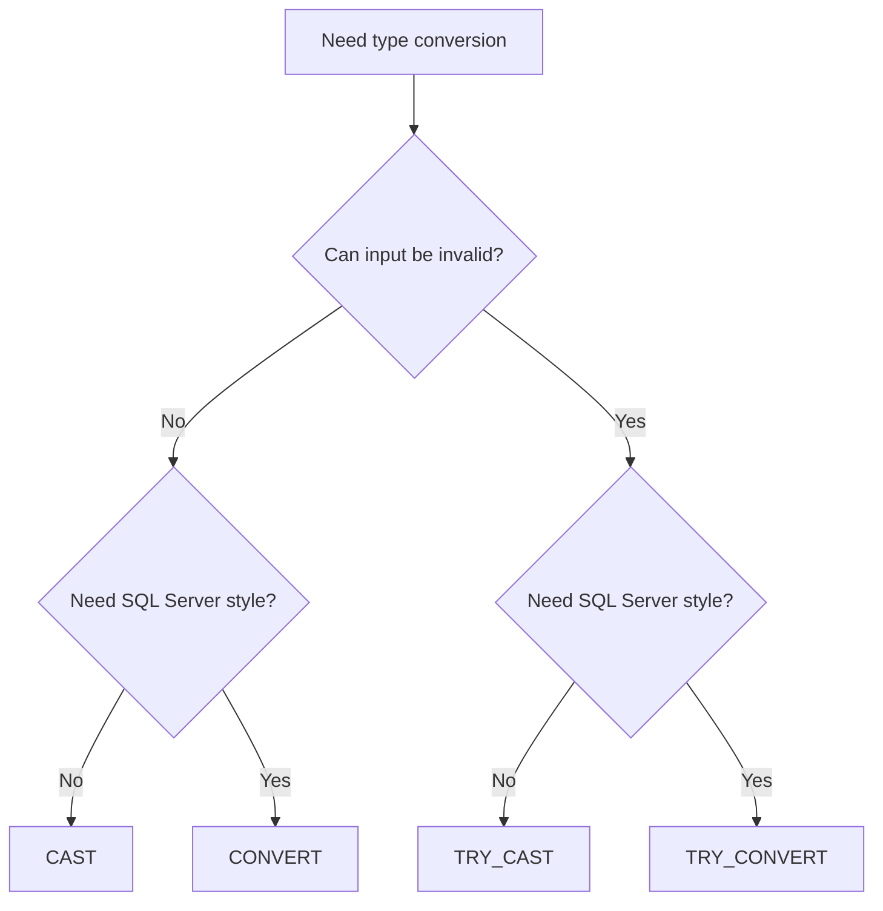
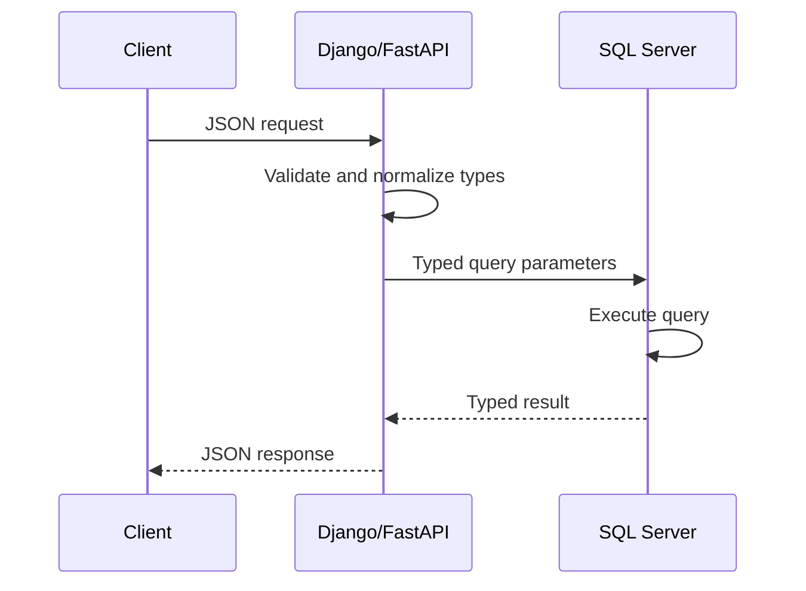

# 12- When to Use Each Conversion Method

## Overview

SQL Server provides several mechanisms for converting values between data types. The main choices are `CAST`, `CONVERT`, `TRY_CAST`, and `TRY_CONVERT`. They overlap substantially, but their intent differs.

The correct choice depends on four questions:

1. Is the conversion expected to succeed for every row?
2. Should invalid input fail the query or become `NULL`?
3. Does the conversion require SQL Server-specific formatting or style control?
4. Is the expression part of a performance-sensitive predicate, join, or transformation?

A useful production rule is:

> Use the simplest explicit conversion that expresses the data contract. Use `TRY_*` when conversion failure is expected and must be handled as data. Use `CONVERT` when SQL Server-specific style control is actually required.

## Conversion Methods at a Glance

| Method | Failure behavior | Formatting/style support | Portability | Primary use |
| --- | --- | --- | --- | --- |
| `CAST` | Raises an error | No style parameter | High | Standard type conversion |
| `CONVERT` | Raises an error | Yes | SQL Server-specific | Conversion with SQL Server formatting requirements |
| `TRY_CAST` | Returns `NULL` | No style parameter | SQL Server-specific | Safe conversion of potentially invalid data |
| `TRY_CONVERT` | Returns `NULL` | Yes | SQL Server-specific | Safe conversion with style control |

The choice should be intentional rather than based on which syntax happens to be familiar.

## CAST

### What It Is

`CAST` is the standard SQL syntax for converting an expression to another data type.

```sql
SELECT CAST('12345' AS INT) AS customer_id;
```

It is usually the best default when no SQL Server-specific formatting behavior is required.

### Why Use It

Use `CAST` when:

- The source data is expected to be valid.
- The target type is known.
- You do not need a style parameter.
- Portability across SQL databases matters.
- The conversion should be explicit and easy to read.

Examples:

```sql
SELECT
    CAST(order_id AS BIGINT) AS order_id,
    CAST(total_amount AS DECIMAL(19, 4)) AS total_amount,
    CAST(created_at AS DATE) AS order_date
FROM orders;
```

### Advantages

- Standard SQL syntax.
- Clear intent.
- Concise.
- Easy to understand during code review.
- Appropriate for schema-aligned conversions.

### Limitations

- Invalid values raise conversion errors.
- No SQL Server `style` argument.
- Not appropriate by itself for unreliable external data.

### Production Guidance

Prefer `CAST` for trusted, typed data:

```sql
SELECT CAST(customer_id AS BIGINT)
FROM orders;
```

If `customer_id` is contractually an integer, a conversion failure should generally expose a data-quality problem rather than silently returning `NULL`.

## CONVERT

### What It Is

`CONVERT` performs type conversion while also supporting SQL Server-specific style codes.

```sql
SELECT CONVERT(INT, '12345');
```

The syntax places the target type before the expression:

```sql
CONVERT(data_type, expression)
```

### When to Use It

Use `CONVERT` when the SQL Server-specific `style` parameter provides meaningful value.

For example:

```sql
SELECT CONVERT(DATE, '2026-08-30', 23) AS order_date;
```

Style `23` represents the `yyyy-mm-dd` date format.

For datetime formatting:

```sql
SELECT CONVERT(VARCHAR(19), SYSUTCDATETIME(), 120);
```

Style `120` represents a SQL Server date/time representation based on `yyyy-mm-dd hh:mi:ss`.

### Advantages

- Supports SQL Server style codes.
- Useful for controlled date/time and string conversions.
- Familiar in SQL Server-specific codebases.

### Limitations

- SQL Server-specific syntax.
- Style codes can reduce readability if developers do not know what they represent.
- Like `CAST`, invalid conversion can raise an error.

### Production Guidance

Do not choose `CONVERT` simply because it is shorter or because it is common in existing SQL Server code.

Choose it when style control is part of the requirement.

## TRY_CAST

### What It Is

`TRY_CAST` behaves like `CAST` for valid input but returns `NULL` instead of raising a conversion error when conversion fails.

```sql
SELECT TRY_CAST('12345' AS INT);
```

```text
12345
```

Invalid input:

```sql
SELECT TRY_CAST('not-a-number' AS INT);
```

```text
NULL
```

### When to Use It

`TRY_CAST` is appropriate when invalid input is an expected possibility.

Typical examples include:

- CSV imports.
- Legacy tables.
- Staging tables.
- User-provided data.
- Data migrations.
- Event payloads.
- Slowly cleaned historical datasets.

Example:

```sql
SELECT
    raw_customer_id,
    TRY_CAST(raw_customer_id AS BIGINT) AS customer_id
FROM staging_customers;
```

### Advantages

- Prevents a single invalid value from aborting the query.
- Makes row-level validation possible.
- Useful for heterogeneous or legacy data.
- Keeps parsing logic inside SQL.

### Limitations

- Failed conversions become `NULL`, which can hide data-quality problems.
- Does not provide SQL Server style formatting.
- `NULL` may be ambiguous when the source itself can be `NULL`.

### Production Guidance

Do not use `TRY_CAST` as an error suppression mechanism.

Instead, explicitly measure failed conversions:

```sql
SELECT
    COUNT(*) AS total_rows,
    SUM(
        CASE
            WHEN raw_customer_id IS NOT NULL
             AND TRY_CAST(raw_customer_id AS BIGINT) IS NULL
            THEN 1
            ELSE 0
        END
    ) AS invalid_rows
FROM staging_customers;
```

This turns conversion failure into an observable data-quality signal.

## TRY_CONVERT

### What It Is

`TRY_CONVERT` combines the safe failure behavior of `TRY_CAST` with the style argument available to `CONVERT`.

```sql
SELECT TRY_CONVERT(DATE, '2026-08-30', 23);
```

Invalid input returns `NULL`:

```sql
SELECT TRY_CONVERT(DATE, '2026-99-99', 23);
```

### When to Use It

Use `TRY_CONVERT` when:

- Input may be invalid.
- You need SQL Server-specific style handling.
- You are processing dates, times, or formatted strings.
- The conversion is part of a data-validation pipeline.

Example:

```sql
SELECT
    raw_order_date,
    TRY_CONVERT(DATE, raw_order_date, 23) AS order_date
FROM staging_orders;
```

### Advantages

- Safe conversion.
- Supports style codes.
- Particularly useful for external date/time representations.
- Appropriate for ingestion and validation pipelines.

### Limitations

- SQL Server-specific.
- Invalid values become `NULL`.
- Style codes still require correct interpretation.
- Does not eliminate the performance cost of applying conversion to large datasets.

## Decision Matrix

Use the following as the practical selection rule:

| Requirement | Recommended method |
| --- | --- |
| Standard, trusted conversion | `CAST` |
| SQL Server style formatting required | `CONVERT` |
| Potentially invalid data, no style required | `TRY_CAST` |
| Potentially invalid data with style required | `TRY_CONVERT` |
| Portable SQL is important | Prefer `CAST` |
| Staging/ETL data may contain invalid values | `TRY_CAST` / `TRY_CONVERT` |
| Invalid data should fail fast | `CAST` / `CONVERT` |
| Date parsing requires explicit SQL Server style | `CONVERT` / `TRY_CONVERT` |

A concise decision tree:



## Strict Conversion vs Safe Conversion

The most important decision is often not `CAST` versus `CONVERT`, but strict versus tolerant conversion.

### Strict Conversion

```sql
SELECT CAST(customer_id AS BIGINT)
FROM customers;
```

Use this when invalid input represents a defect that should be detected immediately.

Advantages:

- Fail-fast behavior.
- Data-quality defects remain visible.
- Prevents invalid values from silently propagating.

Risks:

- One bad row can fail a batch or query.
- Not appropriate for uncontrolled external data.

### Safe Conversion

```sql
SELECT TRY_CAST(customer_id AS BIGINT)
FROM staging_customers;
```

Use this when malformed values are expected and can be handled at row level.

Advantages:

- Query continues processing valid rows.
- Invalid records can be isolated.
- Useful for large ingestion pipelines.

Risks:

- Failed values become `NULL`.
- Poorly designed pipelines can silently lose data.

The senior-level question is not:

> "Which function avoids the error?"

It is:

> "What should the system do when the source value violates the target type contract?"

## Date and Time Conversion

Date conversion is where `CONVERT` and `TRY_CONVERT` often provide a meaningful advantage over `CAST`.

Suppose an ingestion source sends:

```text
2026-08-30
```

You can use:

```sql
SELECT TRY_CONVERT(DATE, raw_date, 23)
FROM staging_orders;
```

For trusted typed values:

```sql
SELECT CAST(created_at AS DATE)
FROM orders;
```

For SQL Server-specific formatting requirements:

```sql
SELECT CONVERT(VARCHAR(19), created_at, 120)
FROM orders;
```

The key distinction is that **parsing** and **presentation formatting** are separate concerns.

Prefer storing and processing temporal values using temporal database types. Convert to strings at external presentation boundaries when required.

## Numeric Conversion

For trusted numeric data:

```sql
SELECT CAST(raw_amount AS DECIMAL(19, 4))
FROM validated_orders;
```

For uncertain input:

```sql
SELECT TRY_CAST(raw_amount AS DECIMAL(19, 4))
FROM staging_orders;
```

For numeric data, explicitly consider:

- Range.
- Precision.
- Scale.
- Rounding.
- Overflow.
- Whether the value is actually numeric or an identifier.

For example, an account number such as `00012345` may be syntactically numeric but semantically should remain a string.

## String Conversion

String conversion is often used for API responses, reports, exports, and logging.

```sql
SELECT CAST(order_id AS VARCHAR(30))
FROM orders;
```

If a specific SQL Server representation is required:

```sql
SELECT CONVERT(VARCHAR(19), created_at, 120)
FROM orders;
```

Be explicit about string length:

```sql
CAST(order_id AS VARCHAR(30))
```

rather than relying on implicit length behavior.

For Unicode data:

```sql
CAST(customer_name AS NVARCHAR(200))
```

Avoid unnecessary `NVARCHAR` to `VARCHAR` conversion because characters may not be representable in the target code page.

## Conversion in Application-Backed Systems

A typical backend request should establish type correctness as early as possible:



For example, an API receiving:

```json
{
  "customer_id": "12345"
}
```

should validate the field according to its API contract rather than depending on SQL Server to convert the string.

The database should still enforce its own schema and integrity rules.

A good architecture is:

```text
HTTP input
   ↓
Application validation
   ↓
Typed parameter
   ↓
Parameterized SQL
   ↓
Database schema
```

Conversion in SQL remains useful for legacy data and query transformations, but it should not compensate for weak application contracts.

## Conversion and Query Performance

Conversion method selection does not make an expensive conversion cheap.

This query:

```sql
SELECT *
FROM orders
WHERE CAST(customer_id AS VARCHAR(30)) = @customer_id;
```

can be problematic because the column is being transformed for comparison.

Prefer matching parameter and column types:

```sql
SELECT *
FROM orders
WHERE customer_id = @customer_id;
```

with `@customer_id` supplied using the appropriate numeric type.

The same principle applies to joins:

```sql
JOIN legacy_customers AS c
    ON o.customer_id = TRY_CAST(c.customer_id AS BIGINT)
```

This may be necessary temporarily, but it can be expensive on large tables.

The long-term production solution is usually:

- Clean the legacy data.
- Align column types.
- Enforce the correct schema.
- Remove recurring runtime conversion.

## SARGability

A conversion applied to an indexed column can interfere with efficient index access.

Avoid patterns such as:

```sql
WHERE CAST(created_at AS DATE) = @business_date
```

Prefer a range:

```sql
WHERE created_at >= @start_of_day
  AND created_at < @next_day
```

The range predicate preserves the original column expression and generally provides better opportunities for index seeks.

Similarly:

```sql
WHERE CAST(customer_id AS VARCHAR(30)) = @customer_id
```

is usually inferior to:

```sql
WHERE customer_id = @customer_id
```

when the parameter can be correctly typed.

Always validate performance using the actual execution plan and runtime metrics.

## Data Migration Strategy

When converting a legacy column, do not immediately change its type.

Suppose:

```text
VARCHAR(50) → BIGINT
```

First profile the data:

```sql
SELECT
    COUNT(*) AS total_rows,
    SUM(
        CASE
            WHEN legacy_id IS NOT NULL
             AND TRY_CAST(legacy_id AS BIGINT) IS NULL
            THEN 1
            ELSE 0
        END
    ) AS invalid_rows
FROM legacy_customers;
```

Then inspect failures:

```sql
SELECT legacy_id
FROM legacy_customers
WHERE legacy_id IS NOT NULL
  AND TRY_CAST(legacy_id AS BIGINT) IS NULL;
```

A controlled migration can then follow:

```text
Profile
  ↓
Identify invalid data
  ↓
Define remediation rules
  ↓
Clean / quarantine
  ↓
Backfill typed column
  ↓
Validate
  ↓
Switch application reads/writes
  ↓
Remove legacy representation
```

`TRY_CAST` is particularly useful during the profiling and validation phases.

## ETL and Staging Tables

Staging tables commonly contain weakly typed source data:

```text
CSV
 ↓
Staging table
 ↓
Validation
 ↓
Typed transformation
 ↓
Production table
```

Example:

```sql
INSERT INTO orders (
    order_id,
    customer_id,
    order_date,
    total_amount
)
SELECT
    TRY_CAST(raw_order_id AS BIGINT),
    TRY_CAST(raw_customer_id AS BIGINT),
    TRY_CONVERT(DATE, raw_order_date, 23),
    TRY_CAST(raw_total_amount AS DECIMAL(19, 4))
FROM staging_orders
WHERE TRY_CAST(raw_order_id AS BIGINT) IS NOT NULL;
```

For production pipelines, avoid stopping at this point. Invalid rows should be identified and routed to a quarantine or remediation process.

## Choosing Based on Data Trust

Data trust is a useful way to decide.

| Data source | Typical trust | Recommended approach |
| --- | --- | --- |
| Strongly typed database column | High | `CAST` when needed |
| Application-generated typed parameter | High | Usually no conversion needed |
| Controlled internal table | High | `CAST` / `CONVERT` |
| Legacy database | Medium | Profile first; `TRY_*` during migration |
| CSV import | Low | `TRY_*` + validation |
| External API payload | Low | Validate at application boundary; `TRY_*` where SQL parsing remains necessary |
| User-entered free text | Low | Validate before persistence; `TRY_*` for defensive SQL transformations |

The goal is not to make every query tolerant. The goal is to place validation and failure handling at the correct system boundary.

## Portability Considerations

If the SQL code may need to move between database engines, `CAST` is generally preferable.

For example:

```sql
CAST(order_id AS BIGINT)
```

is more portable than:

```sql
CONVERT(VARCHAR(30), created_at, 120)
```

which relies on SQL Server-specific behavior.

`TRY_CAST` and `TRY_CONVERT` are also SQL Server-specific constructs. Other database engines provide different mechanisms for safe conversion.

For a SQL Server-only backend, this is usually not a problem. For shared SQL libraries or database portability requirements, it should be considered during design.

## Production Best Practices

### Prefer Schema Correctness Over Repeated Conversion

If the same conversion appears throughout the codebase:

```sql
TRY_CAST(legacy_customer_id AS BIGINT)
```

the underlying schema may be the real problem.

Repeated runtime conversion is often technical debt.

### Validate at the Appropriate Boundary

Use application validation for API contracts.

Use database constraints for database integrity.

Use `TRY_*` functions for untrusted data that must be transformed safely inside SQL.

Do not force one layer to perform every validation responsibility.

### Keep Conversion Explicit

Avoid relying on implicit conversion when the data contract matters.

Explicit:

```sql
WHERE customer_id = CAST(@customer_id AS BIGINT)
```

is easier to reason about than allowing SQL Server to infer conversion behavior.

However, explicit conversion is not automatically better if it is applied to the indexed column. Prefer correctly typed parameters.

### Monitor Failed Conversions

For ingestion workloads, track:

- Total records processed.
- Successful conversions.
- Failed conversions.
- Quarantined records.
- Conversion failure rate.
- Failure rate by source field.

A sudden increase in conversion failures can indicate an upstream schema or API contract change.

### Test Boundary Values

Conversion tests should include:

- `NULL`.
- Empty strings.
- Whitespace.
- Negative values.
- Zero.
- Maximum valid values.
- Minimum valid values.
- Overflow values.
- Invalid characters.
- Invalid dates.
- High-precision decimals.
- Unicode text.
- Unexpected formats.

## Common Mistakes

| Mistake | Why it happens | Better approach |
| --- | --- | --- |
| Using `TRY_CAST` everywhere | Avoiding query failures | Decide whether invalid data should actually fail |
| Using `CONVERT` without needing style | Habit from SQL Server code | Prefer `CAST` for ordinary conversions |
| Using `CAST` on unreliable staging data | Assuming source data is clean | Use `TRY_CAST` and track failures |
| Converting indexed columns | Fixing a type mismatch inside SQL | Correct parameter/schema types |
| Treating `NULL` from `TRY_*` as harmless | Error is hidden | Distinguish missing from invalid |
| Using string dates without a defined format | Convenience | Use typed parameters or explicit style |
| Treating identifiers as numeric values | They contain only digits | Preserve identifiers as strings when arithmetic is not required |
| Ignoring precision | Conversion appears successful | Define decimal precision and scale explicitly |
| Relying on predicate order | Assuming SQL executes top-to-bottom | Make potentially failing conversions safe |
| Leaving conversion logic permanently in hot paths | Temporary migration solution becomes permanent | Fix the underlying schema |

## Practical Selection Examples

### Trusted Integer Conversion

```sql
SELECT CAST(customer_id AS BIGINT)
FROM orders;
```

**Use:** Trusted data and ordinary type conversion.

### SQL Server-Specific Date Parsing

```sql
SELECT CONVERT(DATE, '2026-08-30', 23);
```

**Use:** Valid input where SQL Server style control is required.

### Untrusted Integer Conversion

```sql
SELECT TRY_CAST(raw_customer_id AS BIGINT)
FROM staging_customers;
```

**Use:** Staging or legacy data where invalid rows are expected.

### Untrusted Date Conversion With Style

```sql
SELECT TRY_CONVERT(DATE, raw_order_date, 23)
FROM staging_orders;
```

**Use:** Untrusted date strings with a known input format.

### Finding Invalid Numeric Data

```sql
SELECT raw_customer_id
FROM staging_customers
WHERE raw_customer_id IS NOT NULL
  AND TRY_CAST(raw_customer_id AS BIGINT) IS NULL;
```

**Use:** Data-quality profiling and migration validation.

## Senior-Level Decision Framework

When choosing a conversion method in production, evaluate the entire data flow rather than the expression in isolation.

```text
                    Conversion required
                           │
                           ▼
                 Is source data trusted?
                    │             │
                   Yes            No
                    │             │
                    ▼             ▼
              Need style?    Need style?
                │    │         │    │
               No   Yes       No   Yes
                │    │         │    │
                ▼    ▼         ▼    ▼
              CAST CONVERT  TRY_CAST TRY_CONVERT
```

Then apply a second review:

| Review area | Question |
| --- | --- |
| Correctness | Is the target type semantically correct? |
| Failure handling | Should invalid input fail or become `NULL`? |
| Precision | Could numeric precision or scale be lost? |
| Range | Can values overflow? |
| Formatting | Is an explicit SQL Server style required? |
| Performance | Is conversion applied to millions of rows? |
| Indexing | Is a column being converted inside a predicate or join? |
| Data quality | Are failed conversions measurable? |
| Architecture | Should validation happen in the application instead? |
| Maintainability | Is the conversion temporary or part of the permanent design? |
| Portability | Does the code need to work outside SQL Server? |

This framework prevents conversion syntax from becoming a substitute for good data modeling.

## Interview Traps

### `CAST` vs `CONVERT`

`CAST` is standard SQL-oriented syntax. `CONVERT` is SQL Server-specific and provides additional style control.

### `CAST` vs `TRY_CAST`

`CAST` raises a conversion error for invalid input. `TRY_CAST` returns `NULL`.

### `CONVERT` vs `TRY_CONVERT`

`CONVERT` raises an error for failed conversion. `TRY_CONVERT` returns `NULL` and also supports the style argument.

### Is `TRY_CAST` Always Safer?

It is safer operationally for expected malformed input, but it can be less safe from a data-quality perspective if failures are silently ignored.

### Which Is Faster?

There is no useful blanket rule that one conversion function is always faster. Query shape, data volume, conversion type, expression placement, indexes, and execution plans matter more.

### Should You Cast a Column or a Parameter?

When possible, use a correctly typed parameter rather than converting the indexed column:

```sql
WHERE customer_id = @customer_id
```

is generally preferable to:

```sql
WHERE CAST(customer_id AS VARCHAR(30)) = @customer_id
```

### Does Explicit Conversion Always Improve Performance?

No. Explicit conversion improves type clarity, but converting an indexed column can still hurt performance. Correct schema and parameter types are usually the better solution.

### What Should `TRY_CAST` NULL Mean?

It should be interpreted carefully. A `NULL` result may represent either a source `NULL` or a failed conversion. If the distinction matters, track it explicitly.

## Key Takeaways

- **Use `CAST` for ordinary trusted conversions, `CONVERT` when SQL Server-specific style control is required, `TRY_CAST` for tolerant conversion, and `TRY_CONVERT` when tolerant conversion also needs style control.**
- **Choose strict versus tolerant conversion based on the data contract and failure semantics, not merely on whether you want the query to stop.**
- **Avoid conversions on indexed columns, join keys, and other large row sets when compatible schema and parameter types can eliminate the runtime conversion.**
- **Treat `TRY_*` failures as data-quality signals and monitor, quarantine, or remediate invalid records instead of silently accepting `NULL`.**
- **For production systems, prioritize correct data modeling and boundary validation over repeatedly converting poorly typed data inside hot SQL paths.**