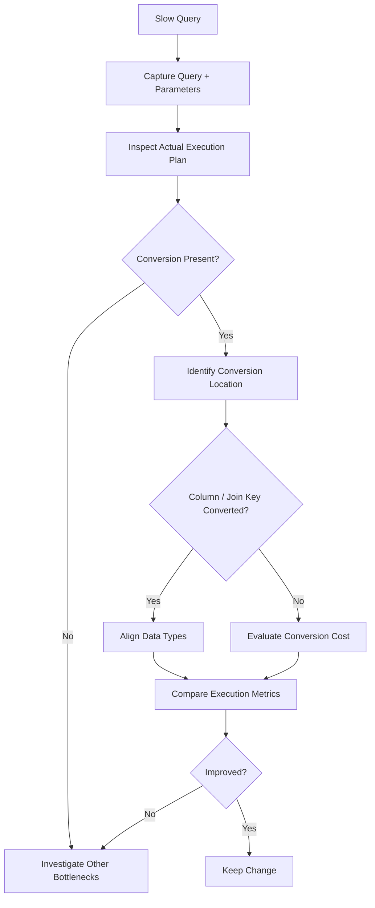

# 13- Conversion and Query Performance

## Overview

Data type conversion is often treated as a correctness concern, but in production SQL workloads it can also become a significant performance concern. Conversions affect predicate evaluation, index usage, join strategies, cardinality estimation, CPU consumption, memory grants, and sometimes even the correctness of comparisons.

The most important principle is:

> Prefer compatible data types at the schema and application boundaries so that the database does not need to repeatedly convert large numbers of rows at query time.

A conversion is not inherently slow. The performance problem usually comes from **where the conversion occurs** and **how many rows must be processed before the conversion can be evaluated**.

This is especially important for backend systems where Django, FastAPI, Celery workers, APIs, and microservices execute database queries repeatedly under production load.

## Where Conversion Happens

A conversion can occur at several points in a query:


Typical locations include:

- Application parameter to database column type.
- Column-to-column conversion during joins.
- Column conversion inside `WHERE`.
- Column conversion inside `ORDER BY`.
- Conversion inside `GROUP BY`.
- Conversion inside computed expressions.
- Conversion of result values returned to the application.

The same conversion operation can have very different performance characteristics depending on its location.

## Implicit Conversion

### What It Is

Implicit conversion occurs when SQL Server automatically converts one data type to another because two expressions are not type-compatible.

For example, if `customer_id` is `INT` but a query compares it with a string parameter, SQL Server may perform a conversion to reconcile the types.

```sql
SELECT *
FROM customers
WHERE customer_id = @customer_id;
```

The performance depends on the actual data type of `@customer_id`.

### Why It Matters

Implicit conversion can be invisible in source code. A query may look simple while the execution plan contains a conversion that prevents efficient index access.

This becomes especially problematic when a large indexed column must be converted row by row.

### Production Rule

Do not rely on SQL Server to resolve application/database type mismatches automatically.

Instead, make the application parameter type match the database column type.

For example:

```text
Database:
customer_id BIGINT

Application:
customer_id -> integer / BIGINT-compatible parameter

Query:
WHERE customer_id = @customer_id
```

This removes unnecessary conversion work and makes the query's type contract explicit.

## Explicit Conversion

Explicit conversion makes the conversion visible:

```sql
SELECT CAST(customer_id AS VARCHAR(30))
FROM customers;
```

Explicit conversion improves readability and correctness, but it does **not** automatically improve performance.

For example:

```sql
WHERE CAST(customer_id AS VARCHAR(30)) = @customer_id
```

may still be inefficient because the database has to evaluate the conversion against the column values.

The correct question is not:

> "Is explicit conversion better than implicit conversion?"

The better question is:

> "Can the query avoid converting the column at all?"

## SARGability

### What It Is

A predicate is generally considered **SARGable** when the database can use it efficiently to search an index rather than having to calculate a function or expression for every candidate row.

Consider:

```sql
SELECT *
FROM orders
WHERE CAST(customer_id AS VARCHAR(30)) = @customer_id;
```

The column is wrapped in a conversion expression.

Compare this with:

```sql
SELECT *
FROM orders
WHERE customer_id = @customer_id;
```

where `@customer_id` has the correct type.

The second form gives the optimizer a much better opportunity to use an index directly on `customer_id`.

### Why It Matters

Suppose an indexed table contains 50 million orders.

A query that can seek directly into the index may examine a very small subset of rows.

A query that must transform the column for comparison may require substantially more row processing.

Conceptually:

```text
Index Seek
    ↓
Small number of candidate rows
    ↓
Predicate evaluation
```

versus:

```text
Scan / broad access
    ↓
Many rows
    ↓
Convert each value
    ↓
Compare converted values
```

The exact execution plan depends on the optimizer, data distribution, indexes, statistics, and data types, so always verify with an actual execution plan.

## Converting the Column vs Converting the Parameter

This is one of the most important practical patterns.

### Avoid

```sql
WHERE CAST(customer_id AS VARCHAR(30)) = @customer_id
```

### Prefer

```sql
WHERE customer_id = @customer_id
```

with `@customer_id` supplied using the database-compatible numeric type.

If the parameter arrives as text from an HTTP request, validate and convert it at the application boundary:

```text
HTTP JSON
   ↓
"customer_id": "12345"
   ↓
Application validation
   ↓
Integer / typed parameter
   ↓
SQL Server
   ↓
WHERE customer_id = @customer_id
```

This is usually preferable to forcing SQL Server to convert the indexed column.

## Conversion and Index Seeks

Consider an index:

```sql
CREATE INDEX IX_orders_customer_id
ON orders(customer_id);
```

A type-compatible predicate can allow efficient index access:

```sql
SELECT order_id, created_at, total_amount
FROM orders
WHERE customer_id = @customer_id;
```

The optimizer may choose an index seek when that access path is appropriate.

A conversion on the indexed expression can make direct index access more difficult:

```sql
SELECT order_id, created_at, total_amount
FROM orders
WHERE CAST(customer_id AS VARCHAR(30)) = @customer_id;
```

Do not assume that every expression around an indexed column automatically causes a scan in every situation. SQL Server's optimizer can sometimes transform expressions or choose other strategies. The production rule is to **inspect the execution plan instead of relying on syntax alone**.

## Date Conversion and Query Performance

Date conversion is a common source of avoidable work.

### Less Desirable Pattern

```sql
SELECT *
FROM orders
WHERE CAST(created_at AS DATE) = @business_date;
```

The query transforms `created_at` before comparing it.

### Prefer a Range Predicate

```sql
SELECT *
FROM orders
WHERE created_at >= @start_of_day
  AND created_at < @next_day;
```

For example:

```text
@start_of_day = 2026-08-30 00:00:00
@next_day     = 2026-08-31 00:00:00
```

This preserves the original column expression.

It also avoids relying on a particular time precision when defining the end of the day.

### Why Half-Open Ranges Matter

Prefer:

```sql
created_at >= @start
AND created_at < @end
```

over:

```sql
created_at BETWEEN @start AND @end
```

when defining time windows.

A half-open interval:

```text
[start, end)
```

avoids ambiguity around the final representable timestamp of a day.

It also composes cleanly across adjacent intervals.

## Conversion in Joins

Conversion becomes particularly expensive when it occurs on large join inputs.

Example:

```sql
SELECT
    o.order_id,
    c.customer_name
FROM orders AS o
JOIN legacy_customers AS c
    ON o.customer_id = TRY_CAST(c.customer_id AS BIGINT);
```

This may be necessary when integrating with a legacy schema, but it should not become the permanent architecture for a high-volume join.

Potential problems include:

- CPU spent converting rows.
- More expensive join processing.
- Reduced optimizer flexibility.
- Difficult cardinality estimation.
- Poorer scalability as both tables grow.

### Better Long-Term Design

Align the types:

```text
orders.customer_id           BIGINT
legacy_customers.customer_id BIGINT
```

Then:

```sql
JOIN legacy_customers AS c
    ON o.customer_id = c.customer_id
```

Schema alignment is generally more valuable than optimizing the conversion expression itself.

## Conversion and Cardinality Estimation

The optimizer needs to estimate how many rows will satisfy predicates.

Expressions involving conversions can make this harder, particularly when the conversion changes the semantics or distribution of the values.

For example:

```sql
WHERE TRY_CAST(raw_customer_id AS BIGINT) = @customer_id
```

contains a computed expression rather than a simple column comparison.

If statistics do not describe the resulting expression effectively, the optimizer may estimate row counts inaccurately.

Poor cardinality estimates can contribute to:

- Incorrect join choices.
- Excessive memory grants.
- Insufficient memory grants.
- Unnecessary scans.
- Hash joins where a nested-loop strategy might otherwise be appropriate.
- Poor parallelism decisions.

The conversion itself may be inexpensive while the resulting plan is expensive.

## CPU Cost

Conversions consume CPU.

For a small query:

```sql
SELECT CAST(customer_id AS VARCHAR(30))
FROM customers
WHERE customer_id = 1001;
```

the cost may be irrelevant.

For millions of rows:

```sql
SELECT
    CAST(customer_id AS VARCHAR(30))
FROM orders;
```

the repeated conversion becomes measurable.

This matters in:

- Reporting workloads.
- ETL pipelines.
- Data exports.
- Batch jobs.
- Large joins.
- Analytical queries.

When conversion is unavoidable, consider whether the conversion can be moved to a less expensive stage, performed once during ingestion, or represented by a persisted/indexed computed structure where appropriate.

## Conversion in SELECT vs WHERE

The location of a conversion matters.

### Conversion in SELECT

```sql
SELECT
    order_id,
    CAST(total_amount AS DECIMAL(19, 2)) AS total_amount
FROM orders;
```

If the conversion happens only after the required rows have been located, the cost may be relatively small.

### Conversion in WHERE

```sql
SELECT
    order_id
FROM orders
WHERE CAST(total_amount AS DECIMAL(19, 2)) > 1000;
```

The database may need to evaluate the conversion for many rows before determining which rows qualify.

### General Principle

A conversion performed on a small result set is usually less concerning than the same conversion performed on a large input set.

```text
Large table
    ↓
Filter efficiently
    ↓
Small result set
    ↓
Convert
```

is generally preferable to:

```text
Large table
    ↓
Convert millions of rows
    ↓
Filter
```

when the query can be rewritten to preserve efficient filtering.

## Computed Columns

When a conversion is unavoidable and repeatedly used, a computed column can sometimes provide a better design.

Example:

```sql
ALTER TABLE staging_customers
ADD customer_id_numeric AS TRY_CONVERT(BIGINT, raw_customer_id);
```

A computed column can make the transformation explicit and centralize the conversion logic.

Depending on the workload and SQL Server rules, an appropriate index may then be created on the computed column.

```sql
CREATE INDEX IX_staging_customers_customer_id_numeric
ON staging_customers(customer_id_numeric);
```

This should be evaluated carefully rather than applied automatically.

Consider:

- Storage impact.
- Write overhead.
- Determinism and precision requirements.
- Index maintenance.
- Conversion frequency.
- Query frequency.
- Data quality.
- Whether the staging table should exist permanently.

For temporary ingestion data, cleaning the data and moving it into a properly typed production table may be a better solution.

## Persisted Computed Columns

A persisted computed column stores the computed value rather than recalculating it every time it is queried.

Example:

```sql
ALTER TABLE customers
ADD normalized_customer_id AS TRY_CONVERT(BIGINT, legacy_customer_id) PERSISTED;
```

The exact suitability depends on SQL Server's rules for the expression and the table design.

Potential benefits:

- Avoid repeated runtime calculation.
- Enable indexing where supported.
- Centralize transformation logic.

Potential costs:

- Additional storage.
- Additional write/update work.
- Index maintenance.
- More complex schema.

Use this pattern when profiling shows that the computed expression is a recurring performance bottleneck and the schema design justifies it.

## Conversion and ORDER BY

Conversions can also affect sorting.

```sql
SELECT *
FROM orders
ORDER BY CAST(order_reference AS BIGINT);
```

If `order_reference` is stored as text, SQL Server may need to convert many values before sorting.

This is particularly important if the query returns a large number of rows.

If the value is semantically numeric, storing it as a numeric type may be better.

If it is actually an identifier where leading zeros are meaningful:

```text
000123
00123
123
```

then numeric conversion changes semantics and may not be appropriate.

Correct data modeling should precede query optimization.

## Conversion and GROUP BY

The same issue appears with grouping:

```sql
SELECT
    CAST(customer_id AS VARCHAR(30)) AS customer_key,
    COUNT(*) AS order_count
FROM orders
GROUP BY CAST(customer_id AS VARCHAR(30));
```

The database must evaluate the expression as part of grouping.

If the conversion is only needed for presentation, perform it after aggregation where possible:

```sql
SELECT
    CAST(customer_id AS VARCHAR(30)) AS customer_key,
    order_count
FROM (
    SELECT
        customer_id,
        COUNT(*) AS order_count
    FROM orders
    GROUP BY customer_id
) AS grouped_orders;
```

The exact plan should still be inspected because SQL Server may optimize equivalent expressions.

The broader principle is to avoid changing the data representation before the database has finished operations that can efficiently use the native type.

## Implicit Conversion Warnings

SQL Server execution plans can expose implicit conversion warnings.

These warnings are particularly important when they occur around:

- Index predicates.
- Join predicates.
- Large scans.
- High-frequency queries.

A production troubleshooting workflow should include:

1. Capture the slow query.
2. Inspect the actual execution plan.
3. Look for `CONVERT_IMPLICIT`.
4. Identify which side of the expression is being converted.
5. Check the underlying column and parameter types.
6. Correct the type mismatch where possible.
7. Re-run the query and compare execution metrics.

Do not optimize based solely on the presence of a warning. Measure its actual impact.

## Query Performance Investigation

A practical workflow:



Useful metrics include:

| Metric | Why it matters |
| --- | --- |
| Logical reads | Indicates data access volume |
| CPU time | Shows computational overhead |
| Elapsed time | Measures user-visible latency |
| Rows read | Reveals unnecessary row processing |
| Rows returned | Helps compare filtering efficiency |
| Execution plan | Shows access and operator choices |
| Memory grant | Detects downstream estimation problems |
| Degree of parallelism | Helps identify CPU-intensive plans |

## Application Parameter Types

Backend applications are a common source of conversion problems.

Suppose a REST endpoint receives:

```json
{
  "customer_id": "12345"
}
```

The application should validate the value before sending it to SQL Server.

In Python:

```python
customer_id = int(request_data["customer_id"])
```

The database query should then receive a correctly typed parameter through the database driver or ORM.

With Django, for example, application-level validation and model field definitions should normally establish the expected type before the query reaches SQL Server.

The important distinction is:

```text
Parsing external representation
```

versus:

```text
Converting database columns during query execution
```

The first is usually application-boundary work. The second can become a database performance problem.

## ORM Considerations

ORMs can hide SQL type behavior.

A Django query such as:

```python
Order.objects.filter(customer_id=customer_id)
```

is preferable when `customer_id` is represented consistently with the model and database schema.

Problems can appear when:

- Model field types do not match the database.
- Raw SQL introduces mismatched parameter types.
- Legacy columns are represented incorrectly.
- ORM expressions introduce casts.
- Developers use database-specific functions without examining generated SQL.

For performance-sensitive queries:

```text
ORM expression
    ↓
Generated SQL
    ↓
Execution plan
    ↓
Runtime metrics
```

Do not assume that a clean ORM expression guarantees an efficient SQL plan.

## Conversion in ETL Pipelines

Conversions are often unavoidable during ingestion.

For example:

```sql
SELECT
    TRY_CAST(raw_customer_id AS BIGINT) AS customer_id,
    TRY_CONVERT(DATE, raw_order_date, 23) AS order_date,
    TRY_CAST(raw_amount AS DECIMAL(19, 4)) AS amount
FROM staging_orders;
```

This is usually acceptable in a staging pipeline because the data must be transformed before entering a strongly typed production schema.

The key is to avoid performing the same conversion repeatedly in every application query.

Prefer:

```text
External data
    ↓
Staging
    ↓
Validate / convert once
    ↓
Typed production table
    ↓
Normal application queries
```

over:

```text
External data
    ↓
Poorly typed production table
    ↓
Convert on every query
    ↓
Repeated CPU and plan complexity
```

## Conversion and Pagination

Conversion can become particularly expensive when combined with sorting and pagination.

Avoid building pagination around converted expressions when a stable typed key is available.

Prefer:

```sql
SELECT TOP (@page_size)
    order_id,
    created_at
FROM orders
WHERE order_id > @last_order_id
ORDER BY order_id;
```

over designs that require converting a textual identifier for every page.

Keyset pagination benefits from a stable, correctly typed ordering key.

## Conversion and Large Tables

For large tables, evaluate conversion cost at scale.

A query that performs well with 10,000 rows may become expensive at:

- 10 million rows.
- 100 million rows.
- 1 billion rows.

The relevant question is:

> How many values must SQL Server convert before it can eliminate rows?

This is often more important than the raw cost of converting one value.

A useful mental model is:

```text
Total conversion cost ≈
    rows requiring conversion
    ×
    cost per conversion
```

But the actual query cost also includes downstream operators, memory, I/O, parallelism, and plan behavior.

## Data Type Alignment

The most effective optimization is often schema alignment.

Example:

```text
Bad:
orders.customer_id          BIGINT
customers.customer_id       VARCHAR(30)

Better:
orders.customer_id          BIGINT
customers.customer_id       BIGINT
```

For application parameters:

```text
Bad:
BIGINT column ← VARCHAR parameter

Better:
BIGINT column ← BIGINT-compatible parameter
```

For dates:

```text
Bad:
VARCHAR date stored permanently

Better:
DATE / DATETIME2 stored permanently
```

For money:

```text
Bad:
VARCHAR amount

Better:
DECIMAL(precision, scale)
```

Correct types reduce conversion, improve constraints, and make query behavior easier to reason about.

## Production Considerations

### Performance

Monitor conversion-heavy queries through:

- Query Store.
- Actual execution plans.
- Database CPU metrics.
- Application latency metrics.
- Slow-query logs.
- Database monitoring platforms.

Look for conversion patterns in high-frequency or high-volume queries.

### Scalability

A conversion that costs a few milliseconds can become expensive when executed millions of times.

For example:

```text
1 ms × 1,000 requests
     = ~1 second of aggregate CPU work

1 ms × 1,000,000 executions
     = ~1,000 seconds of aggregate CPU work
```

These are conceptual calculations rather than direct predictions of database runtime, but they illustrate why repeated small costs matter at scale.

### Reliability

CPU-intensive queries can contribute to:

- Increased database contention.
- Connection pool exhaustion.
- Higher API latency.
- Queue growth in Celery workers.
- Timeout rates.
- Cascading failures.

Query performance is therefore also a reliability concern.

### Cost

On managed database infrastructure, unnecessary CPU and I/O can increase infrastructure requirements.

For cloud-hosted SQL Server workloads, reducing avoidable conversion and scan work can sometimes allow smaller or less heavily utilized database resources.

Optimization should still be evidence-driven; do not trade maintainability for theoretical savings.

### High Availability

Poorly optimized queries can increase resource contention on the primary database.

This can indirectly affect:

- Transaction latency.
- Replication/log throughput.
- Failover readiness.
- Background jobs.
- Health-check responsiveness.

Query optimization contributes to overall database stability even when conversion itself is not a correctness issue.

## Common Mistakes and Pitfalls

| Mistake | Performance consequence | Better approach |
| --- | --- | --- |
| Casting indexed columns in predicates | Can reduce efficient index access | Match parameter and column types |
| Converting join keys | Adds per-row conversion work | Align column types |
| Using `TRY_CAST` repeatedly in hot queries | Repeated CPU cost | Clean data once or use an appropriate computed/indexed design |
| Converting dates before filtering | More rows may require conversion | Use typed range predicates |
| Storing dates as strings | Repeated parsing and poor type semantics | Use `DATE`/`DATETIME2` |
| Storing numeric values as strings | Runtime conversion and weak constraints | Use numeric types |
| Ignoring ORM-generated SQL | Hidden conversions remain unnoticed | Inspect generated SQL and execution plans |
| Assuming explicit conversion is faster | Syntax is confused with execution efficiency | Measure actual plans and metrics |
| Ignoring parameter types | Causes implicit conversions | Bind parameters using compatible types |
| Fixing symptoms with indexes alone | Schema mismatch remains | Correct the data model first |
| Using conversion in joins permanently | Poor scalability | Migrate to compatible key types |
| Assuming every conversion warning is catastrophic | Unnecessary optimization | Measure frequency, rows, CPU, and plan impact |

## Before and After Example

### Before

```sql
DECLARE @customer_id VARCHAR(30) = '12345';

SELECT
    order_id,
    created_at,
    total_amount
FROM orders
WHERE CAST(customer_id AS VARCHAR(30)) = @customer_id;
```

Potential issue: the indexed numeric column is being converted for comparison.

### After

```sql
DECLARE @customer_id BIGINT = 12345;

SELECT
    order_id,
    created_at,
    total_amount
FROM orders
WHERE customer_id = @customer_id;
```

The parameter now matches the column's semantic type.

### Date Example

Before:

```sql
SELECT COUNT(*)
FROM orders
WHERE CAST(created_at AS DATE) = '2026-08-30';
```

Prefer:

```sql
DECLARE @start_of_day DATETIME2 = '2026-08-30T00:00:00';
DECLARE @next_day DATETIME2 = '2026-08-31T00:00:00';

SELECT COUNT(*)
FROM orders
WHERE created_at >= @start_of_day
  AND created_at < @next_day;
```

This expresses the time interval directly and avoids wrapping the indexed datetime column in a conversion.

## When Conversion Is the Right Choice

Not every conversion should be removed.

Conversion is appropriate when:

- The target representation is required by the API.
- A report requires formatted output.
- An ETL pipeline transforms source data.
- A legacy system cannot yet be migrated.
- A presentation layer needs a string representation.
- A query genuinely needs a different semantic type.

For example:

```sql
SELECT
    order_id,
    CONVERT(VARCHAR(19), created_at, 120) AS created_at_text
FROM orders
WHERE customer_id = @customer_id;
```

The conversion is in the projection rather than the filtering predicate.

This can be a reasonable design when the API or export explicitly requires the formatted value.

## When Conversion Should Be Removed

Consider removing conversion when:

- It appears in a frequently executed predicate.
- It appears on an indexed column.
- It appears in a large join.
- It is repeated across many queries.
- It exists only because of a schema mismatch.
- It compensates for an incorrectly typed application parameter.
- It is repeatedly parsing the same legacy representation.
- It is causing measurable CPU or I/O overhead.

The long-term solution is usually to fix the data contract rather than optimize the conversion expression indefinitely.

## Performance Review Checklist

Before shipping a conversion-heavy query, verify:

- [ ] Are column and parameter types compatible?
- [ ] Is the conversion actually necessary?
- [ ] Is a column being converted inside `WHERE`?
- [ ] Is a join key being converted?
- [ ] Can a range predicate replace a date conversion?
- [ ] Can conversion happen after filtering?
- [ ] Is the conversion repeated across many queries?
- [ ] Does the actual execution plan show implicit conversion?
- [ ] Are indexes still being used effectively?
- [ ] Are logical reads acceptable?
- [ ] Is CPU time acceptable?
- [ ] Are estimated and actual row counts reasonable?
- [ ] Does the ORM generate the expected SQL?
- [ ] Should the underlying schema be corrected?
- [ ] If conversion is unavoidable, should it happen once during ingestion?

## Key Takeaways

- **Conversion performance depends primarily on where and how often conversion occurs; avoid repeatedly converting large input sets when the schema can remain type-compatible.**
- **Keep indexed columns and join keys in their native types; prefer correctly typed parameters over converting columns inside predicates.**
- **Use SARGable predicates such as typed range conditions for temporal filtering instead of wrapping indexed date/time columns in conversion expressions.**
- **Treat repeated conversion as a potential schema or data-contract problem, especially when it appears in high-frequency queries, large joins, or production hot paths.**
- **Validate optimization with actual execution plans and runtime metrics such as logical reads, CPU time, elapsed time, and rows processed rather than assuming a conversion is expensive from syntax alone.**