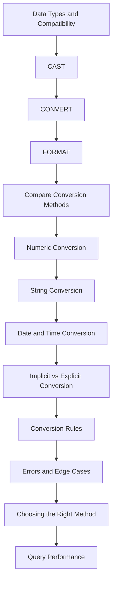

# README

## Overview

Type casting and conversion in SQL determine how values move between incompatible or differently represented data types. This matters whenever application input, legacy data, reporting requirements, APIs, or database schemas use different representations for the same logical value.

In production systems, conversion is not only about syntax. Poorly placed conversions can cause runtime errors, incorrect comparisons, implicit conversion warnings, inefficient execution plans, reduced index usage, and unnecessary CPU work.

This section focuses primarily on SQL Server conversion behavior, including `CAST`, `CONVERT`, `FORMAT`, implicit conversion, numeric and string conversion, date/time conversion, conversion rules, failure handling, and query-performance implications.

## Navigation

- [01- Data Types and Type Compatibility](./01-%20Data%20Types%20and%20Type%20Compatibility.md) — SQL data types, compatibility, precedence, and why type alignment matters
- [02- CAST](./02-%20CAST.md) — Standard explicit type conversion
- [03- CONVERT](./03-%20CONVERT.md) — SQL Server-specific conversion with style support
- [04- FORMAT](./04-%20FORMAT.md) — Presentation-oriented formatting and its performance trade-offs
- [05- CAST vs CONVERT vs FORMAT](./05-%20CAST%20vs%20CONVERT%20vs%20FORMAT.md) — Choosing the appropriate conversion mechanism
- [06- Numeric Conversion](./06-%20Numeric%20Conversion.md) — Integer, decimal, precision, scale, overflow, and numeric conversion
- [07- String Conversion](./07-%20String%20Conversion.md) — Converting between strings and other SQL data types
- [08- Date and Time Conversion](./08-%20Date%20and%20Time%20Conversion.md) — Date/time parsing, formatting, precision, and safe filtering
- [09- Implicit vs Explicit Conversion](./09-%20Implicit%20vs%20Explicit%20Conversion.md) — Automatic versus intentional conversion and its consequences
- [10- Conversion Rules](./10-%20Conversion%20Rules.md) — SQL Server conversion behavior, precedence, and compatibility rules
- [11- Conversion Errors and Edge Cases](./11-%20Conversion%20Errors%20and%20Edge%20Cases.md) — Invalid input, overflow, NULL, failed parsing, and boundary conditions
- [12- When to Use Each Conversion Method](./12-%20When%20to%20Use%20Each%20Conversion%20Method.md) — Practical decision-making between available conversion approaches
- [13- Conversion and Query Performance](./13-%20Conversion%20and%20Query%20Performance.md) — SARGability, indexes, execution plans, CPU cost, and production optimization

## Conversion Mental Model

A useful production mental model is:

```text
External Representation
        |
        v
Application Validation
        |
        v
Typed Application Value
        |
        v
Parameterized SQL
        |
        v
Database Type Compatibility
        |
        +--------------------+
        |                    |
        v                    v
 Native Type            Required Conversion
        |                    |
        v                    v
 Efficient Query       Explicit / Controlled
        |                    |
        +---------+----------+
                  |
                  v
             Result Set
                  |
                  v
        API / Report / Export
```

The preferred path is to establish the correct type as early as practical and avoid repeatedly converting database columns during query execution.

## Conversion Methods at a Glance

| Method | Primary Purpose | SQL Server | Style Support | Typical Use |
| --- | --- | --- | --- | --- |
| `CAST` | Explicit type conversion | Yes | No | General-purpose type conversion |
| `CONVERT` | Explicit conversion with SQL Server-specific features | Yes | Yes | Date/string conversions and SQL Server-specific formatting |
| `FORMAT` | Presentation formatting | Yes | N/A | Human-readable output |
| `TRY_CAST` | Conversion that returns `NULL` on failure | Yes | No | Untrusted or potentially invalid input |
| `TRY_CONVERT` | Safe `CONVERT` equivalent | Yes | Yes | Safe conversion with style support |
| Implicit conversion | Automatic type reconciliation | Yes | N/A | Engine-generated conversion; generally should not be relied upon for critical paths |

## Recommended Progression

A practical learning sequence is:



This progression moves from the underlying type system to syntax, then to real-world data handling and finally to production performance.

## Production Decision Framework

When a conversion is required, evaluate it in this order:

1. **Can the schema use the correct native data type?**
2. **Can the application provide a parameter using the correct type?**
3. **Can the conversion happen at an ingestion or validation boundary instead of during every query?**
4. **If conversion must happen in SQL, can it be performed without wrapping an indexed column in the predicate?**
5. **Is `TRY_CAST` or `TRY_CONVERT` appropriate for potentially invalid external data?**
6. **Is the conversion for data processing or only presentation?**
7. **Has the resulting query plan and runtime performance been measured?**

A conversion that exists because of a schema mismatch should generally be treated as a design problem rather than permanently accepted as query logic.

## Common Backend Scenarios

### REST API Input

HTTP APIs commonly represent values as JSON strings, numbers, or date strings.

```text
HTTP Request
    |
    v
Request Validation
    |
    v
Typed Application Value
    |
    v
Parameterized SQL
    |
    v
Native Database Type
```

Validate and normalize external input at the application boundary instead of repeatedly parsing it inside database predicates.

### Django and FastAPI

ORMs and application frameworks can hide SQL generation and parameter binding.

For performance-sensitive queries, inspect the generated SQL and verify that:

- Model field types match database column types.
- Parameters are passed using compatible types.
- Database-specific casts are intentional.
- Conversion is not being applied unnecessarily to indexed columns.

### ETL and Data Pipelines

Conversion is often appropriate during ingestion:

```text
Raw Data
   |
   v
Staging Table
   |
   v
Validation + Conversion
   |
   v
Typed Production Table
   |
   v
Application Queries
```

The goal is usually to convert once during ingestion rather than repeatedly converting the same data in application queries.

## Performance Principles

Conversion becomes a performance concern when it operates over large numbers of rows or participates in critical predicates and joins.

Prefer:

```sql
WHERE customer_id = @customer_id
```

over patterns such as:

```sql
WHERE CAST(customer_id AS VARCHAR(30)) = @customer_id
```

when `customer_id` is already numeric and the parameter can be supplied using the compatible numeric type.

For date filtering, prefer typed ranges:

```sql
WHERE created_at >= @start_time
  AND created_at < @end_time
```

over applying a conversion to the indexed datetime column.

When performance matters, verify the result using:

- Actual execution plans.
- Logical reads.
- CPU time.
- Elapsed time.
- Rows read versus rows returned.
- Index seek/scan behavior.
- Query Store data.
- Database wait and resource metrics.

## Common Production Risks

| Risk | Typical Cause | Mitigation |
| --- | --- | --- |
| Implicit conversion | Mismatched parameter and column types | Align application and database types |
| Conversion failure | Invalid external data | Validate input or use `TRY_CAST` / `TRY_CONVERT` |
| Overflow | Target type cannot represent the source value | Choose appropriate precision and range |
| Precision loss | Inappropriate numeric target type | Define precision and scale deliberately |
| Poor index usage | Conversion applied to indexed columns | Convert parameters rather than columns |
| CPU overhead | Conversion repeated across many rows | Convert during ingestion or normalize schema |
| Incorrect date interpretation | Ambiguous string formats | Use unambiguous date representations |
| Slow presentation formatting | `FORMAT` used for large result sets | Prefer native conversion or application-level formatting |
| Data-model inconsistency | Related columns use different types | Standardize key and value types |

## Related SQL Concepts

Type conversion interacts closely with several other SQL concepts:

- **Data type precedence** determines which type SQL Server may implicitly convert when expressions contain different types.
- **NULL semantics** affect the result of failed or optional conversions.
- **Indexes** determine whether conversion placement can interfere with efficient data access.
- **SARGability** determines whether predicates can be transformed into efficient search operations.
- **Collation** matters when converting and comparing character data.
- **Precision and scale** determine numeric conversion behavior.
- **Date/time precision** affects temporal conversion and filtering.
- **Execution plans** reveal conversion operators and their downstream effects.
- **Parameterized queries** reduce injection risk and provide a well-defined type boundary between applications and databases.

## Best Practices

- Prefer native database types over storing structured values as strings.
- Keep application parameters compatible with database column types.
- Prefer explicit conversion when conversion is intentional and part of query semantics.
- Use `TRY_CAST` or `TRY_CONVERT` when invalid external values are expected and should not abort the query.
- Avoid unnecessary conversion of indexed columns in filtering and join predicates.
- Use `CONVERT` when SQL Server-specific style handling is required.
- Treat `FORMAT` primarily as a presentation feature rather than a general-purpose conversion mechanism.
- Perform expensive or repeated transformations during ingestion when practical.
- Use typed date/time range predicates for efficient temporal filtering.
- Inspect generated SQL when using Django, FastAPI database layers, or other abstractions.
- Use actual execution plans and runtime metrics before declaring a conversion a performance problem.
- Fix persistent type mismatches at the schema or application boundary rather than compensating indefinitely inside queries.


## Key Takeaways

- **Correct data type design is the foundation of efficient SQL conversion; avoid using strings as substitutes for naturally typed values.**
- **`CAST` and `CONVERT` are primarily data-conversion tools, while `FORMAT` is better treated as a presentation-oriented function.**
- **Implicit conversions can hide type mismatches and create performance problems, especially around indexed columns and join keys.**
- **Safe conversion functions such as `TRY_CAST` and `TRY_CONVERT` are valuable when processing untrusted or inconsistent data, but they do not replace good schema design.**
- **For production workloads, evaluate conversion placement together with execution plans, index usage, CPU, logical reads, and row-processing volume.**