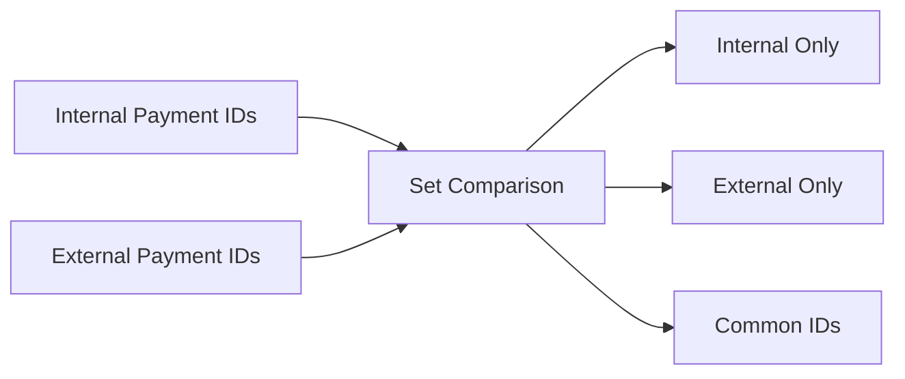

# 01- Set Operators Introduction

## Overview

Set operators combine the result sets of multiple `SELECT` statements into a single result set. They are useful when the data comes from logically separate queries but needs to be treated as one dataset.

The core SQL Server set operators are:

- `UNION`
- `UNION ALL`
- `INTERSECT`
- `EXCEPT`

Set operators operate on **rows produced by queries**, not on table relationships. This distinguishes them from `JOIN`, which combines columns from related rows.

A useful mental model is:

```text
Query A → Result Set A ─┐
                        ├─ Set Operator → Combined Result Set
Query B → Result Set B ─┘
```

Set operations are particularly useful for reporting, data reconciliation, permissions, auditing, multi-source aggregation, and queries that combine structurally compatible datasets.

## Set Operators vs JOIN

The most important distinction is whether the operation combines **rows** or **columns**.

| Operation | Combines | Typical Purpose |
| --- | --- | --- |
| `JOIN` | Columns from related rows | Enrich one dataset with another |
| `UNION` | Rows from multiple result sets | Combine alternative datasets |
| `UNION ALL` | Rows from multiple result sets | Append datasets without deduplication |
| `INTERSECT` | Rows common to both result sets | Find overlap |
| `EXCEPT` | Rows in first result set but not second | Find differences |

For example, suppose two queries return:

```text
Query A:
customer_id
----------
101
102
103

Query B:
customer_id
----------
103
104
105
```

Then:

```text
UNION:
101
102
103
104
105

INTERSECT:
103

EXCEPT:
101
102
```

## Basic Syntax

The general structure is:

```sql
SELECT column1, column2
FROM table_a
WHERE condition

UNION

SELECT column1, column2
FROM table_b
WHERE condition;
```

The individual `SELECT` statements are called **query inputs** or **query operands**.

The result of the set operation is another result set that can be consumed by:

- `ORDER BY`
- Aggregation
- Filtering through an outer query
- Pagination
- A CTE
- A view
- Another query expression

## Compatibility Requirements

Set operators require the participating queries to be structurally compatible.

The queries must generally have:

1. The same number of columns.
2. Corresponding columns with compatible data types.
3. A meaningful column ordering.
4. Compatible data type precedence where implicit conversion is required.

For example:

```sql
SELECT
    customer_id,
    customer_name
FROM customers

UNION ALL

SELECT
    customer_id,
    customer_name
FROM archived_customers;
```

This is valid when the corresponding columns are type-compatible.

The following is invalid because the number of columns differs:

```sql
SELECT
    customer_id,
    customer_name
FROM customers

UNION ALL

SELECT
    customer_id
FROM archived_customers;
```

## Column Names and Ordering

The output column names are determined by the first query.

```sql
SELECT
    customer_id AS id,
    customer_name AS name
FROM customers

UNION ALL

SELECT
    customer_id AS customer_id,
    customer_name AS customer_name
FROM archived_customers;
```

The resulting columns are named:

```text
id
name
```

The aliases from the second query do not rename the final result.

This is important when building reusable queries, views, reports, or API-facing database projections.

## Data Type Compatibility

Corresponding columns do not need to have exactly identical types, but they must be compatible.

For example:

```sql
SELECT customer_id
FROM customers

UNION ALL

SELECT customer_id
FROM archived_customers;
```

If one column is `INT` and the other is `BIGINT`, SQL Server may resolve the result using data type precedence and perform conversion.

This has several implications:

- The resulting data type may differ from either source expression.
- Implicit conversion can consume CPU.
- Incompatible types can cause conversion errors.
- Precision and scale can change for numeric expressions.
- Poor type alignment can indicate a schema design problem.

For high-volume workloads, align corresponding columns whenever practical.

## UNION

### What It Is

`UNION` combines two or more result sets and removes duplicate rows.

```sql
SELECT customer_id
FROM active_customers

UNION

SELECT customer_id
FROM archived_customers;
```

If the same `customer_id` appears in both result sets, it appears once in the final result.

### When to Use It

Use `UNION` when duplicate removal is part of the required semantics.

Typical cases include:

- Combining overlapping customer sources.
- Building a distinct list from multiple datasets.
- Merging logically separate sources where duplicates should represent one logical row.

### Performance Consideration

Duplicate elimination requires additional work.

Conceptually:

```text
Query A ─┐
         ├─ Combine → Deduplicate → Result
Query B ─┘
```

Depending on the execution plan, SQL Server may use operators such as sorting or hashing to remove duplicates.

For large datasets this can require significant:

- CPU
- Memory
- TempDB activity
- Sorting or hashing

Do not use `UNION` when duplicates are intentionally valid.

## UNION ALL

### What It Is

`UNION ALL` concatenates result sets without removing duplicates.

```sql
SELECT customer_id
FROM active_customers

UNION ALL

SELECT customer_id
FROM archived_customers;
```

If `101` exists in both datasets, the result contains both rows.

### Why It Matters

`UNION ALL` is generally cheaper than `UNION` because the database does not need to perform global duplicate elimination.

Conceptually:

```text
Query A ─┐
         ├─ Append → Result
Query B ─┘
```

### Production Recommendation

Prefer `UNION ALL` when:

- Duplicate removal is not required.
- Sources are mutually exclusive.
- Duplicate rows have independent meaning.
- You will perform deduplication later using a more appropriate business rule.

A common mistake is using `UNION` simply because it "looks safer." If uniqueness is not part of the requirement, the extra deduplication work is unnecessary.

## INTERSECT

### What It Is

`INTERSECT` returns distinct rows that appear in both result sets.

```sql
SELECT customer_id
FROM customers
WHERE country_code = 'IN'

INTERSECT

SELECT customer_id
FROM customers
WHERE status = 'ACTIVE';
```

The result contains customers satisfying both conditions.

### When to Use It

`INTERSECT` is useful when expressing set membership directly is clearer than constructing complex predicates.

Typical applications include:

- Finding users present in multiple datasets.
- Comparing permissions.
- Reconciling source systems.
- Identifying records satisfying independent criteria.

The result is distinct.

## EXCEPT

### What It Is

`EXCEPT` returns distinct rows from the first query that do not appear in the second query.

```sql
SELECT customer_id
FROM customers

EXCEPT

SELECT customer_id
FROM blocked_customers;
```

This represents:

```text
All Customers
    -
Blocked Customers
    =
Eligible Customers
```

### Direction Matters

`EXCEPT` is not symmetric.

```sql
A EXCEPT B
```

is different from:

```sql
B EXCEPT A
```

For example:

```text
A = {1, 2, 3}
B = {3, 4, 5}

A EXCEPT B = {1, 2}
B EXCEPT A = {4, 5}
```

This is a common interview and production mistake.

## Set Operator Comparison

| Operator | Duplicates | Meaning | Typical Cost |
| --- | --- | --- | --- |
| `UNION` | Removes | Combine distinct rows | Higher |
| `UNION ALL` | Preserves | Append rows | Usually lowest |
| `INTERSECT` | Removes | Common rows | Requires comparison |
| `EXCEPT` | Removes | Rows only in first input | Requires comparison |

`UNION ALL` is usually the best choice when deduplication is unnecessary.

## Set Operations with Multiple Queries

Set operators can combine more than two queries:

```sql
SELECT customer_id
FROM customers_us

UNION ALL

SELECT customer_id
FROM customers_eu

UNION ALL

SELECT customer_id
FROM customers_apac;
```

This is useful when partitions or source tables represent logically compatible datasets.

The design should still preserve a clear contract:

```text
customers_us
customers_eu
customers_apac
       |
       v
UNION ALL
       |
       v
Global Customer Dataset
```

## Ordering Set Operation Results

The final `ORDER BY` normally applies to the combined result.

```sql
SELECT customer_id, customer_name
FROM customers

UNION ALL

SELECT customer_id, customer_name
FROM archived_customers

ORDER BY customer_id;
```

Do not rely on the physical order produced by an individual input query.

For example, this does not guarantee the final output order:

```sql
SELECT customer_id
FROM customers
ORDER BY customer_id

UNION ALL

SELECT customer_id
FROM archived_customers
ORDER BY customer_id;
```

If ordering is required, define the ordering for the final result.

## Filtering Before and After a Set Operation

You can filter each input independently:

```sql
SELECT customer_id
FROM customers
WHERE status = 'ACTIVE'

UNION ALL

SELECT customer_id
FROM archived_customers
WHERE status = 'ACTIVE';
```

You can also filter the combined result using an outer query:

```sql
SELECT customer_id
FROM (
    SELECT customer_id
    FROM customers

    UNION ALL

    SELECT customer_id
    FROM archived_customers
) AS all_customers
WHERE customer_id > 1000;
```

The choice depends on semantics and optimizer behavior.

When a predicate can safely be pushed into each input, doing so may reduce the number of rows entering the set operation.

Conceptually:

```text
Large Source
    ↓
Filter Early
    ↓
Smaller Result
    ↓
Set Operation
```

is often preferable to:

```text
Large Source
    ↓
Set Operation
    ↓
Filter Later
```

when the predicate can be applied independently without changing semantics.

## Set Operators and NULL

`NULL` participates in set comparisons differently from ordinary equality predicates.

For set operations such as `UNION`, `INTERSECT`, and `EXCEPT`, rows are compared as sets, and corresponding `NULL` values can be treated as matching for duplicate elimination and set membership purposes.

For example:

```sql
SELECT CAST(NULL AS INT) AS value

UNION

SELECT CAST(NULL AS INT) AS value;
```

produces one row.

This differs from:

```sql
NULL = NULL
```

which does not evaluate to `TRUE`.

This distinction is important when reasoning about deduplication and reconciliation queries.

## Set Operators and NULLability

Corresponding expressions can have different nullability characteristics.

For example:

```sql
SELECT customer_id
FROM customers

UNION ALL

SELECT customer_id
FROM archived_customers;
```

The final result's metadata can depend on the expressions and source definitions.

When exposing set-operation results through views, stored procedures, or application contracts, verify the resulting metadata rather than assuming it exactly matches the first source table.

## Set Operators vs OR

Some set operations can be expressed using predicates.

For example:

```sql
SELECT customer_id
FROM customers
WHERE status = 'ACTIVE'
   OR status = 'PENDING';
```

could potentially be written as:

```sql
SELECT customer_id
FROM customers
WHERE status = 'ACTIVE'

UNION

SELECT customer_id
FROM customers
WHERE status = 'PENDING';
```

These are not automatically equivalent from a performance perspective.

The first query may be simpler and cheaper.

The second may be useful when the underlying queries have materially different logic or originate from different sources.

Do not use set operators merely to make a simple predicate look more sophisticated.

## Set Operators vs JOIN

Consider:

```sql
SELECT customer_id
FROM customers

UNION

SELECT customer_id
FROM prospects;
```

This answers:

> Which IDs exist in either dataset?

A join answers a different question:

```sql
SELECT
    c.customer_id,
    p.prospect_score
FROM customers AS c
JOIN prospects AS p
    ON p.customer_id = c.customer_id;
```

This answers:

> Which customer and prospect rows correspond to each other, and what columns can we retrieve from both?

A practical distinction is:

```text
UNION       → append compatible rows
JOIN        → combine related columns
INTERSECT   → find overlap
EXCEPT      → find difference
```

## Backend Engineering Example

Suppose a system stores current and archived orders separately:

```sql
CREATE TABLE orders (
    order_id BIGINT NOT NULL,
    customer_id BIGINT NOT NULL,
    created_at DATETIME2 NOT NULL
);

CREATE TABLE archived_orders (
    order_id BIGINT NOT NULL,
    customer_id BIGINT NOT NULL,
    created_at DATETIME2 NOT NULL
);
```

A reporting endpoint that needs both datasets can use:

```sql
SELECT
    order_id,
    customer_id,
    created_at
FROM orders

UNION ALL

SELECT
    order_id,
    customer_id,
    created_at
FROM archived_orders;
```

If the tables are mutually exclusive by lifecycle, `UNION ALL` is usually appropriate.

An API layer such as Django or FastAPI can consume this result as one logical dataset without requiring application-side merging.

## Reconciliation Example

Suppose an external payment system contains payment IDs that should exist internally.

```sql
SELECT payment_id
FROM internal_payments

EXCEPT

SELECT payment_id
FROM external_payments;
```

This identifies payments present internally but absent from the external dataset.

The reverse:

```sql
SELECT payment_id
FROM external_payments

EXCEPT

SELECT payment_id
FROM internal_payments;
```

identifies payments present externally but missing internally.

Together, they can form a reconciliation process:



This pattern is useful in scheduled Celery jobs, financial reconciliation, audit pipelines, and operational data-quality checks.

## Query Performance

Set operators can process large intermediate result sets.

Performance depends on:

- Number of rows.
- Number of columns.
- Data types.
- Duplicate frequency.
- Indexes.
- Cardinality estimates.
- Sorting and hashing requirements.
- Memory availability.
- TempDB usage.
- Parallelism.
- Predicate selectivity.

### UNION vs UNION ALL

The most important performance distinction is duplicate elimination.

```sql
SELECT customer_id
FROM source_a

UNION ALL

SELECT customer_id
FROM source_b;
```

usually requires less work than:

```sql
SELECT customer_id
FROM source_a

UNION

SELECT customer_id
FROM source_b;
```

because `UNION` must determine which combined rows are duplicates.

For large datasets, unnecessary `UNION` can create substantial resource consumption.

## Indexing Considerations

Indexes apply to the individual source queries rather than to the abstract set operator itself.

For example:

```sql
SELECT customer_id
FROM orders
WHERE customer_id = @customer_id

UNION ALL

SELECT customer_id
FROM archived_orders
WHERE customer_id = @customer_id;
```

Each source query can potentially benefit from appropriate indexes.

Good indexing strategy therefore starts with the individual query predicates.

Do not expect adding an index to one source table to optimize access to another source table.

## Data Type Alignment

Set operations can introduce implicit conversion when corresponding expressions use different types.

Avoid designs such as:

```text
orders.customer_id          BIGINT
archived_orders.customer_id VARCHAR(30)
```

when both columns represent the same logical identifier.

Prefer:

```text
orders.customer_id          BIGINT
archived_orders.customer_id BIGINT
```

Type alignment provides:

- Predictable semantics.
- Fewer conversion operations.
- Lower risk of conversion failures.
- Simpler query plans.
- Better long-term maintainability.

## Set Operators and Pagination

Pagination over a set-operation result requires care.

For example:

```sql
SELECT
    order_id,
    created_at
FROM orders

UNION ALL

SELECT
    order_id,
    created_at
FROM archived_orders

ORDER BY created_at DESC
OFFSET @offset ROWS
FETCH NEXT @page_size ROWS ONLY;
```

Large offsets can become increasingly expensive.

For high-volume APIs, keyset pagination may be preferable, provided the combined dataset has a stable ordering key.

The pagination strategy should also account for duplicate ordering values. A deterministic ordering such as:

```sql
ORDER BY created_at DESC, order_id DESC
```

is often safer than ordering only by a non-unique timestamp.

## Common Mistakes

| Mistake | Why It Happens | Better Approach |
| --- | --- | --- |
| Using `UNION` instead of `UNION ALL` | Assuming duplicate removal is always safer | Use `UNION ALL` when duplicates are valid |
| Treating `UNION` like `JOIN` | Confusing row and column combination | Use `UNION` for compatible rows, `JOIN` for related columns |
| Reversing `EXCEPT` operands | Forgetting that direction matters | Define the expected set explicitly |
| Assuming column aliases from the second query apply | Misunderstanding output metadata | Alias the first query's columns |
| Mismatching data types | Legacy schemas or inconsistent design | Align corresponding types |
| Ordering individual inputs | Assuming source ordering survives | Apply `ORDER BY` to the final result |
| Combining huge datasets unnecessarily | Set operation used without filtering | Push safe filters into source queries |
| Using set operators for simple predicates | Overengineering | Prefer direct predicates when clearer |
| Ignoring duplicate semantics | Not defining what a duplicate means | Decide whether duplicates are meaningful |
| Paginating without deterministic ordering | Non-unique sort key | Add a stable tie-breaker |

## Interview Traps

### `UNION` vs `UNION ALL`

The key difference is duplicate handling.

```text
UNION
→ combines + removes duplicates

UNION ALL
→ combines + preserves duplicates
```

`UNION ALL` is generally more efficient when deduplication is unnecessary.

### `EXCEPT` Direction

Remember:

```text
A EXCEPT B
```

means:

```text
A - B
```

It does not mean "rows that differ in either direction."

To find differences in both directions, run both operations.

### `INTERSECT` Distinctness

`INTERSECT` returns distinct rows.

If duplicate preservation is required, do not assume `INTERSECT` behaves like a row-by-row inner join.

### Column Names

The first query determines the output column names.

```sql
SELECT customer_id AS id
FROM customers

UNION ALL

SELECT customer_id AS customer_id
FROM archived_customers;
```

The output column is named `id`.

## Production Checklist

Before using a set operator in a production query, verify:

- [ ] Do all inputs return the same number of columns?
- [ ] Are corresponding data types compatible?
- [ ] Is duplicate removal actually required?
- [ ] If not, can `UNION ALL` be used?
- [ ] Is `EXCEPT` being used in the correct direction?
- [ ] Is the final ordering explicitly defined?
- [ ] Can filters be pushed into individual inputs?
- [ ] Are source queries using appropriate indexes?
- [ ] Could the set operation produce a very large intermediate result?
- [ ] Does the execution plan show expensive sorting or hashing?
- [ ] Is memory or TempDB pressure possible?
- [ ] Is pagination deterministic?
- [ ] Are ORM-generated queries producing the intended SQL?
- [ ] Does the application expect duplicates or distinct rows?

## Key Takeaways

- **Set operators combine compatible result sets by operating on rows, while joins combine related rows by adding columns.**
- **`UNION ALL` preserves duplicates and is generally preferable to `UNION` when deduplication is not part of the business requirement.**
- **`INTERSECT` finds common distinct rows, while `EXCEPT` returns distinct rows from its first input that are absent from its second input.**
- **Corresponding columns should use compatible data types; schema alignment avoids implicit conversions, errors, and unnecessary query work.**
- **Production performance depends on input size, filtering, duplicate elimination, sorting/hashing, indexes, and the resulting execution plan—not merely on the set operator syntax.**