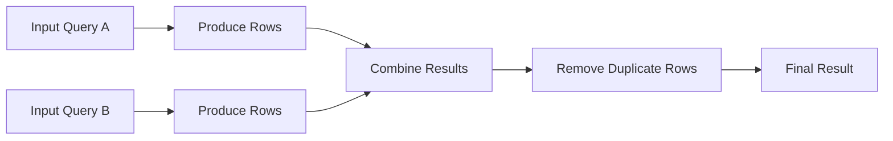
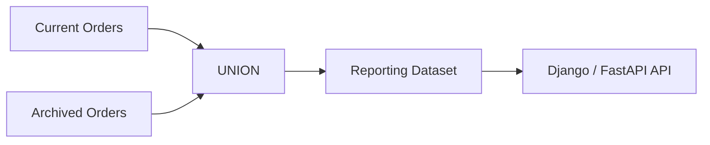

# 02- UNION

## Overview

`UNION` combines the result sets of two or more `SELECT` statements into a single result set and removes duplicate rows from the combined output.

It is a **set operation**: the queries contribute rows with a compatible structure rather than combining related rows side-by-side. This makes `UNION` fundamentally different from a `JOIN`.

```text
Query A ─────┐
             ├── UNION ──→ Combined distinct result set
Query B ─────┘
```

`UNION` is useful when multiple sources represent the same logical kind of data and the application needs one distinct dataset. Typical backend use cases include combining current and legacy records, consolidating multiple operational sources, and producing distinct identifiers for reporting or reconciliation.

In SQL Server, `UNION` performs duplicate elimination. If duplicate preservation is intentional, use `UNION ALL` instead.

## Why UNION Exists

Relational queries frequently produce datasets from different tables or different filtering conditions that have the same logical shape.

For example, a platform may maintain current and archived customers separately:

```text
customers
    customer_id
    email
    ...

archived_customers
    customer_id
    email
    ...
```

A query may need one logical customer list:

```sql
SELECT customer_id, email
FROM customers

UNION

SELECT customer_id, email
FROM archived_customers;
```

If the same `(customer_id, email)` row appears in both inputs, `UNION` returns it once.

This allows the database to perform set composition and deduplication instead of requiring the application to:

1. Execute multiple queries.
2. Fetch all rows.
3. Merge them in Python.
4. Deduplicate them in application memory.

For production systems, performing this work close to the data is usually preferable when the database can execute it efficiently.

## UNION Syntax

The basic syntax is:

```sql
SELECT column1, column2, ...
FROM table_a
WHERE condition

UNION

SELECT column1, column2, ...
FROM table_b
WHERE condition;
```

Multiple queries can participate:

```sql
SELECT customer_id
FROM customers_us

UNION

SELECT customer_id
FROM customers_eu

UNION

SELECT customer_id
FROM customers_apac;
```

The final result contains distinct rows across all inputs.

## Compatibility Requirements

Every query participating in a `UNION` must return a compatible result shape.

The important requirements are:

| Requirement | Explanation |
| --- | --- |
| Same column count | Every `SELECT` must return the same number of expressions |
| Compatible types | Corresponding expressions must be implicitly or explicitly compatible |
| Same logical position | Column 1 is compared with column 1, column 2 with column 2, etc. |
| Compatible semantics | Corresponding columns should represent the same business concept |

For example:

```sql
SELECT
    customer_id,
    customer_name
FROM customers

UNION

SELECT
    customer_id,
    customer_name
FROM archived_customers;
```

is appropriate when both result sets have compatible types.

The following is invalid because the result shapes differ:

```sql
SELECT
    customer_id,
    customer_name
FROM customers

UNION

SELECT
    customer_id
FROM archived_customers;
```

## Column Position Matters

`UNION` matches columns by **position**, not by name.

Consider:

```sql
SELECT
    customer_id,
    email
FROM customers

UNION

SELECT
    email,
    customer_id
FROM archived_customers;
```

The database does not infer that `customer_id` should match `customer_id`.

Instead:

```text
First column ↔ First column
Second column ↔ Second column
```

This can produce incorrect results when the types happen to be compatible.

Always keep the same logical ordering across the participating queries.

## Column Names in the Result

The output column names are determined by the first query.

```sql
SELECT
    customer_id AS id,
    customer_name AS name
FROM customers

UNION

SELECT
    customer_id AS customer_id,
    customer_name AS customer_name
FROM archived_customers;
```

The final result uses:

```text
id
name
```

The aliases in subsequent queries do not rename the final result columns.

This matters when the result is consumed by:

- A view.
- A stored procedure.
- A reporting layer.
- Django.
- FastAPI.
- ETL jobs.
- BI tooling.

Define the first query's aliases intentionally.

## Data Type Resolution

Corresponding expressions can have different but compatible data types.

SQL Server uses data type precedence when it needs to resolve compatible expressions.

For example:

```sql
SELECT customer_id
FROM current_customers

UNION

SELECT customer_id
FROM archived_customers;
```

If one `customer_id` is `INT` and the other is `BIGINT`, SQL Server can resolve the result using its type-conversion rules.

However, relying heavily on implicit conversion is undesirable in production.

Prefer schema alignment:

```text
current_customers.customer_id    BIGINT
archived_customers.customer_id   BIGINT
```

rather than:

```text
current_customers.customer_id    BIGINT
archived_customers.customer_id   VARCHAR(50)
```

Explicitly cast when the input schemas cannot be changed:

```sql
SELECT
    CAST(customer_id AS BIGINT) AS customer_id
FROM current_customers

UNION

SELECT
    CAST(customer_id AS BIGINT) AS customer_id
FROM archived_customers;
```

This makes the query contract explicit and reduces ambiguity around conversion behavior.

## Duplicate Elimination

The defining characteristic of `UNION` is that it returns distinct rows.

Suppose:

```text
Query A:
customer_id
-----------
101
102
103

Query B:
customer_id
-----------
103
104
105
```

Then:

```sql
SELECT customer_id
FROM query_a

UNION

SELECT customer_id
FROM query_b;
```

produces:

```text
101
102
103
104
105
```

The duplicate `103` appears only once.

Duplicate comparison considers the **entire result row**, not just one identifier.

For:

```sql
SELECT customer_id, status
FROM source_a

UNION

SELECT customer_id, status
FROM source_b;
```

these are different rows:

```text
101 | ACTIVE
101 | INACTIVE
```

because the complete rows differ.

## UNION vs UNION ALL

The distinction between `UNION` and `UNION ALL` is one of the most important SQL interview and production concepts.

| Characteristic | `UNION` | `UNION ALL` |
| --- | --- | --- |
| Combines rows | Yes | Yes |
| Removes duplicate rows | Yes | No |
| Usually requires additional work | Yes | Usually no |
| Preserves multiplicity | No | Yes |
| Appropriate when duplicates are meaningful | No | Yes |
| Typical performance | More expensive | Usually cheaper |

Example:

```sql
SELECT customer_id
FROM current_customers

UNION

SELECT customer_id
FROM archived_customers;
```

returns each distinct `customer_id` once.

With:

```sql
SELECT customer_id
FROM current_customers

UNION ALL

SELECT customer_id
FROM archived_customers;
```

every row is preserved.

### Practical Rule

Use:

```text
UNION ALL
```

unless duplicate elimination is explicitly required.

Do not use `UNION` simply because it appears safer. Deduplication has a computational cost and may hide data-quality problems that should instead be handled explicitly.

## How UNION Executes

A simplified execution model is:



The optimizer chooses the actual execution strategy.

Duplicate elimination may involve sorting, hashing, or other physical operators depending on the query, available indexes, cardinality estimates, and optimizer decisions.

The important engineering consequence is that `UNION` can require additional CPU and memory beyond executing the two source queries.

## Performance Considerations

`UNION` can become expensive when the input datasets are large.

The main factors are:

- Number of rows returned by each input.
- Width of each row.
- Number of columns involved in duplicate comparison.
- Number of duplicates.
- Cardinality estimates.
- Memory availability.
- Sorting or hashing requirements.
- TempDB pressure.
- Parallelism.
- Predicate selectivity.

For example:

```sql
SELECT
    customer_id,
    email,
    created_at,
    status,
    country_code
FROM customers

UNION

SELECT
    customer_id,
    email,
    created_at,
    status,
    country_code
FROM archived_customers;
```

requires duplicate comparison across the complete projected row.

If only distinct customer IDs are required, avoid carrying unnecessary columns:

```sql
SELECT customer_id
FROM customers

UNION

SELECT customer_id
FROM archived_customers;
```

Reducing the row width can reduce the amount of data that must be processed for duplicate elimination.

## Filter Early

When a predicate applies independently to each input, filter the source queries before the set operation.

Prefer:

```sql
SELECT customer_id
FROM customers
WHERE status = 'ACTIVE'

UNION

SELECT customer_id
FROM archived_customers
WHERE status = 'ACTIVE';
```

over unnecessarily creating a huge intermediate result and filtering afterward.

Conceptually:

```text
Source
  ↓
Filter
  ↓
Smaller result
  ↓
UNION
  ↓
Deduplication
```

This can reduce:

- Rows processed.
- Memory consumption.
- Sorting or hashing work.
- TempDB usage.

The optimizer may perform predicate pushdown itself, but query structure should still express the intended semantics clearly.

## Avoid Unnecessary Columns

Because `UNION` compares complete rows, projected columns affect both correctness and performance.

Consider:

```sql
SELECT customer_id, email
FROM customers

UNION

SELECT customer_id, email
FROM archived_customers;
```

A customer with:

```text
101 | user@example.com
101 | old@example.com
```

produces two rows because the complete rows differ.

If the business requirement is only distinct customer IDs:

```sql
SELECT customer_id
FROM customers

UNION

SELECT customer_id
FROM archived_customers;
```

is the correct query.

This is both semantically clearer and cheaper.

## Ordering UNION Results

The `ORDER BY` for a combined result belongs at the end of the complete set operation.

```sql
SELECT
    customer_id,
    customer_name
FROM customers

UNION

SELECT
    customer_id,
    customer_name
FROM archived_customers

ORDER BY customer_id;
```

The ordering applies to the final result.

Do not rely on the order produced by either input query.

For reusable queries, views, or API endpoints, always specify an explicit final ordering when consumers require deterministic output.

## Filtering the Combined Result

You can filter each input separately:

```sql
SELECT customer_id
FROM customers
WHERE country_code = 'IN'

UNION

SELECT customer_id
FROM archived_customers
WHERE country_code = 'IN';
```

You can also filter the combined result using a derived table:

```sql
SELECT customer_id
FROM (
    SELECT customer_id
    FROM customers

    UNION

    SELECT customer_id
    FROM archived_customers
) AS combined_customers
WHERE customer_id >= 100000;
```

Use the first form when the predicate naturally applies to each source.

Use the second when the filtering logic genuinely belongs to the combined dataset.

## UNION with Different Source Schemas

Real systems frequently have legacy tables with different schemas.

Suppose the current table stores:

```text
customer_id
email
```

while a legacy table stores:

```text
id
email_address
```

Normalize the projection:

```sql
SELECT
    customer_id,
    email
FROM customers

UNION

SELECT
    id AS customer_id,
    email_address AS email
FROM legacy_customers;
```

The aliases make the logical contract explicit.

If additional fields are needed, provide compatible expressions:

```sql
SELECT
    customer_id,
    email,
    'CURRENT' AS source
FROM customers

UNION

SELECT
    id AS customer_id,
    email_address AS email,
    'LEGACY' AS source
FROM legacy_customers;
```

This pattern is useful for migrations, reporting, and data consolidation.

## Handling Missing Columns

If one source does not contain a column required by the combined result, provide a typed `NULL` or another appropriate default.

For example:

```sql
SELECT
    customer_id,
    email,
    created_at
FROM customers

UNION

SELECT
    customer_id,
    email,
    CAST(NULL AS datetime2) AS created_at
FROM legacy_customers;
```

Explicitly typing `NULL` is preferable when type resolution could otherwise be ambiguous.

Do not invent a business value merely to satisfy column compatibility.

For example, replacing an unknown timestamp with:

```sql
'1900-01-01'
```

can introduce false data into downstream systems.

## UNION and NULL

`UNION` treats duplicate rows according to SQL set semantics.

For example:

```sql
SELECT CAST(NULL AS INT) AS value

UNION

SELECT CAST(NULL AS INT) AS value;
```

produces one row.

This differs from the ordinary predicate:

```sql
NULL = NULL
```

which evaluates to `UNKNOWN`, not `TRUE`.

The distinction matters when reasoning about deduplication and other set operations.

## UNION and JOIN

A common design mistake is using `UNION` when a `JOIN` is required.

### UNION

```sql
SELECT customer_id
FROM customers

UNION

SELECT customer_id
FROM prospects;
```

Question answered:

> Which customer IDs exist in either dataset?

### JOIN

```sql
SELECT
    c.customer_id,
    p.prospect_score
FROM customers AS c
JOIN prospects AS p
    ON p.customer_id = c.customer_id;
```

Question answered:

> Which rows correspond to each other, and what information can be combined from both?

Use this mental model:

```text
UNION
→ add rows

JOIN
→ add columns

INTERSECT
→ find common rows

EXCEPT
→ find rows present in one input but not another
```

## UNION with OR

Sometimes developers replace a simple predicate with multiple queries:

```sql
SELECT customer_id
FROM customers
WHERE status = 'ACTIVE'

UNION

SELECT customer_id
FROM customers
WHERE status = 'PENDING';
```

This may be equivalent to:

```sql
SELECT customer_id
FROM customers
WHERE status IN ('ACTIVE', 'PENDING');
```

The second query is usually clearer for a single table and straightforward predicate.

`UNION` becomes more useful when the individual inputs have different sources or materially different query logic.

Do not introduce set operations when a simpler predicate expresses the requirement directly.

## UNION Across Current and Archive Tables

A common backend architecture separates active and historical records.



A reporting query might be:

```sql
SELECT
    order_id,
    customer_id,
    created_at,
    total_amount
FROM orders

UNION

SELECT
    order_id,
    customer_id,
    created_at,
    total_amount
FROM archived_orders;
```

Use `UNION` only if duplicate rows across the two sources must be collapsed.

If the architecture guarantees that current and archived records are mutually exclusive, `UNION ALL` is usually more appropriate:

```sql
SELECT
    order_id,
    customer_id,
    created_at,
    total_amount
FROM orders

UNION ALL

SELECT
    order_id,
    customer_id,
    created_at,
    total_amount
FROM archived_orders;
```

This is an important production optimization: understand the lifecycle guarantees of the underlying data before choosing the operator.

## UNION in Backend APIs

Suppose a FastAPI endpoint exposes customer search results from active and archived sources.

The database can return one logical dataset:

```sql
SELECT
    customer_id,
    email,
    created_at
FROM customers
WHERE email LIKE @search_pattern

UNION

SELECT
    customer_id,
    email,
    created_at
FROM archived_customers
WHERE email LIKE @search_pattern

ORDER BY created_at DESC;
```

The application receives a single result set instead of independently querying both tables and merging the responses.

This can simplify:

- Application logic.
- Pagination logic.
- Deduplication.
- Error handling.
- Database round trips.

However, for high-volume endpoints, inspect the execution plan and pagination strategy rather than assuming a single SQL query is automatically faster.

## Pagination

Pagination over a `UNION` result must be applied to the combined and ordered dataset.

For SQL Server:

```sql
SELECT
    customer_id,
    email,
    created_at
FROM customers

UNION

SELECT
    customer_id,
    email,
    created_at
FROM archived_customers

ORDER BY created_at DESC, customer_id DESC
OFFSET @offset ROWS
FETCH NEXT @page_size ROWS ONLY;
```

The ordering should be deterministic.

Using only:

```sql
ORDER BY created_at DESC
```

can produce unstable pagination when many rows share the same timestamp.

A unique or sufficiently selective tie-breaker such as `customer_id` makes the ordering more deterministic.

For very large datasets, keyset pagination may be preferable to large `OFFSET` values.

## Indexing

Indexes optimize the individual source queries rather than the `UNION` operator itself.

For example:

```sql
SELECT customer_id
FROM customers
WHERE status = 'ACTIVE'

UNION

SELECT customer_id
FROM archived_customers
WHERE status = 'ACTIVE';
```

Each source table should have indexes appropriate to its own filtering and access patterns.

Potentially useful indexes depend on:

- `WHERE` predicates.
- Join conditions inside each input.
- Selectivity.
- Projection requirements.
- Table size.

Do not add indexes solely because a query contains `UNION`. Analyze the execution plan and the individual input queries.

## Execution Plan Analysis

For a production query, inspect the actual execution plan when performance matters.

Pay particular attention to:

- Scans on large tables.
- Implicit conversions.
- Sort operators.
- Hash operations.
- Memory grants.
- Spills to TempDB.
- Cardinality estimate errors.
- Parallelism.
- Expensive predicates.

A typical optimization process is:

```text
UNION query
    ↓
Actual execution plan
    ↓
Identify expensive input
    ↓
Optimize predicates / indexes / projections
    ↓
Re-test
```

Do not optimize based solely on the presence of `UNION`.

The expensive part may be one of the source queries rather than duplicate elimination.

## Data Quality and UNION

`UNION` can hide certain data-quality issues because duplicate rows disappear.

Suppose two operational systems produce the same customer ID but conflicting data:

```text
System A:
101 | alice@example.com

System B:
101 | alice@old.example.com
```

This query:

```sql
SELECT customer_id, email
FROM system_a

UNION

SELECT customer_id, email
FROM system_b;
```

does not deduplicate by `customer_id`, because the complete rows differ.

Both rows remain.

If the business rule says there must be one customer per ID, a more explicit reconciliation strategy may be required, such as:

- `ROW_NUMBER()`.
- Aggregation.
- Source priority.
- Latest-record selection.
- Conflict detection.

Do not assume `UNION` implements business-level deduplication.

## UNION and Business-Level Deduplication

Database-level distinctness and business-level uniqueness are different concepts.

`UNION` answers:

> Are these complete result rows identical?

It does not answer:

> Which record should represent this customer?

For example:

```text
customer_id | email
------------|------------------
101         | new@example.com
101         | old@example.com
```

Both rows are distinct to `UNION`.

If one should win based on recency:

```sql
WITH combined AS (
    SELECT
        customer_id,
        email,
        updated_at
    FROM customers

    UNION ALL

    SELECT
        customer_id,
        email,
        updated_at
    FROM archived_customers
),
ranked AS (
    SELECT
        *,
        ROW_NUMBER() OVER (
            PARTITION BY customer_id
            ORDER BY updated_at DESC
        ) AS rn
    FROM combined
)
SELECT
    customer_id,
    email,
    updated_at
FROM ranked
WHERE rn = 1;
```

This explicitly implements a business rule rather than relying on `UNION`.

## Common Mistakes

| Mistake | Why It Happens | Better Approach |
| --- | --- | --- |
| Using `UNION` when duplicates are valid | Treating deduplication as universally desirable | Use `UNION ALL` |
| Assuming deduplication is by ID | Confusing row distinctness with business uniqueness | Project the correct columns or use explicit ranking |
| Matching columns by name | Forgetting that set operators use position | Keep corresponding expressions in the same order |
| Ignoring data types | Assuming compatible-looking values are interchangeable | Align schemas or explicitly cast |
| Using `UNION` instead of `JOIN` | Confusing row composition with column composition | Choose the operation based on the required result shape |
| Ordering individual queries | Assuming source order survives the set operation | Apply final `ORDER BY` |
| Carrying unnecessary columns | Not considering duplicate comparison width | Project only required columns |
| Filtering after a huge set operation | Producing unnecessary intermediate rows | Push safe predicates into each input |
| Assuming one query is always faster | Ignoring execution-plan behavior | Measure with actual execution plans |
| Using `UNION` for business deduplication | Assuming identical rows represent identical entities | Use explicit business rules |

## Production Considerations

### Correctness

Before using `UNION`, define what constitutes a duplicate.

Ask:

- Is duplicate elimination required?
- Are duplicates meaningful?
- Is uniqueness based on the complete row or a business key?
- Can the sources contain conflicting versions of the same entity?

### Performance

For large datasets:

- Prefer `UNION ALL` when valid.
- Filter early.
- Project only required columns.
- Keep corresponding data types aligned.
- Index source-query predicates appropriately.
- Inspect actual execution plans.
- Watch for memory grants and TempDB spills.

### Reliability

If `UNION` is used in a critical reporting or API query:

- Test with realistic data volumes.
- Test duplicate-heavy datasets.
- Test empty inputs.
- Test `NULL` values.
- Test incompatible or legacy source data.
- Verify pagination behavior.
- Monitor query duration and resource consumption.

### Schema Evolution

If multiple tables are unioned, schema changes become a coordination concern.

For example, adding:

```text
customer_tier
```

to one source does not automatically make it available in the combined result.

The query must deliberately normalize both inputs:

```sql
SELECT
    customer_id,
    email,
    customer_tier
FROM customers

UNION

SELECT
    customer_id,
    email,
    CAST(NULL AS varchar(20)) AS customer_tier
FROM archived_customers;
```

Treat the projection of each `UNION` input as an explicit contract.

## Security Considerations

`UNION` itself is not a security mechanism.

Do not assume that combining queries protects sensitive rows.

Application-generated SQL should use parameterized queries:

```sql
SELECT customer_id, email
FROM customers
WHERE email = @email

UNION

SELECT customer_id, email
FROM archived_customers
WHERE email = @email;
```

Avoid dynamically concatenating untrusted input:

```text
"... WHERE email = '" + user_input + "'"
```

The risk of SQL injection exists regardless of whether the query contains a set operator.

Also ensure that every input applies the same authorization and tenant-isolation rules where required. A common security mistake is securing one source query while accidentally exposing rows from another source in the `UNION`.

## Monitoring and Operations

For high-value production queries, monitor:

- Execution duration.
- CPU consumption.
- Logical reads.
- Memory grants.
- TempDB spills.
- Query frequency.
- Rows returned.
- Plan regressions.

If the query is generated by Django or another ORM, inspect the generated SQL when diagnosing performance.

For recurring reporting or reconciliation jobs, such as Celery workers, monitor both:

```text
Database query performance
+
Application job duration
```

A query that is acceptable interactively may become operationally expensive when executed thousands of times by background workers.

## Interview Traps

### Does UNION remove duplicates?

Yes.

```text
UNION     → distinct result
UNION ALL → duplicate-preserving result
```

### Are duplicates removed based on one column?

No.

Duplicates are determined from the complete projected row.

### Does column name determine matching?

No.

Columns are matched by position.

### Is UNION the same as JOIN?

No.

```text
UNION → combines rows
JOIN  → combines columns from related rows
```

### Is `UNION ALL` always faster?

It generally avoids the duplicate-elimination work required by `UNION`, but overall query performance still depends on the input queries, data volume, indexes, and execution plan.

### Is UNION appropriate for deduplicating entities?

Not necessarily.

If uniqueness is defined by a business key rather than the complete row, use an explicit technique such as `ROW_NUMBER()`, aggregation, or source-priority logic.

## Practical Decision Guide

| Requirement | Recommended Approach |
| --- | --- |
| Combine two compatible datasets and remove identical rows | `UNION` |
| Append datasets and preserve every row | `UNION ALL` |
| Find records common to both datasets | `INTERSECT` |
| Find records present in A but absent from B | `EXCEPT` |
| Combine related columns from matching rows | `JOIN` |
| Distinct values from one table | `SELECT DISTINCT` |
| Deduplicate entities using a business rule | Window function or explicit aggregation |

## Production Checklist

Before deploying a `UNION` query, verify:

- [ ] Every input returns the same number of columns.
- [ ] Corresponding columns are in the correct logical order.
- [ ] Corresponding data types are compatible.
- [ ] Duplicate semantics are explicitly understood.
- [ ] `UNION ALL` has been considered.
- [ ] Only required columns are projected.
- [ ] Safe filters are applied as early as possible.
- [ ] Appropriate indexes exist for source-query predicates.
- [ ] The final ordering is explicitly defined when required.
- [ ] Pagination is deterministic.
- [ ] Actual execution plans have been reviewed for expensive workloads.
- [ ] Memory grants and TempDB behavior have been considered.
- [ ] Business-level deduplication is not being confused with row-level distinctness.
- [ ] Authorization and tenant filters apply consistently to every input.
- [ ] ORM-generated SQL has been reviewed when relevant.

## Key Takeaways

- **`UNION` combines compatible result sets and removes duplicate complete rows; it does not deduplicate according to a business key.**
- **Use `UNION ALL` when duplicate preservation is valid because it avoids the duplicate-elimination work required by `UNION`.**
- **Set-operation columns are matched by position, and the first query determines the output column names, so projection order and aliases must be deliberate.**
- **For production workloads, filter early, project only required columns, align data types, and inspect execution plans for sorting, hashing, memory, and TempDB costs.**
- **Use `UNION` for row composition, `JOIN` for related-column composition, and explicit window-function or aggregation logic when business-level deduplication is required.**