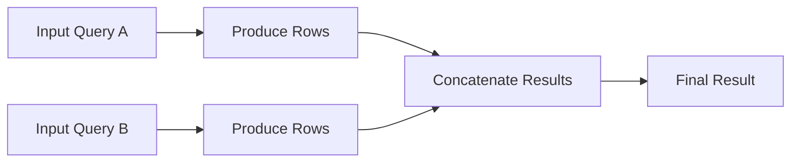
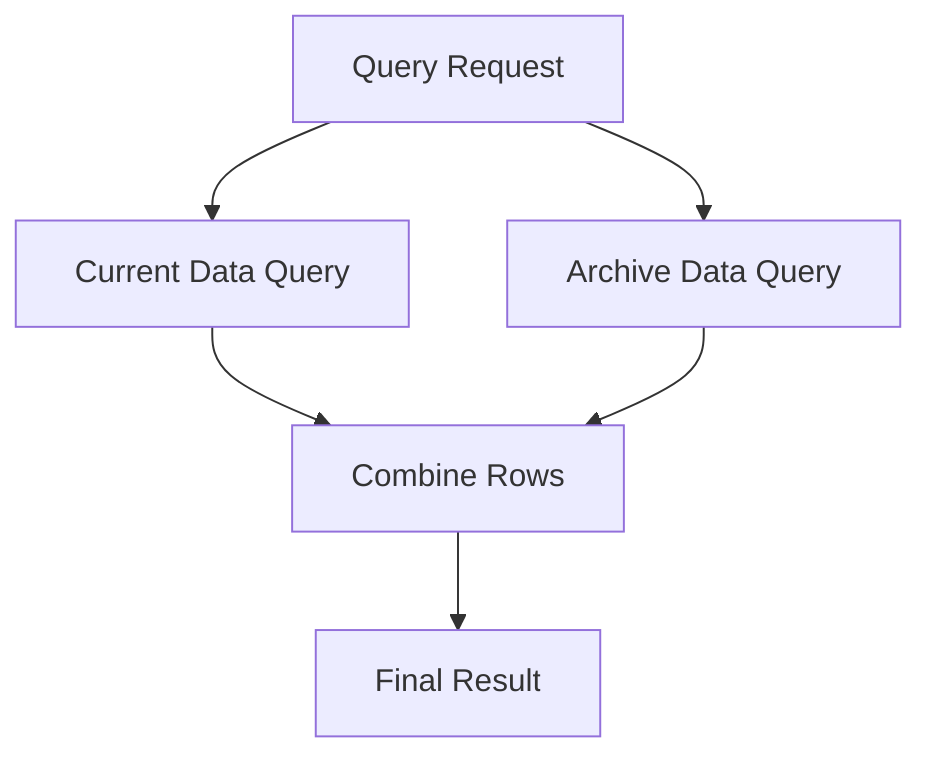

# 03- UNION ALL

## Overview

`UNION ALL` combines the result sets of two or more `SELECT` statements and preserves every row, including duplicates.

It is the duplicate-preserving counterpart to `UNION`:

| Operator | Combines rows | Removes duplicate rows |
| --- | --- | --- |
| `UNION` | Yes | Yes |
| `UNION ALL` | Yes | No |

`UNION ALL` is often the preferred set operator in production systems when the input datasets are already known to be mutually exclusive or when duplicate rows represent meaningful occurrences.

Because it does not need to perform global duplicate elimination, `UNION ALL` is generally cheaper than `UNION` and is particularly useful for large reporting queries, event data, historical/current table consolidation, and ETL pipelines.

## Why UNION ALL Exists

Many backend systems partition logically similar data across multiple sources:

- Current and archived tables.
- Regional tables.
- Tenant-specific partitions.
- Historical event tables.
- Legacy and modern schemas.
- Multiple ingestion streams.

Applications often need to treat these sources as one logical dataset.

For example:

```sql
SELECT
    order_id,
    customer_id,
    created_at,
    total_amount
FROM orders

UNION ALL

SELECT
    order_id,
    customer_id,
    created_at,
    total_amount
FROM archived_orders;
```

The database appends the rows from `archived_orders` to the rows from `orders`.

If the same row occurs in both sources, both copies remain in the result.

This behavior is intentional. `UNION ALL` does not attempt to determine whether two rows are duplicates or whether one represents a newer version of another.

## UNION ALL Semantics

Consider two result sets.

```text
Query A

id
---
101
102
103
```

```text
Query B

id
---
103
104
105
```

With `UNION ALL`:

```sql
SELECT id
FROM query_a

UNION ALL

SELECT id
FROM query_b;
```

the result is:

```text
101
102
103
103
104
105
```

The value `103` appears twice because two input rows existed.

This makes `UNION ALL` a better representation of **row concatenation** than deduplication.

## Syntax

The basic syntax is:

```sql
SELECT column1, column2, ...
FROM table_a
WHERE condition

UNION ALL

SELECT column1, column2, ...
FROM table_b
WHERE condition;
```

Multiple inputs are allowed:

```sql
SELECT customer_id
FROM customers_us

UNION ALL

SELECT customer_id
FROM customers_eu

UNION ALL

SELECT customer_id
FROM customers_apac;
```

The result contains all rows produced by every input query.

## Compatibility Requirements

The participating queries must have compatible result shapes.

| Requirement | Description |
| --- | --- |
| Column count | Each `SELECT` must return the same number of expressions |
| Column position | Corresponding expressions are matched by position |
| Data types | Corresponding expressions must be compatible |
| Logical meaning | Corresponding columns should represent the same concept |

Valid:

```sql
SELECT
    customer_id,
    email
FROM customers

UNION ALL

SELECT
    customer_id,
    email
FROM archived_customers;
```

Invalid because the number of columns differs:

```sql
SELECT
    customer_id,
    email
FROM customers

UNION ALL

SELECT
    customer_id
FROM archived_customers;
```

## Column Position Matters

Set operators do not match columns by name.

This query:

```sql
SELECT
    customer_id,
    email
FROM customers

UNION ALL

SELECT
    email,
    customer_id
FROM archived_customers;
```

matches:

```text
customers.customer_id  ↔ archived_customers.email
customers.email        ↔ archived_customers.customer_id
```

The result may be syntactically valid if the types are compatible but semantically incorrect.

Always keep the logical column order consistent.

## Output Column Names

The result column names come from the first `SELECT`.

```sql
SELECT
    customer_id AS id,
    email AS contact
FROM customers

UNION ALL

SELECT
    customer_id AS customer_id,
    email AS email_address
FROM archived_customers;
```

The output columns are named:

```text
id
contact
```

Aliases in subsequent queries do not rename the final result.

This is important when `UNION ALL` is used inside:

- Views.
- Stored procedures.
- Reporting queries.
- API endpoints.
- ETL pipelines.
- ORM-generated queries.

Define the first projection deliberately.

## Data Type Compatibility

Corresponding expressions must have compatible data types.

For example:

```sql
SELECT customer_id
FROM customers

UNION ALL

SELECT customer_id
FROM archived_customers;
```

If one source uses `INT` and another uses `BIGINT`, the database may perform implicit type resolution.

When schemas differ, explicit conversion can make the query contract clearer:

```sql
SELECT
    CAST(customer_id AS BIGINT) AS customer_id
FROM customers

UNION ALL

SELECT
    CAST(customer_id AS BIGINT) AS customer_id
FROM archived_customers;
```

Long-term, aligning the schemas is usually preferable to repeatedly compensating for incompatible types in queries.

## How UNION ALL Executes

A useful conceptual model is:



Unlike `UNION`, `UNION ALL` does not need a global duplicate-elimination phase.

The optimizer can therefore often stream or concatenate rows from the individual branches without first sorting or hashing the complete combined dataset.

The exact physical execution plan depends on the database engine and query.

## UNION ALL vs UNION

The performance difference is important.

```sql
SELECT customer_id
FROM customers

UNION

SELECT customer_id
FROM archived_customers;
```

requires the database to ensure duplicate rows are removed.

With:

```sql
SELECT customer_id
FROM customers

UNION ALL

SELECT customer_id
FROM archived_customers;
```

the database can preserve all rows.

| Concern | `UNION` | `UNION ALL` |
| --- | --- | --- |
| Duplicate elimination | Required | Not performed |
| Sorting/hashing | May be required | Usually unnecessary for deduplication |
| Memory pressure | Potentially higher | Usually lower |
| CPU cost | Potentially higher | Usually lower |
| Throughput | Lower when deduplication is expensive | Usually higher |
| Duplicate rows | Removed | Preserved |
| Best default | Only when distinctness is required | When all rows are valid |

The difference becomes significant when the input datasets contain millions of rows.

## Why UNION ALL Is Often Faster

Suppose each source produces 10 million rows.

With:

```sql
UNION
```

the database may need to process up to 20 million rows to determine which complete rows are duplicates.

With:

```sql
UNION ALL
```

there is no requirement to compare every result row against other result rows.

This can reduce:

- CPU consumption.
- Memory requirements.
- Sorting or hashing.
- TempDB usage in SQL Server.
- Query latency.
- Spill risk.

However, `UNION ALL` does not make the underlying source queries cheap. If both branches perform large table scans, expensive joins, or complex expressions, those costs still exist.

## Filtering Each Input

Apply source-specific predicates to each branch.

```sql
SELECT
    order_id,
    customer_id,
    total_amount
FROM orders
WHERE status = 'COMPLETED'

UNION ALL

SELECT
    order_id,
    customer_id,
    total_amount
FROM archived_orders
WHERE status = 'COMPLETED';
```

This allows each branch to return only relevant rows.

Where appropriate, predicates can also be applied to the combined result:

```sql
SELECT order_id, customer_id, total_amount
FROM (
    SELECT
        order_id,
        customer_id,
        total_amount
    FROM orders

    UNION ALL

    SELECT
        order_id,
        customer_id,
        total_amount
    FROM archived_orders
) AS combined_orders
WHERE total_amount >= 10000;
```

The optimizer may push predicates into individual branches when safe, but query structure should still express the intended semantics.

## UNION ALL and Duplicate Rows

A key property of `UNION ALL` is that duplicate rows are not necessarily a problem.

Suppose an event table contains:

```text
event_id | event_type
---------|-----------
1001     | PAYMENT
1002     | PAYMENT
1003     | PAYMENT
```

If two separate systems produce the same event representation, preserving both rows may be required.

This is especially common for:

- Transactions.
- Events.
- Logs.
- Audit records.
- Measurements.
- Time-series data.
- Message deliveries.

In these domains, removing duplicates without a business rule can destroy information.

## UNION ALL in Event and Audit Systems

Consider a backend platform with current and archived audit events:

```sql
SELECT
    event_id,
    actor_id,
    event_type,
    occurred_at
FROM audit_events

UNION ALL

SELECT
    event_id,
    actor_id,
    event_type,
    occurred_at
FROM audit_events_archive;
```

The query preserves every audit event.

This is usually preferable to:

```sql
UNION
```

because audit records represent individual occurrences. A duplicate-looking row may still represent a meaningful event.

If the data pipeline requires event uniqueness, enforce that through a business key or deduplication strategy rather than blindly replacing `UNION ALL` with `UNION`.

## UNION ALL for Current and Archive Tables

A common production pattern is:

```text
Current data
     │
     ├──────────┐
     │          │
     ▼          ▼
orders     orders_archive
     │          │
     └────┬─────┘
          ▼
      UNION ALL
          │
          ▼
   Logical order dataset
```

Example:

```sql
SELECT
    order_id,
    customer_id,
    created_at,
    total_amount
FROM orders

UNION ALL

SELECT
    order_id,
    customer_id,
    created_at,
    total_amount
FROM orders_archive;
```

This is efficient when the application guarantees that a given order exists in exactly one location.

For example:

```text
orders
→ active orders

orders_archive
→ orders moved after retention threshold
```

If the lifecycle guarantees mutual exclusivity, duplicate elimination is unnecessary.

## UNION ALL with Source Metadata

When consolidating heterogeneous sources, include a source identifier.

```sql
SELECT
    customer_id,
    email,
    'CURRENT' AS source
FROM customers

UNION ALL

SELECT
    customer_id,
    email,
    'ARCHIVE' AS source
FROM archived_customers;
```

This is useful for:

- Data reconciliation.
- Debugging.
- Reporting.
- Migration validation.
- Operational analysis.

The source column also makes accidental overlap visible.

For example:

```text
customer_id | email              | source
------------|--------------------|--------
101         | a@example.com      | CURRENT
101         | a@example.com      | ARCHIVE
```

This is much easier to investigate than silently removing one row with `UNION`.

## UNION ALL for Regional Data

Suppose a system stores region-specific datasets:

```text
orders_us
orders_eu
orders_apac
```

A reporting query may use:

```sql
SELECT
    order_id,
    customer_id,
    created_at,
    total_amount,
    'US' AS region
FROM orders_us

UNION ALL

SELECT
    order_id,
    customer_id,
    created_at,
    total_amount,
    'EU' AS region
FROM orders_eu

UNION ALL

SELECT
    order_id,
    customer_id,
    created_at,
    total_amount,
    'APAC' AS region
FROM orders_apac;
```

This preserves the full dataset and explicitly identifies the source region.

If `order_id` is only unique within a region, the `region` column is also important when consumers require a globally identifiable record.

## UNION ALL with Different Schemas

Legacy systems often use different column names.

Suppose:

```text
customers:
customer_id
email

legacy_customers:
id
email_address
```

Normalize the projection:

```sql
SELECT
    customer_id,
    email
FROM customers

UNION ALL

SELECT
    id AS customer_id,
    email_address AS email
FROM legacy_customers;
```

The aliases establish a common logical schema.

When one source lacks a column, provide a correctly typed expression:

```sql
SELECT
    customer_id,
    email,
    created_at
FROM customers

UNION ALL

SELECT
    id AS customer_id,
    email_address AS email,
    CAST(NULL AS datetime2) AS created_at
FROM legacy_customers;
```

Avoid using fake values such as `'1900-01-01'` to represent unknown data unless that value has an explicit business meaning.

## UNION ALL and NULL

`NULL` values are preserved.

```sql
SELECT
    customer_id,
    CAST(NULL AS varchar(100)) AS email
FROM customers_without_email

UNION ALL

SELECT
    customer_id,
    email
FROM customers;
```

Every input row remains in the result.

This is different from `UNION`, where identical complete rows containing `NULL` values may be collapsed into one result row.

The distinction matters when `NULL` represents missing information rather than a duplicate entity.

## UNION ALL and JOIN

`UNION ALL` and `JOIN` solve different problems.

### UNION ALL

Adds rows:

```sql
SELECT customer_id
FROM customers

UNION ALL

SELECT customer_id
FROM prospects;
```

Conceptually:

```text
A
↓
Rows

B
↓
Rows

A + B
↓
More rows
```

### JOIN

Adds related columns:

```sql
SELECT
    c.customer_id,
    c.email,
    o.order_count
FROM customers AS c
JOIN customer_order_summary AS o
    ON o.customer_id = c.customer_id;
```

Conceptually:

```text
A + B
↓
More columns for matching rows
```

A useful interview rule is:

```text
UNION ALL → append rows
JOIN       → combine columns
```

## UNION ALL vs OR

Sometimes developers use `UNION ALL` when a single predicate is simpler.

For example:

```sql
SELECT customer_id
FROM customers
WHERE status = 'ACTIVE'

UNION ALL

SELECT customer_id
FROM customers
WHERE status = 'PENDING';
```

If the predicates are mutually exclusive, this can often be expressed more simply as:

```sql
SELECT customer_id
FROM customers
WHERE status IN ('ACTIVE', 'PENDING');
```

However, `UNION ALL` is appropriate when the branches represent genuinely different sources or query paths.

Do not introduce a set operation merely to express what a single predicate can already express clearly.

## UNION ALL and Aggregation

A common pattern is to combine detailed records first and aggregate afterward.

```sql
SELECT
    customer_id,
    COUNT(*) AS order_count
FROM (
    SELECT
        customer_id
    FROM orders
    WHERE created_at >= '2026-01-01'

    UNION ALL

    SELECT
        customer_id
    FROM archived_orders
    WHERE created_at >= '2026-01-01'
) AS all_orders
GROUP BY customer_id;
```

Because `UNION ALL` preserves every order row, `COUNT(*)` reflects the total number of rows across both sources.

Replacing it with `UNION` could undercount if duplicate-looking rows represent separate orders.

This is a critical production distinction:

```text
UNION ALL
→ preserve facts
→ aggregate facts afterward
```

rather than:

```text
UNION
→ potentially discard facts
→ aggregate reduced dataset
```

## UNION ALL and Business-Level Deduplication

`UNION ALL` does not perform any deduplication.

If the business requires one record per entity, explicitly implement that rule.

For example, combine current and legacy customers:

```sql
WITH combined AS (
    SELECT
        customer_id,
        email,
        updated_at
    FROM customers

    UNION ALL

    SELECT
        customer_id,
        email,
        updated_at
    FROM legacy_customers
),
ranked AS (
    SELECT
        *,
        ROW_NUMBER() OVER (
            PARTITION BY customer_id
            ORDER BY updated_at DESC
        ) AS rn
    FROM combined
)
SELECT
    customer_id,
    email,
    updated_at
FROM ranked
WHERE rn = 1;
```

This expresses the actual business rule:

> Keep the latest record for each customer.

The important design principle is that **deduplication should be explicit when it has business meaning**.

## Ordering UNION ALL Results

Ordering applies to the final combined result.

```sql
SELECT
    order_id,
    created_at
FROM orders

UNION ALL

SELECT
    order_id,
    created_at
FROM archived_orders

ORDER BY created_at DESC, order_id DESC;
```

Do not rely on the order of either individual query.

Without a final `ORDER BY`, relational results should not be treated as deterministically ordered.

## Pagination

When exposing a `UNION ALL` result through a REST or gRPC API, pagination should operate on the final ordered dataset.

For SQL Server:

```sql
SELECT
    order_id,
    customer_id,
    created_at,
    total_amount
FROM orders

UNION ALL

SELECT
    order_id,
    customer_id,
    created_at,
    total_amount
FROM archived_orders

ORDER BY created_at DESC, order_id DESC
OFFSET @offset ROWS
FETCH NEXT @page_size ROWS ONLY;
```

Use a deterministic ordering.

If timestamps can be identical, include a stable tie-breaker such as `order_id`.

For very large datasets, keyset pagination can avoid the increasing cost of large offsets.

## Performance Considerations

`UNION ALL` is generally efficient, but it does not eliminate the cost of its input queries.

Consider:

```sql
SELECT
    customer_id
FROM customers
WHERE status = 'ACTIVE'

UNION ALL

SELECT
    customer_id
FROM archived_customers
WHERE status = 'ACTIVE';
```

The total work includes the work required to execute both branches.

Potential bottlenecks include:

- Full table scans.
- Expensive joins.
- Non-sargable predicates.
- Large aggregations.
- Remote data access.
- Scalar expressions.
- Poor cardinality estimates.

Optimize the source queries first.

## Indexing

Indexes apply to the individual branches.

For:

```sql
SELECT customer_id
FROM customers
WHERE status = 'ACTIVE'

UNION ALL

SELECT customer_id
FROM archived_customers
WHERE status = 'ACTIVE';
```

appropriate indexes might support:

```text
WHERE status = 'ACTIVE'
```

and the required projection.

The correct index depends on:

- Table size.
- Predicate selectivity.
- Data distribution.
- Query frequency.
- Projection.
- Existing indexes.

Do not create indexes simply because `UNION ALL` is present.

Inspect actual execution plans and workload characteristics.

## Parallel Execution

Because `UNION ALL` consists of independent branches, database engines may be able to execute branches concurrently or in parallel depending on the optimizer and execution environment.

Conceptually:



Actual parallelism depends on:

- Database engine.
- Available CPU.
- Cost estimates.
- Query plan.
- Parallelism configuration.
- Resource contention.

Do not assume that every `UNION ALL` branch runs simultaneously.

## Large-Scale Reporting

`UNION ALL` is particularly useful for reporting workloads where data is partitioned by time.

For example:

```sql
SELECT
    event_type,
    occurred_at,
    service_name
FROM events_2026_08

UNION ALL

SELECT
    event_type,
    occurred_at,
    service_name
FROM events_2026_07

UNION ALL

SELECT
    event_type,
    occurred_at,
    service_name
FROM events_2026_06;
```

If each table represents a disjoint time period, duplicate elimination provides no value.

`UNION ALL` allows the database to combine the partitions while preserving every event.

This pattern is conceptually similar to querying partitioned datasets, although native table partitioning or partition pruning may be preferable depending on the database design.

## Backend API Example

A FastAPI service might expose a unified order history from current and archived storage.

```sql
SELECT
    order_id,
    customer_id,
    created_at,
    total_amount,
    'ACTIVE' AS lifecycle
FROM orders
WHERE customer_id = @customer_id

UNION ALL

SELECT
    order_id,
    customer_id,
    created_at,
    total_amount,
    'ARCHIVED' AS lifecycle
FROM archived_orders
WHERE customer_id = @customer_id

ORDER BY created_at DESC, order_id DESC;
```

The application receives one logical dataset.

This can simplify:

- API serialization.
- Pagination.
- Sorting.
- Filtering.
- Database round trips.
- Application-side merging.

However, the query should be tested against realistic data volumes before being used on a latency-sensitive endpoint.

## Django Considerations

When using Django, the ORM may support SQL set operations depending on the query shape and Django version.

When the generated SQL becomes complex, verify the actual query rather than assuming ORM composition has the same performance characteristics as handwritten SQL.

For performance diagnosis:

```python
queryset = queryset.explain(analyze=True)
```

Use the appropriate database-specific options and permissions for the environment.

For critical production queries, inspect the SQL and execution plan in a safe environment rather than relying only on ORM-level abstractions.

## ETL and Data Pipelines

`UNION ALL` is a natural fit for data pipelines where every source record should be retained.

Example:

```sql
SELECT
    event_id,
    event_type,
    occurred_at,
    'API' AS source
FROM api_events

UNION ALL

SELECT
    event_id,
    event_type,
    occurred_at,
    'KAFKA' AS source
FROM kafka_events;
```

This can feed:

- Data warehouses.
- Reconciliation jobs.
- Analytics pipelines.
- Batch processing.
- Operational reporting.

For Kafka- or Celery-driven systems, be particularly careful about delivery semantics. Multiple physical rows may be valid because at-least-once processing can produce repeated events.

Do not use `UNION` as a substitute for proper idempotency or event deduplication.

## Data Quality Considerations

Because `UNION ALL` preserves everything, it can expose data-quality problems that `UNION` might hide.

For example:

```text
customer_id | email              | source
------------|--------------------|--------
101         | a@example.com      | CURRENT
101         | old@example.com    | ARCHIVE
```

This makes conflicting records visible.

For migration validation, this is often desirable.

You can then explicitly detect conflicts:

```sql
SELECT
    customer_id,
    COUNT(*) AS row_count
FROM (
    SELECT customer_id
    FROM customers

    UNION ALL

    SELECT customer_id
    FROM archived_customers
) AS combined
GROUP BY customer_id
HAVING COUNT(*) > 1;
```

This turns `UNION ALL` into a useful diagnostic tool.

## Common Mistakes

| Mistake | Why It Happens | Better Approach |
| --- | --- | --- |
| Using `UNION ALL` when duplicates must be removed | Assuming set operators automatically deduplicate | Use `UNION` or explicit deduplication |
| Using `UNION` when duplicates are meaningful | Treating duplicate-looking rows as invalid | Use `UNION ALL` |
| Assuming duplicate IDs are automatically removed | Confusing entity uniqueness with row uniqueness | Apply explicit business-key logic |
| Matching columns by name | Forgetting positional matching | Align expressions by position |
| Ignoring data types | Relying on implicit conversion | Align schemas or explicitly cast |
| Ordering individual branches | Assuming source ordering survives | Apply final `ORDER BY` |
| Using `UNION ALL` instead of `OR` | Overcomplicating a single-table predicate | Prefer a direct predicate when equivalent |
| Carrying unnecessary columns | Increasing result size | Project only required fields |
| Querying current and archive data without lifecycle guarantees | Assuming sources are mutually exclusive | Verify data movement and uniqueness rules |
| Using `UNION` to solve event duplication | Confusing query deduplication with idempotency | Enforce event/business-key semantics explicitly |

## Production Pitfalls

### Accidental Double Counting

This is one of the most serious risks.

If an order can exist in both:

```text
orders
orders_archive
```

then:

```sql
SELECT order_id, total_amount
FROM orders

UNION ALL

SELECT order_id, total_amount
FROM orders_archive;
```

can return the same order twice.

If downstream code calculates:

```sql
SUM(total_amount)
```

the business metric can be wrong.

Before using `UNION ALL`, understand the lifecycle guarantee:

```text
Does a row move?
Does it copy?
Can it exist in both places?
Can migration retries create duplicates?
```

### Missing Tenant Filters

In multi-tenant systems, every branch must apply the appropriate tenant boundary.

Unsafe design:

```sql
SELECT customer_id
FROM customers
WHERE status = 'ACTIVE'

UNION ALL

SELECT customer_id
FROM archived_customers
WHERE status = 'ACTIVE';
```

If tenant isolation is required, both branches need the relevant authorization boundary:

```sql
SELECT customer_id
FROM customers
WHERE tenant_id = @tenant_id
  AND status = 'ACTIVE'

UNION ALL

SELECT customer_id
FROM archived_customers
WHERE tenant_id = @tenant_id
  AND status = 'ACTIVE';
```

A common security failure is applying tenant filtering to one branch while forgetting it in another.

### Unbounded Results

`UNION ALL` can rapidly produce very large result sets.

For API endpoints:

- Require pagination.
- Apply selective predicates.
- Avoid returning unnecessary columns.
- Set reasonable request limits.
- Monitor query duration and rows returned.

For batch processing, process data in controlled chunks when appropriate.

## Monitoring and Operations

For production `UNION ALL` queries, monitor:

- Query duration.
- CPU.
- Logical reads.
- Physical reads.
- Rows returned.
- Memory consumption.
- Execution plan changes.
- Frequency.
- Timeout rate.

The most important operational question is often not:

> Is `UNION ALL` fast?

but:

> Are the individual branches efficient, selective, and correctly indexed?

For recurring Celery jobs or scheduled reporting queries, also monitor:

```text
Rows processed
+
Database resource consumption
+
Job duration
+
Retry count
```

A query that is inexpensive once may become expensive when executed frequently.

## Security Considerations

`UNION ALL` does not provide any security isolation.

Every branch is independently capable of returning sensitive information.

For application-generated queries:

- Use parameterized values.
- Apply authorization filters consistently.
- Apply tenant filters to every branch.
- Avoid dynamic SQL concatenation.
- Restrict columns to what the consumer actually needs.

For example:

```sql
SELECT
    customer_id,
    email
FROM customers
WHERE tenant_id = @tenant_id
  AND email = @email

UNION ALL

SELECT
    customer_id,
    email
FROM archived_customers
WHERE tenant_id = @tenant_id
  AND email = @email;
```

The security boundary must be present in every source query.

## Reliability Considerations

When `UNION ALL` combines operational and historical data, reliability depends on the consistency of the underlying data movement.

Consider:

- Archive jobs that move rows between tables.
- Partial migrations.
- Retry behavior.
- Replication lag.
- Eventual consistency.
- Duplicate ingestion.
- Failed cleanup operations.

For example, if an archive process performs:

```text
INSERT into archive
        ↓
DELETE from current
```

there may be a period where the same record exists in both tables.

A query using `UNION ALL` during that period can legitimately return both copies.

Design archive workflows and query semantics together.

## Execution Plan Analysis

Use the actual execution plan when diagnosing performance.

Inspect:

- Scans.
- Seeks.
- Join operators.
- Sorts.
- Hash operations.
- Memory grants.
- Parallelism.
- Cardinality estimates.
- Predicate pushdown.
- Remote operations.
- Spills.

For `UNION ALL`, there is generally no duplicate-elimination operator to optimize, so expensive source branches deserve particular attention.

A useful troubleshooting process is:

```text
Slow UNION ALL query
        ↓
Inspect actual execution plan
        ↓
Identify expensive branch
        ↓
Check predicates and indexes
        ↓
Reduce rows / columns
        ↓
Re-test with realistic data
```

## When to Use UNION ALL

Use `UNION ALL` when:

- Every input row should be preserved.
- Duplicate rows are meaningful.
- Sources are known to be mutually exclusive.
- Combining current and archive tables.
- Combining regional datasets.
- Combining time-partitioned datasets.
- Building event or audit datasets.
- Feeding ETL or analytics pipelines.
- You need better performance than duplicate-eliminating `UNION` and do not require deduplication.

## When Not to Use UNION ALL

Avoid or reconsider `UNION ALL` when:

- Duplicate rows must be removed.
- Source overlap is unknown and dangerous.
- Business uniqueness must be enforced.
- A simpler `WHERE` predicate expresses the requirement.
- A `JOIN` is actually required.
- The query would return an unbounded dataset.
- You are relying on it to solve event idempotency.

In these cases, consider:

- `UNION`.
- `DISTINCT`.
- Window functions.
- Aggregation.
- Proper uniqueness constraints.
- Idempotency keys.
- `JOIN`.
- A simpler predicate.

## Decision Guide

| Requirement | Preferred Approach |
| --- | --- |
| Append every row from multiple queries | `UNION ALL` |
| Append rows and remove identical complete rows | `UNION` |
| Combine related columns | `JOIN` |
| Filter one table by multiple values | `IN` |
| Deduplicate by business key | Window function or aggregation |
| Count every source row | `UNION ALL` before aggregation |
| Current + archive datasets known to be disjoint | `UNION ALL` |
| Current + archive datasets may overlap | Validate lifecycle or deduplicate explicitly |
| Event stream where every occurrence matters | `UNION ALL` |
| Event stream requiring idempotency | Explicit event/business-key deduplication |

## Production Checklist

Before deploying a `UNION ALL` query, verify:

- [ ] Every branch returns the same number of columns.
- [ ] Columns are aligned by logical meaning and position.
- [ ] Corresponding data types are compatible.
- [ ] Duplicate preservation is intentional.
- [ ] Source lifecycle and overlap guarantees are understood.
- [ ] Business-level uniqueness is handled separately when required.
- [ ] Source-specific filters are applied correctly.
- [ ] Tenant and authorization filters exist on every relevant branch.
- [ ] Only required columns are projected.
- [ ] Appropriate indexes support the individual branches.
- [ ] Final ordering is explicit when consumers require deterministic results.
- [ ] Pagination is applied to the combined dataset.
- [ ] Actual execution plans have been reviewed for important workloads.
- [ ] Large result sets are bounded or processed in controlled batches.
- [ ] Archive and migration workflows cannot silently cause double counting.
- [ ] Monitoring covers query latency, resource consumption, and row volume.

## Interview Traps

### Does UNION ALL remove duplicates?

No.

```text
UNION     → removes duplicate complete rows
UNION ALL → preserves all rows
```

### Why is UNION ALL generally faster?

It does not need to perform global duplicate elimination, which can require sorting, hashing, memory, and additional CPU.

### Can UNION ALL return duplicate IDs?

Yes.

Duplicate elimination is not performed, and even `UNION` would only remove rows that are identical across all projected columns.

### Should UNION ALL always be preferred?

No.

Use it when preserving all rows is semantically correct. If duplicate elimination is required, `UNION` or explicit deduplication is appropriate.

### Is UNION ALL the same as JOIN?

No.

```text
UNION ALL → adds rows
JOIN       → combines related columns
```

### Does UNION ALL guarantee result order?

No.

Use a final `ORDER BY` when ordering matters.

### Can UNION ALL be used for deduplication?

No.

It deliberately preserves duplicates. Business-level deduplication requires explicit rules such as `ROW_NUMBER()`, aggregation, uniqueness constraints, or idempotency logic.

## Key Takeaways

- **`UNION ALL` appends compatible result sets and preserves every input row, including duplicates.**
- **It is generally more efficient than `UNION` because it avoids global duplicate elimination, but the individual source queries still determine most of the workload.**
- **Use `UNION ALL` when duplicates represent valid facts or when sources are guaranteed to be mutually exclusive, such as correctly managed current and archive tables.**
- **Never confuse row preservation with business-level uniqueness; use explicit deduplication, constraints, or idempotency rules when the business requires one record per entity.**
- **For production queries, validate source overlap, apply filters and tenant boundaries to every branch, project only required columns, and inspect execution plans.**