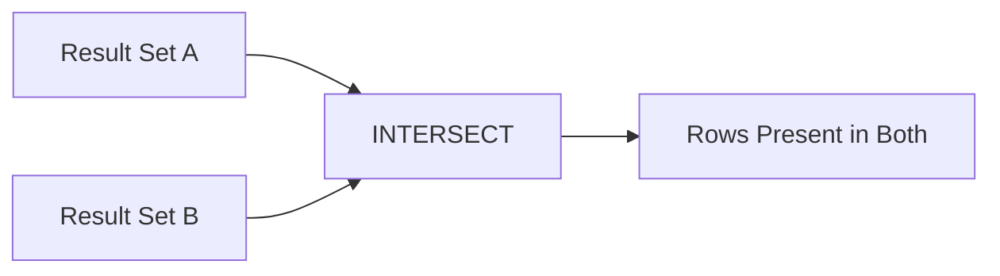
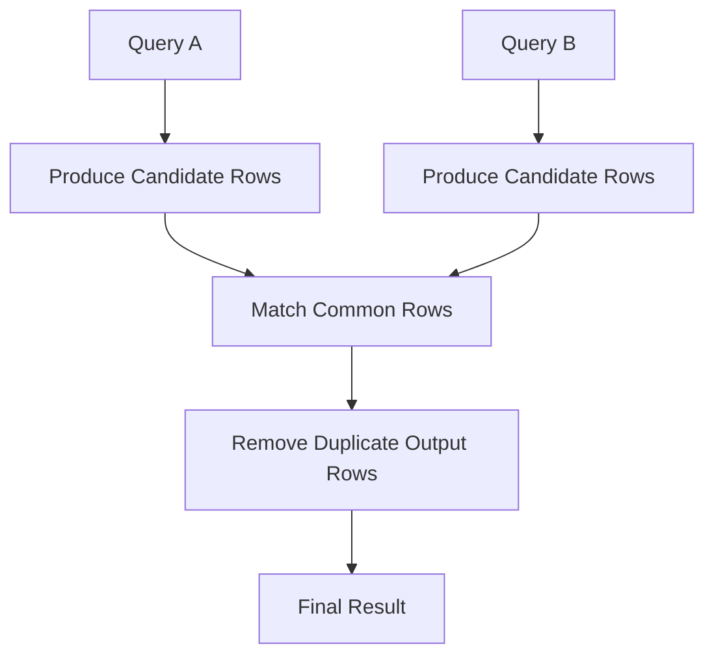
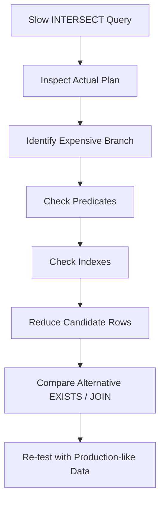

# 04- INTERSECT

## Overview

`INTERSECT` is a SQL set operator that returns only rows that are present in both result sets.

It is useful when the requirement is **set membership across two queries** rather than joining columns or appending rows.

```sql
SELECT customer_id
FROM customers
WHERE status = 'ACTIVE'

INTERSECT

SELECT customer_id
FROM orders
WHERE created_at >= '2026-01-01';
```

The result contains customer IDs that satisfy both conditions:

```text
Active customers
        ∩
Customers with recent orders
        ↓
Customers satisfying both
```

Unlike `UNION ALL`, `INTERSECT` performs duplicate elimination as part of its set semantics. The result represents distinct matching rows.

## Why INTERSECT Exists

Many queries need to answer questions such as:

- Which customers exist in both datasets?
- Which users belong to both groups?
- Which products satisfy both independent filters?
- Which IDs appear in two systems?
- Which records are common between current and historical snapshots?

Without `INTERSECT`, developers often write nested `IN` or `EXISTS` queries.

For example:

```sql
SELECT customer_id
FROM customers
WHERE status = 'ACTIVE'
  AND customer_id IN (
      SELECT customer_id
      FROM orders
      WHERE created_at >= '2026-01-01'
  );
```

The equivalent set-oriented form is:

```sql
SELECT customer_id
FROM customers
WHERE status = 'ACTIVE'

INTERSECT

SELECT customer_id
FROM orders
WHERE created_at >= '2026-01-01';
```

The exact execution plan may differ, but the business intent is often easier to express with `INTERSECT`.

## Set Semantics

Consider two result sets:

```text
A
---
101
102
103
104
```

```text
B
---
103
104
105
106
```

Then:

```sql
A INTERSECT B
```

produces:

```text
103
104
```

Only rows occurring in both inputs survive.

If an input contains duplicates:

```text
A
---
101
101
102
103
```

and:

```text
B
---
101
103
103
```

the `INTERSECT` result is:

```text
101
103
```

The output is distinct.

## UNION, UNION ALL, and INTERSECT

These operators answer different questions.

| Operator | Meaning | Duplicate behavior |
| --- | --- | --- |
| `UNION` | Rows in either result | Removes duplicates |
| `UNION ALL` | All rows from either result | Preserves duplicates |
| `INTERSECT` | Rows common to both results | Returns distinct rows |

Conceptually:



A useful mental model is:

```text
UNION
→ A ∪ B
→ everything in A or B

INTERSECT
→ A ∩ B
→ everything common to A and B

UNION ALL
→ concatenate A and B
→ preserve every input row
```

## Basic Syntax

```sql
SELECT column1, column2
FROM table_a
WHERE condition

INTERSECT

SELECT column1, column2
FROM table_b
WHERE condition;
```

Multiple set operations can be composed:

```sql
SELECT customer_id
FROM customers
WHERE status = 'ACTIVE'

INTERSECT

SELECT customer_id
FROM orders
WHERE total_amount >= 10000

INTERSECT

SELECT customer_id
FROM support_accounts
WHERE risk_level = 'LOW';
```

The resulting customer IDs satisfy all three membership conditions.

## Compatibility Requirements

The participating queries must return compatible result shapes.

| Requirement | Description |
| --- | --- |
| Column count | Both queries must return the same number of expressions |
| Position | Columns are matched by position |
| Data type | Corresponding expressions must be compatible |
| Semantics | Corresponding columns should represent the same concept |

Valid:

```sql
SELECT customer_id
FROM customers

INTERSECT

SELECT customer_id
FROM orders;
```

Invalid because the number of columns differs:

```sql
SELECT customer_id, email
FROM customers

INTERSECT

SELECT customer_id
FROM orders;
```

## Column Matching Is Positional

Set operators match expressions by position, not by column name.

This is dangerous:

```sql
SELECT
    customer_id,
    email
FROM customers

INTERSECT

SELECT
    email,
    customer_id
FROM archived_customers;
```

The database compares:

```text
customer_id ↔ email
email       ↔ customer_id
```

If the types happen to be compatible, the query may execute while producing meaningless results.

Always align the logical meaning of each position.

## Output Column Names

The final column names are normally taken from the first query.

```sql
SELECT
    customer_id AS id
FROM customers

INTERSECT

SELECT
    customer_id AS customer
FROM orders;
```

The resulting column is named:

```text
id
```

Use deliberate aliases in the first query when the result is consumed by application code, views, reporting systems, or downstream pipelines.

## Duplicate Elimination

`INTERSECT` represents set semantics, so duplicate result rows are eliminated.

Suppose:

```text
A
---
101
101
102
```

and:

```text
B
---
101
101
103
```

Then:

```text
A INTERSECT B
```

returns:

```text
101
```

not:

```text
101
101
```

This distinction is important when the input datasets represent occurrences rather than entities.

If every occurrence must be preserved, `INTERSECT` may not express the desired business semantics.

## How INTERSECT Executes

A database must determine which rows from the input queries occur in both sets.

Conceptually:



A database optimizer may implement this using different physical strategies, including:

- Hash-based matching.
- Sort-based matching.
- Merge-based strategies.
- Semi-join transformations.
- Index-assisted access.

Do not assume a specific algorithm from the SQL syntax alone. Inspect the execution plan when performance matters.

## INTERSECT vs JOIN

`INTERSECT` and `JOIN` can both identify matching entities, but their result semantics differ.

### INTERSECT

Returns common rows:

```sql
SELECT customer_id
FROM customers

INTERSECT

SELECT customer_id
FROM orders;
```

Result:

```text
customer_id
-----------
101
102
```

### JOIN

Combines columns from matching rows:

```sql
SELECT
    c.customer_id,
    c.email,
    o.order_id
FROM customers AS c
JOIN orders AS o
    ON o.customer_id = c.customer_id;
```

Result:

```text
customer_id | email           | order_id
------------|-----------------|---------
101         | a@example.com   | 5001
101         | a@example.com   | 5002
102         | b@example.com   | 5003
```

The key distinction:

```text
INTERSECT
→ Which rows are common?

JOIN
→ What related data can I combine?
```

## INTERSECT vs EXISTS

For entity membership, `EXISTS` is often an equivalent and highly useful alternative.

Using `INTERSECT`:

```sql
SELECT customer_id
FROM customers
WHERE status = 'ACTIVE'

INTERSECT

SELECT customer_id
FROM orders
WHERE created_at >= '2026-01-01';
```

Using `EXISTS`:

```sql
SELECT c.customer_id
FROM customers AS c
WHERE c.status = 'ACTIVE'
  AND EXISTS (
      SELECT 1
      FROM orders AS o
      WHERE o.customer_id = c.customer_id
        AND o.created_at >= '2026-01-01'
  );
```

For entity-oriented application queries, `EXISTS` can be clearer because it explicitly states:

> Return this customer if a qualifying order exists.

`INTERSECT` is often clearer when the query naturally consists of two independently defined result sets.

## INTERSECT vs IN

The same requirement can sometimes be expressed using `IN`.

```sql
SELECT customer_id
FROM customers
WHERE status = 'ACTIVE'
  AND customer_id IN (
      SELECT customer_id
      FROM orders
      WHERE created_at >= '2026-01-01'
  );
```

Compared with:

```sql
SELECT customer_id
FROM customers
WHERE status = 'ACTIVE'

INTERSECT

SELECT customer_id
FROM orders
WHERE created_at >= '2026-01-01';
```

The choice should be based on:

- Readability.
- Query shape.
- Optimizer behavior.
- Required columns.
- Database support.
- Application conventions.

Do not assume one syntax is universally faster.

## Practical Customer Example

Suppose an e-commerce platform needs customers who are:

- Active.
- Have placed an order.
- Belong to the loyalty program.

The requirement can be expressed as:

```sql
SELECT customer_id
FROM customers
WHERE status = 'ACTIVE'

INTERSECT

SELECT customer_id
FROM orders

INTERSECT

SELECT customer_id
FROM loyalty_memberships;
```

The output is the intersection of all three datasets.

This can be particularly readable when each query represents an independently meaningful business population.

## INTERSECT with Additional Columns

`INTERSECT` compares the complete projected row, not merely one identifying column.

Consider:

```sql
SELECT
    customer_id,
    email
FROM customers

INTERSECT

SELECT
    customer_id,
    email
FROM newsletter_subscribers;
```

A row only matches when both:

```text
customer_id
AND
email
```

match according to the database's comparison semantics.

This is different from:

```sql
SELECT customer_id
FROM customers

INTERSECT

SELECT customer_id
FROM newsletter_subscribers;
```

which compares only `customer_id`.

If the business definition of identity is `customer_id`, project only that key when determining membership.

## NULL Behavior

`NULL` requires particular attention when reasoning about set operations.

For example:

```sql
SELECT email
FROM customers

INTERSECT

SELECT email
FROM newsletter_subscribers;
```

If both result sets contain `NULL`, SQL set-operation semantics treat the corresponding `NULL` values as matching for duplicate elimination and set comparison purposes.

This differs from ordinary SQL predicates such as:

```sql
WHERE email = NULL
```

which does not evaluate to `TRUE`.

Do not transfer ordinary three-valued comparison intuition directly to set operators.

## INTERSECT and Data Types

Corresponding expressions must have compatible types.

For example:

```sql
SELECT
    CAST(customer_id AS BIGINT) AS customer_id
FROM customers

INTERSECT

SELECT
    customer_id
FROM legacy_orders;
```

Explicit conversion can be useful when schemas evolved independently.

However, repeated conversion is often a signal that the underlying schema contract should be standardized.

Prefer consistent data types across related tables when you control the schema.

## INTERSECT with WHERE Clauses

Each input query can have independent filters:

```sql
SELECT customer_id
FROM customers
WHERE status = 'ACTIVE'
  AND country_code = 'IN'

INTERSECT

SELECT customer_id
FROM orders
WHERE created_at >= '2026-01-01'
  AND total_amount >= 10000;
```

This reads naturally as:

```text
Indian active customers
        ∩
Customers with qualifying orders
```

Keep source-specific predicates inside their respective branches.

## INTERSECT with Aggregation

Aggregation can be performed before or after the set operation depending on the requirement.

For example, find customers who meet an order-count threshold:

```sql
SELECT customer_id
FROM customers
WHERE status = 'ACTIVE'

INTERSECT

SELECT customer_id
FROM orders
GROUP BY customer_id
HAVING COUNT(*) >= 5;
```

The second branch first identifies customers with at least five orders.

The intersection then keeps only those who are also active.

This is often cleaner than joining a large aggregated dataset when the actual requirement is membership.

## INTERSECT for Data Reconciliation

`INTERSECT` is useful during migrations and reconciliation.

Suppose a migration copies customer IDs from an old system into a new system.

To identify IDs present in both:

```sql
SELECT customer_id
FROM legacy_customers

INTERSECT

SELECT customer_id
FROM customers;
```

This identifies common records.

To find records missing from the new system, use `EXCEPT` where supported:

```sql
SELECT customer_id
FROM legacy_customers

EXCEPT

SELECT customer_id
FROM customers;
```

Together:

```text
Legacy
  ├── common with new → INTERSECT
  └── missing in new  → EXCEPT

New
  └── missing in legacy → reverse EXCEPT
```

This makes set operators useful for migration validation and data-quality workflows.

## INTERSECT for Authorization and Access Control

Suppose a system maintains:

```text
users
team_memberships
resource_permissions
```

A reporting or authorization query might determine users belonging to both a team and an allowed population.

For example:

```sql
SELECT user_id
FROM team_memberships
WHERE team_id = @team_id

INTERSECT

SELECT user_id
FROM resource_permissions
WHERE resource_id = @resource_id
  AND permission = 'READ';
```

The result identifies users present in both sets.

For security-critical authorization, however, do not rely solely on application-side set operations. Authorization should be enforced consistently at the database query boundary or service policy layer.

## Multi-Tenant Systems

Tenant boundaries must be explicit.

Unsafe:

```sql
SELECT customer_id
FROM customers
WHERE status = 'ACTIVE'

INTERSECT

SELECT customer_id
FROM orders
WHERE created_at >= @start_date;
```

If the IDs are not globally unique, the query could accidentally intersect records from different tenants.

Safer:

```sql
SELECT tenant_id, customer_id
FROM customers
WHERE tenant_id = @tenant_id
  AND status = 'ACTIVE'

INTERSECT

SELECT tenant_id, customer_id
FROM orders
WHERE tenant_id = @tenant_id
  AND created_at >= @start_date;
```

Including `tenant_id` in the projected identity can make the isolation semantics explicit.

For application-generated SQL:

- Use parameterized values.
- Apply tenant filters consistently.
- Avoid dynamic SQL concatenation.
- Validate authorization independently of user-controlled input.

## Performance Considerations

`INTERSECT` generally costs more than simple concatenation because the database must determine common rows and enforce distinct set semantics.

Potential operations include:

- Hashing.
- Sorting.
- Memory allocation.
- Scanning input datasets.
- Comparing rows.
- Temporary workspace usage.

For example:

```sql
SELECT customer_id
FROM customers

INTERSECT

SELECT customer_id
FROM orders;
```

can be expensive if both tables contain tens of millions of rows.

The important question is whether the underlying queries can efficiently reduce their candidate sets.

## Predicate Pushdown

Filter data as early as possible.

Prefer:

```sql
SELECT customer_id
FROM customers
WHERE status = 'ACTIVE'

INTERSECT

SELECT customer_id
FROM orders
WHERE created_at >= '2026-01-01';
```

over unnecessarily producing huge intermediate datasets and filtering later.

Early filtering can reduce:

```text
Rows scanned
↓
Rows compared
↓
Memory required
↓
CPU required
```

The optimizer may rewrite queries or push predicates where safe, but writing selective predicates in the correct branches makes the intended semantics explicit.

## Indexing

Indexes should support the predicates used by each branch.

For:

```sql
SELECT customer_id
FROM customers
WHERE status = 'ACTIVE'

INTERSECT

SELECT customer_id
FROM orders
WHERE created_at >= '2026-01-01';
```

potentially useful indexes depend on workload and cardinality.

For example:

```text
customers(status, customer_id)
orders(created_at, customer_id)
```

may be useful in some workloads.

Do not blindly create these indexes. Evaluate:

- Selectivity.
- Table size.
- Query frequency.
- Existing indexes.
- Write overhead.
- Actual execution plans.

## Large-Scale Queries

For large datasets, inspect the execution plan.

Look for:

- Full scans.
- Large sorts.
- Hash operations.
- Memory spills.
- Excessive memory grants.
- Poor cardinality estimates.
- Parallel execution.
- Remote scans.
- Expensive expressions.

A useful diagnostic flow is:



Compare equivalent formulations rather than optimizing the set operator in isolation.

## INTERSECT and Query Performance

Do not assume:

```text
INTERSECT = faster
```

or:

```text
EXISTS = faster
```

or:

```text
JOIN = faster
```

The optimizer can transform logically equivalent expressions into similar or completely different physical plans.

Performance depends on:

- Data distribution.
- Cardinality.
- Indexes.
- Statistics.
- Database engine.
- Query shape.
- Available memory.
- Parallelism.
- Result size.

Benchmark important queries using representative production-scale data.

## Ordering

`INTERSECT` does not guarantee result order.

If deterministic ordering is required:

```sql
SELECT customer_id
FROM customers
WHERE status = 'ACTIVE'

INTERSECT

SELECT customer_id
FROM orders
WHERE created_at >= '2026-01-01'

ORDER BY customer_id;
```

The final `ORDER BY` applies to the combined result.

Never depend on physical table order or the order produced by either input query.

## Pagination

If an `INTERSECT` result is exposed through a REST or gRPC API, pagination should be applied to the final result.

For SQL Server:

```sql
SELECT customer_id
FROM customers
WHERE status = 'ACTIVE'

INTERSECT

SELECT customer_id
FROM orders
WHERE created_at >= @start_date

ORDER BY customer_id
OFFSET @offset ROWS
FETCH NEXT @page_size ROWS ONLY;
```

For large datasets, keyset pagination is often preferable to large offsets.

For example:

```sql
...
ORDER BY customer_id
OFFSET @offset ROWS
FETCH NEXT @page_size ROWS ONLY;
```

can become increasingly expensive as `@offset` grows.

A keyset approach can instead use:

```sql
WHERE customer_id > @last_customer_id
```

around the appropriate combined query structure.

## INTERSECT in Backend Services

A backend service may need to determine users satisfying multiple independently maintained populations.

For example:

```text
API request
    ↓
Application service
    ↓
Database
    ├── Active customers
    └── Recent purchasers
             ↓
         INTERSECT
             ↓
      Eligible customers
    ↓
API response
```

This keeps set logic inside the database rather than:

1. Fetching one large list.
2. Fetching another large list.
3. Converting both to Python sets.
4. Intersecting them in application memory.

Application-side intersection can create:

- Additional network transfer.
- Higher application memory usage.
- More latency.
- Larger serialization overhead.
- More complicated consistency behavior.

When the data already lives in the same database, pushing the operation into SQL is usually preferable.

## Python and Application-Side Sets

Python provides an in-memory equivalent:

```python
active_customer_ids = {101, 102, 103}
recent_customer_ids = {102, 103, 104}

eligible_customer_ids = active_customer_ids & recent_customer_ids
```

This is appropriate when:

- The datasets are already in memory.
- They are small enough to fit safely.
- The operation is genuinely application-level.
- Database access is not required.

It is usually inappropriate to retrieve millions of database rows merely to perform an intersection in Python.

A senior backend design question is therefore:

> Where should the set operation execute?

Prefer the database when the source data is already there and the database can execute the operation efficiently.

## Django Considerations

When using Django, set operations should be evaluated based on the generated SQL and database support rather than ORM appearance alone.

For critical query paths:

```python
queryset.explain()
```

can help inspect the database execution plan.

If an ORM abstraction becomes difficult to express or optimize, use an appropriate database-level query strategy while preserving:

- Parameterization.
- Authorization.
- Tenant isolation.
- Test coverage.
- Observability.

Do not move large intersections into Python merely because the ORM expression is inconvenient.

## Common Mistakes

| Mistake | Why It Happens | Better Approach |
| --- | --- | --- |
| Assuming `INTERSECT` preserves duplicates | Confusing it with `UNION ALL` | Remember that `INTERSECT` returns distinct matching rows |
| Matching columns by name | Forgetting positional semantics | Align columns explicitly |
| Comparing unrelated columns | Query remains type-compatible but semantically wrong | Validate column meaning |
| Using `INTERSECT` instead of `JOIN` | Requirement actually needs columns from both tables | Use a join |
| Using `INTERSECT` instead of `EXISTS` | Membership logic is more naturally row-oriented | Compare readability and execution plans |
| Ignoring tenant boundaries | Assuming IDs are globally unique | Include tenant constraints consistently |
| Filtering after huge intermediate results | Candidate sets become unnecessarily large | Push selective predicates into branches |
| Assuming `INTERSECT` is always faster | Treating SQL syntax as execution strategy | Inspect actual plans |
| Relying on output order | Forgetting relational results are unordered | Add final `ORDER BY` |
| Moving large intersections into Python | Avoiding a complex SQL query | Keep data-intensive set operations in the database |

## Production Pitfalls

### Distinctness Can Change Business Meaning

Consider two systems that each record a customer interaction.

```text
System A
customer_id
-----------
101
101

System B
customer_id
-----------
101
```

`INTERSECT` returns:

```text
101
```

It does not communicate that System A recorded two interactions.

If the business requirement is:

> Which customer IDs appear in both systems?

`INTERSECT` is appropriate.

If the requirement is:

> How many interactions occurred across both systems?

`INTERSECT` is the wrong operation.

Use the set operator according to business semantics, not merely because the SQL looks convenient.

### Composite Rows Change the Result

This:

```sql
SELECT customer_id, email
FROM customers

INTERSECT

SELECT customer_id, email
FROM newsletter_subscribers;
```

requires the complete projected row to match.

If the same customer has different email values in each source, the customer may not appear.

If the business identity is only `customer_id`, use:

```sql
SELECT customer_id
FROM customers

INTERSECT

SELECT customer_id
FROM newsletter_subscribers;
```

Then retrieve additional attributes separately if necessary.

### Large Intermediate Results

Even though the final result may be small, both input queries may produce large candidate sets.

For example:

```text
100 million customers
        +
80 million orders
        ↓
INTERSECT
        ↓
10,000 matching customers
```

The final 10,000 rows do not imply that the query is cheap.

Analyze the work required to produce and compare the input sets.

## Reliability Considerations

`INTERSECT` is deterministic in terms of set membership given stable underlying data, but application-level consistency still depends on the database transaction and isolation model.

If the two input queries read rapidly changing data, the observed intersection depends on transaction semantics.

For consistency-sensitive workflows:

- Understand the database isolation level.
- Avoid assuming separate queries executed by the application represent one atomic snapshot.
- Prefer a single database statement when a consistent combined result is required.
- Use explicit transactions where business semantics require them.

For example, this application-side approach:

```text
SELECT active customers
        ↓
network round trip
        ↓
SELECT recent purchasers
        ↓
application intersection
```

can observe different database states.

A single SQL statement can often provide a more coherent database-level operation.

## Security Considerations

`INTERSECT` does not provide authorization by itself.

Every branch must respect the application's security boundary.

For multi-tenant systems:

```sql
SELECT tenant_id, user_id
FROM team_memberships
WHERE tenant_id = @tenant_id
  AND team_id = @team_id

INTERSECT

SELECT tenant_id, user_id
FROM permissions
WHERE tenant_id = @tenant_id
  AND resource_id = @resource_id
  AND permission = 'READ';
```

Use parameterized values rather than string interpolation.

Do not allow user-controlled values to become arbitrary SQL identifiers, expressions, or query fragments.

## Reliability and Migration Validation

`INTERSECT` is particularly useful for validating migrations.

Suppose:

```text
Legacy IDs = 1,000,000
New IDs    =   990,000
```

The intersection tells you how many IDs exist in both:

```sql
SELECT customer_id
FROM legacy_customers

INTERSECT

SELECT customer_id
FROM customers;
```

You can then compare counts and investigate:

```sql
SELECT COUNT(*)
FROM (
    SELECT customer_id
    FROM legacy_customers

    INTERSECT

    SELECT customer_id
    FROM customers
) AS common_customers;
```

This is useful for operational checks, but counts alone are insufficient. Validate important attributes, constraints, and referential relationships as well.

## When to Use INTERSECT

Use `INTERSECT` when:

- You need rows common to multiple independent result sets.
- The business requirement is naturally expressed as set membership.
- Duplicate elimination is desired.
- Multiple independently meaningful populations must overlap.
- You are reconciling datasets.
- You are validating migration overlap.
- You need a clear relational representation of common rows.

Typical examples:

```text
Active customers
∩ Recent purchasers

Employees
∩ Security-cleared users

Legacy IDs
∩ New IDs

Eligible users
∩ Feature-enabled users
```

## When Not to Use INTERSECT

Consider another approach when:

- You need columns from both tables → `JOIN`.
- You need existence for each source row → `EXISTS`.
- You need all rows including duplicates → `UNION ALL` or another aggregation strategy.
- You need records in A but not B → `EXCEPT` or `NOT EXISTS`.
- You need records in either dataset → `UNION`.
- You need to perform the operation on already-loaded small in-memory data → application-level sets may be appropriate.

## Decision Guide

| Requirement | Preferred Approach |
| --- | --- |
| Rows common to two result sets | `INTERSECT` |
| Append all rows | `UNION ALL` |
| Append and remove duplicate rows | `UNION` |
| Related columns from multiple tables | `JOIN` |
| Check whether a related row exists | `EXISTS` |
| Values in A but not B | `EXCEPT` / `NOT EXISTS` |
| Multiple predicates against one table | `WHERE` / `IN` |
| Small datasets already in Python | Python set intersection |
| Large database-resident datasets | Database-level set operation |

## Production Checklist

Before deploying an `INTERSECT` query, verify:

- [ ] Both queries return the same number of columns.
- [ ] Corresponding columns are aligned by logical meaning.
- [ ] Data types are compatible.
- [ ] Duplicate elimination is intentional.
- [ ] The business definition of a matching row is correct.
- [ ] Only necessary columns are projected.
- [ ] Tenant and authorization filters are applied consistently.
- [ ] Selective predicates are pushed into the appropriate branches.
- [ ] Relevant indexes support the source predicates.
- [ ] The actual execution plan has been reviewed for critical workloads.
- [ ] Large intermediate result sets have been considered.
- [ ] Final ordering is explicit when required.
- [ ] Pagination is applied to the final result.
- [ ] Transaction and isolation requirements are understood.
- [ ] Equivalent `EXISTS` or `JOIN` formulations have been considered where appropriate.

## Interview Traps

### Does INTERSECT return duplicates?

No. Standard `INTERSECT` returns distinct rows.

### What does INTERSECT do?

It returns rows that occur in both input result sets.

```text
A ∩ B
```

### Is INTERSECT the same as INNER JOIN?

No.

`INTERSECT` returns common projected rows, while an `INNER JOIN` combines columns from matching rows and can produce multiple rows when one side has multiple matches.

### Is INTERSECT the same as EXISTS?

They can express similar membership requirements, but they are not syntactically or semantically identical in every query shape. Compare the required result columns and execution plans.

### Does INTERSECT compare columns by name?

No. Corresponding expressions are matched by position.

### Does INTERSECT guarantee ordering?

No. Add a final `ORDER BY`.

### What happens when input queries contain duplicates?

Duplicate input rows do not produce duplicate output rows under normal `INTERSECT` semantics.

### When should you use UNION ALL instead?

Use `UNION ALL` when all input rows must be preserved. It is an append operation, whereas `INTERSECT` is a common-membership operation.

### Why can INTERSECT still be expensive?

Both input queries may process large datasets, and the database must determine common rows while enforcing distinct set semantics.

## Key Takeaways

- **`INTERSECT` returns distinct rows that are present in both result sets, making it a natural operator for relational set membership.**
- **Set-operation columns are matched by position, not name, so both result shape and logical column meaning must be aligned.**
- **`INTERSECT` is not interchangeable with `JOIN`, `EXISTS`, or `UNION ALL`; choose based on whether the requirement is common rows, related columns, existence, or row concatenation.**
- **Performance depends on the input queries, indexes, cardinality, and execution plan; compare equivalent formulations rather than assuming one syntax is universally faster.**
- **For production systems, enforce tenant and authorization boundaries in every branch, control large intermediate datasets, and make duplicate and consistency semantics explicit.**