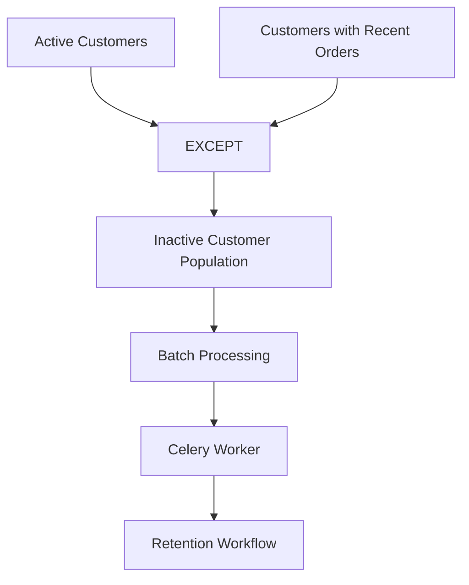

# 05- EXCEPT

## Overview

`EXCEPT` is a SQL set operator that returns rows produced by the first query that are **not present in the second query**.

Conceptually:

```text
A EXCEPT B
    ↓
Rows in A
minus
Rows also present in B
```

It is useful for exclusion, reconciliation, migration validation, data-quality checks, and identifying records that exist in one population but not another.

For example, to find customers in the legacy system who have not yet been migrated:

```sql
SELECT customer_id
FROM legacy_customers

EXCEPT

SELECT customer_id
FROM customers;
```

The result contains IDs present in `legacy_customers` but absent from `customers`.

`EXCEPT` is a set operation, so duplicate rows are eliminated under normal `EXCEPT` semantics.

## Why EXCEPT Exists

Many backend systems need to answer questions such as:

- Which users have not completed onboarding?
- Which legacy records are missing from the new system?
- Which expected permissions are missing?
- Which products exist in one catalog but not another?
- Which IDs appear in an import but not in the database?
- Which customers have not performed a required action?

These requirements can often be expressed as:

```text
Population A
    MINUS
Population B
```

For example:

```sql
SELECT customer_id
FROM customers
WHERE status = 'ACTIVE'

EXCEPT

SELECT customer_id
FROM orders
WHERE created_at >= '2026-01-01';
```

This identifies active customers who do not appear among customers with orders since the specified date.

## Set Semantics

Suppose:

```text
A
---
101
102
103
104
```

and:

```text
B
---
103
104
105
```

Then:

```sql
A EXCEPT B
```

returns:

```text
101
102
```

The operation is directional:

```text
A EXCEPT B
≠
B EXCEPT A
```

Reversing the queries changes the meaning.

```sql
SELECT customer_id
FROM customers

EXCEPT

SELECT customer_id
FROM orders;
```

means:

> Customers that do not appear in orders.

Whereas:

```sql
SELECT customer_id
FROM orders

EXCEPT

SELECT customer_id
FROM customers;
```

means:

> Order customer IDs that do not exist in customers.

The second query can expose referential-integrity problems or orphaned data.

## Set Operators

`EXCEPT` is part of the same family as `UNION`, `UNION ALL`, and `INTERSECT`.

| Operator | Meaning | Duplicate behavior |
| --- | --- | --- |
| `UNION` | Rows in either result set | Removes duplicates |
| `UNION ALL` | All rows from either result set | Preserves duplicates |
| `INTERSECT` | Rows common to both result sets | Removes duplicates |
| `EXCEPT` | Rows in first result but not second | Removes duplicates |

A useful mental model is:

```text
A UNION B
→ A ∪ B
→ everything in either set

A INTERSECT B
→ A ∩ B
→ everything common to both sets

A EXCEPT B
→ A − B
→ everything in A that is not in B

A UNION ALL B
→ append A and B
→ preserve every input row
```

## Basic Syntax

```sql
SELECT column1, column2
FROM table_a
WHERE condition

EXCEPT

SELECT column1, column2
FROM table_b
WHERE condition;
```

The participating queries must produce compatible result shapes.

For example:

```sql
SELECT customer_id
FROM customers
WHERE status = 'ACTIVE'

EXCEPT

SELECT customer_id
FROM blocked_customers;
```

This returns active customer IDs that are not present in the blocked-customer set.

## Compatibility Requirements

Both queries must return compatible projections.

| Requirement | Description |
| --- | --- |
| Column count | Both queries must return the same number of expressions |
| Position | Corresponding expressions are matched by position |
| Data type | Corresponding expressions must be compatible |
| Meaning | Corresponding positions should represent the same logical attribute |

Valid:

```sql
SELECT customer_id
FROM customers

EXCEPT

SELECT customer_id
FROM blocked_customers;
```

Invalid because the number of columns differs:

```sql
SELECT customer_id, email
FROM customers

EXCEPT

SELECT customer_id
FROM blocked_customers;
```

Even when the query executes, logically unrelated columns should never be compared merely because their data types are compatible.

## Positional Column Matching

Set operators compare corresponding expressions by position rather than by column name.

This query is potentially semantically incorrect:

```sql
SELECT
    customer_id,
    email
FROM customers

EXCEPT

SELECT
    email,
    customer_id
FROM archived_customers;
```

The database compares:

```text
customer_id ↔ email
email       ↔ customer_id
```

The fact that the expressions may have compatible types does not make the comparison meaningful.

Keep the logical identity of each projected position consistent:

```sql
SELECT
    customer_id,
    email
FROM customers

EXCEPT

SELECT
    customer_id,
    email
FROM archived_customers;
```

## Output Column Names

The result column names are normally derived from the first query.

```sql
SELECT
    customer_id AS id
FROM customers

EXCEPT

SELECT
    customer_id AS customer
FROM archived_customers;
```

The output column is named:

```text
id
```

For APIs and reporting queries, use deliberate aliases in the first query.

## Duplicate Elimination

Normal `EXCEPT` uses distinct set semantics.

Suppose:

```text
A
---
101
101
102
103
```

and:

```text
B
---
102
```

Then:

```sql
A EXCEPT B
```

returns:

```text
101
103
```

The duplicate `101` is not preserved.

This matters when the input represents events or occurrences rather than unique entities.

If the requirement is:

> Remove every matching occurrence while preserving multiplicity.

ordinary `EXCEPT` is not the right abstraction. Consider whether the database's `EXCEPT ALL` support or an explicit aggregation strategy is required.

## EXCEPT vs NOT EXISTS

A common alternative is `NOT EXISTS`.

Using `EXCEPT`:

```sql
SELECT customer_id
FROM customers
WHERE status = 'ACTIVE'

EXCEPT

SELECT customer_id
FROM orders
WHERE created_at >= '2026-01-01';
```

Equivalent entity-oriented logic can often be expressed as:

```sql
SELECT c.customer_id
FROM customers AS c
WHERE c.status = 'ACTIVE'
  AND NOT EXISTS (
      SELECT 1
      FROM orders AS o
      WHERE o.customer_id = c.customer_id
        AND o.created_at >= '2026-01-01'
  );
```

`NOT EXISTS` often reads more naturally when the requirement is:

> Return each customer for which no qualifying related row exists.

`EXCEPT` can be clearer when the business logic is naturally expressed as subtraction between independently defined result sets.

Do not choose between them based solely on syntax. Compare:

- Query readability.
- Required output columns.
- Null semantics.
- Optimizer behavior.
- Indexes.
- Data distribution.
- Actual execution plans.

## EXCEPT vs NOT IN

Another alternative is `NOT IN`:

```sql
SELECT customer_id
FROM customers
WHERE customer_id NOT IN (
    SELECT customer_id
    FROM orders
    WHERE created_at >= '2026-01-01'
);
```

However, `NOT IN` has important `NULL` semantics.

If the subquery can return `NULL`, the predicate can produce unexpected results because SQL uses three-valued logic.

`NOT EXISTS` generally avoids this particular class of problem because it tests row existence directly.

For production exclusion logic, `NOT EXISTS` is often preferable when the intent is correlated existence.

## EXCEPT vs LEFT JOIN

The same requirement can also be expressed using an anti-join pattern:

```sql
SELECT c.customer_id
FROM customers AS c
LEFT JOIN orders AS o
    ON o.customer_id = c.customer_id
   AND o.created_at >= '2026-01-01'
WHERE c.status = 'ACTIVE'
  AND o.customer_id IS NULL;
```

This can be useful when the query already needs join-based logic.

Conceptually:

```text
EXCEPT
→ subtract one result set

NOT EXISTS
→ keep rows where a matching row does not exist

LEFT JOIN + IS NULL
→ anti-join pattern
```

The database optimizer may transform these into related physical strategies, but this should be verified with execution plans.

## EXCEPT vs INNER JOIN

`EXCEPT` and `INNER JOIN` solve different problems.

`EXCEPT`:

```sql
SELECT customer_id
FROM customers

EXCEPT

SELECT customer_id
FROM blocked_customers;
```

asks:

> Which customer IDs are not blocked?

An `INNER JOIN` asks:

> Which rows have a matching relationship?

For example:

```sql
SELECT
    c.customer_id,
    c.email,
    b.reason
FROM customers AS c
JOIN blocked_customers AS b
    ON b.customer_id = c.customer_id;
```

The join is appropriate because the query needs attributes from both datasets.

## EXCEPT vs INTERSECT

These operations are directional opposites in terms of membership:

```text
A INTERSECT B
→ rows common to both

A EXCEPT B
→ rows in A but not B
```

For example:

```sql
SELECT customer_id
FROM customers

INTERSECT

SELECT customer_id
FROM orders;
```

returns customers that appear in both sets.

```sql
SELECT customer_id
FROM customers

EXCEPT

SELECT customer_id
FROM orders;
```

returns customers that appear in customers but not orders.

Together, these can partition a population:

```text
Customers
├── Customers with orders → INTERSECT
└── Customers without orders → EXCEPT
```

## Practical Backend Example

Suppose an e-commerce service needs to identify active customers who have not placed an order in the last 90 days.

A set-oriented formulation is:

```sql
SELECT customer_id
FROM customers
WHERE status = 'ACTIVE'

EXCEPT

SELECT customer_id
FROM orders
WHERE created_at >= CURRENT_DATE - INTERVAL '90 days';
```

The result can drive a background workflow:



The database performs the population calculation, while the application handles downstream business actions.

## Migration Validation

One of the strongest production use cases for `EXCEPT` is migration verification.

Suppose a customer migration copies data from:

```text
legacy_customers
        ↓
new customers
```

To identify legacy IDs missing from the new system:

```sql
SELECT customer_id
FROM legacy_customers

EXCEPT

SELECT customer_id
FROM customers;
```

An empty result means there are no legacy IDs that are absent from the new dataset, assuming both queries use the same identity definition.

The reverse query detects records in the new system that have no corresponding legacy ID:

```sql
SELECT customer_id
FROM customers

EXCEPT

SELECT customer_id
FROM legacy_customers;
```

This is useful for:

- Migration validation.
- Data reconciliation.
- Backfill verification.
- ETL validation.
- CDC pipeline checks.
- Referential-integrity investigations.

## Data Reconciliation

Consider two services that maintain customer identifiers.

```sql
SELECT customer_id
FROM billing_customers

EXCEPT

SELECT customer_id
FROM identity_customers;
```

This identifies billing records without a corresponding identity record.

The opposite direction:

```sql
SELECT customer_id
FROM identity_customers

EXCEPT

SELECT customer_id
FROM billing_customers;
```

identifies identity records not represented in billing.

For operational reconciliation, persist metrics such as:

```text
missing_in_identity_count
missing_in_billing_count
```

and alert when the counts exceed an expected threshold.

## Finding Missing Records

`EXCEPT` is useful for expected-versus-actual comparisons.

Suppose a deployment should create permissions for every role:

```sql
SELECT role_id
FROM roles
WHERE status = 'ACTIVE'

EXCEPT

SELECT role_id
FROM role_permissions
WHERE permission = 'READ';
```

This identifies active roles that do not have a `READ` permission entry.

This pattern is useful for data-quality checks because the first query defines the expected population and the second defines the observed population.

## Composite Keys

When identity consists of multiple columns, project the complete key.

For example:

```sql
SELECT
    tenant_id,
    customer_id
FROM legacy_customers

EXCEPT

SELECT
    tenant_id,
    customer_id
FROM customers;
```

This is safer than comparing only:

```sql
SELECT customer_id
```

when IDs are only unique within a tenant.

For a multi-tenant system:

```text
(tenant_id, customer_id)
```

is the logical identity.

Using only `customer_id` can produce false matches across tenants.

## NULL Semantics

Set operations have comparison semantics that differ from ordinary SQL predicates.

For example:

```sql
SELECT email
FROM customers

EXCEPT

SELECT email
FROM unsubscribed_customers;
```

If both sets contain `NULL`, the set operation treats matching `NULL` values according to set-comparison semantics rather than behaving like:

```sql
email = NULL
```

which is never `TRUE`.

This distinction is especially important when translating between:

```text
EXCEPT
NOT EXISTS
NOT IN
LEFT JOIN ... IS NULL
```

Do not assume these formulations have identical `NULL` behavior without checking the exact query semantics.

## EXCEPT with Aggregation

Aggregation can be performed independently in each branch.

For example, identify customers with at least one order who are not currently in a premium program:

```sql
SELECT customer_id
FROM orders
GROUP BY customer_id

EXCEPT

SELECT customer_id
FROM premium_memberships;
```

Or define the expected population first:

```sql
SELECT customer_id
FROM orders
GROUP BY customer_id
HAVING COUNT(*) >= 10

EXCEPT

SELECT customer_id
FROM premium_memberships;
```

This can make population-based business rules explicit.

## Filtering Before EXCEPT

Apply source-specific predicates before the set subtraction.

Prefer:

```sql
SELECT customer_id
FROM customers
WHERE status = 'ACTIVE'

EXCEPT

SELECT customer_id
FROM orders
WHERE created_at >= @start_date;
```

rather than generating unnecessarily large result sets.

Conceptually:

```text
Filter A
  ↓
Smaller candidate set

Filter B
  ↓
Smaller exclusion set

      ↓

    EXCEPT
      ↓

Final result
```

Reducing the size of both inputs can lower:

- CPU consumption.
- Memory usage.
- Sorting or hashing work.
- Temporary workspace.
- I/O.

The optimizer can perform predicate pushdown and other transformations, but query structure should still clearly represent the intended filtering.

## Performance Considerations

`EXCEPT` is not inherently cheap.

The database may need to:

1. Execute the first query.
2. Execute the second query.
3. Compare candidate rows.
4. Eliminate duplicates.
5. Produce the final result.

Possible physical strategies include:

- Hash-based set operations.
- Sort-based operations.
- Merge-based strategies.
- Anti-join transformations.
- Index-assisted access.

The exact implementation depends on the database engine and execution plan.

For large datasets, inspect the actual execution plan rather than assuming the set operator itself is the bottleneck.

## Indexing

Indexes should support the predicates and lookup patterns of the underlying queries.

For example:

```sql
SELECT customer_id
FROM customers
WHERE status = 'ACTIVE'

EXCEPT

SELECT customer_id
FROM orders
WHERE created_at >= @start_date;
```

Potential indexes could include:

```text
customers(status, customer_id)
orders(created_at, customer_id)
```

but the correct indexes depend on:

- Selectivity.
- Cardinality.
- Existing indexes.
- Query frequency.
- Write workload.
- Database engine.
- Table size.

Do not create indexes simply because a column appears in a query.

Validate the benefit with actual execution plans and representative workloads.

## Large-Scale Data

Consider a system with:

```text
100 million customers
80 million orders
```

and a final result containing only:

```text
20,000 customers
```

The small output does not mean the query is inexpensive.

The database may still have to process substantial input data.

For large workloads:

- Filter aggressively.
- Project only required columns.
- Maintain accurate statistics.
- Use appropriate indexes.
- Review execution plans.
- Test with production-scale distributions.
- Watch memory and temporary-space consumption.

## EXCEPT and Query Performance

Do not assume one logical formulation is universally faster.

These may all express similar business logic:

```sql
-- EXCEPT
SELECT customer_id
FROM customers
EXCEPT
SELECT customer_id
FROM orders;
```

```sql
-- NOT EXISTS
SELECT c.customer_id
FROM customers AS c
WHERE NOT EXISTS (
    SELECT 1
    FROM orders AS o
    WHERE o.customer_id = c.customer_id
);
```

```sql
-- LEFT JOIN anti-join
SELECT c.customer_id
FROM customers AS c
LEFT JOIN orders AS o
    ON o.customer_id = c.customer_id
WHERE o.customer_id IS NULL;
```

The best-performing query depends on the database engine and workload.

For critical queries:

```text
Equivalent SQL
     ↓
EXPLAIN / actual execution plan
     ↓
Compare I/O + CPU + memory + rows
     ↓
Benchmark representative data
```

## Ordering

`EXCEPT` does not guarantee result order.

If deterministic output is required:

```sql
SELECT customer_id
FROM customers
WHERE status = 'ACTIVE'

EXCEPT

SELECT customer_id
FROM blocked_customers

ORDER BY customer_id;
```

The final `ORDER BY` applies to the combined result.

Never rely on:

- Physical table order.
- Index order without an explicit `ORDER BY`.
- The order of the first query.
- The order in which the database happens to execute branches.

## Pagination

When an `EXCEPT` result is exposed through a REST or gRPC API, pagination should be applied to the final result.

For SQL Server:

```sql
SELECT customer_id
FROM customers
WHERE status = 'ACTIVE'

EXCEPT

SELECT customer_id
FROM blocked_customers

ORDER BY customer_id
OFFSET @offset ROWS
FETCH NEXT @page_size ROWS ONLY;
```

For large result sets, keyset pagination can be preferable to large offsets.

However, because set operators produce a combined result, keyset pagination must be designed around the final ordered result rather than blindly adding a condition to only one branch.

## Backend Service Design

A common architecture is:

```text
REST / gRPC request
        ↓
Application service
        ↓
Database
   ┌────┴────┐
   ↓         ↓
Population A  Population B
   └────┬────┘
        EXCEPT
          ↓
    Missing population
          ↓
    Service processing
          ↓
       Response
```

Keeping the operation in the database can avoid transferring large datasets into Python.

Avoid:

```python
customers = fetch_all_customers()
blocked = fetch_all_blocked_customers()

eligible = set(customers) - set(blocked)
```

for large database-backed populations.

This can cause:

- Excessive network transfer.
- High application memory consumption.
- Increased serialization/deserialization.
- Higher request latency.
- More complicated consistency behavior.

Prefer database-side set operations when the data already resides in the same database.

## Django Considerations

Django applications should evaluate set operations based on generated SQL and actual database behavior.

For performance-sensitive querysets, inspect the generated SQL and execution plan rather than assuming an ORM expression is optimal.

For example:

```python
queryset.explain()
```

can help inspect the database plan for supported query shapes.

If the ORM cannot express the desired operation cleanly, a database-level query can be appropriate, provided that:

- Parameters remain bound safely.
- Authorization is enforced.
- Tenant filtering is preserved.
- Tests cover the result semantics.
- Query performance is measured.

Do not fetch large datasets into Python simply to perform set subtraction because the SQL abstraction is inconvenient.

## Security Considerations

`EXCEPT` does not enforce authorization.

Every branch must respect the same security boundaries.

For a multi-tenant application:

```sql
SELECT tenant_id, user_id
FROM team_memberships
WHERE tenant_id = @tenant_id
  AND team_id = @team_id

EXCEPT

SELECT tenant_id, user_id
FROM suspended_users
WHERE tenant_id = @tenant_id;
```

This makes tenant identity part of the comparison.

Use parameterized values:

```sql
WHERE tenant_id = @tenant_id
```

rather than constructing SQL through string concatenation.

Never allow user-controlled input to become arbitrary SQL expressions or query fragments.

## Reliability Considerations

A single `EXCEPT` statement executes as one database statement, but the consistency of its inputs still depends on transaction and isolation semantics.

For data changing concurrently:

```text
Query A reads state
       +
Query B reads state
       ↓
EXCEPT
```

the database's isolation behavior determines which state is observed.

For consistency-sensitive workflows:

- Understand the database isolation level.
- Prefer one SQL statement when one combined result is required.
- Use explicit transactions where business semantics require them.
- Avoid implementing the equivalent operation as multiple application queries unless weaker consistency is acceptable.

This is particularly important for reconciliation and migration validation.

## Production Monitoring

For recurring reconciliation queries, monitor more than query latency.

Useful metrics include:

- Execution duration.
- Rows scanned.
- Rows returned.
- Database CPU.
- Database I/O.
- Temporary workspace usage.
- Memory pressure.
- Missing-record count.
- Query failure rate.

For example:

```text
legacy_records_missing_in_new_system
```

can be a business-level operational metric.

A sudden increase can indicate:

- Failed ingestion.
- CDC lag.
- Application bugs.
- Migration regressions.
- Referential-integrity problems.

## Migration and Disaster Recovery Workflows

`EXCEPT` can support migration and recovery validation.

For example:

```sql
SELECT id
FROM backup_snapshot

EXCEPT

SELECT id
FROM restored_table;
```

This identifies records present in the expected snapshot but missing after restoration.

For a migration:

```sql
SELECT id
FROM source_table

EXCEPT

SELECT id
FROM target_table;
```

An empty result is evidence that every source ID exists in the target, but it does not prove that all attributes, relationships, constraints, or business state were migrated correctly.

Use additional validation for:

- Row counts.
- Checksums.
- Important attributes.
- Foreign-key relationships.
- Nullability.
- Business invariants.

## Common Mistakes

| Mistake | Why It Happens | Better Approach |
| --- | --- | --- |
| Reversing the queries | Forgetting that `EXCEPT` is directional | Treat `A EXCEPT B` as `A − B` |
| Expecting duplicates | Confusing set subtraction with row-by-row subtraction | Remember normal `EXCEPT` has distinct semantics |
| Using unrelated columns | Focusing on compatible types rather than meaning | Align logical identities |
| Comparing only part of a composite key | Assuming IDs are globally unique | Include the complete logical key |
| Using `NOT IN` without considering `NULL` | Ignoring three-valued logic | Prefer `NOT EXISTS` where appropriate |
| Assuming `EXCEPT` is always faster | Treating syntax as execution strategy | Compare actual execution plans |
| Fetching large datasets into Python | Avoiding SQL set operations | Keep large set operations in the database |
| Filtering after subtraction | Producing unnecessarily large intermediate sets | Push source-specific filters into each branch |
| Assuming output order | Forgetting SQL results are unordered | Add a final `ORDER BY` |
| Treating empty output as complete migration proof | Validating only identifiers | Validate attributes and relationships too |

## Production Pitfalls

### Direction Matters

These queries answer different questions:

```sql
SELECT id
FROM source

EXCEPT

SELECT id
FROM target;
```

means:

> Present in source but missing in target.

While:

```sql
SELECT id
FROM target

EXCEPT

SELECT id
FROM source;
```

means:

> Present in target but missing in source.

For migration validation, both directions are often necessary.

### Distinctness Can Hide Multiplicity

Suppose:

```text
source
------
101
101
101

target
------
101
```

Then:

```sql
SELECT id FROM source
EXCEPT
SELECT id FROM target;
```

returns no rows.

That does **not** mean the occurrence counts are equal.

`EXCEPT` answers a membership question, not a multiplicity question.

If counts matter, compare aggregated counts separately.

### Composite Identity

Consider two tenants:

```text
tenant_id | customer_id
----------|------------
1         | 101
2         | 101
```

Comparing only:

```sql
SELECT customer_id
```

collapses the identity distinction.

Prefer:

```sql
SELECT tenant_id, customer_id
```

when `(tenant_id, customer_id)` defines identity.

### Empty Result Is Not Always Success

An empty result from:

```sql
SELECT id FROM source
EXCEPT
SELECT id FROM target;
```

means:

> No source IDs are absent from target.

It does not prove:

- Attributes are identical.
- Relationships are correct.
- No extra target records exist.
- Business state is correct.
- Event history is complete.

Treat `EXCEPT` as one validation dimension rather than a complete migration verification strategy.

## When to Use EXCEPT

Use `EXCEPT` when:

- You need rows in one result set but not another.
- The requirement is naturally expressed as set subtraction.
- You need migration reconciliation.
- You need to detect missing records.
- You need expected-versus-actual validation.
- You need to identify orphaned identifiers.
- You need a clear relational representation of exclusion.

Typical examples:

```text
Legacy IDs
    −
Migrated IDs

Active users
    −
Suspended users

Expected permissions
    −
Configured permissions

Source records
    −
Target records
```

## When Not to Use EXCEPT

Consider another approach when:

- You need related columns from both datasets → `JOIN`.
- You need to check whether a related row does not exist → `NOT EXISTS`.
- You need to preserve row multiplicity → consider `EXCEPT ALL` where supported or aggregation.
- You need rows common to both datasets → `INTERSECT`.
- You need rows from either dataset → `UNION`.
- You need all rows from both datasets including duplicates → `UNION ALL`.
- You already have small datasets in application memory → application-level set subtraction may be appropriate.

## Decision Guide

| Requirement | Preferred Approach |
| --- | --- |
| Rows in A but not B | `EXCEPT` |
| Related row does not exist | `NOT EXISTS` |
| Anti-join already required | `LEFT JOIN ... IS NULL` |
| Common rows | `INTERSECT` |
| Rows from either set | `UNION` |
| Append every row | `UNION ALL` |
| Related columns from multiple tables | `JOIN` |
| Small data already in Python | Python set difference |
| Large database-resident datasets | Database-side set operation |

## Production Checklist

Before deploying an `EXCEPT` query, verify:

- [ ] The direction of subtraction is correct.
- [ ] Both queries return the same number of columns.
- [ ] Corresponding columns have compatible types.
- [ ] Corresponding columns have the same logical meaning.
- [ ] Duplicate elimination is intentional.
- [ ] Composite identities include all required key columns.
- [ ] Tenant boundaries are enforced.
- [ ] Authorization constraints are respected.
- [ ] Source-specific predicates are pushed into the appropriate branches.
- [ ] Only required columns are projected.
- [ ] Relevant indexes support the underlying predicates.
- [ ] The actual execution plan has been reviewed for critical workloads.
- [ ] Large intermediate result sets have been considered.
- [ ] `NOT EXISTS` and other alternatives have been evaluated where appropriate.
- [ ] `NULL` semantics have been considered.
- [ ] Ordering is explicit when required.
- [ ] Pagination is applied to the final result.
- [ ] Transaction and isolation requirements are understood.
- [ ] Reconciliation metrics and alerts exist for recurring validation jobs.

## Interview Traps

### What does EXCEPT do?

It returns distinct rows present in the first result set but absent from the second.

```text
A EXCEPT B
→ A − B
```

### Is EXCEPT directional?

Yes.

```sql
A EXCEPT B
```

is generally different from:

```sql
B EXCEPT A
```

### Does EXCEPT preserve duplicates?

Normal `EXCEPT` removes duplicate output rows.

### Is EXCEPT the same as NOT EXISTS?

Not exactly. They can express similar exclusion requirements, but their query shapes and semantics differ depending on projected columns and `NULL` behavior.

### Is EXCEPT the same as NOT IN?

No. `NOT IN` has important `NULL` behavior that can make it unsuitable for exclusion queries when the subquery can contain `NULL`.

### Is EXCEPT the same as LEFT JOIN?

Not exactly. A `LEFT JOIN ... IS NULL` is an anti-join pattern that can express similar membership logic, but joins and set operations have different result semantics.

### Does EXCEPT compare columns by name?

No. Corresponding expressions are compared by position.

### Does EXCEPT guarantee ordering?

No. Add a final `ORDER BY`.

### Why can EXCEPT be expensive?

The database may need to process both input datasets, compare candidate rows, and eliminate duplicates. Large inputs can therefore require substantial CPU, I/O, memory, or temporary workspace.

### Can EXCEPT validate a database migration?

Yes, it is useful for identifier-level reconciliation:

```sql
SELECT id FROM source
EXCEPT
SELECT id FROM target;
```

But an empty result does not prove complete migration correctness. Attributes, relationships, counts, and business invariants require additional validation.

## Key Takeaways

- **`EXCEPT` performs directional set subtraction, returning distinct rows present in the first result set but absent from the second.**
- **The order of the queries matters: `A EXCEPT B` and `B EXCEPT A` answer different business questions.**
- **`EXCEPT` is ideal for exclusion and reconciliation, but `NOT EXISTS`, anti-joins, or aggregation may be more appropriate depending on the required semantics.**
- **Performance depends on the size and selectivity of both inputs, indexing, duplicate elimination, and the execution plan; never assume the set operator is inherently fast or slow.**
- **For production reconciliation, account for composite keys, tenant isolation, `NULL` behavior, duplicate semantics, transaction consistency, and the difference between identifier completeness and full data correctness.**