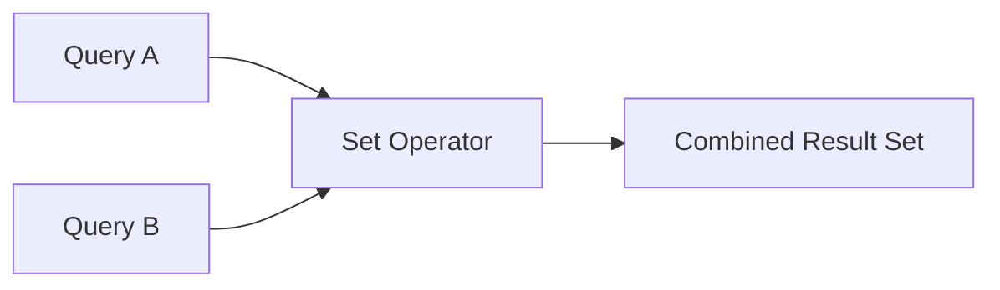
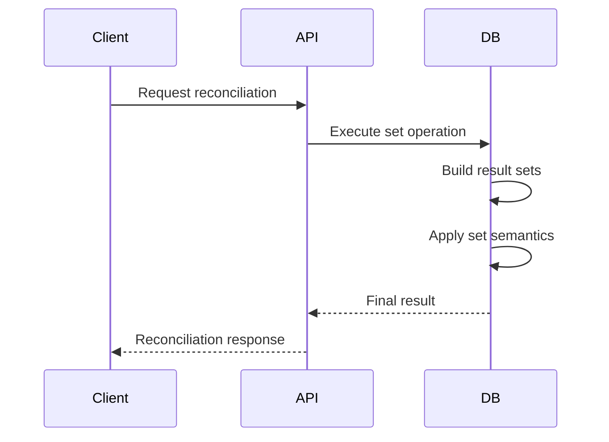
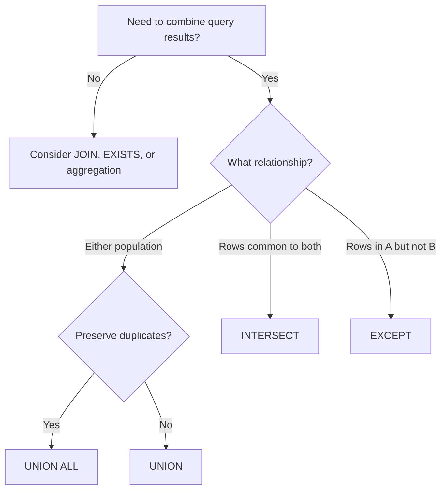

# 06- Set Operator Rules

## Overview

SQL set operators combine the results of two or more compatible queries according to set-based rules. The primary operators are:

- `UNION`
- `UNION ALL`
- `INTERSECT`
- `EXCEPT`

They are useful when a requirement is naturally about **populations of rows** rather than relationships between individual tables.

For example:

```sql
SELECT customer_id
FROM active_customers

EXCEPT

SELECT customer_id
FROM blocked_customers;
```

This expresses:

> Active customers minus blocked customers.

Set operators are powerful, but they have strict rules around result shape, data types, duplicate handling, ordering, `NULL` values, and query scope. Understanding these rules is important because seemingly small mistakes can produce valid SQL with incorrect business semantics.

## Set Operator Model

A set operator combines complete result sets:



The operation is conceptually performed after each participating query produces its result.

```text
Query A → Result A
Query B → Result B
              ↓
        Set operation
              ↓
        Final result
```

The operator determines how rows from those results are combined.

| Operator | Logical operation | Duplicate behavior |
| --- | --- | --- |
| `UNION` | A ∪ B | Removes duplicates |
| `UNION ALL` | Append A and B | Preserves duplicates |
| `INTERSECT` | A ∩ B | Removes duplicates |
| `EXCEPT` | A − B | Removes duplicates |

`UNION ALL` is the only standard operator in this group whose primary semantics preserve duplicate rows.

## Compatible Result Shapes

Every query participating in a set operation must produce compatible result sets.

The most important rules are:

1. Each query must return the same number of columns.
2. Corresponding columns are matched by position.
3. Corresponding expressions must have compatible data types.
4. The expressions should represent the same logical attributes.

Valid:

```sql
SELECT
    customer_id,
    email
FROM customers

UNION

SELECT
    customer_id,
    email
FROM archived_customers;
```

Invalid because the column counts differ:

```sql
SELECT
    customer_id,
    email
FROM customers

UNION

SELECT
    customer_id
FROM archived_customers;
```

The database does not match columns based on their names.

## Positional Matching

Set operators compare column positions.

Consider:

```sql
SELECT
    customer_id,
    email
FROM customers

UNION

SELECT
    email,
    customer_id
FROM archived_customers;
```

The database conceptually matches:

```text
column 1 ↔ column 1
column 2 ↔ column 2
```

Therefore:

```text
customer_id ↔ email
email       ↔ customer_id
```

Even if the database can implicitly convert the values, the query is logically wrong.

Always maintain the same semantic ordering:

```sql
SELECT
    customer_id,
    email
FROM customers

UNION

SELECT
    customer_id,
    email
FROM archived_customers;
```

## Data Type Compatibility

Corresponding expressions need compatible types.

For example:

```sql
SELECT customer_id
FROM customers

UNION

SELECT customer_id
FROM archived_customers;
```

is straightforward when both columns use the same type.

Explicit conversion can make intent clear when the schemas differ:

```sql
SELECT CAST(customer_id AS BIGINT)
FROM legacy_customers

UNION

SELECT customer_id
FROM customers;
```

Do not rely on implicit conversion merely because a database happens to accept the query.

Explicitly define the desired type when:

- Legacy and current schemas differ.
- Numeric precision matters.
- String-to-date conversion is involved.
- Multiple services use different database types.
- A stable API/reporting schema is required.

## Column Names

The final result column names are generally derived from the first query.

```sql
SELECT
    customer_id AS id
FROM customers

UNION

SELECT
    customer_id AS customer_id
FROM archived_customers;
```

The output column is named:

```text
id
```

This makes the first query important when set-operation results feed:

- APIs.
- Views.
- CTEs.
- Reporting queries.
- ORM mappings.
- ETL pipelines.

Use explicit aliases in the first query when the output schema matters.

## Duplicate Semantics

Duplicate handling is one of the most important set-operator rules.

### UNION

`UNION` removes duplicate rows:

```sql
SELECT customer_id
FROM current_customers

UNION

SELECT customer_id
FROM archived_customers;
```

If both inputs contain:

```text
101
102
```

the final result contains each value once.

### UNION ALL

`UNION ALL` preserves duplicates:

```sql
SELECT customer_id
FROM current_customers

UNION ALL

SELECT customer_id
FROM archived_customers;
```

If both contain `101`, the result contains two occurrences of `101`.

### INTERSECT

`INTERSECT` normally returns distinct matching rows:

```sql
SELECT customer_id
FROM customers

INTERSECT

SELECT customer_id
FROM orders;
```

### EXCEPT

`EXCEPT` normally returns distinct rows from the first result that are absent from the second:

```sql
SELECT customer_id
FROM customers

EXCEPT

SELECT customer_id
FROM blocked_customers;
```

## Why Duplicate Elimination Matters

Duplicate removal is not merely a presentation concern.

For large result sets, `UNION`, `INTERSECT`, and `EXCEPT` may require additional work such as:

- Sorting.
- Hashing.
- Memory allocation.
- Temporary workspace.
- Duplicate comparison.

Therefore:

```sql
UNION ALL
```

can be significantly cheaper than:

```sql
UNION
```

when duplicates are known to be valid or impossible.

Do not use `UNION` simply because it "looks safer." Choose duplicate semantics intentionally.

## Operator Direction

`UNION` and `UNION ALL` are symmetric with respect to row membership:

```text
A UNION B
≈
B UNION A
```

However, `INTERSECT` and `EXCEPT` should be treated carefully.

`INTERSECT` is logically symmetric:

```text
A INTERSECT B
≈
B INTERSECT A
```

`EXCEPT` is directional:

```text
A EXCEPT B
≠
B EXCEPT A
```

For example:

```sql
SELECT customer_id
FROM customers

EXCEPT

SELECT customer_id
FROM blocked_customers;
```

means:

> Customers who are not blocked.

Reversing it:

```sql
SELECT customer_id
FROM blocked_customers

EXCEPT

SELECT customer_id
FROM customers;
```

means:

> Blocked customer IDs that do not exist in customers.

## ORDER BY Rules

A set operation produces one final result set. Ordering should therefore normally be applied to the combined result.

Prefer:

```sql
SELECT customer_id
FROM customers

UNION

SELECT customer_id
FROM archived_customers

ORDER BY customer_id;
```

Do not rely on the order produced by an individual branch.

Conceptually:

```text
Query A ─┐
         ├─ Set operation → Final result → ORDER BY
Query B ─┘
```

For complex queries, use parentheses or a CTE when you need to make branch-level ordering or limiting explicit.

## LIMIT and TOP

Pagination and row limiting need careful placement.

A final limit:

```sql
SELECT customer_id
FROM customers

UNION ALL

SELECT customer_id
FROM archived_customers

ORDER BY customer_id
LIMIT 100;
```

limits the combined result.

A branch-specific limit:

```sql
(
    SELECT customer_id
    FROM customers
    ORDER BY customer_id
    LIMIT 100
)

UNION ALL

(
    SELECT customer_id
    FROM archived_customers
    ORDER BY customer_id
    LIMIT 100
);
```

has different semantics because each branch is independently limited.

Do not move `LIMIT`, `TOP`, or similar clauses without verifying that the business meaning remains unchanged.

## Filtering Rules

Each branch can have its own predicates:

```sql
SELECT customer_id
FROM customers
WHERE status = 'ACTIVE'

UNION

SELECT customer_id
FROM archived_customers
WHERE archived_at >= CURRENT_DATE - INTERVAL '1 year';
```

The predicates apply independently.

This is useful when combining different populations:

```text
Current active customers
        +
Recently archived customers
        ↓
Combined customer population
```

For performance, filter each branch as early as possible when the predicate is specific to that branch.

## Projection Rules

Project only the columns required by the final operation.

Prefer:

```sql
SELECT customer_id
FROM customers

EXCEPT

SELECT customer_id
FROM blocked_customers;
```

over:

```sql
SELECT *
FROM customers

EXCEPT

SELECT *
FROM blocked_customers;
```

Explicit projections provide:

- Stable schemas.
- Lower data volume.
- Less comparison work.
- Better readability.
- Reduced risk from schema changes.

`SELECT *` is particularly risky in long-lived set-operation queries because adding a column to one underlying table can break compatibility or alter query semantics.

## Set Operators and NULL

`NULL` requires special attention because SQL predicates use three-valued logic.

For ordinary comparison:

```sql
NULL = NULL
```

does not evaluate to `TRUE`.

Set operations use their own row comparison semantics for determining whether rows are equivalent.

For example:

```sql
SELECT email
FROM customers

INTERSECT

SELECT email
FROM newsletter_subscribers;
```

should not be mentally modeled as simply applying:

```sql
customers.email = newsletter_subscribers.email
```

row by row.

When converting between:

```text
EXCEPT
NOT EXISTS
NOT IN
LEFT JOIN ... IS NULL
```

review `NULL` behavior explicitly.

This is especially important for nullable business identifiers.

## Set Operators and Composite Rows

Set operations compare complete projected rows.

For:

```sql
SELECT
    tenant_id,
    customer_id
FROM customers

EXCEPT

SELECT
    tenant_id,
    customer_id
FROM archived_customers;
```

the logical unit is:

```text
(tenant_id, customer_id)
```

not the individual columns independently.

This matters in multi-tenant systems where:

```text
tenant_id = 1, customer_id = 100
tenant_id = 2, customer_id = 100
```

represent different entities.

Projecting only:

```sql
SELECT customer_id
```

would incorrectly collapse those identities.

## Combining Different Sources

Set operators are useful when the sources have the same logical shape but are stored separately.

For example:

```sql
SELECT
    event_id,
    user_id,
    event_type
FROM current_events

UNION ALL

SELECT
    event_id,
    user_id,
    event_type
FROM archived_events;
```

This can expose a unified logical stream to:

- Reporting queries.
- Analytics.
- ETL jobs.
- Administrative tools.
- Internal APIs.

The physical tables remain separate while the query presents one logical result.

## Set Operators and CTEs

Common table expressions can make complex set logic easier to maintain.

```sql
WITH active_customers AS (
    SELECT customer_id
    FROM customers
    WHERE status = 'ACTIVE'
),
blocked_customers AS (
    SELECT customer_id
    FROM blocked_customers
)
SELECT customer_id
FROM active_customers

EXCEPT

SELECT customer_id
FROM blocked_customers;
```

CTEs are particularly useful when:

- Branches are complex.
- Intermediate populations have meaningful names.
- The same result is referenced multiple times.
- Query logic needs to be reviewed independently.

Do not assume a CTE automatically improves performance. Its optimization behavior depends on the database engine and query.

## Set Operators vs JOINs

Set operators and joins solve different classes of problems.

| Requirement | Typical construct |
| --- | --- |
| Combine compatible populations vertically | Set operator |
| Retrieve related attributes | `JOIN` |
| Find matching entities | `INTERSECT` or `JOIN` |
| Find missing entities | `EXCEPT` or anti-join |
| Append rows while preserving duplicates | `UNION ALL` |
| Combine rows and enrich them with another table | `JOIN` |

For example, use a join when you need attributes from both tables:

```sql
SELECT
    c.customer_id,
    c.email,
    o.order_count
FROM customers AS c
JOIN customer_order_summary AS o
    ON o.customer_id = c.customer_id;
```

A set operation is more appropriate when the result is primarily about membership.

## Set Operators vs Application Logic

Avoid moving large set operations into application memory.

For example, this approach can be problematic:

```python
customers = fetch_all_customer_ids()
blocked = fetch_all_blocked_ids()

eligible = set(customers) - set(blocked)
```

For large datasets, the application may incur:

- High database-to-application network transfer.
- High Python memory usage.
- Serialization overhead.
- Longer request latency.
- More complicated consistency semantics.

Prefer database-side operations when the data already resides in the same database:

```sql
SELECT customer_id
FROM customers

EXCEPT

SELECT customer_id
FROM blocked_customers;
```

Python should generally consume the final result rather than reproduce large relational operations in memory.

## Query Performance

Set operators can have different performance characteristics depending on:

- Input cardinality.
- Duplicate frequency.
- Data distribution.
- Indexes.
- Predicate selectivity.
- Statistics.
- Available memory.
- Temporary storage.
- Database engine.
- Query planner decisions.

For example:

```sql
SELECT id FROM table_a
UNION
SELECT id FROM table_b;
```

may require duplicate elimination.

Where duplicates are semantically valid:

```sql
SELECT id FROM table_a
UNION ALL
SELECT id FROM table_b;
```

avoids that distinctness requirement.

For production queries, inspect the actual execution plan:

```sql
EXPLAIN
SELECT id
FROM table_a

UNION

SELECT id
FROM table_b;
```

Use the database-specific equivalent of `EXPLAIN ANALYZE` or actual execution-plan tooling when safe and appropriate.

## Predicate Pushdown

When filters apply independently to each branch, place them inside the branches.

Prefer:

```sql
SELECT customer_id
FROM customers
WHERE status = 'ACTIVE'

UNION ALL

SELECT customer_id
FROM archived_customers
WHERE archived_at >= @cutoff;
```

rather than creating large unfiltered sets and filtering later.

Benefits can include:

- Fewer rows flowing through the set operation.
- Less memory consumption.
- Less CPU.
- Less I/O.
- Smaller intermediate results.

The optimizer may perform predicate pushdown automatically, but writing clear branch-local predicates makes the intended semantics explicit.

## Indexing

Indexes support the underlying queries, not the abstract set operator itself.

For:

```sql
SELECT customer_id
FROM customers
WHERE status = 'ACTIVE'

EXCEPT

SELECT customer_id
FROM blocked_customers;
```

potentially useful indexes depend on the workload, such as:

```text
customers(status, customer_id)
blocked_customers(customer_id)
```

The correct choice depends on:

- Table size.
- Predicate selectivity.
- Existing indexes.
- Read/write ratio.
- Query frequency.
- Database engine.

Do not create indexes solely because a column appears in a set operation. Validate with actual execution plans and representative data.

## Large Dataset Considerations

A query returning 1,000 rows can still process millions of input rows.

For example:

```text
1,000 output rows
        ↑
50 million source rows
20 million exclusion rows
```

The small final result does not imply a cheap query.

For large set operations:

- Filter early.
- Project only necessary columns.
- Avoid unnecessary `DISTINCT`.
- Prefer `UNION ALL` when duplicate preservation is correct.
- Maintain useful indexes.
- Keep statistics current.
- Monitor temporary-space usage.
- Benchmark using production-scale data.

## Backend API Usage

Set operations can be useful behind REST or gRPC APIs.

For example, an administrative API may need:

> Return user IDs that exist in the identity service database but not in the billing table.

A database-side query:

```sql
SELECT user_id
FROM identity_users

EXCEPT

SELECT user_id
FROM billing_customers;
```

allows the database to perform the large-scale comparison.

The service then returns only the resulting IDs.



For large result sets, use appropriate pagination, limits, asynchronous processing, or export workflows rather than returning millions of rows in one HTTP response.

## Django and ORM Considerations

When using Django, set operations can often be represented through queryset APIs where the database backend supports the required operation.

For example, depending on the queryset shape:

```python
active = Customer.objects.filter(
    status="ACTIVE"
).values_list("customer_id", flat=True)

blocked = BlockedCustomer.objects.values_list(
    "customer_id",
    flat=True,
)

eligible = active.difference(blocked)
```

The important engineering consideration is the generated SQL and database behavior, not the ORM syntax itself.

For performance-sensitive queries:

```python
print(eligible.query)
```

can help inspect generated SQL, and:

```python
eligible.explain()
```

can help inspect the database execution plan where supported.

Avoid materializing large querysets into Python merely to reproduce database set operations.

## Transaction and Consistency Considerations

Set operations are often used for reconciliation and validation, where consistency matters.

Consider:

```text
Read population A
Read population B
Apply set operation
```

If underlying data changes concurrently, the observed result depends on the database's transaction and isolation semantics.

For consistency-sensitive operations:

- Prefer one SQL statement where practical.
- Understand the database isolation level.
- Use transactions when required by the business operation.
- Avoid unnecessarily splitting one logical comparison into multiple application queries.
- Consider replica lag when reading from read replicas.

For example, a migration validation query against a lagging read replica can produce a false impression that records are missing.

## Security and Multi-Tenancy

Set operators do not enforce application authorization.

Every participating query must apply the appropriate security boundary.

For a multi-tenant system:

```sql
SELECT tenant_id, user_id
FROM tenant_users
WHERE tenant_id = @tenant_id

EXCEPT

SELECT tenant_id, user_id
FROM suspended_users
WHERE tenant_id = @tenant_id;
```

The tenant restriction must be applied consistently.

Avoid:

```sql
SELECT tenant_id, user_id
FROM tenant_users

EXCEPT

SELECT tenant_id, user_id
FROM suspended_users
WHERE tenant_id = @tenant_id;
```

if the first branch can expose data belonging to other tenants.

Use parameterized queries for values:

```sql
WHERE tenant_id = @tenant_id
```

Do not construct SQL by concatenating user-controlled input.

## Schema Evolution

Set operations create a dependency between the schemas of participating queries.

Using explicit columns:

```sql
SELECT
    id,
    email
FROM current_users

UNION ALL

SELECT
    id,
    email
FROM archived_users;
```

is safer than:

```sql
SELECT *
FROM current_users

UNION ALL

SELECT *
FROM archived_users;
```

With explicit projections, adding an unrelated column to one table does not unexpectedly change the query's result shape.

This is particularly important for:

- Long-lived views.
- Reporting queries.
- ETL pipelines.
- Data warehouses.
- Production application code.

## Common Mistakes

| Mistake | Why It Happens | Better Approach |
| --- | --- | --- |
| Different column counts | Treating set operators like joins | Ensure identical result shapes |
| Relying on column names | Assuming SQL matches columns semantically | Match by position |
| Using incompatible types | Ignoring conversion rules | Explicitly cast when needed |
| Using `UNION` by default | Assuming duplicate removal is safer | Choose duplicate semantics intentionally |
| Replacing `UNION ALL` with `UNION` | Ignoring performance and multiplicity | Preserve duplicates when they are meaningful |
| Reversing `EXCEPT` | Forgetting directional semantics | Read it as `A − B` |
| Using `SELECT *` | Convenience | Explicitly project required columns |
| Expecting ordering | Assuming execution order is stable | Add final `ORDER BY` |
| Ignoring `NULL` behavior | Treating SQL as two-valued logic | Validate null semantics |
| Comparing incomplete composite keys | Assuming one ID is globally unique | Include the complete logical key |
| Fetching data into Python | Reimplementing database operations | Keep large set operations in SQL |
| Assuming equivalent SQL has identical performance | Ignoring optimizer behavior | Compare actual execution plans |

## Production Pitfalls

### Accidentally Removing Duplicates

Consider:

```sql
SELECT event_id
FROM service_a_events

UNION

SELECT event_id
FROM service_b_events;
```

If duplicate occurrences are meaningful, `UNION` silently removes them.

Use:

```sql
UNION ALL
```

when the requirement is to preserve every occurrence.

### Using EXCEPT for Count Reconciliation

This query:

```sql
SELECT id
FROM source

EXCEPT

SELECT id
FROM target;
```

checks membership, not counts.

If source contains:

```text
101
101
101
```

and target contains:

```text
101
```

`EXCEPT` can return no rows even though occurrence counts differ.

Use aggregation when multiplicity matters.

### Treating Set Operations Like Joins

This:

```sql
SELECT id
FROM customers

INTERSECT

SELECT id
FROM orders;
```

answers a membership question.

If you need:

```text
customer_id
email
order_count
last_order_at
```

a join or aggregated subquery is usually the correct abstraction.

### Relying on Implicit Conversion

A query may execute today because the database implicitly converts one type to another.

That does not guarantee:

- Stable behavior across database engines.
- Desired precision.
- Desired collation.
- Desired date interpretation.
- Good performance.

Make important conversions explicit.

### Ignoring Replica Lag

A reconciliation query against an eventually consistent read replica can produce:

```text
source says record exists
replica says record missing
```

without an actual data-integrity problem.

Use an appropriate consistency model for migration and reconciliation workflows.

### Mixing Tenant Scopes

Set operations can accidentally compare populations from different tenants.

Always make tenant scope explicit when tenant identity is part of the data model.

## Choosing the Correct Set Operator

| Business requirement | Operator |
| --- | --- |
| Combine populations and remove duplicates | `UNION` |
| Append populations and preserve duplicates | `UNION ALL` |
| Find rows common to both populations | `INTERSECT` |
| Find rows in A but not B | `EXCEPT` |
| Retrieve attributes from related rows | `JOIN` |
| Test whether a related row does not exist | `NOT EXISTS` |
| Compare occurrence counts | `GROUP BY` / aggregation |

A practical decision process is:



## Production Checklist

Before deploying a set-operation query, verify:

- [ ] All branches return the same number of columns.
- [ ] Corresponding columns have compatible data types.
- [ ] Column positions have consistent semantic meaning.
- [ ] Explicit casts are used where conversion behavior matters.
- [ ] Duplicate semantics are intentional.
- [ ] `UNION ALL` is used where duplicates are meaningful.
- [ ] `EXCEPT` direction is correct.
- [ ] Composite identities include all required columns.
- [ ] `NULL` semantics have been tested.
- [ ] Explicit projections are used instead of unnecessary `SELECT *`.
- [ ] Branch-specific filters are pushed into the appropriate queries.
- [ ] A final `ORDER BY` is used when deterministic ordering is required.
- [ ] Pagination or result limits apply to the intended result set.
- [ ] Indexes support the underlying predicates.
- [ ] Actual execution plans have been reviewed for critical queries.
- [ ] Large intermediate result sets have been considered.
- [ ] Transaction and isolation requirements are understood.
- [ ] Replica lag has been considered for reconciliation workflows.
- [ ] Tenant and authorization boundaries are enforced in every branch.
- [ ] Schema evolution will not silently change the result shape.
- [ ] Large set operations are performed in the database rather than application memory where appropriate.

## Interview Traps

### Do set operators match columns by name?

No. Corresponding expressions are matched by **position**.

### What is the difference between UNION and UNION ALL?

`UNION` removes duplicate rows. `UNION ALL` preserves them.

### Which is generally cheaper, UNION or UNION ALL?

`UNION ALL` can be cheaper because it does not need to perform duplicate elimination. Actual performance depends on the database engine and workload.

### Is EXCEPT directional?

Yes.

```text
A EXCEPT B
```

means:

```text
A − B
```

Reversing the operands changes the result.

### Does INTERSECT preserve duplicates?

Normal `INTERSECT` uses distinct set semantics and therefore removes duplicate result rows.

### Does EXCEPT compare columns by name?

No. It compares corresponding projected expressions by position.

### Does a set operation guarantee ordering?

No. SQL does not guarantee row order without an explicit final `ORDER BY`.

### Why should SELECT * be avoided?

Because set operations depend on result shape. Schema changes can alter column counts, positions, or types and break or change the query.

### Are EXCEPT and NOT EXISTS always equivalent?

No. They can express similar exclusion requirements, but their result shapes, null semantics, and optimizer behavior can differ.

### Can set operations replace joins?

No. They solve different problems. Set operations combine or compare result populations, while joins combine related rows and can expose attributes from multiple relations.

### Why can UNION be slower than UNION ALL?

`UNION` must enforce distinctness, which can require additional sorting, hashing, memory, or temporary workspace.

### Can an empty EXCEPT result prove a migration succeeded?

No. It can prove that no projected source rows are missing from the target according to that query's semantics. It does not prove attribute equality, relationship correctness, counts, or business invariants.

## Key Takeaways

- **Set operators combine or compare compatible result sets; the four primary operators are `UNION`, `UNION ALL`, `INTERSECT`, and `EXCEPT`.**
- **Corresponding columns are matched by position, must be type-compatible, and should represent the same logical attributes.**
- **Duplicate semantics must be intentional: `UNION`, `INTERSECT`, and `EXCEPT` normally eliminate duplicates, while `UNION ALL` preserves them.**
- **Performance depends on input size, filtering, duplicate elimination, indexing, memory, and the optimizer; use execution plans for production decisions.**
- **For reliable backend systems, account for `NULL` semantics, composite keys, tenant boundaries, schema evolution, transaction isolation, replica lag, and whether the requirement is about membership, relationships, or multiplicity.**