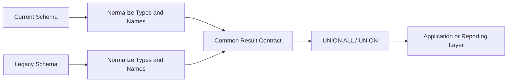

# 07- Column Compatibility Rules

## Overview

Set operators such as `UNION`, `UNION ALL`, `INTERSECT`, and `EXCEPT` combine complete query results. Unlike joins, they do not match columns by name or join rows using a predicate. Corresponding columns are matched **by ordinal position**, and those positions must contain compatible expressions.

For example:

```sql
SELECT
    customer_id,
    email
FROM customers

UNION ALL

SELECT
    customer_id,
    email
FROM archived_customers;
```

Both branches return two columns with the same logical meaning:

```text
Position 1 → customer_id
Position 2 → email
```

Column compatibility is therefore a combination of:

- Same number of output columns.
- Correct positional alignment.
- Compatible data types.
- Compatible type attributes where the database requires them.
- Consistent semantic meaning.

A query can be syntactically valid while still being logically incorrect if columns are placed in the wrong positions or implicitly converted in an undesirable way.

## Why Column Compatibility Matters

Set operations are commonly used to combine:

- Current and historical tables.
- Results from different services or schemas.
- Partitioned datasets.
- Operational and archived records.
- Reporting populations.
- Migration validation results.

These use cases frequently involve schemas that are similar but not identical.

For example:

```sql
SELECT
    customer_id,
    created_at
FROM current_customers

UNION ALL

SELECT
    customer_id,
    created_at
FROM archived_customers;
```

The database needs to determine a common representation for each column position.

If the compatibility rules are misunderstood, failures can range from immediate SQL errors to subtle production data corruption.

## The Core Compatibility Rules

A set operation should satisfy the following contract:

| Rule | Requirement |
| --- | --- |
| Column count | Every branch returns the same number of columns |
| Position | Column `N` in one branch corresponds to column `N` in every other branch |
| Data type | Corresponding expressions must be compatible or coercible |
| Semantics | Corresponding positions should represent the same business attribute |
| Result schema | The combined query exposes one unified column structure |
| Aliases | The first query generally determines output column names |
| Ordering | Ordering applies to the final combined result unless explicitly scoped |

The first two are structural requirements. The semantic rule is an engineering requirement rather than merely a parser requirement.

## Column Count

Every query in a set operation must return the same number of columns.

Valid:

```sql
SELECT
    customer_id,
    email
FROM customers

UNION ALL

SELECT
    customer_id,
    email
FROM archived_customers;
```

Invalid:

```sql
SELECT
    customer_id,
    email
FROM customers

UNION ALL

SELECT
    customer_id
FROM archived_customers;
```

The second query returns only one column.

Most SQL engines reject this during parsing or query analysis.

### Adding a Placeholder Column

When two sources have different schemas, an explicit constant or `NULL` can provide the missing attribute:

```sql
SELECT
    customer_id,
    email,
    created_at
FROM customers

UNION ALL

SELECT
    customer_id,
    email,
    NULL
FROM legacy_customers;
```

However, the `NULL` expression may require an explicit cast depending on the database and surrounding type resolution:

```sql
SELECT
    customer_id,
    email,
    created_at
FROM customers

UNION ALL

SELECT
    customer_id,
    email,
    CAST(NULL AS TIMESTAMP)
FROM legacy_customers;
```

This makes the intended output type explicit.

## Positional Matching

Set operators match expressions by position, not by alias or column name.

Consider:

```sql
SELECT
    customer_id,
    email
FROM customers

UNION ALL

SELECT
    email,
    customer_id
FROM archived_customers;
```

The database sees:

```text
Position 1:
    customer_id ↔ email

Position 2:
    email ↔ customer_id
```

The aliases or underlying column names do not cause automatic semantic matching.

This can be especially dangerous when the database can convert the values successfully.

The query may fail immediately, but it may also execute if the types are compatible.

### The Production Rule

Treat every set-operation branch as implementing the same output contract:

```text
Output Contract
├── position 1 → customer_id
├── position 2 → email
└── position 3 → created_at
```

Every branch must satisfy that contract.

## Column Names and Aliases

Column names do not determine compatibility.

However, the first query generally supplies the names of the final result columns.

```sql
SELECT
    customer_id AS id,
    email AS contact_email
FROM customers

UNION ALL

SELECT
    customer_id,
    email
FROM archived_customers;
```

The combined result is conceptually:

```text
id
contact_email
```

This makes the first branch important when the result is consumed by:

- A view.
- An ORM.
- An API serializer.
- A reporting tool.
- An ETL pipeline.
- Another SQL query.

Use explicit aliases when the output schema is part of an application contract.

## Data Type Compatibility

Corresponding expressions must have compatible data types.

For example:

```sql
SELECT customer_id
FROM customers

UNION ALL

SELECT customer_id
FROM archived_customers;
```

is straightforward when both columns use the same type.

A mismatch can occur when one system uses:

```text
INTEGER
```

and another uses:

```text
BIGINT
```

or when one branch contains:

```text
DATE
```

and another contains:

```text
TIMESTAMP
```

The exact coercion rules vary by database engine.

### Prefer Explicit Conversion When Intent Matters

Instead of depending on implicit coercion:

```sql
SELECT customer_id
FROM legacy_customers

UNION ALL

SELECT customer_id
FROM customers;
```

use an explicit common type when schemas differ:

```sql
SELECT CAST(customer_id AS BIGINT)
FROM legacy_customers

UNION ALL

SELECT CAST(customer_id AS BIGINT)
FROM customers;
```

This makes the output contract visible and reduces dependence on engine-specific type-resolution behavior.

## Type Precedence and Common Types

Many SQL engines determine a common type for corresponding expressions using a type-precedence or type-coercion system.

Conceptually:

```text
Expression A ──┐
               ├──> Type resolution ──> Common output type
Expression B ──┘
```

For example, an engine may be able to combine:

```text
INTEGER
BIGINT
```

using a wider numeric representation.

But conversion is not always harmless.

Potential problems include:

- Precision loss.
- Overflow.
- Truncation.
- Unexpected string conversion.
- Time-zone behavior.
- Different collation behavior.
- Database-specific coercion rules.

For production SQL, do not treat successful implicit conversion as proof that the conversion is correct.

## Numeric Compatibility

Numeric types deserve special attention.

For example:

```sql
SELECT quantity
FROM current_orders

UNION ALL

SELECT quantity
FROM legacy_orders;
```

Suppose one branch contains `INTEGER` and the other `BIGINT`.

An explicit common type makes the contract clearer:

```sql
SELECT CAST(quantity AS BIGINT) AS quantity
FROM current_orders

UNION ALL

SELECT CAST(quantity AS BIGINT) AS quantity
FROM legacy_orders;
```

For decimal values, precision and scale are also important:

```text
DECIMAL(p, s)
```

Do not casually convert financial values to floating-point types.

For monetary calculations, preserve an appropriate exact numeric representation.

## String Compatibility

String types may appear compatible while still having meaningful differences.

Depending on the database, relevant attributes can include:

- Maximum length.
- Character set.
- Collation.
- Fixed vs variable length.
- Binary vs textual representation.

For example:

```sql
SELECT email
FROM customers

UNION ALL

SELECT email
FROM archived_customers;
```

may be straightforward when both columns use equivalent text definitions.

If different collations or character semantics are involved, the database may reject the query or apply a collation-resolution rule.

When collation affects correctness, specify it explicitly according to the target database.

## Date and Time Compatibility

Date/time values are a common source of subtle bugs.

For example:

```sql
SELECT created_at
FROM current_orders

UNION ALL

SELECT created_at
FROM archived_orders;
```

The branches might use different representations:

```text
DATE
TIMESTAMP
TIMESTAMP WITH TIME ZONE
```

These types are not interchangeable from a business perspective.

A timestamp with time-zone semantics can represent an instant, while a date represents a calendar date without a time component.

When normalizing:

```sql
SELECT CAST(created_at AS TIMESTAMP) AS created_at
FROM current_orders

UNION ALL

SELECT CAST(created_at AS TIMESTAMP) AS created_at
FROM archived_orders;
```

ensure that the conversion does not discard information required by the application.

For distributed systems, standardize timestamp semantics explicitly, commonly using UTC-based instants.

## NULL Compatibility

`NULL` has no inherent concrete data type in the same sense as a normal typed column value. The database must infer or resolve its type from context.

This is why explicit casting is often preferable:

```sql
SELECT
    customer_id,
    CAST(NULL AS TIMESTAMP) AS deleted_at
FROM active_customers;
```

rather than:

```sql
SELECT
    customer_id,
    NULL AS deleted_at
FROM active_customers;
```

The explicit version documents the intended result schema.

This is particularly useful when the query is part of:

- A view.
- An ETL pipeline.
- A union across heterogeneous sources.
- A migration.
- A long-lived reporting query.

## Expressions Must Also Be Compatible

Compatibility applies to expressions, not only physical columns.

Valid:

```sql
SELECT
    customer_id,
    UPPER(email)
FROM customers

UNION ALL

SELECT
    customer_id,
    email
FROM archived_customers;
```

The second expression in both branches produces a compatible textual result.

Explicit casting can make the contract clearer:

```sql
SELECT
    CAST(customer_id AS BIGINT),
    CAST(UPPER(email) AS VARCHAR(320))
FROM customers

UNION ALL

SELECT
    CAST(customer_id AS BIGINT),
    CAST(email AS VARCHAR(320))
FROM archived_customers;
```

The important point is that the set operator works on the **result of the expressions**, not on their source columns.

## Semantic Compatibility

Type compatibility is not enough.

Consider:

```sql
SELECT
    customer_id,
    email
FROM customers

UNION ALL

SELECT
    employee_id,
    email
FROM employees;
```

The query may be structurally valid, but the first column now represents two different business concepts:

```text
customer_id
employee_id
```

A senior engineer should distinguish:

```text
SQL compatibility
        ≠
Business compatibility
```

The correct question is:

> Does each column position represent the same logical attribute in every branch?

If not, the set operation is probably expressing the wrong abstraction.

## Normalizing Heterogeneous Schemas

Set operators are often used to create a common schema over legacy and modern data.

Suppose the current system stores:

```text
customer_id BIGINT
email       VARCHAR
created_at  TIMESTAMP
```

while a legacy system stores:

```text
customer_id INTEGER
email       TEXT
created_at  DATE
```

Normalize both branches:

```sql
SELECT
    CAST(customer_id AS BIGINT) AS customer_id,
    CAST(email AS VARCHAR(320)) AS email,
    CAST(created_at AS TIMESTAMP) AS created_at
FROM current_customers

UNION ALL

SELECT
    CAST(customer_id AS BIGINT) AS customer_id,
    CAST(email AS VARCHAR(320)) AS email,
    CAST(created_at AS TIMESTAMP) AS created_at
FROM legacy_customers;
```

This is preferable when the combined result becomes an explicit application-level data contract.

## Schema Normalization Pattern

A useful production pattern is:



Each branch should first be transformed into a known schema.

Then the set operator combines those normalized results.

This reduces the risk of allowing the database's implicit coercion rules to define application behavior.

## Explicit Casting Strategy

When explicit conversion is required, cast both sides to the intended output type:

```sql
SELECT
    CAST(customer_id AS BIGINT) AS customer_id
FROM source_a

UNION ALL

SELECT
    CAST(customer_id AS BIGINT) AS customer_id
FROM source_b;
```

This is often preferable to casting only one branch:

```sql
SELECT
    CAST(customer_id AS BIGINT)
FROM source_a

UNION ALL

SELECT
    customer_id
FROM source_b;
```

Casting both sides documents the invariant:

```text
Final customer_id type = BIGINT
```

It also makes future schema changes easier to reason about.

## Column Compatibility with Computed Values

A branch can construct a value that does not physically exist as a column.

For example:

```sql
SELECT
    customer_id,
    'CURRENT' AS source
FROM customers

UNION ALL

SELECT
    customer_id,
    'ARCHIVED' AS source
FROM archived_customers;
```

Both branches now implement:

```text
customer_id
source
```

This is useful for:

- Provenance.
- Data migration reports.
- Auditing.
- Debugging.
- Reconciliation.

The literal values must still resolve to compatible types.

## Conditional Expressions

Conditional expressions can also require explicit typing.

For example:

```sql
SELECT
    customer_id,
    CASE
        WHEN status = 'ACTIVE' THEN 'current'
        ELSE 'inactive'
    END AS lifecycle
FROM customers

UNION ALL

SELECT
    customer_id,
    'archived' AS lifecycle
FROM archived_customers;
```

The result of the `CASE` expression must be compatible with the corresponding expression in the other branch.

When multiple branches have different expression types, explicitly cast the final expressions when necessary.

## Composite Compatibility

Set operations compare complete rows.

Consider:

```sql
SELECT
    tenant_id,
    customer_id
FROM current_customers

EXCEPT

SELECT
    tenant_id,
    customer_id
FROM archived_customers;
```

The logical row is:

```text
(tenant_id, customer_id)
```

Both columns are required to preserve tenant-scoped identity.

If the query instead uses:

```sql
SELECT customer_id
FROM current_customers

EXCEPT

SELECT customer_id
FROM archived_customers;
```

two different tenants with the same `customer_id` can become indistinguishable.

Column compatibility therefore includes **identity completeness**, not merely data type correctness.

## Compatibility and Views

A set operation inside a view becomes a schema contract.

Example:

```sql
CREATE VIEW all_customers AS
SELECT
    customer_id,
    email,
    created_at
FROM customers

UNION ALL

SELECT
    customer_id,
    email,
    created_at
FROM archived_customers;
```

Downstream queries may depend on:

```text
customer_id
email
created_at
```

Explicit projections are therefore safer than:

```sql
SELECT *
```

because schema changes to the underlying tables should not unexpectedly alter the view's output shape.

For long-lived database interfaces, treat the set-operation projection as an API contract.

## Compatibility and Schema Evolution

Schema evolution is a major production concern.

Suppose:

```sql
SELECT *
FROM current_customers

UNION ALL

SELECT *
FROM archived_customers;
```

Initially both tables contain:

```text
id
email
created_at
```

Later, one table gains:

```text
marketing_opt_in
```

The set operation can now fail because the column counts differ, or the output contract can change in undesirable ways depending on how the schemas evolved.

Prefer:

```sql
SELECT
    id,
    email,
    created_at
FROM current_customers

UNION ALL

SELECT
    id,
    email,
    created_at
FROM archived_customers;
```

This decouples the query's output contract from unrelated schema additions.

## Performance Implications

Compatibility itself is not usually the primary performance concern, but conversions can affect query execution.

For example:

```sql
SELECT CAST(customer_id AS VARCHAR)
FROM customers

UNION ALL

SELECT customer_id
FROM archived_customers;
```

may require conversion of a large number of rows.

Potential consequences include:

- CPU overhead.
- Larger intermediate values.
- Additional memory usage.
- More expensive sorting or hashing for distinct set operations.
- Reduced index usefulness in expressions.
- Additional temporary storage.

The cost becomes particularly important with:

```sql
UNION
INTERSECT
EXCEPT
```

because these operators may need duplicate elimination or row comparison.

When performance matters, normalize data types at the schema boundary rather than repeatedly converting millions of rows at query time.

## Indexes and Conversion

Consider:

```sql
SELECT customer_id
FROM customers
WHERE customer_id = 100;
```

versus a query that applies a conversion to a stored column:

```sql
SELECT customer_id
FROM customers
WHERE CAST(customer_id AS VARCHAR(20)) = '100';
```

The second form can prevent efficient use of an index depending on the database and available indexes.

For set-operation branches, prefer:

```sql
SELECT CAST(customer_id AS BIGINT)
FROM customers
WHERE customer_id = 100;
```

when the stored column can already be filtered in its native type.

General rule:

> Filter using the stored type whenever possible; convert projected values after filtering when practical.

Always validate with the database's execution plan.

## Backend Service Integration

Set-operation output frequently crosses service boundaries.

For example:

```text
PostgreSQL
    ↓
SQL set operation
    ↓
Unified result schema
    ↓
Django / FastAPI service
    ↓
Pydantic / serializer
    ↓
REST or gRPC response
```

The SQL projection should align with the service's expected data model.

For example, if the API expects:

```python
class CustomerRecord:
    customer_id: int
    email: str
    created_at: datetime
```

the SQL branches should consistently produce those logical types.

This reduces conversion logic in application code and prevents different branches from producing subtly different representations.

## Testing Column Compatibility

For production queries, test both structural and semantic compatibility.

### Structural Tests

Verify:

- Same number of columns.
- Correct column order.
- Expected output names.
- Expected output types.
- Expected nullability where relevant.

### Semantic Tests

Verify:

- Each position represents the same business attribute.
- Composite identifiers remain complete.
- No unintended data truncation occurs.
- Date/time semantics remain consistent.
- Numeric precision is preserved.
- Tenant boundaries are maintained.

A useful migration test is:

```sql
SELECT
    customer_id,
    email,
    created_at
FROM legacy_customers

EXCEPT

SELECT
    customer_id,
    email,
    created_at
FROM migrated_customers;
```

This checks whether projected rows exist in the target population, but it does not prove that all possible data-integrity invariants are satisfied.

## Common Mistakes

| Mistake | Why It Happens | Better Approach |
| --- | --- | --- |
| Different column counts | Treating branches independently | Define one output contract |
| Matching by column name | Confusing set operations with joins | Match columns by position |
| Wrong column order | Copying projections without review | Keep semantic ordering identical |
| Relying on implicit conversion | Assuming successful SQL means correct SQL | Explicitly cast important types |
| Casting only one side | Leaving the result type implicit | Cast both branches to the intended type |
| Using incompatible business attributes | Focusing only on SQL types | Validate semantic compatibility |
| Using `SELECT *` | Convenience | Explicitly project required columns |
| Ignoring `NULL` typing | Assuming `NULL` automatically has the desired type | Cast `NULL` explicitly when useful |
| Losing timezone information | Treating date/time types as interchangeable | Define timestamp semantics explicitly |
| Losing numeric precision | Converting financial values casually | Preserve exact numeric types |
| Omitting tenant identity | Assuming IDs are globally unique | Include the complete logical key |
| Converting large datasets unnecessarily | Normalizing at query time | Normalize schema types at boundaries |
| Ignoring schema evolution | Treating query shape as temporary | Treat projections as stable contracts |

## Production Best Practices

### Define the Output Contract First

Before writing the set operation, write down the intended result:

```text
customer_id → BIGINT
email       → VARCHAR
created_at  → TIMESTAMP
```

Then make every branch produce that contract.

### Prefer Explicit Projections

Use:

```sql
SELECT
    customer_id,
    email,
    created_at
FROM current_customers
```

instead of:

```sql
SELECT *
FROM current_customers
```

This makes schema dependencies visible.

### Prefer Explicit Casts for Important Boundaries

Use explicit casts when:

- Combining legacy and modern schemas.
- Defining views.
- Producing API-facing results.
- Preserving numeric precision.
- Normalizing date/time semantics.
- Combining heterogeneous data sources.

### Preserve Semantic Identity

A compatible set operation should answer:

> Does each output position represent the same thing in every branch?

Do not accept type compatibility as sufficient evidence.

### Keep Filtering Native

Where practical:

```sql
SELECT CAST(customer_id AS BIGINT)
FROM customers
WHERE status = 'ACTIVE';
```

is preferable to converting first and filtering on the converted representation.

### Validate Production-Scale Performance

For important queries, inspect:

```sql
EXPLAIN
SELECT
    CAST(customer_id AS BIGINT)
FROM customers

UNION ALL

SELECT
    CAST(customer_id AS BIGINT)
FROM archived_customers;
```

Use the database's execution-analysis tooling against representative data before making performance conclusions.

## Interview Traps

### Are columns matched by name?

No. They are matched by **position**.

### Can two branches use different column names?

Yes, as long as the result shapes and types are compatible. The first query generally determines the output column names.

### Is the same number of columns sufficient?

No. Data types and, more importantly, semantic meaning must also be compatible.

### Can a set operation combine an `INTEGER` and `BIGINT`?

Many databases can resolve a common numeric type, but the exact coercion behavior is database-specific. Use explicit casts when the desired result type matters.

### Why is `SELECT *` dangerous?

Because set operations depend on column count and position. Schema changes can silently invalidate or alter the query.

### Does `NULL` automatically have the desired type?

Not necessarily. Its type is resolved from context. Explicitly casting `NULL` is often clearer and more portable across complex queries.

### Can columns with compatible types represent incompatible data?

Yes.

```text
customer_id INTEGER
employee_id INTEGER
```

are type-compatible but may be semantically incompatible.

### Why cast both branches?

It makes the intended output type explicit and prevents the database's implicit type-resolution rules from becoming the application's contract.

### Does explicit casting always improve performance?

No. Casting can add CPU work and may interfere with index usage when applied to filtered columns. Use casts deliberately and inspect execution plans for performance-sensitive queries.

### Are `DATE` and `TIMESTAMP` interchangeable?

No. They represent different information. Converting from a timestamp to a date can discard time information.

## Key Takeaways

- **Set-operation columns are matched by position, not by name, so every branch must implement the same output schema and semantic ordering.**
- **Equal column counts are necessary but insufficient; corresponding expressions must have compatible types and represent the same business attributes.**
- **Use explicit casts when type resolution, precision, date/time semantics, or API/view contracts matter rather than relying on implicit conversion.**
- **Avoid `SELECT *`, preserve complete logical keys, and treat set-operation projections as stable contracts that must survive schema evolution.**
- **For production workloads, normalize types deliberately, avoid unnecessary conversions on filtered columns, and validate performance with representative execution plans.**