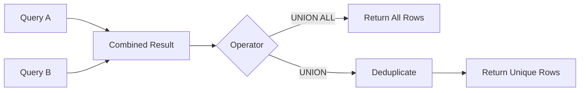

# 08- UNION vs UNION ALL

## Overview

`UNION` and `UNION ALL` combine the result sets of two or more compatible `SELECT` statements into a single result.

The fundamental difference is duplicate handling:

| Operator | Combines rows | Removes duplicates | Typical cost |
| --- | --- | --- | --- |
| `UNION` | Yes | Yes | Higher |
| `UNION ALL` | Yes | No | Lower |

The distinction is not merely syntactic. It affects:

- Result correctness.
- CPU and memory consumption.
- Sorting or hashing.
- Query latency.
- Intermediate result size.
- Database resource utilization.
- Application semantics.

For production backend systems, the default should generally be **`UNION ALL` when duplicate preservation is intentional**, and `UNION` only when duplicate elimination is part of the business requirement.

## What Both Operators Have in Common

Both operators concatenate compatible query results vertically.

```sql
SELECT
    customer_id,
    email
FROM customers

UNION ALL

SELECT
    customer_id,
    email
FROM archived_customers;
```

Conceptually:

```text
Query A
┌─────────────┬──────────────────┐
│ customer_id │ email            │
├─────────────┼──────────────────┤
│ 101         │ a@example.com    │
│ 102         │ b@example.com    │
└─────────────┴──────────────────┘

Query B
┌─────────────┬──────────────────┐
│ customer_id │ email            │
├─────────────┼──────────────────┤
│ 102         │ b@example.com    │
│ 103         │ c@example.com    │
└─────────────┴──────────────────┘

UNION ALL
        ↓

┌─────────────┬──────────────────┐
│ customer_id │ email            │
├─────────────┼──────────────────┤
│ 101         │ a@example.com    │
│ 102         │ b@example.com    │
│ 102         │ b@example.com    │
│ 103         │ c@example.com    │
└─────────────┴──────────────────┘
```

With `UNION`, the duplicate row is removed.

## UNION

### What It Is

`UNION` combines result sets and removes duplicate rows from the combined result.

```sql
SELECT
    customer_id,
    email
FROM customers

UNION

SELECT
    customer_id,
    email
FROM archived_customers;
```

If both branches produce:

```text
102 | b@example.com
```

the final result contains that row once.

### Why It Exists

`UNION` is useful when the combined result represents a **set of unique rows**.

Typical use cases include:

- Combining overlapping populations.
- Producing a unique list of identifiers.
- Deduplicating results from multiple sources.
- Comparing datasets.
- Building reporting populations where duplicates have no meaning.

### How Duplicate Elimination Works

Conceptually, the database performs:

```text
Query A ──┐
          ├──> Combine ──> Duplicate elimination ──> Result
Query B ──┘
```

The optimizer may implement duplicate elimination using mechanisms such as:

- Sorting.
- Hash-based aggregation.
- Other database-specific set operations.

The exact execution strategy is database- and plan-dependent.

### Advantages

- Guarantees duplicate rows are removed.
- Expresses set semantics directly.
- Avoids requiring a separate outer `DISTINCT` in many cases.
- Useful when source datasets overlap.

### Limitations

- Usually more expensive than `UNION ALL`.
- Requires comparing rows for equality.
- May require additional CPU and memory.
- Can require sorting or hashing.
- Duplicate removal can become expensive for large result sets.

## UNION ALL

### What It Is

`UNION ALL` concatenates result sets without removing duplicates.

```sql
SELECT
    customer_id,
    email
FROM customers

UNION ALL

SELECT
    customer_id,
    email
FROM archived_customers;
```

Every row produced by every branch is retained.

### Why It Exists

`UNION ALL` is appropriate when:

- Duplicates are meaningful.
- The source datasets are mutually exclusive.
- Deduplication is unnecessary.
- Maximum throughput is preferred.
- The query is part of an ingestion or reporting pipeline.

For large datasets, this is often the more efficient choice because the database does not need to perform global duplicate elimination.

### Advantages

- Usually faster than `UNION`.
- Lower CPU overhead.
- Lower memory requirements.
- Preserves row multiplicity.
- Suitable for large analytical and ETL workloads.
- Avoids unnecessary sorting or hashing for deduplication.

### Limitations

- Duplicate rows remain.
- Incorrect use can inflate counts.
- Downstream aggregations may become incorrect.
- Application-level assumptions about uniqueness can be violated.

## Direct Comparison

| Characteristic | `UNION` | `UNION ALL` |
| --- | --- | --- |
| Combines result sets | Yes | Yes |
| Removes duplicate rows | Yes | No |
| Preserves duplicates | No | Yes |
| Usually faster | No | Yes |
| Requires duplicate comparison | Yes | No |
| Additional memory may be required | Often | Usually less |
| Suitable for mutually exclusive sources | Yes | Yes |
| Suitable for overlapping sources | Yes | Only if duplicates are meaningful |
| Best for large append-style workloads | Usually no | Usually yes |
| Expresses uniqueness requirement | Yes | No |

## The Most Important Question

Do not choose between the operators based only on performance.

Ask:

> **Does a duplicate row represent the same logical fact, or does it represent another occurrence?**

If duplicates represent separate events, `UNION ALL` is usually correct.

If duplicate rows represent the same logical entity and only one occurrence should appear, `UNION` may be appropriate.

## Example: Current and Archived Data

Suppose an application stores current orders and archived orders separately.

If the tables are guaranteed to contain mutually exclusive records:

```sql
SELECT
    order_id,
    customer_id,
    total_amount
FROM current_orders

UNION ALL

SELECT
    order_id,
    customer_id,
    total_amount
FROM archived_orders;
```

`UNION ALL` is preferable because duplicate elimination provides no business value.

If records can overlap during an archival migration:

```sql
SELECT
    order_id,
    customer_id,
    total_amount
FROM current_orders

UNION

SELECT
    order_id,
    customer_id,
    total_amount
FROM archived_orders;
```

`UNION` may be appropriate if identical rows represent the same logical order.

However, if `order_id` is the true identity, an explicit deduplication strategy based on that key may be more correct than relying on full-row equality.

## Full-Row Equality Matters

`UNION` removes duplicate **rows**, not duplicate entities based on a chosen business key.

Consider:

```text
order_id | status
---------|--------
1001     | PAID
1001     | SHIPPED
```

These are different rows.

Therefore:

```sql
SELECT order_id, status
FROM orders_a

UNION

SELECT order_id, status
FROM orders_b;
```

does not reduce them to one `order_id`.

If the requirement is:

> Return each order ID once.

then the query should reflect that requirement explicitly:

```sql
SELECT order_id
FROM orders_a

UNION

SELECT order_id
FROM orders_b;
```

or, when more columns are required, use a deliberate key-based deduplication strategy appropriate to the database.

## UNION Is Not the Same as DISTINCT on One Column

This distinction is important:

```sql
SELECT
    customer_id,
    email
FROM customers

UNION

SELECT
    customer_id,
    email
FROM archived_customers;
```

removes duplicate combinations of:

```text
(customer_id, email)
```

It does not mean:

```text
one row per customer_id
```

For example:

```text
101 | old@example.com
101 | new@example.com
```

are different rows.

The database considers them distinct because the complete rows differ.

## Performance Model

The major performance difference can be expressed conceptually as:



`UNION ALL` can often stream or append rows from the input branches without a global duplicate-elimination phase.

`UNION` needs to establish which combined rows are duplicates.

For large datasets:

```text
UNION ALL
Input rows
    ↓
Append/concatenate
    ↓
Output

UNION
Input rows
    ↓
Append/concatenate
    ↓
Sort or hash / equivalent deduplication
    ↓
Unique output
```

The exact physical plan depends on the database optimizer.

## Why UNION Can Be Expensive

Suppose two branches each produce 10 million rows.

With `UNION ALL`, the database may be able to produce approximately 20 million output rows without comparing every row against the others for duplicate elimination.

With `UNION`, the database must determine which rows are equivalent.

Potential costs include:

- CPU for hashing or comparison.
- Memory for hash structures.
- Memory for sorting.
- Temporary disk I/O when memory is insufficient.
- Increased execution latency.

The actual cost depends heavily on:

- Row width.
- Number of rows.
- Cardinality.
- Data distribution.
- Database engine.
- Available memory.
- Execution plan.
- Parallel execution capabilities.

## Query Plan Considerations

For a performance-sensitive query, inspect the execution plan.

PostgreSQL example:

```sql
EXPLAIN (ANALYZE, BUFFERS)
SELECT customer_id
FROM customers

UNION

SELECT customer_id
FROM archived_customers;
```

Compare it with:

```sql
EXPLAIN (ANALYZE, BUFFERS)
SELECT customer_id
FROM customers

UNION ALL

SELECT customer_id
FROM archived_customers;
```

Look for:

- Sort operations.
- Hash-based duplicate elimination.
- Temporary reads/writes.
- Memory consumption.
- Actual row counts.
- Execution time.
- Parallel workers.

Do not assume a particular physical operator solely from the SQL keyword. The optimizer determines the execution plan.

## UNION ALL and Aggregation

`UNION ALL` is particularly useful when rows represent independent events.

For example, suppose application events are partitioned by source:

```sql
SELECT
    event_type,
    occurred_at
FROM api_events

UNION ALL

SELECT
    event_type,
    occurred_at
FROM worker_events;
```

A later aggregation can count every event:

```sql
SELECT
    event_type,
    COUNT(*) AS event_count
FROM (
    SELECT event_type, occurred_at
    FROM api_events

    UNION ALL

    SELECT event_type, occurred_at
    FROM worker_events
) AS events
GROUP BY event_type;
```

Using `UNION` here would incorrectly remove identical event rows if two events happen to have the same projected values.

This is a common production mistake.

## UNION and Reporting

Suppose a report needs a unique customer population:

```sql
SELECT customer_id
FROM purchases

UNION

SELECT customer_id
FROM support_tickets;
```

A customer who appears in both datasets appears once.

This is semantically appropriate if the question is:

> Which customers have either purchased or contacted support?

The equivalent `UNION ALL` would produce multiple rows for customers present in both sources.

## UNION ALL and Reporting

Suppose the requirement is:

> How many purchase records and support interactions occurred?

Then duplicates represent separate records and should be preserved:

```sql
SELECT customer_id, 'purchase' AS source
FROM purchases

UNION ALL

SELECT customer_id, 'support' AS source
FROM support_tickets;
```

The distinction is driven by the business question, not by the apparent cleanliness of the data.

## Ordering

An `ORDER BY` normally applies to the final combined result.

```sql
SELECT customer_id
FROM customers

UNION ALL

SELECT customer_id
FROM archived_customers

ORDER BY customer_id;
```

Avoid assuming that the order of each branch determines the final result.

If individual branches require special ordering for a database-specific reason, use the appropriate subquery structure and verify the execution semantics.

For application-facing APIs, explicitly define the final ordering when deterministic ordering is required.

## LIMIT and Set Operators

Likewise, `LIMIT` and similar clauses should be scoped deliberately.

For example:

```sql
SELECT customer_id
FROM customers

UNION ALL

SELECT customer_id
FROM archived_customers
LIMIT 100;
```

conceptually limits the final combined result.

If the requirement is to limit an individual branch, isolate that branch:

```sql
SELECT customer_id
FROM (
    SELECT customer_id
    FROM customers
    LIMIT 100
) AS current_customers

UNION ALL

SELECT customer_id
FROM archived_customers;
```

Database-specific optimizer behavior can still affect execution, so verify the actual plan when branch-level limits are performance-critical.

## Multiple Branches

Both operators can combine more than two queries:

```sql
SELECT customer_id FROM customers
UNION ALL
SELECT customer_id FROM archived_customers
UNION ALL
SELECT customer_id FROM imported_customers;
```

The same compatibility rules apply to every branch:

- Same column count.
- Positional compatibility.
- Compatible types.
- Consistent semantics.

For complex queries, normalize each branch before combining them.

## Combining Different Sources

A common backend architecture is:

```text
Current DB ───────┐
                  │
Legacy DB ────────┼──> SQL normalization ──> Set operator
                  │
Archive DB ───────┘
```

For example:

```sql
SELECT
    CAST(customer_id AS BIGINT) AS customer_id,
    email,
    created_at
FROM current_customers

UNION ALL

SELECT
    CAST(customer_id AS BIGINT) AS customer_id,
    email,
    created_at
FROM archived_customers;
```

This works well when the sources are already available to the same SQL engine.

When sources live in different services or databases, the architecture may instead require:

- ETL.
- CDC.
- Data warehouse ingestion.
- Application-level aggregation.
- Federated querying.

Do not force a SQL set operator across systems when the database cannot efficiently access those systems.

## Application-Level Implications

In Django or FastAPI applications, a `UNION` or `UNION ALL` query can feed:

- ORM querysets where supported.
- Raw SQL.
- Database views.
- Reporting endpoints.
- Background jobs.
- ETL processes.

The API contract should not depend on accidental duplicate behavior.

For example, if an endpoint returns unique customer IDs:

```text
GET /customers/eligible
```

then the SQL should explicitly guarantee the intended uniqueness.

If the endpoint returns individual events:

```text
GET /events
```

then preserving duplicate projected values may be correct because identical values do not necessarily represent identical events.

## Transaction and Consistency Considerations

Set operators do not inherently provide a special consistency guarantee across branches.

The branches execute as part of the query's database statement and transaction context, but the visibility of data depends on the database's transaction isolation and execution model.

For production reconciliation queries, consider:

- Transaction isolation.
- Concurrent writes.
- Snapshot semantics.
- Long-running query duration.
- Replication lag when querying replicas.
- Whether current and historical datasets can change independently.

A query comparing current and archived records can produce misleading results if the underlying data changes while the reconciliation process assumes a stable snapshot.

## Distributed and Replicated Systems

In a microservices environment, data may be distributed across:

- Multiple PostgreSQL databases.
- Read replicas.
- Data warehouses.
- Service-owned databases.

A local SQL `UNION ALL` is efficient when all inputs are accessible to the same database engine.

If data must first be fetched through service APIs:

```text
Service A ──> API ──┐
                     ├──> Application aggregation
Service B ──> API ──┘
```

that is fundamentally different from:

```text
PostgreSQL
├── Table A
└── Table B
      ↓
   UNION ALL
```

Do not confuse SQL set operations with distributed data federation.

## Common Production Patterns

### Mutually Exclusive Tables

Use `UNION ALL` when the schema guarantees non-overlapping records:

```sql
SELECT order_id, total_amount
FROM current_orders

UNION ALL

SELECT order_id, total_amount
FROM archived_orders;
```

### Overlapping Populations

Use `UNION` when duplicate rows represent the same logical result:

```sql
SELECT customer_id
FROM active_customers

UNION

SELECT customer_id
FROM trial_customers;
```

### Event Streams

Use `UNION ALL`:

```sql
SELECT event_id, occurred_at
FROM api_events

UNION ALL

SELECT event_id, occurred_at
FROM worker_events;
```

### Unique Reporting Population

Use `UNION`:

```sql
SELECT customer_id
FROM purchases

UNION

SELECT customer_id
FROM refunds;
```

### Data Migration Validation

A set operator can help identify differences:

```sql
SELECT customer_id
FROM source_customers

EXCEPT

SELECT customer_id
FROM target_customers;
```

Here, duplicate behavior and row identity should be understood before interpreting the result.

## Common Mistakes

| Mistake | Why It Happens | Better Approach |
| --- | --- | --- |
| Using `UNION` everywhere | Assuming deduplication is always safer | Use `UNION ALL` when duplicates are valid |
| Using `UNION ALL` everywhere | Optimizing before defining semantics | Use `UNION` when uniqueness is required |
| Assuming `UNION` deduplicates by ID | Confusing row equality with entity identity | Project the key or use explicit key-based logic |
| Assuming duplicate values are duplicate events | Ignoring event semantics | Preserve event occurrences with `UNION ALL` |
| Ignoring performance | Treating `UNION` as free deduplication | Inspect execution plans |
| Using `SELECT *` | Convenience | Define explicit projections |
| Ignoring column order | Assuming names are matched | Match columns positionally |
| Mixing incompatible types | Relying on implicit conversion | Normalize types explicitly |
| Assuming branch order is preserved | Confusing source order with result order | Use final `ORDER BY` |
| Using `LIMIT` without understanding scope | Assuming it applies to a branch | Scope it with a subquery when required |
| Deduplicating after expensive transformations | Applying uniqueness too late | Push appropriate filtering/projection earlier |
| Treating identical rows as identical entities | Ignoring business identity | Define the actual deduplication key |

## Performance Best Practices

### Prefer UNION ALL When Semantically Correct

This is the most important optimization.

Do not write:

```sql
SELECT customer_id FROM source_a
UNION
SELECT customer_id FROM source_b;
```

if the application actually needs every occurrence.

Use:

```sql
SELECT customer_id FROM source_a
UNION ALL
SELECT customer_id FROM source_b;
```

### Reduce Input Before Deduplication

If `UNION` is required, avoid feeding unnecessary columns and rows into the duplicate-elimination phase.

Prefer:

```sql
SELECT customer_id
FROM customers
WHERE status = 'ACTIVE'

UNION

SELECT customer_id
FROM archived_customers
WHERE status = 'ACTIVE';
```

over retrieving unnecessary rows and filtering later.

### Project Only Required Columns

Wider rows increase the cost of sorting, hashing, memory usage, and data movement.

Prefer:

```sql
SELECT customer_id, email
FROM customers
```

over:

```sql
SELECT *
FROM customers
```

when only two columns are required.

### Validate With Execution Plans

For important workloads:

```sql
EXPLAIN (ANALYZE, BUFFERS)
SELECT ...
UNION
SELECT ...;
```

Measure against representative data volume.

A query that performs well with 10,000 rows may behave very differently with 100 million rows.

## Reliability Considerations

Set operations are often used in migration and reconciliation workflows where correctness is more important than raw latency.

For these workloads:

- Define whether duplicates are expected.
- Define the identity of a row.
- Validate source completeness.
- Account for concurrent modifications.
- Test with duplicate and edge-case data.
- Use deterministic ordering when consumers require it.
- Monitor long-running queries.
- Validate production-scale execution plans.

Do not use `UNION` as a generic data-quality mechanism.

If duplicate rows indicate an upstream integrity problem, silently removing them may hide the defect.

## Interview Traps

### Which is faster: UNION or UNION ALL?

`UNION ALL` is generally faster because it does not need to eliminate duplicates.

The exact performance difference depends on the database, data volume, row width, cardinality, and execution plan.

### Does UNION remove duplicates from each input independently?

The important semantic model is that `UNION` returns the distinct rows of the combined result.

It should not be thought of as independently deduplicating each branch and then merely appending them.

### Does UNION guarantee sorted output?

No.

If ordering matters, use:

```sql
ORDER BY ...
```

on the final result.

### Does UNION remove duplicate IDs?

Only if the projected row consists of the ID alone, or if the complete projected rows are identical.

```sql
SELECT customer_id
FROM a

UNION

SELECT customer_id
FROM b;
```

deduplicates IDs.

But:

```sql
SELECT customer_id, status
FROM a

UNION

SELECT customer_id, status
FROM b;
```

deduplicates `(customer_id, status)` combinations.

### Why is UNION ALL usually preferred for event data?

Because two identical projected rows can represent two separate events.

Removing one would change the meaning of the data.

### Is UNION always bad for performance?

No.

If duplicate elimination is required by the business semantics, `UNION` is the correct operator.

The goal is not to avoid `UNION`; the goal is to avoid **unnecessary** duplicate elimination.

### Is `UNION` equivalent to `UNION ALL` followed by `DISTINCT`?

At the logical-result level, `UNION` has distinct-set semantics equivalent to applying distinctness to the combined rows. However, the optimizer is free to choose a different physical execution strategy, so do not assume identical execution plans.

### Can UNION ALL produce duplicate rows?

Yes. That is its defining behavior.

### Can UNION produce duplicate entities?

Yes, if the projected row contains additional differing values.

`UNION` removes duplicate rows, not business entities unless the projection corresponds to the entity key.

## Production Decision Matrix

| Requirement | Preferred Operator |
| --- | --- |
| Preserve every source row | `UNION ALL` |
| Combine mutually exclusive datasets | `UNION ALL` |
| Combine event records | `UNION ALL` |
| Build a unique ID population | `UNION` |
| Remove identical combined rows | `UNION` |
| Large append-style ETL | `UNION ALL` |
| Overlapping source populations where duplicates have no meaning | `UNION` |
| Deduplicate by a business key with additional attributes | Explicit key-based deduplication |
| Performance-sensitive query with no uniqueness requirement | `UNION ALL` |

## Key Takeaways

- **`UNION` removes duplicate rows; `UNION ALL` preserves every row produced by every branch.**
- **Prefer `UNION ALL` when duplicates are valid or the source datasets are mutually exclusive because it avoids unnecessary duplicate-elimination work.**
- **`UNION` deduplicates complete projected rows, not arbitrary business entities; use explicit key-based logic when uniqueness is defined by an identifier.**
- **For production workloads, validate the semantic requirement first and then inspect execution plans to understand the CPU, memory, sorting, hashing, and I/O implications.**
- **Do not use deduplication to hide upstream data-quality problems; make duplicate semantics explicit in the data model and query design.**