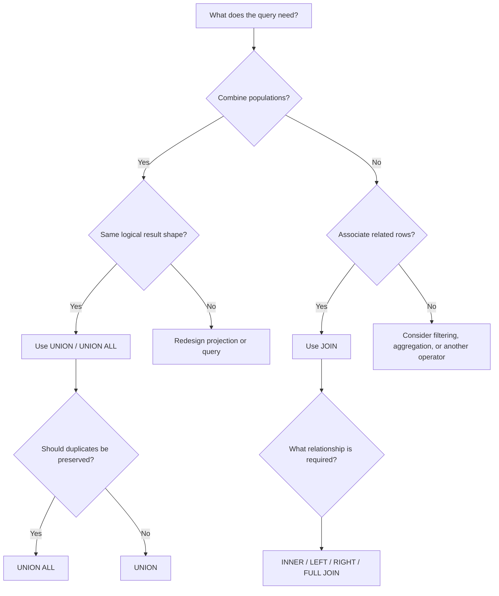

# 09- Set Operators vs JOINs

## Overview

SQL set operators and `JOIN` clauses can both combine information from multiple queries or tables, but they solve fundamentally different problems.

The key distinction is:

- **Set operators combine result sets vertically** by adding rows.
- **JOINs combine relations horizontally** by matching rows and adding columns.

Understanding this distinction prevents a large class of incorrect queries, unnecessary data processing, and performance problems.

```text
Set operators

Result A              Result B
┌──────────────┐      ┌──────────────┐
│ id | name    │      │ id | name    │
├──────────────┤      ├──────────────┤
│ 1  | Alice   │      │ 3  | Carol   │
│ 2  | Bob     │      │ 4  | David   │
└──────────────┘      └──────────────┘
        │                    │
        └────────┬───────────┘
                 ↓
          Combined rows
┌──────────────┐
│ id | name    │
├──────────────┤
│ 1  | Alice   │
│ 2  | Bob     │
│ 3  | Carol   │
│ 4  | David   │
└──────────────┘


JOIN

Customers                 Orders
┌──────────────┐          ┌────────────────┐
│ id | name    │          │ customer_id    │
├──────────────┤          ├────────────────┤
│ 1  | Alice   │          │ 1 | 5001       │
│ 2  | Bob     │          │ 2 | 5002       │
└──────────────┘          └────────────────┘
        │                         │
        └──────────┬──────────────┘
                   ↓
          Combined columns
┌────────────────────────────┐
│ id | name  | order_id      │
├────────────────────────────┤
│ 1  | Alice | 5001          │
│ 2  | Bob   | 5002          │
└────────────────────────────┘
```

## The Core Difference

| Aspect | Set Operators | JOINs |
| --- | --- | --- |
| Primary operation | Combine result sets | Relate rows |
| Direction | Vertical | Horizontal |
| Main effect | Adds rows | Adds columns |
| Matching condition | Not normally required | Usually uses a join predicate |
| Inputs | Compatible `SELECT` results | Tables, views, or query results |
| Column count | Must be compatible | Can differ |
| Typical purpose | Combine populations | Enrich or relate records |
| Examples | `UNION`, `UNION ALL`, `INTERSECT`, `EXCEPT` | `INNER`, `LEFT`, `RIGHT`, `FULL`, `CROSS` |

A useful mental model is:

> **Set operators answer "which rows belong in the result?" JOINs answer "which rows are related?"**

## Set Operators

SQL provides several major set operators:

| Operator | Meaning |
| --- | --- |
| `UNION` | Rows from either result, duplicates removed |
| `UNION ALL` | Rows from either result, duplicates preserved |
| `INTERSECT` | Rows common to both results |
| `EXCEPT` | Rows in the first result but not the second |

Example:

```sql
SELECT customer_id
FROM purchases

UNION

SELECT customer_id
FROM support_tickets;
```

This answers:

> Which customers appear in either dataset?

It does not answer:

> What purchase belongs to each support ticket?

That second question is relational and normally requires a `JOIN`.

## JOINs

A `JOIN` combines rows based on a relationship or matching condition.

```sql
SELECT
    c.customer_id,
    c.email,
    o.order_id,
    o.total_amount
FROM customers AS c
JOIN orders AS o
    ON o.customer_id = c.customer_id;
```

The result contains columns from both relations.

Conceptually:

```text
customers
     │
     │ customer_id = orders.customer_id
     ↓
   JOIN
     │
     ↓
customers + orders columns
```

The number of output rows depends on the relationship between the matching rows.

## Vertical vs Horizontal Combination

The easiest way to distinguish the two is by thinking about table shape.

### Set Operator: Add Rows

```sql
SELECT customer_id, email
FROM active_customers

UNION ALL

SELECT customer_id, email
FROM trial_customers;
```

Result:

```text
customer_id | email
------------|----------------
101         | a@example.com
102         | b@example.com
201         | c@example.com
```

The schema remains approximately the same while the number of rows increases.

### JOIN: Add Columns

```sql
SELECT
    c.customer_id,
    c.email,
    o.order_id
FROM customers AS c
JOIN orders AS o
    ON o.customer_id = c.customer_id;
```

Result:

```text
customer_id | email         | order_id
------------|---------------|---------
101         | a@example.com | 9001
102         | b@example.com | 9002
```

The query combines attributes from related relations.

## When to Use a Set Operator

Use a set operator when the inputs represent **different populations of the same logical shape**.

Examples:

- Current and archived records.
- Events from different tables.
- Customer populations from different sources.
- Results from different business conditions.
- Reconciliation queries.
- Data migration checks.

Example:

```sql
SELECT
    user_id,
    email
FROM active_users

UNION ALL

SELECT
    user_id,
    email
FROM suspended_users;
```

The two datasets have the same logical shape and need to be combined into one population.

## When to Use a JOIN

Use a `JOIN` when the query needs to **associate attributes or records from related entities**.

Example:

```sql
SELECT
    u.user_id,
    u.email,
    p.plan_name
FROM users AS u
JOIN subscriptions AS s
    ON s.user_id = u.user_id
JOIN plans AS p
    ON p.plan_id = s.plan_id;
```

The query is not combining two populations of users. It is enriching each user with related subscription and plan information.

## Practical Comparison

Suppose an e-commerce system contains:

```text
customers
orders
guest_orders
```

### Question: Which customers have placed orders?

This is a set-oriented population question:

```sql
SELECT customer_id
FROM orders

UNION

SELECT customer_id
FROM guest_orders
WHERE customer_id IS NOT NULL;
```

### Question: What orders belong to each customer?

This is a relational question:

```sql
SELECT
    c.customer_id,
    c.email,
    o.order_id,
    o.total_amount
FROM customers AS c
JOIN orders AS o
    ON o.customer_id = c.customer_id;
```

The business question determines the SQL construct.

## Set Operators Require Compatible Result Shapes

Set operators require corresponding columns to be compatible.

For example:

```sql
SELECT
    customer_id,
    email
FROM customers

UNION ALL

SELECT
    customer_id,
    email
FROM archived_customers;
```

Both branches return two columns in corresponding positions.

A `JOIN` has no equivalent requirement that both sides return the same number of columns.

```sql
SELECT
    c.customer_id,
    c.email,
    o.order_id,
    o.total_amount
FROM customers AS c
JOIN orders AS o
    ON o.customer_id = c.customer_id;
```

The two source relations can have completely different schemas.

## Column Compatibility vs Join Compatibility

These concepts are different.

### Set Operator Compatibility

Set operators generally require:

- Same number of projected columns.
- Corresponding columns with compatible data types.
- Compatible semantics.

```sql
SELECT
    customer_id,
    email
FROM customers

UNION ALL

SELECT
    customer_id,
    email
FROM archived_customers;
```

### JOIN Compatibility

A join requires a meaningful relationship or predicate:

```sql
SELECT ...
FROM customers AS c
JOIN orders AS o
    ON o.customer_id = c.customer_id;
```

The tables can have completely different structures.

## JOINs Can Increase Row Counts

A common misconception is that a `JOIN` simply attaches one row to another.

That is not generally true.

Consider:

```text
customers

customer_id
-----------
101
```

and:

```text
orders

order_id | customer_id
---------|------------
5001     | 101
5002     | 101
5003     | 101
```

This query:

```sql
SELECT
    c.customer_id,
    o.order_id
FROM customers AS c
JOIN orders AS o
    ON o.customer_id = c.customer_id;
```

returns:

```text
customer_id | order_id
------------|---------
101         | 5001
101         | 5002
101         | 5003
```

One customer produces three output rows because the relationship is one-to-many.

This is fundamentally different from `UNION ALL`, where rows are simply appended from separate result sets.

## Set Operators Do Not Create Relationships

Consider:

```sql
SELECT customer_id
FROM customers

UNION ALL

SELECT customer_id
FROM orders;
```

This does not establish any relationship between customers and orders.

It simply places values from both result sets into one column.

If the requirement is to associate each order with its customer:

```sql
SELECT
    c.customer_id,
    c.email,
    o.order_id
FROM customers AS c
JOIN orders AS o
    ON o.customer_id = c.customer_id;
```

A set operator cannot substitute for that relationship.

## JOINs Do Not Simply Replace UNION

Suppose current and archived orders have identical schemas:

```sql
SELECT
    order_id,
    customer_id,
    total_amount
FROM current_orders

UNION ALL

SELECT
    order_id,
    customer_id,
    total_amount
FROM archived_orders;
```

Replacing this with a join would change the semantics.

A join would attempt to match rows between `current_orders` and `archived_orders`, which is not the intended operation.

Likewise, using `UNION` where a join is required can lose the relationship between columns.

## Common Transformation Mistake

Suppose the requirement is:

> Return every order with the customer's email.

An incorrect approach might attempt to combine the datasets:

```sql
SELECT
    order_id,
    customer_id
FROM orders

UNION ALL

SELECT
    customer_id,
    email
FROM customers;
```

This produces a meaningless combined population.

The correct operation is:

```sql
SELECT
    o.order_id,
    o.customer_id,
    c.email
FROM orders AS o
JOIN customers AS c
    ON c.customer_id = o.customer_id;
```

The difference is semantic, not merely syntactic.

## JOIN vs UNION in Backend APIs

Consider a REST endpoint:

```text
GET /orders
```

If the response needs:

```json
{
  "order_id": 5001,
  "customer_email": "customer@example.com",
  "total_amount": 1499.00
}
```

the database normally needs a join:

```sql
SELECT
    o.order_id,
    c.email AS customer_email,
    o.total_amount
FROM orders AS o
JOIN customers AS c
    ON c.customer_id = o.customer_id;
```

If another requirement is:

> Return all customer IDs originating from either purchases or support activity.

then a set operator is more appropriate:

```sql
SELECT customer_id
FROM purchases

UNION

SELECT customer_id
FROM support_tickets;
```

## Set Operators vs JOINs in Data Pipelines

In ETL or reporting systems, both can appear in the same query.

Example:

```sql
WITH all_orders AS (
    SELECT
        order_id,
        customer_id,
        total_amount
    FROM current_orders

    UNION ALL

    SELECT
        order_id,
        customer_id,
        total_amount
    FROM archived_orders
)
SELECT
    o.order_id,
    c.email,
    o.total_amount
FROM all_orders AS o
JOIN customers AS c
    ON c.customer_id = o.customer_id;
```

The operations have different responsibilities:

```text
Current orders ─────┐
                    │
Archived orders ────┼──> UNION ALL ──> All orders
                    │                       │
                    │                       ↓
Customers ───────────────────────────────> JOIN
                                            │
                                            ↓
                                   Enriched order data
```

This pattern is common in production reporting systems.

## Choosing Between UNION and JOIN

Use the following decision model:



## Performance Considerations

The performance characteristics differ because the operations perform different work.

### UNION ALL

`UNION ALL` can often concatenate inputs with relatively little additional processing.

```sql
SELECT customer_id
FROM current_customers

UNION ALL

SELECT customer_id
FROM archived_customers;
```

The primary cost is reading and producing the input rows.

### UNION

`UNION` must eliminate duplicate rows.

```sql
SELECT customer_id
FROM current_customers

UNION

SELECT customer_id
FROM archived_customers;
```

This can require additional sorting, hashing, memory, or temporary I/O depending on the database and execution plan.

### JOIN

A join must find matching rows according to its predicate.

Possible physical strategies include:

- Nested loop join.
- Hash join.
- Merge join.

The optimizer chooses an execution strategy based on statistics, indexes, cardinality estimates, and other factors.

## Indexing Implications

Indexes can be highly relevant to joins.

For example:

```sql
SELECT
    o.order_id,
    c.email
FROM orders AS o
JOIN customers AS c
    ON c.customer_id = o.customer_id;
```

An appropriate index or primary key on the join columns can make row matching substantially more efficient.

For PostgreSQL, `customers.customer_id` is commonly a primary key, while `orders.customer_id` is often indexed when the workload frequently joins or filters by it.

Example:

```sql
CREATE INDEX idx_orders_customer_id
ON orders (customer_id);
```

Do not add indexes solely because a column appears in a join. Validate the workload and execution plan first.

For set operators, indexes may help the individual branch queries through filtering and access paths, but they do not automatically eliminate the cost of global duplicate removal performed by `UNION`.

## Cardinality Is Critical

Senior-level SQL debugging requires reasoning about cardinality.

Suppose:

```text
customers: 1 million rows
orders:    20 million rows
```

A join can produce many more rows than the smaller input because of one-to-many relationships.

For example:

```sql
SELECT
    c.customer_id,
    o.order_id
FROM customers AS c
JOIN orders AS o
    ON o.customer_id = c.customer_id;
```

can return close to the number of orders rather than the number of customers.

A careless join can also produce a many-to-many explosion:

```text
Table A: 100,000 rows
Table B: 100,000 rows

Poor join predicate
        ↓
Potentially enormous intermediate result
```

Set operators behave differently because each branch contributes rows rather than matching rows against another relation.

## Accidental CROSS JOIN

A particularly dangerous join mistake is omitting the relationship predicate.

```sql
SELECT
    c.customer_id,
    o.order_id
FROM customers AS c
CROSS JOIN orders AS o;
```

This intentionally creates a Cartesian product.

An accidental equivalent can occur through a missing or incorrect join condition.

The result size is approximately:

```text
rows(A) × rows(B)
```

For large production tables, this can cause severe CPU, memory, I/O, and latency problems.

## JOIN Multiplication vs Set Deduplication

These operations can interact in subtle ways.

Consider:

```sql
SELECT
    c.customer_id,
    o.order_id
FROM customers AS c
JOIN orders AS o
    ON o.customer_id = c.customer_id;
```

If a customer has five orders, five rows are returned.

Applying `DISTINCT`:

```sql
SELECT DISTINCT
    c.customer_id
FROM customers AS c
JOIN orders AS o
    ON o.customer_id = c.customer_id;
```

returns each customer once.

But this is not equivalent to using `UNION`.

The query's semantics are:

1. Establish customer-order relationships.
2. Project the customer ID.
3. Remove duplicate projected IDs.

This is different from combining two independent populations with a set operator.

## When UNION and JOIN Appear Together

Production queries frequently use both.

Example:

```sql
WITH relevant_users AS (
    SELECT user_id
    FROM product_signups

    UNION

    SELECT user_id
    FROM newsletter_signups
)
SELECT
    u.user_id,
    u.email,
    p.plan_name
FROM relevant_users AS r
JOIN users AS u
    ON u.user_id = r.user_id
LEFT JOIN plans AS p
    ON p.plan_id = u.plan_id;
```

Here:

- `UNION` creates the unique target population.
- `JOIN` enriches that population with user and plan information.

This separation of responsibilities often makes complex SQL easier to reason about.

## Set Operators and JOINs in Reconciliation

Data reconciliation often combines both operations.

Suppose a migration copies users from a legacy system into a new table.

To find legacy IDs missing from the target:

```sql
SELECT user_id
FROM legacy_users

EXCEPT

SELECT user_id
FROM new_users;
```

To inspect attributes for those users:

```sql
WITH missing_users AS (
    SELECT user_id
    FROM legacy_users

    EXCEPT

    SELECT user_id
    FROM new_users
)
SELECT
    m.user_id,
    l.email,
    l.created_at
FROM missing_users AS m
JOIN legacy_users AS l
    ON l.user_id = m.user_id;
```

The set operator identifies the population; the join retrieves additional information.

## NULL Semantics

`NULL` can affect both joins and set operations, but in different ways.

For joins:

```sql
SELECT *
FROM orders AS o
JOIN customers AS c
    ON c.customer_id = o.customer_id;
```

A normal equality comparison does not match `NULL` values because:

```text
NULL = NULL
```

does not evaluate to `TRUE`.

Set operations have their own duplicate and row-comparison semantics, and `NULL` values can participate in duplicate elimination and set membership differently from ordinary join predicates.

This is an important interview and production distinction:

> Do not reason about `NULL` in `UNION`, `INTERSECT`, or `EXCEPT` as though it were simply the same as `NULL` in an `=` join predicate.

Always verify the specific database's documented semantics for complex `NULL` cases.

## Security Considerations

Set operators and joins do not automatically enforce authorization boundaries.

For example, an endpoint must not assume that:

```sql
SELECT user_id
FROM orders

UNION

SELECT user_id
FROM support_tickets;
```

is safe merely because the SQL is correct.

Authorization should be enforced through appropriate query predicates, database permissions, row-level security where applicable, and application-level access controls.

A particularly important production concern is avoiding accidental cross-tenant joins.

For a multi-tenant system, a join may need tenant scoping:

```sql
SELECT
    o.order_id,
    c.email
FROM orders AS o
JOIN customers AS c
    ON c.customer_id = o.customer_id
   AND c.tenant_id = o.tenant_id
WHERE o.tenant_id = $1;
```

The exact predicate depends on the schema and constraints, but tenant isolation must be explicit when the data model requires it.

## Common Mistakes

| Mistake | Why It Happens | Better Approach |
| --- | --- | --- |
| Using `UNION` instead of `JOIN` | Thinking both combine tables | Decide whether rows should be appended or related |
| Using `JOIN` instead of `UNION` | Trying to combine similarly shaped datasets | Use a set operator for population combination |
| Assuming JOIN adds exactly one row | Ignoring one-to-many relationships | Analyze cardinality |
| Using `UNION` to deduplicate entities | Confusing row equality with business identity | Project the correct key or use explicit deduplication |
| Using `UNION ALL` without checking duplicate semantics | Optimizing before defining correctness | Decide whether duplicate rows are meaningful |
| Joining without a selective predicate | Missing relationship logic | Validate the join condition and execution plan |
| Joining on the wrong key | Assuming similarly named columns represent identity | Use explicit foreign-key/business-key relationships |
| Selecting `*` from both sides | Producing ambiguous or excessive output | Select required columns explicitly |
| Ignoring column order in set operators | Assuming columns match by name | Align projections positionally |
| Assuming UNION preserves order | Confusing set semantics with ordering | Use final `ORDER BY` |
| Using DISTINCT to hide join problems | Treating symptoms instead of cardinality | Fix the relationship or business logic |
| Ignoring tenant boundaries | Assuming IDs are globally unique | Include required tenant predicates |
| Performing huge joins without checking plans | Testing only on small data | Use `EXPLAIN` with representative data |

## Production Debugging Workflow

When a query involving set operators or joins produces unexpected results:

### Identify the Intended Operation

Ask:

- Am I combining populations?
- Am I associating entities?
- Do duplicates matter?
- What defines row identity?
- What should determine the number of output rows?

### Inspect Each Input Independently

Run each branch separately:

```sql
SELECT ...
FROM source_a;
```

```sql
SELECT ...
FROM source_b;
```

Check:

- Row count.
- Duplicate count.
- `NULL` values.
- Data types.
- Key uniqueness.

### Inspect Join Cardinality

For joins, determine whether the relationship is:

```text
1 : 1
1 : N
N : 1
N : N
```

A query expected to return one row per customer can unexpectedly return many rows when joined to an orders table.

### Inspect the Execution Plan

PostgreSQL example:

```sql
EXPLAIN (ANALYZE, BUFFERS)
SELECT
    o.order_id,
    c.email
FROM orders AS o
JOIN customers AS c
    ON c.customer_id = o.customer_id;
```

For set operations:

```sql
EXPLAIN (ANALYZE, BUFFERS)
SELECT customer_id
FROM current_orders

UNION ALL

SELECT customer_id
FROM archived_orders;
```

Check:

- Actual vs estimated rows.
- Join strategy.
- Sequential scans.
- Index scans.
- Sort operations.
- Hash operations.
- Temporary I/O.
- Execution time.

## Interview Comparison

| Interview Question | Correct Reasoning |
| --- | --- |
| `UNION` vs `JOIN`? | `UNION` combines rows vertically; `JOIN` combines related data horizontally |
| `UNION` vs `UNION ALL`? | `UNION` removes duplicates; `UNION ALL` preserves them |
| Can a JOIN increase row count? | Yes, especially with one-to-many or many-to-many relationships |
| Can UNION increase row count? | Yes; it combines rows, with `UNION` potentially removing duplicates |
| Does UNION require matching columns? | Corresponding result columns must be compatible |
| Does JOIN require identical schemas? | No |
| Which is better for current + archived tables? | Usually `UNION ALL` when schemas align and rows are mutually exclusive |
| Which is better for customer + order data? | Usually a `JOIN` |
| Can UNION and JOIN be used together? | Yes, and this is common in production queries |
| Is DISTINCT a replacement for fixing a bad JOIN? | No; it can hide incorrect cardinality and discard meaningful multiplicity |

## Practical Decision Table

| Requirement | Preferred Construct |
| --- | --- |
| Combine current and archived rows | `UNION ALL` |
| Combine overlapping populations and remove duplicate rows | `UNION` |
| Find common rows between two populations | `INTERSECT` |
| Find rows present in one population but not another | `EXCEPT` |
| Retrieve customer data with order data | `JOIN` |
| Add product information to order rows | `JOIN` |
| Identify users appearing in multiple sources | `INTERSECT` or `UNION` depending on the requirement |
| Build a population and then enrich it | Set operator followed by `JOIN` |
| Compare migration source and destination | `EXCEPT` / `INTERSECT` |
| Combine event streams from separate tables | `UNION ALL` |

## Senior-Level Design Principles

### Start With Data Semantics

Do not start by asking:

> Which SQL operator is faster?

Start with:

> What does one output row represent?

If one output row represents an event occurrence, preserving multiplicity may require `UNION ALL`.

If one output row represents a customer, joining or deduplicating may be necessary depending on the query.

### Make Cardinality Explicit

For every join, know:

```text
Expected input cardinality
        ↓
Relationship cardinality
        ↓
Expected output cardinality
```

This is especially important for:

- Billing.
- Payments.
- Analytics.
- Reporting.
- Authorization.
- Multi-tenant systems.

### Avoid Accidental Deduplication

A query that silently removes duplicates can produce incorrect business metrics.

For example:

```sql
SELECT COUNT(*)
FROM (
    SELECT user_id
    FROM api_events

    UNION

    SELECT user_id
    FROM worker_events
) AS users;
```

counts unique projected users.

Whereas:

```sql
SELECT COUNT(*)
FROM (
    SELECT user_id
    FROM api_events

    UNION ALL

    SELECT user_id
    FROM worker_events
) AS events;
```

counts event rows.

The SQL differs by one keyword, but the business meaning is completely different.

### Avoid Accidental Row Multiplication

Likewise:

```sql
SELECT COUNT(*)
FROM customers AS c
JOIN orders AS o
    ON o.customer_id = c.customer_id;
```

counts customer-order relationships, not customers.

If the requirement is unique customers with orders:

```sql
SELECT COUNT(DISTINCT c.customer_id)
FROM customers AS c
JOIN orders AS o
    ON o.customer_id = c.customer_id;
```

Alternatively, an existence query may express the intent more directly:

```sql
SELECT COUNT(*)
FROM customers AS c
WHERE EXISTS (
    SELECT 1
    FROM orders AS o
    WHERE o.customer_id = c.customer_id
);
```

The latter can be preferable when only existence matters, depending on the optimizer and workload.

## Key Takeaways

- **Set operators combine compatible result sets vertically, while JOINs associate related rows and typically combine columns horizontally.**
- **Choose based on data semantics: use set operators for population combination and JOINs for relationships between entities.**
- **JOIN cardinality can multiply rows, while `UNION` can remove duplicates; both behaviors can materially change application metrics and business results.**
- **Set operators and JOINs are often used together: first build the required population with a set operator, then enrich it through JOINs.**
- **For production SQL, reason explicitly about row identity, cardinality, duplicate semantics, tenant boundaries, and execution plans rather than choosing operators by syntax or habit.**