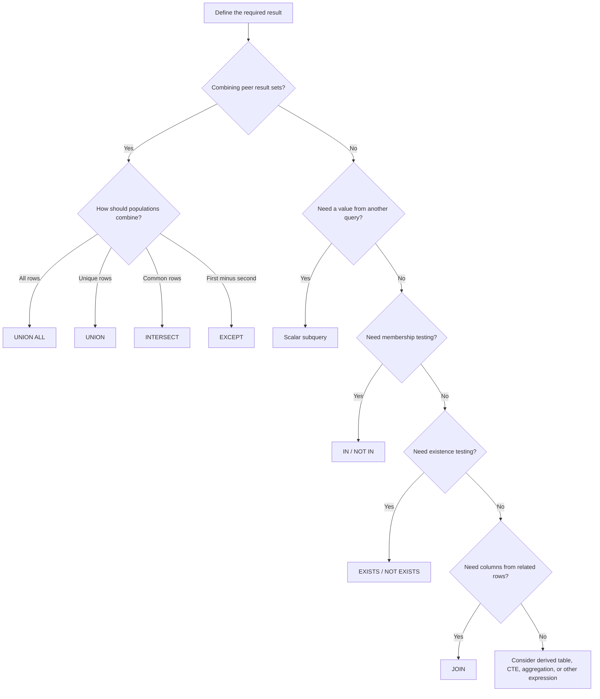

# 10- Set Operators vs Subqueries

## Overview

Set operators and subqueries both allow SQL to combine or compare the results of multiple query expressions, but they solve different problems.

The core distinction is:

- **Set operators combine two or more result sets as sets of rows.**
- **Subqueries embed one query inside another query and use its result as a value, relation, or existence condition.**

Typical set operators include:

- `UNION`
- `UNION ALL`
- `INTERSECT`
- `EXCEPT`

Typical subquery forms include:

- Scalar subqueries
- `IN` subqueries
- `EXISTS` subqueries
- `NOT EXISTS` subqueries
- Derived tables
- Common Table Expressions (CTEs)

The choice is primarily about **query semantics**. Performance should be evaluated after the intended operation is clear.

## Core Difference

| Aspect | Set Operators | Subqueries |
| --- | --- | --- |
| Primary purpose | Combine or compare result sets | Use one query inside another |
| Relationship between queries | Usually peer result sets | Outer query depends on inner query |
| Typical direction | Result set + result set | Outer query + nested query |
| Common operations | Union, intersection, difference | Filtering, lookup, aggregation, existence |
| Typical keywords | `UNION`, `UNION ALL`, `INTERSECT`, `EXCEPT` | `IN`, `EXISTS`, scalar expressions, derived tables |
| Output shape | Usually one combined result set | Determined by outer query |
| Duplicate handling | Defined by operator | Depends on outer operation |
| Correlation | Independent branches | Can be correlated with outer rows |
| Typical use | Combine populations | Filter, enrich, calculate, or test conditions |

A useful mental model is:

> **Set operators answer "how should these result sets be combined?" Subqueries answer "how should the result of another query participate in this query?"**

## Set Operators

A set operator combines compatible `SELECT` results.

```sql
SELECT customer_id
FROM active_customers

UNION

SELECT customer_id
FROM trial_customers;
```

The two branches independently produce customer IDs. `UNION` then combines them while removing duplicate rows.

With `UNION ALL`:

```sql
SELECT customer_id
FROM active_customers

UNION ALL

SELECT customer_id
FROM trial_customers;
```

duplicates are preserved.

Other set operations answer different questions:

```sql
SELECT customer_id
FROM customers

INTERSECT

SELECT customer_id
FROM newsletter_subscribers;
```

This returns customers who belong to both populations.

```sql
SELECT customer_id
FROM customers

EXCEPT

SELECT customer_id
FROM unsubscribed_customers;
```

This returns customer IDs present in the first result but not the second.

## Subqueries

A subquery is a query nested inside another SQL expression.

For example:

```sql
SELECT
    customer_id,
    email
FROM customers
WHERE customer_id IN (
    SELECT customer_id
    FROM orders
);
```

The inner query identifies customers who have orders. The outer query retrieves their customer records.

The query relationship is therefore:

```text
Outer query
    │
    │ uses result of
    ↓
Inner query
```

Unlike a set operator, the inner query does not necessarily produce another peer result set that is directly combined with the outer result.

## Why Subqueries Exist

Subqueries allow SQL to express operations such as:

- Filtering based on another relation.
- Checking whether related rows exist.
- Comparing a value against an aggregate.
- Computing a derived value.
- Building an intermediate relation.
- Expressing multi-stage logic without materializing temporary tables.

For example:

```sql
SELECT
    order_id,
    total_amount
FROM orders
WHERE total_amount > (
    SELECT AVG(total_amount)
    FROM orders
);
```

The scalar subquery calculates an aggregate value, and the outer query compares every order against it.

A set operator cannot naturally express this particular relationship because the requirement is not to combine two row populations.

## Set Operators and Subqueries Can Solve Similar Problems

Some requirements can be expressed using either construct.

Consider:

> Find users who have placed an order.

Using `IN`:

```sql
SELECT
    u.user_id,
    u.email
FROM users AS u
WHERE u.user_id IN (
    SELECT o.user_id
    FROM orders AS o
);
```

Using `EXISTS`:

```sql
SELECT
    u.user_id,
    u.email
FROM users AS u
WHERE EXISTS (
    SELECT 1
    FROM orders AS o
    WHERE o.user_id = u.user_id
);
```

Using a `JOIN`:

```sql
SELECT DISTINCT
    u.user_id,
    u.email
FROM users AS u
JOIN orders AS o
    ON o.user_id = u.user_id;
```

Using `INTERSECT` is also possible when the business question naturally concerns two populations:

```sql
SELECT user_id
FROM users

INTERSECT

SELECT user_id
FROM orders;
```

These queries can express related results, but their semantics and execution characteristics differ.

## Choosing Based on the Business Question

The most reliable decision process is to identify what one output row represents.

### Combining Populations

Requirement:

> Return users who came from either the mobile signup table or the web signup table.

Use:

```sql
SELECT user_id
FROM mobile_signups

UNION

SELECT user_id
FROM web_signups;
```

The two queries represent peer populations.

### Filtering a Population

Requirement:

> Return users who have at least one order.

Use:

```sql
SELECT
    u.user_id,
    u.email
FROM users AS u
WHERE EXISTS (
    SELECT 1
    FROM orders AS o
    WHERE o.user_id = u.user_id
);
```

The order query is a condition on the user population.

### Comparing Populations

Requirement:

> Find users in the legacy system who are absent from the new system.

Use:

```sql
SELECT user_id
FROM legacy_users

EXCEPT

SELECT user_id
FROM users;
```

The requirement is naturally expressed as a set difference.

### Computing a Value

Requirement:

> Find orders larger than the average order.

Use:

```sql
SELECT
    order_id,
    total_amount
FROM orders
WHERE total_amount > (
    SELECT AVG(total_amount)
    FROM orders
);
```

The inner query produces a scalar value rather than a peer population.

## `IN` Subqueries

`IN` is useful when a value should match one of the values produced by another query.

```sql
SELECT
    product_id,
    name
FROM products
WHERE product_id IN (
    SELECT product_id
    FROM order_items
);
```

This asks:

> Is this product ID contained in the set produced by the subquery?

Conceptually:

```text
Subquery
┌─────────────┐
│ product_id  │
├─────────────┤
│ 10          │
│ 20          │
│ 30          │
└─────────────┘
       │
       ↓
Outer query checks membership
       │
       ↓
products
```

`IN` is particularly natural when the requirement is membership in a derived set.

## `EXISTS` Subqueries

`EXISTS` checks whether at least one matching row exists.

```sql
SELECT
    c.customer_id,
    c.email
FROM customers AS c
WHERE EXISTS (
    SELECT 1
    FROM orders AS o
    WHERE o.customer_id = c.customer_id
);
```

The selected expression inside `EXISTS` is irrelevant to the existence test, so `SELECT 1` is conventional.

The database can often stop searching once a qualifying row is found.

This makes `EXISTS` particularly expressive when the requirement is:

> Return the outer row if a related record exists.

## `NOT EXISTS`

`NOT EXISTS` is useful for anti-join semantics.

```sql
SELECT
    c.customer_id,
    c.email
FROM customers AS c
WHERE NOT EXISTS (
    SELECT 1
    FROM orders AS o
    WHERE o.customer_id = c.customer_id
);
```

This returns customers without orders.

The equivalent set-oriented form may be:

```sql
SELECT customer_id
FROM customers

EXCEPT

SELECT customer_id
FROM orders;
```

The two queries communicate the requirement differently.

`NOT EXISTS` emphasizes:

> For each customer, no matching order exists.

`EXCEPT` emphasizes:

> Remove the order population from the customer population.

## `IN` vs `EXISTS`

Both can be used for membership-style queries, but they have different semantics around `NULL`, correlation, and query formulation.

| Requirement | Usually Natural Choice |
| --- | --- |
| Test whether a value belongs to a result set | `IN` |
| Test whether a related row exists | `EXISTS` |
| Test whether no related row exists | `NOT EXISTS` |
| Correlated relationship | `EXISTS` / `NOT EXISTS` |
| Compare two complete populations | `INTERSECT` / `EXCEPT` |

For example:

```sql
SELECT *
FROM users
WHERE user_id IN (
    SELECT user_id
    FROM orders
);
```

versus:

```sql
SELECT *
FROM users AS u
WHERE EXISTS (
    SELECT 1
    FROM orders AS o
    WHERE o.user_id = u.user_id
);
```

The second directly expresses a correlated existence condition.

## The `NULL` Trap with `NOT IN`

One of the most important production pitfalls is `NOT IN` combined with `NULL`.

Consider:

```sql
SELECT
    c.customer_id
FROM customers AS c
WHERE c.customer_id NOT IN (
    SELECT o.customer_id
    FROM orders AS o
);
```

If the subquery can return `NULL`, SQL's three-valued logic can cause the predicate to evaluate to `UNKNOWN` rather than `TRUE` for candidate values.

This can produce surprising results.

When expressing anti-existence logic, `NOT EXISTS` is generally safer:

```sql
SELECT
    c.customer_id
FROM customers AS c
WHERE NOT EXISTS (
    SELECT 1
    FROM orders AS o
    WHERE o.customer_id = c.customer_id
);
```

If `NOT IN` is deliberately used, the nullable column should be handled explicitly when appropriate:

```sql
SELECT
    c.customer_id
FROM customers AS c
WHERE c.customer_id NOT IN (
    SELECT o.customer_id
    FROM orders AS o
    WHERE o.customer_id IS NOT NULL
);
```

## Correlated vs Uncorrelated Subqueries

### Uncorrelated Subquery

An uncorrelated subquery does not reference the outer query.

```sql
SELECT
    order_id,
    total_amount
FROM orders
WHERE total_amount > (
    SELECT AVG(total_amount)
    FROM orders
);
```

The inner query is independent of each outer row.

### Correlated Subquery

A correlated subquery references a column from the outer query.

```sql
SELECT
    c.customer_id,
    c.email
FROM customers AS c
WHERE EXISTS (
    SELECT 1
    FROM orders AS o
    WHERE o.customer_id = c.customer_id
);
```

The `c.customer_id` reference comes from the outer query.

Modern optimizers can often transform correlated subqueries into efficient join-like plans, but developers should still inspect execution plans for expensive workloads.

## Subqueries as Derived Tables

A subquery can appear in the `FROM` clause.

```sql
SELECT
    customer_id,
    total_spend
FROM (
    SELECT
        customer_id,
        SUM(total_amount) AS total_spend
    FROM orders
    GROUP BY customer_id
) AS customer_totals
WHERE total_spend > 10000;
```

The inner query produces a relation that the outer query treats as a table.

This is different from a set operator because the inner query is being used as an intermediate relation.

## Combining Set Operators and Subqueries

Production queries often use both.

For example:

```sql
WITH eligible_users AS (
    SELECT user_id
    FROM premium_users

    UNION

    SELECT user_id
    FROM enterprise_users
)
SELECT
    u.user_id,
    u.email
FROM users AS u
WHERE EXISTS (
    SELECT 1
    FROM eligible_users AS e
    WHERE e.user_id = u.user_id
);
```

Conceptually:

```text
premium_users ────┐
                  ├── UNION ──> eligible population
enterprise_users ─┘                    │
                                       │
                                       ↓
                                  EXISTS check
                                       │
                                       ↓
                                     users
```

Each construct has a separate responsibility:

- `UNION` defines the eligible population.
- `EXISTS` checks whether the current user belongs to it.

## Set Operators vs Subqueries vs JOINs

These constructs often overlap, so a practical comparison is useful.

| Requirement | Set Operator | Subquery | JOIN |
| --- | --- | --- | --- |
| Combine two peer populations | Excellent | Possible but indirect | Usually inappropriate |
| Remove duplicate combined rows | `UNION` | Possible with `DISTINCT` | Possible but different semantics |
| Preserve duplicates while combining | `UNION ALL` | Not the primary mechanism | Not the primary mechanism |
| Find common populations | `INTERSECT` | Possible with `IN` / `EXISTS` | Possible |
| Find population difference | `EXCEPT` | `NOT EXISTS` | Anti-join pattern |
| Test related-row existence | Possible but indirect | `EXISTS` | Possible |
| Retrieve related columns | No | Derived table possible | Usually best fit |
| Compare against aggregate | No direct equivalent | Scalar subquery | Possible with aggregation/join |
| Build an intermediate relation | No | Derived table / CTE | Possible |
| Express row-to-row relationship | No | Correlated subquery | Usually best fit |

## `INTERSECT` vs `EXISTS`

Suppose the requirement is:

> Find users who have both purchased something and subscribed to the newsletter.

Set-oriented approach:

```sql
SELECT user_id
FROM purchases

INTERSECT

SELECT user_id
FROM newsletter_subscriptions;
```

Existence-oriented approach:

```sql
SELECT
    u.user_id
FROM users AS u
WHERE EXISTS (
    SELECT 1
    FROM purchases AS p
    WHERE p.user_id = u.user_id
)
AND EXISTS (
    SELECT 1
    FROM newsletter_subscriptions AS n
    WHERE n.user_id = u.user_id
);
```

The first asks for the intersection of two populations.

The second asks whether each user satisfies two existence conditions.

Neither is universally superior. The correct choice depends on which formulation best represents the business logic and which execution plan performs appropriately.

## `EXCEPT` vs `NOT EXISTS`

Suppose the requirement is:

> Find customers who have never placed an order.

Set-based formulation:

```sql
SELECT customer_id
FROM customers

EXCEPT

SELECT customer_id
FROM orders;
```

Existence formulation:

```sql
SELECT
    c.customer_id
FROM customers AS c
WHERE NOT EXISTS (
    SELECT 1
    FROM orders AS o
    WHERE o.customer_id = c.customer_id
);
```

The set formulation is useful when the problem is naturally population subtraction.

The `NOT EXISTS` formulation is often clearer when the business rule is expressed per outer row.

## Performance Considerations

Do not assume that one SQL construct is inherently faster.

A mature database optimizer may transform logically equivalent SQL into similar physical execution plans.

For example, these may be optimized into similar strategies:

```sql
SELECT
    u.user_id
FROM users AS u
WHERE EXISTS (
    SELECT 1
    FROM orders AS o
    WHERE o.user_id = u.user_id
);
```

and:

```sql
SELECT DISTINCT
    u.user_id
FROM users AS u
JOIN orders AS o
    ON o.user_id = u.user_id;
```

But they are not semantically identical in every situation, and the optimizer's choices depend on:

- Cardinality.
- Indexes.
- Statistics.
- Selectivity.
- Data distribution.
- Database engine.
- Query predicates.
- Available memory.
- Parallel execution capabilities.

Always validate important performance assumptions with the actual execution plan.

## PostgreSQL Execution Plans

For PostgreSQL:

```sql
EXPLAIN (ANALYZE, BUFFERS)
SELECT
    c.customer_id
FROM customers AS c
WHERE EXISTS (
    SELECT 1
    FROM orders AS o
    WHERE o.customer_id = c.customer_id
);
```

Look for:

- Estimated vs actual row counts.
- Nested loop, hash, or merge strategies.
- Index usage.
- Sequential scans.
- Hash table sizes.
- Sort operations.
- Buffer reads.
- Temporary I/O.
- Execution time.

For a set operation:

```sql
EXPLAIN (ANALYZE, BUFFERS)
SELECT customer_id
FROM current_orders

UNION

SELECT customer_id
FROM archived_orders;
```

Pay particular attention to duplicate elimination for `UNION`.

## `UNION` vs Subquery Performance

Consider:

```sql
SELECT customer_id
FROM current_orders

UNION

SELECT customer_id
FROM archived_orders;
```

versus:

```sql
SELECT DISTINCT customer_id
FROM (
    SELECT customer_id
    FROM current_orders

    UNION ALL

    SELECT customer_id
    FROM archived_orders
) AS all_orders;
```

These can express similar high-level logic, but the optimizer may choose different plans.

The second formulation makes the two stages explicit:

1. Combine all rows.
2. Deduplicate the final population.

This can sometimes be useful when additional processing must occur before deduplication, but it should not be introduced merely for stylistic reasons.

## Predicate Pushdown

Subqueries and set branches should be designed so that unnecessary rows are not processed.

Prefer filtering each source as early as semantics allow:

```sql
SELECT customer_id
FROM current_orders
WHERE status = 'completed'

UNION ALL

SELECT customer_id
FROM archived_orders
WHERE status = 'completed';
```

rather than combining large populations first and filtering afterward when the database cannot safely push the predicate down itself.

Likewise, correlated existence checks should use selective predicates:

```sql
SELECT
    u.user_id
FROM users AS u
WHERE EXISTS (
    SELECT 1
    FROM orders AS o
    WHERE o.user_id = u.user_id
      AND o.status = 'completed'
);
```

Appropriate indexes can make these checks substantially cheaper.

## Indexing for Subqueries

For:

```sql
SELECT
    u.user_id
FROM users AS u
WHERE EXISTS (
    SELECT 1
    FROM orders AS o
    WHERE o.user_id = u.user_id
      AND o.status = 'completed'
);
```

an index such as:

```sql
CREATE INDEX idx_orders_user_status
ON orders (user_id, status);
```

may be useful depending on workload, table size, data distribution, and other query patterns.

Indexes should be driven by actual access patterns rather than added mechanically for every predicate.

Use:

```sql
EXPLAIN (ANALYZE, BUFFERS)
...
```

to validate the result.

## Subquery vs CTE

A CTE can make multi-stage logic easier to structure:

```sql
WITH high_value_customers AS (
    SELECT
        customer_id
    FROM orders
    GROUP BY customer_id
    HAVING SUM(total_amount) > 10000
)
SELECT
    c.customer_id,
    c.email
FROM customers AS c
JOIN high_value_customers AS h
    ON h.customer_id = c.customer_id;
```

A CTE is a query expression, not automatically a temporary table or performance optimization.

Modern PostgreSQL versions can inline eligible CTEs, while materialization behavior can be influenced explicitly when needed.

Use CTEs primarily to make complex query logic understandable and maintainable, then verify performance with the execution plan.

## Production Backend Example

Suppose a Django or FastAPI service needs to return users eligible for a promotional campaign.

Eligibility:

- User is active.
- User either purchased in the current system or was imported from a partner system.
- User has not opted out.

A set-oriented population can first be built:

```sql
WITH eligible_population AS (
    SELECT user_id
    FROM completed_orders
    WHERE completed_at >= CURRENT_DATE - INTERVAL '30 days'

    UNION

    SELECT user_id
    FROM partner_campaign_users
)
SELECT
    u.user_id,
    u.email
FROM users AS u
JOIN eligible_population AS e
    ON e.user_id = u.user_id
WHERE u.status = 'active'
  AND NOT EXISTS (
      SELECT 1
      FROM marketing_opt_outs AS o
      WHERE o.user_id = u.user_id
  );
```

The query separates three concerns:

```text
Completed orders ───────┐
                        │
Partner campaign users ─┤
                        ↓
                    UNION
                        │
                        ↓
              Eligible population
                        │
                        ↓
                 JOIN users
                        │
                        ↓
               Active users
                        │
                        ↓
             NOT EXISTS opt-out
                        │
                        ↓
              Campaign recipients
```

This structure is easier to reason about than attempting to express every condition through one large join.

## ORM Considerations

Frameworks such as Django may generate subqueries, joins, or `EXISTS` expressions behind the scenes.

For example, Django's `Exists` expression can represent an existence predicate:

```python
from django.db.models import Exists, OuterRef

recent_order = Order.objects.filter(
    customer_id=OuterRef("pk"),
    created_at__gte=recent_cutoff,
)

customers = Customer.objects.annotate(
    has_recent_order=Exists(recent_order),
).filter(
    has_recent_order=True,
)
```

The important engineering principle is not to assume that ORM syntax guarantees an efficient SQL query.

Inspect generated SQL and the database execution plan for performance-critical paths.

## Common Mistakes

| Mistake | Why It Happens | Better Approach |
| --- | --- | --- |
| Using `UNION` when filtering is required | Confusing population combination with predicates | Use `IN`, `EXISTS`, or another appropriate filter |
| Using a JOIN when the requirement is set difference | Treating all multi-table operations as joins | Consider `EXCEPT` or `NOT EXISTS` |
| Using `NOT IN` with nullable subquery results | Ignoring three-valued logic | Prefer `NOT EXISTS` for anti-existence |
| Assuming subqueries are always slow | Relying on outdated rules of thumb | Inspect the execution plan |
| Assuming JOINs are always faster | Optimizing based on syntax | Compare actual plans |
| Using `DISTINCT` to hide row multiplication | Ignoring join cardinality | Fix the underlying relationship |
| Using `UNION` when duplicates are meaningful | Assuming duplicates are always bad | Use `UNION ALL` when multiplicity matters |
| Correlating an expensive subquery unnecessarily | Applying per-row logic without checking cardinality | Consider `JOIN`, aggregation, or set operations |
| Selecting unnecessary columns in derived tables | Carrying data through multiple stages | Project only required columns |
| Ignoring indexes for existence checks | Assuming the optimizer can avoid all work | Index appropriate correlation/filter columns |
| Materializing every CTE | Treating CTEs as performance tools | Use them for structure and verify the plan |
| Comparing syntax instead of semantics | Focusing on SQL keywords | Define the intended population and row identity first |

## Interview Traps

### "Are Subqueries Always Slower Than JOINs?"

No.

The optimizer can transform subqueries into join-like execution strategies. A well-formed `EXISTS` query can be highly efficient.

The correct answer is:

> Compare logical semantics first, then inspect the execution plan for performance.

### "Is `EXISTS` Faster Than `IN`?"

Not universally.

Modern optimizers can often transform both into efficient semi-join strategies. Performance depends on:

- Database engine.
- Data distribution.
- Correlation.
- Indexes.
- Statistics.
- Cardinality.
- Predicates.

Avoid claiming that one is always faster.

### "Is `EXCEPT` the Same as `NOT EXISTS`?"

They can express related anti-set logic, but they are not syntactically or semantically interchangeable in every situation.

`EXCEPT` compares result sets.

`NOT EXISTS` evaluates an existence condition against each outer row.

Differences can arise from:

- Duplicate semantics.
- Projection.
- `NULL` behavior.
- Additional outer columns.
- Business-key requirements.

### "Can Set Operators Be Used Inside Subqueries?"

Yes.

For example:

```sql
SELECT
    u.user_id,
    u.email
FROM users AS u
WHERE u.user_id IN (
    SELECT user_id
    FROM purchases

    UNION

    SELECT user_id
    FROM referrals
);
```

The set operation builds the inner result set, and the outer query uses it as an `IN` membership source.

## Practical Decision Framework

Use this decision tree:



## Production Guidelines

### Prefer Semantically Direct SQL

Write the query that most directly communicates the business requirement.

Use:

```sql
WHERE EXISTS (...)
```

when the requirement is:

> A related row must exist.

Use:

```sql
EXCEPT
```

when the requirement is:

> Remove one population from another.

Use:

```sql
UNION ALL
```

when the requirement is:

> Append these populations while preserving multiplicity.

### Treat Duplicate Semantics as Business Logic

Do not automatically use `UNION` simply because duplicate rows look undesirable.

Ask:

> Are these duplicate rows actual duplicate records, or do they represent multiple valid events?

For event processing, `UNION ALL` is frequently the correct choice.

### Treat `NULL` as a First-Class Concern

Particularly review:

- `NOT IN`.
- `IN`.
- `EXISTS`.
- `NOT EXISTS`.
- Set operators involving nullable values.

Do not assume ordinary two-valued Boolean logic.

### Measure Before Optimizing

For production queries:

```sql
EXPLAIN (ANALYZE, BUFFERS)
...
```

Validate:

- Actual row counts.
- Join or subquery strategy.
- Index usage.
- Memory consumption.
- Sort/hash operations.
- Buffer activity.
- Total execution time.

The optimizer, not SQL syntax alone, determines the physical execution strategy.

## Key Takeaways

- **Set operators combine peer result sets, while subqueries allow one query's result to participate inside another query.**
- **Choose based on semantics: use `UNION`/`INTERSECT`/`EXCEPT` for population-level operations and `IN`/`EXISTS` or scalar subqueries for nested conditions and values.**
- **`NOT EXISTS` is generally safer than `NOT IN` for anti-existence logic when the subquery can contain `NULL`.**
- **Do not rely on rules such as "JOINs are always faster than subqueries"; modern optimizers can transform logically equivalent queries into similar execution strategies.**
- **For production SQL, define row identity and duplicate semantics first, then validate cardinality, indexes, `NULL` behavior, and execution plans.**