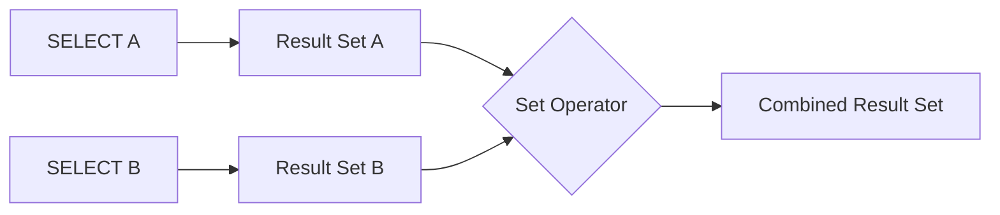
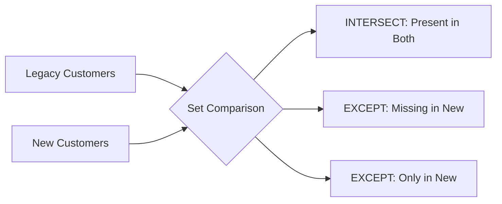
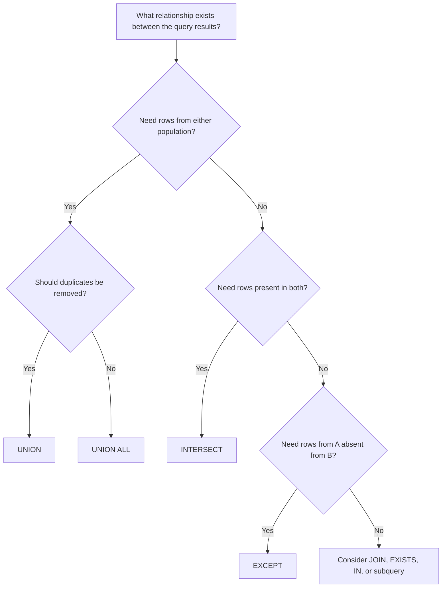

# 11- When to Choose Each Set Operator

## Overview

SQL set operators combine the results of multiple `SELECT` statements into a single result set. The four core operators are:

- `UNION`
- `UNION ALL`
- `INTERSECT`
- `EXCEPT`

The correct operator depends on the **relationship between the populations represented by the queries**.

A useful mental model is:

```text
UNION       → A or B
UNION ALL   → A and B, preserving every row
INTERSECT   → A and B
EXCEPT      → A but not B
```

The most important production decision is not syntax. It is deciding whether duplicate rows have business meaning and whether the two query branches represent compatible populations.

## Set Operator Decision Matrix

| Requirement | Operator | Duplicate Behavior |
| --- | --- | --- |
| Combine two populations and remove duplicate rows | `UNION` | Removes duplicates |
| Append two populations and preserve every row | `UNION ALL` | Preserves duplicates |
| Return rows present in both populations | `INTERSECT` | Returns distinct rows |
| Return rows present in the first population but absent from the second | `EXCEPT` | Returns distinct rows |

For example, assume:

```text
A = {1, 2, 3}
B = {3, 4, 5}
```

The logical results are:

| Operator | Result |
| --- | --- |
| `UNION` | `{1, 2, 3, 4, 5}` |
| `UNION ALL` | `{1, 2, 3, 3, 4, 5}` |
| `INTERSECT` | `{3}` |
| `EXCEPT` | `{1, 2}` |

## How Set Operators Work

Each branch produces a result set first. The set operator then combines or compares those results according to its semantics.



The branches must be **union-compatible**. In practical terms, they must return the same number of columns, and corresponding columns must have compatible data types. Exact type-resolution rules vary by database engine.

For example:

```sql
SELECT
    user_id,
    email
FROM active_users

UNION

SELECT
    user_id,
    email
FROM trial_users;
```

is structurally compatible.

This is not:

```sql
SELECT
    user_id,
    email
FROM active_users

UNION

SELECT
    user_id
FROM trial_users;
```

because the branches return different numbers of columns.

## `UNION`

### What It Is

`UNION` combines the results of two or more queries and removes duplicate result rows.

```sql
SELECT user_id
FROM mobile_users

UNION

SELECT user_id
FROM web_users;
```

If the same `user_id` appears in both branches, it appears once in the final result.

### When to Use It

Use `UNION` when:

- Multiple sources represent the same logical population.
- Duplicate rows across branches should be collapsed.
- The final result represents a distinct set of entities.

A common example is consolidating users from multiple acquisition systems:

```sql
SELECT user_id
FROM organic_signups

UNION

SELECT user_id
FROM paid_signups;
```

The result represents users acquired through either channel, with each user appearing once.

### Production Consideration

Duplicate elimination requires additional work compared with `UNION ALL`. Depending on the database and execution plan, the engine may need sorting, hashing, or another duplicate-elimination strategy.

Therefore:

> Do not use `UNION` merely because it "looks cleaner." Use it when duplicate elimination is part of the required semantics.

## `UNION ALL`

### What It Is

`UNION ALL` appends the rows from each query without removing duplicates.

```sql
SELECT user_id
FROM current_orders

UNION ALL

SELECT user_id
FROM archived_orders;
```

If a user appears in both result sets, both rows remain.

### When to Use It

Use `UNION ALL` when:

- Every source row should be preserved.
- Duplicate-looking rows represent legitimate events.
- The branches are mutually exclusive.
- You explicitly want concatenation rather than deduplication.
- You are building an intermediate population where deduplication will happen later.

For event-oriented systems, `UNION ALL` is often the correct default.

```sql
SELECT
    order_id,
    customer_id,
    created_at,
    'current' AS source
FROM current_orders

UNION ALL

SELECT
    order_id,
    customer_id,
    created_at,
    'archive' AS source
FROM archived_orders;
```

If the same customer has multiple orders, those rows are not duplicates from a business perspective. They represent separate events.

### Why It Is Often Faster

`UNION ALL` does not need to remove duplicates.

Conceptually:

```text
Query A ───────┐
               ├── append ──> output
Query B ───────┘
```

Whereas `UNION` requires an additional logical operation:

```text
Query A ───────┐
               ├── combine ──> deduplicate ──> output
Query B ───────┘
```

The exact physical implementation depends on the database engine and optimizer.

## `INTERSECT`

### What It Is

`INTERSECT` returns rows that exist in both query results.

```sql
SELECT user_id
FROM paying_customers

INTERSECT

SELECT user_id
FROM newsletter_subscribers;
```

This returns customers who belong to both populations.

### When to Use It

Use `INTERSECT` when the business requirement naturally means:

> Return entities that belong to both populations.

Typical cases include:

- Users present in two systems.
- Records matching two independent eligibility populations.
- Data reconciliation.
- Comparing snapshots.
- Finding common identifiers between datasets.

For example:

```sql
SELECT customer_id
FROM crm_customers

INTERSECT

SELECT customer_id
FROM billing_customers;
```

This can help identify customers represented in both systems.

### Duplicate Behavior

`INTERSECT` returns distinct rows in standard SQL semantics.

If duplicate preservation is required, some database systems support `INTERSECT ALL`, but support and behavior should be checked for the target database.

## `EXCEPT`

### What It Is

`EXCEPT` returns rows from the first query that do not appear in the second query.

```sql
SELECT customer_id
FROM crm_customers

EXCEPT

SELECT customer_id
FROM billing_customers;
```

This returns CRM customers who are absent from the billing population.

### When to Use It

Use `EXCEPT` when the business requirement naturally means:

> Start with population A and remove everything present in population B.

Typical uses include:

- Reconciliation.
- Migration validation.
- Detecting missing records.
- Comparing snapshots.
- Identifying incomplete synchronization.
- Finding entities that should exist but do not.

For example:

```sql
SELECT user_id
FROM source_users

EXCEPT

SELECT user_id
FROM destination_users;
```

This can identify source records that have not reached the destination.

### Direction Matters

`EXCEPT` is directional.

These are different:

```sql
SELECT user_id
FROM source_users

EXCEPT

SELECT user_id
FROM destination_users;
```

and:

```sql
SELECT user_id
FROM destination_users

EXCEPT

SELECT user_id
FROM source_users;
```

The first answers:

> What is missing from the destination?

The second answers:

> What exists only in the destination?

This distinction is especially important in data reconciliation.

## Choosing by Business Meaning

The fastest way to choose an operator is to translate the requirement into a set relationship.

| Business Requirement | Set Relationship | Operator |
| --- | --- | --- |
| Users from either system | A ∪ B | `UNION` |
| Events from both systems, preserving all records | A + B | `UNION ALL` |
| Users present in both systems | A ∩ B | `INTERSECT` |
| Source records missing in destination | A − B | `EXCEPT` |

For example:

> "Give me all customers from current and archived data, including every order."

Use:

```sql
SELECT customer_id
FROM current_orders

UNION ALL

SELECT customer_id
FROM archived_orders;
```

> "Give me unique customers from current and archived data."

Use:

```sql
SELECT customer_id
FROM current_orders

UNION

SELECT customer_id
FROM archived_orders;
```

> "Give me customers present in both CRM and billing."

Use:

```sql
SELECT customer_id
FROM crm_customers

INTERSECT

SELECT customer_id
FROM billing_customers;
```

> "Give me CRM customers that are not in billing."

Use:

```sql
SELECT customer_id
FROM crm_customers

EXCEPT

SELECT customer_id
FROM billing_customers;
```

## The Most Important Decision: Duplicate Semantics

A common mistake is treating duplicates as inherently undesirable.

Consider:

```sql
SELECT order_id, customer_id
FROM current_orders

UNION ALL

SELECT order_id, customer_id
FROM archived_orders;
```

If an order exists in both sources because of an operational migration, preserving both rows may expose a data-quality problem.

But if the same customer appears multiple times because they placed multiple orders, those rows are legitimate.

Therefore, ask:

> What does one row represent?

If one row represents an **entity**, deduplication may be appropriate.

If one row represents an **event**, duplicate-looking values may be legitimate.

This distinction is more important than the choice of SQL keyword.

## `UNION` vs `UNION ALL`

This is the most common set-operator decision.

```sql
SELECT email
FROM mobile_signups

UNION

SELECT email
FROM web_signups;
```

returns unique emails.

```sql
SELECT email
FROM mobile_signups

UNION ALL

SELECT email
FROM web_signups;
```

preserves every occurrence.

| Question | `UNION` | `UNION ALL` |
| --- | --- | --- |
| Combines rows | Yes | Yes |
| Removes duplicates | Yes | No |
| Preserves multiplicity | No | Yes |
| Usually requires deduplication work | Yes | No |
| Appropriate for event streams | Usually not | Often |
| Appropriate for distinct populations | Often | Only if already mutually exclusive |

If the branches are guaranteed to be mutually exclusive, `UNION ALL` is generally preferable because the deduplication step provides no value.

## `INTERSECT` vs `INNER JOIN`

These can produce related results but represent different intentions.

Set-based query:

```sql
SELECT user_id
FROM customers

INTERSECT

SELECT user_id
FROM active_subscriptions;
```

Join-based query:

```sql
SELECT DISTINCT
    c.user_id
FROM customers AS c
JOIN active_subscriptions AS s
    ON s.user_id = c.user_id;
```

The set operation emphasizes:

> Which IDs exist in both populations?

The join emphasizes:

> Match rows from these relations using this relationship.

A join is usually more appropriate when columns from both sides are required:

```sql
SELECT
    c.user_id,
    c.email,
    s.plan_id
FROM customers AS c
JOIN active_subscriptions AS s
    ON s.user_id = c.user_id;
```

`INTERSECT` cannot directly provide arbitrary columns from both source relations.

## `EXCEPT` vs `NOT EXISTS`

These often express similar business requirements.

Set difference:

```sql
SELECT customer_id
FROM customers

EXCEPT

SELECT customer_id
FROM orders;
```

Existence condition:

```sql
SELECT
    c.customer_id
FROM customers AS c
WHERE NOT EXISTS (
    SELECT 1
    FROM orders AS o
    WHERE o.customer_id = c.customer_id
);
```

Use `EXCEPT` when thinking in terms of populations.

Use `NOT EXISTS` when thinking in terms of an outer row that must have no matching related row.

The distinction becomes important when the outer query needs additional columns:

```sql
SELECT
    c.customer_id,
    c.email,
    c.created_at
FROM customers AS c
WHERE NOT EXISTS (
    SELECT 1
    FROM orders AS o
    WHERE o.customer_id = c.customer_id
);
```

The `NOT EXISTS` form naturally preserves the full customer row.

## `INTERSECT` vs `EXISTS`

These also overlap.

Population intersection:

```sql
SELECT user_id
FROM premium_users

INTERSECT

SELECT user_id
FROM active_users;
```

Existence-based filtering:

```sql
SELECT
    u.user_id
FROM users AS u
WHERE EXISTS (
    SELECT 1
    FROM premium_users AS p
    WHERE p.user_id = u.user_id
)
AND EXISTS (
    SELECT 1
    FROM active_users AS a
    WHERE a.user_id = u.user_id
);
```

Use `INTERSECT` when the two query results themselves are the populations being compared.

Use `EXISTS` when an outer relation is the primary population and the other queries provide conditions.

## Set Operator Compatibility

Set operators require compatible result structures.

For example:

```sql
SELECT
    user_id,
    email
FROM users

UNION

SELECT
    customer_id,
    email_address
FROM customers;
```

Different column names are acceptable because the output column names are generally determined by the first query.

What matters is that the corresponding columns are type-compatible.

For example:

```sql
SELECT
    user_id
FROM users

UNION

SELECT
    email
FROM customers;
```

may fail because the two corresponding columns have incompatible types.

When necessary, cast explicitly:

```sql
SELECT
    user_id::text AS identifier
FROM users

UNION

SELECT
    email AS identifier
FROM customers;
```

The exact casting syntax is database-specific.

## Column Names and Output Schema

The first query generally determines the output column names.

```sql
SELECT
    user_id AS customer_id
FROM active_users

UNION ALL

SELECT
    user_id AS id
FROM trial_users;
```

The resulting column is typically named:

```text
customer_id
```

because the first branch defines the output name.

For maintainability, use consistent aliases:

```sql
SELECT
    user_id AS customer_id
FROM active_users

UNION ALL

SELECT
    user_id AS customer_id
FROM trial_users;
```

This makes the intended output contract obvious to application developers.

## Ordering Set Operator Results

`ORDER BY` normally applies to the final combined result.

```sql
SELECT user_id
FROM mobile_users

UNION ALL

SELECT user_id
FROM web_users

ORDER BY user_id;
```

Do not assume that the order of the individual branches determines the final output order.

If ordering a particular branch is required for a semantic reason, it generally needs to be isolated appropriately, and even then the final result should be explicitly ordered if output order matters.

For API responses, never rely on incidental database ordering.

Use:

```sql
ORDER BY created_at DESC, user_id DESC;
```

when deterministic ordering is required.

## Limiting Set Operator Results

A final `LIMIT` generally applies to the combined result:

```sql
SELECT user_id
FROM mobile_users

UNION ALL

SELECT user_id
FROM web_users

LIMIT 100;
```

If each branch needs an independent limit, isolate the branches:

```sql
(
    SELECT user_id
    FROM mobile_users
    ORDER BY user_id
    LIMIT 100
)

UNION ALL

(
    SELECT user_id
    FROM web_users
    ORDER BY user_id
    LIMIT 100
);
```

Exact syntax and optimization behavior can vary by database.

Be careful with branch-level limits because they change the semantics of which rows participate in the set operation.

## Parentheses and Operator Precedence

When multiple set operators are combined, use parentheses when the intended evaluation order needs to be explicit.

For example:

```sql
(
    SELECT user_id
    FROM current_users

    UNION

    SELECT user_id
    FROM trial_users
)

EXCEPT

SELECT user_id
FROM blocked_users;
```

This clearly expresses:

> Combine current and trial users, then remove blocked users.

Without clear grouping, complex set expressions can become difficult to review and maintain. Database-specific precedence rules should not be relied upon when the business logic is non-trivial.

## Combining Multiple Set Operators

Set operators can be chained:

```sql
SELECT user_id
FROM mobile_users

UNION

SELECT user_id
FROM web_users

UNION

SELECT user_id
FROM partner_users;
```

This is appropriate when all three sources represent the same logical entity population.

A more complex example:

```sql
(
    SELECT user_id
    FROM mobile_users

    UNION

    SELECT user_id
    FROM web_users
)

EXCEPT

SELECT user_id
FROM blocked_users;
```

The logic is:

```text
Mobile users ─────┐
                  ├── UNION ──> All acquired users ──┐
Web users ────────┘                                  │
                                                     ├── EXCEPT ──> Eligible users
Blocked users ───────────────────────────────────────┘
```

## Performance Considerations

Set operators can involve significant processing when source datasets are large.

### `UNION`

`UNION` must remove duplicate result rows.

Potential costs include:

- Sorting.
- Hashing.
- Memory consumption.
- Temporary storage.
- Additional CPU.
- Parallel execution overhead depending on the database.

### `UNION ALL`

`UNION ALL` only needs to combine the branch outputs.

This generally makes it cheaper when deduplication is unnecessary.

### `INTERSECT` and `EXCEPT`

These operators require the database to determine membership between result sets. Depending on the engine and data distribution, the optimizer may use:

- Hash-based strategies.
- Sort-based strategies.
- Merge-based strategies.
- Other set-operation implementations.

Do not infer the physical plan directly from the SQL syntax.

## Predicate Pushdown

Filter rows as early as the semantics allow.

Prefer:

```sql
SELECT user_id
FROM orders
WHERE status = 'completed'
  AND created_at >= CURRENT_DATE - INTERVAL '30 days'

UNION ALL

SELECT user_id
FROM archived_orders
WHERE status = 'completed'
  AND created_at >= CURRENT_DATE - INTERVAL '30 days';
```

over processing entire tables when only recent completed orders are required.

The optimizer may push predicates automatically, but explicit branch-local predicates can make the intended filtering boundary clearer and can sometimes improve planning opportunities.

## Indexing Considerations

Indexes can help the individual queries feeding a set operation.

For example:

```sql
SELECT user_id
FROM orders
WHERE status = 'completed';
```

may benefit from an appropriate index depending on workload and data distribution.

For PostgreSQL, a partial index may be useful in a workload dominated by completed orders:

```sql
CREATE INDEX idx_orders_completed_user
ON orders (user_id)
WHERE status = 'completed';
```

Do not add indexes solely because a column appears in a query. Evaluate:

- Selectivity.
- Table size.
- Write frequency.
- Existing indexes.
- Query frequency.
- Execution plans.

Indexes increase storage requirements and write overhead.

## Inspecting the Execution Plan

For PostgreSQL:

```sql
EXPLAIN (ANALYZE, BUFFERS)
SELECT user_id
FROM current_orders

UNION

SELECT user_id
FROM archived_orders;
```

Inspect:

- Actual versus estimated rows.
- Sort or hash operations.
- Temporary disk usage.
- Sequential scans.
- Index scans.
- Buffer reads.
- Memory consumption.
- Execution time.

For high-volume production queries, benchmark against realistic data volumes rather than small development datasets.

## Production Data-Reconciliation Example

Suppose an application migrates customer records from a legacy database to PostgreSQL.

To find records present in the source but missing from the destination:

```sql
SELECT customer_id
FROM legacy_customers

EXCEPT

SELECT customer_id
FROM customers;
```

To find records that exist in both systems:

```sql
SELECT customer_id
FROM legacy_customers

INTERSECT

SELECT customer_id
FROM customers;
```

To find records existing only in the new system:

```sql
SELECT customer_id
FROM customers

EXCEPT

SELECT customer_id
FROM legacy_customers;
```

This gives a simple reconciliation model:



For production migrations, compare a stable business key rather than mutable display fields such as email addresses when possible.

## Backend API Example

Suppose a FastAPI service needs to return unique users who can receive a campaign from several independent sources:

```sql
SELECT user_id
FROM recent_purchasers

UNION

SELECT user_id
FROM promotional_signups

UNION

SELECT user_id
FROM partner_referrals;
```

If the API only needs unique user IDs, `UNION` communicates the requirement directly.

If these are event records and every occurrence must be retained:

```sql
SELECT user_id, 'purchase' AS source
FROM recent_purchasers

UNION ALL

SELECT user_id, 'signup' AS source
FROM promotional_signups

UNION ALL

SELECT user_id, 'referral' AS source
FROM partner_referrals;
```

Now duplicate users are intentional because the application needs to know every eligibility event.

## Security Considerations

Set operators do not bypass SQL security controls.

Production queries should still enforce:

- Tenant isolation.
- Authorization boundaries.
- Row-level security where applicable.
- Parameterized application inputs.
- Least-privilege database permissions.

For a multi-tenant application, avoid constructing a set query that accidentally combines unrestricted populations:

```sql
SELECT user_id
FROM users
WHERE tenant_id = $1

UNION ALL

SELECT user_id
FROM imported_users
WHERE tenant_id = $1;
```

Every branch must respect the same tenant boundary when the result represents tenant-scoped data.

A security predicate applied only to one branch can create a data-isolation vulnerability.

## Common Mistakes

| Mistake | Why It Happens | Better Approach |
| --- | --- | --- |
| Using `UNION` by default | Assuming duplicates are always bad | Decide whether duplicates have business meaning |
| Using `UNION ALL` for entity populations | Forgetting that users may appear in multiple sources | Use `UNION` when uniqueness is required |
| Reversing `EXCEPT` operands | Ignoring direction | Define "A minus B" explicitly |
| Using `INTERSECT` when related columns are required | Confusing set membership with relationships | Use a `JOIN` when columns from both relations are needed |
| Ignoring column compatibility | Focusing only on column names | Validate column count and compatible types |
| Assuming branch order is preserved | Relying on incidental database behavior | Apply a final `ORDER BY` |
| Applying tenant filters to only one branch | Treating the query as one security boundary | Enforce authorization predicates in every relevant branch |
| Adding `DISTINCT` after `UNION` unnecessarily | Not understanding that `UNION` already deduplicates | Use `UNION ALL` or remove redundant deduplication |
| Optimizing before checking semantics | Choosing operators based on speed assumptions | Define required result semantics first |
| Assuming set operators are always slow | Treating syntax as execution strategy | Inspect the actual execution plan |

## Interview Traps

### `UNION` vs `UNION ALL`

The key difference is duplicate handling.

```text
UNION      → deduplicates
UNION ALL  → preserves duplicates
```

`UNION ALL` is generally preferable when duplicates are meaningful or when branches are guaranteed to be disjoint.

### Is `UNION ALL` Always Faster?

Usually it avoids the cost of duplicate elimination, but "always faster" is too strong.

Actual performance depends on:

- Query plans.
- Input cardinality.
- Data distribution.
- Memory.
- Parallelism.
- Database engine.

### Does `EXCEPT` Mean "Not Equal"?

No.

`EXCEPT` is a **set difference operator**.

```sql
A EXCEPT B
```

means:

> Return rows contained in A that are not contained in B.

It is not a replacement for:

```sql
WHERE value <> other_value
```

### Does `INTERSECT` Return Duplicates?

Standard `INTERSECT` returns distinct rows.

If duplicate-preserving semantics are required, check whether the target database supports `INTERSECT ALL`.

### Does the First Query Control the Output Column Names?

Generally, yes. The first query establishes the output column names for the combined result.

Therefore, make aliases explicit:

```sql
SELECT
    user_id AS customer_id
FROM source_a

UNION ALL

SELECT
    user_id AS customer_id
FROM source_b;
```

## Practical Decision Tree



## A Senior Engineer's Selection Rules

When reviewing a production query, use these rules:

### Choose `UNION`

When:

- Branches represent the same entity population.
- The final result must contain each distinct row once.
- Duplicate elimination is part of the business requirement.

### Choose `UNION ALL`

When:

- Every row must be preserved.
- Branches are naturally disjoint.
- Rows represent independent events.
- Deduplication is unnecessary.

### Choose `INTERSECT`

When:

- You are explicitly comparing two populations.
- The desired result is their common membership.
- The projected columns define the identity being compared.

### Choose `EXCEPT`

When:

- You need population subtraction.
- You are comparing source and destination datasets.
- The requirement is naturally "A but not B."
- Direction matters and has been explicitly established.

### Choose Something Else

Do not force a set operator when the requirement is actually:

- Fetch related attributes → `JOIN`
- Test related-row existence → `EXISTS`
- Test value membership → `IN`
- Calculate a scalar value → scalar subquery
- Aggregate related data → `GROUP BY` or aggregation
- Transform staged query logic → CTE or derived table

## Key Takeaways

- **Choose the operator from the business relationship: `UNION` for unique A-or-B, `UNION ALL` for preserving all rows, `INTERSECT` for A-and-B, and `EXCEPT` for A-but-not-B.**
- **Duplicate semantics are a correctness decision, not merely a performance decision; determine what one row represents before choosing `UNION` or `UNION ALL`.**
- **`EXCEPT` is directional, while `INTERSECT` compares common membership; both operate on compatible result sets rather than arbitrary table relationships.**
- **Use `JOIN`, `EXISTS`, or subqueries when the requirement is relationship-based, existence-based, or value-based rather than population-based.**
- **For production workloads, validate set-operator queries with realistic data, appropriate indexes, security predicates on every branch, and actual execution plans.**