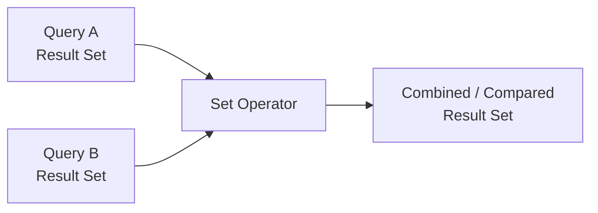
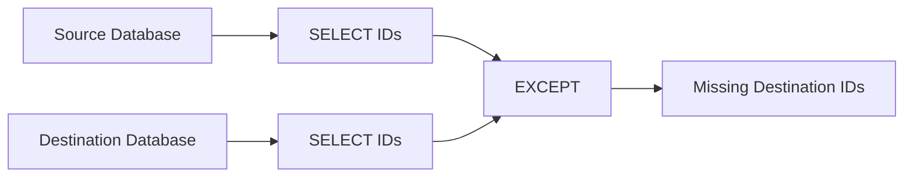
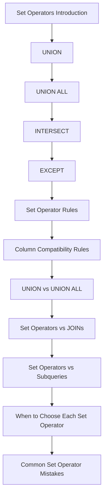

# README

## Overview

Set operators combine or compare the results of multiple `SELECT` statements using **set-oriented semantics**. They are useful when independent queries represent different populations, sources, or states that need to be combined or compared.

This section focuses on the four primary SQL set operators:

| Operator | Purpose | Duplicates |
| --- | --- | --- |
| `UNION` | Combine result sets and remove duplicate rows | Removed |
| `UNION ALL` | Combine result sets while preserving every row | Preserved |
| `INTERSECT` | Return rows present in both result sets | Removed |
| `EXCEPT` | Return rows present in the first result but absent from the second | Removed |

Set operators are particularly useful for:

- Combining data from current and historical tables.
- Reconciling source and destination datasets.
- Finding common populations.
- Detecting missing records.
- Building reporting datasets from independent sources.
- Comparing datasets during migrations and data-quality checks.

The central distinction is between **combining populations** and **relating rows**. Set operators work on result sets; `JOIN` works primarily on relationships between rows.

## Set Operator Model

A set operation can be viewed as operating on two result sets:



For example:

```sql
SELECT user_id
FROM mobile_users

UNION ALL

SELECT user_id
FROM web_users;
```

The database evaluates two independent query branches and combines their compatible result rows according to the operator's semantics.

The branches must generally return the same number of columns, and corresponding columns must have compatible data types.

## Set Operators at a Glance

| Operator | Mathematical Meaning | Typical Backend Use Case | Primary Concern |
| --- | --- | --- | --- |
| `UNION` | `A ∪ B` | Unique users across multiple sources | Deduplication cost |
| `UNION ALL` | `A ∪ B` with multiplicity | Combining events or partitioned data | Result size |
| `INTERSECT` | `A ∩ B` | Users satisfying multiple independent populations | Deduplication |
| `EXCEPT` | `A − B` | Finding records missing from another dataset | Direction matters |

## Documentation Map

### Fundamentals

| Document | Focus |
| --- | --- |
| [01- Set Operators Introduction](./01-%20Set%20Operators%20Introduction.md) | Set-based thinking, operator overview, syntax, and core semantics |
| [02- UNION](./02-%20UNION.md) | Combining result sets while removing duplicate rows |
| [03- UNION ALL](./03-%20UNION%20ALL.md) | Combining result sets while preserving duplicates |

### Set Comparison Operators

| Document | Focus |
| --- | --- |
| [04- INTERSECT](./04-%20INTERSECT.md) | Finding rows common to multiple result sets |
| [05- EXCEPT](./05-%20EXCEPT.md) | Finding rows present in one result set but absent from another |

### Rules and Compatibility

| Document | Focus |
| --- | --- |
| [06- Set Operator Rules](./06-%20Set%20Operator%20Rules.md) | General syntax, evaluation rules, ordering, and operator behavior |
| [07- Column Compatibility Rules](./07-%20Column%20Compatibility%20Rules.md) | Column count, data types, aliases, casts, and result-shape compatibility |

### Choosing the Right Construct

| Document | Focus |
| --- | --- |
| [08- UNION vs UNION ALL](./08-%20UNION%20vs%20UNION%20ALL.md) | Duplicate semantics, performance, and production decision-making |
| [09- Set Operators vs JOINs](./09-%20Set%20Operators%20vs%20JOINs.md) | Choosing between population operations and relational joins |
| [10- Set Operators vs Subqueries](./10-%20Set%20Operators%20vs%20Subqueries.md) | Comparing set operations with subqueries and existence-based logic |
| [11- When to Choose Each Set Operator](./11-%20When%20to%20Choose%20Each%20Set%20Operator.md) | Practical operator selection by business requirement |
| [12- Common Set Operator Mistakes](./12-%20Common%20Set%20Operator%20Mistakes.md) | Common correctness, security, and performance failures |

## Core Syntax

### `UNION`

```sql
SELECT user_id
FROM mobile_users

UNION

SELECT user_id
FROM web_users;
```

Use when duplicate complete rows should be removed.

### `UNION ALL`

```sql
SELECT user_id
FROM mobile_users

UNION ALL

SELECT user_id
FROM web_users;
```

Use when every occurrence should be retained and deduplication is unnecessary.

### `INTERSECT`

```sql
SELECT user_id
FROM premium_users

INTERSECT

SELECT user_id
FROM active_users;
```

Use when the requirement is membership in both populations.

### `EXCEPT`

```sql
SELECT user_id
FROM source_users

EXCEPT

SELECT user_id
FROM destination_users;
```

Use when identifying members of the first population that are absent from the second.

`EXCEPT` is directional:

```text
A EXCEPT B ≠ B EXCEPT A
```

This is particularly important for data migration and reconciliation queries.

## Result Compatibility

Set-operation branches must produce compatible result structures.

A typical compatible query is:

```sql
SELECT
    user_id,
    created_at
FROM users

UNION ALL

SELECT
    customer_id,
    created_at
FROM customers;
```

The column names do not need to match, but corresponding positions must represent compatible values.

For production queries, verify:

- Same number of output columns.
- Compatible data types.
- Equivalent business meaning for corresponding columns.
- Appropriate precision and scale.
- Explicit casts where schema differences require them.
- Stable aliases for downstream consumers.

Avoid using a set operator merely because two queries happen to return the same number of columns. **Structural compatibility does not guarantee semantic compatibility.**

## Duplicates and Set Semantics

The most important distinction is whether duplicates represent meaningful occurrences.

Consider event data:

```sql
SELECT
    event_id,
    user_id,
    event_type
FROM current_events

UNION ALL

SELECT
    event_id,
    user_id,
    event_type
FROM archived_events;
```

`UNION ALL` is generally appropriate when each row represents an event occurrence.

For entity membership:

```sql
SELECT user_id
FROM mobile_users

UNION

SELECT user_id
FROM web_users;
```

`UNION` may be appropriate when the required result is one row per user.

However, `UNION` removes duplicate **complete rows**, not duplicates according to an arbitrary business key.

If these rows exist:

```text
101 | mobile
101 | web
```

they remain distinct because the complete rows differ.

## Set Operators vs Relational Operations

Set operators and relational operations answer different questions.

| Requirement | Preferred Construct |
| --- | --- |
| Combine populations | `UNION` / `UNION ALL` |
| Find common population | `INTERSECT` |
| Find missing population | `EXCEPT` |
| Retrieve attributes from related rows | `JOIN` |
| Check whether a related row exists | `EXISTS` |
| Check whether no related row exists | `NOT EXISTS` |
| Filter individual rows | `WHERE` |

For example, this asks a population question:

```sql
SELECT user_id
FROM premium_users

INTERSECT

SELECT user_id
FROM active_users;
```

While this asks for relational attributes:

```sql
SELECT
    u.user_id,
    u.email,
    s.plan_id
FROM users AS u
JOIN subscriptions AS s
    ON s.user_id = u.user_id;
```

Choosing the correct abstraction usually makes the query easier to understand, optimize, and maintain.

## Production Considerations

### Performance

`UNION` requires duplicate elimination, which can introduce sorting or hashing work.

`UNION ALL` does not need that deduplication step and is therefore generally cheaper when duplicates do not need to be removed.

For performance-sensitive queries, inspect the actual execution plan:

```sql
EXPLAIN (ANALYZE, BUFFERS)
SELECT user_id
FROM current_users

UNION ALL

SELECT user_id
FROM archived_users;
```

Consider:

- Input cardinality.
- Row width.
- Sort or hash operations.
- Memory consumption.
- Temporary disk usage.
- Predicate selectivity.
- Index usage.
- Parallel execution.
- Result-set size.

Do not optimize based solely on the operator name.

### Security and Multi-Tenancy

Every branch is an independent query boundary.

This is unsafe:

```sql
SELECT user_id
FROM users
WHERE tenant_id = $1

UNION ALL

SELECT user_id
FROM imported_users;
```

If `imported_users` contains multiple tenants, the second branch can bypass tenant isolation.

Apply security predicates consistently:

```sql
SELECT user_id
FROM users
WHERE tenant_id = $1

UNION ALL

SELECT user_id
FROM imported_users
WHERE tenant_id = $1;
```

The same principle applies to:

- Authorization filters.
- Soft deletion.
- Data classification.
- Regional restrictions.
- Row-level access policies.

### Ordering and Pagination

Set operations do not guarantee final row ordering unless an `ORDER BY` is applied to the final result.

Use:

```sql
SELECT user_id
FROM mobile_users

UNION ALL

SELECT user_id
FROM web_users

ORDER BY user_id;
```

If independent branch-level limits are required, isolate the branches:

```sql
(
    SELECT user_id
    FROM mobile_users
    ORDER BY user_id
    LIMIT 100
)

UNION ALL

(
    SELECT user_id
    FROM web_users
    ORDER BY user_id
    LIMIT 100
);
```

This distinction is important when implementing paginated APIs with Django, FastAPI, or other backend frameworks.

## Backend Engineering Applications

Set operators frequently appear in backend systems for:

- **Data migration:** compare source and destination populations.
- **Audit systems:** combine current and historical records.
- **Reporting:** combine independent datasets into one reporting stream.
- **Multi-source APIs:** merge results from structurally compatible sources.
- **Data reconciliation:** identify missing or common identifiers.
- **Analytics pipelines:** combine partitioned or staged data.
- **Operational tooling:** compare expected and observed resource populations.

A migration validation workflow may use:



For example:

```sql
SELECT customer_id
FROM legacy_customers

EXCEPT

SELECT customer_id
FROM customers;
```

An empty result means there are no source IDs absent from the destination, assuming the selected identifier is the correct reconciliation key.

## Operational Checklist

Before deploying a query using set operators, verify:

- **Semantics:** Does the selected operator match the business requirement?
- **Duplicates:** Are duplicate occurrences meaningful?
- **Direction:** Is `EXCEPT` oriented correctly?
- **Compatibility:** Are branch columns structurally and semantically compatible?
- **NULLs:** Has nullable-key behavior been considered?
- **Ordering:** Does the application require deterministic ordering?
- **Pagination:** Is `LIMIT` applied at the correct level?
- **Security:** Does every branch enforce tenant and authorization constraints?
- **Performance:** Has the execution plan been checked for large datasets?
- **Result size:** Can the combined result overwhelm the application or network?
- **Portability:** Is the syntax supported by the target database engine?
- **Testing:** Have empty, duplicate, disjoint, overlapping, and large datasets been tested?

## Common Interview Traps

### "`UNION` and `UNION ALL` are interchangeable"

False.

`UNION` removes duplicate complete rows; `UNION ALL` preserves them.

### "`UNION ALL` is always faster"

Too absolute.

It normally avoids duplicate elimination, but actual query performance depends on the entire execution plan and workload.

### "`EXCEPT` means `NOT EXISTS`"

Not exactly.

They can express overlapping business requirements, but `EXCEPT` compares result populations while `NOT EXISTS` expresses correlated existence logic.

### "`INTERSECT` is just another type of `JOIN`"

Not exactly.

`INTERSECT` answers a set-membership question. A `JOIN` combines related rows and can expose columns from both relations.

### "`UNION` returns unique values"

Only relative to the projected complete row.

```sql
SELECT user_id, source
FROM a

UNION

SELECT user_id, source
FROM b;
```

The same `user_id` can appear multiple times when `source` differs.

## Recommended Learning Order

The documents in this folder are intentionally ordered from fundamental semantics toward production decision-making:



The progression moves from syntax and semantics to **query design, correctness, performance, security, and production usage**.

## Navigation

- [01- Set Operators Introduction](./01-%20Set%20Operators%20Introduction.md)
- [02- UNION](./02-%20UNION.md)
- [03- UNION ALL](./03-%20UNION%20ALL.md)
- [04- INTERSECT](./04-%20INTERSECT.md)
- [05- EXCEPT](./05-%20EXCEPT.md)
- [06- Set Operator Rules](./06-%20Set%20Operator%20Rules.md)
- [07- Column Compatibility Rules](./07-%20Column%20Compatibility%20Rules.md)
- [08- UNION vs UNION ALL](./08-%20UNION%20vs%20UNION%20ALL.md)
- [09- Set Operators vs JOINs](./09-%20Set%20Operators%20vs%20JOINs.md)
- [10- Set Operators vs Subqueries](./10-%20Set%20Operators%20vs%20Subqueries.md)
- [11- When to Choose Each Set Operator](./11-%20When%20to%20Choose%20Each%20Set%20Operator.md)
- [12- Common Set Operator Mistakes](./12-%20Common%20Set%20Operator%20Mistakes.md)

---

## Key Takeaways

- **Set operators compare or combine result populations; use `JOIN`, `EXISTS`, and `NOT EXISTS` when the requirement is relational or existence-based.**
- **`UNION` removes duplicate complete rows, while `UNION ALL` preserves multiplicity and is generally preferable when deduplication is unnecessary.**
- **`INTERSECT` identifies common membership, while `EXCEPT` performs directional set subtraction and is especially useful for reconciliation.**
- **Every branch must satisfy structural compatibility and production constraints such as tenant isolation, filtering, type compatibility, and result-size limits.**
- **Correct set-operator usage depends on business semantics first, followed by execution-plan analysis for performance-sensitive workloads.**