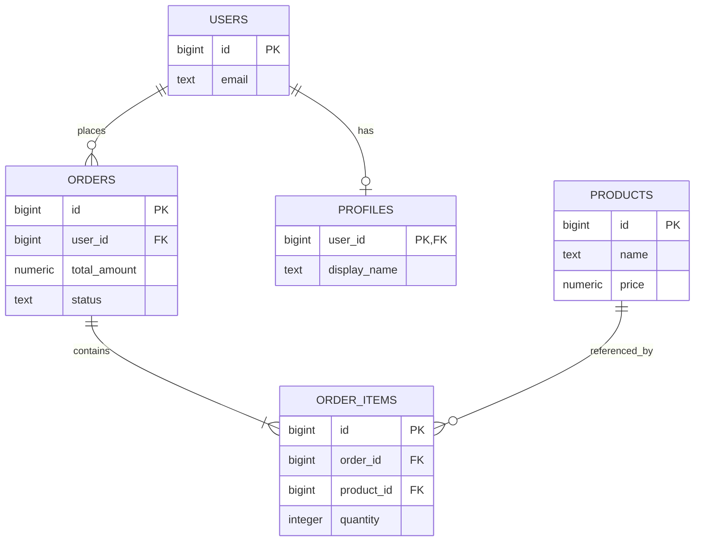

# 01- JOIN Fundamentals

## Overview

A `JOIN` combines rows from two or more relational sources based on a relationship between their columns. It is one of the core mechanisms for composing SQL queries across normalized schemas.

In production backend systems, joins are used constantly:

- Fetching users with their subscriptions.
- Loading orders with customer information.
- Combining products with inventory.
- Building reporting datasets.
- Resolving relationships across microservice-owned or replicated data.
- Enforcing business rules based on related records.

A join does more than "connect two tables." The choice of join type, join predicate, filtering location, cardinality, and available indexes directly affects **correctness, result cardinality, latency, memory consumption, and database cost**.

The fundamental model is:

```text
Table A
   │
   │ join condition
   ▼
JOIN operation
   ▲
   │ join condition
   │
Table B
   │
   ▼
Combined result
```

For example:

```sql
SELECT
    u.id,
    u.email,
    s.plan_id
FROM users AS u
JOIN subscriptions AS s
    ON s.user_id = u.id;
```

The database identifies rows satisfying the join predicate and produces a combined result containing columns from both sources.

## Why JOINs Matter

Relational databases are commonly normalized so that one business entity is represented across multiple tables.

A simplified backend schema might look like:



A request such as:

> Return an order with the customer's email and the products purchased.

requires data from several relations.

```sql
SELECT
    o.id AS order_id,
    u.email,
    p.name AS product_name,
    oi.quantity
FROM orders AS o
JOIN users AS u
    ON u.id = o.user_id
JOIN order_items AS oi
    ON oi.order_id = o.id
JOIN products AS p
    ON p.id = oi.product_id
WHERE o.id = $1;
```

This is the normal relational workflow: **store related information separately, then reconstruct the required view at query time.**

## Basic JOIN Syntax

The canonical form is:

```sql
SELECT
    columns
FROM table_a AS a
JOIN table_b AS b
    ON b.key = a.key;
```

`JOIN` without an explicit type is equivalent to `INNER JOIN` in standard SQL.

The `ON` clause defines the relationship used to match rows.

For example:

```sql
SELECT
    u.id,
    u.email,
    o.id AS order_id
FROM users AS u
INNER JOIN orders AS o
    ON o.user_id = u.id;
```

The aliases make the relationship explicit:

```text
users.id
    │
    │ = orders.user_id
    ▼
users ───────── orders
```

## How a JOIN Works

At the logical SQL level, a join combines rows according to a join predicate.

For an inner join:

```sql
FROM users AS u
JOIN orders AS o
    ON o.user_id = u.id
```

the conceptual result contains every pair of rows for which:

```text
o.user_id = u.id
```

If one user has three matching orders, that user produces three result rows.

This is critical:

> A join does not necessarily preserve the number of rows from either input.

The output cardinality depends on the relationship between the inputs.

### One-to-One

```text
User A ─── Profile A
```

Typically produces one result row per matching user.

### One-to-Many

```text
User A ─── Order 1
        ├── Order 2
        └── Order 3
```

The user appears three times in the joined result.

### Many-to-Many

```text
User A ──┬── Role Admin
         └── Role Editor
```

A many-to-many relationship generally uses an association table and can multiply rows across both sides.

## JOIN Types

The primary join types are:

| JOIN type | Matching rows | Non-matching left rows | Non-matching right rows |
| --- | --- | --- | --- |
| `INNER JOIN` | Yes | Removed | Removed |
| `LEFT JOIN` | Yes | Preserved | Not preserved |
| `RIGHT JOIN` | Yes | Not preserved | Preserved |
| `FULL OUTER JOIN` | Yes | Preserved | Preserved |
| `CROSS JOIN` | Cartesian product | N/A | N/A |

In day-to-day backend development, `INNER JOIN` and `LEFT JOIN` are by far the most common. `RIGHT JOIN` is usually avoidable by reversing table order, while `FULL OUTER JOIN` is useful for reconciliation and comparison workloads.

## INNER JOIN

An `INNER JOIN` returns only rows having a match on both sides.

```sql
SELECT
    u.id,
    u.email,
    o.id AS order_id
FROM users AS u
INNER JOIN orders AS o
    ON o.user_id = u.id;
```

If a user has no orders, that user is absent from the result.

Conceptually:

```text
Users             Orders
─────             ──────
A ──────────────── 1
B ──────────────── 2
C
```

Result:

```text
A | 1
B | 2
```

### When to Use

Use `INNER JOIN` when the related record is required for the result.

Examples:

- Orders that belong to valid customers.
- Payments associated with invoices.
- Products associated with existing categories.
- Employees assigned to departments.

### Advantages

- Expresses mandatory relationships clearly.
- Usually produces a smaller result set.
- Allows the optimizer significant flexibility in join ordering and execution strategy.

### Limitation

Rows without a match disappear.

This is the most common semantic mistake when developers actually need a `LEFT JOIN`.

## LEFT JOIN

A `LEFT JOIN` preserves every row from the left side and adds matching data from the right side when available.

```sql
SELECT
    u.id,
    u.email,
    o.id AS order_id
FROM users AS u
LEFT JOIN orders AS o
    ON o.user_id = u.id;
```

If a user has no order, the order columns become `NULL`.

```text
Users             Orders
─────             ──────
A ──────────────── 1
B ──────────────── 2
C

Result

A | 1
B | 2
C | NULL
```

### When to Use

Use `LEFT JOIN` when the left-side entity must remain visible even if the related entity does not exist.

Common examples:

- All users, including users without orders.
- All products, including products without inventory.
- All customers, including customers without subscriptions.
- Optional profile information.

### Finding Missing Relationships

A common pattern is:

```sql
SELECT
    u.id,
    u.email
FROM users AS u
LEFT JOIN orders AS o
    ON o.user_id = u.id
WHERE o.id IS NULL;
```

This identifies users with no matching orders.

For pure existence checks, `NOT EXISTS` may communicate intent more directly and can have different optimization characteristics:

```sql
SELECT
    u.id,
    u.email
FROM users AS u
WHERE NOT EXISTS (
    SELECT 1
    FROM orders AS o
    WHERE o.user_id = u.id
);
```

The choice should be validated against the database's execution plan and the intended semantics.

## RIGHT JOIN

A `RIGHT JOIN` preserves every row from the right side.

```sql
SELECT
    u.id,
    u.email,
    o.id AS order_id
FROM users AS u
RIGHT JOIN orders AS o
    ON o.user_id = u.id;
```

It is logically equivalent to reversing the table order and using `LEFT JOIN`:

```sql
SELECT
    u.id,
    u.email,
    o.id AS order_id
FROM orders AS o
LEFT JOIN users AS u
    ON u.id = o.user_id;
```

Because `LEFT JOIN` generally reads more naturally, many teams standardize on it and avoid `RIGHT JOIN`.

## FULL OUTER JOIN

A `FULL OUTER JOIN` preserves matching and non-matching rows from both sides.

```sql
SELECT
    a.id AS source_id,
    b.id AS target_id
FROM source_records AS a
FULL OUTER JOIN target_records AS b
    ON b.external_id = a.external_id;
```

Conceptually:

```text
Source-only     Matched       Target-only
    A              B              C
    │              │              │
    └──────────────┼──────────────┘
                   ▼
             FULL OUTER JOIN
```

This is particularly useful for:

- Data reconciliation.
- Migration validation.
- Comparing datasets.
- Synchronization diagnostics.

Database support varies, so portability should be considered when targeting multiple SQL engines.

## CROSS JOIN

A `CROSS JOIN` creates the Cartesian product of two relations.

```sql
SELECT
    c.id AS customer_id,
    p.id AS plan_id
FROM customers AS c
CROSS JOIN plans AS p;
```

If there are:

```text
1,000 customers
10 plans
```

the conceptual result contains:

```text
1,000 × 10 = 10,000 rows
```

### Legitimate Uses

Cartesian products can be useful for:

- Generating combinations.
- Creating reporting dimensions.
- Building test matrices.
- Producing schedules across independent dimensions.

### Production Risk

An accidental Cartesian product can create enormous intermediate results.

This query is dangerous:

```sql
SELECT *
FROM users, orders;
```

If `users` contains 1 million rows and `orders` contains 5 million rows, the conceptual product contains:

```text
5,000,000,000,000 rows
```

Avoid implicit joins unless a Cartesian product is explicitly intended.

## JOIN Predicate

The `ON` clause determines which rows are related.

A typical foreign-key relationship is:

```sql
SELECT
    o.id,
    u.email
FROM orders AS o
JOIN users AS u
    ON u.id = o.user_id;
```

The best join predicate generally connects keys representing the same business relationship.

### Composite Relationships

Some relationships require multiple columns:

```sql
SELECT
    a.account_id,
    a.region,
    b.balance
FROM accounts AS a
JOIN account_balances AS b
    ON b.account_id = a.account_id
   AND b.region = a.region;
```

If only part of the relationship is included, unrelated rows can match.

This can silently produce incorrect data rather than a SQL error.

## JOIN Conditions vs WHERE Conditions

The location of a predicate matters, especially with outer joins.

Consider:

```sql
SELECT
    u.id,
    o.id AS order_id
FROM users AS u
LEFT JOIN orders AS o
    ON o.user_id = u.id
WHERE o.status = 'completed';
```

The `WHERE` condition removes rows where `o.status` is `NULL`, effectively eliminating users without matching orders.

This behaves much more like an inner join for that condition.

Compare:

```sql
SELECT
    u.id,
    o.id AS order_id
FROM users AS u
LEFT JOIN orders AS o
    ON o.user_id = u.id
   AND o.status = 'completed';
```

Now all users remain, but only completed orders are attached.

### Practical Rule

When using an outer join:

- Put predicates that define **which related rows qualify** in `ON`.
- Put predicates that define **which final rows should survive** in `WHERE`.

The distinction is semantic, not merely stylistic.

## JOIN Cardinality

Understanding cardinality is essential for senior-level SQL work.

Suppose:

```text
users
  1
  │
  ├── order 101
  ├── order 102
  └── order 103
```

This query:

```sql
SELECT
    u.id,
    o.id
FROM users AS u
JOIN orders AS o
    ON o.user_id = u.id;
```

produces three rows for that user.

If you then join another one-to-many relation:

```sql
SELECT
    u.id,
    o.id AS order_id,
    p.id AS payment_id
FROM users AS u
JOIN orders AS o
    ON o.user_id = u.id
JOIN payments AS p
    ON p.user_id = u.id;
```

a user with:

```text
3 orders
2 payments
```

can produce:

```text
3 × 2 = 6 rows
```

This is **row multiplication**, not necessarily a database bug.

If the business requirement is one row per user, the query must account for that cardinality explicitly.

## Avoiding Accidental Row Multiplication

Suppose the requirement is:

> Return each user and their total number of orders.

Do not return all order rows and deduplicate later in application code.

Use aggregation:

```sql
SELECT
    u.id,
    u.email,
    COUNT(o.id) AS order_count
FROM users AS u
LEFT JOIN orders AS o
    ON o.user_id = u.id
GROUP BY
    u.id,
    u.email;
```

The `LEFT JOIN` ensures users with zero orders are retained.

This is preferable to:

```python
# Avoid loading every order into Python just to count them.
```

Database-side aggregation reduces:

- Network transfer.
- Application memory usage.
- Python processing.
- Serialization overhead.

## JOIN Execution Strategies

The SQL query expresses **what** should be returned. The optimizer determines **how** to execute it.

Common physical join algorithms include:

| Algorithm | General idea | Often useful when |
| --- | --- | --- |
| Nested Loop | Scan one side and find matches in the other | Outer side is small or inner side is efficiently indexed |
| Hash Join | Build a hash structure for one input and probe it with the other | Large equality joins |
| Merge Join | Walk sorted inputs together | Inputs are already sorted or can be efficiently produced in order |

For example, PostgreSQL may choose a hash join:

```text
Input A
   │
   ▼
Build hash table
   │
   ▼
Probe with Input B
   │
   ▼
Joined result
```

Or a nested loop:

```text
Outer row
   │
   ├── lookup inner rows
   ├── lookup inner rows
   └── lookup inner rows
```

You should not manually assume which strategy the database will use. Inspect the execution plan.

```sql
EXPLAIN (ANALYZE, BUFFERS)
SELECT
    o.id,
    u.email
FROM orders AS o
JOIN users AS u
    ON u.id = o.user_id
WHERE o.created_at >= CURRENT_DATE - INTERVAL '7 days';
```

## Indexing for JOINs

Indexes can significantly improve join performance, but indexing every join column indiscriminately is not a good strategy.

A common schema is:

```sql
CREATE TABLE orders (
    id bigint PRIMARY KEY,
    user_id bigint NOT NULL,
    created_at timestamptz NOT NULL
);
```

An index may be useful for:

```sql
CREATE INDEX idx_orders_user_id
ON orders (user_id);
```

This can help queries such as:

```sql
SELECT
    o.id,
    o.created_at
FROM orders AS o
JOIN users AS u
    ON u.id = o.user_id
WHERE u.id = $1;
```

Primary keys and unique constraints commonly provide indexes on the referenced side. Foreign-key columns do **not universally receive an automatic index**, depending on the database and schema definition, so verify indexing explicitly.

### Indexing Considerations

Evaluate:

- Join column cardinality.
- Filtering predicates.
- Query frequency.
- Table size.
- Write volume.
- Index maintenance cost.
- Composite index ordering.
- Actual execution plans.

Indexes improve reads but add storage and write overhead.

## Filtering Before Joining

Filtering can reduce the amount of data participating in a join.

For example:

```sql
SELECT
    o.id,
    u.email
FROM orders AS o
JOIN users AS u
    ON u.id = o.user_id
WHERE o.status = 'completed'
  AND o.created_at >= $1;
```

A good optimizer may push predicates toward the relevant scan automatically.

The important engineering principle is to **express selective predicates clearly and inspect the execution plan**, rather than manually rewriting queries based on assumptions about optimizer behavior.

## JOINs in Backend APIs

Consider a FastAPI endpoint:

```python
from fastapi import FastAPI
from psycopg import Connection

app = FastAPI()

@app.get("/orders/{order_id}")
def get_order(order_id: int, conn: Connection):
    with conn.cursor() as cursor:
        cursor.execute(
            """
            SELECT
                o.id,
                o.total_amount,
                u.email
            FROM orders AS o
            JOIN users AS u
                ON u.id = o.user_id
            WHERE o.id = %s
            """,
            (order_id,),
        )
        row = cursor.fetchone()

    return row
```

The SQL join allows the database to return the required relational data in one query.

The same principle applies to Django ORM:

```python
order = (
    Order.objects
    .select_related("user")
    .get(id=order_id)
)
```

`select_related()` typically translates relationship traversal into SQL joins for foreign-key and one-to-one relationships.

For collection relationships, Django commonly uses `prefetch_related()` instead, which uses additional queries rather than a single SQL join.

The important backend distinction is:

```text
SQL JOIN
    ↓
Database-side relational composition

ORM eager loading
    ↓
Framework strategy for controlling query count and data loading
```

## JOINs and the N+1 Query Problem

A common application-level failure is issuing one query for the parent records and one query per parent.

Conceptually:

```text
SELECT users
       │
       ├── SELECT orders WHERE user_id = 1
       ├── SELECT orders WHERE user_id = 2
       ├── SELECT orders WHERE user_id = 3
       └── ...
```

For 1,000 users, this can produce approximately 1,001 queries.

A relational query can often reduce the workload:

```sql
SELECT
    u.id,
    u.email,
    o.id AS order_id
FROM users AS u
LEFT JOIN orders AS o
    ON o.user_id = u.id
WHERE u.id = ANY($1);
```

However, a join is not automatically the correct solution. Large one-to-many relationships can produce very wide or highly duplicated result sets. In ORM applications, `prefetch_related()` may be more appropriate because it retrieves related collections separately and combines them in application memory.

## JOINs Across Large Tables

For large production tables, focus on:

- Cardinality estimates.
- Selective predicates.
- Appropriate indexes.
- Join key data types.
- Statistics freshness.
- Memory available to the database.
- Intermediate result size.
- Query concurrency.

A query joining two large tables may be fast when highly selective:

```sql
WHERE orders.id = $1
```

but expensive when scanning millions of rows:

```sql
WHERE orders.created_at >= $1
```

The correct optimization depends on the actual workload.

Use:

```sql
EXPLAIN (ANALYZE, BUFFERS)
```

to understand:

- Actual vs estimated rows.
- Scan methods.
- Join algorithm.
- Buffer activity.
- Sorts.
- Hash operations.
- Execution time.

## Data Type Compatibility

Join columns should normally use compatible data types.

Prefer:

```sql
users.id bigint
orders.user_id bigint
```

over mismatched definitions such as:

```text
users.id        bigint
orders.user_id  text
```

Mismatched types can cause:

- Implicit casts.
- Reduced index effectiveness.
- Poor execution plans.
- Runtime errors.
- Incorrect comparison semantics.

Use consistent key types across related tables.

## NULL Semantics

`NULL` does not equal `NULL` in normal SQL equality comparison.

Therefore:

```sql
ON a.code = b.code
```

does not match two rows where both `code` values are `NULL`.

If nullable join keys are part of a legitimate business relationship, use database-specific null-safe comparison where appropriate. For example, PostgreSQL supports:

```sql
ON a.code IS NOT DISTINCT FROM b.code
```

Do not add null-safe logic casually. A nullable foreign key usually means that the relationship is optional, not that two missing values should be considered the same entity.

## Self JOIN

A table can be joined to itself.

For example, an employee hierarchy:

```sql
SELECT
    employee.id,
    employee.name,
    manager.name AS manager_name
FROM employees AS employee
LEFT JOIN employees AS manager
    ON manager.id = employee.manager_id;
```

Aliases are mandatory for clarity because the same table participates twice.

Self joins are useful for:

- Hierarchies.
- Parent-child relationships.
- Comparing rows within one table.
- Detecting related records.

## Multiple JOINs

Production queries commonly contain several joins:

```sql
SELECT
    o.id AS order_id,
    u.email,
    p.name AS product_name,
    oi.quantity
FROM orders AS o
JOIN users AS u
    ON u.id = o.user_id
JOIN order_items AS oi
    ON oi.order_id = o.id
JOIN products AS p
    ON p.id = oi.product_id
WHERE o.status = 'paid';
```

Each join introduces another relationship.

Before adding a join, identify:

1. What entity does it represent?
2. What relationship connects it?
3. Is the relationship one-to-one, one-to-many, or many-to-many?
4. Can the join multiply rows?
5. Is the related data actually required?
6. Does the query preserve the intended business cardinality?

This reasoning prevents many subtle production bugs.

## JOIN vs EXISTS

A join and an existence predicate can produce similar-looking requirements but have different semantics.

Suppose the requirement is:

> Return users who have at least one paid order.

A join can express it:

```sql
SELECT DISTINCT
    u.id,
    u.email
FROM users AS u
JOIN orders AS o
    ON o.user_id = u.id
WHERE o.status = 'paid';
```

But `EXISTS` expresses the requirement more directly:

```sql
SELECT
    u.id,
    u.email
FROM users AS u
WHERE EXISTS (
    SELECT 1
    FROM orders AS o
    WHERE o.user_id = u.id
      AND o.status = 'paid'
);
```

The join produces matching rows and may require deduplication. `EXISTS` asks whether at least one matching row exists.

Use the construct that best represents the business semantics, then verify performance using the execution plan.

## JOIN vs Set Operators

JOINs and set operators solve different problems.

| Requirement | Typical construct |
| --- | --- |
| Combine related columns | `JOIN` |
| Combine independent populations | `UNION` / `UNION ALL` |
| Find common populations | `INTERSECT` |
| Find missing populations | `EXCEPT` |
| Check relationship existence | `EXISTS` |
| Check relationship absence | `NOT EXISTS` |

For example:

```sql
-- JOIN: retrieve attributes from a related table.
SELECT
    o.id,
    u.email
FROM orders AS o
JOIN users AS u
    ON u.id = o.user_id;
```

Versus:

```sql
-- UNION: combine compatible result populations.
SELECT user_id
FROM mobile_users

UNION

SELECT user_id
FROM web_users;
```

Choosing between them should start with the question being asked, not with syntax familiarity.

## Common JOIN Mistakes

### Missing the JOIN Predicate

This:

```sql
SELECT *
FROM users
JOIN orders;
```

is invalid in many SQL dialects unless an explicit cross join form is used.

An accidental Cartesian product can be much worse than a syntax error.

Use:

```sql
JOIN orders AS o
    ON o.user_id = u.id
```

when a relationship is intended.

### Joining on the Wrong Column

This is syntactically valid but potentially incorrect:

```sql
JOIN orders AS o
    ON o.id = u.id;
```

A query can return plausible-looking data while violating the business relationship.

Validate joins against primary-key and foreign-key semantics.

### Turning a LEFT JOIN into an INNER JOIN

This common pattern:

```sql
FROM users AS u
LEFT JOIN orders AS o
    ON o.user_id = u.id
WHERE o.status = 'paid'
```

removes users without orders.

If all users must remain, move the related-row condition into `ON`:

```sql
FROM users AS u
LEFT JOIN orders AS o
    ON o.user_id = u.id
   AND o.status = 'paid'
```

### Ignoring Cardinality

Joining multiple one-to-many relationships can multiply rows.

Never assume:

```text
1 user = 1 joined row
```

unless the query and schema guarantee that relationship.

### Using DISTINCT to Hide a Bad Join

This:

```sql
SELECT DISTINCT u.id
FROM users AS u
JOIN orders AS o
    ON o.user_id = u.id;
```

may be correct if the actual requirement is unique users.

But `DISTINCT` should not be used blindly to conceal accidental row multiplication.

First determine why duplicates exist.

### Joining Unnecessary Tables

Every unnecessary join can increase:

- Query complexity.
- Planning complexity.
- Execution work.
- Intermediate result size.
- Maintenance cost.

Join only the relations needed to answer the query.

### Ignoring Indexes

A correct join can still become operationally expensive when large tables lack useful access paths.

Review indexes alongside the execution plan rather than adding indexes mechanically.

## Production Best Practices

### Make Relationships Explicit

Prefer:

```sql
JOIN orders AS o
    ON o.user_id = u.id
```

over implicit comma joins.

### Use Meaningful Aliases

Prefer:

```sql
FROM orders AS o
JOIN users AS u
```

over:

```sql
FROM orders AS x
JOIN users AS y
```

Good aliases make complex queries easier to review.

### Qualify Columns

Prefer:

```sql
SELECT
    u.id,
    o.id AS order_id
```

over:

```sql
SELECT
    id
```

Qualification avoids ambiguity and makes query intent clearer.

### Select Only Required Columns

Avoid:

```sql
SELECT *
```

in production APIs and services.

Prefer:

```sql
SELECT
    o.id,
    o.total_amount,
    u.email
```

This reduces:

- Network transfer.
- Serialization cost.
- Application memory.
- Accidental exposure of columns.
- Coupling to schema changes.

### Validate Query Plans

For performance-sensitive queries:

```sql
EXPLAIN (ANALYZE, BUFFERS)
SELECT
    ...
```

Test against realistic data volumes, not only local development datasets.

### Keep Transactions Intentional

JOINs participate in the transaction and isolation context of the surrounding statement or transaction.

For critical workflows:

- Understand isolation requirements.
- Avoid unnecessarily long transactions.
- Avoid holding locks while performing unrelated application work.
- Monitor long-running queries.
- Understand how concurrent writes affect the query.

## Security Considerations

JOINs can expose sensitive information when authorization boundaries are not represented correctly.

For multi-tenant systems, every relevant table must be constrained appropriately.

For example:

```sql
SELECT
    o.id,
    u.email
FROM orders AS o
JOIN users AS u
    ON u.id = o.user_id
WHERE o.tenant_id = $1
  AND u.tenant_id = $1
  AND o.id = $2;
```

However, duplicating tenant predicates manually across every query is error-prone. Mature systems may use:

- PostgreSQL Row-Level Security.
- Repository-level query abstractions.
- Database views.
- Strong foreign-key relationships.
- Application authorization layers.

Also avoid interpolating user-controlled values into SQL:

```python
# Unsafe:
query = f"SELECT * FROM orders WHERE id = {order_id}"
```

Use parameterized queries:

```python
cursor.execute(
    "SELECT * FROM orders WHERE id = %s",
    (order_id,),
)
```

JOIN syntax does not protect an application from SQL injection; parameterization does.

## Observability

JOIN-heavy queries should be observable in production.

Useful metrics include:

- Query latency.
- Execution count.
- Rows returned.
- Rows examined or scanned.
- Buffer reads.
- Temporary file usage.
- Lock wait time.
- Database CPU.
- Connection pool utilization.

For PostgreSQL, tools such as `pg_stat_statements` can help identify expensive recurring queries.

At the application level, monitor:

```text
HTTP request
    │
    ▼
Django / FastAPI
    │
    ▼
Connection pool
    │
    ▼
SQL query with JOINs
    │
    ▼
Database execution
    │
    ▼
Rows returned
    │
    ▼
Serialization
    │
    ▼
HTTP response
```

This makes it possible to distinguish a slow SQL join from:

- Connection pool exhaustion.
- Application serialization.
- Network latency.
- Excessive query count.
- Lock contention.

## Interview Traps

| Trap | Correct reasoning |
| --- | --- |
| `JOIN` always means `INNER JOIN` | Bare `JOIN` normally means `INNER JOIN` |
| `LEFT JOIN` always keeps every row | It preserves the left side unless later predicates remove those rows |
| Joining two tables preserves row count | One-to-many and many-to-many relationships can multiply rows |
| `DISTINCT` fixes duplicate data | It can hide an incorrect join or cardinality problem |
| Foreign keys automatically create indexes everywhere | Index behavior depends on the database; verify it |
| `JOIN` and `EXISTS` are identical | They can overlap semantically but express different operations |
| `RIGHT JOIN` is required for right-side preservation | Reversing table order and using `LEFT JOIN` often provides clearer SQL |
| More joins always mean a slower query | The optimizer, cardinality, indexes, predicates, and execution strategy determine actual cost |
| `SELECT *` is harmless | It increases data transfer, coupling, and accidental data exposure |
| An outer join's `WHERE` predicate is equivalent to its `ON` predicate | Predicate placement can change the result set substantially |

## Key Takeaways

- **A JOIN combines related rows; always identify the relationship and expected cardinality before writing the query.**
- **`INNER JOIN` removes unmatched rows, while `LEFT JOIN` preserves the left-side population; predicate placement can change outer-join semantics.**
- **One-to-many and many-to-many joins can multiply rows, so aggregation, `EXISTS`, or controlled pre-aggregation may be required when the desired result has lower cardinality.**
- **JOIN performance depends on cardinality, indexes, predicates, statistics, and the chosen execution strategy; use `EXPLAIN (ANALYZE, BUFFERS)` for production diagnosis.**
- **Treat joins as part of the application's correctness and security boundary: enforce authorization and tenant isolation, select only required columns, and use parameterized SQL.**