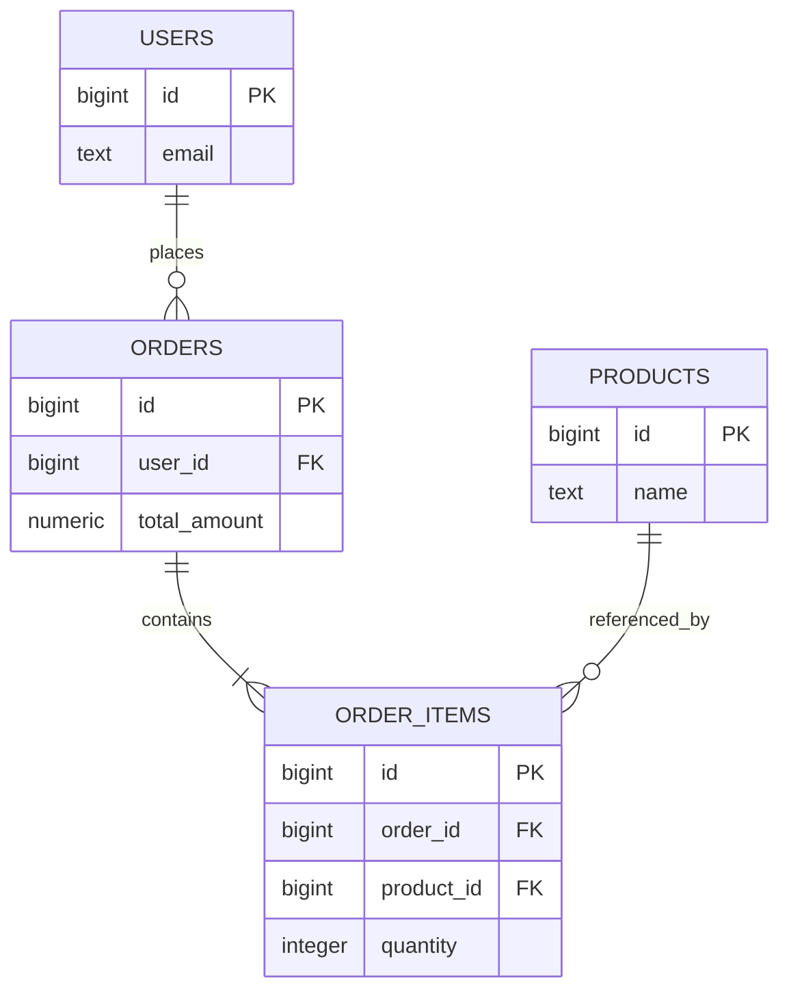
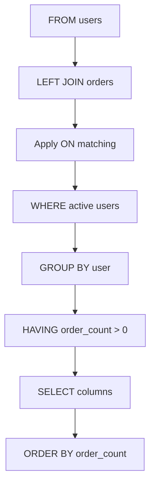
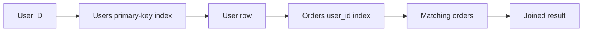
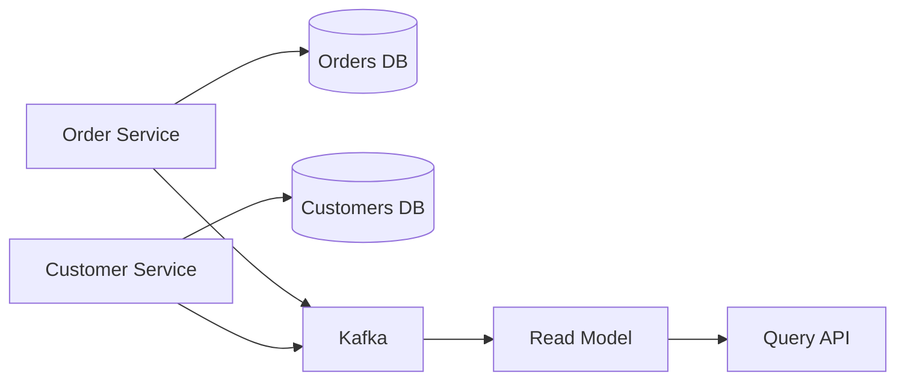
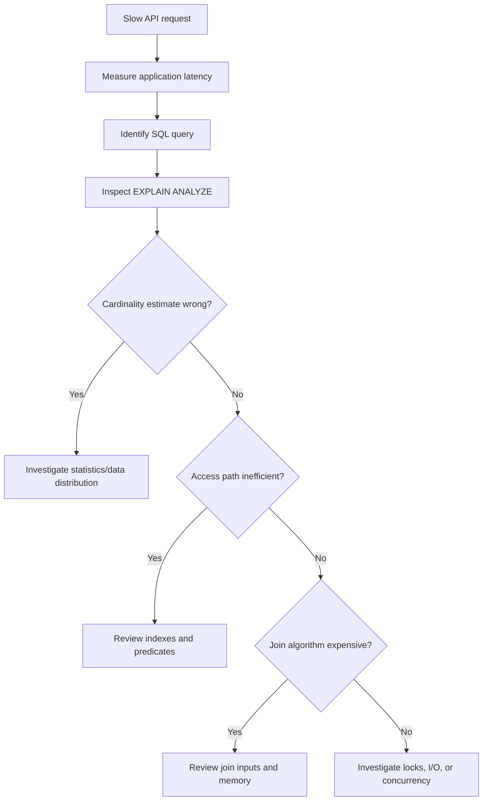

# 02- How JOINs Work

## Overview

A SQL `JOIN` combines rows from multiple relations according to a matching condition. It is the primary mechanism for reconstructing related business data from a normalized relational schema.

Understanding JOINs at a production level requires more than knowing `INNER JOIN` and `LEFT JOIN`. You need to reason about:

- Join predicates.
- Logical query processing.
- Row matching and cardinality.
- `NULL` behavior.
- Join order.
- Physical execution strategies.
- Indexes and statistics.
- Intermediate result size.
- Optimizer decisions.
- Application-level query patterns.

For example:

```sql
SELECT
    o.id AS order_id,
    u.email,
    o.total_amount
FROM orders AS o
JOIN users AS u
    ON u.id = o.user_id
WHERE o.id = $1;
```

Conceptually, the database must:

1. Identify candidate rows from `orders`.
2. Identify rows from `users` that satisfy `u.id = o.user_id`.
3. Combine the matching rows.
4. Apply the remaining query operations according to SQL's logical processing rules.
5. Return the requested columns.

The physical execution may look very different from this conceptual description. The optimizer can reorder joins, choose different scan methods, and select different join algorithms without changing the query's intended result.

## Relational Model Behind JOINs

Consider a normalized backend schema:



The relationships are:

```text
users.id
   │
   └──── orders.user_id

orders.id
   │
   └──── order_items.order_id

products.id
   │
   └──── order_items.product_id
```

A single API response may require data from all four tables:

```sql
SELECT
    o.id AS order_id,
    u.email,
    p.name,
    oi.quantity
FROM orders AS o
JOIN users AS u
    ON u.id = o.user_id
JOIN order_items AS oi
    ON oi.order_id = o.id
JOIN products AS p
    ON p.id = oi.product_id
WHERE o.id = $1;
```

The JOINs reconstruct a useful application-level representation from normalized storage.

## What the Database Is Actually Matching

An inner join can be viewed conceptually as evaluating combinations of rows and retaining combinations that satisfy the join predicate.

Given:

```text
users

id | email
---+----------------
1  | alice@example.com
2  | bob@example.com
3  | carol@example.com
```

and:

```text
orders

id  | user_id
----+--------
101 | 1
102 | 1
103 | 2
```

this query:

```sql
SELECT
    u.id AS user_id,
    o.id AS order_id
FROM users AS u
JOIN orders AS o
    ON o.user_id = u.id;
```

produces:

```text
user_id | order_id
--------+---------
1       | 101
1       | 102
2       | 103
```

User `3` disappears because there is no matching order.

The important observation is that the output represents **matching row pairs**, not simply a merged representation of the two tables.

## Join Cardinality

Cardinality describes how many rows can be associated with another row.

| Relationship | Example | Typical effect |
| --- | --- | --- |
| One-to-one | User → Profile | Usually one output row |
| One-to-many | User → Orders | Parent rows can repeat |
| Many-to-one | Orders → User | Many orders can reference one user |
| Many-to-many | Users → Roles | Rows can multiply on both sides |

Consider:

```text
User 1
 ├── Order 101
 ├── Order 102
 └── Order 103
```

A join produces:

```text
User 1 | Order 101
User 1 | Order 102
User 1 | Order 103
```

The repeated user data is not duplication in the relational sense. Each row represents a different relationship between a user and an order.

## Row Multiplication

Row multiplication becomes more dangerous when multiple one-to-many relationships are joined.

Suppose:

```text
User 1
 ├── Order 101
 ├── Order 102
 └── Order 103

User 1
 ├── Payment 201
 └── Payment 202
```

This query:

```sql
SELECT
    u.id,
    o.id AS order_id,
    p.id AS payment_id
FROM users AS u
JOIN orders AS o
    ON o.user_id = u.id
JOIN payments AS p
    ON p.user_id = u.id;
```

can produce:

```text
order 101 | payment 201
order 101 | payment 202
order 102 | payment 201
order 102 | payment 202
order 103 | payment 201
order 103 | payment 202
```

That is:

```text
3 orders × 2 payments = 6 rows
```

This matters when aggregating:

```sql
SUM(o.total_amount)
```

or:

```sql
COUNT(o.id)
```

because the joined payment relationship can cause values to be counted multiple times.

### Preventing Multiplication

Pre-aggregate one side when necessary:

```sql
WITH order_totals AS (
    SELECT
        user_id,
        COUNT(*) AS order_count,
        SUM(total_amount) AS order_value
    FROM orders
    GROUP BY user_id
)
SELECT
    u.id,
    u.email,
    COALESCE(ot.order_count, 0) AS order_count,
    COALESCE(ot.order_value, 0) AS order_value
FROM users AS u
LEFT JOIN order_totals AS ot
    ON ot.user_id = u.id;
```

The design principle is:

> Control cardinality before combining multiple one-to-many relationships.

## Logical Processing of JOINs

SQL is declarative. The order in which clauses appear in the query is not the same as the conceptual order in which the database evaluates them.

A simplified logical model is:

```text
FROM
  ↓
JOIN / ON
  ↓
WHERE
  ↓
GROUP BY
  ↓
HAVING
  ↓
SELECT
  ↓
DISTINCT
  ↓
ORDER BY
  ↓
LIMIT / OFFSET
```

For a query:

```sql
SELECT
    u.id,
    COUNT(o.id) AS order_count
FROM users AS u
LEFT JOIN orders AS o
    ON o.user_id = u.id
WHERE u.status = 'active'
GROUP BY u.id
HAVING COUNT(o.id) > 0
ORDER BY order_count DESC;
```

the conceptual flow is:



The actual execution plan does not have to follow this exact sequence. Query optimizers can transform the execution while preserving semantics.

## The ON Clause

The `ON` clause defines how rows are related.

```sql
JOIN orders AS o
    ON o.user_id = u.id
```

A simple equality predicate is common for primary-key/foreign-key relationships.

More complex relationships can contain additional conditions:

```sql
JOIN subscriptions AS s
    ON s.user_id = u.id
   AND s.status = 'active'
```

This means the join only considers active subscriptions as matching rows.

For outer joins, predicate placement becomes particularly important.

## ON vs WHERE

Compare these two queries.

### Predicate in ON

```sql
SELECT
    u.id,
    o.id AS order_id
FROM users AS u
LEFT JOIN orders AS o
    ON o.user_id = u.id
   AND o.status = 'completed';
```

This preserves all users and attaches only completed orders.

### Predicate in WHERE

```sql
SELECT
    u.id,
    o.id AS order_id
FROM users AS u
LEFT JOIN orders AS o
    ON o.user_id = u.id
WHERE o.status = 'completed';
```

For users without an order, `o.status` is `NULL`. The `WHERE` condition therefore removes those rows.

The second query effectively eliminates the unmatched side for this condition.

### Production Rule

For an outer join, ask:

> Should this predicate determine whether the related row matches, or whether the final result row survives?

If it controls matching, consider `ON`.

If it controls final result membership, consider `WHERE`.

## INNER JOIN Mechanics

An `INNER JOIN` retains only matching combinations.

```sql
SELECT
    u.id,
    u.email,
    o.id AS order_id
FROM users AS u
INNER JOIN orders AS o
    ON o.user_id = u.id;
```

Conceptually:

```text
Left rows       Right rows
   │                │
   └──── match ─────┘
          │
          ▼
    Matching pairs
```

Unmatched rows from either side are discarded.

### When to Use

Use an inner join when the related entity is required for the result.

Examples:

- Orders belonging to an existing customer.
- Invoice records associated with a payment.
- Products belonging to a valid category.
- Events associated with a known account.

## LEFT JOIN Mechanics

A `LEFT JOIN` first preserves the left-side population and then adds matching right-side rows.

```sql
SELECT
    u.id,
    u.email,
    o.id AS order_id
FROM users AS u
LEFT JOIN orders AS o
    ON o.user_id = u.id;
```

If there is no order:

```text
user_id | email             | order_id
--------+-------------------+---------
3       | carol@example.com | NULL
```

The `NULL` represents the absence of a matching right-side row.

This is useful for optional relationships and "find entities without related records" queries.

## FULL OUTER JOIN Mechanics

A full outer join preserves unmatched rows from both inputs:

```sql
SELECT
    a.external_id AS source_id,
    b.external_id AS target_id
FROM source_records AS a
FULL OUTER JOIN target_records AS b
    ON b.external_id = a.external_id;
```

Conceptually:

```text
Source-only     Matched       Target-only
    A              B              C
    │              │              │
    └──────────────┼──────────────┘
                   ▼
             Combined result
```

This is particularly useful for reconciliation workloads.

For example, comparing records from:

- A legacy database.
- A new database.
- A replicated dataset.
- An external integration.

## NULL and JOIN Matching

Standard equality does not treat `NULL` as equal to `NULL`.

```sql
ON a.code = b.code
```

If:

```text
a.code = NULL
b.code = NULL
```

the predicate does not evaluate to `TRUE`.

SQL uses three-valued logic:

```text
TRUE
FALSE
UNKNOWN
```

A `NULL = NULL` comparison evaluates to `UNKNOWN`.

PostgreSQL provides null-safe comparison:

```sql
ON a.code IS NOT DISTINCT FROM b.code
```

This treats two `NULL` values as matching.

Use this only when the business semantics genuinely define two missing values as equivalent.

## Join Algorithms

The SQL statement does not specify the physical algorithm used to execute a join.

Common algorithms include:

| Join algorithm | Basic mechanism | Typical strength |
| --- | --- | --- |
| Nested Loop | Repeatedly find matching inner rows | Small outer input or efficient indexed lookups |
| Hash Join | Build a hash table and probe it | Large equality joins |
| Merge Join | Walk sorted inputs together | Inputs already sorted or efficiently sortable |

### Nested Loop

Conceptually:

```text
Outer row 1
   └── search inner relation

Outer row 2
   └── search inner relation

Outer row 3
   └── search inner relation
```

An index can make the inner lookup efficient:

```text
Outer row
   │
   ▼
Index lookup
   │
   ▼
Matching inner rows
```

Nested loops can be excellent when the outer side is highly selective.

They can become expensive when a large outer relation causes many repeated inner scans.

### Hash Join

A hash join generally builds a hash structure from one input and probes it using the other.

```text
Input A
   │
   ▼
Build hash table
   │
   ├──────────────┐
                  │
Input B           │
   │              │
   ▼              │
Hash lookup ───────┘
   │
   ▼
Matching rows
```

Hash joins are especially useful for equality predicates such as:

```sql
ON a.user_id = b.user_id
```

They require memory for the hash structure and may spill to temporary storage if memory is insufficient.

### Merge Join

A merge join operates on sorted inputs.

```text
Sorted A:  1  3  5  7
Sorted B:  1  2  5  8
             │     │
             ▼     ▼
           Matches
```

It can be efficient when suitable sorted inputs are already available or cheaply produced.

## Join Order

SQL does not necessarily execute joins in the order written.

Consider:

```sql
SELECT
    ...
FROM a
JOIN b ON ...
JOIN c ON ...
JOIN d ON ...;
```

The optimizer may choose:

```text
((a JOIN c) JOIN b) JOIN d
```

instead of:

```text
(((a JOIN b) JOIN c) JOIN d)
```

because the alternative may produce smaller intermediate results.

The optimizer considers factors such as:

- Estimated row counts.
- Selectivity.
- Available indexes.
- Table statistics.
- Join predicates.
- Join algorithms.
- Memory constraints.
- Cost estimates.

This is why senior SQL tuning should focus on **execution plans and cardinality**, not merely the textual order of JOIN clauses.

## Predicate Pushdown

A database optimizer may apply filters earlier than their apparent location in the SQL text when doing so is semantically safe.

For example:

```sql
SELECT
    u.email,
    o.id
FROM users AS u
JOIN orders AS o
    ON o.user_id = u.id
WHERE o.status = 'paid';
```

The optimizer may filter `orders` to paid rows before performing the join.

Conceptually:

```text
orders
   │
   ▼
status = 'paid'
   │
   ▼
smaller order set
   │
   ▼
JOIN users
```

This reduces the amount of data participating in the join.

Do not depend on a specific optimizer transformation without checking the execution plan.

## Indexes and JOIN Execution

Consider:

```sql
CREATE TABLE orders (
    id bigint PRIMARY KEY,
    user_id bigint NOT NULL,
    created_at timestamptz NOT NULL
);
```

An index on the foreign-key column may help:

```sql
CREATE INDEX idx_orders_user_id
ON orders (user_id);
```

For:

```sql
SELECT
    o.id,
    o.created_at
FROM users AS u
JOIN orders AS o
    ON o.user_id = u.id
WHERE u.id = $1;
```

the database can potentially:

1. Find the requested user.
2. Use the user's primary-key index.
3. Look up matching orders through `orders.user_id`.
4. Return the result.



However, an index is not automatically beneficial.

For a query returning most rows in a table, a sequential scan may be cheaper than millions of random index lookups.

## Foreign Keys and Indexes

A foreign key defines a referential relationship:

```sql
CREATE TABLE orders (
    id bigint PRIMARY KEY,
    user_id bigint NOT NULL REFERENCES users(id)
);
```

The referenced primary key is normally indexed because of its primary-key constraint.

The foreign-key column itself should be evaluated separately for indexing.

In PostgreSQL, declaring:

```sql
user_id bigint REFERENCES users(id)
```

does not automatically create an index on `orders.user_id`.

An index may be valuable for:

- Frequent joins.
- Parent-to-child lookups.
- Foreign-key deletes or updates.
- Filtering by the foreign key.

The correct index should be determined from actual workload.

## Data Type Compatibility

Join keys should normally use compatible data types.

Prefer:

```text
users.id        bigint
orders.user_id  bigint
```

over:

```text
users.id        bigint
orders.user_id  text
```

Type mismatches can introduce implicit casts and potentially prevent efficient use of an index or produce unexpected semantics.

For schema design, use consistent identifier types across related tables.

## Join Selectivity

Selectivity describes how strongly a predicate reduces the candidate row set.

Consider:

```sql
WHERE o.id = $1
```

If `id` is unique, this is highly selective.

Compare:

```sql
WHERE o.status = 'completed'
```

If 95% of orders are completed, this is poorly selective.

A highly selective condition can dramatically change the optimal join strategy.

This is one reason a query can be fast for:

```text
one customer
```

but slow for:

```text
all customers
```

even when the SQL statement is identical.

## Execution Plans

For performance-sensitive joins, inspect the actual execution plan.

PostgreSQL example:

```sql
EXPLAIN (ANALYZE, BUFFERS)
SELECT
    o.id,
    u.email
FROM orders AS o
JOIN users AS u
    ON u.id = o.user_id
WHERE o.created_at >= CURRENT_DATE - INTERVAL '7 days';
```

Pay attention to:

| Plan property | Why it matters |
| --- | --- |
| Estimated rows | Optimizer's cardinality assumption |
| Actual rows | What actually happened |
| Scan type | Sequential, index, bitmap, etc. |
| Join type | Nested loop, hash, merge |
| Buffers | Memory/cache and I/O behavior |
| Execution time | Actual query cost |
| Temporary I/O | Possible memory pressure |
| Row estimate errors | Potential statistics problem |

A large difference between estimated and actual rows is often more important than the mere presence of a sequential scan.

## Statistics and Cardinality Estimates

Optimizers rely on statistics to estimate how many rows predicates and joins will produce.

If statistics are stale or insufficient, the optimizer may choose a poor plan.

For PostgreSQL, statistics are maintained through `ANALYZE` and autovacuum-related mechanisms.

A problematic estimate may look conceptually like:

```text
Estimated rows: 10
Actual rows:    2,000,000
```

That can cause the optimizer to choose a nested loop that is excellent for 10 rows but disastrous for 2 million.

When diagnosing a slow join, investigate:

- Statistics freshness.
- Data distribution.
- Correlated columns.
- Parameter sensitivity.
- Recent bulk loads.
- Skewed values.

## JOINs and Aggregation

Aggregation after a join can be expensive or incorrect if cardinality is misunderstood.

This query:

```sql
SELECT
    u.id,
    COUNT(o.id) AS order_count
FROM users AS u
LEFT JOIN orders AS o
    ON o.user_id = u.id
GROUP BY u.id;
```

correctly counts orders per user.

Notice:

```sql
COUNT(o.id)
```

rather than:

```sql
COUNT(*)
```

For a user with no orders:

```text
o.id = NULL
```

so:

```text
COUNT(o.id) = 0
```

while:

```text
COUNT(*) = 1
```

because the left-join result still contains a row for the user.

This distinction is frequently tested in interviews and matters in production reporting.

## JOINs and EXISTS

If the requirement is only to determine whether a related row exists, a join may produce unnecessary rows.

Instead of:

```sql
SELECT DISTINCT
    u.id
FROM users AS u
JOIN orders AS o
    ON o.user_id = u.id
WHERE o.status = 'paid';
```

consider:

```sql
SELECT
    u.id
FROM users AS u
WHERE EXISTS (
    SELECT 1
    FROM orders AS o
    WHERE o.user_id = u.id
      AND o.status = 'paid'
);
```

The semantic difference is important:

```text
JOIN
    → produce matching relationships

EXISTS
    → determine whether a matching relationship exists
```

The optimizer may produce similar physical strategies, but the constructs communicate different intent.

## JOINs and Subqueries

A derived table can control the cardinality of one side before joining:

```sql
SELECT
    u.id,
    u.email,
    o.order_count
FROM users AS u
LEFT JOIN (
    SELECT
        user_id,
        COUNT(*) AS order_count
    FROM orders
    GROUP BY user_id
) AS o
    ON o.user_id = u.id;
```

This can be preferable when the final query needs one row per user.

Common strategies include:

| Strategy | Best suited for |
| --- | --- |
| Direct JOIN | Retrieving related rows |
| Pre-aggregation | Preventing row multiplication |
| `EXISTS` | Testing relationship existence |
| `NOT EXISTS` | Testing relationship absence |
| Derived table / CTE | Controlling intermediate result shape |

The best option depends on semantics and the optimizer's resulting plan.

## JOINs in ORMs

Backend frameworks often generate JOINs on your behalf.

Django example:

```python
orders = (
    Order.objects
    .select_related("user")
    .filter(status="paid")
)
```

For a foreign-key relationship, `select_related()` can use SQL joins to retrieve related objects efficiently.

For collection relationships, Django commonly uses:

```python
users = User.objects.prefetch_related("orders")
```

`prefetch_related()` generally performs separate queries and combines the results in application memory.

This distinction matters because:

```text
JOIN
    ↓
Potential row multiplication

Prefetch
    ↓
Multiple queries + application-side assembly
```

Neither strategy is universally superior.

Choose based on:

- Relationship cardinality.
- Number of parent rows.
- Number of related rows.
- Required response shape.
- Database workload.
- Memory available in the application.

## JOINs and the N+1 Problem

An ORM can accidentally issue:

```text
1 query → load users

N queries → load orders for each user
```

For 1,000 users:

```text
1 + 1,000 = 1,001 queries
```

This can create substantial database and network overhead.

A relational approach may use a join:

```sql
SELECT
    u.id,
    u.email,
    o.id AS order_id
FROM users AS u
LEFT JOIN orders AS o
    ON o.user_id = u.id;
```

Or an ORM may use a prefetch strategy.

The correct optimization is not simply "replace everything with JOINs." It is:

> Control the number of database round trips while preserving a manageable result shape.

A single query that returns 50 million duplicated rows is not necessarily better than two well-designed queries.

## JOINs Across Microservice Boundaries

A SQL JOIN only works within the relational data visible to the database.

If:

```text
Order Service → orders database
Customer Service → customers database
```

you generally cannot treat the two independently owned databases as one relational schema.

Instead, backend architectures may use:

- API composition.
- Data replication.
- Read models.
- Event-driven synchronization.
- Materialized views.
- Data warehouses.

For example:



A senior engineer should distinguish:

```text
Database-level JOIN
        ≠
Distributed service composition
```

Trying to reproduce a cross-database relational join synchronously across service boundaries can create latency, availability, and ownership problems.

## Performance Considerations

JOIN performance is primarily affected by:

- Input cardinality.
- Predicate selectivity.
- Join algorithm.
- Index availability.
- Data distribution.
- Statistics quality.
- Intermediate result size.
- Memory pressure.
- Disk I/O.
- Concurrent workload.

A useful diagnostic model is:

```text
Query
  │
  ├── How many rows enter each relation?
  │
  ├── How selective are predicates?
  │
  ├── How many rows can each JOIN produce?
  │
  ├── Which join algorithm is chosen?
  │
  ├── Can indexes reduce the work?
  │
  └── How large are intermediate results?
```

Do not optimize a JOIN solely because it looks complex. A query joining five small indexed tables can be much faster than a query joining two poorly selective large tables.

## Production Query Design

For production SQL:

### Select Required Columns

Prefer:

```sql
SELECT
    o.id,
    o.total_amount,
    u.email
FROM orders AS o
JOIN users AS u
    ON u.id = o.user_id;
```

over:

```sql
SELECT *
FROM orders AS o
JOIN users AS u
    ON u.id = o.user_id;
```

This reduces network transfer, serialization work, and accidental exposure of columns.

### Use Parameterized Queries

Application code should pass values as parameters:

```python
cursor.execute(
    """
    SELECT
        o.id,
        u.email
    FROM orders AS o
    JOIN users AS u
        ON u.id = o.user_id
    WHERE o.id = %s
    """,
    (order_id,),
)
```

Never construct SQL by interpolating untrusted input.

### Keep Join Conditions Explicit

Prefer:

```sql
JOIN orders AS o
    ON o.user_id = u.id
```

over implicit comma joins.

Explicit JOIN syntax makes relationships easier to review and reduces accidental Cartesian products.

### Verify Cardinality

Before adding a join, determine:

```text
1:1?
1:N?
N:1?
N:N?
```

Then determine what the final result is supposed to represent:

```text
one row per user?
one row per order?
one row per order item?
one row per payment?
```

This is often more important than query syntax.

## Common Mistakes

### Joining Without Understanding Cardinality

A query may return valid SQL but invalid business results because a one-to-many relationship multiplies rows.

**Avoid it:** define the intended output grain before writing the query.

### Using DISTINCT to Hide Incorrect Joins

This:

```sql
SELECT DISTINCT u.id
FROM users AS u
JOIN orders AS o
    ON o.user_id = u.id;
```

may be correct when unique users are required.

But:

```sql
DISTINCT
```

should not be used simply because a query unexpectedly returns duplicates.

**Avoid it:** identify which relationship caused the multiplication first.

### Moving LEFT JOIN Predicates into WHERE

This:

```sql
LEFT JOIN orders AS o
    ON o.user_id = u.id
WHERE o.status = 'paid'
```

can eliminate unmatched users.

**Avoid it:** decide whether the predicate belongs to join matching or final result filtering.

### Assuming Foreign Keys Are Indexed

A foreign key does not universally imply an index on the referencing column.

**Avoid it:** inspect schema indexes and execution plans.

### Assuming JOIN Order Controls Execution Order

The optimizer can reorder joins.

**Avoid it:** reason about the logical result, then inspect the physical plan for performance behavior.

### Joining on Incompatible Types

Implicit casts can cause poor performance or errors.

**Avoid it:** keep related key columns type-compatible.

### Selecting `*` from Multiple Tables

This can return:

- Unnecessary columns.
- Duplicate column names.
- Sensitive data.
- Large payloads.

**Avoid it:** explicitly select the required fields.

### Joining Multiple One-to-Many Tables Before Aggregating

This can inflate counts and sums.

**Avoid it:** pre-aggregate or restructure the query when necessary.

## Monitoring and Operations

JOIN-heavy queries should be monitored like any other database workload.

Track:

- Query latency.
- Execution frequency.
- Rows returned.
- Rows scanned.
- Buffer reads.
- Temporary I/O.
- Lock waits.
- Database CPU.
- Connection pool utilization.
- Error rates.

For PostgreSQL, `pg_stat_statements` is useful for identifying frequently executed and expensive queries.

A production troubleshooting flow can be:



Avoid adding an index or forcing a plan without first identifying the actual bottleneck.

## Security Considerations

JOINs often combine data across authorization boundaries.

For a multi-tenant application, a query should not accidentally combine records belonging to different tenants.

A simple example is:

```sql
SELECT
    o.id,
    u.email
FROM orders AS o
JOIN users AS u
    ON u.id = o.user_id
WHERE o.tenant_id = $1
  AND u.tenant_id = $1;
```

The exact enforcement strategy depends on the application's architecture. Mature systems may additionally use PostgreSQL Row-Level Security, repository abstractions, or database views.

Always parameterize application inputs:

```python
cursor.execute(
    """
    SELECT
        o.id,
        u.email
    FROM orders AS o
    JOIN users AS u
        ON u.id = o.user_id
    WHERE o.tenant_id = %s
      AND o.id = %s
    """,
    (tenant_id, order_id),
)
```

JOIN correctness is therefore both a data-integrity concern and an authorization concern.

## Reliability and Scalability

JOIN-heavy workloads can become a database scalability bottleneck when:

- Large tables are joined frequently.
- Queries produce large intermediate datasets.
- High request concurrency repeats the same expensive joins.
- Reporting queries compete with transactional traffic.

Production strategies include:

- Appropriate indexing.
- Query-specific read replicas.
- Materialized views for expensive reporting.
- Precomputed read models.
- Caching stable derived results.
- Separating OLTP and analytical workloads.
- Pagination for large result sets.
- Avoiding unbounded joins in API endpoints.

For example:

```text
Transactional API
      │
      ▼
Primary PostgreSQL
      │
      ├── OLTP queries
      │
      └── Replication
              │
              ▼
        Read replica / analytics
```

Read replicas can reduce primary-database load, but they introduce replication lag. A request requiring read-after-write consistency may need to read from the primary or use an appropriate consistency strategy.

## Interview Traps

| Question | Correct reasoning |
| --- | --- |
| Does JOIN always increase rows? | No. `INNER JOIN` can reduce rows; cardinality determines the result. |
| Why can one-to-many JOINs create duplicates? | One parent row can match multiple child rows. |
| Why can two one-to-many JOINs multiply results? | Matching combinations can form a Cartesian multiplication across the child sets. |
| Does `LEFT JOIN` always preserve every left row? | Not if later `WHERE` predicates reject rows based on nullable right-side columns. |
| Is JOIN executed in textual order? | Not necessarily; optimizers can reorder joins. |
| Does a foreign key automatically create an index on the child column? | Not universally; verify the database schema. |
| When is `EXISTS` preferable to JOIN? | When the requirement is existence rather than returning matching relationship rows. |
| Why can `COUNT(*)` differ from `COUNT(child.id)` after LEFT JOIN? | `COUNT(*)` counts the preserved outer row, while `COUNT(child.id)` ignores NULL child IDs. |
| Is a sequential scan always bad? | No. Scanning a large percentage of a table can be cheaper than index lookups. |
| Does adding an index always improve JOIN performance? | No. Indexes have write/storage costs and may be less efficient for low-selectivity workloads. |
| Can microservices freely JOIN each other's databases? | Service boundaries generally prevent treating independently owned databases as one relational schema. |

## Key Takeaways

- **A JOIN matches rows according to a predicate, but the resulting row count is determined by relationship cardinality and can increase dramatically.**
- **Logical SQL processing and physical execution are different: the optimizer can reorder joins and select different join algorithms while preserving query semantics.**
- **JOIN performance depends on cardinality, selectivity, indexes, statistics, memory, and execution strategy; use actual execution plans rather than assumptions.**
- **Predicate placement, `NULL` behavior, aggregation, and multi-table cardinality are major sources of subtle production bugs.**
- **At the backend architecture level, optimize JOINs for query shape and workload, while recognizing that distributed service boundaries require different composition strategies.**