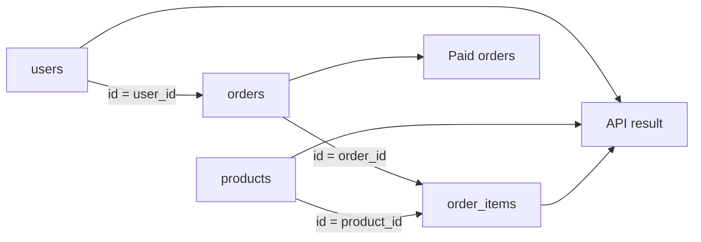

# 03- INNER JOIN

## Overview

`INNER JOIN` combines rows from two or more relations and returns only the row combinations for which the join condition evaluates to `TRUE`.

It is the most common JOIN type in transactional backend systems because normalized schemas routinely store related data across separate tables:

```text
users
  │
  └── orders
        │
        └── order_items
              │
              └── products
```

For example, an order usually stores `user_id` rather than copying the customer's email, name, and other attributes into every order row. An `INNER JOIN` reconstructs the related information when it is needed:

```sql
SELECT
    o.id AS order_id,
    u.email,
    o.total_amount
FROM orders AS o
INNER JOIN users AS u
    ON u.id = o.user_id;
```

The important semantic property is:

> An `INNER JOIN` removes rows that do not have a matching row on the other side.

This makes it appropriate when the relationship is required for the result being produced.

## Why INNER JOIN Exists

Relational databases encourage normalization so that related facts are stored independently and maintained consistently.

Consider:

```text
users

id | email
---+-------------------
1  | alice@example.com
2  | bob@example.com
3  | carol@example.com
```

and:

```text
orders

id  | user_id | total_amount
----+---------+-------------
101 | 1       | 125.00
102 | 1       | 80.00
103 | 2       | 210.00
```

The relationship is represented by:

```text
users.id = orders.user_id
```

An application endpoint such as:

```text
GET /orders/101
```

may need both order and customer data. Rather than issuing separate queries unnecessarily, a JOIN can retrieve the related rows in one database operation:

```sql
SELECT
    o.id,
    o.total_amount,
    u.email
FROM orders AS o
INNER JOIN users AS u
    ON u.id = o.user_id
WHERE o.id = $1;
```

## Basic Syntax

The standard form is:

```sql
SELECT
    column_list
FROM left_table AS l
INNER JOIN right_table AS r
    ON r.join_key = l.join_key
WHERE filtering_condition;
```

`INNER` is optional in most SQL implementations:

```sql
FROM orders AS o
JOIN users AS u
    ON u.id = o.user_id
```

is equivalent to:

```sql
FROM orders AS o
INNER JOIN users AS u
    ON u.id = o.user_id
```

Using `INNER JOIN` explicitly can improve readability when a query contains several different JOIN types.

## How INNER JOIN Works

Conceptually, an inner join evaluates combinations of rows and retains only those satisfying the join predicate.

Given:

```text
users

id | email
---+-------------------
1  | alice@example.com
2  | bob@example.com
3  | carol@example.com
```

and:

```text
orders

id  | user_id
----+--------
101 | 1
102 | 1
103 | 2
```

this query:

```sql
SELECT
    u.id AS user_id,
    o.id AS order_id
FROM users AS u
INNER JOIN orders AS o
    ON o.user_id = u.id;
```

returns:

```text
user_id | order_id
--------+---------
1       | 101
1       | 102
2       | 103
```

User `3` is absent because there is no matching order.

The output therefore represents **relationships that exist in both inputs**, not simply all rows from both tables.

## Join Condition

The `ON` clause defines how rows are matched.

The most common pattern is a primary-key/foreign-key relationship:

```sql
ON u.id = o.user_id
```

For composite relationships, multiple columns can participate:

```sql
INNER JOIN order_items AS oi
    ON oi.order_id = o.id
   AND oi.tenant_id = o.tenant_id
```

Additional predicates can also be part of the join:

```sql
INNER JOIN subscriptions AS s
    ON s.user_id = u.id
   AND s.status = 'active'
```

The distinction between the relationship predicate and additional filtering predicates should remain clear during query design.

## INNER JOIN and Relationship Cardinality

The number of output rows depends heavily on relationship cardinality.

| Relationship | Example | INNER JOIN behavior |
| --- | --- | --- |
| One-to-one | User → Profile | At most one matching profile per user |
| One-to-many | User → Orders | One user can produce multiple result rows |
| Many-to-one | Orders → User | Multiple orders can reference one user |
| Many-to-many | Users → Roles | A user can produce multiple rows |

Consider:

```text
User 1
 ├── Order 101
 ├── Order 102
 └── Order 103
```

Joining the user to orders produces three rows:

```text
User 1 | Order 101
User 1 | Order 102
User 1 | Order 103
```

This is not an accidental duplicate. Each row represents a different order relationship.

## Row Multiplication

A common production problem occurs when several one-to-many relationships are joined.

Suppose:

```text
User 1
 ├── Order 101
 └── Order 102

User 1
 ├── Payment 201
 └── Payment 202
```

This query:

```sql
SELECT
    u.id,
    o.id AS order_id,
    p.id AS payment_id
FROM users AS u
INNER JOIN orders AS o
    ON o.user_id = u.id
INNER JOIN payments AS p
    ON p.user_id = u.id;
```

can produce:

```text
order_id | payment_id
---------+-----------
101      | 201
101      | 202
102      | 201
102      | 202
```

The result contains:

```text
2 orders × 2 payments = 4 rows
```

This becomes particularly dangerous when aggregating:

```sql
SUM(o.total_amount)
```

or:

```sql
COUNT(o.id)
```

because the payment join can cause order values to be counted multiple times.

### Production Rule

Before adding a JOIN, explicitly determine:

```text
What is the grain of the result?

one row per user?
one row per order?
one row per order item?
one row per payment?
```

Then determine whether every JOIN preserves that grain.

## INNER JOIN vs LEFT JOIN

The primary difference is what happens to unmatched rows.

| Behavior | INNER JOIN | LEFT JOIN |
| --- | --- | --- |
| Matching rows | Returned | Returned |
| Unmatched left rows | Removed | Preserved |
| Unmatched right rows | Removed | Represented with `NULL` |
| Typical use | Required relationship | Optional relationship |
| Common example | Orders with valid users | All users, including users with no orders |

Example:

```sql
SELECT
    u.id,
    o.id AS order_id
FROM users AS u
INNER JOIN orders AS o
    ON o.user_id = u.id;
```

Only users with orders appear.

With:

```sql
SELECT
    u.id,
    o.id AS order_id
FROM users AS u
LEFT JOIN orders AS o
    ON o.user_id = u.id;
```

users without orders also appear with:

```text
order_id = NULL
```

Use `INNER JOIN` when an unmatched relationship should exclude the result row.

## INNER JOIN vs CROSS JOIN

A `CROSS JOIN` produces combinations without requiring a matching predicate.

Conceptually:

```text
A rows × B rows
```

If A contains 1,000 rows and B contains 10,000 rows, the potential result is:

```text
10,000,000 rows
```

An inner join generally restricts combinations through a predicate:

```sql
INNER JOIN b
    ON b.a_id = a.id
```

An accidental missing join predicate can therefore create a Cartesian product or otherwise produce an incorrect query.

Prefer explicit JOIN syntax and verify every relationship.

## INNER JOIN vs WHERE-Based Filtering

These queries can be equivalent for a simple inner join:

```sql
SELECT
    u.id,
    o.id
FROM users AS u
INNER JOIN orders AS o
    ON o.user_id = u.id
WHERE o.status = 'paid';
```

and:

```sql
SELECT
    u.id,
    o.id
FROM users AS u
INNER JOIN orders AS o
    ON o.user_id = u.id
   AND o.status = 'paid';
```

For an `INNER JOIN`, moving a predicate between `ON` and `WHERE` is often semantically equivalent when the predicate only references the joined rows and there are no special null-sensitive semantics.

However, the distinction becomes critical with outer joins.

For maintainability, keep the relationship in `ON` and general result filtering in `WHERE` unless there is a clear reason to combine them.

## Multi-Table INNER JOINs

Production queries frequently require several relationships:

```sql
SELECT
    o.id AS order_id,
    u.email,
    p.name AS product_name,
    oi.quantity
FROM orders AS o
INNER JOIN users AS u
    ON u.id = o.user_id
INNER JOIN order_items AS oi
    ON oi.order_id = o.id
INNER JOIN products AS p
    ON p.id = oi.product_id
WHERE o.status = 'paid';
```

Conceptually:



Every INNER JOIN introduces another required relationship. If any required relationship is missing, the corresponding result row disappears.

For example, if an order has no matching `order_items` row, that order will not survive the third JOIN.

## Missing Relationships

An inner join can unintentionally hide data.

Suppose an operationally important order exists:

```text
orders.id = 5001
orders.user_id = 42
```

but the corresponding user row is missing due to corrupted data or a broken migration.

This query:

```sql
SELECT
    o.id,
    u.email
FROM orders AS o
INNER JOIN users AS u
    ON u.id = o.user_id
WHERE o.id = 5001;
```

returns zero rows.

That does not mean the order does not exist. It means the **joined result** does not contain a matching user.

When diagnosing missing records, query the base table first:

```sql
SELECT *
FROM orders
WHERE id = $1;
```

Then inspect each relationship independently.

## INNER JOIN and NULL

A standard equality predicate does not match `NULL` values:

```sql
ON a.code = b.code
```

If:

```text
a.code = NULL
b.code = NULL
```

the comparison evaluates to `UNKNOWN`, not `TRUE`.

Therefore those rows do not match an inner join.

If the business rule considers two NULL values equivalent, PostgreSQL provides:

```sql
ON a.code IS NOT DISTINCT FROM b.code
```

Use null-safe comparison only when that behavior matches the domain model.

## Self JOIN

An inner join can join a table to itself.

This is useful for hierarchical or relational structures.

Example:

```text
employees

id | name  | manager_id
---+-------+-----------
1  | Alice | NULL
2  | Bob   | 1
3  | Carol | 1
```

Query:

```sql
SELECT
    employee.name AS employee_name,
    manager.name AS manager_name
FROM employees AS employee
INNER JOIN employees AS manager
    ON manager.id = employee.manager_id;
```

Result:

```text
employee_name | manager_name
--------------+-------------
Bob           | Alice
Carol         | Alice
```

Alice is excluded because she has no manager.

A `LEFT JOIN` would be appropriate if Alice also needed to appear.

## Non-Equality INNER JOINs

An inner join does not have to use equality.

For example:

```sql
SELECT
    o.id,
    d.discount_percent
FROM orders AS o
INNER JOIN discount_rules AS d
    ON o.total_amount >= d.minimum_amount
   AND o.total_amount < d.maximum_amount;
```

This can implement range-based relationships.

However, non-equality joins can be more expensive and may have fewer indexing opportunities than equality joins.

Use them when the relationship genuinely depends on a range or other predicate.

## INNER JOIN and Aggregation

Consider:

```sql
SELECT
    u.id,
    COUNT(o.id) AS order_count,
    SUM(o.total_amount) AS order_value
FROM users AS u
INNER JOIN orders AS o
    ON o.user_id = u.id
GROUP BY u.id;
```

Only users with at least one matching order appear.

This differs from:

```sql
SELECT
    u.id,
    COUNT(o.id) AS order_count
FROM users AS u
LEFT JOIN orders AS o
    ON o.user_id = u.id
GROUP BY u.id;
```

The second query can return users whose order count is zero.

The JOIN type therefore affects not only the row set but also aggregate semantics.

## INNER JOIN and DISTINCT

If a query returns multiple rows per parent, developers sometimes add:

```sql
SELECT DISTINCT u.id
```

to remove repeated parent IDs.

This can be valid when the actual requirement is:

> Return each user who has at least one matching order.

But if the requirement is only existence, `EXISTS` may communicate the intent more directly:

```sql
SELECT
    u.id
FROM users AS u
WHERE EXISTS (
    SELECT 1
    FROM orders AS o
    WHERE o.user_id = u.id
);
```

Do not use `DISTINCT` merely to hide an incorrectly understood relationship.

## Query Planner and Execution

The SQL statement describes the desired result, not necessarily the physical execution strategy.

For example:

```sql
SELECT
    o.id,
    u.email
FROM orders AS o
INNER JOIN users AS u
    ON u.id = o.user_id
WHERE o.id = $1;
```

A PostgreSQL optimizer might choose a plan conceptually similar to:

```text
Index lookup on orders.id
        │
        ▼
   One order row
        │
        ▼
Index lookup on users.id
        │
        ▼
   One user row
        │
        ▼
      Result
```

For a broad query, it might choose a hash join or another strategy.

The SQL does not dictate whether the database uses:

- Nested loop.
- Hash join.
- Merge join.
- Sequential scan.
- Index scan.
- Bitmap scan.

The optimizer chooses based on estimated cost.

## Nested Loop and INNER JOIN

A nested loop can be highly effective when the outer relation is small and the inner relation has an efficient access path.

For example:

```sql
SELECT
    o.id,
    u.email
FROM orders AS o
INNER JOIN users AS u
    ON u.id = o.user_id
WHERE o.id = $1;
```

If `orders.id` is unique, the database may find one order and then perform a single indexed lookup into `users`.

Conceptually:

```text
1 order
   │
   └── index lookup → 1 user
```

This is very different from repeatedly scanning the entire users table.

## Hash Join

For larger equality joins, a hash join can be efficient.

Conceptually:

```text
Users
  │
  ▼
Build hash table
  │
  │
Orders
  │
  ▼
Probe hash table
  │
  ▼
Matching rows
```

Hash joins can require significant memory. Large hash operations may spill to temporary storage when available memory is insufficient.

For performance diagnosis, inspect the actual execution plan rather than assuming a particular algorithm is being used.

## Indexes for INNER JOINs

Suppose:

```sql
CREATE TABLE orders (
    id bigint PRIMARY KEY,
    user_id bigint NOT NULL REFERENCES users(id),
    created_at timestamptz NOT NULL
);
```

An index on the foreign-key column may improve queries that locate orders by user:

```sql
CREATE INDEX idx_orders_user_id
ON orders (user_id);
```

For:

```sql
SELECT
    o.id,
    o.created_at
FROM users AS u
INNER JOIN orders AS o
    ON o.user_id = u.id
WHERE u.id = $1;
```

the database can potentially:

```text
users primary key
        │
        ▼
   one user row
        │
        ▼
orders.user_id index
        │
        ▼
 matching orders
```

Do not assume every JOIN needs a new index. Indexes have:

- Storage costs.
- Insert/update/delete overhead.
- Maintenance costs.
- Cache implications.

The right index depends on actual access patterns.

## Foreign Keys and INNER JOINs

A foreign key establishes referential integrity:

```sql
CREATE TABLE orders (
    id bigint PRIMARY KEY,
    user_id bigint NOT NULL REFERENCES users(id)
);
```

This ensures referenced users satisfy the foreign-key constraint under the database's constraint semantics.

However, a foreign key does not universally mean the referencing column is indexed automatically.

For a frequently executed:

```sql
JOIN orders
    ON orders.user_id = users.id
```

evaluate whether:

```sql
CREATE INDEX idx_orders_user_id
ON orders(user_id);
```

is appropriate.

In PostgreSQL, this is especially relevant for parent-to-child lookups and operations affecting referenced rows.

## Type Compatibility

JOIN keys should normally use compatible data types.

Prefer:

```text
users.id        BIGINT
orders.user_id  BIGINT
```

over:

```text
users.id        BIGINT
orders.user_id  TEXT
```

Type mismatches can introduce implicit conversions, prevent efficient access paths, or produce unexpected behavior.

For related identifiers, use consistent types across the schema.

## INNER JOIN Performance

The major performance variables are:

- Number of rows entering the join.
- Join selectivity.
- Relationship cardinality.
- Available indexes.
- Data distribution.
- Statistics quality.
- Chosen join algorithm.
- Intermediate result size.
- Memory availability.
- Concurrent workload.

A useful optimization sequence is:

```text
Identify slow query
      ↓
Inspect actual execution plan
      ↓
Check estimated vs actual cardinality
      ↓
Check scans and join algorithm
      ↓
Check indexes and predicates
      ↓
Check intermediate result size
      ↓
Measure again
```

Avoid optimizing JOIN syntax without measuring the resulting execution plan.

## EXPLAIN ANALYZE

For PostgreSQL:

```sql
EXPLAIN (ANALYZE, BUFFERS)
SELECT
    o.id,
    u.email
FROM orders AS o
INNER JOIN users AS u
    ON u.id = o.user_id
WHERE o.created_at >= CURRENT_DATE - INTERVAL '7 days';
```

Important fields include:

| Field | What to investigate |
| --- | --- |
| `rows` | Actual rows produced |
| Estimated rows | Optimizer's expected cardinality |
| Join type | Nested loop, hash, merge |
| Scan type | Sequential, index, bitmap |
| Buffers | Memory/cache and I/O behavior |
| Execution time | Actual runtime |
| Temporary I/O | Potential memory pressure |
| Loops | Repeated execution of plan nodes |

A particularly important signal is:

```text
Estimated rows: 100
Actual rows:    2,000,000
```

A major estimation error can cause the optimizer to choose an inappropriate join strategy.

## Predicate Selectivity

Consider:

```sql
WHERE o.id = $1
```

versus:

```sql
WHERE o.status = 'completed'
```

If `id` is unique, the first predicate may reduce the input to one row.

If 90% of orders are completed, the second predicate does not reduce the input nearly as much.

Highly selective predicates can make indexed nested-loop strategies attractive, while broad datasets may favor hash or merge-based approaches.

The optimal plan depends on the complete query and data distribution.

## INNER JOIN in Backend APIs

A common REST endpoint might retrieve order details:

```text
GET /api/orders/{order_id}
```

The service could execute:

```sql
SELECT
    o.id,
    o.status,
    o.total_amount,
    o.created_at,
    u.id AS customer_id,
    u.email
FROM orders AS o
INNER JOIN users AS u
    ON u.id = o.user_id
WHERE o.id = $1;
```

The application receives a single relational result:

```text
order
 ├── id
 ├── status
 ├── total_amount
 ├── created_at
 └── customer
      ├── id
      └── email
```

This can reduce database round trips compared with separately querying the order and user.

However, query design should still consider:

- Response size.
- Index usage.
- Authorization.
- Cardinality.
- ORM behavior.
- Connection pool usage.

## Django

Django can generate INNER JOINs when traversing relationships.

For example:

```python
orders = (
    Order.objects
    .filter(user__email="alice@example.com")
)
```

This can generate SQL involving an inner join between `orders` and `users`.

When the application also needs the related user object, `select_related()` can avoid additional queries:

```python
orders = (
    Order.objects
    .select_related("user")
    .filter(status="paid")
)
```

Conceptually:

```text
Django ORM
    │
    ▼
SQL compiler
    │
    ▼
INNER JOIN
    │
    ▼
PostgreSQL
```

Always inspect generated SQL and query counts for performance-sensitive ORM code.

## FastAPI and SQLAlchemy

In a FastAPI service using SQLAlchemy, an explicit relationship query may look like:

```python
from sqlalchemy import select
from sqlalchemy.orm import Session

stmt = (
    select(Order.id, User.email, Order.total_amount)
    .join(User, User.id == Order.user_id)
    .where(Order.id == order_id)
)

result = session.execute(stmt).one_or_none()
```

The ORM or SQL toolkit ultimately sends SQL to the database. The important performance characteristics remain database-level:

- Join cardinality.
- Indexes.
- Execution plan.
- Predicate selectivity.
- Returned row count.

Changing ORM syntax does not remove the underlying relational costs.

## Security Considerations

JOINs can expose data that the calling user is not authorized to see.

A multi-tenant query should enforce tenant boundaries explicitly or through an appropriate database security model.

For example:

```sql
SELECT
    o.id,
    u.email,
    o.total_amount
FROM orders AS o
INNER JOIN users AS u
    ON u.id = o.user_id
WHERE o.tenant_id = $1
  AND u.tenant_id = $1
  AND o.id = $2;
```

The exact authorization design depends on the application's tenancy model.

Use parameterized queries:

```python
cursor.execute(
    """
    SELECT
        o.id,
        u.email,
        o.total_amount
    FROM orders AS o
    INNER JOIN users AS u
        ON u.id = o.user_id
    WHERE o.tenant_id = %s
      AND o.id = %s
    """,
    (tenant_id, order_id),
)
```

Do not concatenate untrusted values into SQL.

Also avoid:

```sql
SELECT *
```

when the joined table contains fields that should not be exposed to the API.

## Scalability Considerations

INNER JOINs are normal in OLTP workloads, but expensive joins can become a database bottleneck when repeated at high concurrency.

Watch for:

- Large tables joined on poorly selective predicates.
- Missing indexes.
- Large intermediate result sets.
- Repeated identical joins from high-traffic endpoints.
- ORM-generated N+1 queries.
- Reporting workloads competing with transactional traffic.

Possible strategies include:

- Query and index optimization.
- Read replicas for appropriate read workloads.
- Materialized views.
- Precomputed read models.
- Caching stable derived data.
- Separating analytical workloads from OLTP databases.

Do not automatically replace a JOIN with caching. First establish whether the query itself is inefficient or whether the workload requires architectural separation.

## Common Mistakes

### Forgetting the Join Predicate

Incorrect:

```sql
SELECT
    u.id,
    o.id
FROM users AS u
INNER JOIN orders AS o;
```

This can produce a Cartesian product or fail depending on the SQL dialect.

Correct:

```sql
SELECT
    u.id,
    o.id
FROM users AS u
INNER JOIN orders AS o
    ON o.user_id = u.id;
```

### Assuming Repeated Parent IDs Are Duplicates

If one user has five orders, an inner join can legitimately return five rows containing that user's ID.

Do not add `DISTINCT` until you understand the intended result grain.

### Joining Multiple One-to-Many Relations

Joining:

```text
users → orders
users → payments
```

in the same query can multiply rows.

Pre-aggregate, use `EXISTS`, or restructure the query when the required output grain does not require every relationship combination.

### Accidentally Filtering Out Required Data

Because inner joins remove unmatched rows, adding another required relationship can silently eliminate otherwise valid entities.

For example:

```sql
orders
JOIN users
JOIN addresses
JOIN payment_methods
```

returns only orders that have matching records in **all** four relationships.

Verify that each relationship is genuinely required for the result.

### Using INNER JOIN When LEFT JOIN Is Required

If the business requirement is:

> Return every customer, including customers with no orders.

then:

```sql
INNER JOIN orders
```

is incorrect.

Use:

```sql
LEFT JOIN orders
```

instead.

### Assuming the Query Runs in Written JOIN Order

The optimizer may reorder inner joins.

Do not attempt to optimize a query simply by rearranging JOIN clauses. Inspect the execution plan and understand why the optimizer selected its plan.

### Assuming an Index Guarantees Fast Execution

An index may not be used if:

- The predicate is not selective.
- The table is small.
- The optimizer estimates a sequential scan as cheaper.
- Type conversion interferes with the access path.
- The query needs most rows anyway.

Measure with `EXPLAIN (ANALYZE, BUFFERS)`.

### Using SELECT *

Avoid:

```sql
SELECT *
FROM orders AS o
INNER JOIN users AS u
    ON u.id = o.user_id;
```

Prefer:

```sql
SELECT
    o.id,
    o.status,
    o.total_amount,
    u.email
FROM orders AS o
INNER JOIN users AS u
    ON u.id = o.user_id;
```

This makes the API contract and data-access requirements explicit.

## Production Checklist

Before shipping an important INNER JOIN query, verify:

- [ ] The intended result grain is clearly defined.
- [ ] Every JOIN represents a required relationship.
- [ ] Join keys have compatible data types.
- [ ] Relationship cardinality is understood.
- [ ] Potential row multiplication has been evaluated.
- [ ] Required foreign-key indexes have been considered.
- [ ] Only required columns are selected.
- [ ] User-provided values are parameterized.
- [ ] Tenant and authorization boundaries are enforced.
- [ ] `EXPLAIN (ANALYZE, BUFFERS)` has been reviewed for performance-sensitive queries.
- [ ] Estimated and actual cardinalities are reasonably aligned.
- [ ] ORM-generated SQL has been inspected when applicable.
- [ ] Query latency has been measured under realistic data volume.

## Interview Traps

| Question | Correct reasoning |
| --- | --- |
| What does INNER JOIN return? | Only rows with a matching pair satisfying the join predicate. |
| Does INNER JOIN always increase row count? | No. It can reduce rows, preserve them, or multiply them depending on cardinality. |
| Why can one user appear multiple times? | One user can have multiple matching child rows. |
| What happens when there is no match? | The row is excluded from the result. |
| Is `INNER JOIN` different from `JOIN`? | In standard usage, `JOIN` without a qualifier means `INNER JOIN`. |
| Does JOIN order in SQL dictate physical execution order? | No. The optimizer can reorder inner joins. |
| Does a foreign key automatically create an index on the referencing column? | Not universally; verify the schema and database engine. |
| Why can `DISTINCT` be a bad fix for duplicates? | It can hide a cardinality problem and add unnecessary work. |
| When should LEFT JOIN be used instead? | When unmatched rows from the left relation must remain in the result. |
| Why can multiple INNER JOINs unexpectedly remove rows? | Every inner join requires a matching row, so missing data in any required relationship eliminates the result row. |
| When can an INNER JOIN be replaced with EXISTS? | When the requirement is only to test whether a related row exists rather than return relationship rows. |
| What determines INNER JOIN performance? | Cardinality, selectivity, indexes, statistics, join algorithm, memory, I/O, and workload. |

## Key Takeaways

- **INNER JOIN returns only rows with matching relationships, making it appropriate when the related entity is required for the result.**
- **Result cardinality depends on relationship shape; one-to-many and multiple one-to-many joins can multiply rows unexpectedly.**
- **The optimizer determines the physical join strategy, so production performance should be evaluated with actual execution plans rather than JOIN text order.**
- **Correct JOIN design requires explicit attention to cardinality, indexes, data types, `NULL` behavior, authorization boundaries, and result grain.**
- **Use INNER JOIN for required relationships, LEFT JOIN for optional relationships, and EXISTS when the requirement is only to test relationship existence.**