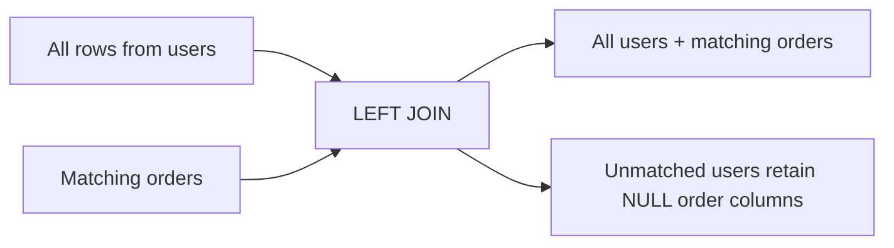

# 04- LEFT JOIN

## Overview

`LEFT JOIN`, also called `LEFT OUTER JOIN`, combines rows from two relations while preserving **every row from the left relation**. When a left-side row has no matching row on the right, the right-side columns are returned as `NULL`.

The core behavior is:

> Return every left-side row, plus matching right-side data when it exists.

For example:

```sql
SELECT
    u.id,
    u.email,
    o.id AS order_id,
    o.total_amount
FROM users AS u
LEFT JOIN orders AS o
    ON o.user_id = u.id;
```

If a user has no orders, the user still appears:

```text
id | email              | order_id | total_amount
---+--------------------+----------+-------------
1  | alice@example.com  | 101      | 125.00
1  | alice@example.com  | 102      | 80.00
2  | bob@example.com    | NULL     | NULL
```

This makes `LEFT JOIN` fundamental for reporting, dashboards, optional relationships, reconciliation queries, and APIs where the absence of related data is itself meaningful.

## Why LEFT JOIN Exists

An `INNER JOIN` answers:

> Which rows have a matching relationship?

A `LEFT JOIN` answers:

> What exists on the left, and what related information exists if available?

Consider a customer management API:

```text
GET /api/customers
```

The API may need to return every customer, including customers who have never placed an order.

Using:

```sql
INNER JOIN orders
```

would silently remove customers without orders.

Using:

```sql
LEFT JOIN orders
```

preserves them and represents the missing relationship with `NULL`.

This distinction is a **result-set requirement**, not merely a syntax preference.

## Basic Syntax

The standard form is:

```sql
SELECT
    left_columns,
    right_columns
FROM left_table AS l
LEFT JOIN right_table AS r
    ON r.foreign_key = l.primary_key;
```

`LEFT OUTER JOIN` is equivalent:

```sql
FROM users AS u
LEFT OUTER JOIN orders AS o
    ON o.user_id = u.id;
```

The `OUTER` keyword is optional.

## How LEFT JOIN Works

Suppose the tables contain:

```text
users

id | name
---+-------
1  | Alice
2  | Bob
3  | Carol
```

and:

```text
orders

id  | user_id
----+--------
101 | 1
102 | 1
103 | 2
```

Query:

```sql
SELECT
    u.id AS user_id,
    u.name,
    o.id AS order_id
FROM users AS u
LEFT JOIN orders AS o
    ON o.user_id = u.id;
```

Result:

```text
user_id | name  | order_id
--------+-------+---------
1       | Alice | 101
1       | Alice | 102
2       | Bob   | 103
3       | Carol | NULL
```

The database preserves all rows from `users`.

For Carol, no matching order exists, so the right-side columns become `NULL`.

Conceptually:



## LEFT JOIN vs INNER JOIN

| Behavior | `INNER JOIN` | `LEFT JOIN` |
| --- | --- | --- |
| Matching left rows | Returned | Returned |
| Unmatched left rows | Removed | Preserved |
| Unmatched right columns | Not applicable | `NULL` |
| Primary purpose | Required relationship | Optional relationship |
| Typical use | Orders with valid customers | All customers, including those without orders |
| Existence detection | Matching rows only | Matching and missing relationships |

The choice should be driven by the business question.

## LEFT JOIN and Optional Relationships

A common use case is an optional one-to-one relationship.

Suppose:

```text
users
 ├── id
 └── email

user_profiles
 ├── user_id
 └── avatar_url
```

Not every user may have a profile.

```sql
SELECT
    u.id,
    u.email,
    p.avatar_url
FROM users AS u
LEFT JOIN user_profiles AS p
    ON p.user_id = u.id;
```

Users without profiles still appear:

```text
id | email             | avatar_url
---+-------------------+-----------
1  | alice@example.com | /a.jpg
2  | bob@example.com   | NULL
```

This is preferable to issuing a separate query for every user.

## LEFT JOIN and One-to-Many Relationships

A one-to-many relationship can produce multiple rows for the same left-side entity.

```sql
SELECT
    u.id AS user_id,
    o.id AS order_id
FROM users AS u
LEFT JOIN orders AS o
    ON o.user_id = u.id;
```

If Alice has three orders:

```text
user_id | order_id
--------+---------
1       | 101
1       | 102
1       | 103
```

If Bob has no orders:

```text
user_id | order_id
--------+---------
2       | NULL
```

The `NULL` row is how the result preserves Bob.

It does **not** mean there is an actual order whose ID is `NULL`.

## LEFT JOIN and Result Grain

Before using a LEFT JOIN, define the intended grain of the result.

Examples:

```text
one row per user
one row per order
one row per product
one row per customer/month
```

A query intended to return one row per user can accidentally become one row per order:

```sql
SELECT
    u.id,
    o.id
FROM users AS u
LEFT JOIN orders AS o
    ON o.user_id = u.id;
```

This is correct if the result represents user-order relationships.

It is incorrect if the API requires exactly one row per user.

When the required grain is one row per parent, consider aggregation or an existence predicate instead.

## LEFT JOIN with Aggregation

Suppose the requirement is:

> Return every customer and the number of orders they have.

Use:

```sql
SELECT
    u.id,
    u.email,
    COUNT(o.id) AS order_count
FROM users AS u
LEFT JOIN orders AS o
    ON o.user_id = u.id
GROUP BY
    u.id,
    u.email;
```

Because `COUNT(o.id)` counts only non-`NULL` order IDs, customers without orders receive:

```text
order_count = 0
```

This is different from:

```sql
COUNT(*)
```

With a LEFT JOIN, `COUNT(*)` counts the preserved left-side row even when the right side has no match.

Therefore:

```sql
COUNT(o.id)
```

is usually the correct expression when counting matched child rows.

## LEFT JOIN and SUM

For numeric aggregates, unmatched rows can result in `NULL`.

For example:

```sql
SELECT
    u.id,
    SUM(o.total_amount) AS total_spend
FROM users AS u
LEFT JOIN orders AS o
    ON o.user_id = u.id
GROUP BY u.id;
```

A user with no orders may receive:

```text
total_spend = NULL
```

If the business meaning is zero spend, normalize the result:

```sql
SELECT
    u.id,
    COALESCE(SUM(o.total_amount), 0) AS total_spend
FROM users AS u
LEFT JOIN orders AS o
    ON o.user_id = u.id
GROUP BY u.id;
```

The distinction between `NULL` and `0` should be deliberate.

## The Critical ON vs WHERE Rule

One of the most important LEFT JOIN concepts is the difference between filtering in `ON` and filtering in `WHERE`.

Consider:

```sql
SELECT
    u.id,
    o.id AS order_id
FROM users AS u
LEFT JOIN orders AS o
    ON o.user_id = u.id
   AND o.status = 'paid';
```

This means:

> Keep every user, but only match paid orders.

A user with no paid orders remains:

```text
user_id | order_id
--------+---------
1       | 101
2       | NULL
```

Now compare:

```sql
SELECT
    u.id,
    o.id AS order_id
FROM users AS u
LEFT JOIN orders AS o
    ON o.user_id = u.id
WHERE o.status = 'paid';
```

The `WHERE` clause removes rows where:

```text
o.status IS NULL
```

Therefore users without matching orders are eliminated.

The query effectively behaves like an inner join for this predicate.

### Rule of Thumb

Use the `ON` clause when the condition determines **which right-side rows qualify as matches**.

Use the `WHERE` clause when the condition determines **which final result rows should survive**.

For outer joins, moving predicates between `ON` and `WHERE` can change the result set.

## Filtering the Right Table Correctly

Suppose the requirement is:

> Show every user and their active subscription, if one exists.

Correct:

```sql
SELECT
    u.id,
    u.email,
    s.id AS subscription_id
FROM users AS u
LEFT JOIN subscriptions AS s
    ON s.user_id = u.id
   AND s.status = 'active';
```

Incorrect if users without active subscriptions must remain:

```sql
SELECT
    u.id,
    u.email,
    s.id AS subscription_id
FROM users AS u
LEFT JOIN subscriptions AS s
    ON s.user_id = u.id
WHERE s.status = 'active';
```

The second query removes users whose subscription is missing or inactive.

## Finding Missing Relationships

LEFT JOIN is particularly useful for anti-join patterns.

For example:

> Find users who have never placed an order.

```sql
SELECT
    u.id,
    u.email
FROM users AS u
LEFT JOIN orders AS o
    ON o.user_id = u.id
WHERE o.id IS NULL;
```

The query preserves all users and then selects those for whom no order row was matched.

This is commonly called an **anti-join**.

## LEFT JOIN vs NOT EXISTS

The same requirement can often be expressed with `NOT EXISTS`:

```sql
SELECT
    u.id,
    u.email
FROM users AS u
WHERE NOT EXISTS (
    SELECT 1
    FROM orders AS o
    WHERE o.user_id = u.id
);
```

Both patterns can be correct.

| Requirement | Common approach |
| --- | --- |
| Need columns from matching child rows | `LEFT JOIN` |
| Need to identify missing child rows | `LEFT JOIN ... IS NULL` or `NOT EXISTS` |
| Need only existence/non-existence | Often `EXISTS` / `NOT EXISTS` |
| Need aggregation across children | `LEFT JOIN` + aggregate |
| Need optional related data | `LEFT JOIN` |

In PostgreSQL, the optimizer may transform logically equivalent formulations into similar execution strategies. Choose the form that communicates intent clearly, then measure performance.

## NULL Semantics

When a LEFT JOIN does not find a match, the right-side columns become `NULL`.

For example:

```sql
SELECT
    u.id,
    o.status
FROM users AS u
LEFT JOIN orders AS o
    ON o.user_id = u.id;
```

A user without orders produces:

```text
status = NULL
```

This has important consequences.

Incorrect:

```sql
WHERE o.status = NULL
```

Correct:

```sql
WHERE o.status IS NULL
```

SQL uses three-valued logic:

```text
TRUE
FALSE
UNKNOWN
```

The expression:

```sql
NULL = NULL
```

does not evaluate to `TRUE`.

## Detecting Missing vs NULL Data

Be careful when using nullable columns to detect whether a JOIN matched.

This can be ambiguous:

```sql
WHERE o.status IS NULL
```

because `status` itself might legitimately be nullable.

Prefer a non-nullable key from the right table:

```sql
WHERE o.id IS NULL
```

if `o.id` is a primary key.

This makes the anti-join intent unambiguous:

```text
No matching order row exists.
```

rather than:

```text
A matching order exists, but its status happens to be NULL.
```

## LEFT JOIN with Multiple Tables

Consider:

```text
users
  │
  ├── profiles
  │
  └── orders
        │
        └── order_items
```

A query might be:

```sql
SELECT
    u.id,
    u.email,
    p.avatar_url,
    o.id AS order_id,
    oi.product_id
FROM users AS u
LEFT JOIN user_profiles AS p
    ON p.user_id = u.id
LEFT JOIN orders AS o
    ON o.user_id = u.id
LEFT JOIN order_items AS oi
    ON oi.order_id = o.id;
```

Every LEFT JOIN preserves the rows produced by everything to its left.

However, each one-to-many relationship can multiply rows.

If a user has:

```text
2 orders
3 items per order
```

the result may contain:

```text
2 × 3 = 6 rows
```

per user.

When several one-to-many relationships are combined, cardinality can grow rapidly.

## LEFT JOIN and Row Explosion

Consider:

```text
User
 ├── 3 orders
 └── 4 payments
```

This query:

```sql
SELECT
    u.id,
    o.id AS order_id,
    p.id AS payment_id
FROM users AS u
LEFT JOIN orders AS o
    ON o.user_id = u.id
LEFT JOIN payments AS p
    ON p.user_id = u.id;
```

can produce:

```text
3 × 4 = 12
```

combinations for that user.

This becomes dangerous for:

```sql
SUM(o.total_amount)
```

because each order may be repeated once for every payment.

### Safer Pattern

Aggregate each independent one-to-many relationship before joining:

```sql
WITH order_totals AS (
    SELECT
        user_id,
        SUM(total_amount) AS total_order_value
    FROM orders
    GROUP BY user_id
),
payment_totals AS (
    SELECT
        user_id,
        SUM(amount) AS total_payment_value
    FROM payments
    GROUP BY user_id
)
SELECT
    u.id,
    COALESCE(ot.total_order_value, 0) AS total_order_value,
    COALESCE(pt.total_payment_value, 0) AS total_payment_value
FROM users AS u
LEFT JOIN order_totals AS ot
    ON ot.user_id = u.id
LEFT JOIN payment_totals AS pt
    ON pt.user_id = u.id;
```

Each derived relation now has one row per user, so the final JOIN preserves the intended grain.

## LEFT JOIN and DISTINCT

Using:

```sql
SELECT DISTINCT u.id
```

can remove repeated IDs, but it should not be the default response to row multiplication.

`DISTINCT` can:

- Hide an incorrect result grain.
- Require additional sorting or hashing.
- Increase memory usage.
- Increase execution time.

First understand why multiple rows exist.

If the requirement is simply:

> Return users who have at least one matching order.

prefer:

```sql
SELECT
    u.id
FROM users AS u
WHERE EXISTS (
    SELECT 1
    FROM orders AS o
    WHERE o.user_id = u.id
);
```

## LEFT JOIN with Conditions on Both Tables

Consider a multi-tenant application:

```sql
SELECT
    u.id,
    o.id AS order_id
FROM users AS u
LEFT JOIN orders AS o
    ON o.user_id = u.id
   AND o.tenant_id = u.tenant_id
WHERE u.tenant_id = $1;
```

The tenant restriction on the joined table ensures that only valid tenant relationships are matched.

The exact authorization model should depend on the application's database design. In security-sensitive systems, enforce tenant isolation through multiple layers where appropriate:

```text
API authorization
      ↓
Application query constraints
      ↓
Database constraints / RLS
      ↓
Data
```

Do not assume that a JOIN itself provides authorization.

## LEFT JOIN and Performance

LEFT JOIN performance depends on:

- Number of left-side rows.
- Number of matching right-side rows.
- Join selectivity.
- Join-key indexes.
- Predicate selectivity.
- Data distribution.
- Statistics.
- Join algorithm.
- Intermediate result size.
- Available memory.
- Concurrent workload.

A LEFT JOIN does not inherently mean "slow".

For example:

```sql
SELECT
    u.id,
    p.avatar_url
FROM users AS u
LEFT JOIN user_profiles AS p
    ON p.user_id = u.id
WHERE u.id = $1;
```

can be extremely efficient if:

```text
users.id
user_profiles.user_id
```

have suitable access paths.

## Indexing LEFT JOINs

Given:

```sql
CREATE TABLE user_profiles (
    user_id bigint PRIMARY KEY REFERENCES users(id),
    avatar_url text
);
```

the primary key already provides an index on `user_id`.

For a one-to-many relationship:

```sql
CREATE TABLE orders (
    id bigint PRIMARY KEY,
    user_id bigint NOT NULL REFERENCES users(id),
    created_at timestamptz NOT NULL
);
```

consider:

```sql
CREATE INDEX idx_orders_user_id
ON orders (user_id);
```

For queries filtering by tenant and joining by user, a composite index may be more appropriate:

```sql
CREATE INDEX idx_orders_tenant_user
ON orders (tenant_id, user_id);
```

Index design must follow actual query patterns rather than the presence of a JOIN alone.

## LEFT JOIN and Query Planner

The SQL text does not necessarily determine the physical execution order.

For PostgreSQL, inspect important queries with:

```sql
EXPLAIN (ANALYZE, BUFFERS)
SELECT
    u.id,
    o.id AS order_id
FROM users AS u
LEFT JOIN orders AS o
    ON o.user_id = u.id
WHERE u.created_at >= CURRENT_DATE - INTERVAL '30 days';
```

Investigate:

- Estimated versus actual row counts.
- Scan methods.
- Join strategy.
- Buffer hits and reads.
- Temporary I/O.
- Number of loops.
- Execution time.
- Intermediate cardinality.

The optimizer must preserve the semantics of the outer join, so outer joins can impose constraints on which transformations are legal. Do not assume that the optimizer can reorder a LEFT JOIN as freely as an INNER JOIN.

## LEFT JOIN in Django

Django can generate LEFT JOINs when traversing optional relationships in appropriate query expressions.

For example, annotations can express optional related data:

```python
from django.db.models import Count

customers = (
    Customer.objects
    .annotate(order_count=Count("orders"))
)
```

This allows customers with no orders to remain in the result and receive an order count of zero.

For loading a nullable single-valued relationship, `select_related()` can also generate an appropriate outer join where required by the relationship semantics.

Always verify:

```python
print(customers.query)
```

for complex ORM queries and use Django's query inspection/profiling tools when performance matters.

## LEFT JOIN in FastAPI / SQLAlchemy

With SQLAlchemy:

```python
from sqlalchemy import select

stmt = (
    select(User.id, User.email, Order.id.label("order_id"))
    .join(
        Order,
        Order.user_id == User.id,
        isouter=True,
    )
)

rows = session.execute(stmt).all()
```

`isouter=True` represents a LEFT OUTER JOIN.

The database still determines the physical execution strategy. The application framework does not eliminate the relational cost of the join.

## Practical Backend Example

Suppose an administration endpoint needs to display:

```text
Customer
Last order
Order status
```

including customers who have never ordered.

A naive inner join:

```sql
SELECT
    u.id,
    u.email,
    o.id AS order_id
FROM users AS u
INNER JOIN orders AS o
    ON o.user_id = u.id;
```

is wrong because customers without orders disappear.

A LEFT JOIN preserves the customer:

```sql
SELECT
    u.id,
    u.email,
    o.id AS order_id
FROM users AS u
LEFT JOIN orders AS o
    ON o.user_id = u.id;
```

However, this returns **all orders**, not necessarily the last order.

For PostgreSQL, one option is a lateral join:

```sql
SELECT
    u.id,
    u.email,
    o.id AS last_order_id,
    o.created_at AS last_order_at
FROM users AS u
LEFT JOIN LATERAL (
    SELECT
        o.id,
        o.created_at
    FROM orders AS o
    WHERE o.user_id = u.id
    ORDER BY o.created_at DESC, o.id DESC
    LIMIT 1
) AS o
    ON TRUE;
```

This preserves users without orders while retrieving at most one latest order per user.

For high-traffic endpoints, ensure the access pattern is supported by an appropriate index, such as:

```sql
CREATE INDEX idx_orders_user_created
ON orders (user_id, created_at DESC, id DESC);
```

Validate the actual plan and workload before deploying the optimization.

## Production Considerations

### Reliability

A LEFT JOIN is often appropriate when missing related data is a valid business state.

For example:

```text
Customer exists
Order does not exist
```

should not necessarily be treated as an error.

Design API serialization accordingly:

```json
{
  "id": 42,
  "email": "customer@example.com",
  "last_order": null
}
```

Avoid converting valid database `NULL` values into misleading defaults unless the API contract explicitly requires it.

### Scalability

Watch for row multiplication.

A query that is fast with:

```text
10,000 users
```

may become expensive with:

```text
100 million users
```

especially when each user has many child rows.

Control cardinality with:

- Selective predicates.
- Appropriate indexes.
- Pre-aggregation.
- Existence predicates.
- Pagination.
- Materialized views where justified.
- Dedicated read models for complex high-volume workloads.

### Monitoring

For important LEFT JOIN queries, monitor:

- Query latency.
- Rows returned.
- Rows examined.
- Database CPU.
- Buffer reads.
- Temporary I/O.
- Lock waits.
- Connection pool utilization.
- Query frequency.

A query that takes 100 ms once per minute may be harmless.

The same query taking 100 ms at 5,000 requests per second can become a major database bottleneck.

### Cost

In cloud environments such as AWS, inefficient joins can increase:

- Database CPU consumption.
- Provisioned database capacity requirements.
- Read-replica load.
- Storage I/O.
- Cache pressure.

Query optimization can therefore reduce infrastructure cost, not only latency.

## Common Mistakes and Pitfalls

### Filtering the Right Table in WHERE

Problem:

```sql
FROM users AS u
LEFT JOIN orders AS o
    ON o.user_id = u.id
WHERE o.status = 'paid';
```

This removes users without matching orders.

If the intent is to preserve all users and only match paid orders:

```sql
FROM users AS u
LEFT JOIN orders AS o
    ON o.user_id = u.id
   AND o.status = 'paid';
```

### Using the Wrong Column for IS NULL

Avoid:

```sql
WHERE o.status IS NULL
```

when `status` is nullable.

Prefer:

```sql
WHERE o.id IS NULL
```

when `id` is guaranteed non-null for real order rows.

### Assuming LEFT JOIN Produces One Row per Left Row

It does not.

One left row can match many right rows:

```text
1 user
  ↓
100 orders
  ↓
100 result rows
```

The left row is preserved, but its relationships can multiply the output.

### Using COUNT(*)

This:

```sql
COUNT(*)
```

counts the preserved left-side row even when no right-side match exists.

For counting matching child entities, prefer:

```sql
COUNT(o.id)
```

when `o.id` is non-null for actual child rows.

### Using DISTINCT to Hide Cardinality Problems

If a query unexpectedly returns thousands of repeated parent IDs, investigate the JOIN relationships before adding:

```sql
DISTINCT
```

The repetition may represent valid relationships or an incorrect query design.

### Joining Multiple One-to-Many Tables

This can create:

```text
orders × payments × items
```

row multiplication.

Pre-aggregate independent relationships or use separate existence checks where appropriate.

### Assuming NULL Means "No Row"

A nullable right-side column may legitimately contain `NULL`.

To reliably determine whether a LEFT JOIN found a row, test a non-nullable key such as the right table's primary key.

### Forgetting That Outer Joins Affect Aggregation

Changing:

```sql
INNER JOIN
```

to:

```sql
LEFT JOIN
```

can change aggregate results, especially with `COUNT`, `SUM`, `AVG`, and grouping.

Re-test business semantics after changing JOIN type.

## Interview Traps

| Question | Correct reasoning |
| --- | --- |
| What does LEFT JOIN preserve? | Every row from the left relation. |
| What happens when there is no right-side match? | Right-side columns become `NULL`. |
| Is LEFT JOIN the same as LEFT OUTER JOIN? | Yes. |
| Does LEFT JOIN always produce exactly one result row per left row? | No. Multiple right-side matches can multiply rows. |
| Why does `WHERE right_table.column = ...` often turn a LEFT JOIN into inner-join-like behavior? | Unmatched rows contain `NULL`, and the WHERE predicate rejects them. |
| Where should a right-side filtering condition go if unmatched left rows must remain? | Usually in the `ON` clause. |
| Why use `COUNT(right.id)` instead of `COUNT(*)`? | `COUNT(right.id)` ignores NULL and therefore counts actual matches. |
| How do you find left-side rows without matches? | `LEFT JOIN ... WHERE right.primary_key IS NULL` or `NOT EXISTS`. |
| Why can multiple LEFT JOINs create unexpectedly large results? | Independent one-to-many relationships can multiply each other. |
| Does LEFT JOIN always perform worse than INNER JOIN? | No. Performance depends on the query, data, indexes, statistics, and execution plan. |
| Can LEFT JOIN predicates be moved freely between ON and WHERE? | No. With outer joins, moving predicates can change semantics. |
| Why is `right.id IS NULL` safer than `right.status IS NULL` for anti-joins? | The primary key identifies whether a right-side row exists and is normally non-null. |

## Production Checklist

Before shipping a LEFT JOIN query, verify:

- [ ] The left-side rows that must always remain are clearly identified.
- [ ] The right-side relationship is genuinely optional.
- [ ] The intended result grain is defined.
- [ ] One-to-many cardinality has been evaluated.
- [ ] Multiple one-to-many relationships cannot accidentally multiply aggregates.
- [ ] Right-side filters are placed in `ON` or `WHERE` according to intended semantics.
- [ ] Anti-joins use a non-nullable right-side key where appropriate.
- [ ] `COUNT`, `SUM`, and other aggregates handle unmatched rows correctly.
- [ ] Join columns have compatible data types.
- [ ] Appropriate indexes have been evaluated.
- [ ] Tenant and authorization boundaries are enforced.
- [ ] Only required columns are selected.
- [ ] Complex queries have been tested with realistic data volumes.
- [ ] `EXPLAIN (ANALYZE, BUFFERS)` has been reviewed for performance-sensitive queries.
- [ ] ORM-generated SQL has been inspected when using Django or SQLAlchemy.

## Key Takeaways

- **LEFT JOIN preserves every row from the left relation and represents missing right-side relationships with `NULL`.**
- **The placement of predicates in `ON` versus `WHERE` is critical because a right-side WHERE filter can eliminate the unmatched rows that the LEFT JOIN was intended to preserve.**
- **LEFT JOIN does not guarantee one output row per left row; one-to-many relationships can multiply rows and distort aggregates.**
- **Use non-nullable right-side keys for anti-join checks, and use `COUNT(right.id)` rather than `COUNT(*)` when counting matched child rows.**
- **Production LEFT JOIN performance depends on cardinality, indexes, statistics, execution plans, and workload; validate important queries with realistic data and `EXPLAIN`.**