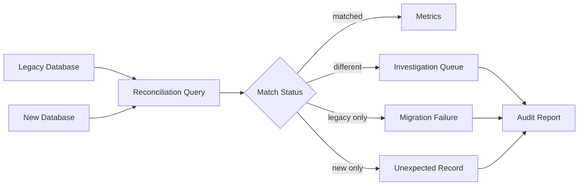

# 06- FULL OUTER JOIN

## Overview

`FULL OUTER JOIN` combines the behavior of `LEFT JOIN` and `RIGHT JOIN`. It returns:

- Every row from the left table.
- Every row from the right table.
- Matching rows combined into one result row.
- `NULL` values for the columns of whichever side has no match.

It is most useful when the requirement is to compare or reconcile **two complete datasets**, including records that exist on only one side.

```sql
SELECT
    u.id AS user_id,
    u.email,
    o.id AS order_id,
    o.total_amount
FROM users AS u
FULL OUTER JOIN orders AS o
    ON o.user_id = u.id;
```

Conceptually:

```text
                    FULL OUTER JOIN

        Left only     Matching      Right only
           │              │              │
           ▼              ▼              ▼
        u rows       u + o rows       o rows

        preserved     combined        preserved
```

Unlike `INNER JOIN`, which keeps only matches, a full outer join preserves unmatched records from **both** sides.

## Why FULL OUTER JOIN Exists

Some backend and data-engineering problems require visibility into both datasets independently.

For example, during a migration you may need to compare:

```text
legacy_customers
        │
        │ FULL OUTER JOIN
        ▼
new_customers
```

This allows you to identify:

- Customers existing in both systems.
- Customers missing from the new system.
- Customers that exist only in the new system.
- Differences between corresponding records.

A full outer join is therefore particularly valuable for:

- Data reconciliation.
- Migration validation.
- ETL verification.
- Synchronization checks.
- Financial reconciliation.
- Comparing snapshots.
- Auditing replicated datasets.
- Detecting orphaned records on either side.

## Basic Syntax

```sql
SELECT
    left_table.column,
    right_table.column
FROM left_table
FULL OUTER JOIN right_table
    ON left_table.key = right_table.key;
```

`FULL JOIN` is equivalent to `FULL OUTER JOIN` in PostgreSQL:

```sql
FROM left_table
FULL JOIN right_table
    ON left_table.key = right_table.key;
```

The `OUTER` keyword is optional.

## How FULL OUTER JOIN Works

Consider these tables:

```text
users

id | name
---+-------
1  | Alice
2  | Bob
3  | Carol
```

```text
orders

id  | user_id
----+--------
101 | 1
102 | 2
103 | 999
```

Query:

```sql
SELECT
    u.id AS user_id,
    u.name,
    o.id AS order_id,
    o.user_id AS order_user_id
FROM users AS u
FULL OUTER JOIN orders AS o
    ON o.user_id = u.id;
```

Result:

```text
user_id | name  | order_id | order_user_id
--------+-------+----------+--------------
1       | Alice | 101      | 1
2       | Bob   | 102      | 2
3       | Carol | NULL     | NULL
NULL    | NULL  | 103      | 999
```

There are three categories of output:

| Category | Example | Why it appears |
| --- | --- | --- |
| Left-only | Carol | No matching order |
| Matched | Alice + order 101 | Join condition matched |
| Right-only | Order 103 | No matching user |

## FULL OUTER JOIN vs Other JOINs

| JOIN | Preserves left rows | Preserves right rows | Unmatched rows from both sides |
| --- | ---: | ---: | ---: |
| `INNER JOIN` | No | No | No |
| `LEFT JOIN` | Yes | No | No |
| `RIGHT JOIN` | No | Yes | No |
| `FULL OUTER JOIN` | Yes | Yes | Yes |

The key distinction is preservation.

```text
INNER JOIN
A ∩ B

LEFT JOIN
A + (A ∩ B)

RIGHT JOIN
B + (A ∩ B)

FULL OUTER JOIN
A ∪ B
```

The set notation is useful conceptually, but SQL joins operate on rows and can produce multiple rows when the join relationship is one-to-many or many-to-many.

## FULL OUTER JOIN and NULLs

Unmatched rows receive `NULL` for columns from the missing side.

For a left-only row:

```text
user_id | name  | order_id
--------+-------+---------
3       | Carol | NULL
```

For a right-only row:

```text
user_id | name | order_id
--------+------+---------
NULL    | NULL | 103
```

This makes NULL detection central to reconciliation queries.

For example:

```sql
SELECT
    u.id AS user_id,
    o.id AS order_id
FROM users AS u
FULL OUTER JOIN orders AS o
    ON o.user_id = u.id
WHERE u.id IS NULL
   OR o.id IS NULL;
```

This returns records that exist on only one side.

Do not use:

```sql
WHERE u.id = NULL;
```

Use:

```sql
WHERE u.id IS NULL;
```

## Identifying Which Side a Row Came From

For reconciliation workflows, explicitly classify each result row.

```sql
SELECT
    u.id AS user_id,
    o.id AS order_id,
    CASE
        WHEN u.id IS NULL THEN 'right_only'
        WHEN o.id IS NULL THEN 'left_only'
        ELSE 'matched'
    END AS match_status
FROM users AS u
FULL OUTER JOIN orders AS o
    ON o.user_id = u.id;
```

This produces a useful operational result:

```text
user_id | order_id | match_status
--------+----------+-------------
1       | 101      | matched
2       | 102      | matched
3       | NULL     | left_only
NULL    | 103      | right_only
```

This pattern is often more useful than simply returning NULLs because downstream reconciliation code can process the result explicitly.

## Reconciliation Pattern

A common production use case is comparing two versions of the same logical dataset.

Suppose a migration has:

```text
legacy_accounts
new_accounts
```

Both contain:

```text
account_id
email
status
balance
```

A reconciliation query can be:

```sql
SELECT
    COALESCE(l.account_id, n.account_id) AS account_id,
    l.email AS legacy_email,
    n.email AS new_email,
    l.status AS legacy_status,
    n.status AS new_status,
    l.balance AS legacy_balance,
    n.balance AS new_balance,
    CASE
        WHEN l.account_id IS NULL THEN 'new_only'
        WHEN n.account_id IS NULL THEN 'legacy_only'
        WHEN l.email IS DISTINCT FROM n.email
          OR l.status IS DISTINCT FROM n.status
          OR l.balance IS DISTINCT FROM n.balance
            THEN 'different'
        ELSE 'matched'
    END AS reconciliation_status
FROM legacy_accounts AS l
FULL OUTER JOIN new_accounts AS n
    ON n.account_id = l.account_id;
```

This produces a single reconciliation dataset containing:

- Records missing from the new system.
- Records unexpectedly present only in the new system.
- Records present in both systems but with different values.
- Records that match.

## Why COALESCE Is Often Used

With a full outer join, the key exists on only one side for unmatched records.

For example:

```sql
SELECT
    COALESCE(l.account_id, n.account_id) AS account_id
FROM legacy_accounts AS l
FULL OUTER JOIN new_accounts AS n
    ON n.account_id = l.account_id;
```

`COALESCE()` returns the first non-NULL value.

Therefore:

```text
legacy account exists → l.account_id
new account exists only → n.account_id
both exist → l.account_id
```

This creates a unified identifier for downstream processing.

Be careful when the join key itself can legitimately be NULL. In reconciliation queries, the key should generally be a stable, non-null business or surrogate identifier.

## Comparing Rows Safely

A common mistake is comparing nullable columns with ordinary equality:

```sql
l.email <> n.email
```

If either value is `NULL`, the comparison can evaluate to `UNKNOWN` rather than `TRUE`.

PostgreSQL provides `IS DISTINCT FROM`:

```sql
l.email IS DISTINCT FROM n.email
```

and:

```sql
l.status IS DISTINCT FROM n.status
```

This treats NULL as a comparable state.

For example:

```text
legacy     new       IS DISTINCT FROM
--------   -------   -----------------
Alice      Alice     false
Alice      Bob       true
NULL       Alice     true
Alice      NULL      true
NULL       NULL      false
```

This is particularly valuable in production reconciliation queries.

## FULL OUTER JOIN with Filters

Predicate placement matters.

Consider:

```sql
SELECT
    u.id,
    o.id AS order_id
FROM users AS u
FULL OUTER JOIN orders AS o
    ON o.user_id = u.id
WHERE u.status = 'active';
```

The `WHERE` condition removes rows where `u.status` is NULL, which eliminates right-only rows.

Therefore, the query no longer behaves as a complete two-sided preservation query.

If the requirement is to match orders only against active users while preserving all orders and all users, the predicate belongs in the join condition:

```sql
SELECT
    u.id,
    u.status,
    o.id AS order_id
FROM users AS u
FULL OUTER JOIN orders AS o
    ON o.user_id = u.id
   AND u.status = 'active';
```

However, this changes what constitutes a match. An order belonging to an inactive user will appear as a right-only row.

For outer joins:

> Always decide whether a predicate defines the match or filters the final result.

## FULL OUTER JOIN and Aggregation

Full joins can produce multiple rows when either side contains multiple matching rows.

Suppose:

```text
customer_id = 42

left dataset:
3 rows

right dataset:
4 rows
```

A many-to-many match can produce:

```text
3 × 4 = 12 rows
```

before aggregation.

Do not assume that a full outer join produces at most one row per key.

If comparing aggregated datasets, aggregate each side to the desired grain before joining:

```sql
WITH legacy AS (
    SELECT
        account_id,
        SUM(amount) AS total_amount
    FROM legacy_transactions
    GROUP BY account_id
),
current_data AS (
    SELECT
        account_id,
        SUM(amount) AS total_amount
    FROM current_transactions
    GROUP BY account_id
)
SELECT
    COALESCE(l.account_id, c.account_id) AS account_id,
    l.total_amount AS legacy_total,
    c.total_amount AS current_total,
    CASE
        WHEN l.account_id IS NULL THEN 'current_only'
        WHEN c.account_id IS NULL THEN 'legacy_only'
        WHEN l.total_amount IS DISTINCT FROM c.total_amount
            THEN 'different'
        ELSE 'matched'
    END AS reconciliation_status
FROM legacy AS l
FULL OUTER JOIN current_data AS c
    ON c.account_id = l.account_id;
```

The critical design principle is:

> Join datasets at the grain required by the business comparison.

## FULL OUTER JOIN and Duplicate Keys

Suppose both datasets contain duplicate keys:

```text
legacy_accounts

account_id
----------
10
10
```

```text
new_accounts

account_id
----------
10
10
10
```

Joining on `account_id` can produce:

```text
2 × 3 = 6 rows
```

This is mathematically correct according to the join condition.

It is not necessarily correct for reconciliation.

Before joining, determine whether the join key should be:

- Unique.
- Composite.
- A surrogate key.
- A business identifier.
- A versioned identifier.

If both sides should contain one row per account, enforce or validate that invariant.

For example:

```sql
SELECT
    account_id,
    COUNT(*) AS row_count
FROM new_accounts
GROUP BY account_id
HAVING COUNT(*) > 1;
```

This can identify unexpected duplicate keys before reconciliation.

## FULL OUTER JOIN vs UNION

A full outer join and a `UNION` solve fundamentally different problems.

`FULL OUTER JOIN` combines **columns from related rows**:

```sql
SELECT
    a.id,
    a.value,
    b.value
FROM a
FULL OUTER JOIN b
    ON a.id = b.id;
```

`UNION` combines **rows from compatible result sets**:

```sql
SELECT id, value
FROM a

UNION

SELECT id, value
FROM b;
```

| Requirement | Operator |
| --- | --- |
| Match records using a key | `JOIN` |
| Combine columns from related records | `JOIN` |
| Preserve unmatched records from both sides | `FULL OUTER JOIN` |
| Append rows from two compatible datasets | `UNION` |
| Remove duplicate rows from appended datasets | `UNION` |
| Preserve duplicates while appending | `UNION ALL` |

Do not use `UNION` as a replacement for a join merely because both tables need to appear in the output.

## FULL OUTER JOIN vs LEFT JOIN + RIGHT JOIN

Conceptually, a full outer join can be approximated using two outer-join queries and a set operator:

```sql
SELECT
    u.id AS user_id,
    o.id AS order_id
FROM users AS u
LEFT JOIN orders AS o
    ON o.user_id = u.id

UNION ALL

SELECT
    u.id AS user_id,
    o.id AS order_id
FROM orders AS o
LEFT JOIN users AS u
    ON u.id = o.user_id
WHERE u.id IS NULL;
```

The second query adds only right-side rows that were not already represented by the first query.

When the database supports `FULL OUTER JOIN`, prefer the native operator because it communicates the intent directly.

This fallback is useful when working with SQL engines that do not support native full outer joins.

## Database Compatibility

PostgreSQL supports:

```sql
FULL OUTER JOIN
```

Some database engines do not provide native FULL OUTER JOIN support.

When portability matters, verify the target database before relying on it.

A common compatibility strategy is:

```sql
LEFT JOIN
+
UNION ALL
+
unmatched right-side rows
```

The exact implementation should be validated against the target database because optimizer behavior and NULL semantics can differ across systems.

## PostgreSQL Execution and Performance

PostgreSQL can implement joins using different physical strategies depending on the query and available statistics.

For a production query, inspect the actual plan:

```sql
EXPLAIN (ANALYZE, BUFFERS)
SELECT
    COALESCE(l.account_id, n.account_id) AS account_id
FROM legacy_accounts AS l
FULL OUTER JOIN new_accounts AS n
    ON n.account_id = l.account_id;
```

Review:

- Estimated versus actual row counts.
- Join strategy.
- Sequential scans.
- Index usage.
- Hash-table memory requirements.
- Sort operations.
- Temporary disk usage.
- Buffer reads and hits.
- Execution time.
- Intermediate result size.

Full outer joins can be expensive because the database must account for unmatched rows from **both** inputs.

Do not assume an index automatically makes a full outer join fast. The optimizer chooses a plan based on cardinality, statistics, predicates, available memory, and estimated cost.

## Indexing Considerations

If the join condition is:

```sql
ON n.account_id = l.account_id
```

the join columns should have appropriate access paths when useful for the workload.

For example:

```sql
CREATE INDEX idx_legacy_accounts_account_id
ON legacy_accounts (account_id);

CREATE INDEX idx_new_accounts_account_id
ON new_accounts (account_id);
```

If `account_id` is already a primary key or has a suitable unique constraint, an additional index may be unnecessary.

For reconciliation workloads, also consider whether the tables are already sorted, partitioned, or materialized in a way that changes the optimal execution strategy.

Index based on actual workload and query plans rather than applying indexes mechanically.

## Production Reconciliation Architecture

A migration validation pipeline might look like:



A production reconciliation job should generally:

1. Establish a stable comparison key.
2. Restrict both datasets to the same logical time or snapshot.
3. Normalize values where appropriate.
4. Aggregate to a consistent grain.
5. Perform the full outer join.
6. Classify match status.
7. Persist or export discrepancies.
8. Emit metrics for operational visibility.
9. Investigate discrepancies before declaring the migration complete.

The most important requirement is **consistent snapshots**. Comparing data captured at different points in time can produce false discrepancies.

## FULL OUTER JOIN in Backend Services

For a synchronous REST or gRPC request, a large reconciliation full join is usually a poor choice.

For example, avoid exposing an endpoint that executes:

```sql
SELECT ...
FROM very_large_legacy_table
FULL OUTER JOIN very_large_current_table
    ON ...
```

on every request.

Instead, execute reconciliation asynchronously through a workflow such as:

```text
Celery / Kubernetes Job
        │
        ▼
PostgreSQL
        │
        ▼
Reconciliation Results
        │
        ├── Metrics
        ├── Audit table
        └── Report
```

A FastAPI or Django endpoint can then retrieve previously generated results rather than repeatedly performing an expensive full-dataset comparison.

For very large datasets, consider:

- Batch processing.
- Partition pruning.
- Incremental reconciliation.
- Materialized comparison tables.
- Snapshot identifiers.
- Warehouse-based processing.
- AWS analytics services where appropriate.

## Security Considerations

A full outer join can expose records that are absent from one side, including potentially sensitive information.

For example, a reconciliation query could expose:

- Deleted customer records.
- Legacy email addresses.
- Historical account identifiers.
- Financial values.
- Records belonging to another tenant.

Apply authorization and tenant filtering independently of the JOIN.

For a multi-tenant system:

```sql
SELECT
    COALESCE(l.account_id, n.account_id) AS account_id,
    l.balance AS legacy_balance,
    n.balance AS new_balance
FROM legacy_accounts AS l
FULL OUTER JOIN new_accounts AS n
    ON n.account_id = l.account_id
   AND n.tenant_id = l.tenant_id
WHERE COALESCE(l.tenant_id, n.tenant_id) = $1;
```

Parameterize application-supplied values rather than interpolating them into SQL.

A JOIN is a data-combination mechanism, not an authorization mechanism.

## Reliability and Operational Considerations

Reconciliation jobs should be designed to be repeatable.

Useful properties include:

- Deterministic comparison keys.
- Stable source snapshots.
- Idempotent execution.
- Persisted job identifiers.
- Auditable discrepancy records.
- Explicit reconciliation status.
- Retry-safe processing.
- Metrics and alerts.

For example, store:

```text
reconciliation_run_id
account_id
legacy_value
new_value
status
detected_at
```

This allows engineers to answer:

- Which run detected the discrepancy?
- When was it detected?
- Was it resolved?
- Did the discrepancy reappear?
- How many records remain unmatched?

For large migrations, do not rely exclusively on a single query execution result that disappears after the job finishes.

## Common Mistakes and Pitfalls

### Treating FULL OUTER JOIN Like INNER JOIN

This query:

```sql
FROM a
FULL OUTER JOIN b
    ON a.id = b.id
WHERE a.id IS NOT NULL
  AND b.id IS NOT NULL
```

effectively removes unmatched rows and behaves like an inner-match filter.

If unmatched rows are important, do not accidentally eliminate them in the `WHERE` clause.

### Using `=` with NULL During Comparison

Avoid:

```sql
a.value <> b.value
```

when either side can be NULL.

In PostgreSQL, prefer:

```sql
a.value IS DISTINCT FROM b.value
```

for null-safe difference detection.

### Assuming One Row Per Key

A full outer join preserves rows, but matching rows can multiply.

Always validate cardinality before using the output for:

- Financial totals.
- Migration counts.
- Billing calculations.
- Metrics.
- Automated remediation.

### Using DISTINCT to Hide Incorrect Results

Avoid:

```sql
SELECT DISTINCT ...
```

as a first response to unexpected duplicates.

First determine why the join produced multiple rows.

`DISTINCT` may conceal a data-model or join-key problem and can add sorting or hashing work.

### Comparing Different Snapshots

If one table represents 10:00 UTC and another represents 10:05 UTC, records created or updated during that interval can appear to be inconsistent.

For reliable reconciliation, compare compatible snapshots or define a clear cutoff.

### Joining Before Aggregating

If both datasets contain multiple rows per key, joining raw transactional data can create a Cartesian multiplication within each key.

Aggregate first when the comparison requires one row per business entity.

### Ignoring Data Type Differences

Migration comparisons can fail because logically equivalent values use different representations:

```text
integer vs bigint
timestamp vs timestamptz
NULL vs empty string
decimal scale differences
case differences in text
```

Normalize intentionally rather than treating every representation difference as a business discrepancy.

## Interview Traps

| Question | Correct answer |
| --- | --- |
| What does FULL OUTER JOIN preserve? | Every row from both tables. |
| What happens when a row has no match? | Columns from the missing side become `NULL`. |
| How is FULL OUTER JOIN different from INNER JOIN? | INNER JOIN returns only matching rows; FULL OUTER JOIN also preserves unmatched rows from both sides. |
| Is FULL OUTER JOIN equivalent to LEFT JOIN? | No. LEFT JOIN preserves only the left side; FULL OUTER JOIN preserves both sides. |
| When is FULL OUTER JOIN especially useful? | Reconciliation, migration validation, synchronization, and comparing complete datasets. |
| Can FULL OUTER JOIN multiply rows? | Yes. Multiple matches on either side can produce multiple result rows. |
| How do you identify left-only rows? | Test a non-nullable left-side key with `IS NOT NULL` while the right-side key is `NULL`. |
| How do you identify right-only rows? | Test a non-nullable right-side key with `IS NOT NULL` while the left-side key is `NULL`. |
| Why use `COALESCE()` with FULL OUTER JOIN? | To produce a unified value from either side when one side is NULL. |
| Why use `IS DISTINCT FROM` in PostgreSQL? | It performs NULL-safe comparison. |
| Is FULL OUTER JOIN inherently slow? | No, but it can require substantial work because unmatched rows from both inputs must be preserved. |
| Can `WHERE` predicates change outer-join semantics? | Yes. Predicates on nullable joined columns can eliminate unmatched rows. |
| Can FULL OUTER JOIN be emulated? | Yes, commonly with a LEFT JOIN combined with unmatched right-side rows using `UNION ALL`. |
| Is FULL OUTER JOIN the same as UNION? | No. JOINs combine columns based on relationships; UNION appends compatible rows. |

## Production Checklist

Before using a FULL OUTER JOIN, verify:

- [ ] Both datasets genuinely need to be preserved.
- [ ] The join key is well-defined and stable.
- [ ] The intended result grain is explicit.
- [ ] Duplicate keys have been checked.
- [ ] One-to-many or many-to-many multiplication is understood.
- [ ] NULL comparisons use appropriate semantics.
- [ ] `ON` and `WHERE` predicates preserve the intended outer-join behavior.
- [ ] Both datasets represent compatible snapshots or time ranges.
- [ ] Values are normalized before comparison where necessary.
- [ ] `COALESCE()` is used where a unified identifier is required.
- [ ] Aggregation occurs before joining when the comparison requires a coarser grain.
- [ ] Tenant and authorization boundaries are enforced independently.
- [ ] Large queries have been tested with production-scale data.
- [ ] `EXPLAIN (ANALYZE, BUFFERS)` has been reviewed for performance-sensitive workloads.
- [ ] Long-running reconciliation work is moved to asynchronous processing where appropriate.
- [ ] Reconciliation results are auditable and retry-safe.

## Key Takeaways

- **FULL OUTER JOIN preserves every row from both inputs, combining matches and representing unmatched records with `NULL`.**
- **Its strongest production use case is two-sided reconciliation: migrations, synchronization, audits, and dataset comparison.**
- **Join cardinality must be understood before aggregation because duplicate keys and many-to-many relationships can multiply rows.**
- **For PostgreSQL reconciliation, `COALESCE()` and `IS DISTINCT FROM` are particularly useful for unified identifiers and NULL-safe comparisons.**
- **Large full-join workloads should be treated as data-processing jobs rather than casually executed inside high-throughput API request paths.**